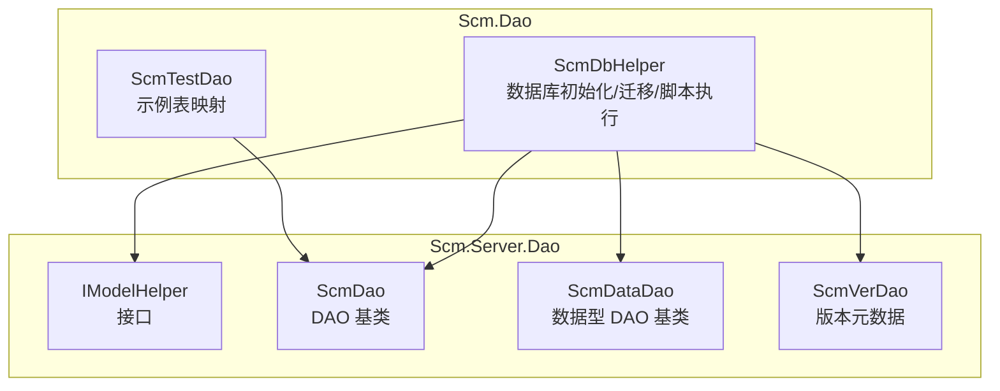
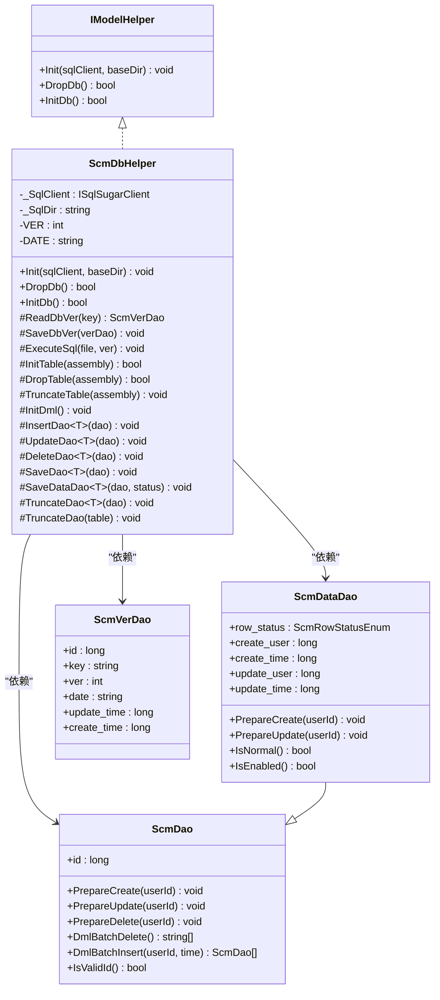
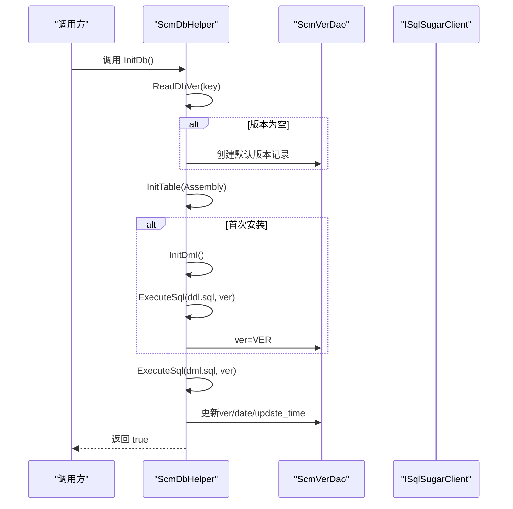
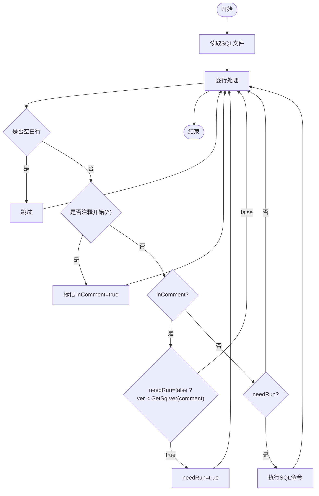
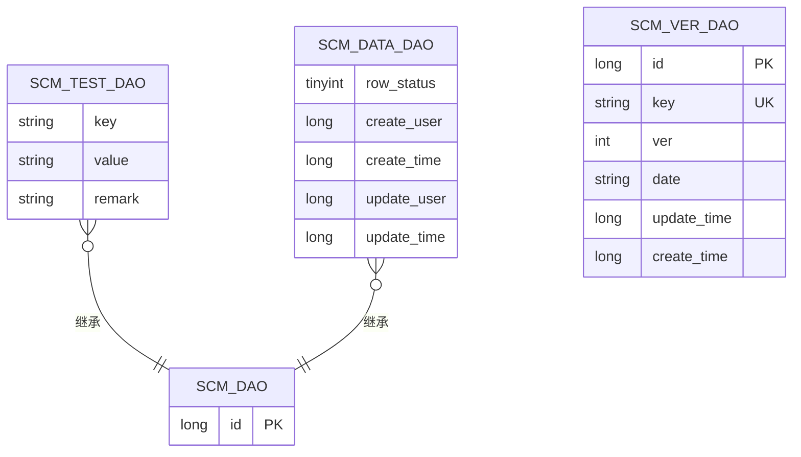
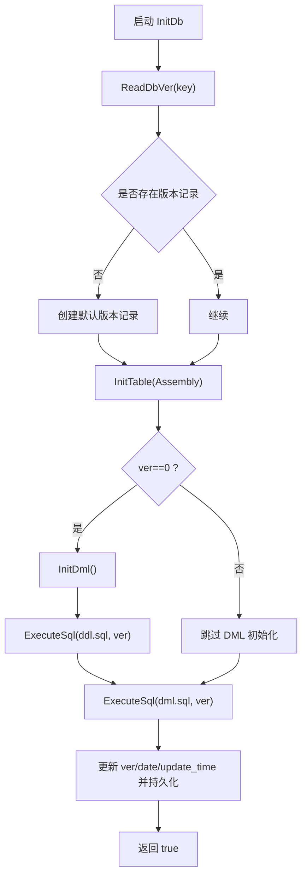
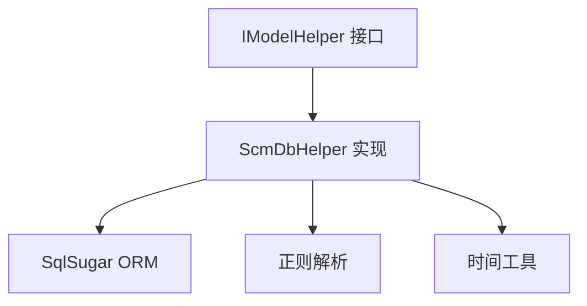

# ScmDbHelper 基础类设计

<cite>
**本文引用的文件**
- [ScmDbHelper.cs](file://Scm.Dao/ScmDbHelper.cs)
- [ScmModelHelper.cs](file://Scm.Server.Dao/ScmModelHelper.cs)
- [ScmDao.cs](file://Scm.Server.Dao/Dao/ScmDao.cs)
- [ScmDataDao.cs](file://Scm.Server.Dao/Dao/ScmDataDao.cs)
- [ScmVerDao.cs](file://Scm.Server.Dao/ScmVerDao.cs)
- [SamplesDbHelper.cs](file://Samples.Server.Dao/SamplesDbHelper.cs)
- [ScmTestDao.cs](file://Scm.Dao/ScmTestDao.cs)
</cite>

## 目录
1. [简介](#简介)
2. [项目结构](#项目结构)
3. [核心组件](#核心组件)
4. [架构总览](#架构总览)
5. [详细组件分析](#详细组件分析)
6. [依赖分析](#依赖分析)
7. [性能考虑](#性能考虑)
8. [故障排除指南](#故障排除指南)
9. [结论](#结论)

## 简介
本文档围绕 ScmDbHelper 基础类展开，系统阐述其作为所有 DAO 基础类的设计理念与实现原理，重点说明其对 IModelHelper 接口的实现意义；深入解析数据库初始化流程（DropDb、InitDb）、版本管理策略以及迁移脚本执行机制（ExecuteSql）。同时给出数据库版本控制流程图、初始化顺序说明，并结合数据模型映射与实体关系设计，完整呈现数据库表结构与 DTO/DAO 的对应关系。最后总结基础 DAO 操作方法（InsertDao、UpdateDao、DeleteDao、SaveDao）的实现原理与使用场景。

## 项目结构
ScmDbHelper 位于 Scm.Dao 子项目中，作为通用数据库初始化与迁移工具，向上提供 IModelHelper 接口能力，向下通过 SqlSugar 进行数据库操作。其直接依赖的类型包括：
- ScmDao：所有 DAO 的基类，提供 id 主键与生命周期准备方法
- ScmDataDao：带状态与审计字段的数据型 DAO 基类
- ScmVerDao：版本元数据表，用于记录各模块版本号与更新时间
- IModelHelper：统一的数据库初始化与清理接口

**图表来源**
- [ScmDbHelper.cs:16-34](file://Scm.Dao/ScmDbHelper.cs#L16-L34)
- [ScmModelHelper.cs:5-12](file://Scm.Server.Dao/ScmModelHelper.cs#L5-L12)
- [ScmDao.cs:6-28](file://Scm.Server.Dao/Dao/ScmDao.cs#L6-L28)
- [ScmDataDao.cs:7-54](file://Scm.Server.Dao/Dao/ScmDataDao.cs#L7-L54)
- [ScmVerDao.cs:7-40](file://Scm.Server.Dao/ScmVerDao.cs#L7-L40)
- [ScmTestDao.cs:7-23](file://Scm.Dao/ScmTestDao.cs#L7-L23)

**章节来源**
- [ScmDbHelper.cs:16-34](file://Scm.Dao/ScmDbHelper.cs#L16-L34)
- [ScmModelHelper.cs:5-12](file://Scm.Server.Dao/ScmModelHelper.cs#L5-L12)

## 核心组件
- ScmDbHelper：实现 IModelHelper 接口，负责数据库初始化、版本管理、DDL/DML 脚本执行、表结构与数据的初始化与迁移
- IModelHelper：定义统一的数据库初始化入口（InitDb）与清理入口（DropDb）
- ScmDao：DAO 基类，提供主键 id、PrepareCreate/Update/Delete 生命周期钩子
- ScmDataDao：扩展 ScmDao，增加 row_status、create_user/update_user、create_time/update_time 等审计字段
- ScmVerDao：版本元数据表，记录模块 key、当前版本号、发布日期、更新时间、创建时间
- 示例 DAO（ScmTestDao）：展示如何通过 SugarTable 注解映射到具体表

**章节来源**
- [ScmDbHelper.cs:16-34](file://Scm.Dao/ScmDbHelper.cs#L16-L34)
- [ScmModelHelper.cs:5-12](file://Scm.Server.Dao/ScmModelHelper.cs#L5-L12)
- [ScmDao.cs:6-28](file://Scm.Server.Dao/Dao/ScmDao.cs#L6-L28)
- [ScmDataDao.cs:7-54](file://Scm.Server.Dao/Dao/ScmDataDao.cs#L7-L54)
- [ScmVerDao.cs:7-40](file://Scm.Server.Dao/ScmVerDao.cs#L7-L40)
- [ScmTestDao.cs:7-23](file://Scm.Dao/ScmTestDao.cs#L7-L23)

## 架构总览
ScmDbHelper 以“接口 + 基类 + SqlSugar”的方式构建，职责清晰：
- IModelHelper：对外暴露统一的数据库初始化/清理能力
- ScmDbHelper：实现接口，封装数据库初始化、版本读写、脚本执行、表结构扫描与初始化等
- ScmDao/ScmDataDao：为所有业务 DAO 提供统一的生命周期与审计能力
- ScmVerDao：持久化版本元数据，支撑版本控制与迁移

**图表来源**
- [ScmModelHelper.cs:5-12](file://Scm.Server.Dao/ScmModelHelper.cs#L5-L12)
- [ScmDbHelper.cs:16-34](file://Scm.Dao/ScmDbHelper.cs#L16-L34)
- [ScmDao.cs:6-28](file://Scm.Server.Dao/Dao/ScmDao.cs#L6-L28)
- [ScmDataDao.cs:7-54](file://Scm.Server.Dao/Dao/ScmDataDao.cs#L7-L54)
- [ScmVerDao.cs:7-40](file://Scm.Server.Dao/ScmVerDao.cs#L7-L40)

## 详细组件分析

### IModelHelper 接口与 ScmDbHelper 实现
- 设计理念：通过 IModelHelper 抽象出数据库初始化与清理的统一入口，使不同模块（如核心模块、示例模块）可以按相同契约进行数据库准备
- ScmDbHelper 实现：
  - Init：注入 ISqlSugarClient 与 SQL 脚本目录
  - DropDb：扫描当前程序集中的 DAO 类，根据 SugarTable 注解识别真实表，存在则删除
  - InitDb：读取版本元数据 -> 初始化表结构 -> 首次安装时初始化 DML 与 DDL -> 执行 DML 脚本 -> 更新版本元数据

**章节来源**
- [ScmModelHelper.cs:5-12](file://Scm.Server.Dao/ScmModelHelper.cs#L5-L12)
- [ScmDbHelper.cs:30-83](file://Scm.Dao/ScmDbHelper.cs#L30-L83)

### 数据库初始化流程（DropDb 与 InitDb）
- DropDb 流程
  - 扫描当前程序集，筛选以 Dao 结尾且非抽象、非泛型的类
  - 过滤出实现了 ScmDao 泛型基类的类型
  - 读取 SugarTable 注解获取真实表名
  - 若表存在则删除
- InitDb 流程
  - 读取版本元数据（不存在则创建默认记录）
  - 初始化所有 DAO 对应的表结构
  - 若版本为 0，则先初始化 DML（内置基础数据），再执行 DDL 脚本
  - 执行 DML 脚本
  - 更新版本号、发布日期与更新时间并持久化

**图表来源**
- [ScmDbHelper.cs:51-83](file://Scm.Dao/ScmDbHelper.cs#L51-L83)
- [ScmDbHelper.cs:90-118](file://Scm.Dao/ScmDbHelper.cs#L90-L118)
- [ScmDbHelper.cs:324-338](file://Scm.Dao/ScmDbHelper.cs#L324-L338)

**章节来源**
- [ScmDbHelper.cs:41-83](file://Scm.Dao/ScmDbHelper.cs#L41-L83)
- [ScmDbHelper.cs:90-118](file://Scm.Dao/ScmDbHelper.cs#L90-L118)
- [ScmDbHelper.cs:324-338](file://Scm.Dao/ScmDbHelper.cs#L324-L338)

### 版本管理策略与脚本执行机制
- 版本元数据
  - 表名：scm_ver
  - 字段：key、ver、date、update_time、create_time
  - 作用：记录每个模块的版本号与发布时间，支持迁移与幂等执行
- 脚本执行 ExecuteSql
  - 逐行读取 SQL 文件
  - 忽略空白行
  - 识别以 /* 开始的注释块，内部通过正则匹配形如 ver: 数字 的版本标记
  - 仅当 ver 小于当前模块版本（VER）时才执行该行 SQL
  - 使用事务包裹，保证原子性
  - 支持多版本脚本在同一文件内混合

**图表来源**
- [ScmDbHelper.cs:213-262](file://Scm.Dao/ScmDbHelper.cs#L213-L262)
- [ScmDbHelper.cs:269-287](file://Scm.Dao/ScmDbHelper.cs#L269-L287)

**章节来源**
- [ScmDbHelper.cs:213-287](file://Scm.Dao/ScmDbHelper.cs#L213-L287)
- [ScmVerDao.cs:7-40](file://Scm.Server.Dao/ScmVerDao.cs#L7-L40)

### 数据模型映射与实体关系设计
- ScmDao：所有 DAO 的基类，提供唯一 id 主键与生命周期准备方法
- ScmDataDao：在 ScmDao 基础上增加 row_status、create_user/update_user、create_time/update_time 等审计字段
- ScmVerDao：版本元数据表，key 唯一标识模块，ver 记录当前版本
- 示例映射：ScmTestDao 通过 SugarTable 映射到表 scm_test

**图表来源**
- [ScmTestDao.cs:7-23](file://Scm.Dao/ScmTestDao.cs#L7-L23)
- [ScmDao.cs:6-28](file://Scm.Server.Dao/Dao/ScmDao.cs#L6-L28)
- [ScmDataDao.cs:7-54](file://Scm.Server.Dao/Dao/ScmDataDao.cs#L7-L54)
- [ScmVerDao.cs:7-40](file://Scm.Server.Dao/ScmVerDao.cs#L7-L40)

**章节来源**
- [ScmDao.cs:6-28](file://Scm.Server.Dao/Dao/ScmDao.cs#L6-L28)
- [ScmDataDao.cs:7-54](file://Scm.Server.Dao/Dao/ScmDataDao.cs#L7-L54)
- [ScmTestDao.cs:7-23](file://Scm.Dao/ScmTestDao.cs#L7-L23)
- [ScmVerDao.cs:7-40](file://Scm.Server.Dao/ScmVerDao.cs#L7-L40)

### 基础 DAO 操作方法
- InsertDao<T>：调用 PrepareCreate 后插入
- UpdateDao<T>：调用 PrepareUpdate 后更新
- DeleteDao<T>：直接删除
- SaveDao<T>：若存在则 Adapt 后更新，否则插入
- SaveDataDao<T>：针对数据型 DAO，默认状态可指定（如启用/正常）
- TruncateDao<T>/TruncateDao(table)：清空表或指定表

这些方法统一了业务 DAO 的 CRUD 行为，配合 ScmDao/ScmDataDao 的生命周期钩子，确保数据一致性与审计信息完整。

**章节来源**
- [ScmDbHelper.cs:125-170](file://Scm.Dao/ScmDbHelper.cs#L125-L170)
- [ScmDbHelper.cs:172-187](file://Scm.Dao/ScmDbHelper.cs#L172-L187)
- [ScmDbHelper.cs:194-206](file://Scm.Dao/ScmDbHelper.cs#L194-L206)
- [ScmDao.cs:14-28](file://Scm.Server.Dao/Dao/ScmDao.cs#L14-L28)
- [ScmDataDao.cs:35-54](file://Scm.Server.Dao/Dao/ScmDataDao.cs#L35-L54)

### 版本控制流程图与初始化顺序
- 核心流程
  - 读取版本元数据（不存在则创建）
  - 初始化所有 DAO 对应表结构
  - 首次安装：执行 DML 初始化与 DDL 脚本
  - 执行 DML 脚本（按版本过滤）
  - 更新版本元数据（ver、date、update_time）

**图表来源**
- [ScmDbHelper.cs:55-82](file://Scm.Dao/ScmDbHelper.cs#L55-L82)
- [ScmDbHelper.cs:324-338](file://Scm.Dao/ScmDbHelper.cs#L324-L338)
- [ScmDbHelper.cs:213-262](file://Scm.Dao/ScmDbHelper.cs#L213-L262)
- [ScmDbHelper.cs:90-118](file://Scm.Dao/ScmDbHelper.cs#L90-L118)

**章节来源**
- [ScmDbHelper.cs:51-83](file://Scm.Dao/ScmDbHelper.cs#L51-L83)
- [ScmDbHelper.cs:324-338](file://Scm.Dao/ScmDbHelper.cs#L324-L338)

### 示例：模块化扩展（SamplesDbHelper）
- 继承 ScmDbHelper，重写版本常量与脚本文件名
- 在 InitDb 中按模块约定执行 DDL/DML 脚本，并更新版本元数据
- 可用于演示如何为不同模块定制数据库初始化策略

**章节来源**
- [SamplesDbHelper.cs:6-59](file://Samples.Server.Dao/SamplesDbHelper.cs#L6-L59)

## 依赖分析
- 组件耦合
  - ScmDbHelper 依赖 IModelHelper 接口，面向接口编程，便于替换与扩展
  - 通过反射扫描程序集中的 DAO 类，降低硬编码耦合
  - 通过 SqlSugar 的 CodeFirst 与维护器完成表结构初始化与清空
- 外部依赖
  - SqlSugar：ORM 与数据库操作
  - 正则表达式：解析 SQL 注释中的版本标记
  - 时间工具：统一时间戳生成

**图表来源**
- [ScmModelHelper.cs:5-12](file://Scm.Server.Dao/ScmModelHelper.cs#L5-L12)
- [ScmDbHelper.cs:10-12](file://Scm.Dao/ScmDbHelper.cs#L10-L12)
- [ScmDbHelper.cs:269-287](file://Scm.Dao/ScmDbHelper.cs#L269-L287)

**章节来源**
- [ScmModelHelper.cs:5-12](file://Scm.Server.Dao/ScmModelHelper.cs#L5-L12)
- [ScmDbHelper.cs:10-12](file://Scm.Dao/ScmDbHelper.cs#L10-L12)
- [ScmDbHelper.cs:269-287](file://Scm.Dao/ScmDbHelper.cs#L269-L287)

## 性能考虑
- 批量初始化：InitTable 一次性初始化所有 DAO 对应表，减少多次往返
- 事务执行：ExecuteSql 使用事务包裹，避免部分执行导致的不一致
- 版本过滤：仅执行低于当前版本的脚本，避免重复执行与长事务
- 反射扫描：仅在初始化阶段进行，运行期无反射开销

## 故障排除指南
- 版本元数据异常
  - 现象：首次安装未执行 DML 或版本未更新
  - 排查：确认 scm_ver 表存在且 key 唯一；检查 ReadDbVer 是否抛出异常
- 脚本未执行
  - 现象：DDL/DML 脚本未生效
  - 排查：确认注释中包含 ver: 数字 格式；确认当前模块 VER 大于脚本版本；检查事务是否回滚
- 表结构未更新
  - 现象：新增/变更字段未生效
  - 排查：确认 InitTable 已扫描到对应 DAO；确认 SugarTable 注解正确；检查 CodeFirst 初始化日志

**章节来源**
- [ScmDbHelper.cs:90-118](file://Scm.Dao/ScmDbHelper.cs#L90-L118)
- [ScmDbHelper.cs:213-262](file://Scm.Dao/ScmDbHelper.cs#L213-L262)
- [ScmDbHelper.cs:324-338](file://Scm.Dao/ScmDbHelper.cs#L324-L338)

## 结论
ScmDbHelper 通过 IModelHelper 接口与 SqlSugar 的组合，提供了统一、可扩展、可版本化的数据库初始化与迁移能力。其设计强调：
- 接口驱动：面向 IModelHelper 编程，便于模块化扩展
- 版本化脚本：通过注释版本标记与事务执行，确保迁移幂等与可控
- 生命周期统一：借助 ScmDao/ScmDataDao 的 Prepare* 钩子，统一数据创建与更新行为
- 反射扫描：自动发现 DAO 并初始化表结构，降低手工维护成本