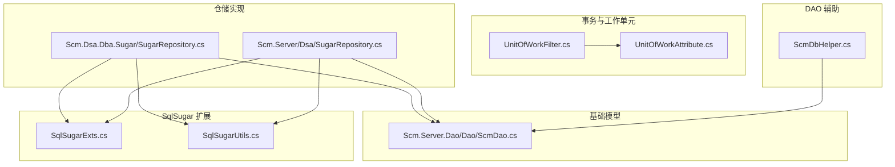
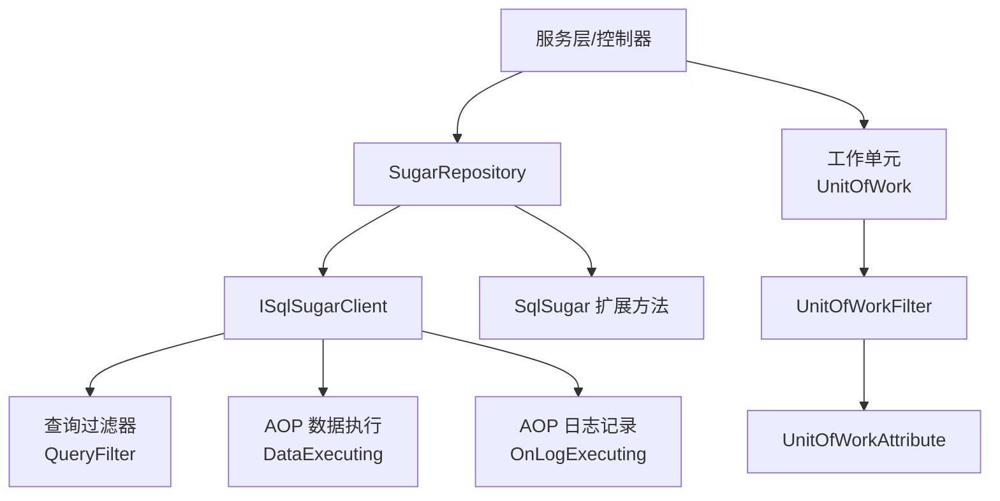
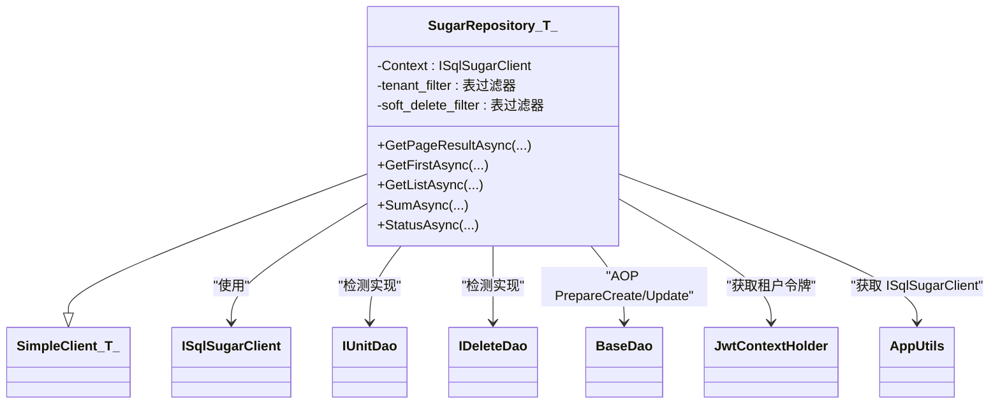
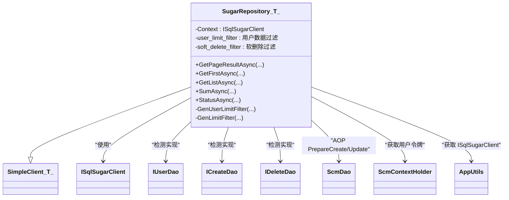
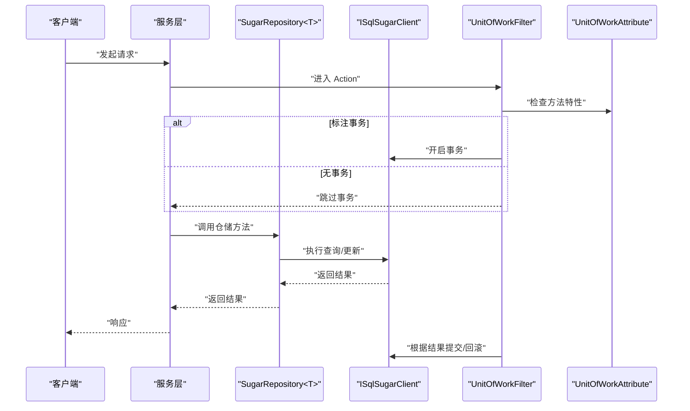
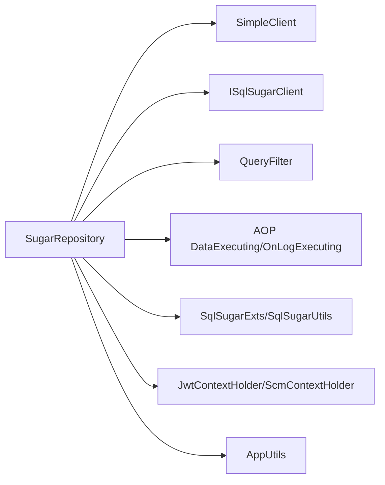

# SugarRepository 仓储模式

<cite>
**本文档引用的文件**
- [Scm.Dsa.Dba.Sugar/SugarRepository.cs](file://Scm.Dsa.Dba.Sugar/SugarRepository.cs)
- [Scm.Server/Dsa/SugarRepository.cs](file://Scm.Server/Dsa/SugarRepository.cs)
- [Scm.Server.Dao/Dao/ScmDao.cs](file://Scm.Server.Dao/Dao/ScmDao.cs)
- [Scm.Dsa.Dba.Sugar/Utils/SqlSugarExts.cs](file://Scm.Dsa.Dba.Sugar/Utils/SqlSugarExts.cs)
- [Scm.Dsa.Dba.Sugar/Utils/SqlSugarUtils.cs](file://Scm.Dsa.Dba.Sugar/Utils/SqlSugarUtils.cs)
- [Scm.Dsa.Dba.Sugar/UnitOfWork/Attribute/UnitOfWorkAttribute.cs](file://Scm.Dsa.Dba.Sugar/UnitOfWork/Attribute/UnitOfWorkAttribute.cs)
- [Scm.Dsa.Dba.Sugar/UnitOfWork/Filters/UnitOfWorkFilter.cs](file://Scm.Dsa.Dba.Sugar/UnitOfWork/Filters/UnitOfWorkFilter.cs)
- [Scm.Dao/ScmDbHelper.cs](file://Scm.Dao/ScmDbHelper.cs)
- [Samples.Server/PoDetail/SamplesPoDetailService.cs](file://Samples.Server/PoDetail/SamplesPoDetailService.cs)
- [Samples.Server.Dao/Book/IBookService.cs](file://Samples.Server.Dao/Book/IBookService.cs)
</cite>

## 目录
1. [引言](#引言)
2. [项目结构](#项目结构)
3. [核心组件](#核心组件)
4. [架构总览](#架构总览)
5. [详细组件分析](#详细组件分析)
6. [依赖关系分析](#依赖关系分析)
7. [性能考量](#性能考量)
8. [故障排查指南](#故障排查指南)
9. [结论](#结论)
10. [附录](#附录)

## 引言
本文件围绕基于 SqlSugar ORM 的仓储模式实现进行系统化技术文档整理，重点聚焦于 SugarRepository 泛型仓储类的设计理念、实现原理与最佳实践。仓储模式通过在数据访问层引入统一抽象与通用能力，显著提升了代码复用性、可测试性与可维护性；同时，结合 SqlSugar 的 AOP、查询过滤、分页与扩展方法，形成一套高效、可扩展的数据访问方案。

## 项目结构
仓库中与仓储模式直接相关的关键位置如下：
- 仓储实现：位于两个命名空间下，分别面向不同场景与上下文
  - [Scm.Dsa.Dba.Sugar/SugarRepository.cs](file://Scm.Dsa.Dba.Sugar/SugarRepository.cs)
  - [Scm.Server/Dsa/SugarRepository.cs](file://Scm.Server/Dsa/SugarRepository.cs)
- 基类与实体约定：[Scm.Server.Dao/Dao/ScmDao.cs](file://Scm.Server.Dao/Dao/ScmDao.cs)
- SqlSugar 扩展方法：[Scm.Dsa.Dba.Sugar/Utils/SqlSugarExts.cs](file://Scm.Dsa.Dba.Sugar/Utils/SqlSugarExts.cs)、[Scm.Dsa.Dba.Sugar/Utils/SqlSugarUtils.cs](file://Scm.Dsa.Dba.Sugar/Utils/SqlSugarUtils.cs)
- 工作单元与事务：[UnitOfWorkAttribute.cs](file://Scm.Dsa.Dba.Sugar/UnitOfWork/Attribute/UnitOfWorkAttribute.cs)、[UnitOfWorkFilter.cs](file://Scm.Dsa.Dba.Sugar/UnitOfWork/Filters/UnitOfWorkFilter.cs)
- DAO 辅助与迁移：[ScmDbHelper.cs](file://Scm.Dao/ScmDbHelper.cs)
- 使用示例：服务层对仓储的调用与接口契约

图表来源
- [Scm.Dsa.Dba.Sugar/SugarRepository.cs:13-190](file://Scm.Dsa.Dba.Sugar/SugarRepository.cs#L13-L190)
- [Scm.Server/Dsa/SugarRepository.cs:12-287](file://Scm.Server/Dsa/SugarRepository.cs#L12-L287)
- [Scm.Server.Dao/Dao/ScmDao.cs:6-70](file://Scm.Server.Dao/Dao/ScmDao.cs#L6-L70)
- [Scm.Dsa.Dba.Sugar/Utils/SqlSugarExts.cs:7-127](file://Scm.Dsa.Dba.Sugar/Utils/SqlSugarExts.cs#L7-L127)
- [Scm.Dsa.Dba.Sugar/Utils/SqlSugarUtils.cs:6-34](file://Scm.Dsa.Dba.Sugar/Utils/SqlSugarUtils.cs#L6-L34)
- [Scm.Dsa.Dba.Sugar/UnitOfWork/Attribute/UnitOfWorkAttribute.cs:9-35](file://Scm.Dsa.Dba.Sugar/UnitOfWork/Attribute/UnitOfWorkAttribute.cs#L9-L35)
- [Scm.Dsa.Dba.Sugar/UnitOfWork/Filters/UnitOfWorkFilter.cs:11-41](file://Scm.Dsa.Dba.Sugar/UnitOfWork/Filters/UnitOfWorkFilter.cs#L11-L41)
- [Scm.Dao/ScmDbHelper.cs:293-305](file://Scm.Dao/ScmDbHelper.cs#L293-L305)

章节来源
- [Scm.Dsa.Dba.Sugar/SugarRepository.cs:13-190](file://Scm.Dsa.Dba.Sugar/SugarRepository.cs#L13-L190)
- [Scm.Server/Dsa/SugarRepository.cs:12-287](file://Scm.Server/Dsa/SugarRepository.cs#L12-L287)

## 核心组件
- SugarRepository<T>（两套实现）
  - 负责统一注入 SqlSugar 上下文、注册查询过滤器、AOP 数据准备与日志记录、提供分页、查询、聚合等常用方法。
  - 面向不同上下文（租户/用户数据域）实现差异化过滤策略。
- 基类约定（ScmDao）
  - 统一主键、生命周期钩子（PrepareCreate/Update/Delete）、批量 DML 等约定，便于仓储在 AOP 中统一处理。
- SqlSugar 扩展方法
  - 提供分页、查询、插入/更新/删除等便捷扩展，减少样板代码。
- 工作单元与事务
  - 通过特性与过滤器实现方法级事务边界管理，支持指定隔离级别。

章节来源
- [Scm.Server.Dao/Dao/ScmDao.cs:6-70](file://Scm.Server.Dao/Dao/ScmDao.cs#L6-L70)
- [Scm.Dsa.Dba.Sugar/Utils/SqlSugarExts.cs:7-127](file://Scm.Dsa.Dba.Sugar/Utils/SqlSugarExts.cs#L7-L127)
- [Scm.Dsa.Dba.Sugar/Utils/SqlSugarUtils.cs:6-34](file://Scm.Dsa.Dba.Sugar/Utils/SqlSugarUtils.cs#L6-L34)
- [Scm.Dsa.Dba.Sugar/UnitOfWork/Attribute/UnitOfWorkAttribute.cs:9-35](file://Scm.Dsa.Dba.Sugar/UnitOfWork/Attribute/UnitOfWorkAttribute.cs#L9-L35)
- [Scm.Dsa.Dba.Sugar/UnitOfWork/Filters/UnitOfWorkFilter.cs:11-41](file://Scm.Dsa.Dba.Sugar/UnitOfWork/Filters/UnitOfWorkFilter.cs#L11-L41)

## 架构总览
仓储模式通过泛型仓储类封装 SqlSugar 的查询、过滤、AOP、分页与 CRUD 扩展，向上提供一致的接口契约，向下屏蔽底层 ORM 细节。结合工作单元机制，实现事务边界与并发控制的统一管理。

图表来源
- [Scm.Dsa.Dba.Sugar/SugarRepository.cs:18-82](file://Scm.Dsa.Dba.Sugar/SugarRepository.cs#L18-L82)
- [Scm.Server/Dsa/SugarRepository.cs:23-95](file://Scm.Server/Dsa/SugarRepository.cs#L23-L95)
- [Scm.Dsa.Dba.Sugar/Utils/SqlSugarExts.cs:9-125](file://Scm.Dsa.Dba.Sugar/Utils/SqlSugarExts.cs#L9-L125)
- [Scm.Dsa.Dba.Sugar/UnitOfWork/Filters/UnitOfWorkFilter.cs:30-41](file://Scm.Dsa.Dba.Sugar/UnitOfWork/Filters/UnitOfWorkFilter.cs#L30-L41)
- [Scm.Dsa.Dba.Sugar/UnitOfWork/Attribute/UnitOfWorkAttribute.cs:9-35](file://Scm.Dsa.Dba.Sugar/UnitOfWork/Attribute/UnitOfWorkAttribute.cs#L9-L35)

## 详细组件分析

### 组件一：基于租户上下文的 SugarRepository 实现
该实现面向多租户场景，自动注入租户过滤与软删除过滤，并在 AOP 中统一处理创建/更新的审计字段。

图表来源
- [Scm.Dsa.Dba.Sugar/SugarRepository.cs:13-82](file://Scm.Dsa.Dba.Sugar/SugarRepository.cs#L13-L82)

章节来源
- [Scm.Dsa.Dba.Sugar/SugarRepository.cs:13-190](file://Scm.Dsa.Dba.Sugar/SugarRepository.cs#L13-L190)

### 组件二：基于用户数据域的 SugarRepository 实现
该实现面向用户数据域权限控制，支持“全部/当前用户/指定用户/排除用户”等数据可见性策略，并在 AOP 中统一处理创建审计。

图表来源
- [Scm.Server/Dsa/SugarRepository.cs:12-95](file://Scm.Server/Dsa/SugarRepository.cs#L12-L95)

章节来源
- [Scm.Server/Dsa/SugarRepository.cs:12-287](file://Scm.Server/Dsa/SugarRepository.cs#L12-L287)

### 组件三：数据访问模式与事务管理
- 数据访问模式
  - 仓储提供分页、条件查询、排序、聚合等常用能力，避免在服务层重复编写 SQL/表达式。
  - 通过扩展方法进一步简化查询与 CRUD 操作。
- 事务管理
  - 方法级事务通过特性标注，配合过滤器在进入 Action 前开启事务，在返回后提交或回滚。
  - 支持设置隔离级别，满足不同并发与一致性需求。

图表来源
- [Scm.Dsa.Dba.Sugar/UnitOfWork/Filters/UnitOfWorkFilter.cs:30-41](file://Scm.Dsa.Dba.Sugar/UnitOfWork/Filters/UnitOfWorkFilter.cs#L30-L41)
- [Scm.Dsa.Dba.Sugar/UnitOfWork/Attribute/UnitOfWorkAttribute.cs:9-35](file://Scm.Dsa.Dba.Sugar/UnitOfWork/Attribute/UnitOfWorkAttribute.cs#L9-L35)
- [Scm.Dsa.Dba.Sugar/SugarRepository.cs:93-102](file://Scm.Dsa.Dba.Sugar/SugarRepository.cs#L93-L102)
- [Scm.Server/Dsa/SugarRepository.cs:175-184](file://Scm.Server/Dsa/SugarRepository.cs#L175-L184)

章节来源
- [Scm.Dsa.Dba.Sugar/UnitOfWork/Filters/UnitOfWorkFilter.cs:11-41](file://Scm.Dsa.Dba.Sugar/UnitOfWork/Filters/UnitOfWorkFilter.cs#L11-L41)
- [Scm.Dsa.Dba.Sugar/UnitOfWork/Attribute/UnitOfWorkAttribute.cs:9-35](file://Scm.Dsa.Dba.Sugar/UnitOfWork/Attribute/UnitOfWorkAttribute.cs#L9-L35)

### 组件四：并发控制机制
- 事务隔离级别
  - 通过特性参数设置隔离级别，影响读写冲突与脏读/幻读风险。
- 查询过滤与软删除
  - 在查询阶段即应用过滤条件，避免无效数据进入业务层，降低并发竞争。
- AOP 审计
  - 在插入/更新阶段统一填充审计字段，保证数据一致性与可追溯性。

章节来源
- [Scm.Dsa.Dba.Sugar/UnitOfWork/Attribute/UnitOfWorkAttribute.cs:21-21](file://Scm.Dsa.Dba.Sugar/UnitOfWork/Attribute/UnitOfWorkAttribute.cs#L21-L21)
- [Scm.Dsa.Dba.Sugar/SugarRepository.cs:29-41](file://Scm.Dsa.Dba.Sugar/SugarRepository.cs#L29-L41)
- [Scm.Server/Dsa/SugarRepository.cs:35-49](file://Scm.Server/Dsa/SugarRepository.cs#L35-L49)

### 组件五：接口设计与最佳实践
- 统一接口设计
  - 仓储方法命名与签名保持一致，便于替换与测试。
- 代码复用性
  - 将分页、排序、条件拼接、聚合等通用逻辑下沉至仓储，服务层仅关注业务。
- 可测试性
  - 通过构造函数注入 ISqlSugarClient，可在单元测试中以 Mock 替换。
- 自定义仓储扩展
  - 建议在具体领域创建继承自 SugarRepository<T> 的领域仓储，补充领域专用查询与命令方法。
- 使用指南
  - 在服务构造函数中注入领域仓储实例，避免在方法内重复创建。
  - 使用扩展方法简化常见查询，避免手写表达式。

章节来源
- [Scm.Dsa.Dba.Sugar/SugarRepository.cs:93-102](file://Scm.Dsa.Dba.Sugar/SugarRepository.cs#L93-L102)
- [Scm.Server/Dsa/SugarRepository.cs:175-184](file://Scm.Server/Dsa/SugarRepository.cs#L175-L184)
- [Scm.Dsa.Dba.Sugar/Utils/SqlSugarExts.cs:9-21](file://Scm.Dsa.Dba.Sugar/Utils/SqlSugarExts.cs#L9-L21)

### 组件六：DAO 与迁移辅助
- DAO 基类 ScmDao 提供统一主键与生命周期钩子，便于仓储在 AOP 中统一处理。
- DAO 辅助类 ScmDbHelper 提供表结构初始化与迁移能力，确保开发环境快速就绪。

章节来源
- [Scm.Server.Dao/Dao/ScmDao.cs:6-70](file://Scm.Server.Dao/Dao/ScmDao.cs#L6-L70)
- [Scm.Dao/ScmDbHelper.cs:293-305](file://Scm.Dao/ScmDbHelper.cs#L293-L305)

## 依赖关系分析
- 仓储对 SqlSugar 的依赖
  - 通过 SimpleClient<T> 继承，直接使用 Queryable/Updateable/Insertable/Deleteable 等能力。
- 运行时依赖
  - 通过 AppUtils 注入 ISqlSugarClient，通过上下文持有者获取令牌（租户/用户）。
- 过滤与 AOP
  - QueryFilter 注册表过滤器；DataExecuting/Aop.OnLogExecuting 提供审计与日志。
- 扩展方法
  - SqlSugarExts/SqlSugarUtils 提供分页、查询、CRUD 扩展，减少重复代码。

图表来源
- [Scm.Dsa.Dba.Sugar/SugarRepository.cs:18-82](file://Scm.Dsa.Dba.Sugar/SugarRepository.cs#L18-L82)
- [Scm.Server/Dsa/SugarRepository.cs:23-95](file://Scm.Server/Dsa/SugarRepository.cs#L23-L95)
- [Scm.Dsa.Dba.Sugar/Utils/SqlSugarExts.cs:7-127](file://Scm.Dsa.Dba.Sugar/Utils/SqlSugarExts.cs#L7-L127)
- [Scm.Dsa.Dba.Sugar/Utils/SqlSugarUtils.cs:6-34](file://Scm.Dsa.Dba.Sugar/Utils/SqlSugarUtils.cs#L6-L34)

章节来源
- [Scm.Dsa.Dba.Sugar/SugarRepository.cs:13-190](file://Scm.Dsa.Dba.Sugar/SugarRepository.cs#L13-L190)
- [Scm.Server/Dsa/SugarRepository.cs:12-287](file://Scm.Server/Dsa/SugarRepository.cs#L12-L287)

## 性能考量
- 查询过滤与索引
  - 合理利用 QueryFilter 与实体索引，避免全表扫描；尽量在过滤条件中使用带索引的列。
- 分页与排序
  - 分页查询应结合明确的排序键，避免大偏移分页导致的性能问题。
- 批量操作
  - 使用 Insertable/Updateable/Deleteable 的批量方法，减少往返次数。
- AOP 开销
  - 审计与日志在开发/调试阶段非常有用，生产环境可根据需要关闭或降级日志级别。
- 连接池与超时
  - 合理配置连接池大小与命令超时，避免长事务占用连接资源。

## 故障排查指南
- 无法获取 ISqlSugarClient
  - 检查容器注册与 AppUtils 解析流程，确认服务已正确注册。
- 查询不到数据或过滤异常
  - 确认 QueryFilter 是否正确注册，过滤条件是否与实体属性名一致。
- 事务未生效
  - 检查方法是否标注 UnitOfWorkAttribute，以及过滤器是否正确拦截 Action。
- 审计字段未填充
  - 确认实体是否实现对应接口（如 IUnitDao/IUserDao），AOP 中 PrepareCreate/Update 是否被触发。

章节来源
- [Scm.Dsa.Dba.Sugar/SugarRepository.cs:18-24](file://Scm.Dsa.Dba.Sugar/SugarRepository.cs#L18-L24)
- [Scm.Server/Dsa/SugarRepository.cs:23-30](file://Scm.Server/Dsa/SugarRepository.cs#L23-L30)
- [Scm.Dsa.Dba.Sugar/UnitOfWork/Filters/UnitOfWorkFilter.cs:30-41](file://Scm.Dsa.Dba.Sugar/UnitOfWork/Filters/UnitOfWorkFilter.cs#L30-L41)

## 结论
通过 SugarRepository 泛型仓储类，项目实现了数据访问层的统一抽象与能力沉淀，结合 SqlSugar 的查询过滤、AOP 审计与扩展方法，显著提升了开发效率与可维护性。配合工作单元与事务管理，能够有效支撑复杂业务场景下的并发控制与一致性要求。建议在实际项目中按领域拆分自定义仓储，遵循统一接口与扩展方法规范，持续优化查询与批处理性能。

## 附录
- 使用示例参考
  - 服务层对仓储的调用与接口契约：[SamplesPoDetailService.cs:19-33](file://Samples.Server/PoDetail/SamplesPoDetailService.cs#L19-L33)、[IBookService.cs:5-10](file://Samples.Server.Dao/Book/IBookService.cs#L5-L10)