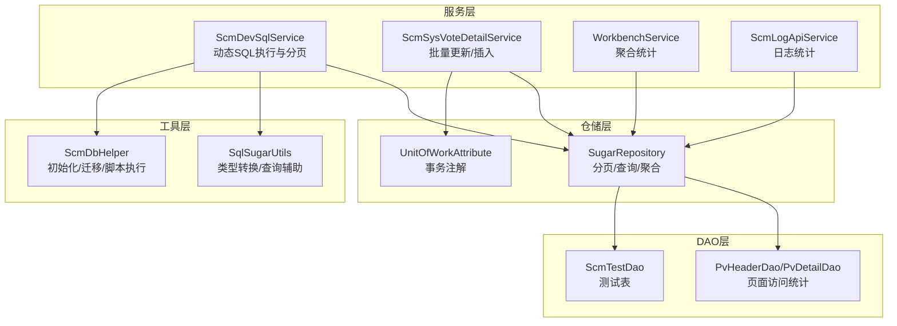
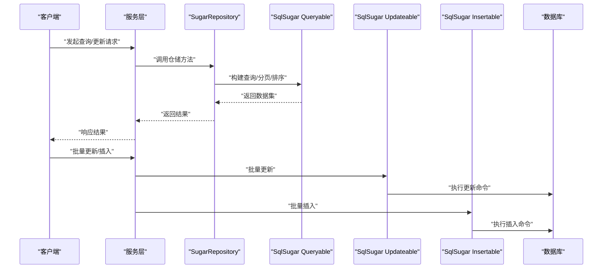
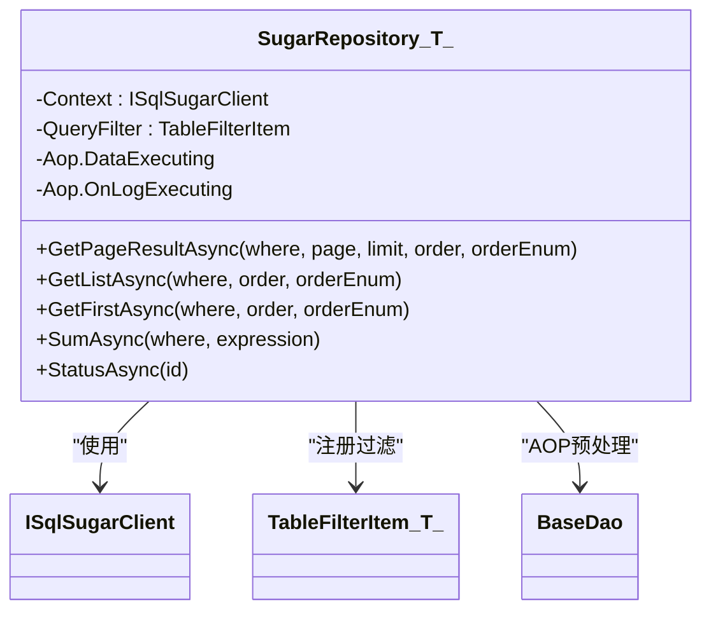
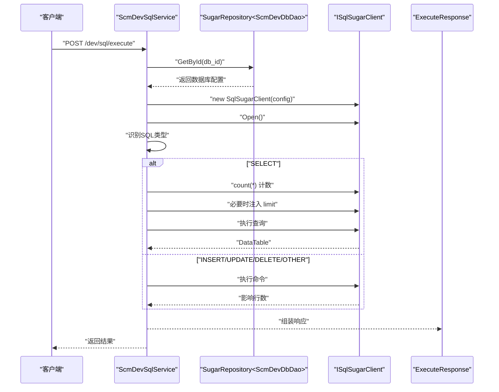
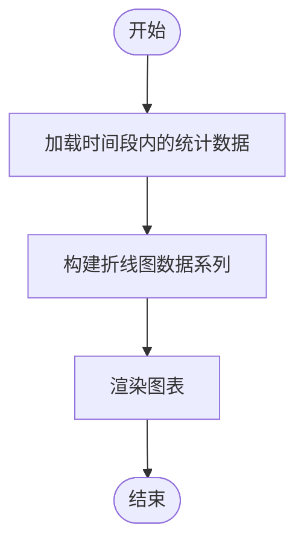
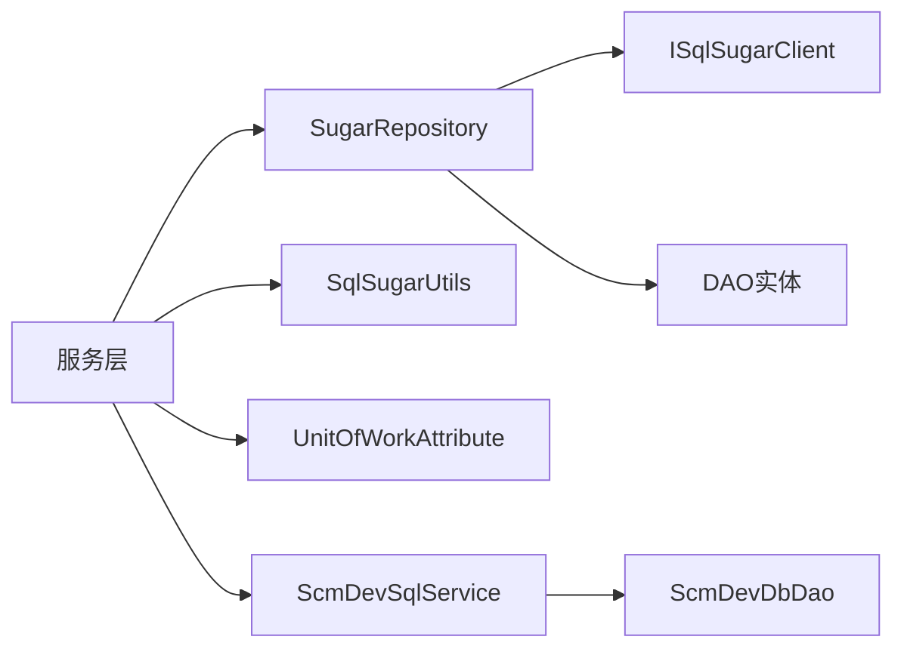

# 性能优化策略

<cite>
**本文档引用的文件**
- [Scm.Dsa.Dba.Sugar/SugarRepository.cs](file://Scm.Dsa.Dba.Sugar/SugarRepository.cs)
- [Scm.Dao/ScmDbHelper.cs](file://Scm.Dao/ScmDbHelper.cs)
- [Scm.Core/Dev/Sql/ScmDevSqlService.cs](file://Scm.Core/Dev/Sql/ScmDevSqlService.cs)
- [Scm.Dsa.Dba.Sugar/Utils/SqlSugarUtils.cs](file://Scm.Dsa.Dba.Sugar/Utils/SqlSugarUtils.cs)
- [Scm.Dsa.Dba.Sugar/Dsa/Dba/Sugar/UnitOfWork/Attribute/UnitOfWorkAttribute.cs](file://Scm.Dsa.Dba.Sugar/Dsa/Dba/Sugar/UnitOfWork/Attribute/UnitOfWorkAttribute.cs)
- [Scm.Dao/Sys/Pv/PvHeaderDao.cs](file://Scm.Dao/Sys/Pv/PvHeaderDao.cs)
- [Scm.Dao/Sys/Pv/PvDetailDao.cs](file://Scm.Dao/Sys/Pv/PvDetailDao.cs)
- [Scm.Core/Sys/VoteDetail/ScmSysVoteDetailService.cs](file://Scm.Core/Sys/VoteDetail/ScmSysVoteDetailService.cs)
- [Scm.Core/Operator/WorkbenchService.cs](file://Scm.Core/Operator/WorkbenchService.cs)
- [Scm.Core/Log/Api/ScmLogApiService.cs](file://Scm.Core/Log/Api/ScmLogApiService.cs)
- [Samples.Server/PoDetail/SamplesPoDetailService.cs](file://Samples.Server/PoDetail/SamplesPoDetailService.cs)
- [Scm.Dao/ScmTestDao.cs](file://Scm.Dao/ScmTestDao.cs)
</cite>

## 目录
1. [简介](#简介)
2. [项目结构](#项目结构)
3. [核心组件](#核心组件)
4. [架构总览](#架构总览)
5. [详细组件分析](#详细组件分析)
6. [依赖关系分析](#依赖关系分析)
7. [性能考量](#性能考量)
8. [故障排查指南](#故障排查指南)
9. [结论](#结论)
10. [附录](#附录)

## 简介
本文件面向 Scm.Net 数据访问层的性能优化，聚焦 SqlSugar ORM 的查询优化、索引使用、连接池配置、批量操作、分页查询、复杂查询、连接管理、事务优化与并发控制，并结合项目现有实现给出可落地的优化建议与最佳实践。同时提供性能监控指标、基准测试思路、缓存策略、查询计划分析与慢查询优化技巧，以及大数据量处理、内存管理与资源释放的优化方案。

## 项目结构
Scm.Net 的数据访问层主要由以下层次构成：
- DAO 层：实体模型与表映射，承载字段约束与表名标注。
- 数据访问仓储层：基于 SqlSugar 的通用仓储 SugarRepository，封装常用查询、分页、聚合等操作。
- 服务层：业务服务通过仓储进行数据访问；部分服务直接使用 SqlSugar 客户端执行原生 SQL。
- 辅助工具：SqlSugarUtils 提供类型转换与通用查询辅助；UnitOfWorkAttribute 提供事务注解能力。
- 开发工具：ScmDevSqlService 支持动态连接多数据库并执行 SQL，内置分页与计数逻辑。

**图表来源**
- [Scm.Core/Dev/Sql/ScmDevSqlService.cs:1-323](file://Scm.Core/Dev/Sql/ScmDevSqlService.cs#L1-L323)
- [Scm.Dsa.Dba.Sugar/SugarRepository.cs:1-190](file://Scm.Dsa.Dba.Sugar/SugarRepository.cs#L1-L190)
- [Scm.Dsa.Dba.Sugar/Utils/SqlSugarUtils.cs:1-34](file://Scm.Dsa.Dba.Sugar/Utils/SqlSugarUtils.cs#L1-L34)
- [Scm.Dsa.Dba.Sugar/Dsa/Dba/Sugar/UnitOfWork/Attribute/UnitOfWorkAttribute.cs:1-35](file://Scm.Dsa.Dba.Sugar/Dsa/Dba/Sugar/UnitOfWork/Attribute/UnitOfWorkAttribute.cs#L1-L35)
- [Scm.Dao/ScmDbHelper.cs:1-779](file://Scm.Dao/ScmDbHelper.cs#L1-L779)
- [Scm.Dao/Sys/Pv/PvHeaderDao.cs:1-36](file://Scm.Dao/Sys/Pv/PvHeaderDao.cs#L1-L36)
- [Scm.Dao/Sys/Pv/PvDetailDao.cs:1-36](file://Scm.Dao/Sys/Pv/PvDetailDao.cs#L1-L36)
- [Scm.Dao/ScmTestDao.cs:1-25](file://Scm.Dao/ScmTestDao.cs#L1-L25)

**章节来源**
- [Scm.Core/Dev/Sql/ScmDevSqlService.cs:1-323](file://Scm.Core/Dev/Sql/ScmDevSqlService.cs#L1-L323)
- [Scm.Dsa.Dba.Sugar/SugarRepository.cs:1-190](file://Scm.Dsa.Dba.Sugar/SugarRepository.cs#L1-L190)
- [Scm.Dsa.Dba.Sugar/Utils/SqlSugarUtils.cs:1-34](file://Scm.Dsa.Dba.Sugar/Utils/SqlSugarUtils.cs#L1-L34)
- [Scm.Dsa.Dba.Sugar/Dsa/Dba/Sugar/UnitOfWork/Attribute/UnitOfWorkAttribute.cs:1-35](file://Scm.Dsa.Dba.Sugar/Dsa/Dba/Sugar/UnitOfWork/Attribute/UnitOfWorkAttribute.cs#L1-L35)
- [Scm.Dao/ScmDbHelper.cs:1-779](file://Scm.Dao/ScmDbHelper.cs#L1-L779)
- [Scm.Dao/Sys/Pv/PvHeaderDao.cs:1-36](file://Scm.Dao/Sys/Pv/PvHeaderDao.cs#L1-L36)
- [Scm.Dao/Sys/Pv/PvDetailDao.cs:1-36](file://Scm.Dao/Sys/Pv/PvDetailDao.cs#L1-L36)
- [Scm.Dao/ScmTestDao.cs:1-25](file://Scm.Dao/ScmTestDao.cs#L1-L25)

## 核心组件
- 通用仓储 SugarRepository：提供分页查询、条件查询、排序、聚合、状态更新等常用能力，内置租户过滤与 AOP 数据预处理。
- 动态 SQL 服务 ScmDevSqlService：按需连接不同数据库执行 SQL，自动注入分页与计数逻辑，适合报表与复杂查询场景。
- 工具类 SqlSugarUtils：提供数据库类型转换与通用查询辅助。
- 事务注解 UnitOfWorkAttribute：为方法级事务提供隔离级别配置。
- 数据库初始化与脚本执行 ScmDbHelper：负责建表、迁移、版本控制与脚本执行。

**章节来源**
- [Scm.Dsa.Dba.Sugar/SugarRepository.cs:1-190](file://Scm.Dsa.Dba.Sugar/SugarRepository.cs#L1-L190)
- [Scm.Core/Dev/Sql/ScmDevSqlService.cs:1-323](file://Scm.Core/Dev/Sql/ScmDevSqlService.cs#L1-L323)
- [Scm.Dsa.Dba.Sugar/Utils/SqlSugarUtils.cs:1-34](file://Scm.Dsa.Dba.Sugar/Utils/SqlSugarUtils.cs#L1-L34)
- [Scm.Dsa.Dba.Sugar/Dsa/Dba/Sugar/UnitOfWork/Attribute/UnitOfWorkAttribute.cs:1-35](file://Scm.Dsa.Dba.Sugar/Dsa/Dba/Sugar/UnitOfWork/Attribute/UnitOfWorkAttribute.cs#L1-L35)
- [Scm.Dao/ScmDbHelper.cs:1-779](file://Scm.Dao/ScmDbHelper.cs#L1-L779)

## 架构总览
下图展示数据访问层的关键交互：服务层通过仓储或直接使用 SqlSugar 客户端访问数据库；仓储层利用 Queryable/Updateable/Insertable/Deleteable 等 API 执行 CRUD；动态 SQL 服务在运行时构建连接并执行 SQL；工具层提供类型转换与查询辅助；事务注解用于方法级事务控制。

**图表来源**
- [Scm.Dsa.Dba.Sugar/SugarRepository.cs:93-124](file://Scm.Dsa.Dba.Sugar/SugarRepository.cs#L93-L124)
- [Scm.Core/Sys/VoteDetail/ScmSysVoteDetailService.cs:86-129](file://Scm.Core/Sys/VoteDetail/ScmSysVoteDetailService.cs#L86-L129)
- [Scm.Core/Operator/WorkbenchService.cs:117-130](file://Scm.Core/Operator/WorkbenchService.cs#L117-L130)

## 详细组件分析

### 通用仓储 SugarRepository 分析
- 租户过滤与软删除过滤：通过 QueryFilter 注入 Lambda 表达式，自动对实现 IUnitDao 与 IDeleteDao 的实体生效，避免重复编写过滤条件。
- AOP 数据预处理：在 DataExecuting 中统一处理 PrepareCreate/PrepareUpdate，减少 DAO 层样板代码。
- 日志输出：OnLogExecuting 记录最终 SQL，便于慢查询定位与审计。
- 分页查询：ToPageListAsync 返回集合与总条数，支持字符串条件与排序组合。
- 聚合与统计：SumAsync、StatusAsync 等方法简化常见聚合需求。

**图表来源**
- [Scm.Dsa.Dba.Sugar/SugarRepository.cs:13-82](file://Scm.Dsa.Dba.Sugar/SugarRepository.cs#L13-L82)

**章节来源**
- [Scm.Dsa.Dba.Sugar/SugarRepository.cs:1-190](file://Scm.Dsa.Dba.Sugar/SugarRepository.cs#L1-L190)

### 动态 SQL 服务 ScmDevSqlService 分析
- 连接管理：按 db_id 获取连接配置，创建临时 ISqlSugarClient 并在 using 中自动关闭连接，避免连接泄漏。
- SQL 类型识别：根据 SQL 前缀区分 SELECT/INSERT/UPDATE/DELETE/其他，分别执行相应逻辑。
- 分页与计数：对 SELECT 自动注入 count(*) 计数，若结果总数超过 limit 则追加分页子句。
- 错误处理：捕获异常并记录日志，返回标准化响应。

**图表来源**
- [Scm.Core/Dev/Sql/ScmDevSqlService.cs:207-296](file://Scm.Core/Dev/Sql/ScmDevSqlService.cs#L207-L296)
- [Scm.Core/Dev/Sql/ScmDevSqlService.cs:305-320](file://Scm.Core/Dev/Sql/ScmDevSqlService.cs#L305-L320)

**章节来源**
- [Scm.Core/Dev/Sql/ScmDevSqlService.cs:1-323](file://Scm.Core/Dev/Sql/ScmDevSqlService.cs#L1-L323)

### 批量操作与复杂查询优化
- 批量更新/插入：ScmSysVoteDetailService 使用 AsUpdateable/SetColumns/ExecuteCommandAsync 实现批量更新；对不存在的明细执行 InsertAsync 插入，减少多次往返。
- 复杂查询：WorkbenchService 通过 ScmDrWebDailyDao 的聚合查询生成趋势图数据，注意在 WHERE 中使用索引列以提升性能。
- 日志统计：ScmLogApiService 使用聚合函数按天统计各类日志数量，建议为 operate_date、level 建立复合索引。

**图表来源**
- [Scm.Core/Operator/WorkbenchService.cs:117-130](file://Scm.Core/Operator/WorkbenchService.cs#L117-L130)
- [Scm.Core/Log/Api/ScmLogApiService.cs:70-92](file://Scm.Core/Log/Api/ScmLogApiService.cs#L70-L92)

**章节来源**
- [Scm.Core/Sys/VoteDetail/ScmSysVoteDetailService.cs:86-129](file://Scm.Core/Sys/VoteDetail/ScmSysVoteDetailService.cs#L86-L129)
- [Scm.Core/Operator/WorkbenchService.cs:117-130](file://Scm.Core/Operator/WorkbenchService.cs#L117-L130)
- [Scm.Core/Log/Api/ScmLogApiService.cs:70-92](file://Scm.Core/Log/Api/ScmLogApiService.cs#L70-L92)

### 示例：批量追加与更新（PoDetail）
- 先获取现有明细，区分更新与新增，分别走 UpdateRangeAsync 与 InsertRangeAsync，减少循环逐条提交带来的网络与锁竞争。
- 通过 SetColumns 一次性设置字段，避免不必要的字段更新。

**章节来源**
- [Samples.Server/PoDetail/SamplesPoDetailService.cs:184-219](file://Samples.Server/PoDetail/SamplesPoDetailService.cs#L184-L219)

## 依赖关系分析
- 仓储依赖 SqlSugar 客户端上下文，通过 AppUtils 注入；服务层依赖仓储接口。
- 动态 SQL 服务依赖数据库配置 DAO 与 SqlSugar 客户端，运行时创建连接。
- 工具类 SqlSugarUtils 提供类型转换与通用查询辅助。
- 事务注解通过属性标记方法，配合拦截器或中间件实现事务边界控制。

**图表来源**
- [Scm.Dsa.Dba.Sugar/SugarRepository.cs:18-82](file://Scm.Dsa.Dba.Sugar/SugarRepository.cs#L18-L82)
- [Scm.Core/Dev/Sql/ScmDevSqlService.cs:18-30](file://Scm.Core/Dev/Sql/ScmDevSqlService.cs#L18-L30)
- [Scm.Dsa.Dba.Sugar/Utils/SqlSugarUtils.cs:1-34](file://Scm.Dsa.Dba.Sugar/Utils/SqlSugarUtils.cs#L1-L34)
- [Scm.Dsa.Dba.Sugar/Dsa/Dba/Sugar/UnitOfWork/Attribute/UnitOfWorkAttribute.cs:1-35](file://Scm.Dsa.Dba.Sugar/Dsa/Dba/Sugar/UnitOfWork/Attribute/UnitOfWorkAttribute.cs#L1-L35)

**章节来源**
- [Scm.Dsa.Dba.Sugar/SugarRepository.cs:1-190](file://Scm.Dsa.Dba.Sugar/SugarRepository.cs#L1-L190)
- [Scm.Core/Dev/Sql/ScmDevSqlService.cs:1-323](file://Scm.Core/Dev/Sql/ScmDevSqlService.cs#L1-L323)
- [Scm.Dsa.Dba.Sugar/Utils/SqlSugarUtils.cs:1-34](file://Scm.Dsa.Dba.Sugar/Utils/SqlSugarUtils.cs#L1-L34)
- [Scm.Dsa.Dba.Sugar/Dsa/Dba/Sugar/UnitOfWork/Attribute/UnitOfWorkAttribute.cs:1-35](file://Scm.Dsa.Dba.Sugar/Dsa/Dba/Sugar/UnitOfWork/Attribute/UnitOfWorkAttribute.cs#L1-L35)

## 性能考量

### 查询优化
- 使用索引列作为 WHERE 条件，避免对大字段或函数计算列进行过滤。
- 对高频查询字段建立合适索引（如 PvHeaderDao.url、operate_date、level），减少全表扫描。
- 避免 SELECT *，仅选择必要列，降低网络与解析开销。
- 合理使用分页：确保分页键稳定且有索引，避免 deep paging 导致的性能退化。

### 索引使用与连接池配置
- 建议在 ScmDevSqlService 中增加连接池参数（最大/最小连接数、连接超时、命令超时）以提升并发下的稳定性与吞吐。
- 对于动态 SQL，优先使用参数化查询，避免 SQL 注入与计划缓存碎片化。

### 批量操作优化
- 使用 UpdateRangeAsync/InsertRangeAsync 替代循环逐条更新/插入，显著降低网络往返与锁竞争。
- 批量更新时尽量合并为一次命令，减少事务开销。

### 分页查询与复杂查询
- 分页查询建议固定排序键并建立索引；对 COUNT(*) 进行估算或缓存，避免每次全表扫描。
- 复杂查询（如聚合、窗口函数）建议拆分为多步执行或物化中间结果，减轻单次查询压力。

### 数据库连接管理与事务优化
- 动态 SQL 服务使用 using 保证连接释放，建议在生产环境启用连接池复用。
- 事务隔离级别建议使用 ReadCommitted（默认），避免过度串行化导致并发下降。
- 对长事务进行拆分，缩短持有锁的时间；对只读查询避免开启事务。

### 并发控制
- 对热点表采用乐观锁（版本号）或行级锁优化，减少死锁概率。
- 对高并发写入场景，考虑分片或分区策略，分散写入压力。

### 缓存策略
- 对静态配置、字典、菜单等只读数据进行缓存，设置合理过期时间。
- 对高频查询结果进行本地缓存（如 Redis/MemoryCache），减少数据库压力。
- 注意缓存一致性：写操作后主动失效或更新缓存。

### 查询计划分析与慢查询优化
- 使用数据库 EXPLAIN/Execution Plan 分析慢查询，关注索引使用情况与回表次数。
- 将复杂 WHERE 子句拆分为更细粒度的条件，提升索引选择性。
- 对频繁出现的查询模式，考虑物化视图或汇总表。

### 大数据量处理、内存管理与资源释放
- 分批处理大批量数据，避免一次性加载到内存；使用流式读取与增量提交。
- 及时释放 ISqlSugarClient、IDataReader 等资源，避免内存泄漏。
- 对大对象（如图片、附件）采用分块上传与异步处理，降低峰值内存占用。

## 故障排查指南
- SQL 日志：通过 SugarRepository 的 OnLogExecuting 输出最终 SQL，定位慢查询与异常参数。
- 连接问题：检查 ScmDevSqlService 的连接创建与异常捕获，确认连接字符串与数据库可达性。
- 事务冲突：检查 UnitOfWorkAttribute 的隔离级别与事务范围，避免长时间持有锁。
- 资源泄漏：确保动态 SQL 服务中的 using 作用域覆盖整个执行周期，避免连接未释放。

**章节来源**
- [Scm.Dsa.Dba.Sugar/SugarRepository.cs:71-81](file://Scm.Dsa.Dba.Sugar/SugarRepository.cs#L71-L81)
- [Scm.Core/Dev/Sql/ScmDevSqlService.cs:211-232](file://Scm.Core/Dev/Sql/ScmDevSqlService.cs#L211-L232)
- [Scm.Dsa.Dba.Sugar/Dsa/Dba/Sugar/UnitOfWork/Attribute/UnitOfWorkAttribute.cs:19-33](file://Scm.Dsa.Dba.Sugar/Dsa/Dba/Sugar/UnitOfWork/Attribute/UnitOfWorkAttribute.cs#L19-L33)

## 结论
通过对 Scm.Net 数据访问层的深入分析，建议在现有基础上强化索引设计、连接池配置、批量操作与分页查询优化，并完善缓存与慢查询治理机制。结合事务注解与资源释放规范，可在保证功能正确性的前提下显著提升系统整体性能与稳定性。

## 附录

### 性能监控指标建议
- 查询延迟（P50/P95/P99）、错误率、超时率
- 连接池利用率、等待时间、连接泄漏数
- 缓存命中率、缓存淘汰率
- CPU/内存/IO 使用率与 GC 次数
- 数据库慢查询数量与平均耗时

### 基准测试思路
- 使用压测工具模拟并发读写场景，覆盖典型查询路径（分页、聚合、批量更新）。
- 对比启用/禁用缓存、不同索引策略、不同连接池参数下的性能差异。
- 关注数据库侧的锁等待、阻塞与死锁指标。

### 索引建议（基于现有 DAO）
- PvHeaderDao/url、date：用于页面访问统计的分组与过滤
- ScmLogApiService 统计涉及的 operate_date、level：按天统计日志数量
- 其他高频查询字段：根据实际查询条件补充索引

**章节来源**
- [Scm.Dao/Sys/Pv/PvHeaderDao.cs:1-36](file://Scm.Dao/Sys/Pv/PvHeaderDao.cs#L1-L36)
- [Scm.Dao/Sys/Pv/PvDetailDao.cs:1-36](file://Scm.Dao/Sys/Pv/PvDetailDao.cs#L1-L36)
- [Scm.Core/Log/Api/ScmLogApiService.cs:70-92](file://Scm.Core/Log/Api/ScmLogApiService.cs#L70-L92)
- [Scm.Dao/ScmTestDao.cs:1-25](file://Scm.Dao/ScmTestDao.cs#L1-L25)