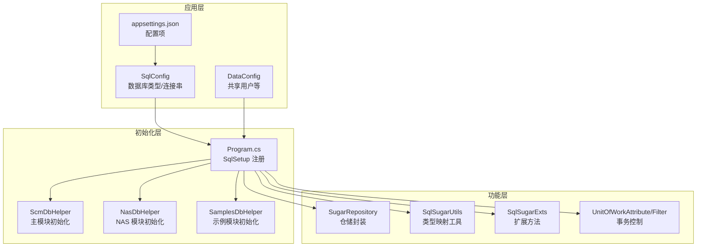
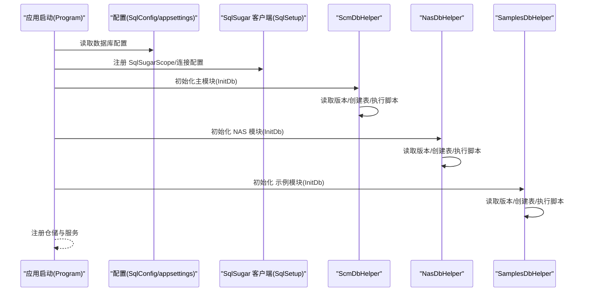
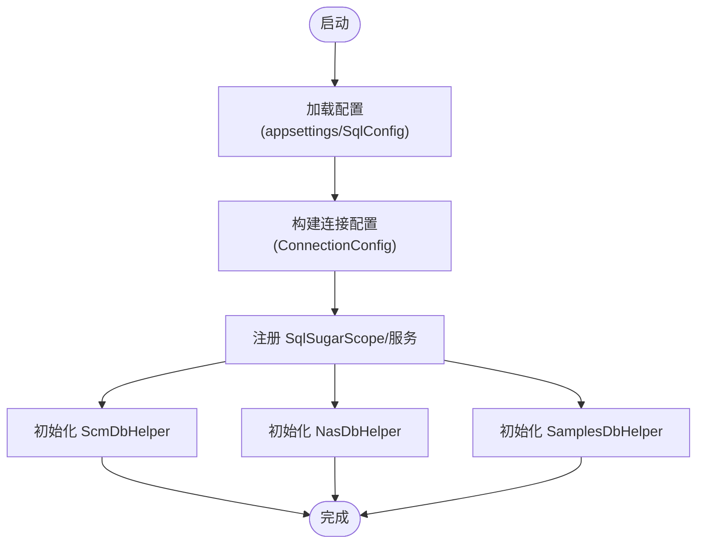
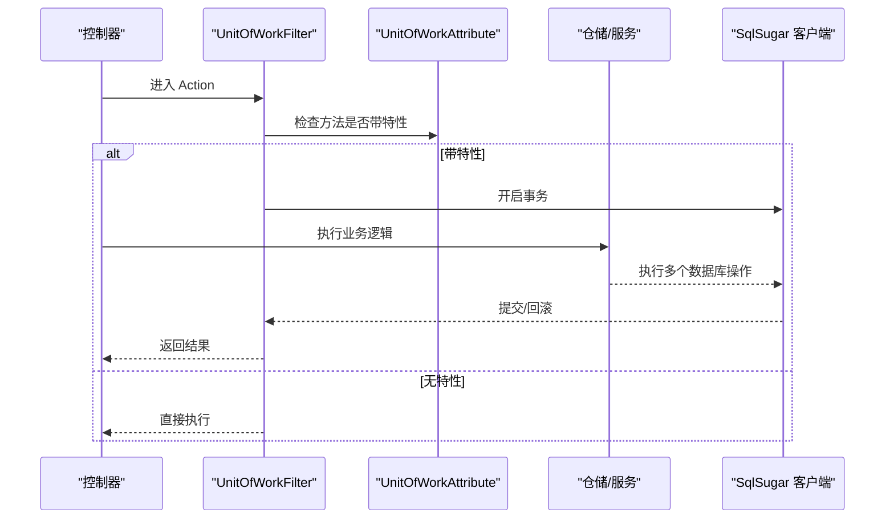
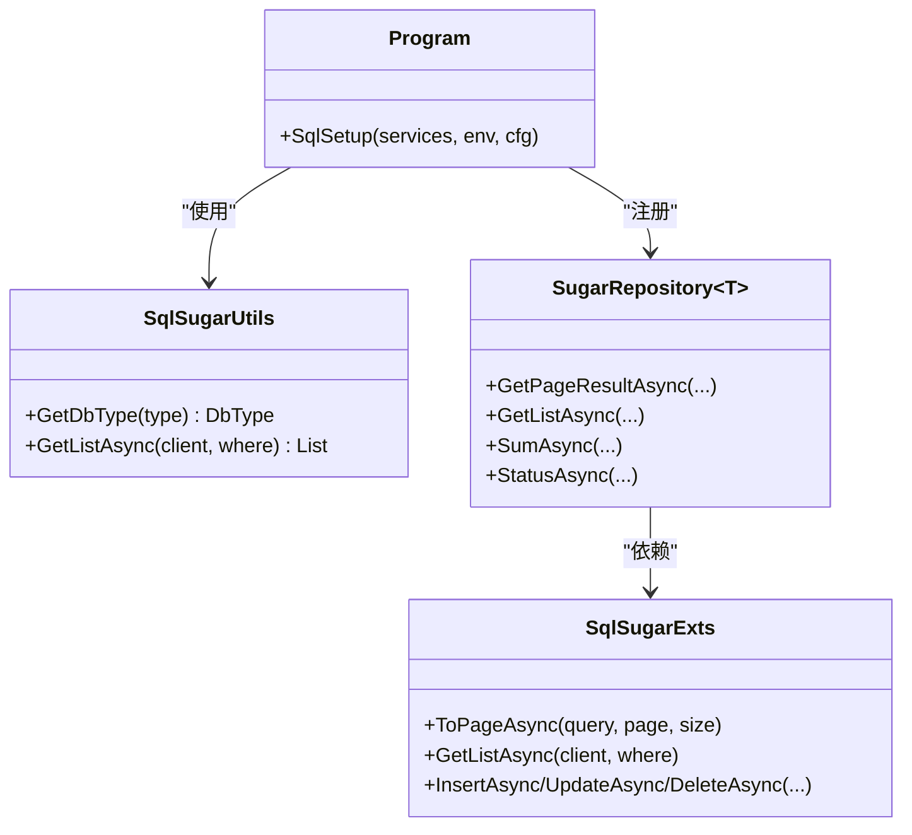
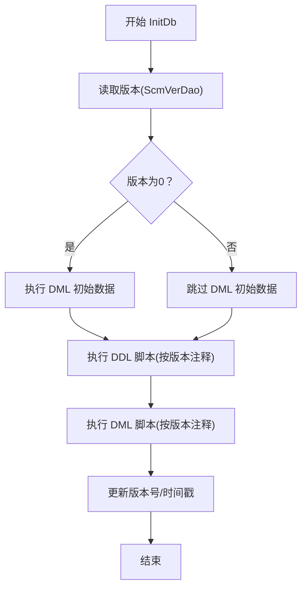
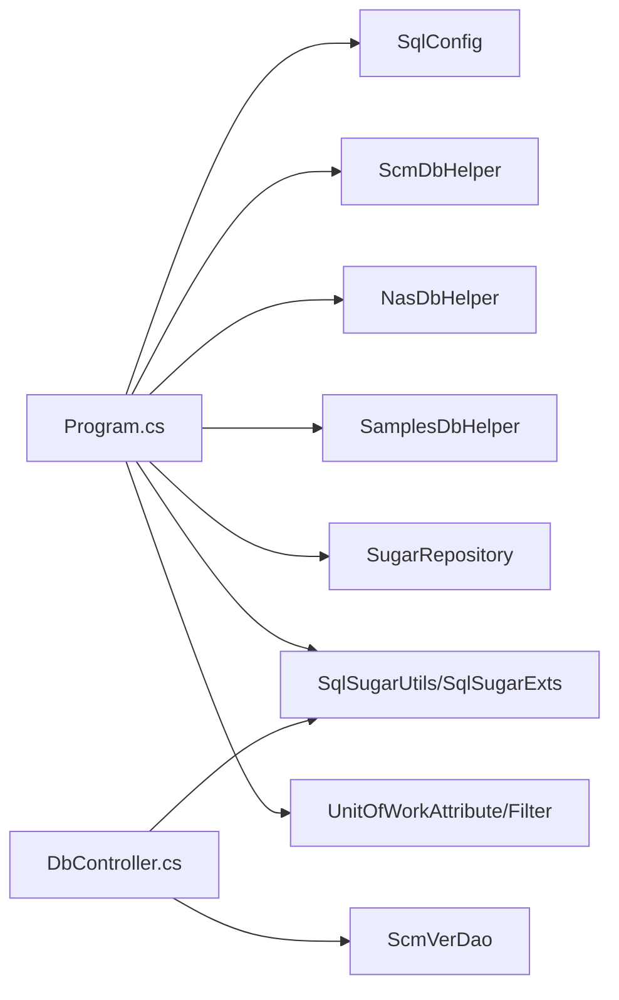

# 数据库配置管理

<cite>
**本文引用的文件**
- [Program.cs](file://Scm.Net/Program.cs)
- [appsettings.json](file://Scm.Net/appsettings.json)
- [SqlConfig.cs](file://Scm.Server/Config/SqlConfig.cs)
- [DataConfig.cs](file://Scm.Server/Config/DataConfig.cs)
- [DbController.cs](file://Scm.Net/Controllers/DbController.cs)
- [ScmDbHelper.cs](file://Scm.Dao/ScmDbHelper.cs)
- [NasDbHelper.cs](file://Nas.Dao/NasDbHelper.cs)
- [SamplesDbHelper.cs](file://Samples.Server.Dao/SamplesDbHelper.cs)
- [ScmVerDao.cs](file://Scm.Server.Dao/ScmVerDao.cs)
- [SugarRepository.cs](file://Scm.Dsa.Dba.Sugar/SugarRepository.cs)
- [SqlSugarUtils.cs](file://Scm.Dsa.Dba.Sugar/Utils/SqlSugarUtils.cs)
- [SqlSugarExts.cs](file://Scm.Dsa.Dba.Sugar/Utils/SqlSugarExts.cs)
- [UnitOfWorkAttribute.cs](file://Scm.Dsa.Dba.Sugar/Dsa/Dba/Sugar/UnitOfWork/Attribute/UnitOfWorkAttribute.cs)
- [UnitOfWorkFilter.cs](file://Scm.Dsa.Dba.Sugar/Dsa/Dba/Sugar/UnitOfWork/Filters/UnitOfWorkFilter.cs)
- [ScmDbTypeEnum.cs](file://Scm.Common/Enums/ScmDbTypeEnum.cs)
</cite>

## 目录
1. [简介](#简介)
2. [项目结构](#项目结构)
3. [核心组件](#核心组件)
4. [架构总览](#架构总览)
5. [详细组件分析](#详细组件分析)
6. [依赖关系分析](#依赖关系分析)
7. [性能考虑](#性能考虑)
8. [故障排除指南](#故障排除指南)
9. [结论](#结论)
10. [附录](#附录)

## 简介
本文件面向 Scm.Net 的数据库配置与管理，围绕 SqlSugar ORM 的连接配置、连接池与事务机制展开，结合项目中的数据库初始化流程（DDL/DML、版本管理）、多模块数据库初始化策略、以及扩展能力进行系统化说明。文档同时覆盖多数据库类型支持、连接字符串规范、连接超时与池化参数建议、监控与性能调优、以及常见问题排查路径。

## 项目结构
Scm.Net 将数据库配置与初始化分为三层：
- 应用层配置：通过 appsettings.json 与 SqlConfig/DataConfig 提供基础配置项。
- 初始化层：Program.cs 中完成 SqlSugar 客户端注册、连接配置、以及多模块数据库初始化。
- 功能层：各模块的 DbHelper（ScmDbHelper、NasDbHelper、SamplesDbHelper）负责表结构、数据与版本管理。

**图表来源**
- [Program.cs:282-356](file://Scm.Net/Program.cs#L282-L356)
- [appsettings.json:48-51](file://Scm.Net/appsettings.json#L48-L51)
- [SqlConfig.cs:1-23](file://Scm.Server/Config/SqlConfig.cs#L1-L23)
- [DataConfig.cs:1-24](file://Scm.Server/Config/DataConfig.cs#L1-L24)
- [ScmDbHelper.cs:51-83](file://Scm.Dao/ScmDbHelper.cs#L51-L83)
- [NasDbHelper.cs:24-57](file://Nas.Dao/NasDbHelper.cs#L24-L57)
- [SamplesDbHelper.cs:21-51](file://Samples.Server.Dao/SamplesDbHelper.cs#L21-L51)
- [SugarRepository.cs:13-82](file://Scm.Dsa.Dba.Sugar/SugarRepository.cs#L13-L82)
- [SqlSugarUtils.cs:8-26](file://Scm.Dsa.Dba.Sugar/Utils/SqlSugarUtils.cs#L8-L26)
- [SqlSugarExts.cs:1-127](file://Scm.Dsa.Dba.Sugar/Utils/SqlSugarExts.cs#L1-L127)
- [UnitOfWorkAttribute.cs:1-35](file://Scm.Dsa.Dba.Sugar/Dsa/Dba/Sugar/UnitOfWork/Attribute/UnitOfWorkAttribute.cs#L1-L35)
- [UnitOfWorkFilter.cs:1-41](file://Scm.Dsa.Dba.Sugar/Dsa/Dba/Sugar/UnitOfWork/Filters/UnitOfWorkFilter.cs#L1-L41)

**章节来源**
- [Program.cs:282-356](file://Scm.Net/Program.cs#L282-L356)
- [appsettings.json:48-51](file://Scm.Net/appsettings.json#L48-L51)
- [SqlConfig.cs:1-23](file://Scm.Server/Config/SqlConfig.cs#L1-L23)
- [DataConfig.cs:1-24](file://Scm.Server/Config/DataConfig.cs#L1-L24)

## 核心组件
- SqlSugar 客户端注册与配置：在 Program.cs 的 SqlSetup 中完成连接配置、实体类型映射、日志钩子与多模块初始化，并注册为单例服务。
- 数据库类型与连接字符串：SqlConfig 提供默认类型与连接串；DbController 支持在线检测不同数据库类型的连接字符串拼接规则。
- 版本与初始化：ScmDbHelper 统一维护版本表（ScmVerDao），按模块执行 DDL/DML 并记录版本。
- 仓储与扩展：SugarRepository 提供分页、查询、统计等通用能力；SqlSugarExts 提供便捷的查询/插入/更新/删除扩展方法。
- 事务控制：UnitOfWorkAttribute/Filter 基于特性与过滤器实现方法级事务控制。

**章节来源**
- [Program.cs:282-356](file://Scm.Net/Program.cs#L282-L356)
- [DbController.cs:45-211](file://Scm.Net/Controllers/DbController.cs#L45-L211)
- [ScmDbHelper.cs:51-83](file://Scm.Dao/ScmDbHelper.cs#L51-L83)
- [ScmVerDao.cs:1-42](file://Scm.Server.Dao/ScmVerDao.cs#L1-L42)
- [SugarRepository.cs:13-189](file://Scm.Dsa.Dba.Sugar/SugarRepository.cs#L13-L189)
- [SqlSugarExts.cs:1-127](file://Scm.Dsa.Dba.Sugar/Utils/SqlSugarExts.cs#L1-L127)
- [UnitOfWorkAttribute.cs:1-35](file://Scm.Dsa.Dba.Sugar/Dsa/Dba/Sugar/UnitOfWork/Attribute/UnitOfWorkAttribute.cs#L1-L35)
- [UnitOfWorkFilter.cs:1-41](file://Scm.Dsa.Dba.Sugar/Dsa/Dba/Sugar/UnitOfWork/Filters/UnitOfWorkFilter.cs#L1-L41)

## 架构总览
下图展示从应用启动到数据库初始化的关键交互：

**图表来源**
- [Program.cs:282-356](file://Scm.Net/Program.cs#L282-L356)
- [ScmDbHelper.cs:51-83](file://Scm.Dao/ScmDbHelper.cs#L51-L83)
- [NasDbHelper.cs:24-57](file://Nas.Dao/NasDbHelper.cs#L24-L57)
- [SamplesDbHelper.cs:21-51](file://Samples.Server.Dao/SamplesDbHelper.cs#L21-L51)

## 详细组件分析

### 数据库连接配置与初始化
- 连接配置来源
  - appsettings.json 中的 "Sql" 节点提供默认数据库类型与连接串。
  - SqlConfig 在运行期准备默认值，确保 Type 与 Text 不为空。
- 客户端注册
  - Program.cs 的 SqlSetup 使用 SqlSugarScope 注册客户端，设置自动关闭连接、属性初始化键类型、实体类型映射回调（针对枚举与整型在 SQLite 的特殊处理）。
  - 注册完成后，依次初始化主模块、示例模块与 NAS 模块的数据库。
- 在线连接测试
  - DbController 支持根据 DbType 构建连接字符串并尝试打开连接，验证连通性。

**图表来源**
- [Program.cs:282-356](file://Scm.Net/Program.cs#L282-L356)
- [appsettings.json:48-51](file://Scm.Net/appsettings.json#L48-L51)
- [SqlConfig.cs:10-21](file://Scm.Server/Config/SqlConfig.cs#L10-L21)

**章节来源**
- [appsettings.json:48-51](file://Scm.Net/appsettings.json#L48-L51)
- [SqlConfig.cs:1-23](file://Scm.Server/Config/SqlConfig.cs#L1-L23)
- [Program.cs:282-356](file://Scm.Net/Program.cs#L282-L356)
- [DbController.cs:45-211](file://Scm.Net/Controllers/DbController.cs#L45-L211)

### 连接池管理与性能参数
- 连接池参数
  - 项目中未显式设置最大/最小池大小与连接超时参数，使用 SqlSugar 默认行为。
  - 可参考 DbController 中注释的参数示例（如 Max Pool Size、Min Pool Size、Connection Timeout），按生产环境需要在连接字符串中配置。
- SQLite 特性
  - Program.cs 中对 SQLite 的枚举与长整型采用 INTEGER 映射，有助于提升兼容性与性能。
- 日志与监控
  - Program.cs 中注册了 OnLogExecuting 钩子，可用于 SQL 调试输出；实际部署建议结合 Serilog 输出到文件或集中式日志系统。

**章节来源**
- [Program.cs:282-356](file://Scm.Net/Program.cs#L282-L356)
- [DbController.cs:66-67](file://Scm.Net/Controllers/DbController.cs#L66-L67)
- [DbController.cs:92-93](file://Scm.Net/Controllers/DbController.cs#L92-L93)
- [DbController.cs:102-103](file://Scm.Net/Controllers/DbController.cs#L102-L103)
- [DbController.cs:128-129](file://Scm.Net/Controllers/DbController.cs#L128-L129)
- [DbController.cs:153-154](file://Scm.Net/Controllers/DbController.cs#L153-L154)
- [DbController.cs:158-159](file://Scm.Net/Controllers/DbController.cs#L158-L159)
- [DbController.cs:183-184](file://Scm.Net/Controllers/DbController.cs#L183-L184)

### 事务处理机制
- 方法级事务
  - UnitOfWorkAttribute 用于标记需要事务的方法，支持指定隔离级别。
  - UnitOfWorkFilter 在执行 Action 前检查方法是否带有该特性，若存在则开启事务，否则跳过。
- 事务隔离级别
  - 默认隔离级别为 ReadCommitted，可通过构造函数参数调整。

**图表来源**
- [UnitOfWorkAttribute.cs:1-35](file://Scm.Dsa.Dba.Sugar/Dsa/Dba/Sugar/UnitOfWork/Attribute/UnitOfWorkAttribute.cs#L1-L35)
- [UnitOfWorkFilter.cs:30-41](file://Scm.Dsa.Dba.Sugar/Dsa/Dba/Sugar/UnitOfWork/Filters/UnitOfWorkFilter.cs#L30-L41)

**章节来源**
- [UnitOfWorkAttribute.cs:1-35](file://Scm.Dsa.Dba.Sugar/Dsa/Dba/Sugar/UnitOfWork/Attribute/UnitOfWorkAttribute.cs#L1-L35)
- [UnitOfWorkFilter.cs:1-41](file://Scm.Dsa.Dba.Sugar/Dsa/Dba/Sugar/UnitOfWork/Filters/UnitOfWorkFilter.cs#L1-L41)

### SqlSugar ORM 配置要点
- 数据库类型映射
  - SqlSugarUtils 提供字符串到 DbType 的映射，默认返回 MySql，支持 sqlite/sqlserver/oracle/postgresql 等。
  - Program.cs 中通过 ConfigureExternalServices.EntityService 实现枚举与数值类型在 SQLite 与非 SQLite 的差异化映射。
- 查询与分页
  - SugarRepository 提供分页查询、条件查询、排序、求和等常用接口。
  - SqlSugarExts 提供 ToPageAsync、GetListAsync、Insert/Update/Delete 等扩展方法，简化常用操作。
- 租户与软删除过滤
  - SugarRepository 在构造时动态添加查询过滤器，支持基于租户与软删除字段的自动过滤。

**图表来源**
- [SqlSugarUtils.cs:8-26](file://Scm.Dsa.Dba.Sugar/Utils/SqlSugarUtils.cs#L8-L26)
- [Program.cs:282-356](file://Scm.Net/Program.cs#L282-L356)
- [SugarRepository.cs:93-189](file://Scm.Dsa.Dba.Sugar/SugarRepository.cs#L93-L189)
- [SqlSugarExts.cs:9-127](file://Scm.Dsa.Dba.Sugar/Utils/SqlSugarExts.cs#L9-L127)

**章节来源**
- [SqlSugarUtils.cs:1-34](file://Scm.Dsa.Dba.Sugar/Utils/SqlSugarUtils.cs#L1-L34)
- [Program.cs:282-356](file://Scm.Net/Program.cs#L282-L356)
- [SugarRepository.cs:13-189](file://Scm.Dsa.Dba.Sugar/SugarRepository.cs#L13-L189)
- [SqlSugarExts.cs:1-127](file://Scm.Dsa.Dba.Sugar/Utils/SqlSugarExts.cs#L1-L127)

### 数据库初始化流程（DDL/DML/版本管理）
- 版本表
  - ScmVerDao 作为版本元数据表，记录每个模块的 key、ver、date、update_time、create_time。
- 初始化步骤
  - 读取版本：若不存在则创建默认记录。
  - 初始化表：扫描模块 Dao 类型，CodeFirst 初始化对应表。
  - 执行脚本：按版本号解析脚本注释中的版本标记，仅执行大于当前版本的语句。
  - 写入版本：更新版本号与时间戳。
- 多模块初始化
  - Program.cs 依次初始化 ScmDbHelper、SamplesDbHelper、NasDbHelper，分别执行各自模块的 DDL/DML 与版本更新。

**图表来源**
- [ScmDbHelper.cs:51-83](file://Scm.Dao/ScmDbHelper.cs#L51-L83)
- [ScmDbHelper.cs:213-262](file://Scm.Dao/ScmDbHelper.cs#L213-L262)
- [ScmDbHelper.cs:90-118](file://Scm.Dao/ScmDbHelper.cs#L90-L118)
- [ScmVerDao.cs:1-42](file://Scm.Server.Dao/ScmVerDao.cs#L1-L42)
- [NasDbHelper.cs:24-57](file://Nas.Dao/NasDbHelper.cs#L24-L57)
- [SamplesDbHelper.cs:21-51](file://Samples.Server.Dao/SamplesDbHelper.cs#L21-L51)

**章节来源**
- [ScmDbHelper.cs:51-83](file://Scm.Dao/ScmDbHelper.cs#L51-L83)
- [ScmDbHelper.cs:213-262](file://Scm.Dao/ScmDbHelper.cs#L213-L262)
- [ScmDbHelper.cs:90-118](file://Scm.Dao/ScmDbHelper.cs#L90-L118)
- [ScmVerDao.cs:1-42](file://Scm.Server.Dao/ScmVerDao.cs#L1-L42)
- [NasDbHelper.cs:24-57](file://Nas.Dao/NasDbHelper.cs#L24-L57)
- [SamplesDbHelper.cs:21-51](file://Samples.Server.Dao/SamplesDbHelper.cs#L21-L51)

### 多数据库支持与连接字符串格式
- 支持类型
  - 通过 SqlSugarUtils 与 DbController 的分支逻辑支持 sqlite、sqlserver、mysql、oracle、postgresql、db2、dm 等。
  - ScmDbTypeEnum 提供统一的数据库类型枚举，便于扩展与识别。
- 连接字符串示例（来自 DbController 注释与实现）
  - MySQL：server=...;port=...;database=...;uid=...;pwd=...;charset=utf8mb4;sslmode=None;...
  - SQL Server：Data Source=...;Initial Catalog=...;User ID=...;Password=...;TrustServerCertificate=True;...
  - SQLite：Data Source=...;Version=3;Pooling=true;Max Pool Size=...;Journal Mode=WAL;...
  - Oracle：User Id=...;Password=...;Data Source=...;Pooling=true;...
  - PostgreSQL：Host=...;Port=...;Database=...;Username=...;Password=...;...
  - DB2：Server=...;Database=...;Uid=...;Pwd=...;CharSet=UTF-8;...
  - DM：Server=...;Port=...;Database=...;Uid=...;Pwd=...;Pooling=true;...

**章节来源**
- [SqlSugarUtils.cs:8-26](file://Scm.Dsa.Dba.Sugar/Utils/SqlSugarUtils.cs#L8-L26)
- [DbController.cs:45-211](file://Scm.Net/Controllers/DbController.cs#L45-L211)
- [ScmDbTypeEnum.cs:1-23](file://Scm.Common/Enums/ScmDbTypeEnum.cs#L1-L23)

### 读写分离与连接超时处理
- 读写分离
  - 项目未提供内置的读写分离实现。可在 SqlSugarScope 上通过多个 ConnectionConfig 注册多个客户端实例，再在业务层按需选择读/写客户端。
- 连接超时
  - 可在连接字符串中设置 Connect Timeout 或 Connection Timeout 参数（参考 DbController 注释示例）。
  - 若出现超时，建议检查网络延迟、防火墙、数据库服务器负载与连接池大小。

[本节为通用指导，无需特定文件引用]

### 数据库监控、性能调优与故障排除
- 监控与日志
  - Program.cs 中注册了 OnLogExecuting 钩子，可用于 SQL 调试输出；建议结合 Serilog 输出到文件或集中式日志系统。
- 性能调优
  - 连接池：在连接字符串中设置 Max Pool Size、Min Pool Size（参考 DbController 注释示例）。
  - SQLite：启用 WAL 模式与合适的池化参数（参考 DbController 注释示例）。
  - 查询优化：优先使用 SugarRepository/SqlSugarExts 的分页与条件查询，避免一次性加载大结果集。
- 故障排除
  - 连接失败：确认连接字符串格式、主机可达性、凭据正确性与防火墙策略。
  - 版本脚本未执行：检查脚本注释中的版本标记格式与当前版本号。
  - 事务未生效：确认方法是否标注 UnitOfWorkAttribute，以及是否被 UnitOfWorkFilter 拦截。

**章节来源**
- [Program.cs:326-336](file://Scm.Net/Program.cs#L326-L336)
- [DbController.cs:66-67](file://Scm.Net/Controllers/DbController.cs#L66-L67)
- [DbController.cs:92-93](file://Scm.Net/Controllers/DbController.cs#L92-L93)
- [DbController.cs:102-103](file://Scm.Net/Controllers/DbController.cs#L102-L103)
- [DbController.cs:128-129](file://Scm.Net/Controllers/DbController.cs#L128-L129)
- [DbController.cs:153-154](file://Scm.Net/Controllers/DbController.cs#L153-L154)
- [DbController.cs:158-159](file://Scm.Net/Controllers/DbController.cs#L158-L159)
- [DbController.cs:183-184](file://Scm.Net/Controllers/DbController.cs#L183-L184)

## 依赖关系分析
- 组件耦合
  - Program.cs 依赖 SqlConfig/appsettings.json、ScmDbHelper/NasDbHelper/SamplesDbHelper、SugarRepository、SqlSugarUtils/SqlSugarExts、UnitOfWorkAttribute/Filter。
  - DbController 独立于 IoC，直接构造连接配置并测试连通性。
- 外部依赖
  - SqlSugar ORM、Microsoft.Extensions.*、Serilog。

**图表来源**
- [Program.cs:282-356](file://Scm.Net/Program.cs#L282-L356)
- [SqlConfig.cs:1-23](file://Scm.Server/Config/SqlConfig.cs#L1-L23)
- [ScmDbHelper.cs:51-83](file://Scm.Dao/ScmDbHelper.cs#L51-L83)
- [NasDbHelper.cs:24-57](file://Nas.Dao/NasDbHelper.cs#L24-L57)
- [SamplesDbHelper.cs:21-51](file://Samples.Server.Dao/SamplesDbHelper.cs#L21-L51)
- [SugarRepository.cs:13-82](file://Scm.Dsa.Dba.Sugar/SugarRepository.cs#L13-L82)
- [SqlSugarUtils.cs:8-26](file://Scm.Dsa.Dba.Sugar/Utils/SqlSugarUtils.cs#L8-L26)
- [SqlSugarExts.cs:1-127](file://Scm.Dsa.Dba.Sugar/Utils/SqlSugarExts.cs#L1-L127)
- [UnitOfWorkAttribute.cs:1-35](file://Scm.Dsa.Dba.Sugar/Dsa/Dba/Sugar/UnitOfWork/Attribute/UnitOfWorkAttribute.cs#L1-L35)
- [UnitOfWorkFilter.cs:1-41](file://Scm.Dsa.Dba.Sugar/Dsa/Dba/Sugar/UnitOfWork/Filters/UnitOfWorkFilter.cs#L1-L41)
- [DbController.cs:45-211](file://Scm.Net/Controllers/DbController.cs#L45-L211)
- [ScmVerDao.cs:1-42](file://Scm.Server.Dao/ScmVerDao.cs#L1-L42)

**章节来源**
- [Program.cs:282-356](file://Scm.Net/Program.cs#L282-L356)
- [DbController.cs:45-211](file://Scm.Net/Controllers/DbController.cs#L45-L211)

## 性能考虑
- 连接池参数：在连接字符串中设置合理的 Max Pool Size、Min Pool Size 与连接超时，避免高并发下的连接争用。
- SQLite 优化：启用 WAL 模式与合适的池化参数，减少锁竞争。
- 查询优化：使用分页与条件过滤，避免全表扫描；合理设计索引。
- 日志开销：生产环境建议降低日志级别或禁用 SQL 拼接调试输出，避免影响性能。

[本节为通用指导，无需特定文件引用]

## 故障排除指南
- 连接失败
  - 检查连接字符串格式与参数完整性（主机、端口、数据库、用户名、密码）。
  - 使用 DbController 的连接测试接口验证连通性。
- 版本脚本未执行
  - 确认脚本注释中版本标记格式正确（如 Ver: 数字），并检查当前版本号。
- 事务未生效
  - 确认方法标注了 UnitOfWorkAttribute，且被 UnitOfWorkFilter 拦截。
- SQLite 类型问题
  - 确保枚举与长整型在 SQLite 下映射为 INTEGER，避免类型不匹配导致的异常。

**章节来源**
- [DbController.cs:45-211](file://Scm.Net/Controllers/DbController.cs#L45-L211)
- [ScmDbHelper.cs:213-262](file://Scm.Dao/ScmDbHelper.cs#L213-L262)
- [UnitOfWorkAttribute.cs:1-35](file://Scm.Dsa.Dba.Sugar/Dsa/Dba/Sugar/UnitOfWork/Attribute/UnitOfWorkAttribute.cs#L1-L35)
- [UnitOfWorkFilter.cs:30-41](file://Scm.Dsa.Dba.Sugar/Dsa/Dba/Sugar/UnitOfWork/Filters/UnitOfWorkFilter.cs#L30-L41)
- [Program.cs:302-320](file://Scm.Net/Program.cs#L302-L320)

## 结论
Scm.Net 的数据库配置以 SqlSugar 为核心，通过 Program.cs 的集中初始化与多模块 DbHelper 的版本化脚本执行，实现了灵活、可扩展的数据库生命周期管理。配合仓储与扩展方法，开发者可以快速实现 CRUD、分页与事务控制。生产环境中建议明确连接池与超时参数、启用 WAL 模式、合理设计索引，并结合日志系统进行监控与排障。

## 附录
- 配置示例（摘自 appsettings.json）
  - Sql.Type: 默认 Sqlite
  - Sql.Text: Data Source=data/scm.db
- 最佳实践
  - 在连接字符串中显式设置连接超时与池化参数。
  - 使用版本化脚本管理 DDL/DML，确保升级幂等。
  - 对关键业务使用 UnitOfWorkAttribute 确保一致性。
  - 生产环境启用 WAL 模式与合适的池化参数。

**章节来源**
- [appsettings.json:48-51](file://Scm.Net/appsettings.json#L48-L51)
- [DbController.cs:66-67](file://Scm.Net/Controllers/DbController.cs#L66-L67)
- [DbController.cs:92-93](file://Scm.Net/Controllers/DbController.cs#L92-L93)
- [DbController.cs:102-103](file://Scm.Net/Controllers/DbController.cs#L102-L103)
- [DbController.cs:128-129](file://Scm.Net/Controllers/DbController.cs#L128-L129)
- [DbController.cs:153-154](file://Scm.Net/Controllers/DbController.cs#L153-L154)
- [DbController.cs:158-159](file://Scm.Net/Controllers/DbController.cs#L158-L159)
- [DbController.cs:183-184](file://Scm.Net/Controllers/DbController.cs#L183-L184)