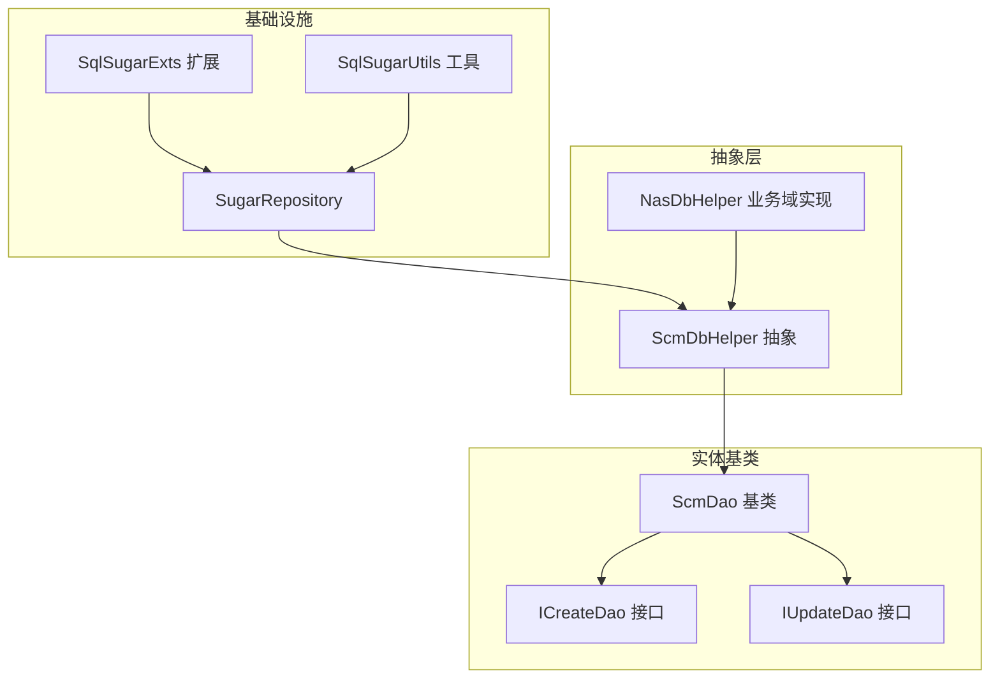
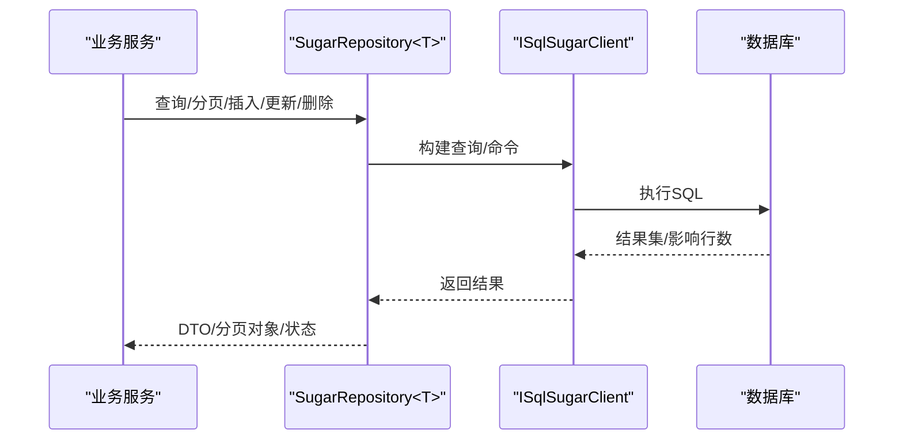
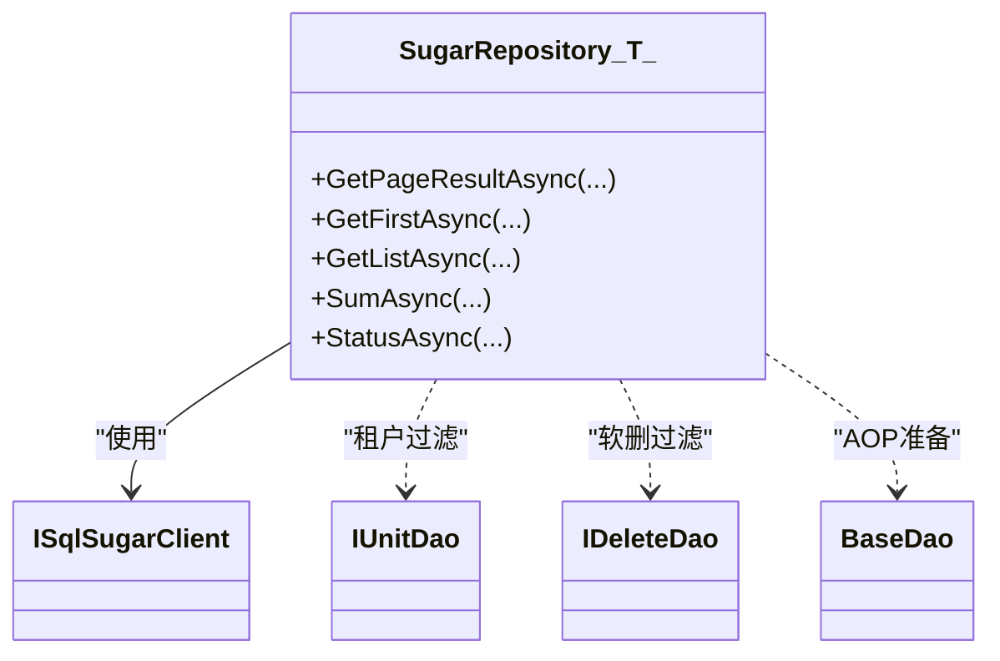
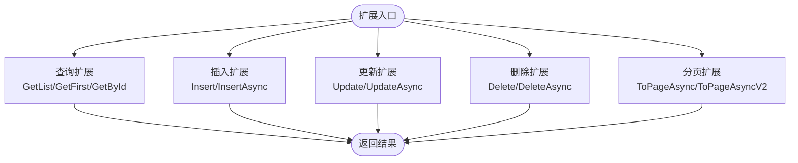
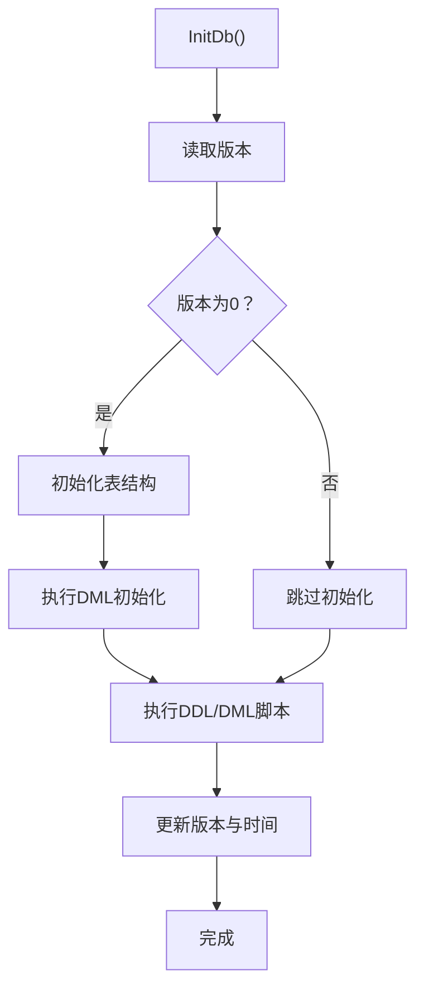
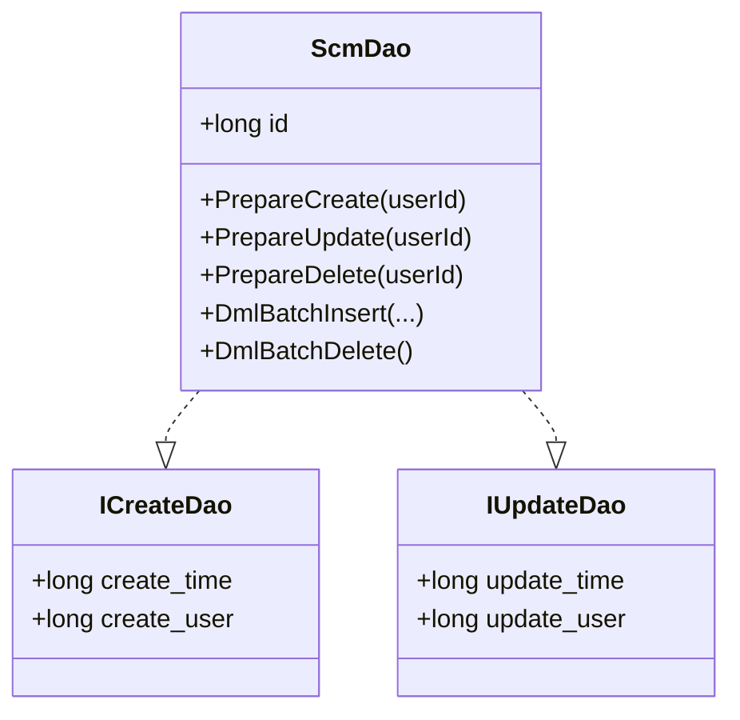
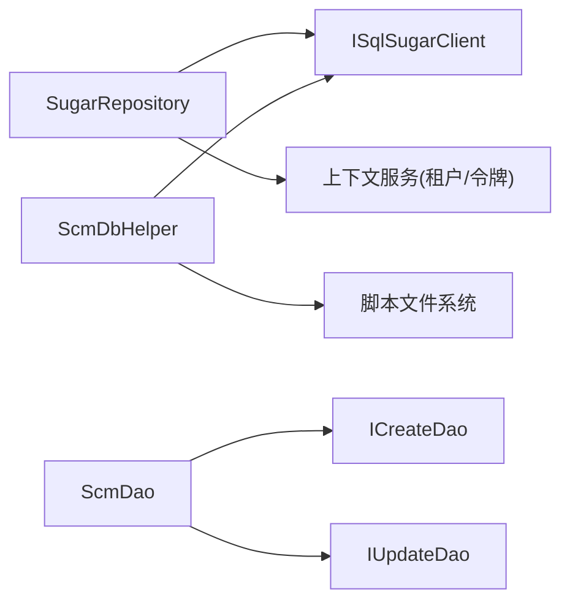

# 数据访问层

<cite>
**本文引用的文件**
- [SugarRepository.cs](file://Scm.Dsa.Dba.Sugar/SugarRepository.cs)
- [SqlSugarExts.cs](file://Scm.Dsa.Dba.Sugar/Utils/SqlSugarExts.cs)
- [SqlSugarUtils.cs](file://Scm.Dsa.Dba.Sugar/Utils/SqlSugarUtils.cs)
- [ScmDbHelper.cs](file://Scm.Dao/ScmDbHelper.cs)
- [NasDbHelper.cs](file://Nas.Dao/NasDbHelper.cs)
- [ScmDao.cs](file://Scm.Server.Dao/Dao/ScmDao.cs)
- [ICreateDao.cs](file://Scm.Server.Dao/Dao/ICreateDao.cs)
- [IUpdateDao.cs](file://Scm.Server.Dao/Dao/IUpdateDao.cs)
</cite>

## 目录
1. [简介](#简介)
2. [项目结构](#项目结构)
3. [核心组件](#核心组件)
4. [架构总览](#架构总览)
5. [组件详解](#组件详解)
6. [依赖关系分析](#依赖关系分析)
7. [性能与优化](#性能与优化)
8. [故障排查](#故障排查)
9. [结论](#结论)
10. [附录：API 接口清单](#附录api-接口清单)

## 简介
本文件面向 Scm.Net 的数据访问层（DAO 层），系统性阐述基于 SqlSugar ORM 的数据访问架构，覆盖仓储模式实现、数据库抽象层、连接与事务管理、DAO 设计原则、查询与分页、批量处理、配置与版本迁移、错误处理与最佳实践等内容。读者可据此快速理解并高效使用数据访问能力。

## 项目结构
数据访问相关的关键模块分布如下：
- 基础设施与扩展
  - 基于 SqlSugar 的通用仓储 SugarRepository
  - SqlSugar 扩展方法集 SqlSugarExts
  - 数据库类型工具 SqlSugarUtils
- 抽象与基类
  - ScmDbHelper：统一的数据库初始化、迁移与 DML 写入抽象
  - NasDbHelper：业务域（NAS）的数据库初始化与菜单/权限初始化
  - ScmDao 及其接口 ICreateDao/IUpdateDao：实体生命周期准备与字段约定
- 组件关系概览

图示来源
- [SugarRepository.cs:13-82](file://Scm.Dsa.Dba.Sugar/SugarRepository.cs#L13-L82)
- [ScmDbHelper.cs:16-83](file://Scm.Dao/ScmDbHelper.cs#L16-L83)
- [NasDbHelper.cs:9-57](file://Nas.Dao/NasDbHelper.cs#L9-L57)
- [ScmDao.cs:6-28](file://Scm.Server.Dao/Dao/ScmDao.cs#L6-L28)
- [ICreateDao.cs:3-8](file://Scm.Server.Dao/Dao/ICreateDao.cs#L3-L8)
- [IUpdateDao.cs:3-7](file://Scm.Server.Dao/Dao/IUpdateDao.cs#L3-L7)

章节来源
- [SugarRepository.cs:13-82](file://Scm.Dsa.Dba.Sugar/SugarRepository.cs#L13-L82)
- [ScmDbHelper.cs:16-83](file://Scm.Dao/ScmDbHelper.cs#L16-L83)
- [NasDbHelper.cs:9-57](file://Nas.Dao/NasDbHelper.cs#L9-L57)
- [ScmDao.cs:6-28](file://Scm.Server.Dao/Dao/ScmDao.cs#L6-L28)
- [ICreateDao.cs:3-8](file://Scm.Server.Dao/Dao/ICreateDao.cs#L3-L8)
- [IUpdateDao.cs:3-7](file://Scm.Server.Dao/Dao/IUpdateDao.cs#L3-L7)

## 核心组件
- 通用仓储 SugarRepository<T>
  - 提供分页查询、列表查询、首条查询、求和等常用方法
  - 注入 AOP 过滤器：自动注入租户过滤、软删除过滤、插入/更新前的数据准备
  - 记录 SQL 日志便于调试
- SqlSugar 扩展 SqlSugarExts
  - 提供分页转换、按表达式查询/插入/更新/删除等便捷方法
- 数据库抽象 ScmDbHelper
  - 初始化表结构、执行 DDL/DML 脚本、版本控制、清空/截断表
  - 统一写入流程（PrepareCreate/PrepareUpdate）
- 业务域抽象 NasDbHelper
  - 在 ScmDbHelper 基础上完成 NAS 专属菜单、权限、应用等初始化
- 实体基类与接口
  - ScmDao：统一主键、生命周期准备、批量 DML 钩子
  - ICreateDao/IUpdateDao：标准化创建/更新时间与用户字段

章节来源
- [SugarRepository.cs:13-189](file://Scm.Dsa.Dba.Sugar/SugarRepository.cs#L13-L189)
- [SqlSugarExts.cs:7-126](file://Scm.Dsa.Dba.Sugar/Utils/SqlSugarExts.cs#L7-L126)
- [ScmDbHelper.cs:16-779](file://Scm.Dao/ScmDbHelper.cs#L16-L779)
- [NasDbHelper.cs:9-166](file://Nas.Dao/NasDbHelper.cs#L9-L166)
- [ScmDao.cs:6-68](file://Scm.Server.Dao/Dao/ScmDao.cs#L6-L68)
- [ICreateDao.cs:3-8](file://Scm.Server.Dao/Dao/ICreateDao.cs#L3-L8)
- [IUpdateDao.cs:3-7](file://Scm.Server.Dao/Dao/IUpdateDao.cs#L3-L7)

## 架构总览
下图展示从服务到 DAO 的调用链路与数据流：

图示来源
- [SugarRepository.cs:93-189](file://Scm.Dsa.Dba.Sugar/SugarRepository.cs#L93-L189)
- [SqlSugarExts.cs:36-124](file://Scm.Dsa.Dba.Sugar/Utils/SqlSugarExts.cs#L36-L124)

## 组件详解

### 通用仓储 SugarRepository<T>
- 角色定位
  - 作为所有实体的统一数据访问入口，封装常用 CRUD 与查询能力
- 核心特性
  - 租户过滤：通过上下文令牌动态注入 unit_id 过滤
  - 软删除过滤：自动过滤 row_delete=false 的记录
  - AOP 生命周期：在插入/更新前自动填充创建/更新时间与用户
  - SQL 日志：格式化输出 SQL 语句，便于审计与排错
- 查询与分页
  - 支持表达式条件、字符串条件、排序枚举、分页返回总条目与总页数
- 聚合与状态
  - 提供求和、状态切换等聚合操作

图示来源
- [SugarRepository.cs:13-82](file://Scm.Dsa.Dba.Sugar/SugarRepository.cs#L13-L82)
- [SugarRepository.cs:93-189](file://Scm.Dsa.Dba.Sugar/SugarRepository.cs#L93-L189)

章节来源
- [SugarRepository.cs:13-189](file://Scm.Dsa.Dba.Sugar/SugarRepository.cs#L13-L189)

### SqlSugar 扩展 SqlSugarExts
- 提供对 ISugarQueryable 与 ISqlSugarClient 的扩展
- 功能点
  - 分页转换：返回统一的分页响应对象
  - 查询：按表达式获取首条/列表、按主键获取
  - 插入/更新/删除：支持单对象与批量对象

图示来源
- [SqlSugarExts.cs:7-126](file://Scm.Dsa.Dba.Sugar/Utils/SqlSugarExts.cs#L7-L126)

章节来源
- [SqlSugarExts.cs:7-126](file://Scm.Dsa.Dba.Sugar/Utils/SqlSugarExts.cs#L7-L126)

### 数据库抽象层 ScmDbHelper
- 职责
  - 表结构初始化（CodeFirst）、DDL/DML 脚本执行
  - 版本控制：记录数据库版本与更新时间
  - 统一写入：PrepareCreate/PrepareUpdate 流程
  - 清空/截断：支持按程序集扫描并清理或截断表
- 初始化流程
  - 读取版本 -> 初始化表 -> 执行 DDL/DML -> 更新版本
- DML 示例
  - 创建 UID、语言、计量单位、应用、菜单、角色与用户等基础数据

图示来源
- [ScmDbHelper.cs:30-83](file://Scm.Dao/ScmDbHelper.cs#L30-L83)
- [ScmDbHelper.cs:213-262](file://Scm.Dao/ScmDbHelper.cs#L213-L262)

章节来源
- [ScmDbHelper.cs:16-779](file://Scm.Dao/ScmDbHelper.cs#L16-L779)

### 业务域抽象 NasDbHelper
- 继承 ScmDbHelper，扩展 NAS 专属菜单、权限、应用等初始化
- 版本号与发布日期独立维护
- 通过 CreateMenu/SaveDao 等方法构建菜单树与角色授权

章节来源
- [NasDbHelper.cs:9-166](file://Nas.Dao/NasDbHelper.cs#L9-L166)

### 实体基类与接口 ScmDao、ICreateDao、IUpdateDao
- ScmDao
  - 主键 id、生命周期准备（创建/更新/删除）
  - 批量 DML 钩子（可重写）
- ICreateDao/IUpdateDao
  - 标准化 create_time/create_user 与 update_time/update_user 字段

图示来源
- [ScmDao.cs:6-68](file://Scm.Server.Dao/Dao/ScmDao.cs#L6-L68)
- [ICreateDao.cs:3-8](file://Scm.Server.Dao/Dao/ICreateDao.cs#L3-L8)
- [IUpdateDao.cs:3-7](file://Scm.Server.Dao/Dao/IUpdateDao.cs#L3-L7)

章节来源
- [ScmDao.cs:6-68](file://Scm.Server.Dao/Dao/ScmDao.cs#L6-L68)
- [ICreateDao.cs:3-8](file://Scm.Server.Dao/Dao/ICreateDao.cs#L3-L8)
- [IUpdateDao.cs:3-7](file://Scm.Server.Dao/Dao/IUpdateDao.cs#L3-L7)

## 依赖关系分析
- 组件耦合
  - SugarRepository 依赖 ISqlSugarClient 与上下文服务（租户/令牌）
  - ScmDbHelper 依赖 ISqlSugarClient 与文件系统脚本
  - 实体基类与接口被所有 DAO 继承或实现
- 外部依赖
  - SqlSugar ORM
  - 日志与通用工具（如时间、加密、映射等）

图示来源
- [SugarRepository.cs:18-82](file://Scm.Dsa.Dba.Sugar/SugarRepository.cs#L18-L82)
- [ScmDbHelper.cs:30-83](file://Scm.Dao/ScmDbHelper.cs#L30-L83)
- [ScmDao.cs:6-28](file://Scm.Server.Dao/Dao/ScmDao.cs#L6-L28)

章节来源
- [SugarRepository.cs:18-82](file://Scm.Dsa.Dba.Sugar/SugarRepository.cs#L18-L82)
- [ScmDbHelper.cs:30-83](file://Scm.Dao/ScmDbHelper.cs#L30-L83)
- [ScmDao.cs:6-28](file://Scm.Server.Dao/Dao/ScmDao.cs#L6-L28)

## 性能与优化
- 查询与分页
  - 使用表达式条件与排序，避免全表扫描；合理使用索引覆盖
  - 分页时先查总数再分页，注意大数据量场景下的排序成本
- 批量操作
  - 批量插入/更新/删除优先使用扩展方法提供的批量版本，减少往返
- AOP 与过滤
  - 租户与软删除过滤在查询阶段生效，避免业务层重复判断
- 日志与诊断
  - SQL 日志用于定位慢查询与异常，建议在开发/测试环境开启，生产谨慎开启

## 故障排查
- SQL 日志定位
  - 通过仓储 AOP OnLogExecuting 输出格式化 SQL，核对参数绑定
- 版本与脚本
  - 若初始化失败，检查版本记录与脚本注释中的版本标记是否匹配
- 连接与事务
  - 使用事务包裹 DDL/DML 或批量写入，确保一致性
- 租户与软删
  - 若查询不到数据，确认租户令牌与 row_delete 过滤是否符合预期

章节来源
- [SugarRepository.cs:71-81](file://Scm.Dsa.Dba.Sugar/SugarRepository.cs#L71-L81)
- [ScmDbHelper.cs:213-262](file://Scm.Dao/ScmDbHelper.cs#L213-L262)

## 结论
Scm.Net 的数据访问层以 SqlSugar 为核心，结合通用仓储、实体基类与脚本化迁移，形成高内聚、低耦合且易于扩展的数据访问体系。通过 AOP、过滤器与统一写入流程，既保证了业务一致性，也提升了开发效率。建议在实际项目中遵循本文的最佳实践，持续优化查询与批处理性能，并完善监控与日志体系。

## 附录：API 接口清单
以下为数据访问层常用接口与方法（按功能分组），便于快速检索与集成。

- 通用仓储（SugarRepository<T>）
  - 分页查询
    - GetPageResultAsync(where, page, limit, order, orderEnum)
    - GetPageResultAsync(where, strWhere, page, limit, order, orderEnum)
  - 列表与首条
    - GetListAsync(where, order, orderEnum)
    - GetListAsync(where, order)
    - GetFirstAsync(where, order, orderEnum)
  - 聚合与状态
    - SumAsync(where, expression)
    - StatusAsync(id)
  - 生命周期与日志
    - AOP DataExecuting（插入/更新前准备）
    - AOP OnLogExecuting（SQL 日志）

- SqlSugar 扩展（SqlSugarExts）
  - 分页
    - ToPageAsync(query, pageIndex, pageSize, isMapper)
    - ToPageAsyncV2(query, pageIndex, pageSize, isMapper)
  - 查询
    - GetListAsync(client, whereExpression)
    - GetFirstAsync(client, whereExpression)
    - GetByIdAsync(client, id)
  - 插入/更新/删除
    - InsertAsync/Insert(client, obj/list)
    - UpdateAsync/Update(client, where/updateObj)
    - DeleteAsync/Delete(client, where)

- 数据库抽象（ScmDbHelper/NasDbHelper）
  - 初始化与迁移
    - InitDb()/DropDb()
    - ExecuteSql(file, ver)
  - 写入与准备
    - SaveDao/SaveDataDao/TruncateDao
    - PrepareCreate/PrepareUpdate（由实体基类提供）

- 实体基类与接口
  - ScmDao：PrepareCreate/PrepareUpdate/PrepareDelete、批量钩子
  - ICreateDao/IUpdateDao：标准化字段

章节来源
- [SugarRepository.cs:93-189](file://Scm.Dsa.Dba.Sugar/SugarRepository.cs#L93-L189)
- [SqlSugarExts.cs:9-126](file://Scm.Dsa.Dba.Sugar/Utils/SqlSugarExts.cs#L9-L126)
- [ScmDbHelper.cs:30-187](file://Scm.Dao/ScmDbHelper.cs#L30-L187)
- [NasDbHelper.cs:24-57](file://Nas.Dao/NasDbHelper.cs#L24-L57)
- [ScmDao.cs:14-46](file://Scm.Server.Dao/Dao/ScmDao.cs#L14-L46)
- [ICreateDao.cs:5-7](file://Scm.Server.Dao/Dao/ICreateDao.cs#L5-L7)
- [IUpdateDao.cs:5-6](file://Scm.Server.Dao/Dao/IUpdateDao.cs#L5-L6)