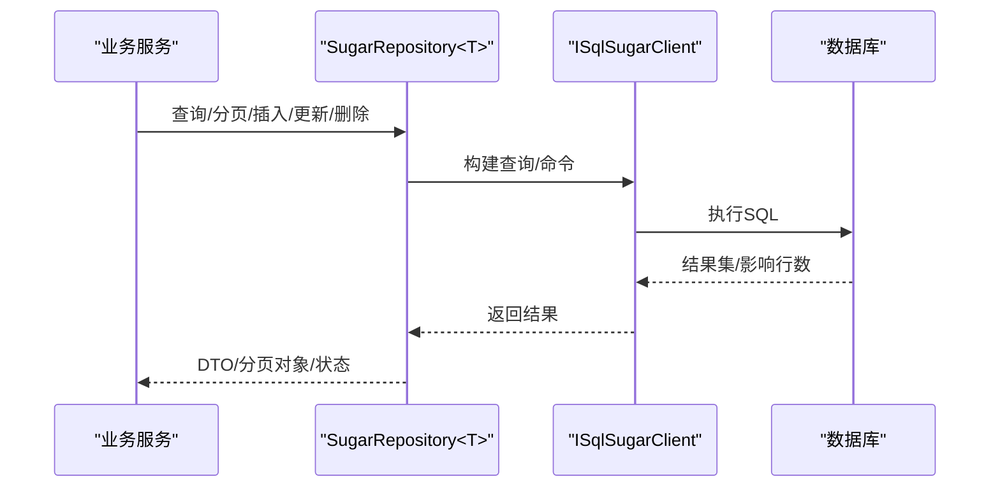
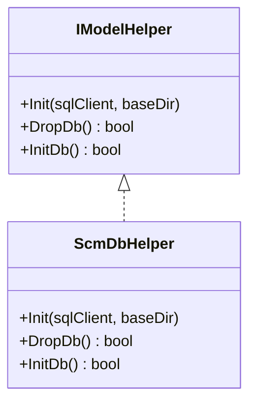
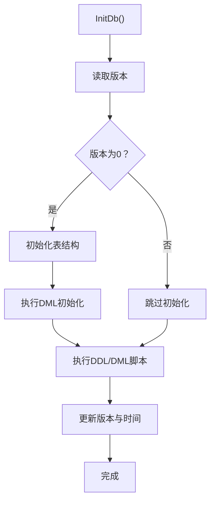
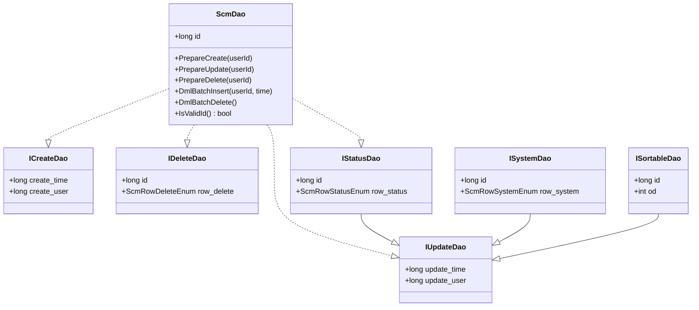
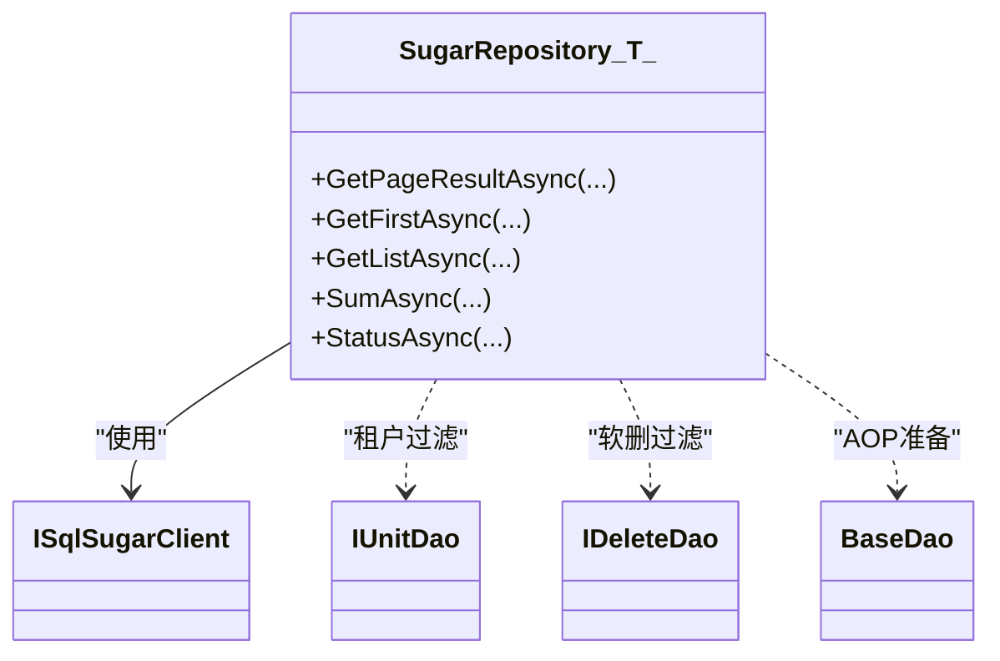
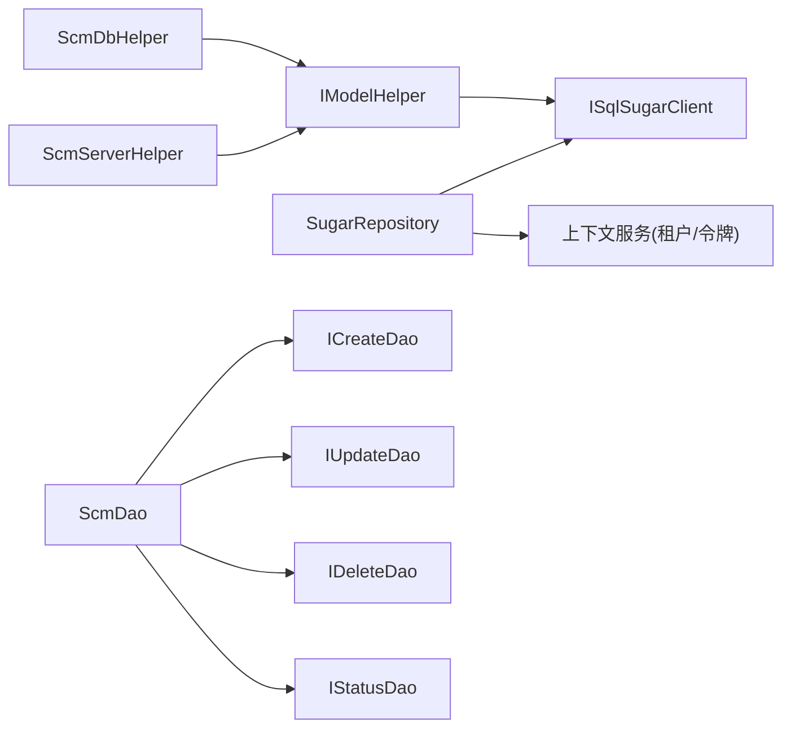

# 数据访问层

<cite>
**本文引用的文件**
- [SugarRepository.cs](file://Scm.Dsa.Dba.Sugar/SugarRepository.cs)
- [SqlSugarExts.cs](file://Scm.Dsa.Dba.Sugar/Utils/SqlSugarExts.cs)
- [ScmDbHelper.cs](file://Scm.Dao/ScmDbHelper.cs)
- [ScmModelHelper.cs](file://Scm.Server.Dao/ScmModelHelper.cs)
- [ScmServerHelper.cs](file://Scm.Server.Dao/ScmServerHelper.cs)
- [ScmDao.cs](file://Scm.Server.Dao/Dao/ScmDao.cs)
- [ICreateDao.cs](file://Scm.Server.Dao/Dao/ICreateDao.cs)
- [IUpdateDao.cs](file://Scm.Server.Dao/Dao/IUpdateDao.cs)
- [IDeleteDao.cs](file://Scm.Server.Dao/Dao/IDeleteDao.cs)
- [IStatusDao.cs](file://Scm.Server.Dao/Dao/IStatusDao.cs)
- [ISystemDao.cs](file://Scm.Server.Dao/Dao/ISystemDao.cs)
- [ISortableDao.cs](file://Scm.Server.Dao/Dao/ISortableDao.cs)
</cite>

## 更新摘要
**所做更改**
- 简化文档结构以反映 Wiki 系统重构后的现状
- 更新 IModelHelper 接口设计和 ScmServerHelper 统一注册机制
- 完善实体继承体系：ScmDao 基类及专用接口定义
- 扩展接口体系：ICreateDao/IUpdateDao/IDeleteDao/IStatusDao/ISystemDao/ISortableDao
- 增强数据库抽象层：ScmDbHelper 实现 IModelHelper 接口
- 完善仓储模式：SugarRepository<T> 的过滤器和 AOP 处理机制

## 目录
1. [简介](#简介)
2. [项目结构](#项目结构)
3. [核心组件](#核心组件)
4. [架构总览](#架构总览)
5. [组件详解](#组件详解)
6. [依赖关系分析](#依赖关系分析)
7. [性能与优化](#性能与优化)
8. [故障排查](#故障排查)
9. [结论](#结论)
10. [附录：API 接口清单](#附录api-接口清单)

## 简介
本文件面向 Scm.Net 的数据访问层（DAO 层），系统性阐述基于 SqlSugar ORM 的数据访问架构，覆盖仓储模式实现、数据库抽象层、连接与事务管理、DAO 设计原则、查询与分页、批量处理、配置与版本迁移、错误处理与最佳实践等内容。本次更新重点介绍了新增的 IModelHelper 接口设计、完整的实体继承体系、扩展的接口定义以及统一的数据库管理机制。

## 项目结构
数据访问相关的关键模块分布如下：
- 基础设施与扩展
  - 基于 SqlSugar 的通用仓储 SugarRepository
  - SqlSugar 扩展方法集 SqlSugarExts
- 抽象与基类
  - IModelHelper 接口：统一的数据库模型管理接口
  - ScmDbHelper：实现 IModelHelper 的数据库初始化、迁移与 DML 写入抽象
  - ScmServerHelper：统一注册和管理 IModelHelper 实现
  - 实体基类 ScmDao
- 接口定义体系
  - 生命周期接口：ICreateDao/IUpdateDao/IDeleteDao/IStatusDao
  - 系统属性接口：ISystemDao/ISortableDao

## 核心组件
- 通用仓储 SugarRepository<T>
  - 提供分页查询、列表查询、首条查询等常用方法
  - 注入 AOP 过滤器：自动注入租户过滤、软删除过滤、插入/更新前的数据准备
  - 记录 SQL 日志便于调试
- SqlSugar 扩展 SqlSugarExts
  - 提供分页转换、按表达式查询/插入/更新/删除等便捷方法
- 数据库抽象 IModelHelper
  - 定义统一的数据库模型管理接口：Init、DropDb、InitDb
  - 支持多模型注册和统一管理
- 实体基类与接口体系
  - ScmDao：统一主键、生命周期准备、批量 DML 钩子
  - ICreateDao/IUpdateDao/IDeleteDao/IStatusDao：标准生命周期接口
  - ISystemDao/ISortableDao：系统属性接口

## 架构总览
下图展示从服务到 DAO 的调用链路与数据流：

**图表来源**
- [SugarRepository.cs:93-189](file://Scm.Dsa.Dba.Sugar/SugarRepository.cs#L93-L189)
- [SqlSugarExts.cs:36-124](file://Scm.Dsa.Dba.Sugar/Utils/SqlSugarExts.cs#L36-L124)

## 组件详解

### IModelHelper 接口设计
- 接口职责
  - 定义统一的数据库模型管理规范
  - 提供初始化、清理和版本管理能力
- 核心方法
  - Init：初始化数据库客户端和脚本目录
  - DropDb：清理数据库结构
  - InitDb：初始化数据库结构和基础数据

**图表来源**
- [ScmModelHelper.cs:5-12](file://Scm.Server.Dao/ScmModelHelper.cs#L5-L12)
- [ScmDbHelper.cs:30-83](file://Scm.Dao/ScmDbHelper.cs#L30-L83)

**章节来源**
- [ScmModelHelper.cs:5-12](file://Scm.Server.Dao/ScmModelHelper.cs#L5-L12)

### ScmServerHelper 统一注册机制
- 注册管理
  - 维护 IModelHelper 实现列表
  - 提供统一的初始化和清理方法
- 核心功能
  - Register：注册新的模型实现
  - DropDb：依次执行所有模型的清理
  - InitDb：依次执行所有模型的初始化

**章节来源**
- [ScmServerHelper.cs:5-52](file://Scm.Server.Dao/ScmServerHelper.cs#L5-L52)

### ScmDbHelper 数据库抽象层
- 职责
  - 实现 IModelHelper 接口的完整数据库管理
  - 表结构初始化（CodeFirst）、DDL/DML 脚本执行
  - 版本控制：记录数据库版本与更新时间
  - 统一写入：PrepareCreate/PrepareUpdate 流程
  - 清空/截断：支持按程序集扫描并清理或截断表
- 初始化流程
  - 读取版本 -> 初始化表 -> 执行 DDL/DML -> 更新版本
- DML 示例
  - 创建 UID、语言、计量单位、应用、菜单、角色与用户等基础数据

**图表来源**
- [ScmDbHelper.cs:51-83](file://Scm.Dao/ScmDbHelper.cs#L51-L83)
- [ScmDbHelper.cs:375-427](file://Scm.Dao/ScmDbHelper.cs#L375-L427)

**章节来源**
- [ScmDbHelper.cs:16-779](file://Scm.Dao/ScmDbHelper.cs#L16-L779)

### 实体基类与接口体系

#### ScmDao 基类
- 核心功能
  - 主键 id（自增唯一标识）
  - 生命周期准备：PrepareCreate/PrepareUpdate/PrepareDelete
  - 批量 DML 钩子：DmlBatchDelete/DmlBatchInsert
  - 基本比较和哈希方法
- 验证机制
  - IsValidId：验证 ID 是否有效（> 1000）

#### 接口定义体系
- 生命周期接口
  - ICreateDao：create_time/create_user
  - IUpdateDao：update_time/update_user
  - IDeleteDao：继承 IUpdateDao，添加 row_delete
  - IStatusDao：继承 IUpdateDao，添加 row_status
- 系统属性接口
  - ISystemDao：继承 IUpdateDao，添加 row_system
  - ISortableDao：继承 IUpdateDao，添加排序字段 od

**图表来源**
- [ScmDao.cs:6-68](file://Scm.Server.Dao/Dao/ScmDao.cs#L6-L68)
- [ICreateDao.cs:3-8](file://Scm.Server.Dao/Dao/ICreateDao.cs#L3-L8)
- [IUpdateDao.cs:3-7](file://Scm.Server.Dao/Dao/IUpdateDao.cs#L3-L7)
- [IDeleteDao.cs:6-13](file://Scm.Server.Dao/Dao/IDeleteDao.cs#L6-L13)
- [IStatusDao.cs:6-13](file://Scm.Server.Dao/Dao/IStatusDao.cs#L6-L13)
- [ISystemDao.cs:6-13](file://Scm.Server.Dao/Dao/ISystemDao.cs#L6-L13)
- [ISortableDao.cs:3-10](file://Scm.Server.Dao/Dao/ISortableDao.cs#L3-L10)

**章节来源**
- [ScmDao.cs:6-68](file://Scm.Server.Dao/Dao/ScmDao.cs#L6-L68)
- [ICreateDao.cs:3-8](file://Scm.Server.Dao/Dao/ICreateDao.cs#L3-L8)
- [IUpdateDao.cs:3-7](file://Scm.Server.Dao/Dao/IUpdateDao.cs#L3-L7)
- [IDeleteDao.cs:6-13](file://Scm.Server.Dao/Dao/IDeleteDao.cs#L6-L13)
- [IStatusDao.cs:6-13](file://Scm.Server.Dao/Dao/IStatusDao.cs#L6-L13)
- [ISystemDao.cs:6-13](file://Scm.Server.Dao/Dao/ISystemDao.cs#L6-L13)
- [ISortableDao.cs:3-10](file://Scm.Server.Dao/Dao/ISortableDao.cs#L3-L10)

### 通用仓储 SugarRepository<T>
- 角色定位
  - 作为所有实体的统一数据访问入口，封装常用 CRUD 与查询能力
- 核心特性
  - 租户过滤：通过上下文令牌动态注入 unit_id 过滤
  - 软删除过滤：自动过滤 row_delete=false 的记录
  - AOP 生命周期：在插入/更新前自动填充创建/更新时间与用户
  - SQL 日志：格式化输出 SQL 语句，便于审计与排错
- 查询与分页
  - 支持表达式条件、字符串条件、排序枚举、分页返回总条目与总页数
- 聚合与状态
  - 提供求和、状态切换等聚合操作

**图表来源**
- [SugarRepository.cs:13-82](file://Scm.Dsa.Dba.Sugar/SugarRepository.cs#L13-L82)
- [SugarRepository.cs:93-189](file://Scm.Dsa.Dba.Sugar/SugarRepository.cs#L93-L189)

**章节来源**
- [SugarRepository.cs:13-189](file://Scm.Dsa.Dba.Sugar/SugarRepository.cs#L13-L189)

### SqlSugar 扩展 SqlSugarExts
- 提供对 ISugarQueryable 与 ISqlSugarClient 的扩展
- 功能点
  - 分页转换：返回统一的分页响应对象
  - 查询：按表达式获取首条/列表、按主键获取
  - 插入/更新/删除：支持单对象与批量对象

**图表来源**
- [SqlSugarExts.cs:7-126](file://Scm.Dsa.Dba.Sugar/Utils/SqlSugarExts.cs#L7-L126)

**章节来源**
- [SqlSugarExts.cs:7-126](file://Scm.Dsa.Dba.Sugar/Utils/SqlSugarExts.cs#L7-L126)

## 依赖关系分析
- 组件耦合
  - SugarRepository 依赖 ISqlSugarClient 与上下文服务（租户/令牌）
  - IModelHelper 实现依赖 ISqlSugarClient 与文件系统脚本
  - ScmServerHelper 统一管理多个 IModelHelper 实现
  - 实体基类与接口被所有 DAO 继承或实现
- 外部依赖
  - SqlSugar ORM
  - 日志与通用工具（如时间、加密、映射等）

**图表来源**
- [SugarRepository.cs:18-82](file://Scm.Dsa.Dba.Sugar/SugarRepository.cs#L18-L82)
- [ScmModelHelper.cs:5-12](file://Scm.Server.Dao/ScmModelHelper.cs#L5-L12)
- [ScmServerHelper.cs:5-52](file://Scm.Server.Dao/ScmServerHelper.cs#L5-L52)
- [ScmDbHelper.cs:30-83](file://Scm.Dao/ScmDbHelper.cs#L30-L83)
- [ScmDao.cs:6-28](file://Scm.Server.Dao/Dao/ScmDao.cs#L6-L28)

**章节来源**
- [SugarRepository.cs:18-82](file://Scm.Dsa.Dba.Sugar/SugarRepository.cs#L18-L82)
- [ScmModelHelper.cs:5-12](file://Scm.Server.Dao/ScmModelHelper.cs#L5-L12)
- [ScmServerHelper.cs:5-52](file://Scm.Server.Dao/ScmServerHelper.cs#L5-L52)
- [ScmDbHelper.cs:30-83](file://Scm.Dao/ScmDbHelper.cs#L30-L83)
- [ScmDao.cs:6-28](file://Scm.Server.Dao/Dao/ScmDao.cs#L6-L28)

## 性能与优化
- 查询与分页
  - 使用表达式条件与排序，避免全表扫描；合理使用索引覆盖
  - 分页时先查总数再分页，注意大数据量场景下的排序成本
- 批量操作
  - 批量插入/更新/删除优先使用扩展方法提供的批量版本，减少往返
- AOP 与过滤
  - 租户与软删除过滤在查询阶段生效，避免业务层重复判断
- 日志与诊断
  - SQL 日志用于定位慢查询与异常，建议在开发/测试环境开启，生产谨慎开启
- 数据库版本管理
  - 通过 IModelHelper 接口统一管理数据库版本，支持增量更新和回滚

## 故障排查
- SQL 日志定位
  - 通过仓储 AOP OnLogExecuting 输出格式化 SQL，核对参数绑定
- 版本与脚本
  - 若初始化失败，检查版本记录与脚本注释中的版本标记是否匹配
- 连接与事务
  - 使用事务包裹 DDL/DML 或批量写入，确保一致性
- 租户与软删
  - 若查询不到数据，确认租户令牌与 row_delete 过滤是否符合预期
- 接口实现验证
  - 确保实体正确实现相应的接口，避免运行时异常

**章节来源**
- [SugarRepository.cs:71-81](file://Scm.Dsa.Dba.Sugar/SugarRepository.cs#L71-L81)
- [ScmDbHelper.cs:213-262](file://Scm.Dao/ScmDbHelper.cs#L213-L262)

## 结论
Scm.Net 的数据访问层以 SqlSugar 为核心，结合统一的 IModelHelper 接口设计、完整的实体继承体系、扩展的接口定义以及统一的数据库管理机制，形成了高内聚、低耦合且易于扩展的数据访问体系。通过 AOP、过滤器与统一写入流程，既保证了业务一致性，也提升了开发效率。新增的模型管理机制支持多数据库模型的统一注册和管理，为复杂项目的数据库架构提供了良好的扩展性。建议在实际项目中遵循本文的最佳实践，持续优化查询与批处理性能，并完善监控与日志体系。

## 附录：API 接口清单
以下为数据访问层常用接口与方法（按功能分组），便于快速检索与集成。

### IModelHelper 接口
- 模型管理
  - Init：初始化数据库客户端和脚本目录
  - DropDb：清理数据库结构
  - InitDb：初始化数据库结构和基础数据

### 通用仓储（SugarRepository<T>）
- 分页查询
  - GetPageResultAsync(where, page, limit, order, orderEnum)
  - GetPageResultAsync(where, strWhere, page, limit, order, orderEnum)
- 列表与首条
  - GetListAsync(where, order, orderEnum)
  - GetListAsync(where, order)
  - GetFirstAsync(where, order, orderEnum)
- 聚合与状态
  - SumAsync(where, expression)
  - StatusAsync(id)
- 生命周期与日志
  - AOP DataExecuting（插入/更新前准备）
  - AOP OnLogExecuting（SQL 日志）

### SqlSugar 扩展（SqlSugarExts）
- 分页
  - ToPageAsync(query, pageIndex, pageSize, isMapper)
  - ToPageAsyncV2(query, pageIndex, pageSize, isMapper)
- 查询
  - GetListAsync(client, whereExpression)
  - GetFirstAsync(client, whereExpression)
  - GetByIdAsync(client, id)
- 插入/更新/删除
  - InsertAsync/Insert(client, obj/list)
  - UpdateAsync/Update(client, where/updateObj)
  - DeleteAsync/Delete(client, where)

### 数据库抽象（ScmDbHelper）
- 初始化与迁移
  - InitDb()/DropDb()
  - ExecuteSql(file, ver)
- 写入与准备
  - SaveDao/SaveDataDao/TruncateDao
  - PrepareCreate/PrepareUpdate（由实体基类提供）

### 实体基类与接口
- ScmDao：PrepareCreate/PrepareUpdate/PrepareDelete、批量钩子
- ICreateDao/IUpdateDao/IDeleteDao/IStatusDao：标准生命周期字段
- ISystemDao/ISortableDao：系统属性字段

**章节来源**
- [ScmModelHelper.cs:5-12](file://Scm.Server.Dao/ScmModelHelper.cs#L5-L12)
- [SugarRepository.cs:93-189](file://Scm.Dsa.Dba.Sugar/SugarRepository.cs#L93-L189)
- [SqlSugarExts.cs:9-126](file://Scm.Dsa.Dba.Sugar/Utils/SqlSugarExts.cs#L9-L126)
- [ScmDbHelper.cs:51-187](file://Scm.Dao/ScmDbHelper.cs#L51-L187)
- [ScmDao.cs:14-68](file://Scm.Server.Dao/Dao/ScmDao.cs#L14-L68)
- [ICreateDao.cs:5-8](file://Scm.Server.Dao/Dao/ICreateDao.cs#L5-L8)
- [IUpdateDao.cs:5-7](file://Scm.Server.Dao/Dao/IUpdateDao.cs#L5-L7)
- [IDeleteDao.cs:10-13](file://Scm.Server.Dao/Dao/IDeleteDao.cs#L10-L13)
- [IStatusDao.cs:10-12](file://Scm.Server.Dao/Dao/IStatusDao.cs#L10-L12)
- [ISystemDao.cs:10-12](file://Scm.Server.Dao/Dao/ISystemDao.cs#L10-L12)
- [ISortableDao.cs:7-10](file://Scm.Server.Dao/Dao/ISortableDao.cs#L7-L10)