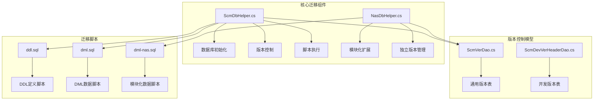
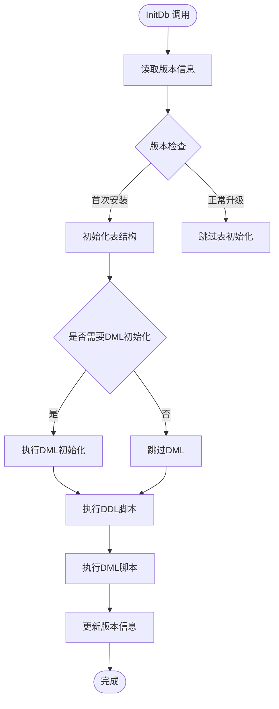
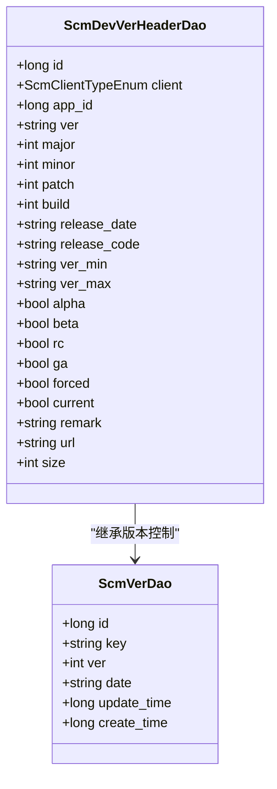
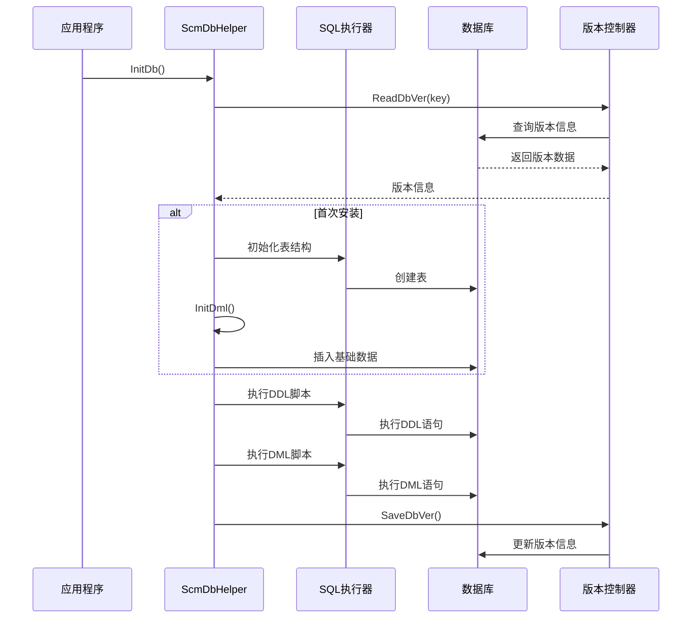
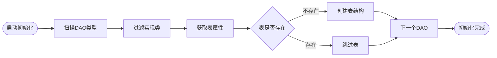
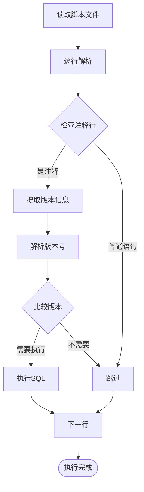
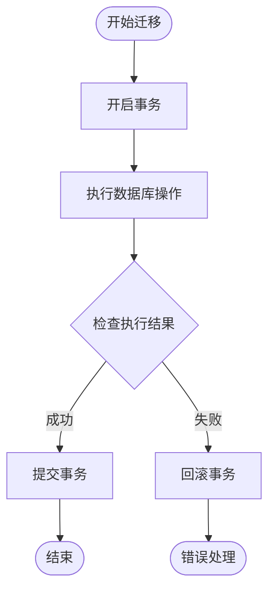
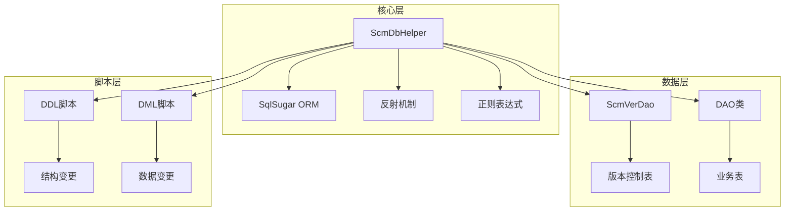

# 数据迁移管理

<cite>
**本文引用的文件**
- [ScmDbHelper.cs](file://Scm.Dao/ScmDbHelper.cs)
- [NasDbHelper.cs](file://Nas.Dao/NasDbHelper.cs)
- [ScmVerDao.cs](file://Scm.Server.Dao/ScmVerDao.cs)
- [ScmDevVerHeaderDao.cs](file://Scm.Dao/Dev/ScmDevVerHeaderDao.cs)
- [ddl.sql](file://Scm.Net/data/sql/ddl.sql)
- [dml.sql](file://Scm.Net/data/sql/dml.sql)
- [dml-nas.sql](file://Scm.Net/data/sql/dml-nas.sql)
- [dml.sql](file://Scm.Net/dev/sql/dml.sql)
</cite>

## 目录
1. [引言](#引言)
2. [项目结构](#项目结构)
3. [核心组件](#核心组件)
4. [架构概览](#架构概览)
5. [详细组件分析](#详细组件分析)
6. [依赖关系分析](#依赖关系分析)
7. [性能考虑](#性能考虑)
8. [故障排除指南](#故障排除指南)
9. [结论](#结论)

## 引言

Scm.Net 的数据迁移管理系统是一个基于 SqlSugar ORM 的完整数据库版本管理解决方案。该系统提供了从零开始的数据库初始化、版本控制、增量迁移和跨版本升级的完整能力。

系统采用"版本注释 + 条件执行 + 回滚保护"的设计理念，确保数据库变更的安全性和可追溯性。通过统一的迁移脚本管理和版本控制机制，实现了生产环境的稳定部署和开发环境的灵活迭代。

## 项目结构

Scm.Net 数据迁移管理系统的文件组织遵循清晰的分层架构：

**图表来源**
- [ScmDbHelper.cs:1-779](file://Scm.Dao/ScmDbHelper.cs#L1-L779)
- [NasDbHelper.cs:1-166](file://Nas.Dao/NasDbHelper.cs#L1-L166)
- [ScmVerDao.cs:1-42](file://Scm.Server.Dao/ScmVerDao.cs#L1-L42)

**章节来源**
- [ScmDbHelper.cs:1-779](file://Scm.Dao/ScmDbHelper.cs#L1-L779)
- [NasDbHelper.cs:1-166](file://Nas.Dao/NasDbHelper.cs#L1-L166)

## 核心组件

### ScmDbHelper - 核心迁移引擎

ScmDbHelper 是整个数据迁移系统的核心组件，提供了完整的数据库初始化和版本管理功能：

#### 主要特性
- **自动表结构初始化**：通过反射扫描所有 DAO 类，自动创建对应的数据库表
- **版本控制管理**：维护每个模块的版本信息和更新历史
- **条件脚本执行**：根据版本号智能执行增量迁移脚本
- **事务安全保障**：所有迁移操作都在事务中执行，确保数据一致性

#### 关键方法分析

**图表来源**
- [ScmDbHelper.cs:51-83](file://Scm.Dao/ScmDbHelper.cs#L51-L83)

**章节来源**
- [ScmDbHelper.cs:16-83](file://Scm.Dao/ScmDbHelper.cs#L16-L83)

### NasDbHelper - 模块化扩展

NasDbHelper 继承自 ScmDbHelper，为 NAS 模块提供专门的数据库初始化功能：

#### 特殊设计
- **独立版本管理**：NAS 模块拥有独立的版本号和发布日期
- **模块化脚本**：使用特定的 DDL 和 DML 脚本文件
- **菜单权限初始化**：为 NAS 功能模块预置菜单和权限配置

**章节来源**
- [NasDbHelper.cs:9-57](file://Nas.Dao/NasDbHelper.cs#L9-L57)

### 版本控制模型

系统采用双层版本控制机制：

**图表来源**
- [ScmVerDao.cs:7-41](file://Scm.Server.Dao/ScmVerDao.cs#L7-L41)
- [ScmDevVerHeaderDao.cs:11-131](file://Scm.Dao/Dev/ScmDevVerHeaderDao.cs#L11-L131)

**章节来源**
- [ScmVerDao.cs:1-42](file://Scm.Server.Dao/ScmVerDao.cs#L1-L42)
- [ScmDevVerHeaderDao.cs:1-132](file://Scm.Dao/Dev/ScmDevVerHeaderDao.cs#L1-L132)

## 架构概览

Scm.Net 的数据迁移架构采用了"脚本驱动 + 版本控制 + 自动化执行"的设计模式：

**图表来源**
- [ScmDbHelper.cs:51-83](file://Scm.Dao/ScmDbHelper.cs#L51-L83)
- [ScmDbHelper.cs:213-262](file://Scm.Dao/ScmDbHelper.cs#L213-L262)

## 详细组件分析

### 数据库初始化流程

#### 表结构初始化
ScmDbHelper 通过反射机制自动发现和初始化所有 DAO 类对应的数据表：

**图表来源**
- [ScmDbHelper.cs:324-338](file://Scm.Dao/ScmDbHelper.cs#L324-L338)

#### 基础数据初始化
系统在首次安装时会自动插入必要的基础数据：

**章节来源**
- [ScmDbHelper.cs:375-663](file://Scm.Dao/ScmDbHelper.cs#L375-L663)

### 迁移脚本执行机制

#### 版本注释解析
系统通过正则表达式解析脚本中的版本注释信息：

**图表来源**
- [ScmDbHelper.cs:213-262](file://Scm.Dao/ScmDbHelper.cs#L213-L262)
- [ScmDbHelper.cs:269-287](file://Scm.Dao/ScmDbHelper.cs#L269-L287)

#### 条件执行逻辑
脚本中的每个版本注释都包含版本号信息，系统只执行当前版本号之后的脚本：

**章节来源**
- [ScmDbHelper.cs:224-261](file://Scm.Dao/ScmDbHelper.cs#L224-L261)

### 错误处理与回滚机制

#### 事务安全保障
所有迁移操作都在事务中执行，确保要么全部成功，要么全部回滚：

**图表来源**
- [ScmDbHelper.cs:224-261](file://Scm.Dao/ScmDbHelper.cs#L224-L261)

**章节来源**
- [ScmDbHelper.cs:224-261](file://Scm.Dao/ScmDbHelper.cs#L224-L261)

## 依赖关系分析

### 组件耦合度分析

**图表来源**
- [ScmDbHelper.cs:1-12](file://Scm.Dao/ScmDbHelper.cs#L1-L12)
- [ScmVerDao.cs:7-8](file://Scm.Server.Dao/ScmVerDao.cs#L7-L8)

### 外部依赖

系统主要依赖以下外部组件：
- **SqlSugar ORM**：提供数据库抽象和 ORM 功能
- **反射机制**：自动发现和加载 DAO 类
- **正则表达式**：解析脚本版本注释

**章节来源**
- [ScmDbHelper.cs:1-12](file://Scm.Dao/ScmDbHelper.cs#L1-L12)

## 性能考虑

### 初始化性能优化

#### 批量操作
- 使用批量插入和更新减少数据库往返次数
- 合理使用事务批量执行多个操作

#### 反射性能
- 缓存反射结果避免重复扫描
- 限制扫描范围只处理特定命名约定的类

### 迁移执行优化

#### 脚本执行效率
- 按需执行：只执行高于当前版本的脚本
- 并行安全：确保脚本执行的原子性

## 故障排除指南

### 常见问题诊断

#### 版本冲突问题
当数据库版本与代码版本不匹配时，系统会自动检测并执行相应的迁移脚本。

#### 脚本执行失败
如果某个迁移脚本执行失败，系统会回滚整个事务并停止后续执行。

#### 表结构不一致
系统会自动检测表结构差异并尝试修复。

### 调试建议

1. **启用详细日志**：检查迁移过程中的每一步操作
2. **验证脚本语法**：确保 SQL 语法正确无误
3. **测试环境验证**：在生产环境部署前先在测试环境验证

**章节来源**
- [ScmDbHelper.cs:90-118](file://Scm.Dao/ScmDbHelper.cs#L90-L118)

## 结论

Scm.Net 的数据迁移管理系统提供了一个完整、可靠、易于使用的数据库版本管理解决方案。通过自动化脚本执行、严格的版本控制和完善的错误处理机制，确保了数据库变更的安全性和可追溯性。

系统的主要优势包括：
- **自动化程度高**：减少手动干预，降低出错概率
- **版本控制完善**：支持增量迁移和跨版本升级
- **安全性保障**：事务保护和回滚机制
- **扩展性强**：支持模块化扩展和自定义迁移逻辑

该系统为 Scm.Net 生态系统提供了坚实的数据基础设施，支持从单模块到多模块的复杂应用场景。