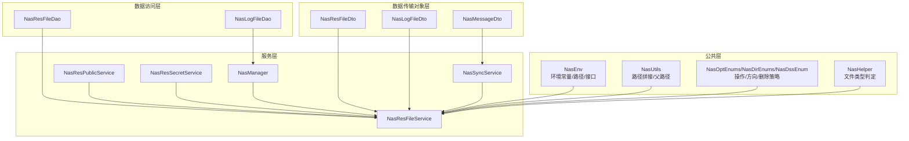
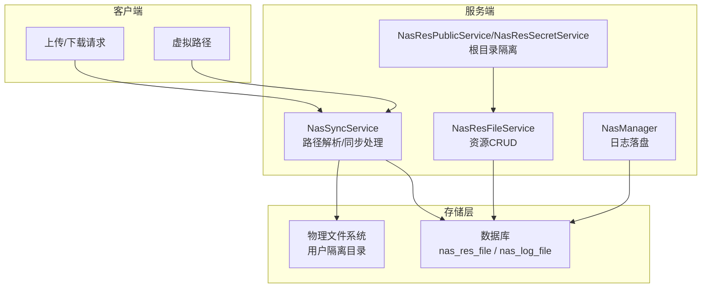
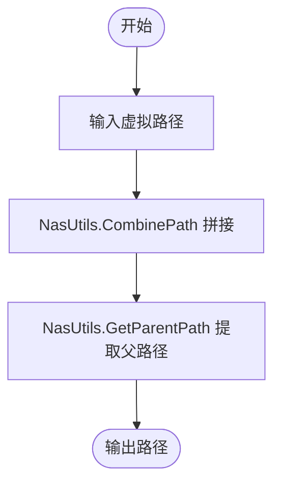
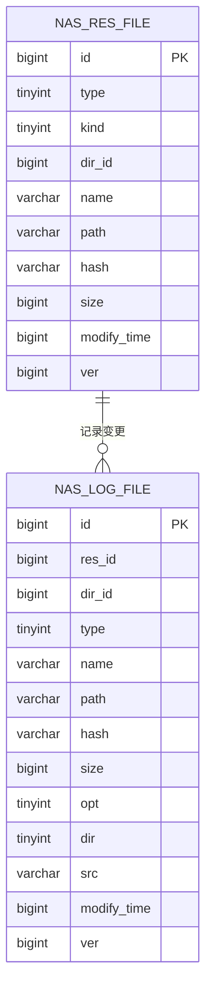
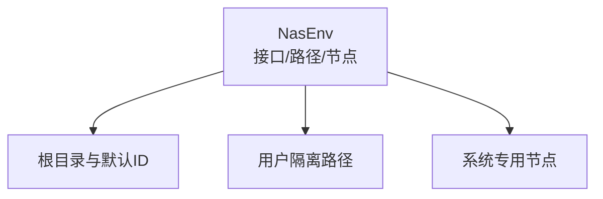
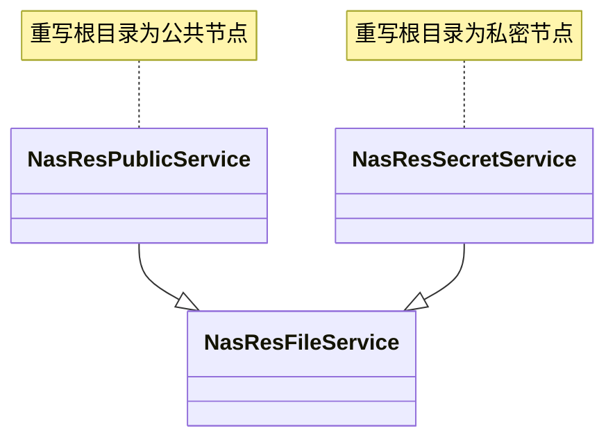
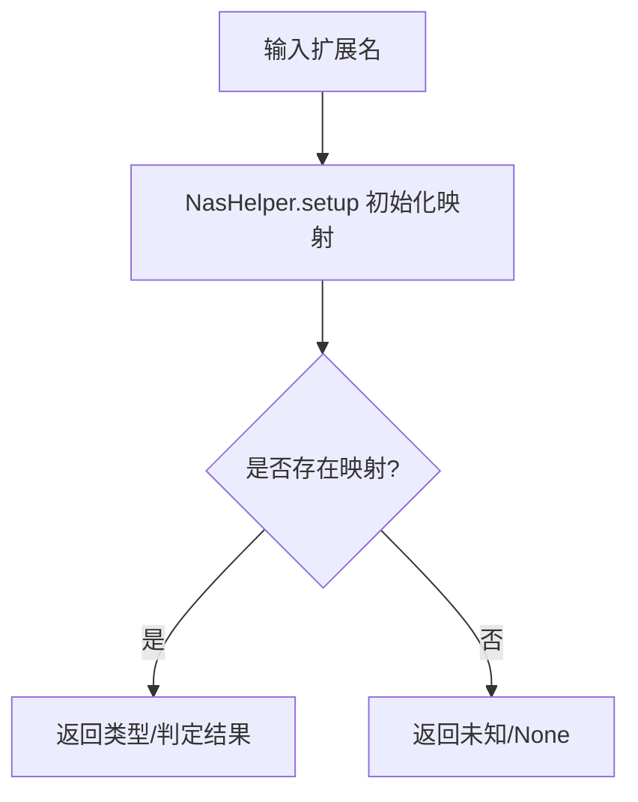
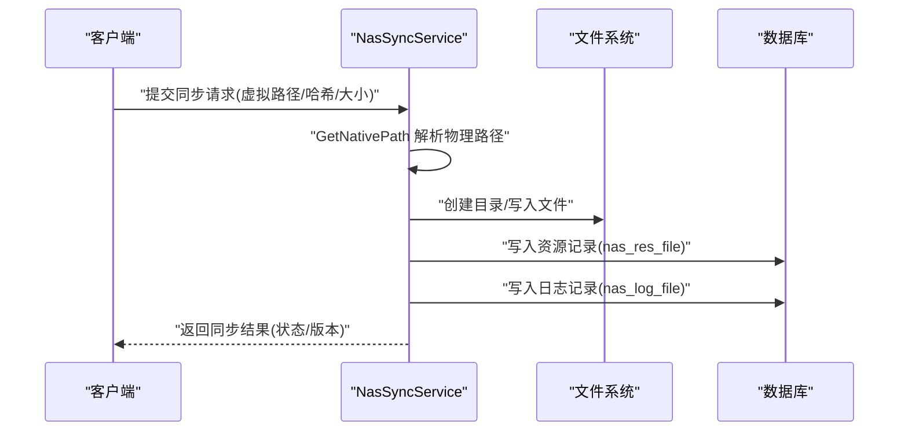
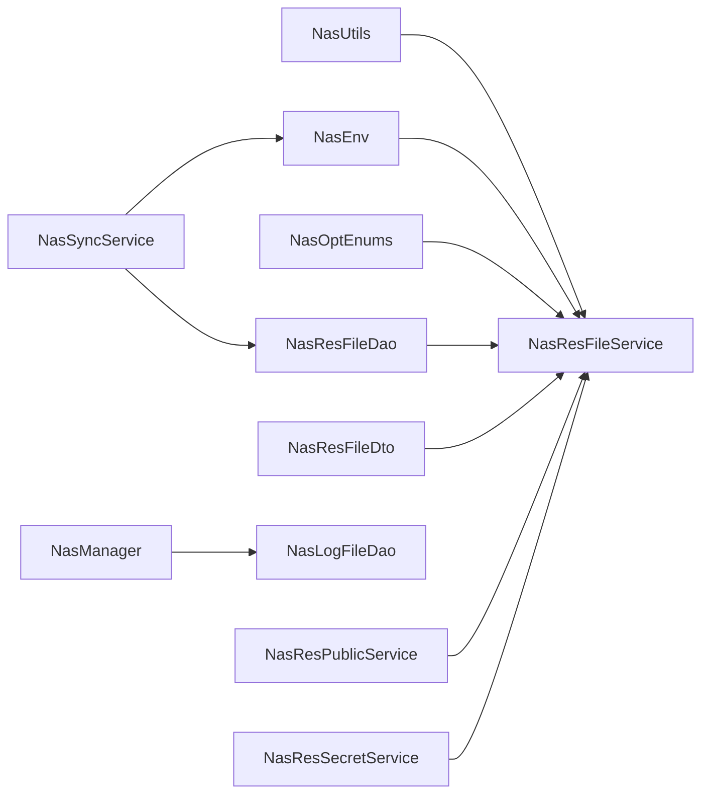

# NAS 协议架构

<cite>
**本文引用的文件**
- [NasEnv.cs](file://Nas.Common/NasEnv.cs)
- [NasUtils.cs](file://Nas.Common/NasUtils.cs)
- [NasOptEnums.cs](file://Nas.Common/NasOptEnums.cs)
- [NasDirEnums.cs](file://Nas.Common/NasDirEnums.cs)
- [NasDssEnum.cs](file://Nas.Common/NasDssEnum.cs)
- [NasResFileDao.cs](file://Nas.Dao/Res/NasResFileDao.cs)
- [NasResFileDto.cs](file://Nas.Dto/Res/NasResFileDto.cs)
- [NasLogFileDao.cs](file://Nas.Dao/Log/NasLogFileDao.cs)
- [NasLogFileDto.cs](file://Nas.Dto/Log/NasLogFileDto.cs)
- [NasResFileService.cs](file://Nas.Server/Res/NasResFileService.cs)
- [NasManager.cs](file://Nas.Server/Res/NasManager.cs)
- [NasResSecretService.cs](file://Nas.Server/Res/NasResSecretService.cs)
- [NasResPublicService.cs](file://Nas.Server/Res/NasResPublicService.cs)
- [NasSyncService.cs](file://Nas.Server/Sync/NasSyncService.cs)
- [NasMessageDto.cs](file://Nas.Dto/Msg/NasMessageDto.cs)
- [NasHelper.cs](file://Nas.Server/NasHelper.cs)
</cite>

## 目录
1. [引言](#引言)
2. [项目结构](#项目结构)
3. [核心组件](#核心组件)
4. [架构总览](#架构总览)
5. [详细组件分析](#详细组件分析)
6. [依赖关系分析](#依赖关系分析)
7. [性能考量](#性能考量)
8. [故障排查指南](#故障排查指南)
9. [结论](#结论)
10. [附录：协议规范与数据结构](#附录协议规范与数据结构)

## 引言
本技术文档围绕 NAS（网络附加存储）协议架构展开，系统阐述基于“64位哈希值.nas”命名规则的文件管理系统原理，覆盖文件命名、路径生成、内容校验、环境配置、存储根目录结构、用户文件隔离、哈希计算、MIME 类型检测与元数据管理，并总结 NAS 协议在去重存储、完整性校验与分布式存储支持方面的优势。文档同时给出协议规范、关键数据结构定义与实现要点，帮助开发者快速理解并扩展该体系。

## 项目结构
NAS 相关代码按“公共层（Common）—数据传输对象（Dto）—数据访问（Dao）—服务层（Server）”分层组织，形成清晰的职责边界：
- 公共层：环境常量、工具类、枚举等通用能力
- 数据传输对象层：面向 API 的 DTO 定义
- 数据访问层：数据库实体与字段约束
- 服务层：业务服务、同步服务、管理器与辅助工具

图表来源
- [NasEnv.cs:1-222](file://Nas.Common/NasEnv.cs#L1-L222)
- [NasUtils.cs:1-48](file://Nas.Common/NasUtils.cs#L1-L48)
- [NasOptEnums.cs:1-80](file://Nas.Common/NasOptEnums.cs#L1-L80)
- [NasDirEnums.cs:1-23](file://Nas.Common/NasDirEnums.cs#L1-L23)
- [NasDssEnum.cs:1-22](file://Nas.Common/NasDssEnum.cs#L1-L22)
- [NasResFileDto.cs:1-61](file://Nas.Dto/Res/NasResFileDto.cs#L1-L61)
- [NasLogFileDto.cs:1-92](file://Nas.Dto/Log/NasLogFileDto.cs#L1-L92)
- [NasResFileDao.cs:1-105](file://Nas.Dao/Res/NasResFileDao.cs#L1-L105)
- [NasLogFileDao.cs:1-104](file://Nas.Dao/Log/NasLogFileDao.cs#L1-L104)
- [NasResFileService.cs:1-259](file://Nas.Server/Res/NasResFileService.cs#L1-L259)
- [NasManager.cs:1-136](file://Nas.Server/Res/NasManager.cs#L1-L136)
- [NasResPublicService.cs:1-24](file://Nas.Server/Res/NasResPublicService.cs#L1-L24)
- [NasResSecretService.cs:1-25](file://Nas.Server/Res/NasResSecretService.cs#L1-L25)
- [NasSyncService.cs:584-1737](file://Nas.Server/Sync/NasSyncService.cs#L584-L1737)
- [NasMessageDto.cs:57-169](file://Nas.Dto/Msg/NasMessageDto.cs#L57-L169)
- [NasHelper.cs:1-107](file://Nas.Server/NasHelper.cs#L1-L107)

章节来源
- [NasEnv.cs:1-222](file://Nas.Common/NasEnv.cs#L1-L222)
- [NasResFileService.cs:1-259](file://Nas.Server/Res/NasResFileService.cs#L1-L259)

## 核心组件
- 环境与常量（NasEnv）：统一管理服务端接口、虚拟路径前缀、根目录、默认目录ID、块大小、系统专用节点与路径等
- 路径工具（NasUtils）：提供虚拟路径拼接与父路径解析
- 枚举体系（NasOptEnums/NasDirEnums/NasDssEnum）：定义操作类型、同步方向与删除策略
- 文件资源模型（NasResFileDao/NasResFileDto）：描述文件/目录的元数据（类型、子类、目录ID、名称、路径、哈希、大小、修改时间、版本、软删标记）
- 日志模型（NasLogFileDao/NasLogFileDto）：记录操作日志（路径、哈希、大小、操作、方向、来源、修改时间、版本）
- 服务层（NasResFileService/NasManager/NasResPublicService/NasResSecretService）：提供文件 CRUD、路径生成、日志落盘、根目录隔离
- 同步服务（NasSyncService）：负责物理路径映射、目录/文件创建、哈希与类型推断、日志与消息处理
- 类型判定（NasHelper）：基于扩展名进行文件类型分类与判定
- 消息模型（NasMessageDto）：用于同步状态与文件夹变更的消息定义

章节来源
- [NasEnv.cs:1-222](file://Nas.Common/NasEnv.cs#L1-L222)
- [NasUtils.cs:1-48](file://Nas.Common/NasUtils.cs#L1-L48)
- [NasOptEnums.cs:1-80](file://Nas.Common/NasOptEnums.cs#L1-L80)
- [NasDirEnums.cs:1-23](file://Nas.Common/NasDirEnums.cs#L1-L23)
- [NasDssEnum.cs:1-22](file://Nas.Common/NasDssEnum.cs#L1-L22)
- [NasResFileDao.cs:1-105](file://Nas.Dao/Res/NasResFileDao.cs#L1-L105)
- [NasResFileDto.cs:1-61](file://Nas.Dto/Res/NasResFileDto.cs#L1-L61)
- [NasLogFileDao.cs:1-104](file://Nas.Dao/Log/NasLogFileDao.cs#L1-L104)
- [NasLogFileDto.cs:1-92](file://Nas.Dto/Log/NasLogFileDto.cs#L1-L92)
- [NasResFileService.cs:1-259](file://Nas.Server/Res/NasResFileService.cs#L1-L259)
- [NasManager.cs:1-136](file://Nas.Server/Res/NasManager.cs#L1-L136)
- [NasResPublicService.cs:1-24](file://Nas.Server/Res/NasResPublicService.cs#L1-L24)
- [NasResSecretService.cs:1-25](file://Nas.Server/Res/NasResSecretService.cs#L1-L25)
- [NasSyncService.cs:584-1737](file://Nas.Server/Sync/NasSyncService.cs#L584-L1737)
- [NasMessageDto.cs:57-169](file://Nas.Dto/Msg/NasMessageDto.cs#L57-L169)
- [NasHelper.cs:1-107](file://Nas.Server/NasHelper.cs#L1-L107)

## 架构总览
NAS 协议以“虚拟路径 + 物理存储”的双轨结构运行：
- 虚拟路径：以特定前缀标识，便于跨平台与分布式统一管理
- 物理存储：按用户隔离，采用“用户编码 + 虚拟路径”映射到真实文件系统
- 元数据与日志：通过 DAO/DTO 统一建模，确保一致性与可审计性
- 同步流程：服务端根据虚拟路径解析物理路径，执行创建/更新/删除等操作，并写入日志与触发消息

图表来源
- [NasSyncService.cs:1482-1506](file://Nas.Server/Sync/NasSyncService.cs#L1482-L1506)
- [NasResFileService.cs:1-259](file://Nas.Server/Res/NasResFileService.cs#L1-L259)
- [NasManager.cs:1-136](file://Nas.Server/Res/NasManager.cs#L1-L136)
- [NasResPublicService.cs:1-24](file://Nas.Server/Res/NasResPublicService.cs#L1-L24)
- [NasResSecretService.cs:1-25](file://Nas.Server/Res/NasResSecretService.cs#L1-L25)
- [NasResFileDao.cs:1-105](file://Nas.Dao/Res/NasResFileDao.cs#L1-L105)
- [NasLogFileDao.cs:1-104](file://Nas.Dao/Log/NasLogFileDao.cs#L1-L104)

## 详细组件分析

### 文件命名与路径生成机制
- 命名规则：文件以“64位哈希值.nas”命名，结合目录结构与扩展名，确保唯一性与可检索性
- 虚拟路径：使用统一前缀标识，便于跨端一致处理
- 路径拼接：通过工具类组合多段路径，自动处理分隔符
- 父路径解析：支持从完整路径提取父级目录，便于层级管理

图表来源
- [NasUtils.cs:10-45](file://Nas.Common/NasUtils.cs#L10-L45)

章节来源
- [NasEnv.cs:18-33](file://Nas.Common/NasEnv.cs#L18-L33)
- [NasUtils.cs:1-48](file://Nas.Common/NasUtils.cs#L1-L48)

### 内容校验与哈希管理
- 哈希字段：资源与日志均包含哈希字段，长度限制为64字符
- 类型推断：依据扩展名推断文件类型，辅助内容校验与展示
- 版本控制：资源记录维护版本号，变更时递增，配合日志追踪

图表来源
- [NasResFileDao.cs:12-103](file://Nas.Dao/Res/NasResFileDao.cs#L12-L103)
- [NasLogFileDao.cs:12-103](file://Nas.Dao/Log/NasLogFileDao.cs#L12-L103)

章节来源
- [NasResFileDao.cs:1-105](file://Nas.Dao/Res/NasResFileDao.cs#L1-L105)
- [NasLogFileDao.cs:1-104](file://Nas.Dao/Log/NasLogFileDao.cs#L1-L104)
- [NasResFileDto.cs:1-61](file://Nas.Dto/Res/NasResFileDto.cs#L1-L61)
- [NasLogFileDto.cs:1-92](file://Nas.Dto/Log/NasLogFileDto.cs#L1-L92)
- [NasHelper.cs:1-107](file://Nas.Server/NasHelper.cs#L1-L107)

### 环境配置与存储根目录结构
- 服务端接口：统一的上传/下载/预览/同步接口路径
- 虚拟路径标识：统一前缀，区分虚拟与物理路径
- 根目录与默认目录ID：用于构建顶层目录树
- 用户隔离：物理路径按用户编码隔离，避免冲突
- 系统专用节点：如最近、常用、收藏、下载、设备、私密、共享、标签、文档、应用、回收站等

图表来源
- [NasEnv.cs:50-219](file://Nas.Common/NasEnv.cs#L50-L219)

章节来源
- [NasEnv.cs:1-222](file://Nas.Common/NasEnv.cs#L1-L222)

### 用户文件隔离机制
- 私密与共享服务：通过重写根目录获取逻辑，限定服务范围
- 根目录定位：根据系统路径精确匹配根目录记录，返回对应目录ID
- 资源隔离：不同用户拥有独立的物理存储空间与虚拟目录树

图表来源
- [NasResFileService.cs:1-259](file://Nas.Server/Res/NasResFileService.cs#L1-L259)
- [NasResPublicService.cs:1-24](file://Nas.Server/Res/NasResPublicService.cs#L1-L24)
- [NasResSecretService.cs:1-25](file://Nas.Server/Res/NasResSecretService.cs#L1-L25)

章节来源
- [NasResPublicService.cs:1-24](file://Nas.Server/Res/NasResPublicService.cs#L1-L24)
- [NasResSecretService.cs:1-25](file://Nas.Server/Res/NasResSecretService.cs#L1-L25)
- [NasResFileService.cs:62-65](file://Nas.Server/Res/NasResFileService.cs#L62-L65)

### 文件哈希计算与 MIME 类型检测
- 哈希计算：由上层调用方或同步流程计算并传入，DAO/DTO 中保存
- 类型检测：基于扩展名映射到多种文件类型（二进制、文本、图像、音频、视频、办公、归档、代码等），支持验证与分类

图表来源
- [NasHelper.cs:9-104](file://Nas.Server/NasHelper.cs#L9-L104)

章节来源
- [NasHelper.cs:1-107](file://Nas.Server/NasHelper.cs#L1-L107)

### 同步流程与日志落盘
- 物理路径解析：将虚拟路径转换为服务端物理路径，支持用户隔离
- 目录/文件创建：递归创建目录树，写入资源表与日志表
- 日志落盘：记录操作类型、方向、来源、版本等，便于审计与回溯
- 消息通知：同步状态与文件夹变更通过消息模型传递

图表来源
- [NasSyncService.cs:1482-1506](file://Nas.Server/Sync/NasSyncService.cs#L1482-L1506)
- [NasResFileDao.cs:1-105](file://Nas.Dao/Res/NasResFileDao.cs#L1-L105)
- [NasLogFileDao.cs:1-104](file://Nas.Dao/Log/NasLogFileDao.cs#L1-L104)

章节来源
- [NasSyncService.cs:584-1737](file://Nas.Server/Sync/NasSyncService.cs#L584-L1737)
- [NasManager.cs:1-136](file://Nas.Server/Res/NasManager.cs#L1-L136)
- [NasMessageDto.cs:57-169](file://Nas.Dto/Msg/NasMessageDto.cs#L57-L169)

## 依赖关系分析
- 低耦合高内聚：各层职责清晰，服务层依赖 DAO/DTO，DAO 依赖数据库，公共层提供通用能力
- 关键依赖链：
  - NasResFileService 依赖 NasResFileDao/NasResFileDto/NasUtils/NasOptEnums
  - NasManager 依赖 NasLogFileDao/NasResFileDao 与数据库客户端
  - NasSyncService 依赖环境配置、路径解析与文件系统
  - NasResPublicService/NasResSecretService 依赖 NasResFileService 并重写根目录策略

图表来源
- [NasResFileService.cs:1-259](file://Nas.Server/Res/NasResFileService.cs#L1-L259)
- [NasManager.cs:1-136](file://Nas.Server/Res/NasManager.cs#L1-L136)
- [NasSyncService.cs:1482-1506](file://Nas.Server/Sync/NasSyncService.cs#L1482-L1506)
- [NasResPublicService.cs:1-24](file://Nas.Server/Res/NasResPublicService.cs#L1-L24)
- [NasResSecretService.cs:1-25](file://Nas.Server/Res/NasResSecretService.cs#L1-L25)

章节来源
- [NasResFileService.cs:1-259](file://Nas.Server/Res/NasResFileService.cs#L1-L259)
- [NasManager.cs:1-136](file://Nas.Server/Res/NasManager.cs#L1-L136)
- [NasSyncService.cs:1482-1506](file://Nas.Server/Sync/NasSyncService.cs#L1482-L1506)

## 性能考量
- 哈希索引：建议在哈希字段建立索引，加速重复检测与去重
- 分块上传：结合环境中的块大小常量，采用分块上传与合并策略，提升大文件稳定性
- 版本号递增：利用版本号进行增量同步，减少全量扫描
- 路径缓存：对常用虚拟路径到物理路径的映射进行缓存，降低解析开销
- 日志异步化：日志写入可异步化，避免阻塞主流程

## 故障排查指南
- 常见问题
  - 虚拟路径不生效：检查是否以统一前缀开头，确认路径解析逻辑
  - 用户隔离异常：核对用户编码与物理路径拼接规则
  - 哈希不一致：确认哈希计算方式与传入值一致
  - 同步失败：查看日志表记录与消息模型中的状态与时间戳
- 排查步骤
  - 核对环境常量与接口路径
  - 检查资源与日志表字段是否正确写入
  - 使用消息模型定位同步阶段与错误原因
  - 对比版本号与修改时间，确认并发冲突

章节来源
- [NasMessageDto.cs:57-169](file://Nas.Dto/Msg/NasMessageDto.cs#L57-L169)
- [NasLogFileDao.cs:1-104](file://Nas.Dao/Log/NasLogFileDao.cs#L1-L104)
- [NasResFileDao.cs:1-105](file://Nas.Dao/Res/NasResFileDao.cs#L1-L105)

## 结论
NAS 协议通过“虚拟路径 + 物理存储 + 元数据+日志”的设计，在保证跨平台一致性的同时，实现了高效的用户隔离、可审计的日志体系与灵活的类型判定。结合哈希去重、版本控制与分块上传，NAS 在去重存储、完整性校验与分布式部署方面具备良好基础，适合在多终端、多用户场景下稳定运行。

## 附录：协议规范与数据结构

### 协议规范
- 虚拟路径前缀：统一前缀标识虚拟路径
- 接口路径：上传/下载/预览/同步等接口路径集中定义
- 物理路径映射：虚拟路径 → 用户隔离目录 → 物理文件系统
- 命名规则：文件以“64位哈希值.nas”命名
- 同步方向：上传/下载枚举统一管理
- 删除策略：跳过/逻辑删除/物理删除

章节来源
- [NasEnv.cs:50-125](file://Nas.Common/NasEnv.cs#L50-L125)
- [NasEnv.cs:18-33](file://Nas.Common/NasEnv.cs#L18-L33)
- [NasDirEnums.cs:1-23](file://Nas.Common/NasDirEnums.cs#L1-L23)
- [NasDssEnum.cs:1-22](file://Nas.Common/NasDssEnum.cs#L1-L22)

### 数据结构定义
- 资源表（nas_res_file）
  - 字段：类型、子类、目录ID、名称、路径、哈希、大小、修改时间、版本、软删标记
  - 约束：名称与路径长度限制、必填项、版本号初始值与递增
- 日志表（nas_log_file）
  - 字段：关联资源ID、目录ID、类型、名称、路径、哈希、大小、操作、方向、来源、修改时间、版本
  - 约束：操作与方向枚举、来源路径长度限制

章节来源
- [NasResFileDao.cs:12-103](file://Nas.Dao/Res/NasResFileDao.cs#L12-L103)
- [NasLogFileDao.cs:12-103](file://Nas.Dao/Log/NasLogFileDao.cs#L12-L103)

### 实现要点
- 路径工具：提供路径拼接与父路径解析
- 服务层：封装 CRUD、根目录隔离、日志落盘
- 同步服务：解析物理路径、递归创建目录、写入资源与日志
- 类型判定：基于扩展名映射文件类型，支持验证

章节来源
- [NasUtils.cs:1-48](file://Nas.Common/NasUtils.cs#L1-L48)
- [NasResFileService.cs:1-259](file://Nas.Server/Res/NasResFileService.cs#L1-L259)
- [NasSyncService.cs:1482-1506](file://Nas.Server/Sync/NasSyncService.cs#L1482-L1506)
- [NasHelper.cs:1-107](file://Nas.Server/NasHelper.cs#L1-L107)