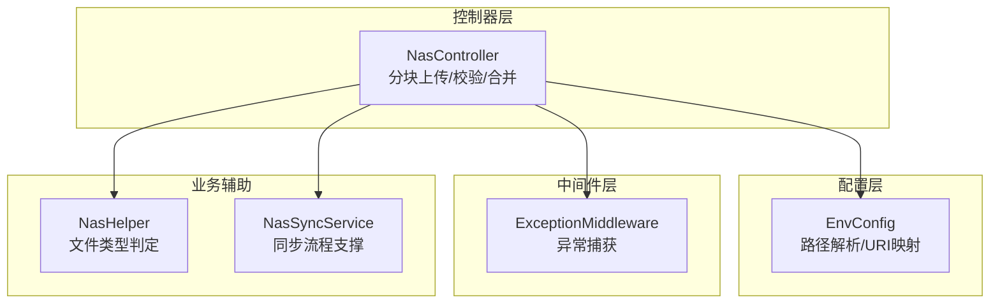
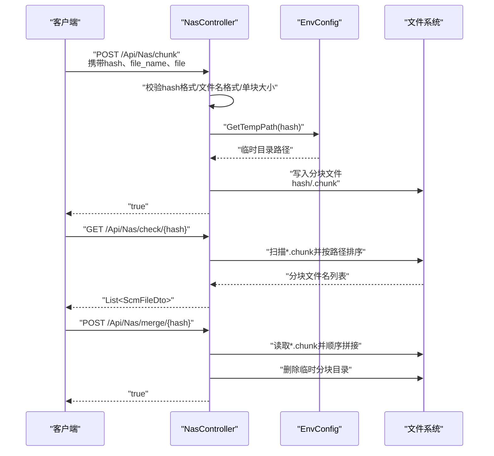
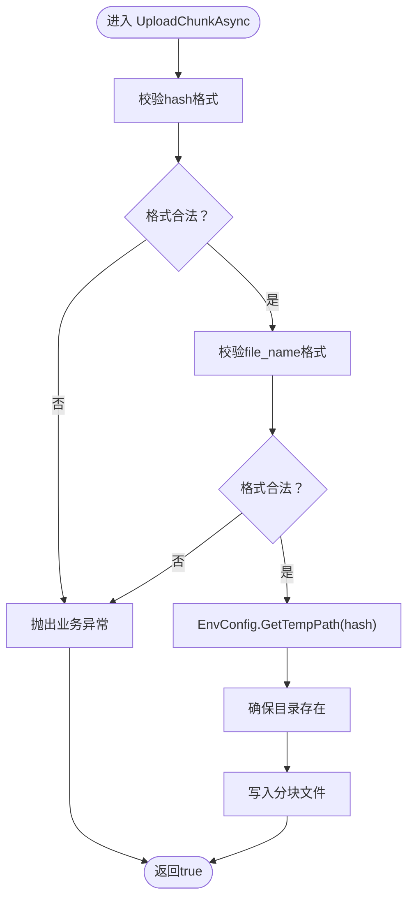
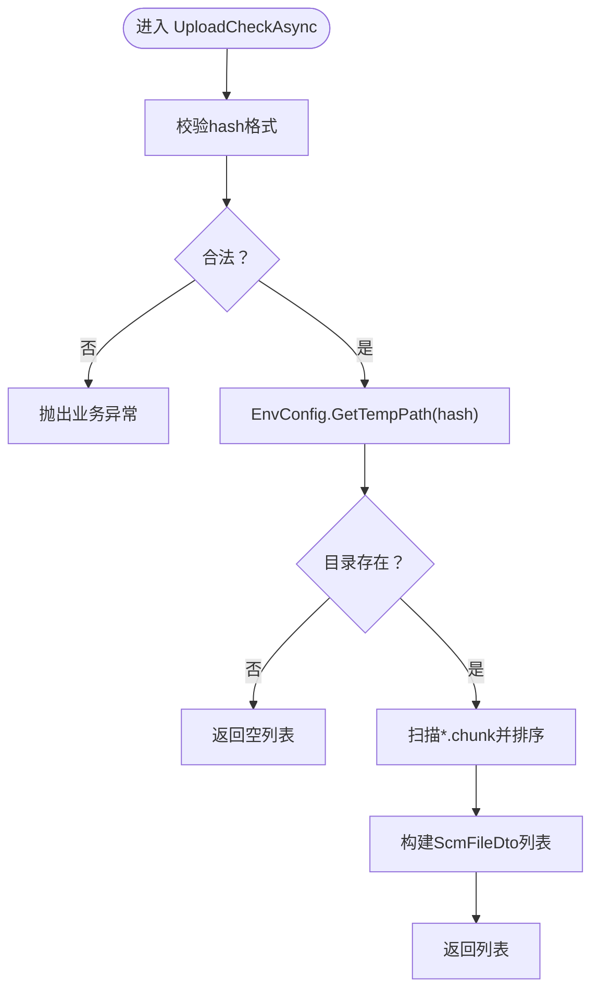
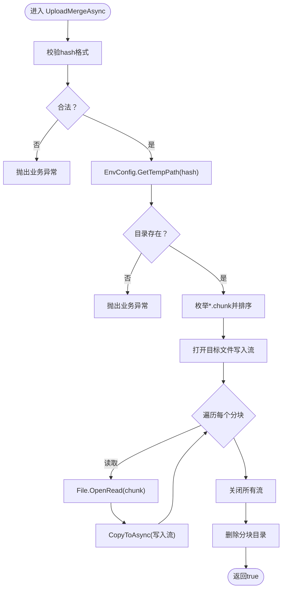
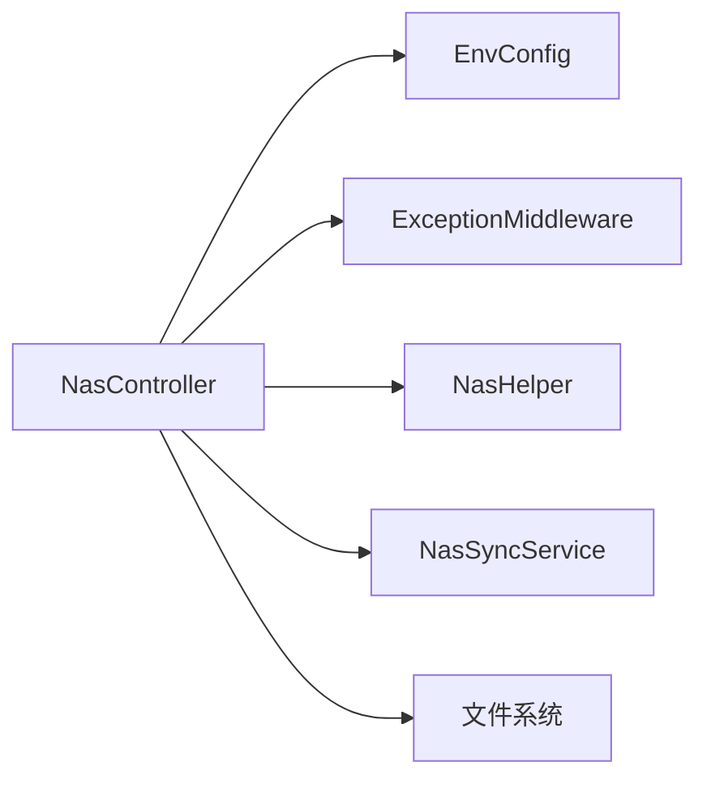

# 上传校验与合并

<cite>
**本文引用的文件**
- [NasController.cs](file://Scm.Net/Controllers/NasController.cs)
- [ScmUploadRequest.cs](file://Scm.Common.Dto/ScmUploadRequest.cs)
- [ScmUploadResponse.cs](file://Scm.Common.Dto/ScmUploadResponse.cs)
- [EnvConfig.cs](file://Scm.Server/Config/EnvConfig.cs)
- [ExceptionMiddleware.cs](file://Scm.Core/Configure/Middleware/ExceptionMiddleware.cs)
- [NasHelper.cs](file://Nas.Server/NasHelper.cs)
- [NasSyncService.cs](file://Nas.Server/Sync/NasSyncService.cs)
</cite>

## 目录
1. [简介](#简介)
2. [项目结构](#项目结构)
3. [核心组件](#核心组件)
4. [架构总览](#架构总览)
5. [详细组件分析](#详细组件分析)
6. [依赖关系分析](#依赖关系分析)
7. [性能考量](#性能考量)
8. [故障排查指南](#故障排查指南)
9. [结论](#结论)
10. [附录](#附录)

## 简介
本文聚焦于“上传校验与合并”能力，系统性阐述以下内容：
- 分块上传的校验机制：分块目录扫描、分块文件排序与缺失分块检测。
- 文件合并的完整流程：分块文件的有序读取、二进制数据拼接与临时目录清理。
- 提供上传校验与合并的API接口定义、响应格式与调用序列。
- 面向失败的处理策略、错误恢复机制与性能优化建议。

## 项目结构
围绕上传校验与合并的关键代码位于以下模块：
- 控制器层：负责HTTP接口暴露与请求参数校验。
- 配置层：负责数据/临时目录路径解析与对外URI映射。
- 中间件层：统一异常捕获与标准化响应。
- 业务辅助：文件类型判定与同步流程支撑。

图表来源
- [NasController.cs:349-464](file://Scm.Net/Controllers/NasController.cs#L349-L464)
- [EnvConfig.cs:128-177](file://Scm.Server/Config/EnvConfig.cs#L128-L177)
- [ExceptionMiddleware.cs:17-39](file://Scm.Core/Configure/Middleware/ExceptionMiddleware.cs#L17-L39)
- [NasHelper.cs:1-58](file://Nas.Server/NasHelper.cs#L1-L58)
- [NasSyncService.cs:584-684](file://Nas.Server/Sync/NasSyncService.cs#L584-L684)

章节来源
- [NasController.cs:349-464](file://Scm.Net/Controllers/NasController.cs#L349-L464)
- [EnvConfig.cs:128-177](file://Scm.Server/Config/EnvConfig.cs#L128-L177)

## 核心组件
- 分块上传接口：接收以“分块序号.chunk”命名的文件，写入基于64位摘要的临时目录。
- 上传校验接口：列出指定摘要目录下所有“.chunk”文件，用于前端判断缺失分块。
- 文件合并接口：按文件名排序读取所有分块，顺序拼接到目标文件，并清理临时分块目录。
- 请求模型：包含上传方式、文件、文件名、大小、分片总数、分片大小与自然索引等字段。
- 响应模型：统一的响应包装与结果集合，便于前端聚合展示。

章节来源
- [NasController.cs:349-464](file://Scm.Net/Controllers/NasController.cs#L349-L464)
- [ScmUploadRequest.cs:7-87](file://Scm.Common.Dto/ScmUploadRequest.cs#L7-L87)
- [ScmUploadResponse.cs:6-28](file://Scm.Common.Dto/ScmUploadResponse.cs#L6-L28)

## 架构总览
上传校验与合并的端到端流程如下：

图表来源
- [NasController.cs:349-464](file://Scm.Net/Controllers/NasController.cs#L349-L464)
- [EnvConfig.cs:128-177](file://Scm.Server/Config/EnvConfig.cs#L128-L177)

## 详细组件分析

### 组件A：分块上传（UploadChunkAsync）
- 输入参数
  - hash：64位十六进制字符串，作为分块目录标识。
  - file_name：形如“整数.chunk”的文件名。
  - file：IFormFile，单个分块。
- 行为
  - 校验hash格式与file_name格式。
  - 在临时目录下创建以hash为名的子目录。
  - 写入分块文件至“{hash}/{file_name}”。

图表来源
- [NasController.cs:349-389](file://Scm.Net/Controllers/NasController.cs#L349-L389)

章节来源
- [NasController.cs:349-389](file://Scm.Net/Controllers/NasController.cs#L349-L389)

### 组件B：上传校验（UploadCheckAsync）
- 输入参数
  - hash：64位十六进制字符串。
- 行为
  - 校验hash格式。
  - 列出临时目录下该hash对应的分块目录中所有“.chunk”文件。
  - 按文件路径排序返回文件名列表，供前端比对缺失分块。

图表来源
- [NasController.cs:396-421](file://Scm.Net/Controllers/NasController.cs#L396-L421)

章节来源
- [NasController.cs:396-421](file://Scm.Net/Controllers/NasController.cs#L396-L421)

### 组件C：文件合并（UploadMergeAsync）
- 输入参数
  - hash：64位十六进制字符串。
- 行为
  - 校验hash格式并确认分块目录存在。
  - 读取所有“.chunk”文件，按文件名排序后顺序拼接至目标文件“{hash}.nas”。
  - 清理分块目录，释放空间。

图表来源
- [NasController.cs:428-464](file://Scm.Net/Controllers/NasController.cs#L428-L464)

章节来源
- [NasController.cs:428-464](file://Scm.Net/Controllers/NasController.cs#L428-L464)

### 组件D：请求与响应模型
- ScmUploadRequest
  - type：上传方式（ByFile/ByPart/ByHash）。
  - file：上传文件。
  - path：可选，上传路径。
  - hash：可选，摘要。
  - file_name/file_size/count/part_name/part_size/index：分片相关字段。
- ScmUploadResponse
  - results：上传结果集合。
  - ScmUploadResult：包含name/path/size/success/message等字段。

章节来源
- [ScmUploadRequest.cs:7-87](file://Scm.Common.Dto/ScmUploadRequest.cs#L7-L87)
- [ScmUploadResponse.cs:6-28](file://Scm.Common.Dto/ScmUploadResponse.cs#L6-L28)

### 组件E：路径与URI映射（EnvConfig）
- 提供GetDataPath/GetTempPath/GetUploadPath等路径解析方法。
- ToUri用于将物理路径映射为对外URI，便于前端访问。

章节来源
- [EnvConfig.cs:128-177](file://Scm.Server/Config/EnvConfig.cs#L128-L177)

### 组件F：异常处理（ExceptionMiddleware）
- 捕获控制器内未处理异常，统一返回JSON格式的响应体，包含状态码与错误信息。

章节来源
- [ExceptionMiddleware.cs:17-39](file://Scm.Core/Configure/Middleware/ExceptionMiddleware.cs#L17-L39)

### 组件G：文件类型判定（NasHelper）
- 提供文件扩展名与类型的映射表，辅助识别文本、图片、音视频、办公文档等类型，便于后续处理与预览。

章节来源
- [NasHelper.cs:1-58](file://Nas.Server/NasHelper.cs#L1-L58)

## 依赖关系分析
- 控制器依赖配置层进行路径解析；依赖中间件进行异常拦截；依赖业务辅助进行类型判定与流程支撑。
- 控制器内部通过文件系统完成分块写入、扫描与合并，最终清理临时目录。

图表来源
- [NasController.cs:349-464](file://Scm.Net/Controllers/NasController.cs#L349-L464)
- [EnvConfig.cs:128-177](file://Scm.Server/Config/EnvConfig.cs#L128-L177)
- [ExceptionMiddleware.cs:17-39](file://Scm.Core/Configure/Middleware/ExceptionMiddleware.cs#L17-L39)
- [NasHelper.cs:1-58](file://Nas.Server/NasHelper.cs#L1-L58)
- [NasSyncService.cs:584-684](file://Nas.Server/Sync/NasSyncService.cs#L584-L684)

章节来源
- [NasController.cs:349-464](file://Scm.Net/Controllers/NasController.cs#L349-L464)

## 性能考量
- 分块读写采用异步拷贝，降低阻塞风险。
- 合并阶段按文件名排序，避免随机I/O带来的额外开销。
- 合并完成后立即清理分块目录，减少磁盘占用。
- 建议
  - 控制单块大小与并发分块数量，避免过多小文件导致排序与I/O放大。
  - 对超大文件合并可考虑分批写入与进度上报，提升用户体验。
  - 使用更高性能的存储介质与合适的文件系统参数，有助于提升顺序写入性能。

## 故障排查指南
- 常见错误与定位
  - 无效的hash或文件名格式：检查请求参数与正则约束。
  - 分块目录不存在：确认分块上传是否成功且未被清理。
  - 文件写入失败：检查磁盘空间、权限与路径有效性。
  - 异常统一由中间件捕获并返回标准JSON响应，便于前端统一处理。
- 建议排查步骤
  - 校验接口返回的分块列表是否与预期一致。
  - 合并前确认所有“.chunk”文件均存在且可读。
  - 观察日志输出，定位具体异常发生点。

章节来源
- [NasController.cs:396-464](file://Scm.Net/Controllers/NasController.cs#L396-L464)
- [ExceptionMiddleware.cs:17-39](file://Scm.Core/Configure/Middleware/ExceptionMiddleware.cs#L17-L39)

## 结论
上传校验与合并通过“分块目录扫描+分块排序+有序拼接+目录清理”的闭环设计，实现了稳定、可恢复的大文件上传能力。结合统一异常处理与清晰的API契约，能够有效支撑上层业务的高可用需求。

## 附录

### API接口定义与调用示例

- 分块上传
  - 方法与路径：POST /Api/Nas/chunk
  - 请求参数：ScmUploadRequest（type=ByPart，file，hash，file_name等）
  - 返回：布尔值（true表示成功）

- 上传校验
  - 方法与路径：GET /Api/Nas/check/{hash}
  - 请求参数：路径参数hash
  - 返回：List<ScmFileDto>（包含缺失分块的文件名列表）

- 文件合并
  - 方法与路径：POST /Api/Nas/merge/{hash}
  - 请求参数：路径参数hash
  - 返回：布尔值（true表示成功）

章节来源
- [NasController.cs:349-464](file://Scm.Net/Controllers/NasController.cs#L349-L464)
- [ScmUploadRequest.cs:7-87](file://Scm.Common.Dto/ScmUploadRequest.cs#L7-L87)
- [ScmUploadResponse.cs:6-28](file://Scm.Common.Dto/ScmUploadResponse.cs#L6-L28)