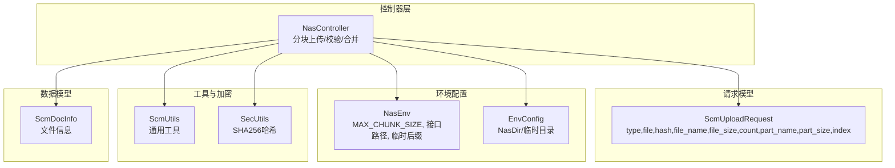
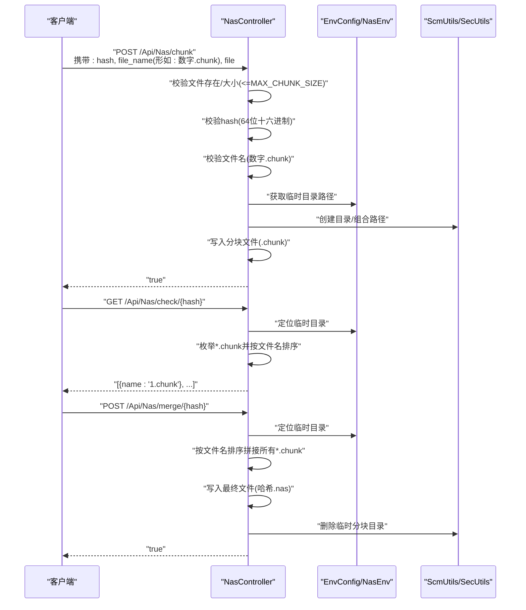
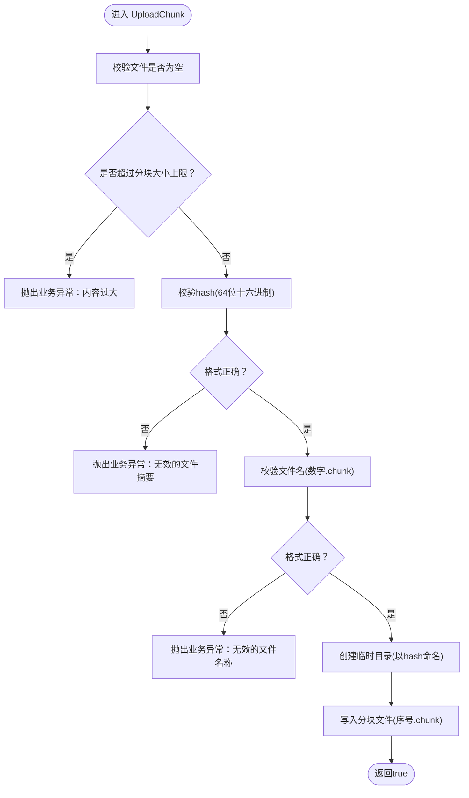
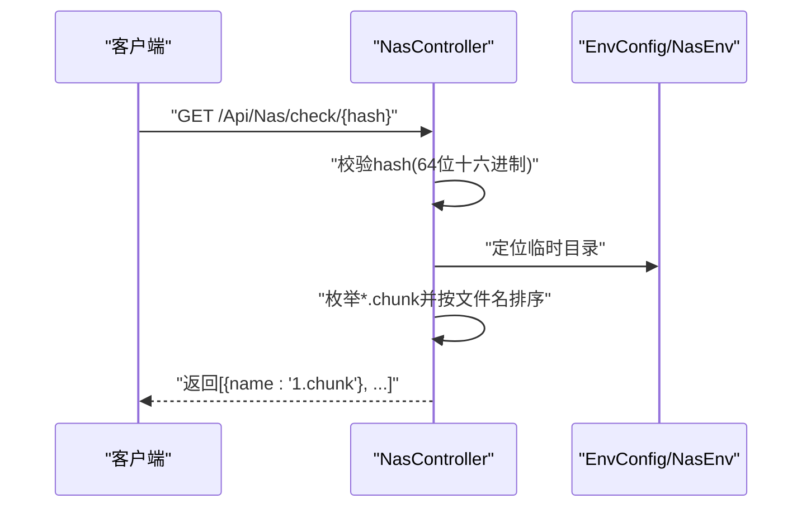
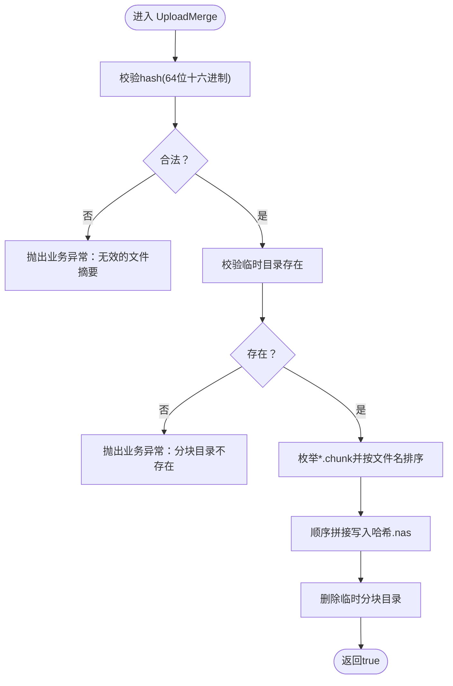
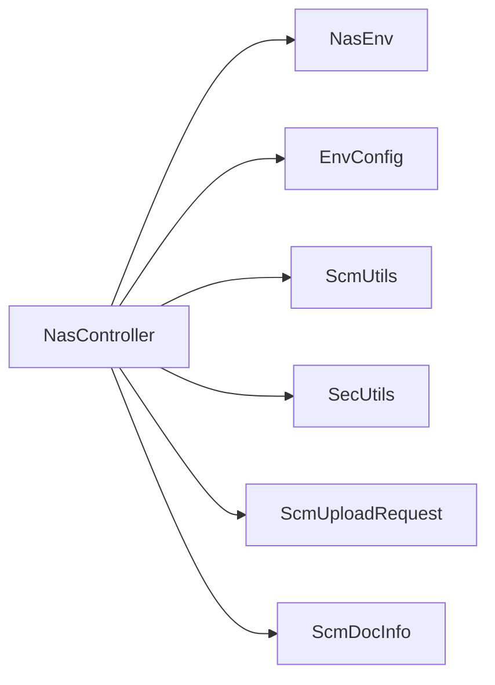

# 大文件分块上传

<cite>
**本文引用的文件**
- [NasController.cs](file://Scm.Net/Controllers/NasController.cs)
- [ScmUploadRequest.cs](file://Scm.Common.Dto/ScmUploadRequest.cs)
- [NasEnv.cs](file://Nas.Common/NasEnv.cs)
- [EnvConfig.cs](file://Nas.Server/Config/EnvConfig.cs)
- [ScmUtils.cs](file://Scm.Common/Utils/ScmUtils.cs)
- [SecUtils.cs](file://Scm.Common/Utils/SecUtils.cs)
- [ScmDocInfo.cs](file://Scm.Common/ScmDocInfo.cs)
</cite>

## 目录
1. [简介](#简介)
2. [项目结构](#项目结构)
3. [核心组件](#核心组件)
4. [架构总览](#架构总览)
5. [详细组件分析](#详细组件分析)
6. [依赖关系分析](#依赖关系分析)
7. [性能与并发考虑](#性能与并发考虑)
8. [故障排查指南](#故障排查指南)
9. [结论](#结论)
10. [附录](#附录)

## 简介
本技术文档围绕“大文件分块上传”能力进行系统化说明，覆盖从接口设计、参数校验、分块命名与排序、临时目录结构管理，到进度查询与合并流程的完整实现。文档同时给出安全与性能建议，帮助开发者在复杂网络环境下稳定地完成超大文件的可靠上传。

## 项目结构
分块上传功能主要由以下模块协同实现：
- 控制器层：提供分块上传、进度查询、合并等HTTP接口
- 请求模型：统一承载上传请求参数
- 环境配置：定义分块大小上限、接口路径、临时文件后缀等
- 工具与加密：提供文件工具与哈希计算能力
- 数据模型：用于接口返回的数据结构

图表来源
- [NasController.cs:1-469](file://Scm.Net/Controllers/NasController.cs#L1-L469)
- [ScmUploadRequest.cs:1-88](file://Scm.Common.Dto/ScmUploadRequest.cs#L1-L88)
- [NasEnv.cs:1-222](file://Nas.Common/NasEnv.cs#L1-L222)
- [EnvConfig.cs:1-8](file://Nas.Server/Config/EnvConfig.cs#L1-L8)
- [ScmUtils.cs:207-244](file://Scm.Common/Utils/ScmUtils.cs#L207-L244)
- [SecUtils.cs:124-143](file://Scm.Common/Utils/SecUtils.cs#L124-L143)
- [ScmDocInfo.cs:1-60](file://Scm.Common/ScmDocInfo.cs#L1-L60)

章节来源
- [NasController.cs:1-469](file://Scm.Net/Controllers/NasController.cs#L1-L469)
- [ScmUploadRequest.cs:1-88](file://Scm.Common.Dto/ScmUploadRequest.cs#L1-L88)
- [NasEnv.cs:1-222](file://Nas.Common/NasEnv.cs#L1-L222)
- [EnvConfig.cs:1-8](file://Nas.Server/Config/EnvConfig.cs#L1-L8)
- [ScmUtils.cs:207-244](file://Scm.Common/Utils/ScmUtils.cs#L207-L244)
- [SecUtils.cs:124-143](file://Scm.Common/Utils/SecUtils.cs#L124-L143)
- [ScmDocInfo.cs:1-60](file://Scm.Common/ScmDocInfo.cs#L1-L60)

## 核心组件
- 分块上传接口：接收单个分块文件，校验分块大小、哈希与文件名格式，并写入临时目录
- 进度查询接口：按哈希列出已上传的分块文件
- 合并接口：将同一哈希的所有分块按顺序拼接为最终文件，并清理临时分块目录
- 参数模型：统一承载上传方式、文件、路径、版本摘要、分块元信息等
- 环境配置：定义分块大小上限、接口路径、临时文件后缀等

章节来源
- [NasController.cs:349-464](file://Scm.Net/Controllers/NasController.cs#L349-L464)
- [ScmUploadRequest.cs:7-58](file://Scm.Common.Dto/ScmUploadRequest.cs#L7-L58)
- [NasEnv.cs:46-92](file://Nas.Common/NasEnv.cs#L46-L92)

## 架构总览
分块上传采用“客户端分片 + 服务端校验 + 临时目录聚合 + 合并”的模式，确保在网络不稳定或中断时仍可恢复与重试。

图表来源
- [NasController.cs:349-464](file://Scm.Net/Controllers/NasController.cs#L349-L464)
- [NasEnv.cs:46-92](file://Nas.Common/NasEnv.cs#L46-L92)
- [EnvConfig.cs:1-8](file://Nas.Server/Config/EnvConfig.cs#L1-L8)
- [ScmUtils.cs:207-244](file://Scm.Common/Utils/ScmUtils.cs#L207-L244)
- [SecUtils.cs:124-143](file://Scm.Common/Utils/SecUtils.cs#L124-L143)

## 详细组件分析

### 分块上传接口（UploadChunk）
- 接口路径：POST /Api/Nas/chunk
- 输入参数：hash（64位十六进制）、file_name（形如: 数字.chunk）、file（二进制分块）
- 校验逻辑：
  - 文件非空
  - 分块大小不超过上限（MAX_CHUNK_SIZE）
  - 哈希格式校验（64位十六进制）
  - 文件名格式校验（数字+.chunk）
- 存储策略：
  - 以哈希作为临时目录名
  - 分块文件名为“序号.chunk”，写入对应目录
  - 使用工具类创建目录并组合路径

图表来源
- [NasController.cs:349-389](file://Scm.Net/Controllers/NasController.cs#L349-L389)
- [NasEnv.cs:46-48](file://Nas.Common/NasEnv.cs#L46-L48)

章节来源
- [NasController.cs:349-389](file://Scm.Net/Controllers/NasController.cs#L349-L389)
- [NasEnv.cs:46-48](file://Nas.Common/NasEnv.cs#L46-L48)

### 进度查询接口（UploadCheck）
- 接口路径：GET /Api/Nas/check/{hash}
- 行为：校验hash合法性，列出该哈希对应的临时目录中所有*.chunk文件，按文件名排序返回
- 返回结构：包含分块文件名的列表

图表来源
- [NasController.cs:396-421](file://Scm.Net/Controllers/NasController.cs#L396-L421)
- [NasEnv.cs:86-88](file://Nas.Common/NasEnv.cs#L86-L88)

章节来源
- [NasController.cs:396-421](file://Scm.Net/Controllers/NasController.cs#L396-L421)
- [NasEnv.cs:86-88](file://Nas.Common/NasEnv.cs#L86-L88)

### 合并接口（UploadMerge）
- 接口路径：POST /Api/Nas/merge/{hash}
- 行为：校验hash与目录存在性；按文件名排序拼接所有*.chunk为最终文件（哈希.nas）；删除临时分块目录
- 注意：最终文件使用“.nas”后缀，与小文件直传的“.nas”命名保持一致

图表来源
- [NasController.cs:428-464](file://Scm.Net/Controllers/NasController.cs#L428-L464)
- [NasEnv.cs:89-92](file://Nas.Common/NasEnv.cs#L89-L92)

章节来源
- [NasController.cs:428-464](file://Scm.Net/Controllers/NasController.cs#L428-L464)
- [NasEnv.cs:89-92](file://Nas.Common/NasEnv.cs#L89-L92)

### 参数模型（ScmUploadRequest）
- 字段说明：
  - type：上传方式（ByFile/ByPart/ByHash）
  - file：上传文件对象
  - path：可选，目标路径
  - hash：可选，版本摘要（用于ByHash）
  - file_name：可选，文件名（用于覆盖）
  - file_size：可选，文件大小
  - count：可选，分块总数
  - part_name/part_size/index：可选，分块元信息
- 用途：统一承载分块上传请求参数，便于控制器解析与校验

章节来源
- [ScmUploadRequest.cs:7-58](file://Scm.Common.Dto/ScmUploadRequest.cs#L7-L58)

### 环境配置（NasEnv/EnvConfig）
- NasEnv：
  - MAX_CHUNK_SIZE：分块大小上限（字节）
  - 接口路径常量：FileUploadUrl、ChunkUploadUrl、CheckUploadUrl、MergeUploadUrl
  - 临时文件后缀：TempFileExt（用于小文件直传场景）
- EnvConfig（Nas侧）：提供NasDir等配置项，用于定位数据与临时目录

章节来源
- [NasEnv.cs:46-92](file://Nas.Common/NasEnv.cs#L46-L92)
- [EnvConfig.cs:1-8](file://Nas.Server/Config/EnvConfig.cs#L1-L8)

### 工具与加密（ScmUtils/SecUtils）
- ScmUtils：提供文件操作相关工具（如目录创建、路径组合、文件遍历等）
- SecUtils：提供SHA256哈希计算（字符串/流/字节数组），用于生成64位十六进制摘要

章节来源
- [ScmUtils.cs:207-244](file://Scm.Common/Utils/ScmUtils.cs#L207-L244)
- [SecUtils.cs:124-143](file://Scm.Common/Utils/SecUtils.cs#L124-L143)

### 数据模型（ScmDocInfo）
- 用于描述文件信息（名称、扩展名、大小、虚拟路径等），在接口返回与文件管理中广泛使用

章节来源
- [ScmDocInfo.cs:1-60](file://Scm.Common/ScmDocInfo.cs#L1-L60)

## 依赖关系分析
- 控制器依赖环境配置与工具类，保证路径与文件操作的正确性
- 分块上传流程强依赖参数校验与正则表达式，确保命名规范与安全性
- 合并阶段依赖排序与顺序拼接，避免数据错位

图表来源
- [NasController.cs:1-469](file://Scm.Net/Controllers/NasController.cs#L1-L469)
- [NasEnv.cs:1-222](file://Nas.Common/NasEnv.cs#L1-L222)
- [EnvConfig.cs:1-8](file://Nas.Server/Config/EnvConfig.cs#L1-L8)
- [ScmUtils.cs:207-244](file://Scm.Common/Utils/ScmUtils.cs#L207-L244)
- [SecUtils.cs:124-143](file://Scm.Common/Utils/SecUtils.cs#L124-L143)
- [ScmUploadRequest.cs:1-88](file://Scm.Common.Dto/ScmUploadRequest.cs#L1-L88)
- [ScmDocInfo.cs:1-60](file://Scm.Common/ScmDocInfo.cs#L1-L60)

## 性能与并发考虑
- 分块大小限制：通过MAX_CHUNK_SIZE限制单次上传大小，降低内存占用与网络拥塞风险
- 顺序拼接：合并阶段按文件名排序，确保数据顺序一致性
- 并发上传建议：
  - 客户端应控制并发数量，避免磁盘写入竞争
  - 建议采用指数退避重试策略，避免雪崩效应
  - 在高并发场景下，建议引入分布式锁或队列机制，避免重复写入与竞态条件
- 临时目录清理：合并完成后删除分块目录，防止磁盘空间膨胀

章节来源
- [NasEnv.cs:46-48](file://Nas.Common/NasEnv.cs#L46-L48)
- [NasController.cs:428-464](file://Scm.Net/Controllers/NasController.cs#L428-L464)

## 故障排查指南
- 常见错误与定位要点：
  - “上传文件为空”：确认前端正确传递file字段
  - “文件的内容过大”：检查分块大小是否超过MAX_CHUNK_SIZE
  - “无效的文件摘要”：确认hash为64位十六进制
  - “无效的文件名称”：确认文件名为“数字.chunk”
  - “分块目录不存在”：确认已先执行分块上传且hash正确
- 建议排查步骤：
  - 使用进度查询接口核对已上传分块
  - 检查临时目录结构与权限
  - 核对最终文件是否成功生成（哈希.nas）

章节来源
- [NasController.cs:350-389](file://Scm.Net/Controllers/NasController.cs#L350-L389)
- [NasController.cs:396-421](file://Scm.Net/Controllers/NasController.cs#L396-L421)
- [NasController.cs:428-464](file://Scm.Net/Controllers/NasController.cs#L428-L464)

## 结论
本方案通过严格的参数校验、规范的分块命名与排序、以及清晰的临时目录管理，实现了稳定的大文件分块上传能力。结合进度查询与合并流程，可在复杂网络环境中提供可靠的断点续传与重试支持。建议在生产环境中配合合理的并发控制与重试策略，进一步提升稳定性与吞吐量。

## 附录

### API接口清单
- 分块上传
  - 方法：POST
  - 路径：/Api/Nas/chunk
  - 参数：hash（64位十六进制）、file_name（形如: 数字.chunk）、file（二进制）
  - 返回：true
- 上传校验
  - 方法：GET
  - 路径：/Api/Nas/check/{hash}
  - 参数：hash（64位十六进制）
  - 返回：分块文件名列表（按文件名排序）
- 文件合并
  - 方法：POST
  - 路径：/Api/Nas/merge/{hash}
  - 参数：hash（64位十六进制）
  - 返回：true

章节来源
- [NasController.cs:349-464](file://Scm.Net/Controllers/NasController.cs#L349-L464)
- [NasEnv.cs:80-92](file://Nas.Common/NasEnv.cs#L80-L92)