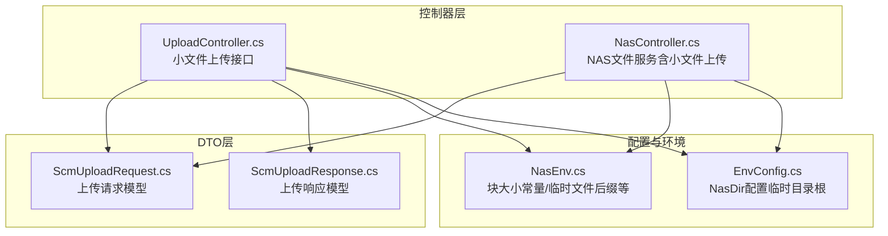
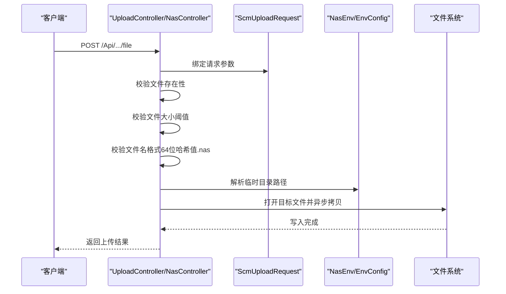
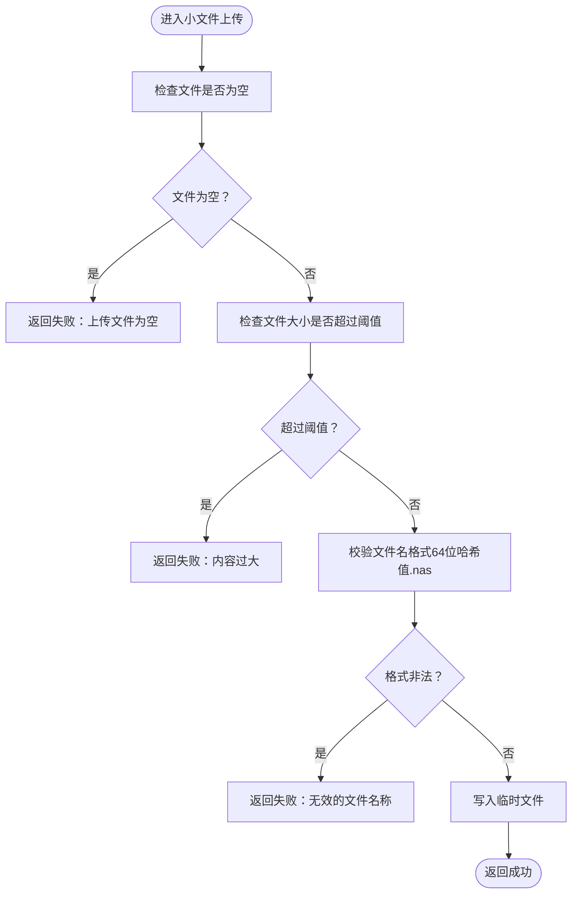
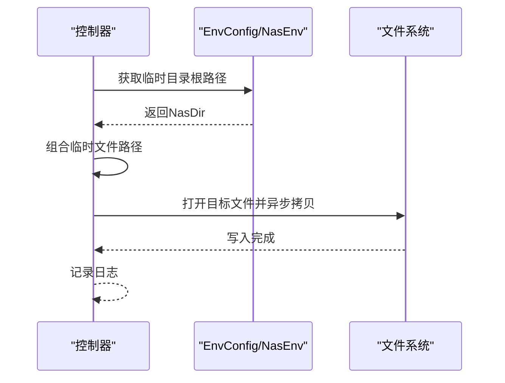
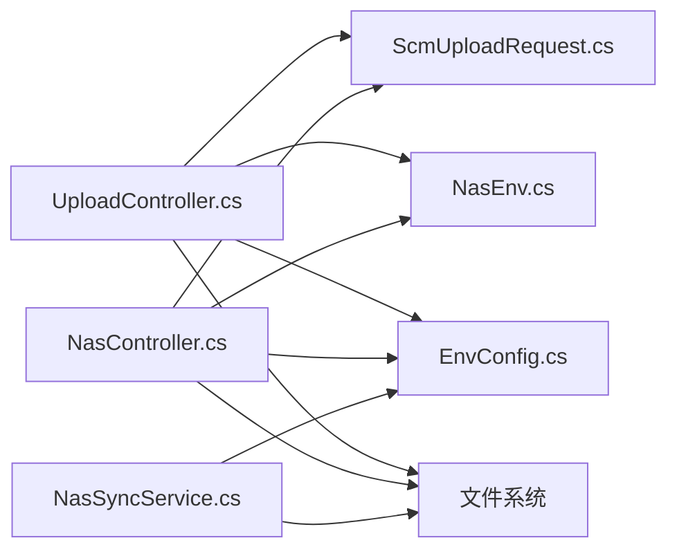

# 小文件上传

<cite>
**本文引用的文件**
- [UploadController.cs](file://Scm.Net/Controllers/UploadController.cs)
- [NasController.cs](file://Scm.Net/Controllers/NasController.cs)
- [ScmUploadRequest.cs](file://Scm.Common.Dto/ScmUploadRequest.cs)
- [ScmUploadResponse.cs](file://Scm.Common.Dto/ScmUploadResponse.cs)
- [NasEnv.cs](file://Nas.Common/NasEnv.cs)
- [EnvConfig.cs](file://Nas.Server/Config/EnvConfig.cs)
- [NasSyncService.cs](file://Nas.Server/Sync/NasSyncService.cs)
</cite>

## 目录
1. [简介](#简介)
2. [项目结构](#项目结构)
3. [核心组件](#核心组件)
4. [架构总览](#架构总览)
5. [详细组件分析](#详细组件分析)
6. [依赖关系分析](#依赖关系分析)
7. [性能考量](#性能考量)
8. [故障排查指南](#故障排查指南)
9. [结论](#结论)
10. [附录](#附录)

## 简介
本章节面向“小文件上传”能力，聚焦于单文件直传模式的实现机制与设计要点，包括：
- 文件大小阈值判断（基于块大小常量）
- 文件名格式校验（64位哈希值.nas）
- 临时文件存储路径管理
- 参数校验、文件拷贝与错误处理
- 完整的API接口定义与使用说明
- 为何小文件采用直传而非分块上传的设计取舍与性能优化考量

## 项目结构
小文件上传相关代码主要分布在以下模块：
- 控制器层：提供对外HTTP接口
- DTO层：封装请求/响应结构
- 配置与环境：提供临时目录路径解析
- 核心常量：统一块大小阈值与临时文件后缀

**图表来源**
- [UploadController.cs:1-109](file://Scm.Net/Controllers/UploadController.cs#L1-L109)
- [NasController.cs:1-469](file://Scm.Net/Controllers/NasController.cs#L1-L469)
- [ScmUploadRequest.cs:1-88](file://Scm.Common.Dto/ScmUploadRequest.cs#L1-L88)
- [ScmUploadResponse.cs:1-29](file://Scm.Common.Dto/ScmUploadResponse.cs#L1-L29)
- [NasEnv.cs:1-222](file://Nas.Common/NasEnv.cs#L1-L222)
- [EnvConfig.cs:1-8](file://Nas.Server/Config/EnvConfig.cs#L1-L8)

**章节来源**
- [UploadController.cs:1-109](file://Scm.Net/Controllers/UploadController.cs#L1-L109)
- [NasController.cs:1-469](file://Scm.Net/Controllers/NasController.cs#L1-L469)
- [ScmUploadRequest.cs:1-88](file://Scm.Common.Dto/ScmUploadRequest.cs#L1-L88)
- [ScmUploadResponse.cs:1-29](file://Scm.Common.Dto/ScmUploadResponse.cs#L1-L29)
- [NasEnv.cs:1-222](file://Nas.Common/NasEnv.cs#L1-L222)
- [EnvConfig.cs:1-8](file://Nas.Server/Config/EnvConfig.cs#L1-L8)

## 核心组件
- 控制器：提供小文件上传接口，负责参数校验、文件拷贝与错误处理
- 请求模型：承载上传文件、文件名、摘要等字段
- 响应模型：封装上传结果集合
- 环境常量：统一块大小阈值与临时文件后缀
- 配置类：提供NasDir根路径，用于拼接临时文件路径

关键职责与边界：
- 小文件上传仅在文件长度不超过阈值时允许
- 文件名必须满足“64位字母数字_下划线组成的哈希值.nas”格式
- 临时文件写入路径由配置类提供的根路径与文件名组合生成
- 成功/失败均通过统一响应模型返回

**章节来源**
- [UploadController.cs:25-71](file://Scm.Net/Controllers/UploadController.cs#L25-L71)
- [NasController.cs:299-340](file://Scm.Net/Controllers/NasController.cs#L299-L340)
- [ScmUploadRequest.cs:7-59](file://Scm.Common.Dto/ScmUploadRequest.cs#L7-L59)
- [ScmUploadResponse.cs:6-28](file://Scm.Common.Dto/ScmUploadResponse.cs#L6-L28)
- [NasEnv.cs:48](file://Nas.Common/NasEnv.cs#L48)
- [EnvConfig.cs:3-6](file://Nas.Server/Config/EnvConfig.cs#L3-L6)

## 架构总览
小文件上传的端到端流程如下：

**图表来源**
- [UploadController.cs:27-70](file://Scm.Net/Controllers/UploadController.cs#L27-L70)
- [NasController.cs:302-339](file://Scm.Net/Controllers/NasController.cs#L302-L339)
- [ScmUploadRequest.cs:19](file://Scm.Common.Dto/ScmUploadRequest.cs#L19)
- [NasEnv.cs:48](file://Nas.Common/NasEnv.cs#L48)
- [EnvConfig.cs:5](file://Nas.Server/Config/EnvConfig.cs#L5)

## 详细组件分析

### 控制器与路由
- UploadController：提供小文件上传接口，返回统一响应模型
- NasController：提供小/大文件上传、分块上传、校验与合并等完整NAS文件服务

两者均对小文件上传进行相同的核心校验与处理。

**章节来源**
- [UploadController.cs:26-71](file://Scm.Net/Controllers/UploadController.cs#L26-L71)
- [NasController.cs:301-340](file://Scm.Net/Controllers/NasController.cs#L301-L340)

### 参数模型与校验
- 请求模型包含上传文件、文件名、摘要、分片信息等字段
- 校验逻辑：
  - 文件非空
  - 文件长度不超过块大小阈值
  - 文件名格式为“64位哈希值.nas”

**图表来源**
- [UploadController.cs:31-52](file://Scm.Net/Controllers/UploadController.cs#L31-L52)
- [NasController.cs:304-322](file://Scm.Net/Controllers/NasController.cs#L304-L322)
- [ScmUploadRequest.cs:19](file://Scm.Common.Dto/ScmUploadRequest.cs#L19)
- [NasEnv.cs:48](file://Nas.Common/NasEnv.cs#L48)

**章节来源**
- [ScmUploadRequest.cs:7-59](file://Scm.Common.Dto/ScmUploadRequest.cs#L7-L59)
- [UploadController.cs:31-52](file://Scm.Net/Controllers/UploadController.cs#L31-L52)
- [NasController.cs:304-322](file://Scm.Net/Controllers/NasController.cs#L304-L322)

### 文件拷贝与临时文件存储
- 临时文件路径由配置类提供的根路径与文件名组合生成
- 使用异步拷贝将上传流写入目标文件
- 成功后记录调试日志并返回成功状态

**图表来源**
- [UploadController.cs:61-65](file://Scm.Net/Controllers/UploadController.cs#L61-L65)
- [NasController.cs:331-335](file://Scm.Net/Controllers/NasController.cs#L331-L335)
- [EnvConfig.cs:5](file://Nas.Server/Config/EnvConfig.cs#L5)
- [NasEnv.cs:33](file://Nas.Common/NasEnv.cs#L33)

**章节来源**
- [UploadController.cs:61-65](file://Scm.Net/Controllers/UploadController.cs#L61-L65)
- [NasController.cs:331-335](file://Scm.Net/Controllers/NasController.cs#L331-L335)
- [EnvConfig.cs:5](file://Nas.Server/Config/EnvConfig.cs#L5)
- [NasEnv.cs:33](file://Nas.Common/NasEnv.cs#L33)

### 错误处理机制
- 对空文件、超阈值、文件名格式不合法等情况进行显式校验并返回失败
- 使用统一响应模型或业务异常抛出错误信息
- 日志记录便于问题定位

**章节来源**
- [UploadController.cs:32-52](file://Scm.Net/Controllers/UploadController.cs#L32-L52)
- [NasController.cs:305-322](file://Scm.Net/Controllers/NasController.cs#L305-L322)

### API 接口文档

- 接口路径
  - UploadController：POST /Api/Scm/upload/file
  - NasController：POST /Api/Nas/file

- 请求参数
  - file：必填，上传的文件对象
  - file_name：可选，自定义文件名；若未提供则使用原始文件名
  - 其他字段（如hash、part_name、index等）在小文件上传中不参与校验

- 响应格式
  - UploadController：返回统一响应模型，包含状态与消息
  - NasController：返回布尔值true表示成功

- 使用示例
  - 通过表单提交，包含file字段与可选的file_name
  - 服务端将校验文件大小与文件名格式，并写入临时目录

注意：分块上传接口在UploadController中预留但未实现，实际分块能力由NasController提供。

**章节来源**
- [UploadController.cs:26-71](file://Scm.Net/Controllers/UploadController.cs#L26-L71)
- [NasController.cs:301-340](file://Scm.Net/Controllers/NasController.cs#L301-L340)
- [ScmUploadRequest.cs:19](file://Scm.Common.Dto/ScmUploadRequest.cs#L19)
- [ScmUploadResponse.cs:6-28](file://Scm.Common.Dto/ScmUploadResponse.cs#L6-L28)

## 依赖关系分析
- 控制器依赖请求模型与环境常量
- 临时文件路径解析依赖配置类
- 文件写入依赖文件系统API
- 业务异常与日志工具贯穿各环节

**图表来源**
- [UploadController.cs:1-109](file://Scm.Net/Controllers/UploadController.cs#L1-L109)
- [NasController.cs:1-469](file://Scm.Net/Controllers/NasController.cs#L1-L469)
- [ScmUploadRequest.cs:1-88](file://Scm.Common.Dto/ScmUploadRequest.cs#L1-L88)
- [NasEnv.cs:1-222](file://Nas.Common/NasEnv.cs#L1-L222)
- [EnvConfig.cs:1-8](file://Nas.Server/Config/EnvConfig.cs#L1-L8)
- [NasSyncService.cs:640-654](file://Nas.Server/Sync/NasSyncService.cs#L640-L654)

**章节来源**
- [UploadController.cs:1-109](file://Scm.Net/Controllers/UploadController.cs#L1-L109)
- [NasController.cs:1-469](file://Scm.Net/Controllers/NasController.cs#L1-L469)
- [ScmUploadRequest.cs:1-88](file://Scm.Common.Dto/ScmUploadRequest.cs#L1-L88)
- [NasEnv.cs:1-222](file://Nas.Common/NasEnv.cs#L1-L222)
- [EnvConfig.cs:1-8](file://Nas.Server/Config/EnvConfig.cs#L1-L8)
- [NasSyncService.cs:640-654](file://Nas.Server/Sync/NasSyncService.cs#L640-L654)

## 性能考量
- 单文件直传避免了分块聚合与重命名的额外步骤，减少I/O与系统调用次数
- 异步拷贝降低阻塞风险，提升并发吞吐
- 临时文件以.nas后缀命名，便于后续同步流程识别与处理
- 小文件阈值统一为块大小常量，确保小文件场景下的快速处理与资源占用可控

**章节来源**
- [NasEnv.cs:48](file://Nas.Common/NasEnv.cs#L48)
- [UploadController.cs:64](file://Scm.Net/Controllers/UploadController.cs#L64)
- [NasController.cs:334](file://Scm.Net/Controllers/NasController.cs#L334)

## 故障排查指南
- 上传文件为空：检查前端表单是否正确提交file字段
- 内容过大：确认文件大小未超过阈值
- 文件名格式不合法：确保文件名为“64位哈希值.nas”
- 临时文件写入失败：检查NasDir配置与磁盘权限
- 同步阶段失败：确认临时文件已移动至目标路径

**章节来源**
- [UploadController.cs:32-52](file://Scm.Net/Controllers/UploadController.cs#L32-L52)
- [NasController.cs:305-322](file://Scm.Net/Controllers/NasController.cs#L305-L322)
- [NasSyncService.cs:640-654](file://Nas.Server/Sync/NasSyncService.cs#L640-L654)

## 结论
小文件上传通过严格的参数校验、明确的文件名规范与高效的异步写入策略，在保证安全与一致性的前提下，实现了低延迟与高吞吐的上传体验。配合统一的阈值与临时文件命名约定，为后续同步与归档流程提供了清晰的衔接点。

## 附录

### 设计决策与取舍
- 为何小文件采用直传而非分块上传
  - 小文件体积较小，直传可显著减少系统调用与I/O开销
  - 分块上传更适合大文件的断点续传与并发聚合，小文件并无此需求
  - 统一的.nas后缀便于后续同步与归档处理

- 性能优化考虑
  - 使用异步拷贝避免阻塞
  - 统一阈值与命名规范简化流程
  - 临时文件集中管理，便于清理与追踪

**章节来源**
- [NasEnv.cs:48](file://Nas.Common/NasEnv.cs#L48)
- [UploadController.cs:64](file://Scm.Net/Controllers/UploadController.cs#L64)
- [NasController.cs:334](file://Scm.Net/Controllers/NasController.cs#L334)