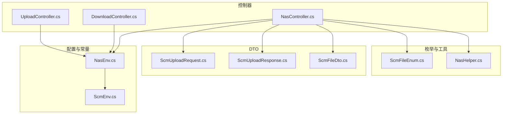
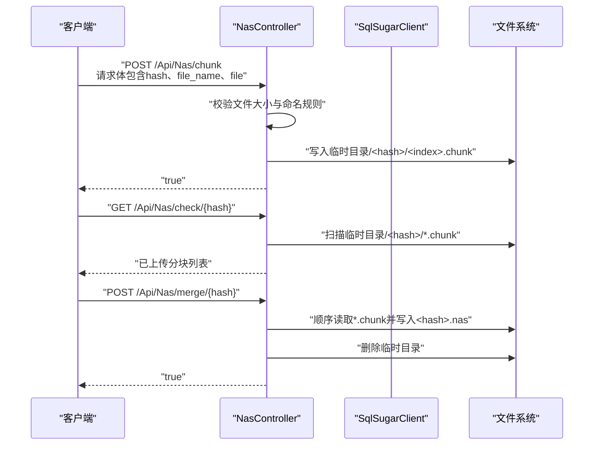
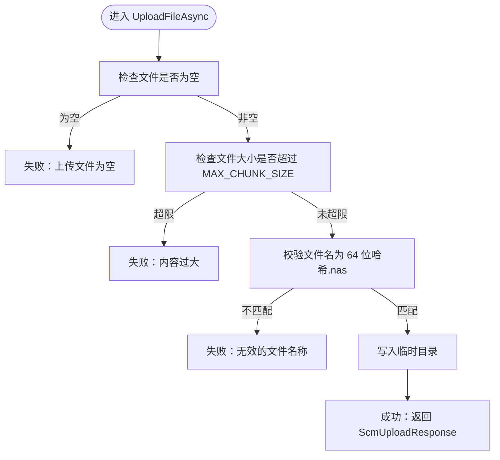
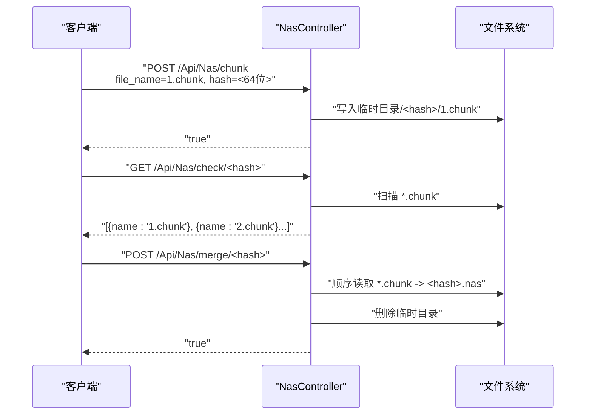
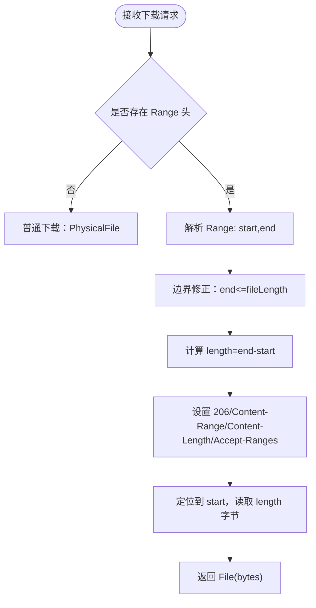
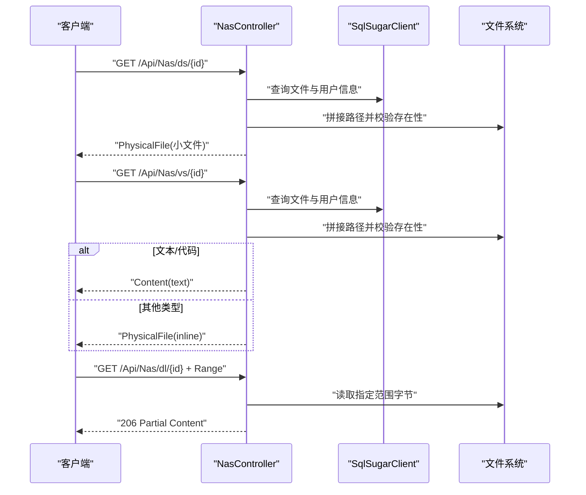
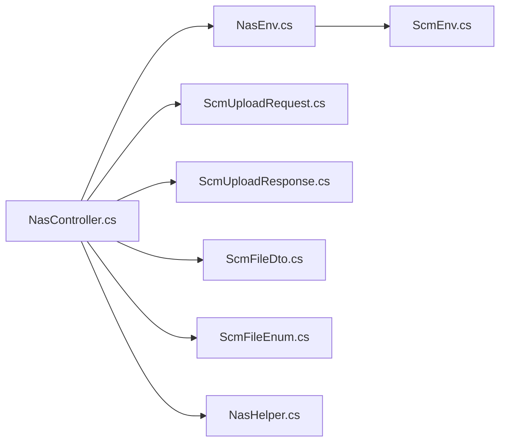

# 文件上传下载

<cite>
**本文引用的文件**
- [UploadController.cs](file://Scm.Net/Controllers/UploadController.cs)
- [DownloadController.cs](file://Scm.Net/Controllers/DownloadController.cs)
- [NasController.cs](file://Scm.Net/Controllers/NasController.cs)
- [NasEnv.cs](file://Nas.Common/NasEnv.cs)
- [ScmUploadRequest.cs](file://Scm.Common.Dto/ScmUploadRequest.cs)
- [ScmUploadResponse.cs](file://Scm.Common.Dto/ScmUploadResponse.cs)
- [ScmFileDto.cs](file://Scm.Common.Dto/Dto/ScmFileDto.cs)
- [ScmFileEnum.cs](file://Scm.Common/Enums/ScmFileEnum.cs)
- [NasHelper.cs](file://Nas.Server/NasHelper.cs)
- [ScmEnv.cs](file://Scm.Common/ScmEnv.cs)
</cite>

## 目录
1. [简介](#简介)
2. [项目结构](#项目结构)
3. [核心组件](#核心组件)
4. [架构总览](#架构总览)
5. [详细组件分析](#详细组件分析)
6. [依赖关系分析](#依赖关系分析)
7. [性能与容量规划](#性能与容量规划)
8. [故障排查指南](#故障排查指南)
9. [结论](#结论)
10. [附录：API 接口与使用示例](#附录api-接口与使用示例)

## 简介
本技术文档围绕文件上传与下载功能展开，覆盖以下要点：
- 小文件上传与下载的实现机制，包括文件大小限制（MAX_CHUNK_SIZE）、文件命名与扩展验证、存储路径管理。
- 大文件分块上传的完整流程，包括分块编号规则、临时文件夹组织、上传进度与校验、分块合并策略。
- 断点续传的实现原理，包括 Range 请求解析、偏移量计算、HTTP 206 响应与错误恢复。
- 下载模式说明：物理文件下载、流式下载、预览模式（文本直出与二进制预览）。
- 完整的 API 接口定义与使用示例。

## 项目结构
与文件上传下载直接相关的模块分布如下：
- 控制器层
  - UploadController：提供小文件上传入口（当前未实现分块上传接口）。
  - DownloadController：提供小文件下载入口。
  - NasController：提供小/大文件下载、文件查看、小/大文件上传、分块上传、上传校验、分块合并等完整能力。
- 配置与常量
  - NasEnv：定义块大小上限、服务端接口路径、虚拟路径标识等。
- 数据传输对象
  - ScmUploadRequest：上传请求体，包含上传方式、文件、路径、摘要、分块元信息等。
  - ScmUploadResponse：上传响应体，包含结果列表。
  - ScmFileDto：文件信息 DTO。
- 枚举与工具
  - ScmFileKindEnum：文件类型枚举。
  - NasHelper：文件类型与扩展映射辅助。
  - ScmEnv：通用环境常量（路径分隔符等）。

**图表来源**
- [UploadController.cs:14-71](file://Scm.Net/Controllers/UploadController.cs#L14-L71)
- [DownloadController.cs:13-67](file://Scm.Net/Controllers/DownloadController.cs#L13-L67)
- [NasController.cs:34-466](file://Scm.Net/Controllers/NasController.cs#L34-L466)
- [NasEnv.cs:48-92](file://Nas.Common/NasEnv.cs#L48-L92)
- [ScmUploadRequest.cs:7-58](file://Scm.Common.Dto/ScmUploadRequest.cs#L7-L58)
- [ScmUploadResponse.cs:6-27](file://Scm.Common.Dto/ScmUploadResponse.cs#L6-L27)
- [ScmFileDto.cs:3-12](file://Scm.Common.Dto/Dto/ScmFileDto.cs#L3-L12)
- [ScmFileEnum.cs:20-77](file://Scm.Common/Enums/ScmFileEnum.cs#L20-L77)
- [NasHelper.cs:5-50](file://Nas.Server/NasHelper.cs#L5-L50)
- [ScmEnv.cs:35-42](file://Scm.Common/ScmEnv.cs#L35-L42)

**章节来源**
- [UploadController.cs:14-71](file://Scm.Net/Controllers/UploadController.cs#L14-L71)
- [DownloadController.cs:13-67](file://Scm.Net/Controllers/DownloadController.cs#L13-L67)
- [NasController.cs:34-466](file://Scm.Net/Controllers/NasController.cs#L34-L466)
- [NasEnv.cs:48-92](file://Nas.Common/NasEnv.cs#L48-L92)

## 核心组件
- 文件大小限制与路径管理
  - MAX_CHUNK_SIZE：块大小上限，用于限制单次上传大小与小文件下载限制。
  - 存储路径：通过 EnvConfig.GetTempPath 生成临时文件路径；通过 EnvConfig.GetDataPath 组合用户目录与文件路径。
- 上传请求模型
  - ScmUploadRequest：统一承载上传方式（ByFile/ByPart/ByHash）、文件、路径、摘要、分块元信息（part_name/part_size/index/count）。
- 上传响应模型
  - ScmUploadResponse：聚合多个上传结果，便于批量上传场景。
- 文件信息模型
  - ScmFileDto：用于上传校验返回的已存在分块列表。
- 文件类型与扩展
  - ScmFileKindEnum：文件类型分类（文本、图像、音频、视频、办公、归档、代码等）。
  - NasHelper：按类型维护扩展名集合，用于扩展名校验与识别。

**章节来源**
- [NasEnv.cs:48-92](file://Nas.Common/NasEnv.cs#L48-L92)
- [ScmUploadRequest.cs:7-58](file://Scm.Common.Dto/ScmUploadRequest.cs#L7-L58)
- [ScmUploadResponse.cs:6-27](file://Scm.Common.Dto/ScmUploadResponse.cs#L6-L27)
- [ScmFileDto.cs:3-12](file://Scm.Common.Dto/Dto/ScmFileDto.cs#L3-L12)
- [ScmFileEnum.cs:20-77](file://Scm.Common/Enums/ScmFileEnum.cs#L20-L77)
- [NasHelper.cs:5-50](file://Nas.Server/NasHelper.cs#L5-L50)

## 架构总览
文件上传下载采用“控制器 + 配置 + DTO + 枚举/工具”的分层设计：
- 控制器负责路由与业务编排（小/大文件上传、分块上传、校验、合并、下载、预览、断点续传）。
- 配置与常量提供统一的路径与阈值管理。
- DTO 提供跨层的数据契约。
- 枚举与工具提供类型与扩展校验支撑。

**图表来源**
- [NasController.cs:349-464](file://Scm.Net/Controllers/NasController.cs#L349-L464)
- [NasEnv.cs:48-92](file://Nas.Common/NasEnv.cs#L48-L92)

**章节来源**
- [NasController.cs:349-464](file://Scm.Net/Controllers/NasController.cs#L349-L464)

## 详细组件分析

### 小文件上传（UploadController）
- 功能概述
  - 支持小文件上传至临时目录，文件名需满足 64 位哈希 + .nas 的命名规则。
  - 单次上传大小不得超过 MAX_CHUNK_SIZE。
- 关键逻辑
  - 参数校验：空文件、大小超限、文件名格式。
  - 写入目标：_EnvConfig.GetTempPath(name)。
  - 成功响应：封装为 ScmUploadResponse。
- 与 NasController 的差异
  - UploadController 使用 ScmUploadResponse；NasController 使用 bool 返回值。
  - UploadController 未实现分块上传接口（返回 null）。

**图表来源**
- [UploadController.cs:27-70](file://Scm.Net/Controllers/UploadController.cs#L27-L70)
- [NasEnv.cs:48-92](file://Nas.Common/NasEnv.cs#L48-L92)

**章节来源**
- [UploadController.cs:27-70](file://Scm.Net/Controllers/UploadController.cs#L27-L70)

### 大文件分块上传（NasController）
- 分块命名规则
  - 上传文件名必须为自然序号 + .chunk（如 1.chunk、2.chunk…），且 hash 为 64 位哈希。
- 临时文件管理
  - 以 hash 为名建立临时目录，每个分块对应一个 <index>.chunk 文件。
- 上传校验
  - GET /Api/Nas/check/{hash}：列出已存在的分块文件名。
- 分块合并
  - POST /Api/Nas/merge/{hash}：按文件名排序依次读取 *.chunk 并写入 <hash>.nas，随后清理临时目录。

**图表来源**
- [NasController.cs:349-464](file://Scm.Net/Controllers/NasController.cs#L349-L464)
- [NasEnv.cs:48-92](file://Nas.Common/NasEnv.cs#L48-L92)

**章节来源**
- [NasController.cs:349-464](file://Scm.Net/Controllers/NasController.cs#L349-L464)

### 断点续传（NasController 下载）
- Range 请求处理
  - 解析 Range 头部，计算起止位置与长度，返回 206 Partial Content。
  - 设置 Content-Range、Content-Length、Accept-Ranges 等响应头。
- 偏移量计算
  - 若 end 缺省则取文件末尾；若 end 超界则截断至文件长度。
- 错误恢复
  - 文件不存在或路径错误时返回空响应。
  - 对于过大的文件（>= MAX_CHUNK_SIZE）给出提示。

**图表来源**
- [NasController.cs:255-291](file://Scm.Net/Controllers/NasController.cs#L255-L291)
- [NasEnv.cs:48-92](file://Nas.Common/NasEnv.cs#L48-L92)

**章节来源**
- [NasController.cs:255-291](file://Scm.Net/Controllers/NasController.cs#L255-L291)

### 文件下载模式
- 小文件下载（/Api/Nas/ds/{id}）
  - 通过数据库查询文件与用户信息，拼接物理路径，校验文件存在性与大小（>= MAX_CHUNK_SIZE 则拒绝）。
  - 返回物理文件流（Octet-Stream）。
- 大文件下载（/Api/Nas/dl/{id}）
  - 支持断点续传（Range），按需返回部分数据。
- 文件预览（/Api/Nas/vs/{id}）
  - 文本/代码文件：设置 UTF-8 编码，直接返回文本内容（inline）。
  - 其他类型：设置 Content-Disposition inline，返回物理文件流。

**图表来源**
- [NasController.cs:164-295](file://Scm.Net/Controllers/NasController.cs#L164-L295)
- [NasEnv.cs:48-92](file://Nas.Common/NasEnv.cs#L48-L92)

**章节来源**
- [NasController.cs:164-295](file://Scm.Net/Controllers/NasController.cs#L164-L295)

### 文件验证与类型管理
- 文件命名与扩展
  - 小文件：要求 64 位哈希 + .nas。
  - 分块：要求 <index>.chunk，hash 为 64 位。
- 类型与扩展映射
  - NasHelper.setup 初始化各类文件类型的扩展集合，可用于后续扩展校验或分类识别。

**章节来源**
- [NasController.cs:317-377](file://Scm.Net/Controllers/NasController.cs#L317-L377)
- [NasHelper.cs:9-50](file://Nas.Server/NasHelper.cs#L9-L50)

## 依赖关系分析
- 控制器依赖
  - NasController 依赖 EnvConfig（路径管理）、SqlSugarClient（数据查询）、MimeKit（MIME 类型）、ScmUploadRequest/Response（请求/响应模型）、ScmFileDto（校验返回）。
- 配置与常量
  - NasEnv 提供 MAX_CHUNK_SIZE、接口路径、虚拟路径标识等。
- 工具与枚举
  - ScmFileKindEnum 与 NasHelper 为文件类型与扩展校验提供支撑。

**图表来源**
- [NasController.cs:34-43](file://Scm.Net/Controllers/NasController.cs#L34-L43)
- [NasEnv.cs:48-92](file://Nas.Common/NasEnv.cs#L48-L92)
- [ScmUploadRequest.cs:7-58](file://Scm.Common.Dto/ScmUploadRequest.cs#L7-L58)
- [ScmUploadResponse.cs:6-27](file://Scm.Common.Dto/ScmUploadResponse.cs#L6-L27)
- [ScmFileDto.cs:3-12](file://Scm.Common.Dto/Dto/ScmFileDto.cs#L3-L12)
- [ScmFileEnum.cs:20-77](file://Scm.Common/Enums/ScmFileEnum.cs#L20-L77)
- [NasHelper.cs:5-50](file://Nas.Server/NasHelper.cs#L5-L50)
- [ScmEnv.cs:35-42](file://Scm.Common/ScmEnv.cs#L35-L42)

**章节来源**
- [NasController.cs:34-43](file://Scm.Net/Controllers/NasController.cs#L34-L43)
- [NasEnv.cs:48-92](file://Nas.Common/NasEnv.cs#L48-L92)

## 性能与容量规划
- 单次上传上限：MAX_CHUNK_SIZE（5MB），建议前端分块大小与后端一致，避免超限。
- 临时目录清理：分块合并完成后删除临时目录，避免磁盘占用。
- Range 下载：大文件断点续传可显著降低网络与服务器压力。
- MIME 类型与编码：预览文本/代码时设置正确编码，减少浏览器重解码开销。

[本节为通用指导，无需特定文件来源]

## 故障排查指南
- 上传失败
  - 文件为空：检查前端表单是否正确提交文件。
  - 文件过大：确认单个分块不超过 MAX_CHUNK_SIZE。
  - 文件名不合法：确保小文件为 64 位哈希.nas，分块为 <index>.chunk，hash 为 64 位。
- 校验异常
  - check 接口返回空列表：确认 hash 是否正确、临时目录是否存在。
- 合并失败
  - 临时目录不存在：确认所有分块均已上传。
  - 合并后仍残留临时目录：检查权限与磁盘空间。
- 下载异常
  - 文件过大：小文件下载接口对 >= MAX_CHUNK_SIZE 的文件进行拒绝。
  - Range 不生效：确认客户端 Range 头格式正确（bytes=start-end）。

**章节来源**
- [NasController.cs:317-377](file://Scm.Net/Controllers/NasController.cs#L317-L377)
- [NasController.cs:396-421](file://Scm.Net/Controllers/NasController.cs#L396-L421)
- [NasController.cs:428-464](file://Scm.Net/Controllers/NasController.cs#L428-L464)
- [NasEnv.cs:48-92](file://Nas.Common/NasEnv.cs#L48-L92)

## 结论
该文件上传下载体系以 NasController 为核心，提供从分块上传、校验、合并到断点续传与多模式下载的完整链路。通过 MAX_CHUNK_SIZE 统一控制上传规模，结合临时目录与有序合并策略，保证了大文件场景的稳定性与可靠性。同时，预览与物理下载模式满足不同业务需求。

[本节为总结，无需特定文件来源]

## 附录：API 接口与使用示例

- 小文件上传
  - 方法与路径：POST /Api/Nas/file
  - 请求体：ScmUploadRequest（type=ByFile，file=file，file_name=64位哈希.nas）
  - 响应：bool 或 ScmUploadResponse（取决于控制器）
  - 限制：单文件大小 <= MAX_CHUNK_SIZE
- 分块上传
  - 方法与路径：POST /Api/Nas/chunk
  - 请求体：ScmUploadRequest（type=ByPart，file=file，file_name=<index>.chunk，hash=64位）
  - 行为：写入临时目录/<hash>/<index>.chunk
- 上传校验
  - 方法与路径：GET /Api/Nas/check/{hash}
  - 响应：ScmFileDto 列表（name 为已上传的分块名）
- 分块合并
  - 方法与路径：POST /Api/Nas/merge/{hash}
  - 行为：顺序合并 *.chunk 为 <hash>.nas，删除临时目录
- 小文件下载
  - 方法与路径：GET /Api/Nas/ds/{id}
  - 行为：校验文件存在性与大小，返回物理文件流
- 大文件下载（断点续传）
  - 方法与路径：GET /Api/Nas/dl/{id} + Range
  - 行为：解析 Range，返回 206 Partial Content
- 文件预览
  - 方法与路径：GET /Api/Nas/vs/{id}
  - 行为：文本/代码直出；其他类型 inline 预览

注意
- 以上接口基于 NasController 的实现，UploadController 仅提供小文件上传入口（未实现分块相关接口）。
- 文件命名与大小限制请参考各控制器中的校验逻辑与 NasEnv 中的 MAX_CHUNK_SIZE。

**章节来源**
- [NasController.cs:349-464](file://Scm.Net/Controllers/NasController.cs#L349-L464)
- [NasController.cs:164-295](file://Scm.Net/Controllers/NasController.cs#L164-L295)
- [NasEnv.cs:48-92](file://Nas.Common/NasEnv.cs#L48-L92)
- [ScmUploadRequest.cs:7-58](file://Scm.Common.Dto/ScmUploadRequest.cs#L7-L58)
- [ScmUploadResponse.cs:6-27](file://Scm.Common.Dto/ScmUploadResponse.cs#L6-L27)
- [ScmFileDto.cs:3-12](file://Scm.Common.Dto/Dto/ScmFileDto.cs#L3-L12)