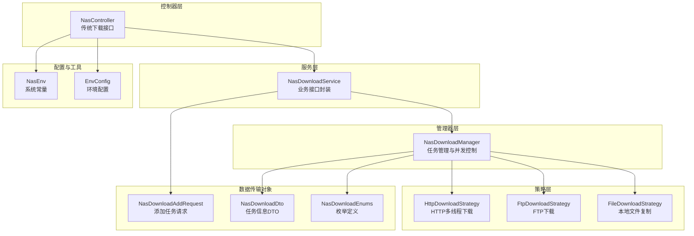
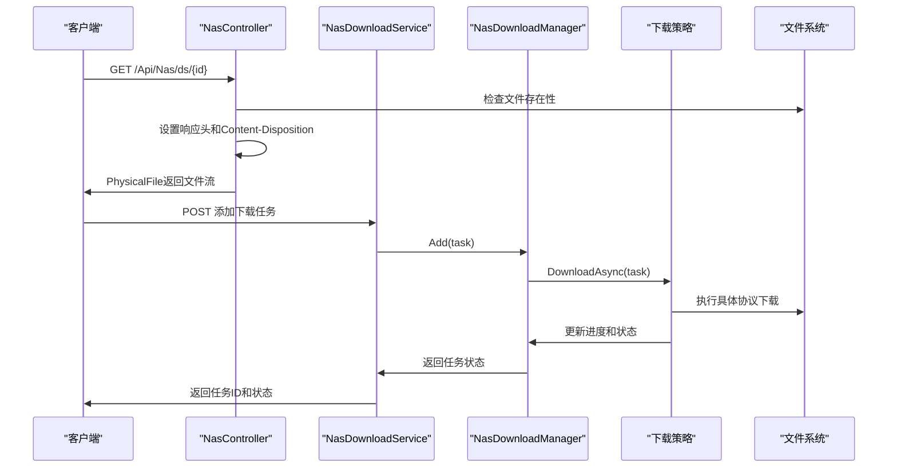
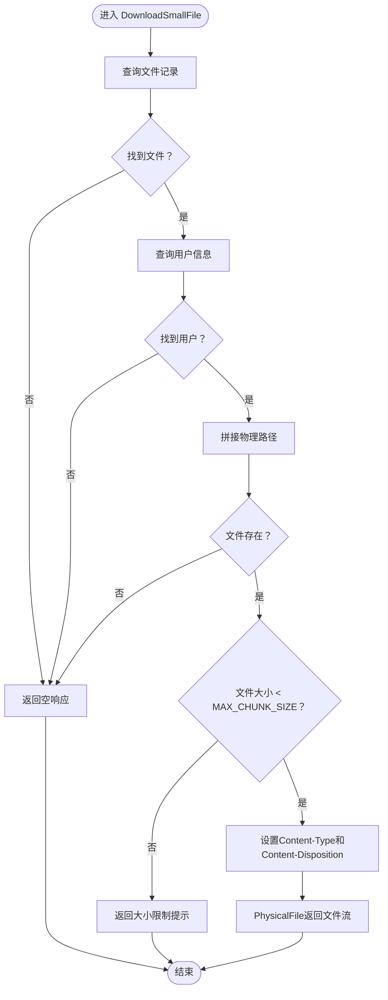
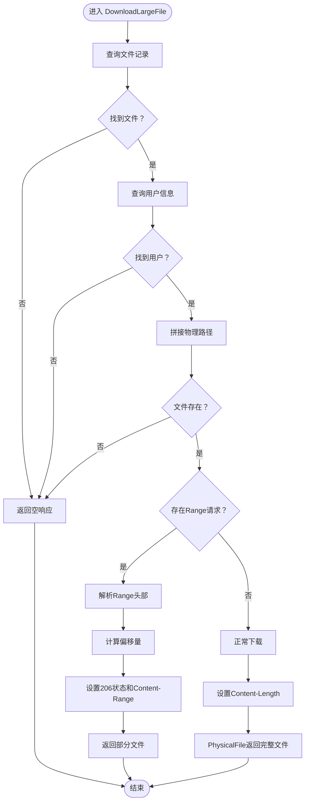
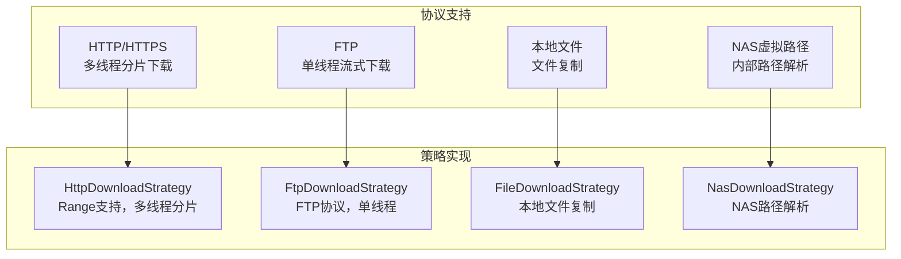
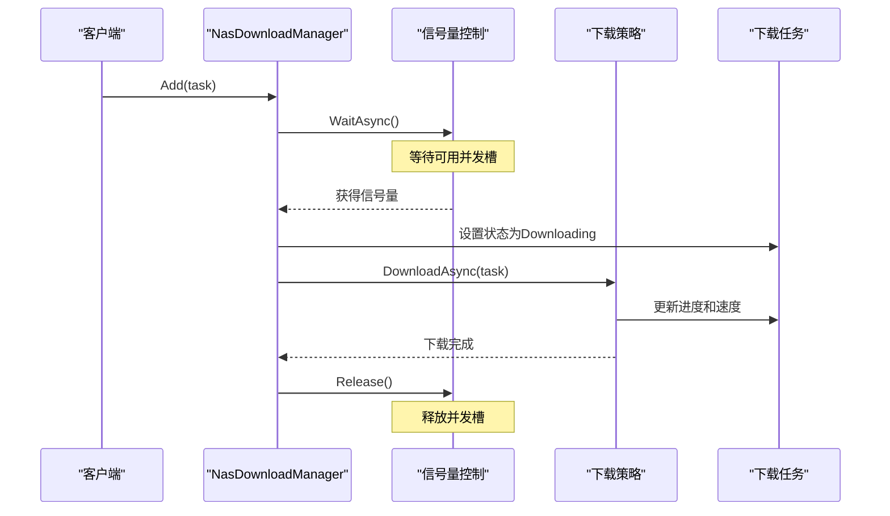
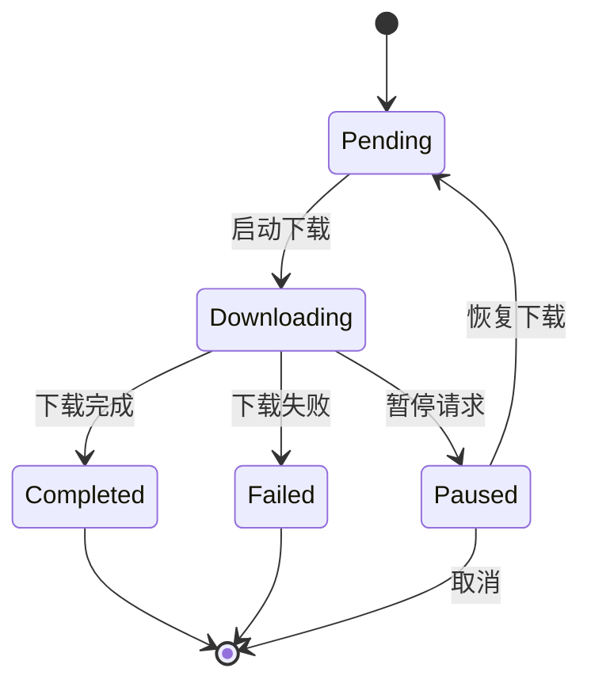
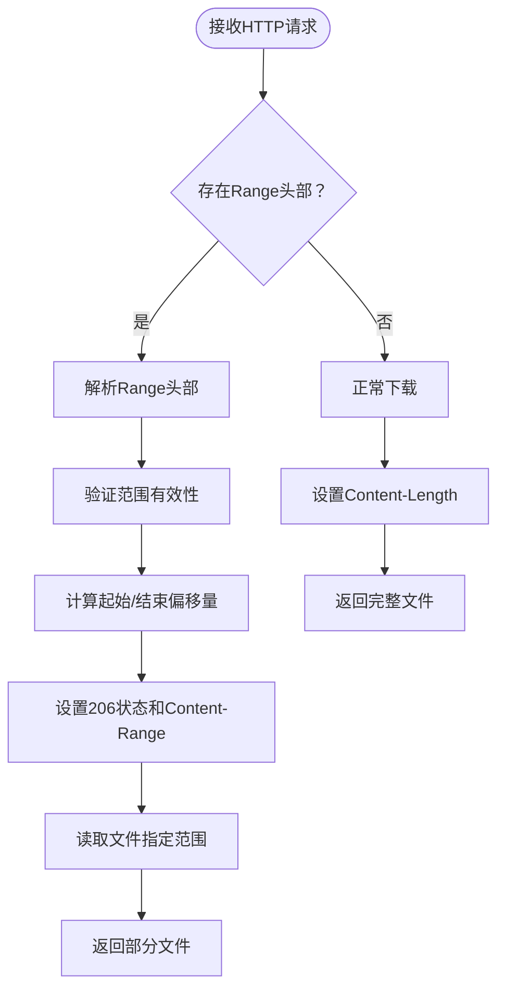
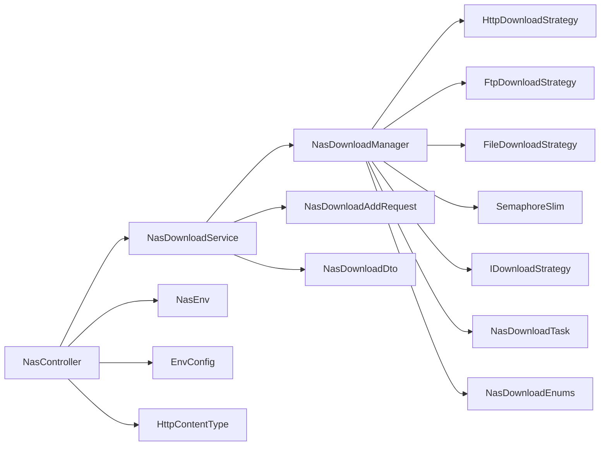

# 文件下载

<cite>
**本文引用的文件**
- [NasController.cs](file://Scm.Net/Controllers/NasController.cs)
- [NasDownloadManager.cs](file://Nas.Server/Download/NasDownloadManager.cs)
- [NasDownloadService.cs](file://Nas.Server/Download/NasDownloadService.cs)
- [HttpDownloadStrategy.cs](file://Nas.Server/Download/Strategy/HttpDownloadStrategy.cs)
- [FtpDownloadStrategy.cs](file://Nas.Server/Download/Strategy/FtpDownloadStrategy.cs)
- [FileDownloadStrategy.cs](file://Nas.Server/Download/Strategy/FileDownloadStrategy.cs)
- [NasDownloadTask.cs](file://Nas.Server/Download/NasDownloadTask.cs)
- [NasDownloadAddRequest.cs](file://Nas.Server/Download/Dvo/NasDownloadAddRequest.cs)
- [NasDownloadDto.cs](file://Nas.Dto/Download/NasDownloadDto.cs)
- [NasDownloadEnums.cs](file://Nas.Common/NasDownloadEnums.cs)
- [NasEnv.cs](file://Nas.Common/NasEnv.cs)
- [ScmDownloadRequest.cs](file://Scm.Common.Dto/ScmDownloadRequest.cs)
- [ScmDownloadResponse.cs](file://Scm.Common.Dto/ScmDownloadResponse.cs)
- [NasResFileDao.cs](file://Nas.Dao/Res/NasResFileDao.cs)
- [SyncResFileDao.cs](file://Nas.Dao/Sync/SyncResFileDao.cs)
- [EnvConfig.cs](file://Scm.Server/Config/EnvConfig.cs)
- [HttpContentType.cs](file://Scm.Common/Utils/HttpContentType.cs)
- [LogUtils.cs](file://Scm.Common/Utils/LogUtils.cs)
</cite>

## 更新摘要
**所做更改**
- 新增完整的NAS文件下载系统架构分析
- 添加多协议支持（HTTP/HTTPS、FTP、本地文件、NAS虚拟路径）实现细节
- 更新并发下载控制和智能进度跟踪机制
- 扩展断点续传功能的详细实现方案
- 增强文件下载API接口文档，包含新功能特性
- 更新架构图和流程图以反映新的下载系统

## 目录
1. [简介](#简介)
2. [项目结构](#项目结构)
3. [核心组件](#核心组件)
4. [架构总览](#架构总览)
5. [详细组件分析](#详细组件分析)
6. [多协议下载系统](#多协议下载系统)
7. [并发下载控制](#并发下载控制)
8. [智能进度跟踪](#智能进度跟踪)
9. [断点续传实现](#断点续传实现)
10. [API接口文档](#api接口文档)
11. [依赖关系分析](#依赖关系分析)
12. [性能考虑](#性能考虑)
13. [故障排查指南](#故障排查指南)
14. [结论](#结论)
15. [附录](#附录)

## 简介
本技术文档全面介绍系统中的"文件下载"能力，现已实现全新的NAS文件下载系统，涵盖以下核心功能：
- 多协议支持：HTTP/HTTPS、FTP、本地文件、NAS虚拟路径
- 并发下载控制：最大并发任务数限制和信号量控制
- 智能进度跟踪：实时速度计算、进度监控、状态管理
- 断点续传：HTTP Range请求处理、偏移量计算、部分响应生成
- 文件下载API：下载链接生成、文件信息获取、错误处理
- MIME类型检测、Content-Disposition头部设置、文件预览功能

系统包含传统的小文件下载接口和全新的NAS下载管理系统，为不同规模和类型的文件下载需求提供完整的解决方案。

## 项目结构
围绕NAS文件下载系统的关键目录与文件如下：
- 控制器层：NasController提供传统小文件下载和NAS下载管理接口
- 服务层：NasDownloadService封装下载管理器，提供业务接口
- 管理器层：NasDownloadManager负责任务生命周期管理和并发控制
- 策略层：多种下载策略实现不同协议支持
- 数据传输对象：DVO和DTO定义下载任务的数据结构
- 枚举定义：下载链接类型和状态枚举
- 配置与工具：EnvConfig提供NAS环境配置，NasEnv定义系统常量

**图表来源**
- [NasController.cs:32-469](file://Scm.Net/Controllers/NasController.cs#L32-L469)
- [NasDownloadService.cs:12-142](file://Nas.Server/Download/NasDownloadService.cs#L12-L142)
- [NasDownloadManager.cs:10-238](file://Nas.Server/Download/NasDownloadManager.cs#L10-L238)
- [HttpDownloadStrategy.cs:8-163](file://Nas.Server/Download/Strategy/HttpDownloadStrategy.cs#L8-L163)
- [FtpDownloadStrategy.cs:10-81](file://Nas.Server/Download/Strategy/FtpDownloadStrategy.cs#L10-L81)
- [FileDownloadStrategy.cs:7-50](file://Nas.Server/Download/Strategy/FileDownloadStrategy.cs#L7-L50)
- [NasDownloadAddRequest.cs:6-44](file://Nas.Server/Download/Dvo/NasDownloadAddRequest.cs#L6-L44)
- [NasDownloadDto.cs:9-78](file://Nas.Dto/Download/NasDownloadTaskDto.cs#L9-L78)
- [NasDownloadEnums.cs:8-74](file://Nas.Common/NasDownloadEnums.cs#L8-L74)
- [NasEnv.cs:3-222](file://Nas.Common/NasEnv.cs#L3-L222)

**章节来源**
- [NasController.cs:32-469](file://Scm.Net/Controllers/NasController.cs#L32-L469)
- [NasDownloadService.cs:12-142](file://Nas.Server/Download/NasDownloadService.cs#L12-L142)
- [NasDownloadManager.cs:10-238](file://Nas.Server/Download/NasDownloadManager.cs#L10-L238)

## 核心组件
- **NasController**：提供传统小文件下载接口（/Api/Nas/ds/{id}）和NAS下载管理接口，支持文件信息获取、文件查看、断点续传等功能
- **NasDownloadService**：封装下载管理器，提供添加下载任务、暂停、恢复、删除、查询等业务接口
- **NasDownloadManager**：核心下载管理器，负责任务生命周期管理、并发控制、策略分发
- **下载策略**：HTTP多线程分片下载、FTP单线程流式下载、本地文件复制策略
- **下载任务模型**：NasDownloadTask定义任务的完整运行时状态和属性
- **数据传输对象**：NasDownloadAddRequest和NasDownloadDto定义请求和响应的数据结构
- **枚举定义**：NasDownloadLinkType和NasDownloadStatus定义下载链接类型和任务状态
- **环境配置**：NasEnv定义NAS系统的各种常量和路径配置

**章节来源**
- [NasController.cs:164-296](file://Scm.Net/Controllers/NasController.cs#L164-L296)
- [NasDownloadService.cs:12-142](file://Nas.Server/Download/NasDownloadService.cs#L12-L142)
- [NasDownloadManager.cs:10-238](file://Nas.Server/Download/NasDownloadManager.cs#L10-L238)
- [NasDownloadTask.cs:6-130](file://Nas.Server/Download/NasDownloadTask.cs#L6-L130)

## 架构总览
NAS文件下载系统采用分层架构设计，整体调用链如下：

**图表来源**
- [NasController.cs:164-296](file://Scm.Net/Controllers/NasController.cs#L164-L296)
- [NasDownloadService.cs:31-60](file://Nas.Server/Download/NasDownloadService.cs#L31-L60)
- [NasDownloadManager.cs:50-83](file://Nas.Server/Download/NasDownloadManager.cs#L50-L83)

## 详细组件分析

### 传统小文件下载实现（NasController）
- **入口路由**：GET /Api/Nas/ds/{id}
- **功能特性**：
  - 支持小文件直接下载（超过MAX_CHUNK_SIZE的文件拒绝下载）
  - 自动检测文件MIME类型
  - 设置Content-Disposition为附件下载
  - 支持文件预览（/Api/Nas/vs/{id}）
- **流程要点**：
  - 查询文件记录和用户信息
  - 拼接物理文件路径
  - 校验文件存在性和大小限制
  - 设置Content-Type和Content-Disposition
  - 使用PhysicalFile返回文件流

**图表来源**
- [NasController.cs:164-212](file://Scm.Net/Controllers/NasController.cs#L164-L212)
- [NasEnv.cs:48](file://Nas.Common/NasEnv.cs#L48)

**章节来源**
- [NasController.cs:164-212](file://Scm.Net/Controllers/NasController.cs#L164-L212)

### 大文件下载与断点续传（NasController）
- **入口路由**：GET /Api/Nas/dl/{id}
- **功能特性**：
  - 支持HTTP Range请求处理
  - 实现断点续传功能
  - 部分响应生成
  - Content-Range头部设置
- **流程要点**：
  - 解析Range头部
  - 计算起始和结束偏移量
  - 设置206 Partial Content状态
  - 返回指定范围的文件片段

**图表来源**
- [NasController.cs:221-296](file://Scm.Net/Controllers/NasController.cs#L221-L296)

**章节来源**
- [NasController.cs:221-296](file://Scm.Net/Controllers/NasController.cs#L221-L296)

### 文件信息获取与预览（NasController）
- **文件信息接口**：GET /Api/Nas/info/{id}
- **文件预览接口**：GET /Api/Nas/vs/{id}
- **功能特性**：
  - 获取文件详细信息（名称、路径、大小、哈希）
  - 支持文本和代码文件的在线预览
  - 自动MIME类型检测
  - Content-Disposition设置

**章节来源**
- [NasController.cs:50-154](file://Scm.Net/Controllers/NasController.cs#L50-L154)

## 多协议下载系统

### 协议支持概览
NAS下载系统支持四种主要协议，每种协议都有专门的下载策略实现：

**图表来源**
- [HttpDownloadStrategy.cs:8-163](file://Nas.Server/Download/Strategy/HttpDownloadStrategy.cs#L8-L163)
- [FtpDownloadStrategy.cs:10-81](file://Nas.Server/Download/Strategy/FtpDownloadStrategy.cs#L10-L81)
- [FileDownloadStrategy.cs:7-50](file://Nas.Server/Download/Strategy/FileDownloadStrategy.cs#L7-L50)

### HTTP多线程分片下载
- **核心特性**：
  - 自动探测文件大小和Range支持
  - 多线程分片并发下载
  - 分片文件合并
  - 智能线程数控制（1-16线程）
- **实现原理**：
  - 使用HEAD请求探测Range支持
  - 计算分片大小和偏移量
  - 并发下载各分片到临时文件
  - 合并临时文件为完整文件

**章节来源**
- [HttpDownloadStrategy.cs:21-163](file://Nas.Server/Download/Strategy/HttpDownloadStrategy.cs#L21-L163)

### FTP单线程流式下载
- **核心特性**：
  - 支持匿名和账号密码认证
  - 单线程流式下载
  - FTP被动模式连接
  - 自动文件大小获取
- **实现原理**：
  - 使用FtpWebRequest执行FTP操作
  - 支持GetFileSize和DownloadFile命令
  - 异步流式读取和写入

**章节来源**
- [FtpDownloadStrategy.cs:14-81](file://Nas.Server/Download/Strategy/FtpDownloadStrategy.cs#L14-L81)

### 本地文件复制下载
- **核心特性**：
  - 支持file://前缀和绝对路径
  - 异步文件复制
  - 源文件存在性验证
  - 流式读写优化
- **实现原理**：
  - 规范化源路径（去除file://前缀）
  - 验证源文件存在性
  - 异步复制到目标目录

**章节来源**
- [FileDownloadStrategy.cs:11-50](file://Nas.Server/Download/Strategy/FileDownloadStrategy.cs#L11-L50)

## 并发下载控制

### 信号量控制机制
NasDownloadManager使用SemaphoreSlim实现并发下载控制：

**图表来源**
- [NasDownloadManager.cs:121-167](file://Nas.Server/Download/NasDownloadManager.cs#L121-L167)

### 并发配置与管理
- **最大并发数**：默认3个并发任务，可通过MaxConcurrent属性配置
- **任务生命周期**：Pending → Downloading → Completed/Failed/Cancelled
- **暂停恢复机制**：支持任务暂停和恢复
- **清理机制**：自动清理临时分片文件

**章节来源**
- [NasDownloadManager.cs:15](file://Nas.Server/Download/NasDownloadManager.cs#L15)
- [NasDownloadManager.cs:50-83](file://Nas.Server/Download/NasDownloadManager.cs#L50-L83)

## 智能进度跟踪

### 进度计算与速度监控
NasDownloadTask提供完整的进度跟踪功能：

**图表来源**
- [NasDownloadTask.cs:101-127](file://Nas.Server/Download/NasDownloadTask.cs#L101-L127)

### 速度计算机制
- **快照机制**：每秒计算一次速度
- **时间戳记录**：记录速度计算的时间点
- **字节计数**：记录速度计算的字节数
- **实时更新**：通过UpdateSpeed()方法计算当前速度

**章节来源**
- [NasDownloadTask.cs:117-127](file://Nas.Server/Download/NasDownloadTask.cs#L117-L127)

## 断点续传实现

### HTTP Range请求处理
NasController实现完整的断点续传功能：

**图表来源**
- [NasController.cs:257-291](file://Scm.Net/Controllers/NasController.cs#L257-L291)

### 偏移量计算与边界处理
- **起始偏移量**：从0开始计算
- **结束偏移量**：包含该字节（end = length - 1）
- **范围验证**：确保不越界
- **Content-Range格式**：bytes start-end/length

**章节来源**
- [NasController.cs:257-291](file://Scm.Net/Controllers/NasController.cs#L257-L291)

## API接口文档

### 传统下载接口
- **小文件下载**：GET /Api/Nas/ds/{id}
  - 功能：下载小于MAX_CHUNK_SIZE的文件
  - 响应：PhysicalFile返回文件流
  - 头部：Content-Disposition: attachment
- **大文件下载**：GET /Api/Nas/dl/{id}
  - 功能：支持断点续传的大文件下载
  - 响应：支持206 Partial Content状态
  - 头部：Content-Range、Accept-Ranges

### NAS下载管理接口
- **添加下载任务**：POST /Api/Nas/download/add
  - 请求体：NasDownloadAddRequest
  - 响应：任务ID
- **暂停下载任务**：POST /Api/Nas/download/pause/{taskId}
- **恢复下载任务**：POST /Api/Nas/download/resume/{taskId}
- **删除下载任务**：POST /Api/Nas/download/remove/{taskId}
- **获取任务列表**：GET /Api/Nas/download/list

### 文件信息接口
- **获取文件信息**：GET /Api/Nas/info/{id}
  - 响应：ScmFileDto（name、path、size、hash）
- **文件预览**：GET /Api/Nas/vs/{id}
  - 功能：支持文本和代码文件在线预览

**章节来源**
- [NasController.cs:50-296](file://Scm.Net/Controllers/NasController.cs#L50-L296)
- [NasDownloadService.cs:31-110](file://Nas.Server/Download/NasDownloadService.cs#L31-L110)

## 依赖关系分析
NAS下载系统的核心依赖关系如下：

**图表来源**
- [NasController.cs:39-43](file://Scm.Net/Controllers/NasController.cs#L39-L43)
- [NasDownloadService.cs:14-26](file://Nas.Server/Download/NasDownloadService.cs#L14-L26)
- [NasDownloadManager.cs:17-44](file://Nas.Server/Download/NasDownloadManager.cs#L17-L44)

**章节来源**
- [NasController.cs:39-43](file://Scm.Net/Controllers/NasController.cs#L39-L43)
- [NasDownloadService.cs:14-26](file://Nas.Server/Download/NasDownloadService.cs#L14-L26)
- [NasDownloadManager.cs:17-44](file://Nas.Server/Download/NasDownloadManager.cs#L17-L44)

## 性能考虑
- **并发控制**：使用信号量限制最大并发下载任务数
- **内存优化**：流式读写，避免大文件加载到内存
- **网络优化**：HTTP多线程分片下载，提高下载速度
- **磁盘I/O优化**：异步文件操作，使用缓冲区优化
- **连接池管理**：HttpClient复用，减少连接开销
- **进度计算优化**：定期计算速度，避免频繁计算

## 故障排查指南
- **下载失败**：检查任务状态和错误信息，查看日志输出
- **并发问题**：调整MaxConcurrent参数，监控系统资源
- **断点续传失败**：验证Range头部格式，检查文件完整性
- **协议不支持**：确认URL格式和协议类型，检查网络连接
- **文件不存在**：验证文件路径和权限，检查NAS存储状态

## 结论
NAS文件下载系统提供了完整的多协议下载解决方案，包含：
- 传统小文件下载接口和断点续传功能
- 全新的NAS下载管理系统，支持多协议和并发控制
- 智能进度跟踪和状态管理
- 完善的错误处理和故障恢复机制
- 良好的性能优化和资源管理

系统架构清晰，功能完整，能够满足不同规模和类型的文件下载需求。

## 附录

### 下载策略对比表
| 策略类型 | 协议支持 | 并发支持 | Range支持 | 特殊功能 |
|---------|---------|---------|----------|----------|
| HttpDownloadStrategy | HTTP/HTTPS | 多线程分片 | 是 | 自适应线程数 |
| FtpDownloadStrategy | FTP | 单线程 | 否 | 认证支持 |
| FileDownloadStrategy | 本地文件 | 单线程 | 否 | 路径规范化 |

### 配置参数说明
- **MaxConcurrent**：最大并发下载任务数（默认3）
- **Threads**：HTTP下载线程数（1-16，默认4）
- **MAX_CHUNK_SIZE**：小文件大小限制（5MB）
- **VirtualTag**：NAS虚拟路径标识（nas:/）

### 扩展建议
- 添加更多下载协议支持（如SFTP、WebDAV）
- 实现下载任务队列和优先级管理
- 增加下载历史和统计功能
- 优化断点续传的可靠性机制
- 添加下载加速和代理支持