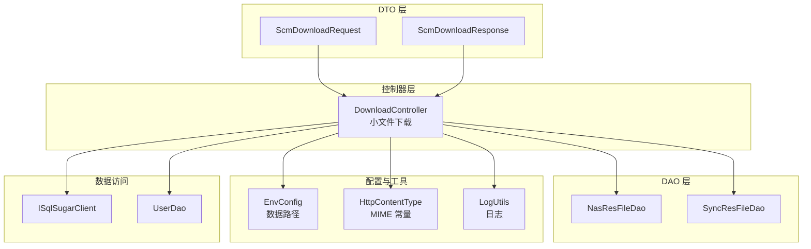
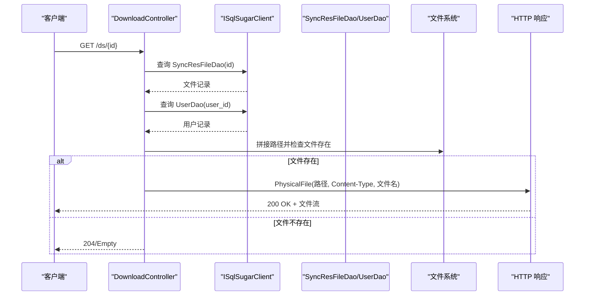
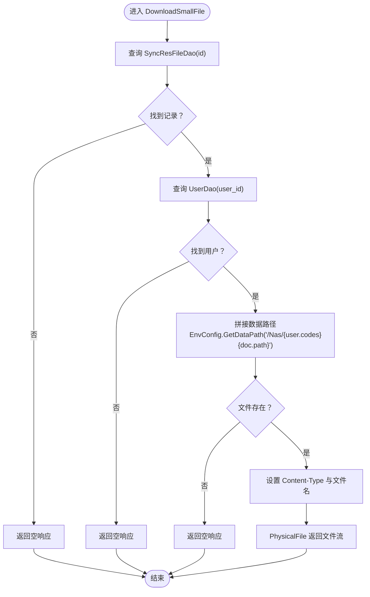
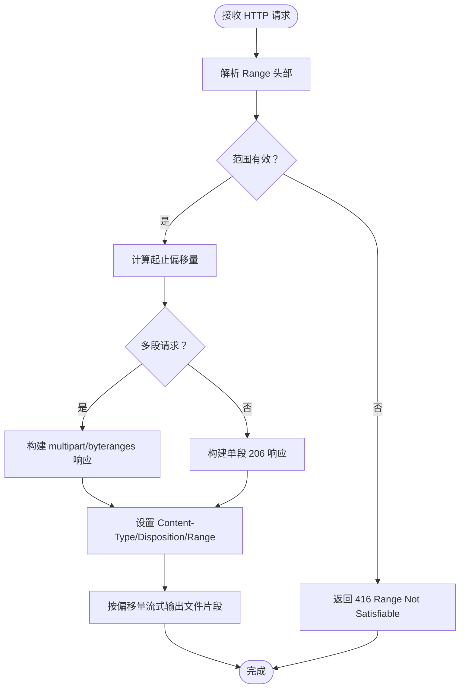
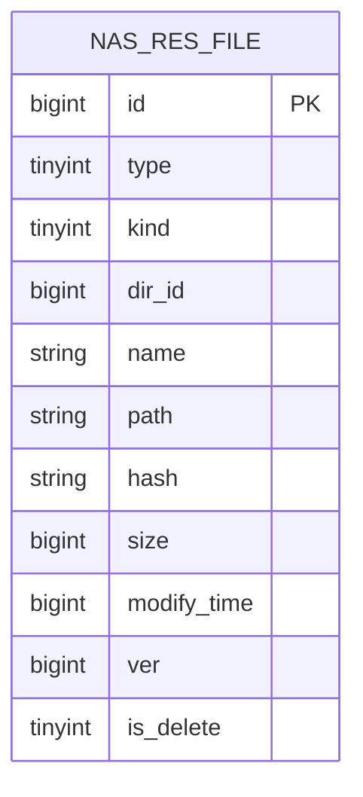
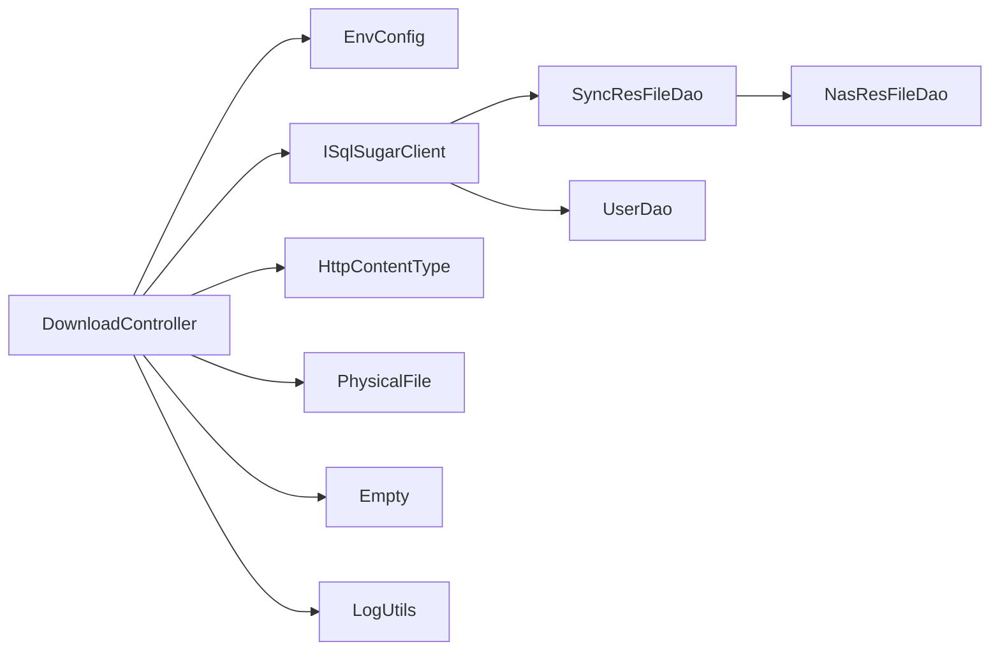

# 文件下载

<cite>
**本文引用的文件**
- [DownloadController.cs](file://Scm.Net/Controllers/DownloadController.cs)
- [ScmDownloadRequest.cs](file://Scm.Common.Dto/ScmDownloadRequest.cs)
- [ScmDownloadResponse.cs](file://Scm.Common.Dto/ScmDownloadResponse.cs)
- [SyncResFileDao.cs](file://Nas.Dao/Sync/SyncResFileDao.cs)
- [NasResFileDao.cs](file://Nas.Dao/Res/NasResFileDao.cs)
- [EnvConfig.cs](file://Scm.Server/Config/EnvConfig.cs)
- [HttpContentType.cs](file://Scm.Common/Utils/HttpContentType.cs)
- [PhysicalFile](file://Scm.Net/Controllers/DownloadController.cs)
- [Empty](file://Scm.Net/Controllers/DownloadController.cs)
- [LogUtils.cs](file://Scm.Common/Utils/LogUtils.cs)
- [ISqlSugarClient](file://Scm.Net/Controllers/DownloadController.cs)
- [UserDao](file://Scm.Net/Controllers/DownloadController.cs)
</cite>

## 目录
1. [简介](#简介)
2. [项目结构](#项目结构)
3. [核心组件](#核心组件)
4. [架构总览](#架构总览)
5. [详细组件分析](#详细组件分析)
6. [依赖关系分析](#依赖关系分析)
7. [性能考虑](#性能考虑)
8. [故障排查指南](#故障排查指南)
9. [结论](#结论)
10. [附录](#附录)

## 简介
本技术文档聚焦于系统中的“文件下载”能力，覆盖以下主题：
- 小文件下载与大文件下载的实现差异
- 小文件下载：基于物理文件的直接返回
- 大文件下载：断点续传支持（HTTP Range 请求处理、偏移量计算、部分响应生成）
- 下载 API 接口定义：下载链接生成、文件信息获取、错误处理
- MIME 类型检测、Content-Disposition 头部设置、文件预览原理
- 数据模型与 DAO 层对文件元数据的支持

当前仓库中已实现小文件下载接口，但未发现针对大文件断点续传的专用控制器或服务。本文在现有实现基础上，给出断点续传的完整设计建议与流程图示。

## 项目结构
围绕下载功能的关键目录与文件如下：
- 控制器层：DownloadController 提供小文件下载入口
- DTO 层：ScmDownloadRequest/ScmDownloadResponse 描述下载请求与响应字段
- DAO 层：NasResFileDao、SyncResFileDao 存储文件元数据（名称、路径、大小、哈希等）
- 配置与工具：EnvConfig 提供数据存储根路径；HttpContentType 提供 MIME 类型常量；LogUtils 提供日志记录
- 数据访问：ISqlSugarClient 用于查询文件与用户信息

图表来源
- [DownloadController.cs:13-67](file://Scm.Net/Controllers/DownloadController.cs#L13-L67)
- [ScmDownloadRequest.cs:5-7](file://Scm.Common.Dto/ScmDownloadRequest.cs#L5-L7)
- [ScmDownloadResponse.cs:5-26](file://Scm.Common.Dto/ScmDownloadResponse.cs#L5-L26)
- [NasResFileDao.cs:13-70](file://Nas.Dao/Res/NasResFileDao.cs#L13-L70)
- [SyncResFileDao.cs:13-76](file://Nas.Dao/Sync/SyncResFileDao.cs#L13-L76)
- [EnvConfig.cs](file://Scm.Server/Config/EnvConfig.cs)
- [HttpContentType.cs](file://Scm.Common/Utils/HttpContentType.cs)

章节来源
- [DownloadController.cs:13-67](file://Scm.Net/Controllers/DownloadController.cs#L13-L67)
- [ScmDownloadRequest.cs:5-7](file://Scm.Common.Dto/ScmDownloadRequest.cs#L5-L7)
- [ScmDownloadResponse.cs:5-26](file://Scm.Common.Dto/ScmDownloadResponse.cs#L5-L26)
- [NasResFileDao.cs:13-70](file://Nas.Dao/Res/NasResFileDao.cs#L13-L70)
- [SyncResFileDao.cs:13-76](file://Nas.Dao/Sync/SyncResFileDao.cs#L13-L76)

## 核心组件
- DownloadController：提供小文件下载接口，通过物理文件方式返回内容，设置 Content-Type 与 Content-Disposition（文件名），并进行存在性校验与权限关联（用户编码拼接路径）。
- ScmDownloadRequest/ScmDownloadResponse：定义下载请求与响应的基本字段（如 size、hash、name、path）。
- DAO 层文件模型：NasResFileDao、SyncResFileDao 提供文件元数据（名称、路径、大小、哈希、修改时间等），支撑下载信息展示与断点续传的元数据需求。
- EnvConfig：提供数据存储根路径，用于定位实际文件物理路径。
- HttpContentType：提供标准 MIME 类型常量，用于设置响应的 Content-Type。
- 日志与空响应：使用 LogUtils 记录调试信息，使用 Empty 表示资源不存在时的空响应。

章节来源
- [DownloadController.cs:31-67](file://Scm.Net/Controllers/DownloadController.cs#L31-L67)
- [ScmDownloadRequest.cs:5-7](file://Scm.Common.Dto/ScmDownloadRequest.cs#L5-L7)
- [ScmDownloadResponse.cs:10-25](file://Scm.Common.Dto/ScmDownloadResponse.cs#L10-L25)
- [NasResFileDao.cs:40-65](file://Nas.Dao/Res/NasResFileDao.cs#L40-L65)
- [SyncResFileDao.cs:40-65](file://Nas.Dao/Sync/SyncResFileDao.cs#L40-L65)
- [EnvConfig.cs](file://Scm.Server/Config/EnvConfig.cs)
- [HttpContentType.cs](file://Scm.Common/Utils/HttpContentType.cs)
- [LogUtils.cs](file://Scm.Common/Utils/LogUtils.cs)

## 架构总览
小文件下载的整体调用链如下：

图表来源
- [DownloadController.cs:31-67](file://Scm.Net/Controllers/DownloadController.cs#L31-L67)
- [ISqlSugarClient](file://Scm.Net/Controllers/DownloadController.cs)
- [SyncResFileDao.cs:13-76](file://Nas.Dao/Sync/SyncResFileDao.cs#L13-L76)
- [UserDao](file://Scm.Net/Controllers/DownloadController.cs)

## 详细组件分析

### 小文件下载实现（DownloadController）
- 入口路由：GET /ds/{id}
- 流程要点：
  - 通过 ISqlSugarClient 查询 SyncResFileDao 记录，若不存在返回空响应
  - 通过 ISqlSugarClient 查询 UserDao，拼接用户编码到数据路径，形成最终物理路径
  - 校验文件是否存在，不存在则返回空响应
  - 设置 Content-Type 为二进制流类型（octet-stream）
  - 使用 PhysicalFile 返回物理文件，第三个参数为下载时显示的文件名
- 错误处理：当文件不存在或用户不存在时，返回空响应
- 日志记录：在方法开始处记录调试日志

图表来源
- [DownloadController.cs:31-67](file://Scm.Net/Controllers/DownloadController.cs#L31-L67)
- [EnvConfig.cs](file://Scm.Server/Config/EnvConfig.cs)
- [HttpContentType.cs](file://Scm.Common/Utils/HttpContentType.cs)

章节来源
- [DownloadController.cs:31-67](file://Scm.Net/Controllers/DownloadController.cs#L31-L67)

### 断点续传（大文件下载）设计建议
当前仓库未提供断点续传的控制器或服务。以下为断点续传的完整设计与实现建议，便于后续扩展。

- HTTP Range 请求处理
  - 解析 Range 头部，支持单段或多段范围
  - 计算起始偏移量与结束偏移量，确保不越界
  - 对于多段请求，返回 multipart/byteranges 响应
- 偏移量计算
  - 起始偏移量：从 0 开始计数
  - 结束偏移量：包含该字节（即 end = length - 1）
  - 若 end 为空，则默认为文件末尾
- 部分响应生成
  - 单段：返回 206 Partial Content，设置 Content-Range 与 Accept-Ranges
  - 多段：返回 206 Partial Content，设置 Content-Type 为 multipart/byteranges
- MIME 类型与 Content-Disposition
  - MIME 类型：根据文件扩展名或数据库字段动态判断
  - Content-Disposition：根据是否预览决定 inline 或 attachment
- 错误处理
  - Range 越界：返回 416 Range Not Satisfiable
  - 文件不存在：返回 404
  - 不支持 Range 的文件：返回 200 并忽略 Range

图表来源
- [DownloadController.cs:31-67](file://Scm.Net/Controllers/DownloadController.cs#L31-L67)
- [NasResFileDao.cs:58-65](file://Nas.Dao/Res/NasResFileDao.cs#L58-L65)
- [SyncResFileDao.cs:64-65](file://Nas.Dao/Sync/SyncResFileDao.cs#L64-L65)

章节来源
- [NasResFileDao.cs:58-65](file://Nas.Dao/Res/NasResFileDao.cs#L58-L65)
- [SyncResFileDao.cs:64-65](file://Nas.Dao/Sync/SyncResFileDao.cs#L64-L65)

### 文件元数据与模型
- NAS 文件模型（NasResFileDao/SyncResFileDao）
  - 字段：type、kind、dir_id、name、path、hash、size、modify_time、ver、is_delete 等
  - 用途：下载信息展示（大小、哈希、名称）、断点续传元数据（size、modify_time）

图表来源
- [NasResFileDao.cs:13-70](file://Nas.Dao/Res/NasResFileDao.cs#L13-L70)
- [SyncResFileDao.cs:13-76](file://Nas.Dao/Sync/SyncResFileDao.cs#L13-L76)

章节来源
- [NasResFileDao.cs:13-70](file://Nas.Dao/Res/NasResFileDao.cs#L13-L70)
- [SyncResFileDao.cs:13-76](file://Nas.Dao/Sync/SyncResFileDao.cs#L13-L76)

### MIME 类型检测与 Content-Disposition
- MIME 类型
  - 当前实现使用二进制流类型常量
  - 建议：根据文件扩展名或数据库字段动态选择 MIME 类型
- Content-Disposition
  - 当前注释掉设置为附件下载
  - 建议：根据业务需要设置为 inline（预览）或 attachment（下载）

章节来源
- [DownloadController.cs:60-66](file://Scm.Net/Controllers/DownloadController.cs#L60-L66)
- [HttpContentType.cs](file://Scm.Common/Utils/HttpContentType.cs)

### API 接口文档（小文件下载）
- 路由：GET /ds/{id}
- 功能：根据文件标识返回物理文件
- 请求参数
  - id：文件标识（长整型）
- 响应
  - 200 OK + 文件流：成功返回文件内容
  - 204/空：文件不存在或用户不存在
- 响应头
  - Content-Type：二进制流类型
  - Content-Disposition：下载时显示的文件名（当前实现已预留设置位置）
- 错误处理
  - 文件不存在：返回空响应
  - 用户不存在：返回空响应
- 日志
  - 方法开始记录调试日志

章节来源
- [DownloadController.cs:31-67](file://Scm.Net/Controllers/DownloadController.cs#L31-L67)
- [LogUtils.cs](file://Scm.Common/Utils/LogUtils.cs)

## 依赖关系分析
- DownloadController 依赖
  - EnvConfig：获取数据根路径
  - ISqlSugarClient：查询文件与用户记录
  - HttpContentType：设置 Content-Type
  - PhysicalFile/Empty：返回文件流或空响应
  - LogUtils：记录调试日志
- DAO 层
  - SyncResFileDao/NasResFileDao：提供文件元数据（name、path、size、hash、modify_time）
- 用户层
  - UserDao：用于拼接用户编码到路径，实现按用户隔离的数据目录

图表来源
- [DownloadController.cs:18-22](file://Scm.Net/Controllers/DownloadController.cs#L18-L22)
- [EnvConfig.cs](file://Scm.Server/Config/EnvConfig.cs)
- [HttpContentType.cs](file://Scm.Common/Utils/HttpContentType.cs)
- [SyncResFileDao.cs:13-76](file://Nas.Dao/Sync/SyncResFileDao.cs#L13-L76)
- [NasResFileDao.cs:13-70](file://Nas.Dao/Res/NasResFileDao.cs#L13-L70)

章节来源
- [DownloadController.cs:18-22](file://Scm.Net/Controllers/DownloadController.cs#L18-L22)

## 性能考虑
- 小文件下载
  - 使用 PhysicalFile 直接返回物理文件，避免额外内存拷贝
  - 建议：启用服务器端压缩（如 Gzip/Brotli）以降低带宽占用
- 大文件下载（断点续传）
  - 流式读取：按 Range 分片读取，减少内存占用
  - 多段合并：对于多段请求，采用分块写入与边界标记
  - 缓存策略：结合 ETag/Last-Modified 实现条件请求缓存
- 数据库查询
  - 合理索引：对 id、user_id、path 等字段建立索引
  - 减少字段：仅查询必要字段，避免 SELECT *
- IO 优化
  - 异步 IO：使用异步文件读取 API
  - 文件系统：使用高性能存储与合适的文件系统参数

## 故障排查指南
- 204/空响应
  - 可能原因：文件不存在、用户不存在、路径拼接错误
  - 排查步骤：确认 id 是否正确、用户编码是否有效、文件路径是否拼接正确
- 404/416
  - 可能原因：文件被删除、Range 越界
  - 排查步骤：检查文件大小与 Range 范围、确认文件未被删除
- MIME 类型异常
  - 可能原因：Content-Type 固定为二进制流
  - 排查步骤：根据扩展名或数据库字段动态设置 MIME 类型
- 预览问题
  - 可能原因：Content-Disposition 设置为附件
  - 排查步骤：根据业务场景调整为 inline 或 attachment

章节来源
- [DownloadController.cs:38-58](file://Scm.Net/Controllers/DownloadController.cs#L38-L58)

## 结论
- 小文件下载已在 DownloadController 中实现，具备基本的路径拼接、存在性校验与物理文件返回能力
- 大文件断点续传尚未实现，建议基于现有 DAO 元数据与 EnvConfig 路径，扩展 Range 处理与流式输出逻辑
- 建议完善 MIME 类型检测与 Content-Disposition 设置，以满足预览与下载的差异化需求
- 后续可引入缓存与压缩策略，进一步提升下载性能与用户体验

## 附录
- 扩展建议
  - 新增断点续传控制器：支持 Range 请求与多段响应
  - 动态 MIME 类型：根据扩展名或数据库字段设置 Content-Type
  - Content-Disposition：根据业务场景设置 inline/attachment
  - 权限校验：结合用户与文件访问控制，确保安全下载