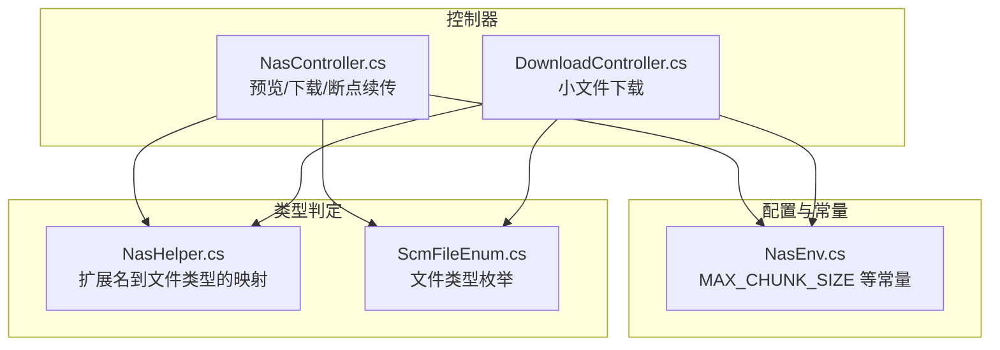
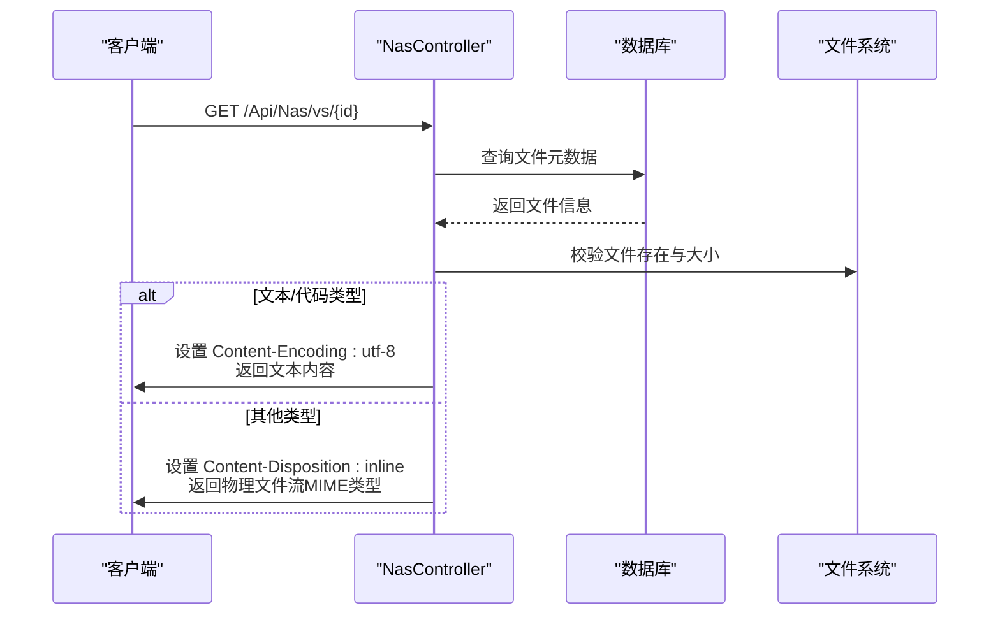
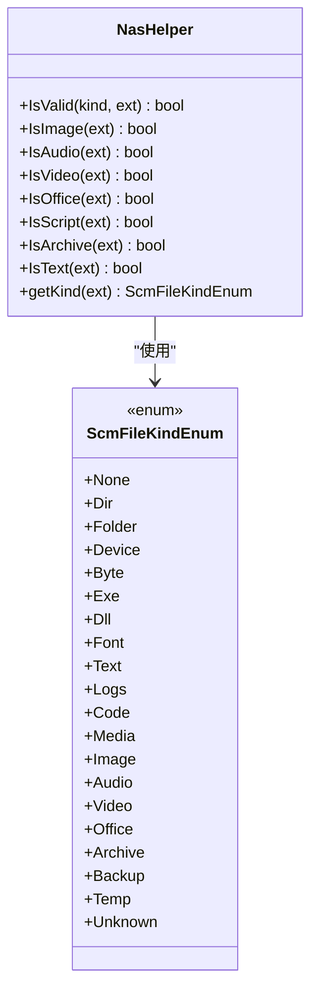
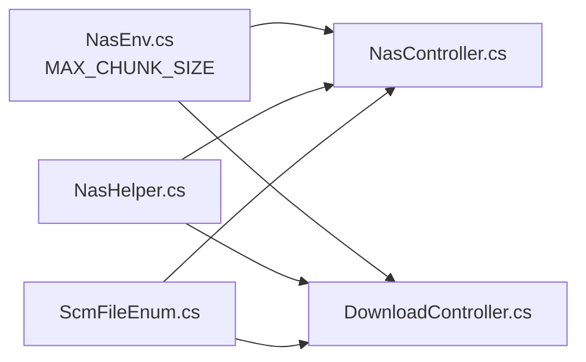

# 文件预览

<cite>
**本文引用的文件**   
- [NasController.cs](file://Scm.Net/Controllers/NasController.cs)
- [DownloadController.cs](file://Scm.Net/Controllers/DownloadController.cs)
- [NasEnv.cs](file://Nas.Common/NasEnv.cs)
- [NasHelper.cs](file://Nas.Server/NasHelper.cs)
- [ScmFileEnum.cs](file://Scm.Common/Enums/ScmFileEnum.cs)
</cite>

## 目录
1. [简介](#简介)
2. [项目结构](#项目结构)
3. [核心组件](#核心组件)
4. [架构总览](#架构总览)
5. [详细组件分析](#详细组件分析)
6. [依赖关系分析](#依赖关系分析)
7. [性能与安全考量](#性能与安全考量)
8. [故障排查指南](#故障排查指南)
9. [结论](#结论)
10. [附录：API 接口与使用示例](#附录api-接口与使用示例)

## 简介
本文件面向“文件预览”能力，系统化阐述 Scm.Net 中的实现机制与使用方式，重点覆盖以下方面：
- 文件类型检测：对文本文件与代码文件进行特殊处理，以确保在浏览器中正确渲染与高亮显示
- 文件大小限制：超过阈值的文件无法预览，防止资源占用过高
- MIME 类型自动识别：通过 MIME 工具获取文件类型，保障浏览器正确解析
- 预览模式下的 HTTP 响应头：inline 模式、字符编码、文件内容读取策略
- API 接口定义与调用示例：预览、下载、断点续传等
- 安全限制与性能优化策略：范围请求、字符集、文件类型白名单等

## 项目结构
围绕文件预览的相关模块主要位于以下位置：
- 控制器层：提供预览、下载、断点续传等接口
- 配置与常量：统一的文件大小阈值与服务端路由
- 文件类型判定：基于扩展名的文件类型映射表
- 枚举：文件类型枚举，用于区分文本/代码/图像/音视频/办公/归档等

**图表来源**
- [NasController.cs:92-155](file://Scm.Net/Controllers/NasController.cs#L92-L155)
- [DownloadController.cs:24-67](file://Scm.Net/Controllers/DownloadController.cs#L24-L67)
- [NasEnv.cs:48-48](file://Nas.Common/NasEnv.cs#L48-L48)
- [NasHelper.cs:7-31](file://Nas.Server/NasHelper.cs#L7-L31)
- [ScmFileEnum.cs:20-77](file://Scm.Common/Enums/ScmFileEnum.cs#L20-L77)

**章节来源**
- [NasController.cs:92-155](file://Scm.Net/Controllers/NasController.cs#L92-L155)
- [DownloadController.cs:24-67](file://Scm.Net/Controllers/DownloadController.cs#L24-L67)
- [NasEnv.cs:48-48](file://Nas.Common/NasEnv.cs#L48-L48)
- [NasHelper.cs:7-31](file://Nas.Server/NasHelper.cs#L7-L31)
- [ScmFileEnum.cs:20-77](file://Scm.Common/Enums/ScmFileEnum.cs#L20-L77)

## 核心组件
- 预览控制器（NasController.ViewSmallFile）：负责根据文件类型与大小返回预览内容或物理文件流
- 下载控制器（DownloadController.DownloadSmallFile）：负责小文件下载
- 配置常量（NasEnv）：包含最大分片大小阈值，用于判断是否允许预览/下载
- 文件类型判定（NasHelper）：提供扩展名到文件类型的映射，辅助识别文本/代码/图像/音视频/办公/归档等
- 文件类型枚举（ScmFileEnum）：统一的文件类型定义，便于前后端约定

**章节来源**
- [NasController.cs:92-155](file://Scm.Net/Controllers/NasController.cs#L92-L155)
- [DownloadController.cs:24-67](file://Scm.Net/Controllers/DownloadController.cs#L24-L67)
- [NasEnv.cs:48-48](file://Nas.Common/NasEnv.cs#L48-L48)
- [NasHelper.cs:7-31](file://Nas.Server/NasHelper.cs#L7-L31)
- [ScmFileEnum.cs:20-77](file://Scm.Common/Enums/ScmFileEnum.cs#L20-L77)

## 架构总览
文件预览的整体流程如下：
- 接收请求，查询数据库记录，定位用户与文件路径
- 校验文件存在性与大小（超过阈值则拒绝预览）
- 若为文本/代码类型，则设置 UTF-8 字符编码并直接返回文本内容
- 否则设置 inline 的 Content-Disposition 并通过 MIME 类型返回物理文件流

**图表来源**
- [NasController.cs:92-155](file://Scm.Net/Controllers/NasController.cs#L92-L155)

**章节来源**
- [NasController.cs:92-155](file://Scm.Net/Controllers/NasController.cs#L92-L155)

## 详细组件分析

### 组件一：预览接口（ViewSmallFile）
- 功能要点
  - 校验文件存在性与大小（超过阈值返回提示）
  - 文本/代码类型：设置 UTF-8 编码并返回文本内容
  - 其他类型：设置 inline 的 Content-Disposition 并返回物理文件流
  - MIME 类型由工具自动识别
- 关键行为
  - 预览模式下 Content-Disposition 使用 inline，使浏览器在页面内展示而非触发下载
  - 文本/代码类型强制设置 Content-Encoding 为 UTF-8，避免乱码
  - 物理文件流返回时携带正确的 MIME 类型，提升浏览器兼容性

**图表来源**
- [NasController.cs:124-153](file://Scm.Net/Controllers/NasController.cs#L124-L153)

**章节来源**
- [NasController.cs:92-155](file://Scm.Net/Controllers/NasController.cs#L92-L155)

### 组件二：下载接口（DownloadSmallFile）
- 功能要点
  - 小文件下载：设置 Content-Disposition: attachment，返回物理文件流
  - MIME 类型固定为二进制流类型
- 适用场景
  - 需要强制下载而非在浏览器中预览的场景

**章节来源**
- [DownloadController.cs:24-67](file://Scm.Net/Controllers/DownloadController.cs#L24-L67)

### 组件三：断点续传（DownloadLargeFile）
- 功能要点
  - 解析 Range 请求头，计算起止位置与长度
  - 设置 206 Partial Content、Content-Range、Accept-Ranges 等响应头
  - 以字节数组形式返回指定范围的数据
- 适用场景
  - 大文件下载且需要断点续传能力

**章节来源**
- [NasController.cs:220-296](file://Scm.Net/Controllers/NasController.cs#L220-L296)

### 组件四：文件类型检测与 MIME 识别
- 扩展名到类型的映射
  - NasHelper 提供多种文件类型的扩展名集合，用于判定文件类型
  - 结合 ScmFileEnum 的枚举值，统一前后端约定
- MIME 类型识别
  - 通过工具函数获取 MIME 类型，用于设置响应头的 Content-Type

**图表来源**
- [NasHelper.cs:7-105](file://Nas.Server/NasHelper.cs#L7-L105)
- [ScmFileEnum.cs:20-77](file://Scm.Common/Enums/ScmFileEnum.cs#L20-L77)

**章节来源**
- [NasHelper.cs:7-105](file://Nas.Server/NasHelper.cs#L7-L105)
- [ScmFileEnum.cs:20-77](file://Scm.Common/Enums/ScmFileEnum.cs#L20-L77)

## 依赖关系分析
- 预览接口依赖
  - 配置常量：MAX_CHUNK_SIZE 决定是否允许预览
  - 文件类型判定：NasHelper 与 ScmFileEnum 协助识别文本/代码与其他类型
  - MIME 工具：用于自动识别文件 MIME 类型
- 下载接口依赖
  - 配置常量：MAX_CHUNK_SIZE 用于判断是否允许下载
  - MIME 工具：设置 Content-Type 为二进制流类型

**图表来源**
- [NasEnv.cs:48-48](file://Nas.Common/NasEnv.cs#L48-L48)
- [NasController.cs:92-155](file://Scm.Net/Controllers/NasController.cs#L92-L155)
- [DownloadController.cs:24-67](file://Scm.Net/Controllers/DownloadController.cs#L24-L67)
- [NasHelper.cs:7-31](file://Nas.Server/NasHelper.cs#L7-L31)
- [ScmFileEnum.cs:20-77](file://Scm.Common/Enums/ScmFileEnum.cs#L20-L77)

**章节来源**
- [NasEnv.cs:48-48](file://Nas.Common/NasEnv.cs#L48-L48)
- [NasController.cs:92-155](file://Scm.Net/Controllers/NasController.cs#L92-L155)
- [DownloadController.cs:24-67](file://Scm.Net/Controllers/DownloadController.cs#L24-L67)
- [NasHelper.cs:7-31](file://Nas.Server/NasHelper.cs#L7-L31)
- [ScmFileEnum.cs:20-77](file://Scm.Common/Enums/ScmFileEnum.cs#L20-L77)

## 性能与安全考量
- 性能
  - 预览前进行大小检查，避免超大文件占用内存与带宽
  - 文本/代码类型直接返回文本内容，减少不必要的流式传输开销
  - 断点续传通过 Range 请求实现，降低网络重试成本
- 安全
  - 预览仅针对较小文件，降低潜在的资源滥用风险
  - Content-Disposition 使用 inline，避免误触发下载导致的点击劫持问题
  - 文件类型判定基于扩展名映射，建议结合业务策略限制不可信来源的文件类型

[本节为通用指导，无需列出具体文件来源]

## 故障排查指南
- 预览失败或空白
  - 检查文件是否超过阈值；若超过，将返回“文件过大，无法预览”
  - 检查 Content-Encoding 是否被正确设置为 UTF-8（针对文本/代码类型）
- 浏览器未正确渲染
  - 确认 Content-Disposition 是否为 inline
  - 确认 MIME 类型识别是否正确
- 下载异常
  - 小文件下载需设置 Content-Disposition: attachment
  - 大文件断点续传需正确解析 Range 请求头并返回 206 与 Content-Range

**章节来源**
- [NasController.cs:124-153](file://Scm.Net/Controllers/NasController.cs#L124-L153)
- [NasController.cs:220-296](file://Scm.Net/Controllers/NasController.cs#L220-L296)
- [DownloadController.cs:24-67](file://Scm.Net/Controllers/DownloadController.cs#L24-L67)

## 结论
文件预览在 Scm.Net 中通过严格的大小阈值控制、明确的文件类型判定与 MIME 自动识别，实现了对文本/代码文件的高效预览与对其他类型文件的浏览器内嵌展示。配合断点续传与合理的响应头设置，既保证了用户体验，也兼顾了性能与安全。

[本节为总结性内容，无需列出具体文件来源]

## 附录：API 接口与使用示例

- 预览接口
  - 方法与路径：GET /Api/Nas/vs/{id}
  - 行为：若文件为文本/代码类型，设置 UTF-8 编码并返回文本内容；否则设置 inline 的 Content-Disposition 并返回物理文件流
  - 响应头：
    - Content-Disposition: inline
    - Content-Encoding: utf-8（文本/代码类型）
    - Content-Type: 由 MIME 工具识别
- 小文件下载
  - 方法与路径：GET /Api/Nas/ds/{id}
  - 行为：设置 Content-Disposition: attachment 并返回物理文件流
  - 响应头：
    - Content-Disposition: attachment
    - Content-Type: application/octet-stream
- 大文件下载（断点续传）
  - 方法与路径：GET /Api/Nas/dl/{id}
  - 行为：解析 Range 请求头，返回 206 Partial Content 与指定范围的数据
  - 响应头：
    - Status: 206 Partial Content
    - Accept-Ranges: bytes
    - Content-Range: bytes {start}-{end}/{total}
    - Content-Disposition: attachment
    - Content-Type: application/octet-stream

注意
- 预览接口对超过阈值的文件会直接拒绝，避免资源占用
- MIME 类型识别依赖工具函数，确保浏览器正确解析文件
- 文本/代码类型强制 UTF-8 编码，避免中文等字符乱码

**章节来源**
- [NasController.cs:92-155](file://Scm.Net/Controllers/NasController.cs#L92-L155)
- [NasController.cs:164-212](file://Scm.Net/Controllers/NasController.cs#L164-L212)
- [NasController.cs:220-296](file://Scm.Net/Controllers/NasController.cs#L220-L296)
- [DownloadController.cs:24-67](file://Scm.Net/Controllers/DownloadController.cs#L24-L67)
- [NasEnv.cs:48-48](file://Nas.Common/NasEnv.cs#L48-L48)