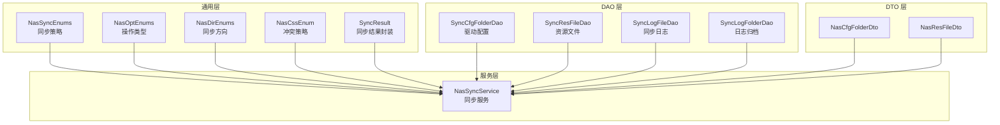
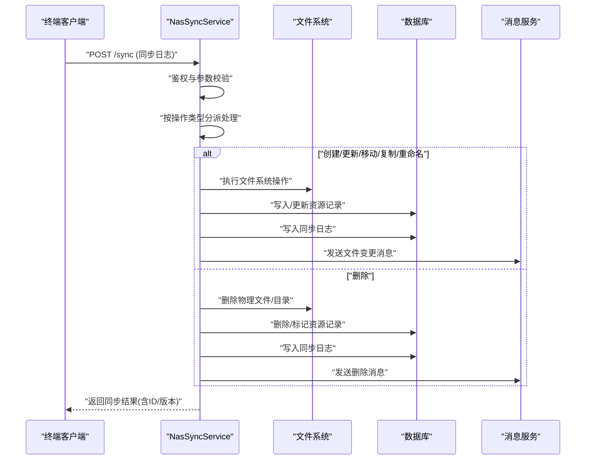
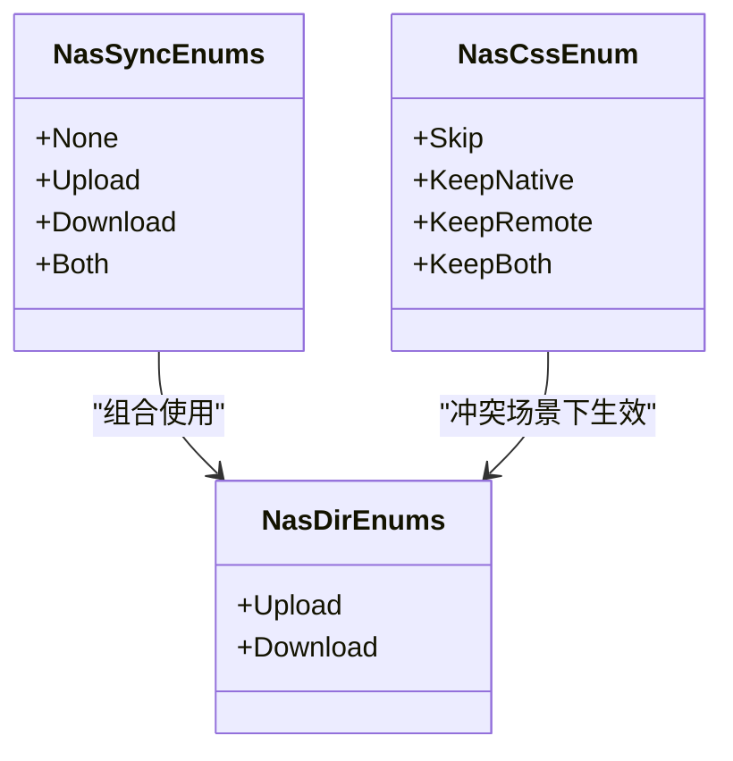
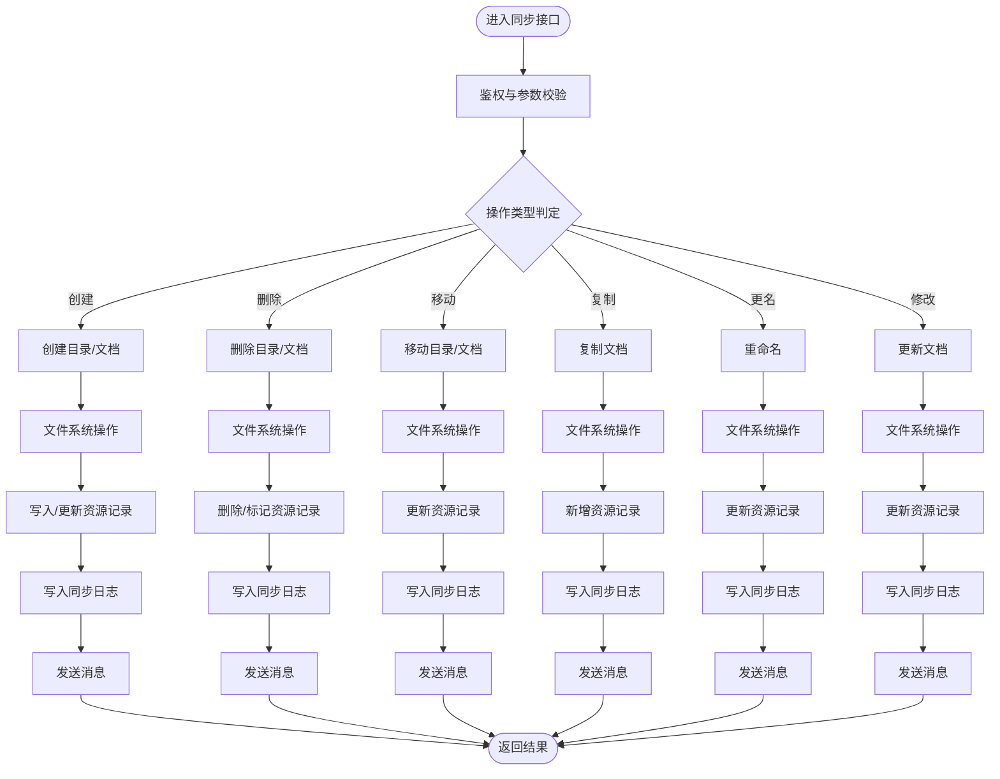
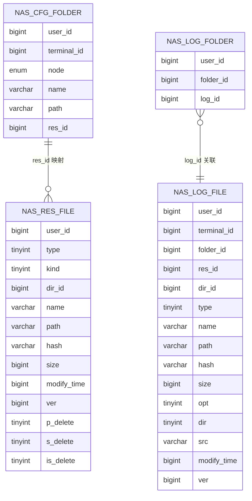
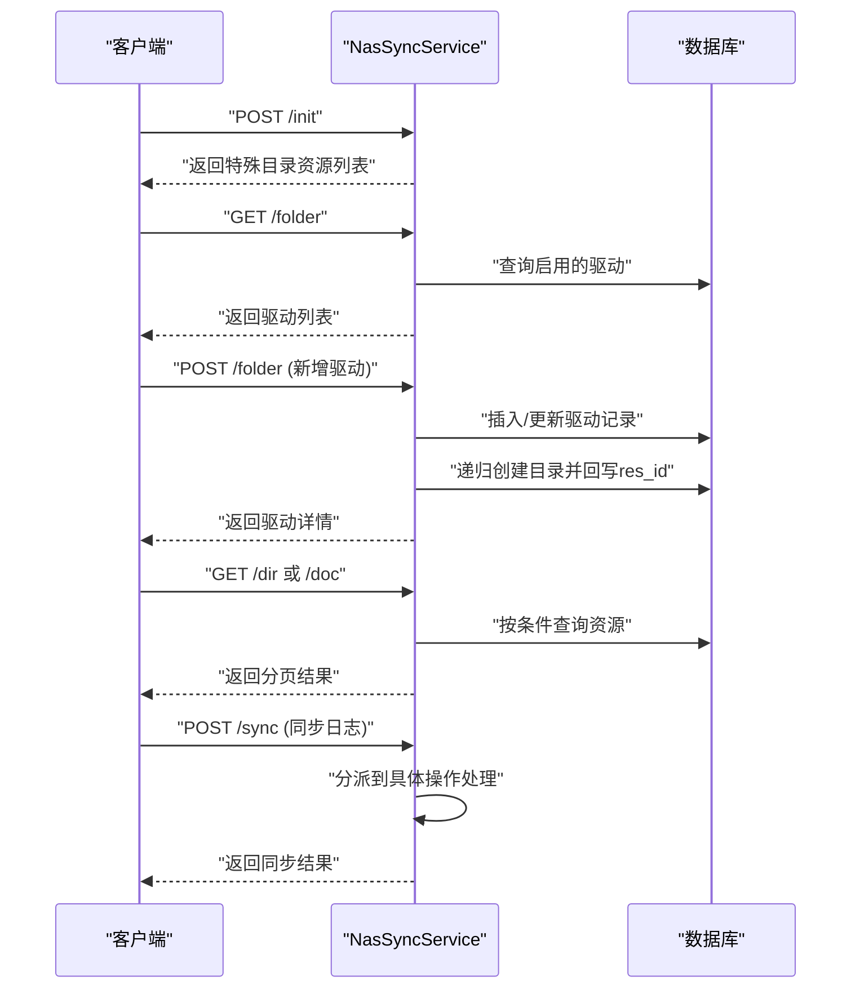
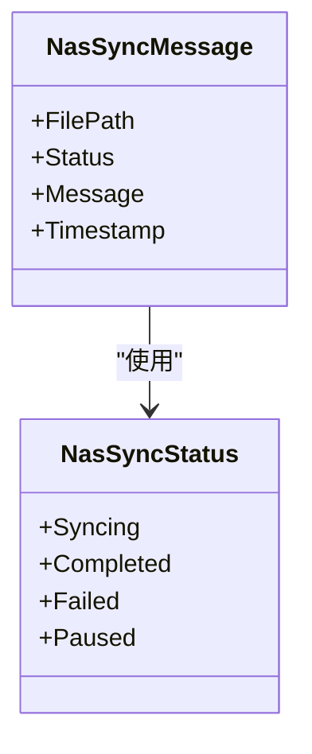
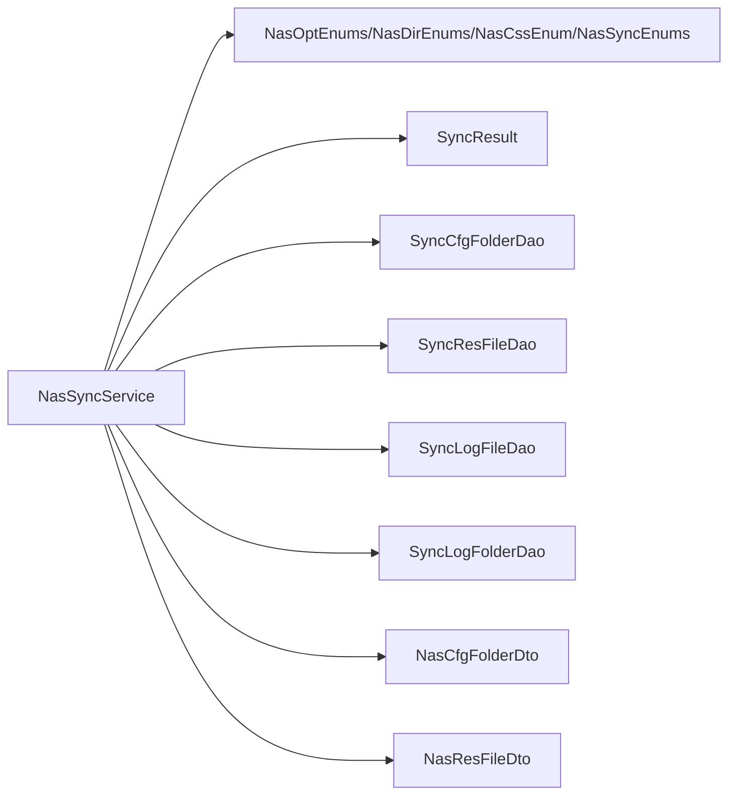

# 文件同步管理

<cite>
**本文引用的文件**
- [NasSyncService.cs](file://Nas.Server/Sync/NasSyncService.cs)
- [NasSyncEnums.cs](file://Nas.Common/NasSyncEnums.cs)
- [NasOptEnums.cs](file://Nas.Common/NasOptEnums.cs)
- [NasDirEnums.cs](file://Nas.Common/NasDirEnums.cs)
- [NasCssEnum.cs](file://Nas.Common/NasCssEnum.cs)
- [SyncResult.cs](file://Nas.Common/SyncResult.cs)
- [SyncCfgFolderDao.cs](file://Nas.Dao/Sync/SyncCfgFolderDao.cs)
- [SyncResFileDao.cs](file://Nas.Dao/Sync/SyncResFileDao.cs)
- [SyncLogFileDao.cs](file://Nas.Dao/Sync/SyncLogFileDao.cs)
- [SyncLogFolderDao.cs](file://Nas.Dao/Sync/SyncLogFolderDao.cs)
- [NasCfgFolderDto.cs](file://Nas.Dto/Cfg/NasCfgFolderDto.cs)
- [NasResFileDto.cs](file://Nas.Dto/Res/NasResFileDto.cs)
- [GetDirRequest.cs](file://Nas.Server/Sync/Dvo/GetDirRequest.cs)
- [NasMessageDto.cs](file://Nas.Dto/Msg/NasMessageDto.cs)
</cite>

## 目录
1. [简介](#简介)
2. [项目结构](#项目结构)
3. [核心组件](#核心组件)
4. [架构总览](#架构总览)
5. [详细组件分析](#详细组件分析)
6. [依赖关系分析](#依赖关系分析)
7. [性能考量](#性能考量)
8. [故障排除指南](#故障排除指南)
9. [结论](#结论)
10. [附录](#附录)

## 简介
本技术文档围绕文件同步管理功能展开，系统性阐述同步服务的架构设计、同步策略与冲突解决机制、版本管理模型、数据模型定义、生命周期管理（任务调度、状态跟踪、错误处理）、最佳实践（增量同步、批量处理、性能优化），以及配置项、监控指标与故障排除方法。该能力以终端侧文件变更事件为触发，通过统一的服务接口接收变更日志，落地到本地存储，并维护资源与日志表以实现可追溯、可回滚、可对账的同步体系。

## 项目结构
文件同步相关代码主要分布在以下模块：
- 通用层：同步策略、操作类型、同步方向、冲突策略等枚举，以及同步结果封装类
- DAO 层：驱动配置、资源文件、同步日志及日志归档表
- DTO 层：驱动配置、资源文件、消息体等数据传输对象
- 服务层：同步服务对外接口与内部处理逻辑
- 控制器层：与上层应用交互的入口（示例）

**图表来源**
- [NasSyncService.cs:20-45](file://Nas.Server/Sync/NasSyncService.cs#L20-L45)
- [NasSyncEnums.cs:8-26](file://Nas.Common/NasSyncEnums.cs#L8-L26)
- [NasOptEnums.cs:8-78](file://Nas.Common/NasOptEnums.cs#L8-L78)
- [NasDirEnums.cs:8-21](file://Nas.Common/NasDirEnums.cs#L8-L21)
- [NasCssEnum.cs:8-23](file://Nas.Common/NasCssEnum.cs#L8-L23)
- [SyncResult.cs:3-63](file://Nas.Common/SyncResult.cs#L3-L63)
- [SyncCfgFolderDao.cs:10-89](file://Nas.Dao/Sync/SyncCfgFolderDao.cs#L10-L89)
- [SyncResFileDao.cs:12-118](file://Nas.Dao/Sync/SyncResFileDao.cs#L12-L118)
- [SyncLogFileDao.cs:11-109](file://Nas.Dao/Sync/SyncLogFileDao.cs#L11-L109)
- [SyncLogFolderDao.cs:7-19](file://Nas.Dao/Sync/SyncLogFolderDao.cs#L7-L19)
- [NasCfgFolderDto.cs:9-39](file://Nas.Dto/Cfg/NasCfgFolderDto.cs#L9-L39)
- [NasResFileDto.cs:7-59](file://Nas.Dto/Res/NasResFileDto.cs#L7-L59)

**章节来源**
- [NasSyncService.cs:60-117](file://Nas.Server/Sync/NasSyncService.cs#L60-L117)
- [NasSyncEnums.cs:8-26](file://Nas.Common/NasSyncEnums.cs#L8-L26)
- [NasOptEnums.cs:8-78](file://Nas.Common/NasOptEnums.cs#L8-L78)
- [NasDirEnums.cs:8-21](file://Nas.Common/NasDirEnums.cs#L8-L21)
- [NasCssEnum.cs:8-23](file://Nas.Common/NasCssEnum.cs#L8-L23)
- [SyncResult.cs:3-63](file://Nas.Common/SyncResult.cs#L3-L63)
- [SyncCfgFolderDao.cs:10-89](file://Nas.Dao/Sync/SyncCfgFolderDao.cs#L10-L89)
- [SyncResFileDao.cs:12-118](file://Nas.Dao/Sync/SyncResFileDao.cs#L12-L118)
- [SyncLogFileDao.cs:11-109](file://Nas.Dao/Sync/SyncLogFileDao.cs#L11-L109)
- [SyncLogFolderDao.cs:7-19](file://Nas.Dao/Sync/SyncLogFolderDao.cs#L7-L19)
- [NasCfgFolderDto.cs:9-39](file://Nas.Dto/Cfg/NasCfgFolderDto.cs#L9-L39)
- [NasResFileDto.cs:7-59](file://Nas.Dto/Res/NasResFileDto.cs#L7-L59)

## 核心组件
- 同步服务：提供初始化、驱动管理、目录/文档查询、同步日志上传、日志拉取等接口；内部按操作类型分派到具体处理流程
- 数据模型：驱动配置、资源文件、同步日志、日志归档四张表构成同步数据主干
- 枚举体系：同步策略、操作类型、同步方向、冲突策略、同步状态等
- 结果封装：统一返回结构，包含成功标志、业务码、消息、资源ID与版本号

关键职责与边界：
- 服务层负责鉴权、路径转换、操作分派、文件系统操作、数据库事务与日志落盘
- DAO 层负责与数据库交互，维护资源与日志一致性
- DTO 层负责跨层数据契约，避免直接暴露实体细节

**章节来源**
- [NasSyncService.cs:60-117](file://Nas.Server/Sync/NasSyncService.cs#L60-L117)
- [SyncCfgFolderDao.cs:10-89](file://Nas.Dao/Sync/SyncCfgFolderDao.cs#L10-L89)
- [SyncResFileDao.cs:12-118](file://Nas.Dao/Sync/SyncResFileDao.cs#L12-L118)
- [SyncLogFileDao.cs:11-109](file://Nas.Dao/Sync/SyncLogFileDao.cs#L11-L109)
- [SyncLogFolderDao.cs:7-19](file://Nas.Dao/Sync/SyncLogFolderDao.cs#L7-L19)
- [NasSyncEnums.cs:8-26](file://Nas.Common/NasSyncEnums.cs#L8-L26)
- [NasOptEnums.cs:8-78](file://Nas.Common/NasOptEnums.cs#L8-L78)
- [NasDirEnums.cs:8-21](file://Nas.Common/NasDirEnums.cs#L8-L21)
- [NasCssEnum.cs:8-23](file://Nas.Common/NasCssEnum.cs#L8-L23)
- [SyncResult.cs:3-63](file://Nas.Common/SyncResult.cs#L3-L63)

## 架构总览
文件同步采用“事件驱动 + 服务编排”的架构模式：
- 终端侧产生文件变更事件（增删改移等），通过上传接口提交同步日志
- 服务端解析日志，按操作类型执行对应处理（创建、删除、移动、复制、重命名、更新）
- 执行过程中同步更新资源表与日志表，并在必要时发送消息通知
- 提供目录/文档查询接口，支持分页与条件过滤
- 提供日志查询接口，按用户与驱动维度分页拉取

**图表来源**
- [NasSyncService.cs:343-416](file://Nas.Server/Sync/NasSyncService.cs#L343-L416)
- [NasSyncService.cs:574-677](file://Nas.Server/Sync/NasSyncService.cs#L574-L677)
- [NasSyncService.cs:704-772](file://Nas.Server/Sync/NasSyncService.cs#L704-L772)
- [NasSyncService.cs:1001-1100](file://Nas.Server/Sync/NasSyncService.cs#L1001-L1100)
- [NasSyncService.cs:1112-1229](file://Nas.Server/Sync/NasSyncService.cs#L1112-L1229)
- [NasSyncService.cs:1241-1316](file://Nas.Server/Sync/NasSyncService.cs#L1241-L1316)
- [NasSyncService.cs:428-496](file://Nas.Server/Sync/NasSyncService.cs#L428-L496)
- [NasMessageDto.cs:103-117](file://Nas.Dto/Msg/NasMessageDto.cs#L103-L117)

**章节来源**
- [NasSyncService.cs:343-416](file://Nas.Server/Sync/NasSyncService.cs#L343-L416)
- [NasSyncService.cs:574-677](file://Nas.Server/Sync/NasSyncService.cs#L574-L677)
- [NasSyncService.cs:704-772](file://Nas.Server/Sync/NasSyncService.cs#L704-L772)
- [NasSyncService.cs:1001-1100](file://Nas.Server/Sync/NasSyncService.cs#L1001-L1100)
- [NasSyncService.cs:1112-1229](file://Nas.Server/Sync/NasSyncService.cs#L1112-L1229)
- [NasSyncService.cs:1241-1316](file://Nas.Server/Sync/NasSyncService.cs#L1241-L1316)
- [NasSyncService.cs:428-496](file://Nas.Server/Sync/NasSyncService.cs#L428-L496)
- [NasMessageDto.cs:103-117](file://Nas.Dto/Msg/NasMessageDto.cs#L103-L117)

## 详细组件分析

### 同步策略与冲突解决
- 同步策略：支持仅上传、仅下载、双向同步三种策略，用于控制终端侧与服务端之间的同步方向
- 冲突策略：提供跳过、保留本地、保留远端、保留双方等策略，用于处理同名或同路径冲突
- 同步方向：区分上传与下载，配合策略与冲突策略共同决定最终行为

**图表来源**
- [NasSyncEnums.cs:8-26](file://Nas.Common/NasSyncEnums.cs#L8-L26)
- [NasCssEnum.cs:8-23](file://Nas.Common/NasCssEnum.cs#L8-L23)
- [NasDirEnums.cs:8-21](file://Nas.Common/NasDirEnums.cs#L8-L21)

**章节来源**
- [NasSyncEnums.cs:8-26](file://Nas.Common/NasSyncEnums.cs#L8-L26)
- [NasCssEnum.cs:8-23](file://Nas.Common/NasCssEnum.cs#L8-L23)
- [NasDirEnums.cs:8-21](file://Nas.Common/NasDirEnums.cs#L8-L21)

### 同步操作类型与生命周期
- 操作类型：删除、恢复、创建、修改、更名、移动、复制、压缩、解压、分享、解除分享、隐私、解除隐私
- 生命周期阶段：鉴权校验 → 路径转换 → 操作分派 → 文件系统操作 → 数据库写入 → 日志落盘 → 消息通知 → 返回结果
- 错误处理：统一通过结果封装返回错误码与消息；关键步骤均记录日志便于定位

**图表来源**
- [NasSyncService.cs:343-416](file://Nas.Server/Sync/NasSyncService.cs#L343-L416)
- [NasSyncService.cs:574-677](file://Nas.Server/Sync/NasSyncService.cs#L574-L677)
- [NasSyncService.cs:704-772](file://Nas.Server/Sync/NasSyncService.cs#L704-L772)
- [NasSyncService.cs:1001-1100](file://Nas.Server/Sync/NasSyncService.cs#L1001-L1100)
- [NasSyncService.cs:1112-1229](file://Nas.Server/Sync/NasSyncService.cs#L1112-L1229)
- [NasSyncService.cs:1241-1316](file://Nas.Server/Sync/NasSyncService.cs#L1241-L1316)
- [NasSyncService.cs:428-496](file://Nas.Server/Sync/NasSyncService.cs#L428-L496)
- [NasOptEnums.cs:8-78](file://Nas.Common/NasOptEnums.cs#L8-L78)

**章节来源**
- [NasSyncService.cs:343-416](file://Nas.Server/Sync/NasSyncService.cs#L343-L416)
- [NasOptEnums.cs:8-78](file://Nas.Common/NasOptEnums.cs#L8-L78)

### 数据模型与版本管理
- 驱动配置：记录用户、终端、节点、远端路径与资源ID映射
- 资源文件：记录文件/目录的用户、类型、子类型、父目录、路径、摘要、大小、修改时间、版本、软删除标记等
- 同步日志：记录用户、终端、驱动、资源、目录、类型、名称、路径、摘要、大小、操作、方向、来源、修改时间、版本
- 日志归档：将日志与用户/驱动关联，支持按驱动分页查询

版本管理要点：
- 新增记录时版本初始化为1，更新记录时版本自增
- 每次操作均写入同步日志，便于审计与回溯
- 软删除字段用于标记删除状态，避免物理删除造成数据丢失

**图表来源**
- [SyncCfgFolderDao.cs:10-89](file://Nas.Dao/Sync/SyncCfgFolderDao.cs#L10-L89)
- [SyncResFileDao.cs:12-118](file://Nas.Dao/Sync/SyncResFileDao.cs#L12-L118)
- [SyncLogFileDao.cs:11-109](file://Nas.Dao/Sync/SyncLogFileDao.cs#L11-L109)
- [SyncLogFolderDao.cs:7-19](file://Nas.Dao/Sync/SyncLogFolderDao.cs#L7-L19)

**章节来源**
- [SyncCfgFolderDao.cs:10-89](file://Nas.Dao/Sync/SyncCfgFolderDao.cs#L10-L89)
- [SyncResFileDao.cs:12-118](file://Nas.Dao/Sync/SyncResFileDao.cs#L12-L118)
- [SyncLogFileDao.cs:11-109](file://Nas.Dao/Sync/SyncLogFileDao.cs#L11-L109)
- [SyncLogFolderDao.cs:7-19](file://Nas.Dao/Sync/SyncLogFolderDao.cs#L7-L19)

### 接口与请求模型
- 初始化：返回特殊目录（设备、公共、私密、下载、应用）的资源目录树
- 驱动管理：列出/新增驱动，新增时递归创建目录并回写资源ID
- 查询接口：按目录/文档维度查询，支持按路径或父目录ID查询
- 同步日志：上传变更日志，按操作类型分派处理
- 日志查询：按用户与驱动维度分页查询日志

**图表来源**
- [NasSyncService.cs:65-93](file://Nas.Server/Sync/NasSyncService.cs#L65-L93)
- [NasSyncService.cs:99-117](file://Nas.Server/Sync/NasSyncService.cs#L99-L117)
- [NasSyncService.cs:124-170](file://Nas.Server/Sync/NasSyncService.cs#L124-L170)
- [NasSyncService.cs:241-334](file://Nas.Server/Sync/NasSyncService.cs#L241-L334)
- [NasSyncService.cs:343-416](file://Nas.Server/Sync/NasSyncService.cs#L343-L416)

**章节来源**
- [NasSyncService.cs:65-93](file://Nas.Server/Sync/NasSyncService.cs#L65-L93)
- [NasSyncService.cs:99-117](file://Nas.Server/Sync/NasSyncService.cs#L99-L117)
- [NasSyncService.cs:124-170](file://Nas.Server/Sync/NasSyncService.cs#L124-L170)
- [NasSyncService.cs:241-334](file://Nas.Server/Sync/NasSyncService.cs#L241-L334)
- [NasSyncService.cs:343-416](file://Nas.Server/Sync/NasSyncService.cs#L343-L416)
- [GetDirRequest.cs:3-10](file://Nas.Server/Sync/Dvo/GetDirRequest.cs#L3-L10)
- [NasCfgFolderDto.cs:9-39](file://Nas.Dto/Cfg/NasCfgFolderDto.cs#L9-L39)
- [NasResFileDto.cs:7-59](file://Nas.Dto/Res/NasResFileDto.cs#L7-L59)

### 同步状态与消息
- 同步状态：同步中、已完成、失败、暂停
- 消息体：包含文件路径、状态、状态消息、时间戳等
- 服务端在关键操作完成后发送消息，便于前端或订阅方感知状态变化

**图表来源**
- [NasMessageDto.cs:80-98](file://Nas.Dto/Msg/NasMessageDto.cs#L80-L98)
- [NasMessageDto.cs:103-117](file://Nas.Dto/Msg/NasMessageDto.cs#L103-L117)

**章节来源**
- [NasMessageDto.cs:80-98](file://Nas.Dto/Msg/NasMessageDto.cs#L80-L98)
- [NasMessageDto.cs:103-117](file://Nas.Dto/Msg/NasMessageDto.cs#L103-L117)

## 依赖关系分析
- 服务层依赖通用枚举与结果封装，依赖 DAO 层进行数据持久化，依赖消息服务进行通知
- DAO 层之间通过外键与业务字段（如 res_id、dir_id、folder_id）建立关联
- DTO 层作为契约层，避免服务层直接依赖实体细节

**图表来源**
- [NasSyncService.cs:20-45](file://Nas.Server/Sync/NasSyncService.cs#L20-L45)
- [NasOptEnums.cs:8-78](file://Nas.Common/NasOptEnums.cs#L8-L78)
- [NasDirEnums.cs:8-21](file://Nas.Common/NasDirEnums.cs#L8-L21)
- [NasCssEnum.cs:8-23](file://Nas.Common/NasCssEnum.cs#L8-L23)
- [NasSyncEnums.cs:8-26](file://Nas.Common/NasSyncEnums.cs#L8-L26)
- [SyncResult.cs:3-63](file://Nas.Common/SyncResult.cs#L3-L63)
- [SyncCfgFolderDao.cs:10-89](file://Nas.Dao/Sync/SyncCfgFolderDao.cs#L10-L89)
- [SyncResFileDao.cs:12-118](file://Nas.Dao/Sync/SyncResFileDao.cs#L12-L118)
- [SyncLogFileDao.cs:11-109](file://Nas.Dao/Sync/SyncLogFileDao.cs#L11-L109)
- [SyncLogFolderDao.cs:7-19](file://Nas.Dao/Sync/SyncLogFolderDao.cs#L7-L19)
- [NasCfgFolderDto.cs:9-39](file://Nas.Dto/Cfg/NasCfgFolderDto.cs#L9-L39)
- [NasResFileDto.cs:7-59](file://Nas.Dto/Res/NasResFileDto.cs#L7-L59)

**章节来源**
- [NasSyncService.cs:20-45](file://Nas.Server/Sync/NasSyncService.cs#L20-L45)
- [NasOptEnums.cs:8-78](file://Nas.Common/NasOptEnums.cs#L8-L78)
- [NasDirEnums.cs:8-21](file://Nas.Common/NasDirEnums.cs#L8-L21)
- [NasCssEnum.cs:8-23](file://Nas.Common/NasCssEnum.cs#L8-L23)
- [NasSyncEnums.cs:8-26](file://Nas.Common/NasSyncEnums.cs#L8-L26)
- [SyncResult.cs:3-63](file://Nas.Common/SyncResult.cs#L3-L63)
- [SyncCfgFolderDao.cs:10-89](file://Nas.Dao/Sync/SyncCfgFolderDao.cs#L10-L89)
- [SyncResFileDao.cs:12-118](file://Nas.Dao/Sync/SyncResFileDao.cs#L12-L118)
- [SyncLogFileDao.cs:11-109](file://Nas.Dao/Sync/SyncLogFileDao.cs#L11-L109)
- [SyncLogFolderDao.cs:7-19](file://Nas.Dao/Sync/SyncLogFolderDao.cs#L7-L19)
- [NasCfgFolderDto.cs:9-39](file://Nas.Dto/Cfg/NasCfgFolderDto.cs#L9-L39)
- [NasResFileDto.cs:7-59](file://Nas.Dto/Res/NasResFileDto.cs#L7-L59)

## 性能考量
- 增量同步：通过日志查询接口按 id 上限与时间排序进行增量拉取，减少全量扫描
- 批量处理：目录/文档查询支持分页，建议前端按需加载；服务端查询使用索引字段（如 dir_id、user_id、path）
- 文件系统操作：移动/复制/重命名采用原子移动，避免重复拷贝；创建/更新前检查临时文件存在性
- 版本管理：更新时版本自增，便于快速判断是否需要重新同步
- 并发控制：同一用户/驱动下的日志写入应保证顺序性，避免竞态导致的脏数据

[本节为通用指导，无需列出具体文件来源]

## 故障排除指南
常见问题与排查步骤：
- 终端鉴权失败：检查 appToken 与终端有效性；确认服务端令牌解析与过期判断逻辑
- 操作类型不支持：核对日志中的 opt 字段是否在支持范围内
- 路径转换异常：确认驱动节点与路径前缀转换逻辑
- 文件不存在或移动失败：检查临时文件路径与目标路径权限
- 删除后残留：确认软删除标记与资源清理逻辑
- 日志未入库：检查日志写入与事务提交逻辑

建议的日志关键字：
- “终端信息异常”、“终端授权异常”
- “未知的文件类型”、“不支持的操作”
- “来源目录不存在”、“上传文档不存在”
- “上传文档移动异常”

**章节来源**
- [NasSyncService.cs:354-371](file://Nas.Server/Sync/NasSyncService.cs#L354-L371)
- [NasSyncService.cs:413-415](file://Nas.Server/Sync/NasSyncService.cs#L413-L415)
- [NasSyncService.cs:634-646](file://Nas.Server/Sync/NasSyncService.cs#L634-L646)
- [NasSyncService.cs:738-744](file://Nas.Server/Sync/NasSyncService.cs#L738-L744)
- [NasSyncService.cs:1270-1282](file://Nas.Server/Sync/NasSyncService.cs#L1270-L1282)

## 结论
该文件同步管理功能以清晰的枚举体系、严谨的数据模型与完善的生命周期管理为基础，实现了从事件采集到执行落地再到审计回溯的完整闭环。通过策略与冲突机制的组合，能够灵活适配多种同步场景；通过版本与日志的协同，确保数据一致性与可追溯性。建议在生产环境中结合增量同步、批量处理与并发控制策略，持续优化性能与稳定性。

[本节为总结性内容，无需列出具体文件来源]

## 附录
- 配置选项：驱动节点、远端路径、启用状态、资源ID映射
- 监控指标：同步成功率、失败率、平均耗时、日志条数、文件操作类型分布
- 故障排除：日志关键字、常见错误码、重试策略、回滚方案

[本节为通用指导，无需列出具体文件来源]