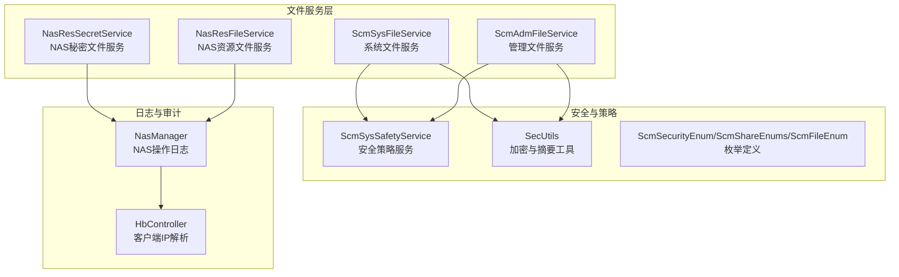
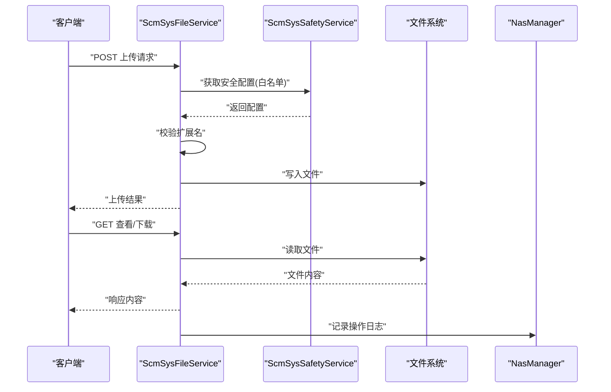
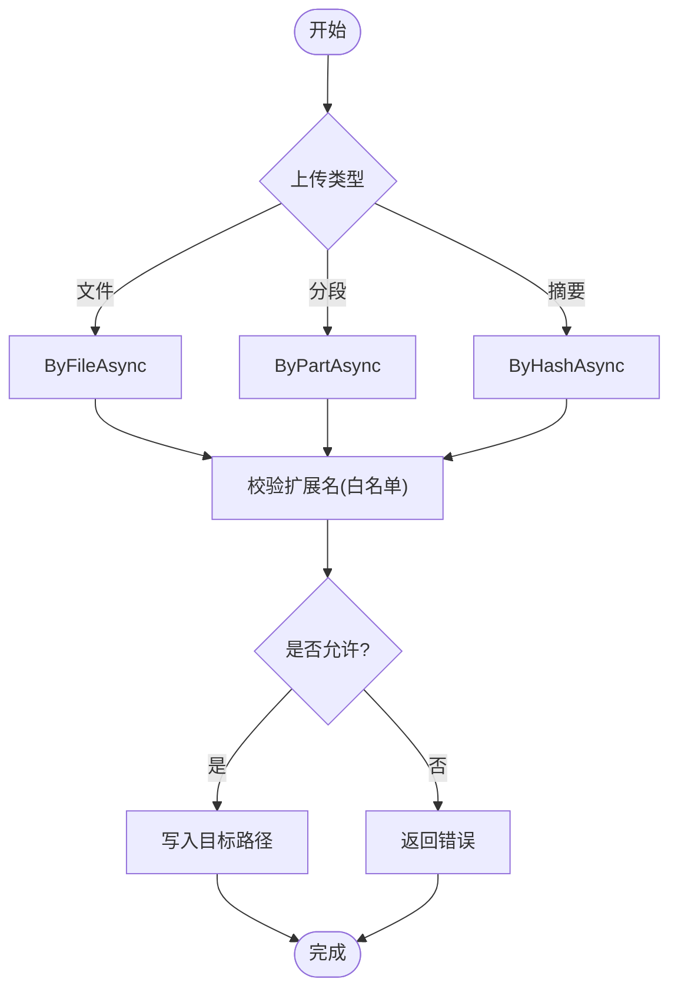
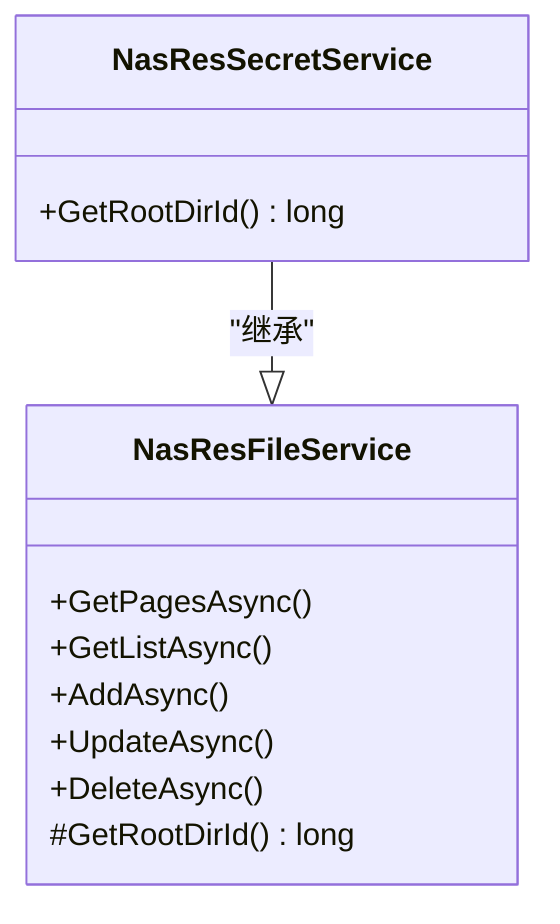
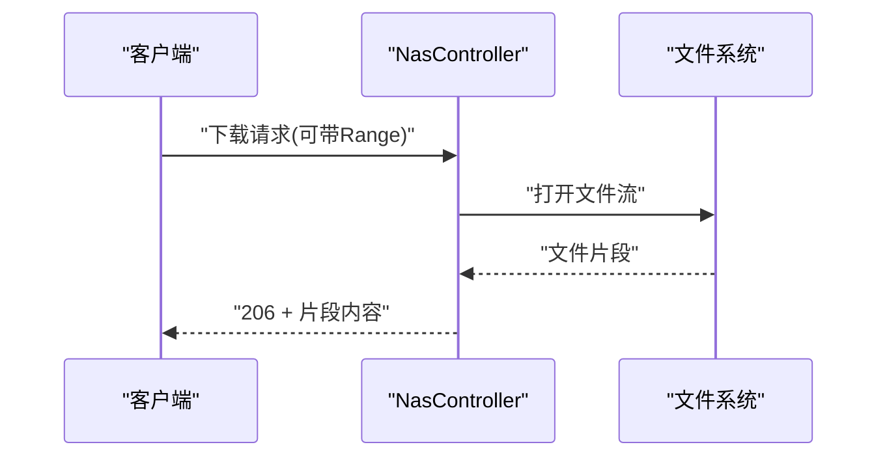
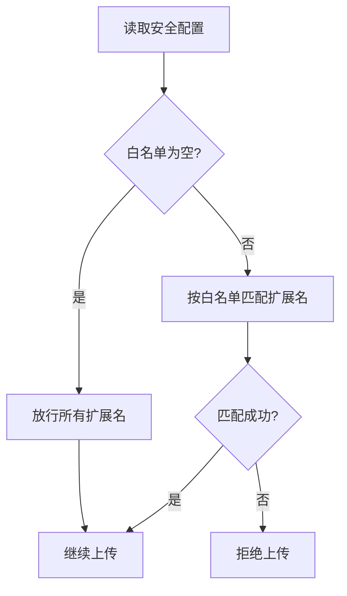
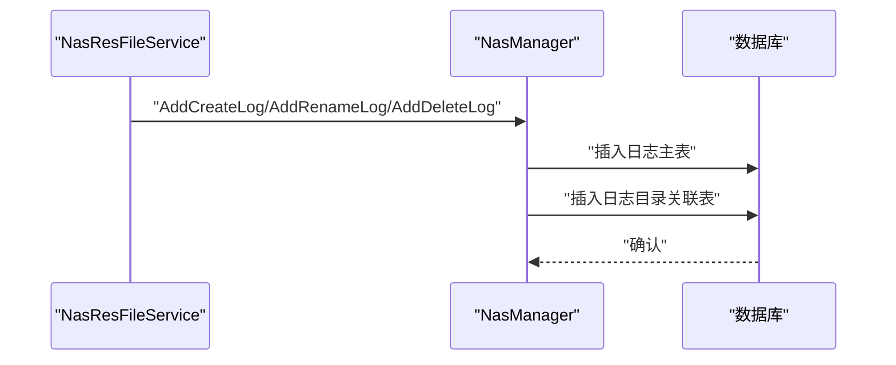
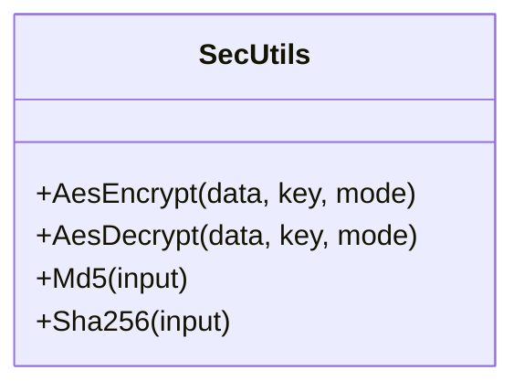
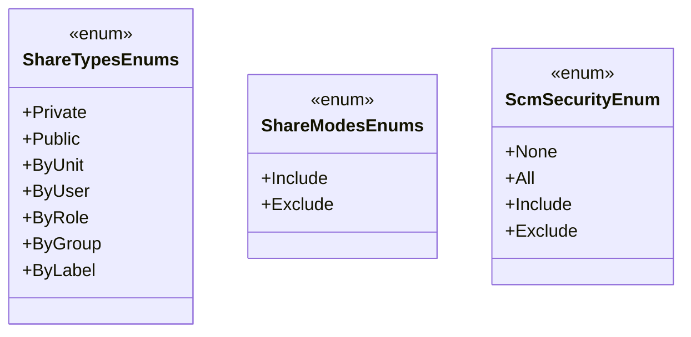
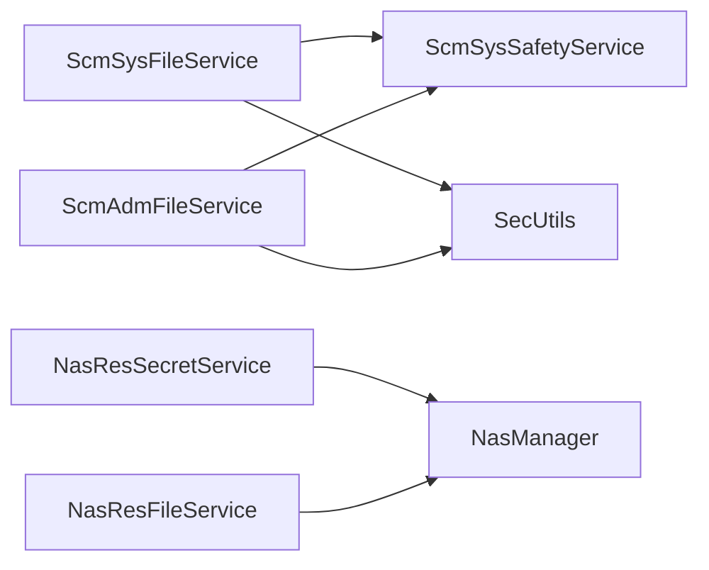

# 文件安全与权限

<cite>
**本文引用的文件**
- [ScmSysFileService.cs](file://Scm.Core/Sys/Files/ScmSysFileService.cs)
- [ScmAdmFileService.cs](file://Scm.Core/Adm/Files/ScmAdmFileService.cs)
- [ScmSysSafetyService.cs](file://Scm.Core/Sys/Safety/ScmSysSafetyService.cs)
- [SecUtils.cs](file://Scm.Common/Utils/SecUtils.cs)
- [ScmSecurityEnum.cs](file://Scm.Common/Enums/ScmSecurityEnum.cs)
- [ScmShareEnums.cs](file://Scm.Common/Enums/ScmShareEnums.cs)
- [ScmFileEnum.cs](file://Scm.Common/Enums/ScmFileEnum.cs)
- [NasResFileService.cs](file://Nas.Server/Res/NasResFileService.cs)
- [NasResSecretService.cs](file://Nas.Server/Res/NasResSecretService.cs)
- [NasManager.cs](file://Nas.Server/Res/NasManager.cs)
- [NasHelper.cs](file://Nas.Server/NasHelper.cs)
- [NasController.cs](file://Scm.Net/Controllers/NasController.cs)
- [HbController.cs](file://Scm.Net/Controllers/HbController.cs)
- [ScmUtils.cs](file://Scm.Common/Utils/ScmUtils.cs)
</cite>

## 目录
1. [引言](#引言)
2. [项目结构](#项目结构)
3. [核心组件](#核心组件)
4. [架构总览](#架构总览)
5. [详细组件分析](#详细组件分析)
6. [依赖分析](#依赖分析)
7. [性能考虑](#性能考虑)
8. [故障排查指南](#故障排查指南)
9. [结论](#结论)
10. [附录](#附录)

## 引言
本文件聚焦于系统中的“文件安全与权限”能力，覆盖以下主题：
- 文件访问权限与隔离：用户文件隔离、目录权限控制、访问验证
- 文件安全策略：上传白名单、扩展名校验、访问日志记录
- 加密与存储：对称加密工具、敏感文件保护思路
- 权限管理：文件共享模型（私有/公开/按单位/按用户等）、权限继承与访问控制
- 最佳实践、漏洞防护与合规建议

## 项目结构
围绕文件安全与权限的关键模块分布如下：
- 系统级文件服务：提供通用的文件上传、下载、删除与视图展示能力，并集成安全策略
- 安全策略服务：集中管理安全配置（如上传白名单）
- NAS 服务：面向特定业务域（如秘密文件）的目录隔离与操作日志
- 加密工具：提供对称加密与摘要算法
- 枚举与辅助：文件类型、安全级别、分享类型等

**图表来源**
- [ScmSysFileService.cs:1-348](file://Scm.Core/Sys/Files/ScmSysFileService.cs#L1-L348)
- [ScmAdmFileService.cs:1-281](file://Scm.Core/Adm/Files/ScmAdmFileService.cs#L1-L281)
- [ScmSysSafetyService.cs:1-43](file://Scm.Core/Sys/Safety/ScmSysSafetyService.cs#L1-L43)
- [SecUtils.cs:1-144](file://Scm.Common/Utils/SecUtils.cs#L1-L144)
- [ScmSecurityEnum.cs:1-19](file://Scm.Common/Enums/ScmSecurityEnum.cs#L1-L19)
- [ScmShareEnums.cs:1-49](file://Scm.Common/Enums/ScmShareEnums.cs#L1-L49)
- [ScmFileEnum.cs:1-79](file://Scm.Common/Enums/ScmFileEnum.cs#L1-L79)
- [NasResFileService.cs:1-259](file://Nas.Server/Res/NasResFileService.cs#L1-L259)
- [NasResSecretService.cs:1-24](file://Nas.Server/Res/NasResSecretService.cs#L1-L24)
- [NasManager.cs:1-136](file://Nas.Server/Res/NasManager.cs#L1-L136)
- [HbController.cs:112-129](file://Scm.Net/Controllers/HbController.cs#L112-L129)

**章节来源**
- [ScmSysFileService.cs:1-348](file://Scm.Core/Sys/Files/ScmSysFileService.cs#L1-L348)
- [ScmAdmFileService.cs:1-281](file://Scm.Core/Adm/Files/ScmAdmFileService.cs#L1-L281)
- [ScmSysSafetyService.cs:1-43](file://Scm.Core/Sys/Safety/ScmSysSafetyService.cs#L1-L43)
- [SecUtils.cs:1-144](file://Scm.Common/Utils/SecUtils.cs#L1-L144)
- [ScmSecurityEnum.cs:1-19](file://Scm.Common/Enums/ScmSecurityEnum.cs#L1-L19)
- [ScmShareEnums.cs:1-49](file://Scm.Common/Enums/ScmShareEnums.cs#L1-L49)
- [ScmFileEnum.cs:1-79](file://Scm.Common/Enums/ScmFileEnum.cs#L1-L79)
- [NasResFileService.cs:1-259](file://Nas.Server/Res/NasResFileService.cs#L1-L259)
- [NasResSecretService.cs:1-24](file://Nas.Server/Res/NasResSecretService.cs#L1-L24)
- [NasManager.cs:1-136](file://Nas.Server/Res/NasManager.cs#L1-L136)
- [HbController.cs:112-129](file://Scm.Net/Controllers/HbController.cs#L112-L129)

## 核心组件
- 系统文件服务与管理文件服务：提供统一的文件上传、分段/摘要上传、删除、查看与头像展示；内置上传扩展名校验逻辑
- 安全策略服务：从缓存读取/写入安全配置（如上传白名单），供文件服务在上传时进行过滤
- 加密与摘要工具：提供AES加解密与MD5/SHA256摘要，可用于敏感数据保护与完整性校验
- NAS 资源服务与秘密文件服务：基于业务域的目录隔离与操作日志记录
- 分享与安全枚举：定义分享类型（私有/公开/按单位/按用户等）与安全级别

**章节来源**
- [ScmSysFileService.cs:70-307](file://Scm.Core/Sys/Files/ScmSysFileService.cs#L70-L307)
- [ScmAdmFileService.cs:60-281](file://Scm.Core/Adm/Files/ScmAdmFileService.cs#L60-L281)
- [ScmSysSafetyService.cs:24-43](file://Scm.Core/Sys/Safety/ScmSysSafetyService.cs#L24-L43)
- [SecUtils.cs:17-141](file://Scm.Common/Utils/SecUtils.cs#L17-L141)
- [NasResFileService.cs:18-259](file://Nas.Server/Res/NasResFileService.cs#L18-L259)
- [NasResSecretService.cs:7-24](file://Nas.Server/Res/NasResSecretService.cs#L7-L24)
- [ScmShareEnums.cs:1-49](file://Scm.Common/Enums/ScmShareEnums.cs#L1-L49)
- [ScmSecurityEnum.cs:1-19](file://Scm.Common/Enums/ScmSecurityEnum.cs#L1-L19)

## 架构总览
文件安全与权限的整体流程：
- 上传阶段：请求进入文件服务，先通过安全策略服务校验扩展名，再写入目标路径
- 访问阶段：根据请求路径定位物理文件，返回对应内容或默认占位图
- 日志阶段：NAS 操作日志记录创建/重命名/删除等事件，并关联到用户与目录
- 安全阶段：通过枚举与策略控制分享范围与安全级别

**图表来源**
- [ScmSysFileService.cs:76-324](file://Scm.Core/Sys/Files/ScmSysFileService.cs#L76-L324)
- [ScmSysSafetyService.cs:24-43](file://Scm.Core/Sys/Safety/ScmSysSafetyService.cs#L24-L43)
- [NasManager.cs:19-103](file://Nas.Server/Res/NasManager.cs#L19-L103)

## 详细组件分析

### 文件上传与访问验证
- 上传类型支持：文件直传、分段上传、摘要上传
- 扩展名校验：从安全策略中读取白名单，仅允许白名单内的扩展名
- 写入路径：根据环境配置计算数据目录，确保上传到受控位置
- 访问视图：提供通用文件视图与头像视图，若文件不存在则返回默认占位图

**图表来源**
- [ScmSysFileService.cs:76-217](file://Scm.Core/Sys/Files/ScmSysFileService.cs#L76-L217)
- [ScmAdmFileService.cs:66-211](file://Scm.Core/Adm/Files/ScmAdmFileService.cs#L66-L211)
- [ScmSysSafetyService.cs:24-43](file://Scm.Core/Sys/Safety/ScmSysSafetyService.cs#L24-L43)

**章节来源**
- [ScmSysFileService.cs:76-324](file://Scm.Core/Sys/Files/ScmSysFileService.cs#L76-L324)
- [ScmAdmFileService.cs:66-281](file://Scm.Core/Adm/Files/ScmAdmFileService.cs#L66-L281)
- [ScmSysSafetyService.cs:24-43](file://Scm.Core/Sys/Safety/ScmSysSafetyService.cs#L24-L43)

### 目录权限控制与用户文件隔离
- 目录遍历与查询：通过环境配置限定数据根目录，避免越权访问
- NAS 根目录隔离：秘密文件服务通过环境常量定位秘密根目录，形成业务域隔离
- 文件类型与种类：通过枚举定义文件类型与种类，便于后续扩展权限控制粒度

**图表来源**
- [NasResSecretService.cs:7-24](file://Nas.Server/Res/NasResSecretService.cs#L7-L24)
- [NasResFileService.cs:18-65](file://Nas.Server/Res/NasResFileService.cs#L18-L65)

**章节来源**
- [NasResSecretService.cs:14-22](file://Nas.Server/Res/NasResSecretService.cs#L14-L22)
- [NasResFileService.cs:62-65](file://Nas.Server/Res/NasResFileService.cs#L62-L65)
- [ScmFileEnum.cs:5-79](file://Scm.Common/Enums/ScmFileEnum.cs#L5-L79)

### 文件访问验证与下载
- 视图接口：当文件不存在时返回默认占位图，避免泄露真实路径信息
- 下载控制器：支持断点续传（206 Partial Content），设置 Content-Range 与 Content-Disposition，增强下载体验与安全性

**图表来源**
- [NasController.cs:264-292](file://Scm.Net/Controllers/NasController.cs#L264-L292)

**章节来源**
- [ScmSysFileService.cs:308-347](file://Scm.Core/Sys/Files/ScmSysFileService.cs#L308-L347)
- [NasController.cs:264-292](file://Scm.Net/Controllers/NasController.cs#L264-L292)

### 文件安全策略：上传白名单与扩展名校验
- 白名单来源：安全策略服务从缓存读取配置
- 校验规则：未配置白名单时默认放行；否则仅允许白名单内扩展名
- 配置入口：安全策略服务提供读取与写入接口

**图表来源**
- [ScmSysSafetyService.cs:24-43](file://Scm.Core/Sys/Safety/ScmSysSafetyService.cs#L24-L43)
- [ScmSysFileService.cs:290-300](file://Scm.Core/Sys/Files/ScmSysFileService.cs#L290-L300)
- [ScmAdmFileService.cs:246-256](file://Scm.Core/Adm/Files/ScmAdmFileService.cs#L246-L256)

**章节来源**
- [ScmSysSafetyService.cs:24-43](file://Scm.Core/Sys/Safety/ScmSysSafetyService.cs#L24-L43)
- [ScmSysFileService.cs:290-300](file://Scm.Core/Sys/Files/ScmSysFileService.cs#L290-L300)
- [ScmAdmFileService.cs:246-256](file://Scm.Core/Adm/Files/ScmAdmFileService.cs#L246-L256)

### 访问日志记录与审计
- NAS 操作日志：记录创建、重命名、删除等事件，关联资源、目录与用户
- 目录链路：自动向上追溯父目录，将日志与用户配置的目录集合关联
- 客户端 IP：在健康检查控制器中提供多代理场景下的客户端 IP 解析

**图表来源**
- [NasResFileService.cs:187-228](file://Nas.Server/Res/NasResFileService.cs#L187-L228)
- [NasManager.cs:19-133](file://Nas.Server/Res/NasManager.cs#L19-L133)
- [HbController.cs:112-129](file://Scm.Net/Controllers/HbController.cs#L112-L129)

**章节来源**
- [NasResFileService.cs:187-228](file://Nas.Server/Res/NasResFileService.cs#L187-L228)
- [NasManager.cs:19-133](file://Nas.Server/Res/NasManager.cs#L19-L133)
- [HbController.cs:112-129](file://Scm.Net/Controllers/HbController.cs#L112-L129)

### 文件加密存储方案
- 对称加密：提供 AES 加密/解密工具，支持 CBC 模式，默认密钥与固定 IV
- 摘要算法：提供 MD5 与 SHA256 摘要，可用于完整性校验与去重
- 应用建议：对敏感元数据或小体量内容使用对称加密；结合哈希用于快速比对与去重

**图表来源**
- [SecUtils.cs:17-141](file://Scm.Common/Utils/SecUtils.cs#L17-L141)

**章节来源**
- [SecUtils.cs:17-141](file://Scm.Common/Utils/SecUtils.cs#L17-L141)

### 文件权限管理：共享、继承与访问控制
- 分享类型：支持私有、公开、按单位、按用户、按角色、按群组、按标签
- 安全级别：提供“全部/包含/排除”的安全策略枚举，便于灵活组合
- 继承与控制：通过分享类型与模式（包含/排除）实现细粒度的访问控制与继承策略

**图表来源**
- [ScmShareEnums.cs:1-49](file://Scm.Common/Enums/ScmShareEnums.cs#L1-L49)
- [ScmSecurityEnum.cs:1-19](file://Scm.Common/Enums/ScmSecurityEnum.cs#L1-L19)

**章节来源**
- [ScmShareEnums.cs:1-49](file://Scm.Common/Enums/ScmShareEnums.cs#L1-L49)
- [ScmSecurityEnum.cs:1-19](file://Scm.Common/Enums/ScmSecurityEnum.cs#L1-L19)

## 依赖分析
- 文件服务依赖安全策略服务进行扩展名校验
- NAS 服务依赖日志管理器记录操作轨迹
- 下载控制器直接读取文件系统，需配合路径限制与访问控制
- 加密工具独立，可在需要时被业务模块调用

**图表来源**
- [ScmSysFileService.cs:1-41](file://Scm.Core/Sys/Files/ScmSysFileService.cs#L1-L41)
- [ScmAdmFileService.cs:1-34](file://Scm.Core/Adm/Files/ScmAdmFileService.cs#L1-L34)
- [NasResSecretService.cs:7-12](file://Nas.Server/Res/NasResSecretService.cs#L7-L12)
- [NasResFileService.cs:18-34](file://Nas.Server/Res/NasResFileService.cs#L18-L34)
- [SecUtils.cs:1-10](file://Scm.Common/Utils/SecUtils.cs#L1-L10)

**章节来源**
- [ScmSysFileService.cs:1-41](file://Scm.Core/Sys/Files/ScmSysFileService.cs#L1-L41)
- [ScmAdmFileService.cs:1-34](file://Scm.Core/Adm/Files/ScmAdmFileService.cs#L1-L34)
- [NasResSecretService.cs:7-12](file://Nas.Server/Res/NasResSecretService.cs#L7-L12)
- [NasResFileService.cs:18-34](file://Nas.Server/Res/NasResFileService.cs#L18-L34)
- [SecUtils.cs:1-10](file://Scm.Common/Utils/SecUtils.cs#L1-L10)

## 性能考虑
- 上传写入：采用异步复制与目录预创建，减少阻塞
- 视图与下载：按需读取文件内容，避免一次性加载大文件
- 日志写入：批量插入与事务外理，降低数据库压力
- 缓存策略：安全配置通过缓存读取，减少重复查询

[本节为通用指导，无需具体文件分析]

## 故障排查指南
- 上传失败：检查安全策略白名单配置与扩展名是否匹配
- 文件不可见：确认路径是否位于受控数据目录内，以及文件是否存在
- 下载异常：检查 Range 请求头与 206 响应头设置
- 日志缺失：确认 NAS 操作日志是否正确触发并写入数据库

**章节来源**
- [ScmSysSafetyService.cs:24-43](file://Scm.Core/Sys/Safety/ScmSysSafetyService.cs#L24-L43)
- [ScmSysFileService.cs:308-347](file://Scm.Core/Sys/Files/ScmSysFileService.cs#L308-L347)
- [NasController.cs:264-292](file://Scm.Net/Controllers/NasController.cs#L264-L292)
- [NasManager.cs:19-133](file://Nas.Server/Res/NasManager.cs#L19-L133)

## 结论
本系统通过“文件服务 + 安全策略 + 日志审计 + 加密工具”的组合，实现了基础但实用的文件安全与权限控制能力。建议在现有基础上进一步完善：
- 引入更细粒度的访问控制（如基于角色的文件访问）
- 增强恶意文件检测（如基于签名/哈希的黑名单）
- 强化传输安全（HTTPS/TLS）与静态资源保护
- 明确合规要求（如数据最小化、可追溯性）

[本节为总结，无需具体文件分析]

## 附录
- 文件类型与种类枚举：用于扩展权限控制与分类管理
- NAS 辅助：提供文件种类与扩展名映射，便于后续扩展

**章节来源**
- [ScmFileEnum.cs:20-79](file://Scm.Common/Enums/ScmFileEnum.cs#L20-L79)
- [NasHelper.cs:9-107](file://Nas.Server/NasHelper.cs#L9-L107)