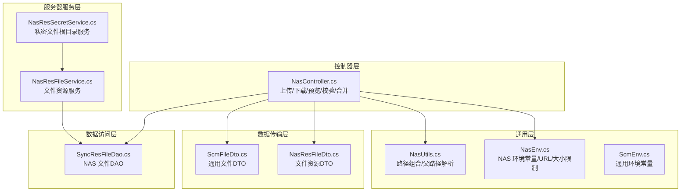
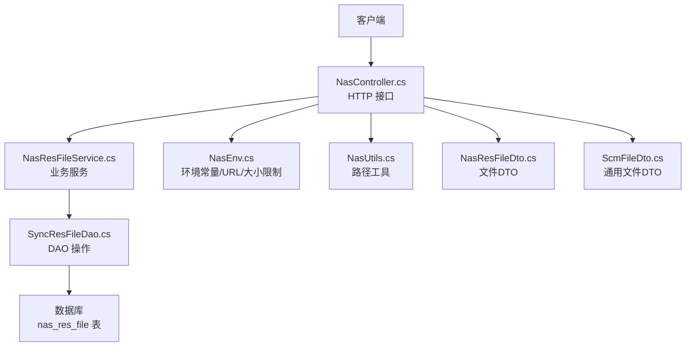
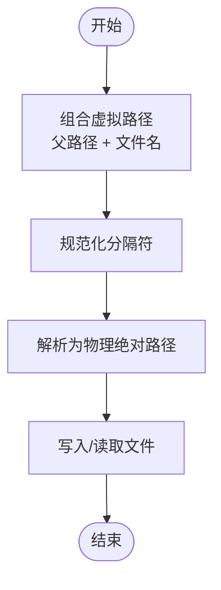
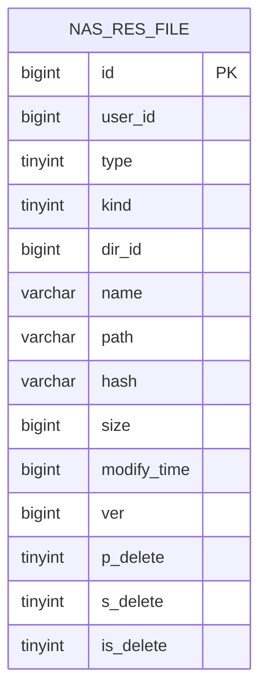
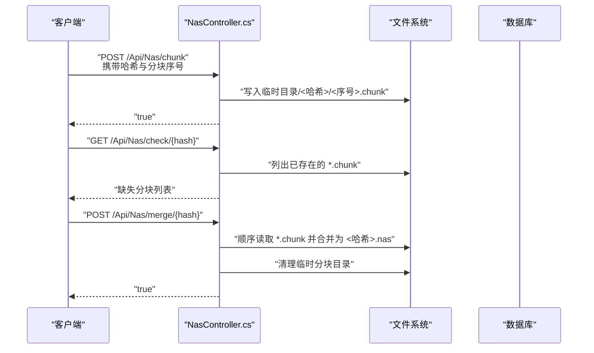
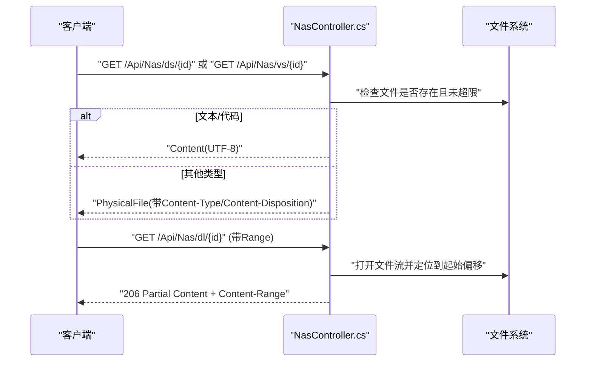
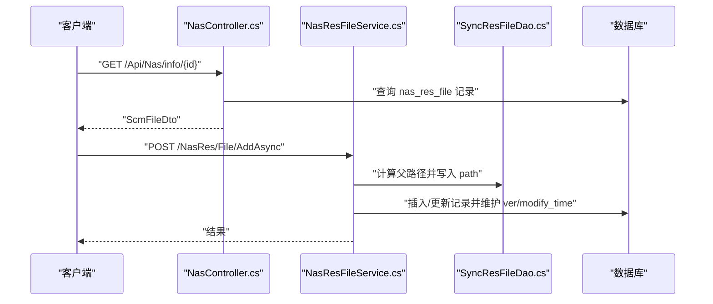
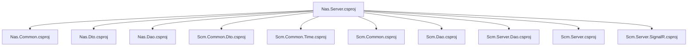

# 文件管理系统

<cite>
**本文引用的文件**
- [Scm.Net\Controllers\NasController.cs](file://Scm.Net/Controllers/NasController.cs)
- [Nas.Common\NasEnv.cs](file://Nas.Common/NasEnv.cs)
- [Nas.Common\NasUtils.cs](file://Nas.Common/NasUtils.cs)
- [Nas.Dto\Res\NasResFileDto.cs](file://Nas.Dto/Res/NasResFileDto.cs)
- [Nas.Dao\Sync\SyncResFileDao.cs](file://Nas.Dao/Sync/SyncResFileDao.cs)
- [Nas.Server\Res\NasResFileService.cs](file://Nas.Server/Res/NasResFileService.cs)
- [Nas.Server\Res\NasResSecretService.cs](file://Nas.Server/Res/NasResSecretService.cs)
- [Scm.Common.Dto\Dto\ScmFileDto.cs](file://Scm.Common.Dto/Dto/ScmFileDto.cs)
- [Scm.Common\ScmEnv.cs](file://Scm.Common/ScmEnv.cs)
- [Nas.Server\Nas.Server.csproj](file://Nas.Server/Nas.Server.csproj)
- [Nas.Common\Nas.Common.csproj](file://Nas.Common/Nas.Common.csproj)
- [Nas.Dto\Nas.Dto.csproj](file://Nas.Dto/Nas.Dto.csproj)
- [Nas.Dao\Nas.Dao.csproj](file://Nas.Dao/Nas.Dao.csproj)
</cite>

## 目录
1. [简介](#简介)
2. [项目结构](#项目结构)
3. [核心组件](#核心组件)
4. [架构总览](#架构总览)
5. [详细组件分析](#详细组件分析)
6. [依赖关系分析](#依赖关系分析)
7. [性能与最佳实践](#性能与最佳实践)
8. [故障排查指南](#故障排查指南)
9. [结论](#结论)
10. [附录](#附录)

## 简介
本文件管理系统围绕 NAS 协议构建，提供文件存储、哈希校验、分块上传与断点续传、文件预览与下载、以及基于数据库的元数据管理能力。系统通过统一的环境配置与工具类，规范文件路径生成、内容校验与版本管理，并以清晰的 API 分层对外提供服务。

## 项目结构
系统采用多项目分层组织，核心模块包括：
- 控制器层：Scm.Net\Controllers 提供 NAS 相关的 HTTP 接口（上传、下载、预览、校验、合并等）
- 通用层：Nas.Common 提供 NAS 环境常量、路径工具等
- 数据传输层：Nas.Dto 定义文件资源 DTO
- 数据访问层：Nas.Dao 定义 NAS 文件 DAO 及同步相关实体
- 服务器服务层：Nas.Server/Res 提供文件资源的业务服务（分页、查询、编辑、删除等）
- 通用基础：Scm.Common/Scm.Common.Dto 提供通用环境、DTO 基类与通用文件 DTO

图表来源
- [Scm.Net\Controllers\NasController.cs:1-469](file://Scm.Net/Controllers/NasController.cs#L1-L469)
- [Nas.Common\NasEnv.cs:1-222](file://Nas.Common/NasEnv.cs#L1-L222)
- [Nas.Common\NasUtils.cs:1-48](file://Nas.Common/NasUtils.cs#L1-L48)
- [Nas.Dto\Res\NasResFileDto.cs:1-61](file://Nas.Dto/Res/NasResFileDto.cs#L1-L61)
- [Scm.Common.Dto\Dto\ScmFileDto.cs:1-14](file://Scm.Common.Dto/Dto/ScmFileDto.cs#L1-L14)
- [Nas.Dao\Sync\SyncResFileDao.cs:1-119](file://Nas.Dao/Sync/SyncResFileDao.cs#L1-L119)
- [Nas.Server\Res\NasResFileService.cs:1-259](file://Nas.Server/Res/NasResFileService.cs#L1-L259)
- [Nas.Server\Res\NasResSecretService.cs:1-25](file://Nas.Server/Res/NasResSecretService.cs#L1-L25)

章节来源
- [Nas.Server\Nas.Server.csproj:1-43](file://Nas.Server/Nas.Server.csproj#L1-L43)
- [Nas.Common\Nas.Common.csproj:1-20](file://Nas.Common/Nas.Common.csproj#L1-L20)
- [Nas.Dto\Nas.Dto.csproj:1-17](file://Nas.Dto/Nas.Dto.csproj#L1-L17)
- [Nas.Dao\Nas.Dao.csproj:1-32](file://Nas.Dao/Nas.Dao.csproj#L1-L32)

## 核心组件
- NAS 环境与常量：定义服务端接口路径、块大小限制、虚拟路径标签、系统专用目录等
- 路径工具：提供路径组合与父路径解析，确保跨平台兼容
- 文件 DTO：描述文件类型、子类型、目录 ID、名称、路径、哈希、大小、修改时间与版本
- 文件 DAO：映射 nas_res_file 表，包含用户 ID、类型、子类型、目录 ID、名称、路径、哈希、大小、修改时间、版本及软删除标记
- 控制器：提供文件信息、小/大文件下载、文件预览、小文件上传、分块上传、上传校验、分块合并等接口
- 服务器服务：提供文件资源的分页查询、列表查询、新增、更新、删除、选项等业务逻辑

章节来源
- [Nas.Common\NasEnv.cs:1-222](file://Nas.Common/NasEnv.cs#L1-L222)
- [Nas.Common\NasUtils.cs:1-48](file://Nas.Common/NasUtils.cs#L1-L48)
- [Nas.Dto\Res\NasResFileDto.cs:1-61](file://Nas.Dto/Res/NasResFileDto.cs#L1-L61)
- [Nas.Dao\Sync\SyncResFileDao.cs:1-119](file://Nas.Dao/Sync/SyncResFileDao.cs#L1-L119)
- [Scm.Net\Controllers\NasController.cs:1-469](file://Scm.Net/Controllers/NasController.cs#L1-L469)
- [Nas.Server\Res\NasResFileService.cs:1-259](file://Nas.Server/Res/NasResFileService.cs#L1-L259)

## 架构总览
NAS 协议在本系统中的实现遵循“控制器-服务-数据访问-数据库”的分层设计。控制器负责接收请求、参数校验与响应输出；服务层封装业务规则与数据转换；DAO 层映射数据库表结构；通用层提供环境与工具支撑。

图表来源
- [Scm.Net\Controllers\NasController.cs:1-469](file://Scm.Net/Controllers/NasController.cs#L1-L469)
- [Nas.Server\Res\NasResFileService.cs:1-259](file://Nas.Server/Res/NasResFileService.cs#L1-L259)
- [Nas.Dao\Sync\SyncResFileDao.cs:1-119](file://Nas.Dao/Sync/SyncResFileDao.cs#L1-L119)
- [Nas.Common\NasEnv.cs:1-222](file://Nas.Common/NasEnv.cs#L1-L222)
- [Nas.Common\NasUtils.cs:1-48](file://Nas.Common/NasUtils.cs#L1-L48)
- [Nas.Dto\Res\NasResFileDto.cs:1-61](file://Nas.Dto/Res/NasResFileDto.cs#L1-L61)
- [Scm.Common.Dto\Dto\ScmFileDto.cs:1-14](file://Scm.Common.Dto/Dto/ScmFileDto.cs#L1-L14)

## 详细组件分析

### NAS 协议与文件存储机制
- 虚拟路径与根目录：通过虚拟路径标识与系统专用目录常量，统一管理最近、常用、收藏、下载、设备、私密、共享、标签、文档、应用、回收站等节点
- 文件路径生成：使用路径工具对父路径与文件名进行组合，保证跨平台分隔符一致
- 存储位置：控制器根据用户编码与文件路径拼接物理存储位置，结合环境配置的根路径进行定位

图表来源
- [Nas.Common\NasUtils.cs:22-45](file://Nas.Common/NasUtils.cs#L22-L45)
- [Scm.Common\ScmEnv.cs:35-42](file://Scm.Common/ScmEnv.cs#L35-L42)
- [Nas.Common\NasEnv.cs:174-219](file://Nas.Common/NasEnv.cs#L174-L219)

章节来源
- [Nas.Common\NasEnv.cs:174-219](file://Nas.Common/NasEnv.cs#L174-L219)
- [Nas.Common\NasUtils.cs:1-48](file://Nas.Common/NasUtils.cs#L1-L48)
- [Scm.Common\ScmEnv.cs:35-42](file://Scm.Common/ScmEnv.cs#L35-L42)

### 哈希验证系统
- 哈希字段：文件 DAO 与 DTO 均包含 hash 字段，用于标识文件内容摘要
- 版本管理：DAO 在创建与更新时维护版本号，创建时初始为 1，更新时自增
- 控制器校验：上传接口对文件名与哈希进行正则校验，确保命名规范与完整性

图表来源
- [Nas.Dao\Sync\SyncResFileDao.cs:12-119](file://Nas.Dao/Sync/SyncResFileDao.cs#L12-L119)

章节来源
- [Nas.Dao\Sync\SyncResFileDao.cs:55-76](file://Nas.Dao/Sync/SyncResFileDao.cs#L55-L76)
- [Nas.Dto\Res\NasResFileDto.cs:39-58](file://Nas.Dto/Res/NasResFileDto.cs#L39-L58)
- [Scm.Net\Controllers\NasController.cs:317-322](file://Scm.Net/Controllers/NasController.cs#L317-L322)
- [Scm.Net\Controllers\NasController.cs:365-370](file://Scm.Net/Controllers/NasController.cs#L365-L370)

### 分块上传与断点续传
- 分块命名规范：分块文件名需满足“数字 + .chunk”，哈希作为临时目录名
- 上传流程：先进行分块上传，再调用校验接口确认缺失分块，最后执行合并操作
- 断点续传：下载支持 Range 请求，服务端按起止范围返回 206 Partial Content

图表来源
- [Scm.Net\Controllers\NasController.cs:349-464](file://Scm.Net/Controllers/NasController.cs#L349-L464)

章节来源
- [Scm.Net\Controllers\NasController.cs:349-464](file://Scm.Net/Controllers/NasController.cs#L349-L464)

### 文件下载与预览
- 小文件下载：当文件小于等于块大小限制时，直接物理文件返回
- 大文件下载：支持 Range 请求，返回 206 Partial Content，实现断点续传
- 预览：文本/代码文件以内联方式返回并设置 UTF-8 编码；其他类型以附件方式返回并设置 MIME 类型

图表来源
- [Scm.Net\Controllers\NasController.cs:164-296](file://Scm.Net/Controllers/NasController.cs#L164-L296)

章节来源
- [Scm.Net\Controllers\NasController.cs:164-296](file://Scm.Net/Controllers/NasController.cs#L164-L296)

### 文件信息与元数据管理
- 文件信息接口：根据文件 ID 查询元数据，包括名称、路径、大小、哈希等
- 服务器服务：提供分页查询、列表查询、新增、更新、删除、选项等能力；新增/更新时计算并写入路径，维护修改时间与版本

图表来源
- [Scm.Net\Controllers\NasController.cs:50-90](file://Scm.Net/Controllers/NasController.cs#L50-L90)
- [Nas.Server\Res\NasResFileService.cs:159-191](file://Nas.Server/Res/NasResFileService.cs#L159-L191)
- [Nas.Server\Res\NasResFileService.cs:198-229](file://Nas.Server/Res/NasResFileService.cs#L198-L229)

章节来源
- [Scm.Net\Controllers\NasController.cs:50-90](file://Scm.Net/Controllers/NasController.cs#L50-L90)
- [Nas.Server\Res\NasResFileService.cs:159-191](file://Nas.Server/Res/NasResFileService.cs#L159-L191)
- [Nas.Server\Res\NasResFileService.cs:198-229](file://Nas.Server/Res/NasResFileService.cs#L198-L229)

### 私密文件根目录
- 私密文件根目录服务重写根目录 ID 的获取逻辑，从数据库中查找特定路径对应的目录 ID，确保私密文件的隔离与正确路由

章节来源
- [Nas.Server\Res\NasResSecretService.cs:14-22](file://Nas.Server/Res/NasResSecretService.cs#L14-L22)

## 依赖关系分析
- 项目引用：Nas.Server 依赖 Nas.Common、Nas.Dto、Nas.Dao 以及若干通用项目，形成清晰的分层依赖
- 外部库：使用 SqlSugarCore 进行 ORM 操作，MiniExcel 用于电子表格处理，SignalR 用于实时通信
- 引用程序集：通过显式引用通用库（如 Scm.Common.Text、Scm.Uid），确保运行时可用性

图表来源
- [Nas.Server\Nas.Server.csproj:17-28](file://Nas.Server/Nas.Server.csproj#L17-L28)

章节来源
- [Nas.Server\Nas.Server.csproj:1-43](file://Nas.Server/Nas.Server.csproj#L1-L43)
- [Nas.Common\Nas.Common.csproj:1-20](file://Nas.Common/Nas.Common.csproj#L1-L20)
- [Nas.Dto\Nas.Dto.csproj:1-17](file://Nas.Dto/Nas.Dto.csproj#L1-L17)
- [Nas.Dao\Nas.Dao.csproj:1-32](file://Nas.Dao/Nas.Dao.csproj#L1-L32)

## 性能与最佳实践
- 分块大小与并发控制：通过环境常量统一管理块大小，建议客户端按固定大小切分文件，避免过小导致过多请求或过大导致内存压力
- 内存管理：分块上传采用流式写入，避免一次性加载整个文件到内存；下载时使用物理文件返回或缓冲流按需读取
- 并发与锁：合并阶段建议加分布式锁或原子操作，防止重复合并与竞态条件
- 哈希与校验：上传前进行哈希与命名校验，减少无效 IO；下载前可校验文件存在性与大小限制，避免不必要的磁盘访问
- 版本控制：利用 DAO 的版本号与修改时间，实现轻量级版本追踪与冲突处理

## 故障排查指南
- 文件不存在：当查询不到对应记录或物理文件不存在时，控制器返回空或错误提示，需检查文件 ID 与用户编码是否匹配
- 文件过大：小文件下载/预览接口对文件大小有限制，超过阈值会拒绝处理，应改用大文件下载接口
- 命名与格式错误：分块文件名需满足“数字 + .chunk”，上传文件名需满足“64 位哈希 + .nas”，哈希需为 64 位十六进制字符串
- 断点续传失败：确认客户端 Range 请求格式正确，服务端返回的 Content-Range 与 Content-Length 匹配
- 合并异常：若临时目录不存在或分块缺失，需先执行上传校验并补齐缺失分块后再合并

章节来源
- [Scm.Net\Controllers\NasController.cs:189-197](file://Scm.Net/Controllers/NasController.cs#L189-L197)
- [Scm.Net\Controllers\NasController.cs:317-322](file://Scm.Net/Controllers/NasController.cs#L317-L322)
- [Scm.Net\Controllers\NasController.cs:365-370](file://Scm.Net/Controllers/NasController.cs#L365-L370)
- [Scm.Net\Controllers\NasController.cs:396-421](file://Scm.Net/Controllers/NasController.cs#L396-L421)
- [Scm.Net\Controllers\NasController.cs:428-464](file://Scm.Net/Controllers/NasController.cs#L428-L464)

## 结论
本系统以 NAS 协议为核心，结合统一的环境常量、路径工具与数据库模型，实现了从文件上传、分块与合并、到下载与预览的完整闭环。通过清晰的分层设计与严格的参数校验，系统在保证易用性的同时兼顾了安全性与可维护性。建议在生产环境中配合缓存、限流与监控策略，进一步提升稳定性与性能。

## 附录

### API 接口清单
- 获取文件信息
  - 方法：GET
  - 路径：/Api/Nas/info/{id}
  - 返回：文件名称、路径、大小、哈希
- 文件查看（小文件）
  - 方法：GET
  - 路径：/Api/Nas/vs/{id}
  - 返回：文本/代码内容或物理文件（内联）
- 小文件下载
  - 方法：GET
  - 路径：/Api/Nas/ds/{id}
  - 返回：物理文件（附件）
- 大文件下载（断点续传）
  - 方法：GET
  - 路径：/Api/Nas/dl/{id}
  - 请求头：Range
  - 返回：206 Partial Content 或物理文件
- 小文件上传
  - 方法：POST
  - 路径：/Api/Nas/file
  - 参数：ScmUploadRequest（文件、文件名）
  - 返回：布尔值
- 分块上传
  - 方法：POST
  - 路径：/Api/Nas/chunk
  - 参数：ScmUploadRequest（文件、哈希、分块文件名）
  - 返回：布尔值
- 上传校验
  - 方法：GET
  - 路径：/Api/Nas/check/{hash}
  - 返回：缺失的分块文件名列表
- 分块合并
  - 方法：POST
  - 路径：/Api/Nas/merge/{hash}
  - 返回：布尔值

章节来源
- [Scm.Net\Controllers\NasController.cs:50-90](file://Scm.Net/Controllers/NasController.cs#L50-L90)
- [Scm.Net\Controllers\NasController.cs:98-154](file://Scm.Net/Controllers/NasController.cs#L98-L154)
- [Scm.Net\Controllers\NasController.cs:164-212](file://Scm.Net/Controllers/NasController.cs#L164-L212)
- [Scm.Net\Controllers\NasController.cs:220-296](file://Scm.Net/Controllers/NasController.cs#L220-L296)
- [Scm.Net\Controllers\NasController.cs:301-339](file://Scm.Net/Controllers/NasController.cs#L301-L339)
- [Scm.Net\Controllers\NasController.cs:349-389](file://Scm.Net/Controllers/NasController.cs#L349-L389)
- [Scm.Net\Controllers\NasController.cs:396-421](file://Scm.Net/Controllers/NasController.cs#L396-L421)
- [Scm.Net\Controllers\NasController.cs:428-464](file://Scm.Net/Controllers/NasController.cs#L428-L464)