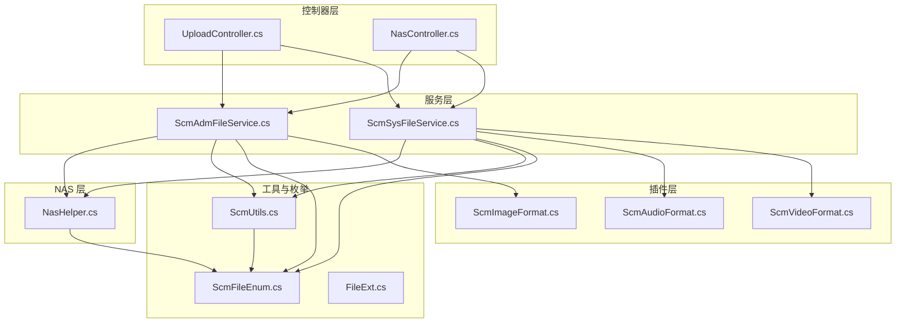
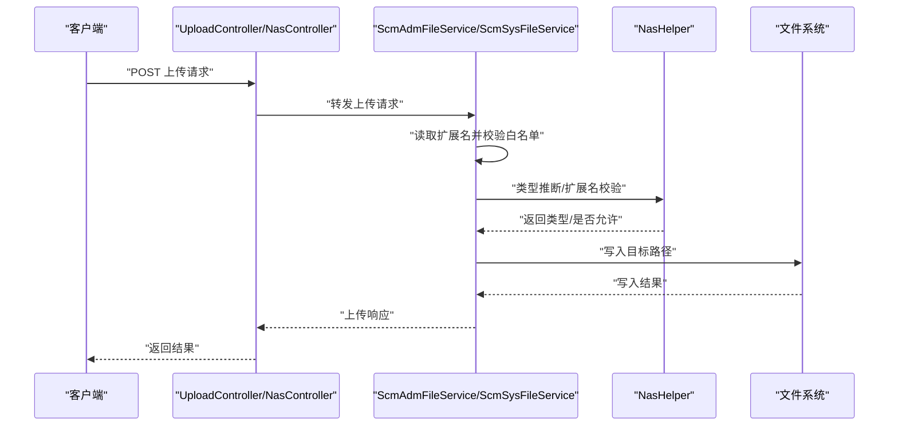
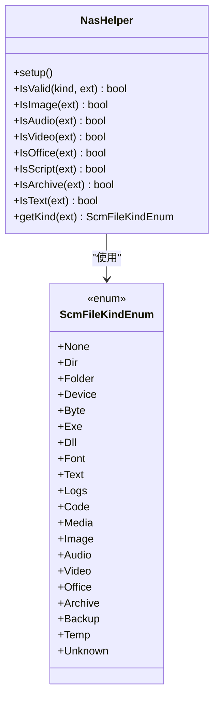
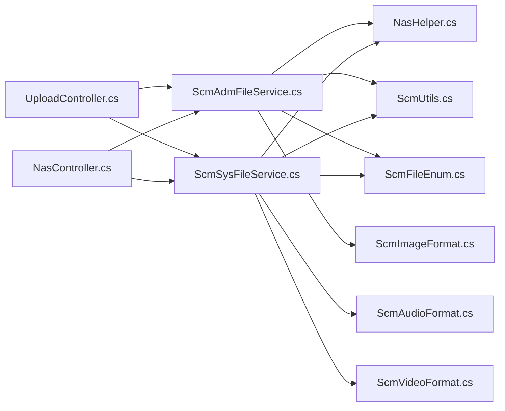

# 文件类型支持

<cite>
**本文引用的文件**
- [NasHelper.cs](file://Nas.Server/NasHelper.cs)
- [ScmFileEnum.cs](file://Scm.Common/Enums/ScmFileEnum.cs)
- [ScmAdmFileService.cs](file://Scm.Core/Adm/Files/ScmAdmFileService.cs)
- [ScmSysFileService.cs](file://Scm.Core/Sys/Files/ScmSysFileService.cs)
- [UploadController.cs](file://Scm.Net/Controllers/UploadController.cs)
- [NasController.cs](file://Scm.Net/Controllers/NasController.cs)
- [ScmUtils.cs](file://Scm.Common/Utils/ScmUtils.cs)
- [ScmImageFormat.cs](file://Scm.Plugin.Image/ScmImageFormat.cs)
- [ScmAudioFormat.cs](file://Scm.Plugin.Audio/ScmAudioFormat.cs)
- [ScmVideoFormat.cs](file://Scm.Plugin.Video/ScmVideoFormat.cs)
- [FileExt.cs](file://Scm.Plugin/FileExt.cs)
</cite>

## 目录
1. [简介](#简介)
2. [项目结构](#项目结构)
3. [核心组件](#核心组件)
4. [架构总览](#架构总览)
5. [详细组件分析](#详细组件分析)
6. [依赖关系分析](#依赖关系分析)
7. [性能考量](#性能考量)
8. [故障排查指南](#故障排查指南)
9. [结论](#结论)
10. [附录](#附录)

## 简介
本文件类型支持技术文档面向“文件类型分类、检测与处理”主题，覆盖以下关键目标：
- 文件类型分类：文档、图片、音频、视频、压缩（归档）、代码、二进制、日志、备份与临时等类别
- 检测机制：基于扩展名的白名单校验、类型推断与安全检查
- 处理策略：上传、分段上传、摘要上传、预览支持、格式转换与安全检查
- 配置管理：允许的扩展名白名单、大小限制、存储路径策略
- 扩展指南：如何新增自定义文件类型与插件化扩展

## 项目结构
围绕文件类型支持的相关模块分布于多个子项目中：
- 枚举与工具层：定义文件类型枚举、通用工具与扩展名判定
- 服务层：提供上传、删除、列举等文件操作能力
- 控制器层：对外暴露上传接口，进行基础参数与大小校验
- 插件层：针对图片、音频、视频提供格式枚举与元数据能力
- NAS 层：集中维护文件类型与扩展名映射表，提供类型判定与查询

图表来源
- [UploadController.cs:1-46](file://Scm.Net/Controllers/UploadController.cs#L1-L46)
- [NasController.cs:361-398](file://Scm.Net/Controllers/NasController.cs#L361-L398)
- [ScmAdmFileService.cs:92-131](file://Scm.Core/Adm/Files/ScmAdmFileService.cs#L92-L131)
- [ScmSysFileService.cs:138-177](file://Scm.Core/Sys/Files/ScmSysFileService.cs#L138-L177)
- [NasHelper.cs:1-106](file://Nas.Server/NasHelper.cs#L1-L106)
- [ScmImageFormat.cs:1-13](file://Scm.Plugin.Image/ScmImageFormat.cs#L1-L13)
- [ScmAudioFormat.cs:1-11](file://Scm.Plugin.Audio/ScmAudioFormat.cs#L1-L11)
- [ScmVideoFormat.cs:1-6](file://Scm.Plugin.Video/ScmVideoFormat.cs#L1-L6)
- [ScmFileEnum.cs:20-77](file://Scm.Common/Enums/ScmFileEnum.cs#L20-L77)
- [ScmUtils.cs:242-272](file://Scm.Common/Utils/ScmUtils.cs#L242-L272)
- [FileExt.cs:1-9](file://Scm.Plugin/FileExt.cs#L1-L9)

章节来源
- [NasHelper.cs:1-106](file://Nas.Server/NasHelper.cs#L1-L106)
- [ScmFileEnum.cs:20-77](file://Scm.Common/Enums/ScmFileEnum.cs#L20-L77)

## 核心组件
- 文件类型枚举：统一定义文件种类（如图像、音频、视频、办公、归档、代码、文本、字节、媒体、备份、临时、未知）
- 扩展名映射与判定：NAS 层集中维护各类文件的扩展名集合，提供扩展名有效性校验与类型推断
- 上传服务：提供多种上传模式（整文件、分段、摘要），并结合白名单与大小限制进行安全检查
- 插件化格式：图片、音频、视频提供格式枚举，便于后续预览与转换
- 工具与辅助：通用工具负责根据扩展名推断文件类型，配合服务层完成文件列举与过滤

章节来源
- [ScmFileEnum.cs:20-77](file://Scm.Common/Enums/ScmFileEnum.cs#L20-L77)
- [NasHelper.cs:7-31](file://Nas.Server/NasHelper.cs#L7-L31)
- [ScmAdmFileService.cs:112-117](file://Scm.Core/Adm/Files/ScmAdmFileService.cs#L112-L117)
- [ScmSysFileService.cs:158-163](file://Scm.Core/Sys/Files/ScmSysFileService.cs#L158-L163)
- [ScmImageFormat.cs:1-13](file://Scm.Plugin.Image/ScmImageFormat.cs#L1-L13)
- [ScmAudioFormat.cs:1-11](file://Scm.Plugin.Audio/ScmAudioFormat.cs#L1-L11)
- [ScmVideoFormat.cs:1-6](file://Scm.Plugin.Video/ScmVideoFormat.cs#L1-L6)
- [ScmUtils.cs:242-272](file://Scm.Common/Utils/ScmUtils.cs#L242-L272)

## 架构总览
文件类型支持贯穿“控制器 -> 服务 -> NAS/工具 -> 插件”的调用链路，形成“扩展名白名单 + 类型推断 + 安全检查”的整体方案。

图表来源
- [UploadController.cs:26-46](file://Scm.Net/Controllers/UploadController.cs#L26-L46)
- [NasController.cs:361-398](file://Scm.Net/Controllers/NasController.cs#L361-L398)
- [ScmAdmFileService.cs:112-117](file://Scm.Core/Adm/Files/ScmAdmFileService.cs#L112-L117)
- [ScmSysFileService.cs:158-163](file://Scm.Core/Sys/Files/ScmSysFileService.cs#L158-L163)
- [NasHelper.cs:33-50](file://Nas.Server/NasHelper.cs#L33-L50)

## 详细组件分析

### 文件类型分类与扩展名映射
- 分类维度：字节文件、文本/日志、图像、音频、视频、媒体、办公、归档、代码、备份、临时、未知
- 映射表：NAS 层以枚举为键，维护扩展名列表；提供 IsValid、IsImage、IsAudio、IsVideo、IsOffice、IsScript、IsArchive、IsText、getKind 等便捷方法
- 类型推断：通过扩展名在映射表中查找归属类别，用于文件列举与过滤

图表来源
- [NasHelper.cs:7-104](file://Nas.Server/NasHelper.cs#L7-L104)
- [ScmFileEnum.cs:20-77](file://Scm.Common/Enums/ScmFileEnum.cs#L20-L77)

章节来源
- [NasHelper.cs:9-31](file://Nas.Server/NasHelper.cs#L9-L31)
- [ScmFileEnum.cs:20-77](file://Scm.Common/Enums/ScmFileEnum.cs#L20-L77)

### 文件类型检测机制
- 扩展名验证：服务层在上传前提取扩展名，与白名单进行匹配
- 类型推断：工具层根据扩展名推断文件类型，用于列举与过滤
- 安全检查：控制器层对文件大小进行限制，服务层对扩展名进行白名单校验

图表来源
- [ScmAdmFileService.cs:112-117](file://Scm.Core/Adm/Files/ScmAdmFileService.cs#L112-L117)
- [ScmSysFileService.cs:158-163](file://Scm.Core/Sys/Files/ScmSysFileService.cs#L158-L163)
- [UploadController.cs:39-44](file://Scm.Net/Controllers/UploadController.cs#L39-L44)
- [NasController.cs:361-377](file://Scm.Net/Controllers/NasController.cs#L361-L377)

章节来源
- [ScmAdmFileService.cs:112-117](file://Scm.Core/Adm/Files/ScmAdmFileService.cs#L112-L117)
- [ScmSysFileService.cs:158-163](file://Scm.Core/Sys/Files/ScmSysFileService.cs#L158-L163)
- [UploadController.cs:39-44](file://Scm.Net/Controllers/UploadController.cs#L39-L44)
- [NasController.cs:361-377](file://Scm.Net/Controllers/NasController.cs#L361-L377)

### 不同类型文件的处理策略
- 图片：支持常见格式，可进行缩略图、水印、翻转等处理（由插件层提供能力）
- 音频：支持常见格式，可读取元数据（由插件层提供能力）
- 视频：可进行格式枚举与后续处理（由插件层提供能力）
- 办公/文档：按扩展名白名单控制上传，支持在线预览（需前端与后端协同）
- 压缩包：按扩展名白名单控制上传，支持解压策略（需后端实现）
- 文本/日志：按扩展名白名单控制上传，支持在线查看
- 代码：按扩展名白名单控制上传，支持语法高亮（需前端支持）

章节来源
- [ScmImageFormat.cs:1-13](file://Scm.Plugin.Image/ScmImageFormat.cs#L1-L13)
- [ScmAudioFormat.cs:1-11](file://Scm.Plugin.Audio/ScmAudioFormat.cs#L1-L11)
- [ScmVideoFormat.cs:1-6](file://Scm.Plugin.Video/ScmVideoFormat.cs#L1-L6)
- [ScmFileEnum.cs:65-69](file://Scm.Common/Enums/ScmFileEnum.cs#L65-L69)

### 文件类型配置管理
- 允许的扩展名列表：集中维护于 NAS 层映射表，可通过扩展映射表进行增删改
- 白名单策略：服务层在上传时读取安全配置中的白名单字符串，按分隔符拆分后匹配
- 大小限制：控制器层对单文件大小进行限制，防止异常体积文件进入系统
- 存储策略：服务层根据请求路径生成目标目录，确保目录存在后写入文件

章节来源
- [NasHelper.cs:16-30](file://Nas.Server/NasHelper.cs#L16-L30)
- [ScmAdmFileService.cs:246-256](file://Scm.Core/Adm/Files/ScmAdmFileService.cs#L246-L256)
- [ScmSysFileService.cs:290-299](file://Scm.Core/Sys/Files/ScmSysFileService.cs#L290-L299)
- [UploadController.cs:39-44](file://Scm.Net/Controllers/UploadController.cs#L39-L44)
- [NasController.cs:379-385](file://Scm.Net/Controllers/NasController.cs#L379-L385)

### 文件类型扩展指南与自定义添加
- 新增类型步骤
  1) 在枚举中新增类型：参考 ScmFileKindEnum 的定义方式，增加新枚举值
  2) 维护扩展名映射：在 NAS 层映射表中为新类型添加扩展名集合
  3) 上传白名单：在安全配置中补充新类型的扩展名到白名单字符串
  4) 服务层适配：如需特殊处理（如预览、转换），在对应服务层或插件层扩展
  5) 工具层联动：如需按扩展名推断新类型，更新工具层的推断逻辑
- 插件化扩展
  - 使用 FileExt 描述扩展名与描述信息
  - 通过插件层的格式枚举（如 ScmImageFormat、ScmAudioFormat、ScmVideoFormat）扩展预览与转换能力

章节来源
- [ScmFileEnum.cs:20-77](file://Scm.Common/Enums/ScmFileEnum.cs#L20-L77)
- [NasHelper.cs:16-30](file://Nas.Server/NasHelper.cs#L16-L30)
- [ScmAdmFileService.cs:246-256](file://Scm.Core/Adm/Files/ScmAdmFileService.cs#L246-L256)
- [ScmSysFileService.cs:290-299](file://Scm.Core/Sys/Files/ScmSysFileService.cs#L290-L299)
- [FileExt.cs:1-9](file://Scm.Plugin/FileExt.cs#L1-L9)

## 依赖关系分析
- 控制器依赖服务：UploadController 与 NasController 调用服务层完成上传
- 服务层依赖 NAS/工具：服务层在上传前进行白名单与大小检查，依赖 NAS 的类型判定与工具层的扩展名推断
- 插件层依赖工具层：插件层的格式枚举与处理能力服务于上层的预览与转换需求

图表来源
- [UploadController.cs:1-46](file://Scm.Net/Controllers/UploadController.cs#L1-L46)
- [NasController.cs:361-398](file://Scm.Net/Controllers/NasController.cs#L361-L398)
- [ScmAdmFileService.cs:92-131](file://Scm.Core/Adm/Files/ScmAdmFileService.cs#L92-L131)
- [ScmSysFileService.cs:138-177](file://Scm.Core/Sys/Files/ScmSysFileService.cs#L138-L177)
- [NasHelper.cs:1-106](file://Nas.Server/NasHelper.cs#L1-L106)
- [ScmUtils.cs:242-272](file://Scm.Common/Utils/ScmUtils.cs#L242-L272)
- [ScmFileEnum.cs:20-77](file://Scm.Common/Enums/ScmFileEnum.cs#L20-L77)
- [ScmImageFormat.cs:1-13](file://Scm.Plugin.Image/ScmImageFormat.cs#L1-L13)
- [ScmAudioFormat.cs:1-11](file://Scm.Plugin.Audio/ScmAudioFormat.cs#L1-L11)
- [ScmVideoFormat.cs:1-6](file://Scm.Plugin.Video/ScmVideoFormat.cs#L1-L6)

章节来源
- [ScmAdmFileService.cs:92-131](file://Scm.Core/Adm/Files/ScmAdmFileService.cs#L92-L131)
- [ScmSysFileService.cs:138-177](file://Scm.Core/Sys/Files/ScmSysFileService.cs#L138-L177)
- [NasHelper.cs:1-106](file://Nas.Server/NasHelper.cs#L1-L106)
- [ScmUtils.cs:242-272](file://Scm.Common/Utils/ScmUtils.cs#L242-L272)

## 性能考量
- 扩展名白名单采用内存字典与集合，查询复杂度为 O(1)，适合高频上传场景
- 上传流程尽量避免重复 IO，先校验再落盘，减少无效写入
- 对大文件建议使用分段上传或摘要上传，降低单次请求压力
- 类型推断与列举逻辑应避免对大量文件进行重复扫描，必要时引入缓存或增量策略

## 故障排查指南
- 上传失败：检查扩展名是否在白名单中；确认文件大小未超过限制；核对目标路径权限
- 类型识别异常：确认扩展名映射表是否包含该类型；检查扩展名大小写与前缀处理
- 预览/转换失败：确认插件层格式枚举是否覆盖该类型；检查前端渲染与后端转换链路

章节来源
- [ScmAdmFileService.cs:112-117](file://Scm.Core/Adm/Files/ScmAdmFileService.cs#L112-L117)
- [ScmSysFileService.cs:158-163](file://Scm.Core/Sys/Files/ScmSysFileService.cs#L158-L163)
- [UploadController.cs:39-44](file://Scm.Net/Controllers/UploadController.cs#L39-L44)
- [NasController.cs:361-377](file://Scm.Net/Controllers/NasController.cs#L361-L377)
- [NasHelper.cs:33-50](file://Nas.Server/NasHelper.cs#L33-L50)

## 结论
本系统通过“集中映射 + 白名单 + 类型推断 + 安全检查”的组合机制，实现了对多类型文件的统一支持。NAS 层的扩展名映射与服务层的安全策略共同保障了上传的安全性与可控性；插件层的格式枚举为后续的预览与转换提供了扩展点。通过标准化的扩展指南，可以快速添加新的文件类型与处理能力。

## 附录
- 关键流程参考
  - 上传整文件：[ScmAdmFileService.cs:112-117](file://Scm.Core/Adm/Files/ScmAdmFileService.cs#L112-L117)、[ScmSysFileService.cs:158-163](file://Scm.Core/Sys/Files/ScmSysFileService.cs#L158-L163)
  - 分段上传：[ScmAdmFileService.cs:154-159](file://Scm.Core/Adm/Files/ScmAdmFileService.cs#L154-L159)、[ScmSysFileService.cs:196-199](file://Scm.Core/Sys/Files/ScmSysFileService.cs#L196-L199)
  - 摘要上传：[NasController.cs:379-385](file://Scm.Net/Controllers/NasController.cs#L379-L385)
  - 类型推断：[ScmUtils.cs:242-272](file://Scm.Common/Utils/ScmUtils.cs#L242-L272)、[NasHelper.cs:87-104](file://Nas.Server/NasHelper.cs#L87-L104)