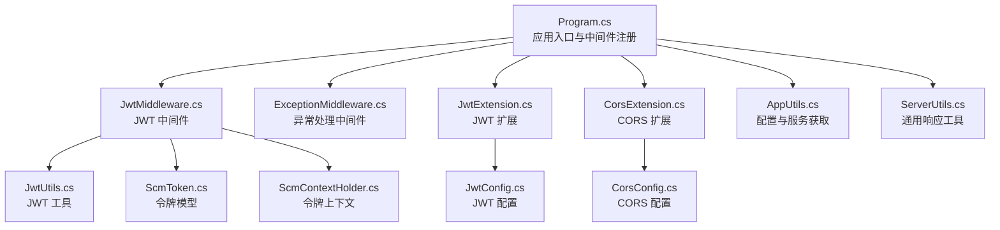
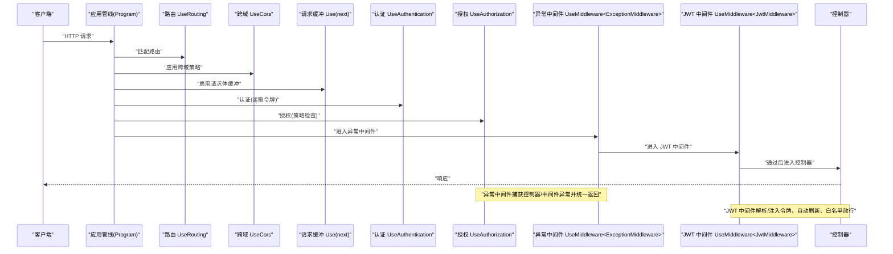
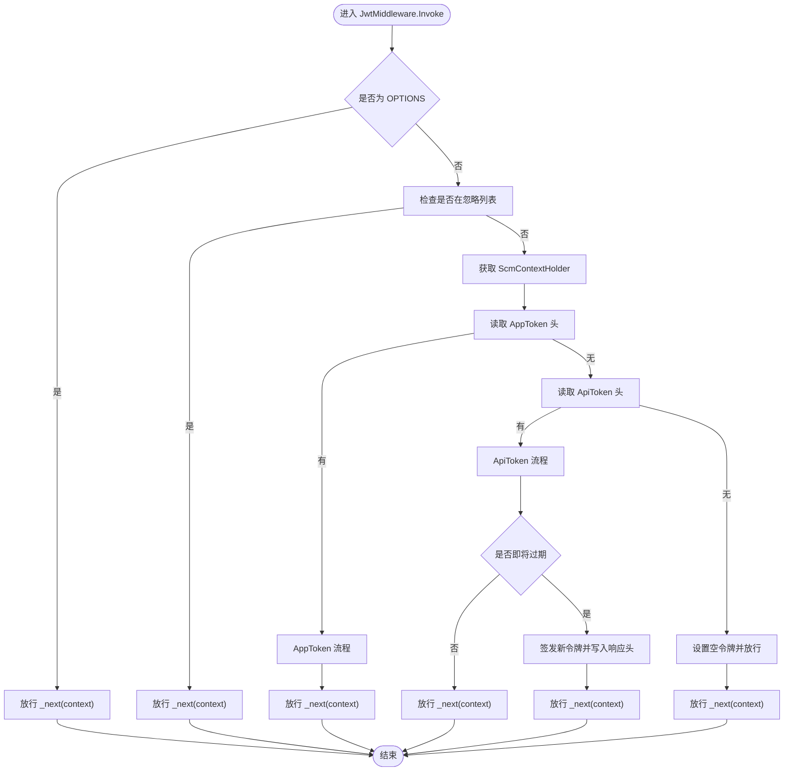
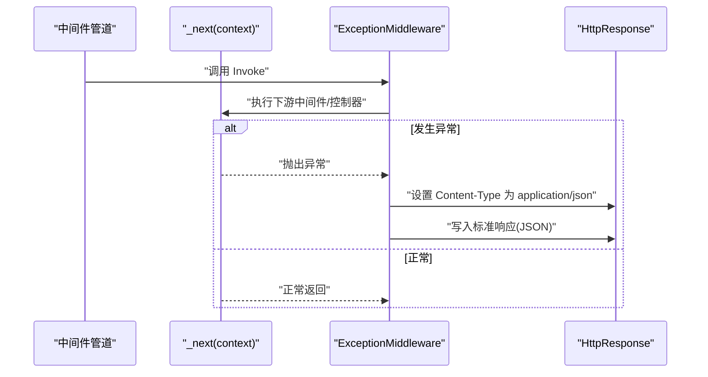
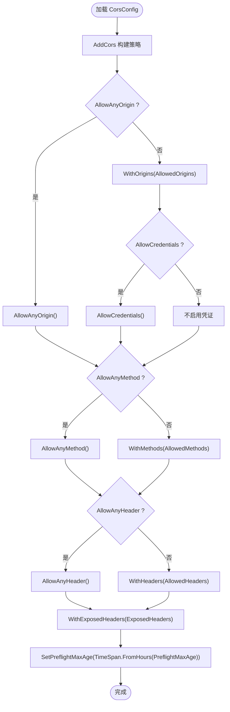
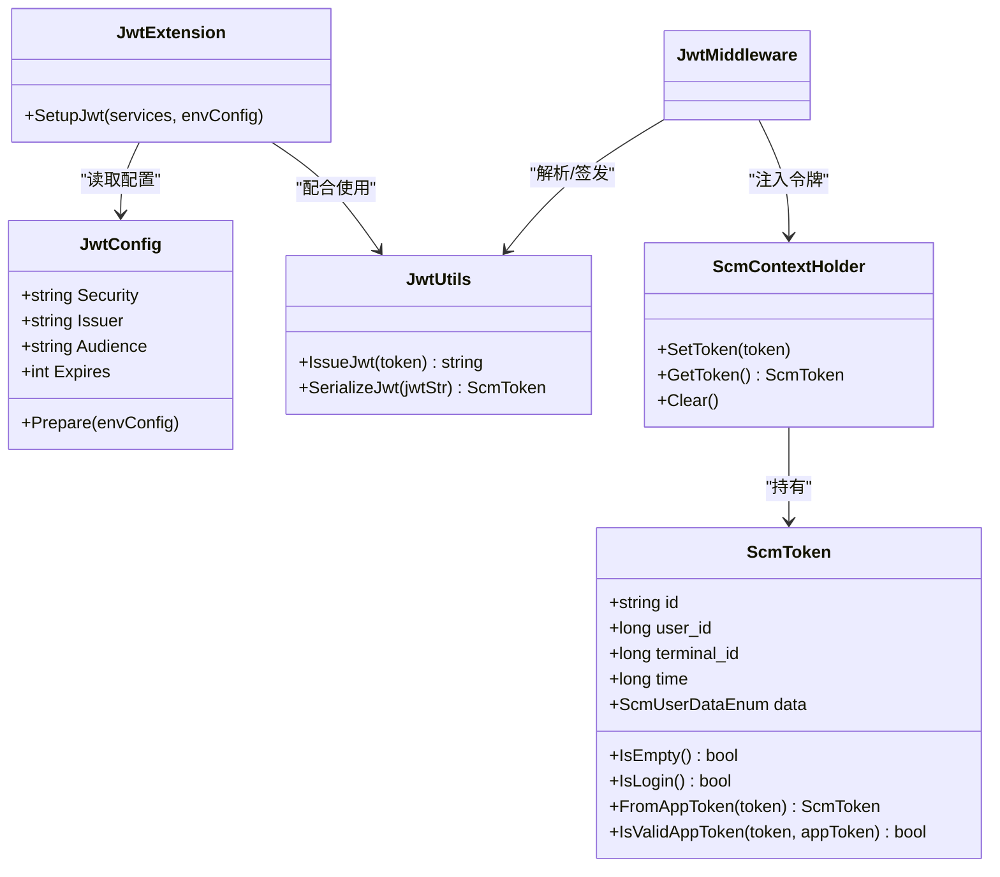
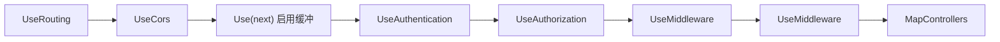

# 中间件配置

<cite>
**本文引用的文件**
- [Program.cs](file://Scm.Net/Program.cs)
- [JwtMiddleware.cs](file://Scm.Core/Configure/Middleware/JwtMiddleware.cs)
- [ExceptionMiddleware.cs](file://Scm.Core/Configure/Middleware/ExceptionMiddleware.cs)
- [JwtExtension.cs](file://Scm.Server/Extensions/JwtExtension.cs)
- [CorsExtension.cs](file://Scm.Server/Extensions/CorsExtension.cs)
- [JwtConfig.cs](file://Scm.Server/Config/JwtConfig.cs)
- [CorsConfig.cs](file://Scm.Server/Config/CorsConfig.cs)
- [JwtUtils.cs](file://Scm.Server/Utils/JwtUtils.cs)
- [ScmToken.cs](file://Scm.Server/Token/ScmToken.cs)
- [ScmContextHolder.cs](file://Scm.Server/Token/ScmContextHolder.cs)
- [ServerUtils.cs](file://Scm.Server/Utils/ServerUtils.cs)
- [AppUtils.cs](file://Scm.Server/Utils/AppUtils.cs)
</cite>

## 目录
1. [简介](#简介)
2. [项目结构](#项目结构)
3. [核心组件](#核心组件)
4. [架构总览](#架构总览)
5. [详细组件分析](#详细组件分析)
6. [依赖关系分析](#依赖关系分析)
7. [性能考虑](#性能考虑)
8. [故障排除指南](#故障排除指南)
9. [结论](#结论)
10. [附录](#附录)

## 简介
本文件面向 Scm.Net 的中间件配置，聚焦三类关键能力：
- JWT 中间件：解析与注入令牌、自动刷新、忽略规则与预检放行。
- 异常处理中间件：统一捕获异常、构造标准响应格式。
- CORS 配置：跨域策略、预检缓存与安全限制。

同时给出中间件注册顺序的最佳实践、性能优化建议、调试技巧与常见问题排查方法，并提供可直接参考的配置要点与集成步骤。

## 项目结构
围绕中间件配置的关键位置如下：
- 应用入口与中间件注册：Program.cs
- 自定义中间件：JwtMiddleware.cs、ExceptionMiddleware.cs
- 安全扩展：JwtExtension.cs、CorsExtension.cs
- 配置模型：JwtConfig.cs、CorsConfig.cs
- 工具与上下文：JwtUtils.cs、ScmToken.cs、ScmContextHolder.cs、AppUtils.cs、ServerUtils.cs

图表来源
- [Program.cs:174-258](file://Scm.Net/Program.cs#L174-L258)
- [JwtMiddleware.cs:1-180](file://Scm.Core/Configure/Middleware/JwtMiddleware.cs#L1-L180)
- [ExceptionMiddleware.cs:1-41](file://Scm.Core/Configure/Middleware/ExceptionMiddleware.cs#L1-L41)
- [JwtExtension.cs:1-73](file://Scm.Server/Extensions/JwtExtension.cs#L1-L73)
- [CorsExtension.cs:1-59](file://Scm.Server/Extensions/CorsExtension.cs#L1-L59)
- [JwtConfig.cs:1-48](file://Scm.Server/Config/JwtConfig.cs#L1-L48)
- [CorsConfig.cs:1-49](file://Scm.Server/Config/CorsConfig.cs#L1-L49)
- [JwtUtils.cs:1-88](file://Scm.Server/Utils/JwtUtils.cs#L1-L88)
- [ScmToken.cs:1-99](file://Scm.Server/Token/ScmToken.cs#L1-L99)
- [ScmContextHolder.cs:1-45](file://Scm.Server/Token/ScmContextHolder.cs#L1-L45)
- [AppUtils.cs:1-46](file://Scm.Server/Utils/AppUtils.cs#L1-L46)
- [ServerUtils.cs:1-121](file://Scm.Server/Utils/ServerUtils.cs#L1-L121)

章节来源
- [Program.cs:174-258](file://Scm.Net/Program.cs#L174-L258)

## 核心组件
- JWT 中间件：负责在请求进入业务逻辑之前解析并注入令牌，支持 API 令牌与应用令牌两种模式；对 OPTIONS 预检请求放行；对白名单路径跳过校验；对即将过期的会话自动刷新并返回新令牌头。
- 异常处理中间件：捕获管道内抛出的异常，统一输出 JSON 格式的标准响应。
- CORS 扩展：基于配置构建跨域策略，支持通配与精确白名单、凭证、暴露头与预检缓存。
- JWT 扩展：注册认证与授权策略，配置签发者、受众、密钥与生命周期验证；提供角色策略。
- 工具与上下文：JwtUtils 提供签发与解析；ScmToken 定义令牌字段；ScmContextHolder 提供线程本地上下文存储；AppUtils 提供配置与服务获取；ServerUtils 提供统一响应构造。

章节来源
- [JwtMiddleware.cs:42-97](file://Scm.Core/Configure/Middleware/JwtMiddleware.cs#L42-L97)
- [ExceptionMiddleware.cs:17-39](file://Scm.Core/Configure/Middleware/ExceptionMiddleware.cs#L17-L39)
- [CorsExtension.cs:8-56](file://Scm.Server/Extensions/CorsExtension.cs#L8-L56)
- [JwtExtension.cs:14-71](file://Scm.Server/Extensions/JwtExtension.cs#L14-L71)
- [JwtUtils.cs:13-87](file://Scm.Server/Utils/JwtUtils.cs#L13-L87)
- [ScmToken.cs:8-99](file://Scm.Server/Token/ScmToken.cs#L8-L99)
- [ScmContextHolder.cs:6-45](file://Scm.Server/Token/ScmContextHolder.cs#L6-L45)
- [AppUtils.cs:7-46](file://Scm.Server/Utils/AppUtils.cs#L7-L46)
- [ServerUtils.cs:7-121](file://Scm.Server/Utils/ServerUtils.cs#L7-L121)

## 架构总览
下图展示从请求进入应用到路由、认证授权、自定义中间件与控制器的完整链路，以及异常处理与 CORS 的插入点。

图表来源
- [Program.cs:174-258](file://Scm.Net/Program.cs#L174-L258)
- [ExceptionMiddleware.cs:17-39](file://Scm.Core/Configure/Middleware/ExceptionMiddleware.cs#L17-L39)
- [JwtMiddleware.cs:42-97](file://Scm.Core/Configure/Middleware/JwtMiddleware.cs#L42-L97)

## 详细组件分析

### JWT 中间件
- 忽略规则：对 swagger、/scmhub、/api-config、/upload/ 等路径放行，避免无谓校验。
- 预检放行：对 OPTIONS 方法直接放行。
- 令牌类型与注入：
  - API 令牌：以特定前缀识别，解析后写入上下文；若即将过期则签发新令牌并通过响应头返回。
  - 应用令牌：Base64 解码后按“终端:时间:摘要”拆分，校验摘要后写入上下文。
  - 若未携带令牌，则注入空令牌上下文。
- 生命周期：在 finally 中清理上下文，防止泄漏。

图表来源
- [JwtMiddleware.cs:42-178](file://Scm.Core/Configure/Middleware/JwtMiddleware.cs#L42-L178)

章节来源
- [JwtMiddleware.cs:10-16](file://Scm.Core/Configure/Middleware/JwtMiddleware.cs#L10-L16)
- [JwtMiddleware.cs:25-40](file://Scm.Core/Configure/Middleware/JwtMiddleware.cs#L25-L40)
- [JwtMiddleware.cs:42-97](file://Scm.Core/Configure/Middleware/JwtMiddleware.cs#L42-L97)
- [JwtMiddleware.cs:106-138](file://Scm.Core/Configure/Middleware/JwtMiddleware.cs#L106-L138)
- [JwtMiddleware.cs:147-178](file://Scm.Core/Configure/Middleware/JwtMiddleware.cs#L147-L178)

### 异常处理中间件
- 在管道中包裹 next，捕获异常后统一输出 JSON 响应，包含状态码与消息。
- 适合放在靠近控制器之前，确保所有异常被标准化处理。

图表来源
- [ExceptionMiddleware.cs:17-39](file://Scm.Core/Configure/Middleware/ExceptionMiddleware.cs#L17-L39)

章节来源
- [ExceptionMiddleware.cs:17-39](file://Scm.Core/Configure/Middleware/ExceptionMiddleware.cs#L17-L39)

### CORS 配置
- 支持 AllowAnyOrigin/AllowAnyMethod/AllowAnyHeader 或精确白名单。
- 支持 AllowCredentials 与 ExposedHeaders。
- 预检缓存通过 PreflightMaxAge 控制，默认最小值保障安全与性能平衡。
- 在 Program 中根据配置决定全局启用还是按需启用。

图表来源
- [CorsExtension.cs:15-54](file://Scm.Server/Extensions/CorsExtension.cs#L15-L54)
- [CorsConfig.cs:24-46](file://Scm.Server/Config/CorsConfig.cs#L24-L46)

章节来源
- [CorsExtension.cs:8-56](file://Scm.Server/Extensions/CorsExtension.cs#L8-L56)
- [CorsConfig.cs:1-49](file://Scm.Server/Config/CorsConfig.cs#L1-L49)

### JWT 扩展与配置
- 注册认证与授权：默认认证方案为 JWT Bearer；配置签发者、受众、密钥、有效期与生命周期验证。
- 角色策略：提供 App 与 Admin 策略，便于在控制器或动作上标注授权。
- 令牌来源：通过事件从请求头提取令牌，与自定义中间件配合实现灵活的令牌注入与刷新。

图表来源
- [JwtExtension.cs:14-71](file://Scm.Server/Extensions/JwtExtension.cs#L14-L71)
- [JwtConfig.cs:3-47](file://Scm.Server/Config/JwtConfig.cs#L3-L47)
- [JwtUtils.cs:13-87](file://Scm.Server/Utils/JwtUtils.cs#L13-L87)
- [ScmToken.cs:8-99](file://Scm.Server/Token/ScmToken.cs#L8-L99)
- [ScmContextHolder.cs:6-45](file://Scm.Server/Token/ScmContextHolder.cs#L6-L45)
- [JwtMiddleware.cs:42-178](file://Scm.Core/Configure/Middleware/JwtMiddleware.cs#L42-L178)

章节来源
- [JwtExtension.cs:14-71](file://Scm.Server/Extensions/JwtExtension.cs#L14-L71)
- [JwtConfig.cs:28-47](file://Scm.Server/Config/JwtConfig.cs#L28-L47)
- [JwtUtils.cs:13-87](file://Scm.Server/Utils/JwtUtils.cs#L13-L87)
- [ScmToken.cs:51-99](file://Scm.Server/Token/ScmToken.cs#L51-L99)
- [ScmContextHolder.cs:17-44](file://Scm.Server/Token/ScmContextHolder.cs#L17-L44)

## 依赖关系分析
- 中间件注册顺序直接影响行为：
  - UseRouting 必须在 UseCors 之前，否则跨域策略可能不生效。
  - UseAuthentication 与 UseAuthorization 必须在自定义中间件之前，以便在业务逻辑前完成认证与授权。
  - 异常中间件应尽量靠近控制器，确保所有异常被捕获。
  - 请求缓冲中间件用于需要重复读取请求体的场景，应置于认证与授权之后、异常中间件之前。
- JWT 中间件依赖上下文与工具类，负责在进入控制器前完成令牌注入与刷新。

图表来源
- [Program.cs:203-238](file://Scm.Net/Program.cs#L203-L238)

章节来源
- [Program.cs:203-238](file://Scm.Net/Program.cs#L203-L238)

## 性能考虑
- 预检缓存：合理设置 CORS 预检最大时长，减少重复 OPTIONS 请求。
- 令牌刷新：仅在即将过期时刷新，避免频繁签发；保持合理的会话有效期。
- 请求缓冲：仅在必要时启用，避免对大体积上传造成额外内存压力。
- 日志与序列化：异常中间件统一输出 JSON，减少格式差异带来的开销。
- 线程本地上下文：ScmContextHolder 使用 ThreadLocal，避免锁竞争，但注意及时 Clear，防止内存泄漏。

[本节为通用指导，无需列出章节来源]

## 故障排除指南
- 无法跨域：
  - 检查是否先调用 UseRouting 再调用 UseCors。
  - 确认 AllowedOrigins 是否包含实际来源，是否启用了 AllowCredentials 且 Origin 非通配。
  - 检查预检缓存是否过短导致频繁预检。
- 认证失败：
  - 确认请求头中携带正确的令牌键名（ApiToken/AppToken）。
  - 检查签发者、受众、密钥与有效期配置是否与签发端一致。
  - 确认 UseAuthentication 与 UseAuthorization 的顺序正确。
- 令牌未注入或刷新：
  - 检查 JwtMiddleware 的忽略列表与预检放行逻辑。
  - 确认 ScmContextHolder 在 finally 中被清理。
- 异常未被统一处理：
  - 确认 ExceptionMiddleware 的注册位置足够靠前。
  - 检查响应头 Content-Type 是否被下游中间件覆盖。

章节来源
- [CorsExtension.cs:15-54](file://Scm.Server/Extensions/CorsExtension.cs#L15-L54)
- [JwtExtension.cs:23-64](file://Scm.Server/Extensions/JwtExtension.cs#L23-L64)
- [JwtMiddleware.cs:42-97](file://Scm.Core/Configure/Middleware/JwtMiddleware.cs#L42-L97)
- [ExceptionMiddleware.cs:17-39](file://Scm.Core/Configure/Middleware/ExceptionMiddleware.cs#L17-L39)

## 结论
Scm.Net 的中间件体系通过明确的注册顺序与职责划分，实现了：
- 灵活的 JWT 令牌解析与自动刷新；
- 统一的异常处理与响应格式；
- 可配置的跨域策略与预检缓存。
遵循本文的最佳实践与排障建议，可在保证安全性的同时获得良好的开发体验与运行性能。

[本节为总结性内容，无需列出章节来源]

## 附录

### 中间件注册顺序最佳实践
- UseRouting → UseCors → 启用请求缓冲 → UseAuthentication → UseAuthorization → 异常中间件 → JWT 中间件 → MapControllers
- 跨域策略应在路由之后、认证之前应用。
- 异常中间件应尽可能靠近控制器，确保异常被统一捕获。

章节来源
- [Program.cs:203-238](file://Scm.Net/Program.cs#L203-L238)

### 配置要点与集成步骤
- JWT 配置：
  - 在配置文件中设置 Jwt.Security、Jwt.Issuer、Jwt.Audience、Jwt.Expires。
  - 在服务容器中注册 SetupJwt 并在应用中启用 UseAuthentication/UseAuthorization。
- CORS 配置：
  - 在配置文件中设置 Cors.GlobalCors、AllowedOrigins、AllowedMethods、AllowedHeaders、AllowCredentials、ExposedHeaders、PreflightMaxAge。
  - 在服务容器中注册 CorsSetup，在应用中按需启用 UseCors。
- 自定义中间件：
  - 将 ExceptionMiddleware 与 JwtMiddleware 注册到应用管线中，确保顺序正确。

章节来源
- [JwtConfig.cs:3-47](file://Scm.Server/Config/JwtConfig.cs#L3-L47)
- [CorsConfig.cs:24-46](file://Scm.Server/Config/CorsConfig.cs#L24-L46)
- [JwtExtension.cs:14-71](file://Scm.Server/Extensions/JwtExtension.cs#L14-L71)
- [CorsExtension.cs:8-56](file://Scm.Server/Extensions/CorsExtension.cs#L8-L56)
- [Program.cs:160-164](file://Scm.Net/Program.cs#L160-L164)
- [Program.cs:205-217](file://Scm.Net/Program.cs#L205-L217)
- [Program.cs:229-233](file://Scm.Net/Program.cs#L229-L233)