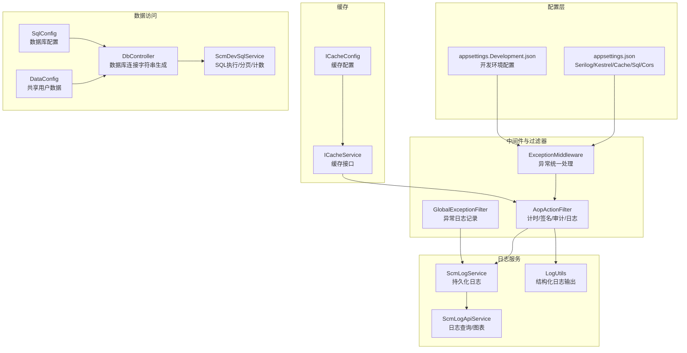
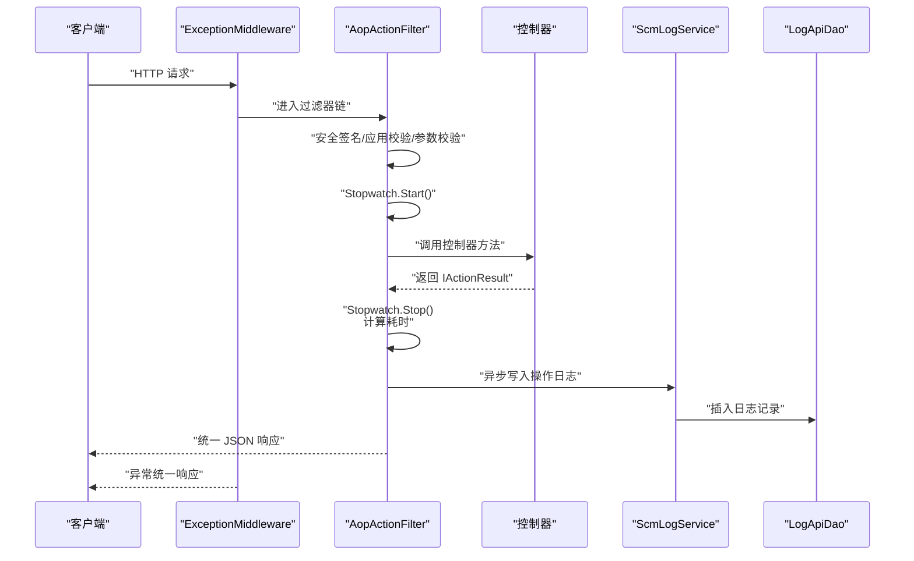
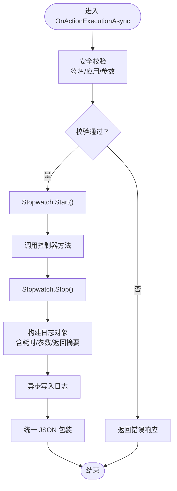
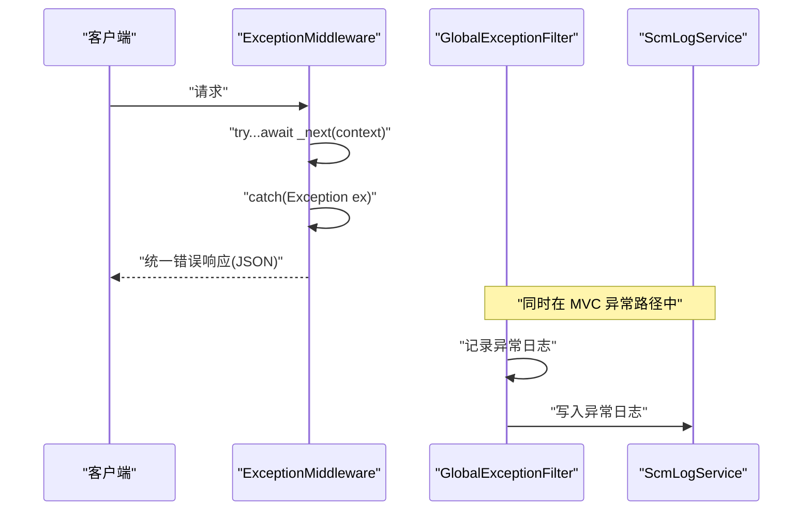
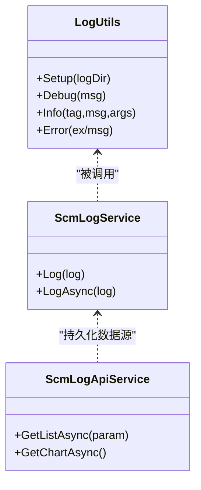
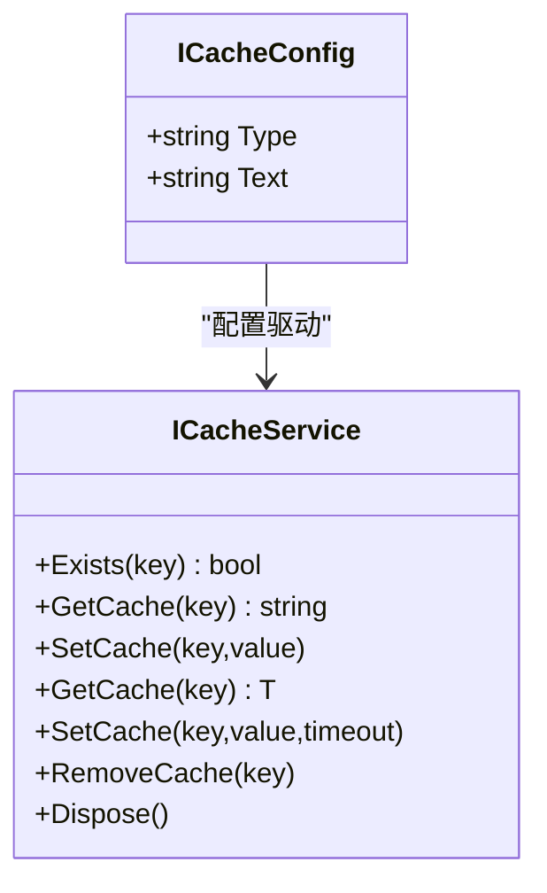
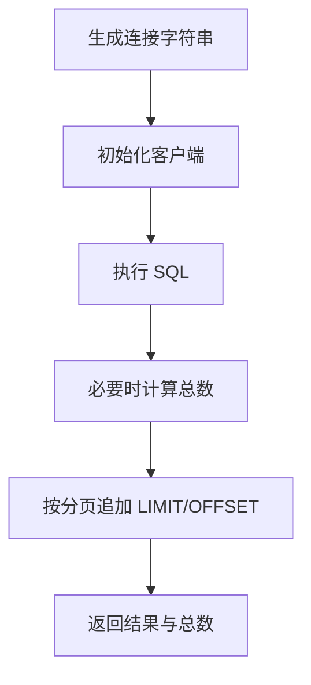
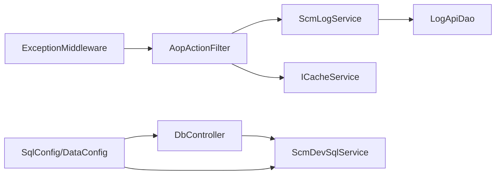
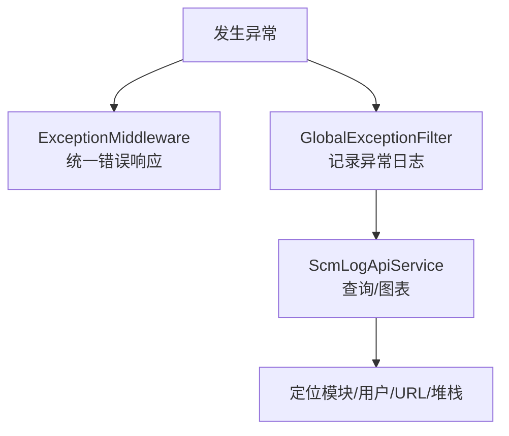

# 性能监控

<cite>
**本文引用的文件**
- [appsettings.json](file://Scm.Net/appsettings.json)
- [appsettings.Development.json](file://Scm.Net/appsettings.Development.json)
- [AopActionFilter.cs](file://Scm.Core/Configure/Filters/AopActionFilter.cs)
- [GlobalExceptionFilter.cs](file://Scm.Core/Configure/Filters/GlobalExceptionFilter.cs)
- [ExceptionMiddleware.cs](file://Scm.Core/Configure/Middleware/ExceptionMiddleware.cs)
- [ScmLogApiService.cs](file://Scm.Core/Log/Api/ScmLogApiService.cs)
- [ScmLogService.cs](file://Scm.Server.Service/Service/ScmLogService.cs)
- [LogUtils.cs](file://Scm.Common.Log/Utils/LogUtils.cs)
- [ICacheService.cs](file://Scm.Cache/Cache/ICacheService.cs)
- [ICacheConfig.cs](file://Scm.Cache/Cache/ICacheConfig.cs)
- [DbController.cs](file://Scm.Net/Controllers/DbController.cs)
- [ScmDevSqlService.cs](file://Scm.Core/Dev/Sql/ScmDevSqlService.cs)
- [SqlConfig.cs](file://Scm.Server/Config/SqlConfig.cs)
- [DataConfig.cs](file://Scm.Server/Config/DataConfig.cs)
</cite>

## 目录
1. [简介](#简介)
2. [项目结构](#项目结构)
3. [核心组件](#核心组件)
4. [架构总览](#架构总览)
5. [详细组件分析](#详细组件分析)
6. [依赖关系分析](#依赖关系分析)
7. [性能考量](#性能考量)
8. [故障排查指南](#故障排查指南)
9. [结论](#结论)
10. [附录](#附录)

## 简介
本文件面向 Scm.Net 的性能监控与运维场景，系统性阐述服务器性能监控的架构设计、指标采集、数据分析与告警机制；深入解析日志体系（结构化日志、性能日志、错误日志）的配置与使用；说明与外部监控平台（如 Application Insights、Prometheus）的集成思路；并提供数据库查询优化、缓存策略、资源管理等性能优化实践，以及监控数据可视化与仪表板配置建议。最后给出性能瓶颈识别、故障诊断与系统调优的方法论及最佳实践。

## 项目结构
Scm.Net 的性能监控相关能力主要分布在以下层次：
- 配置层：通过 appsettings.json 与 appsettings.Development.json 提供 Serilog 日志、Kestrel 连接限制、缓存与数据库连接等关键性能参数。
- 中间件与过滤器层：全局异常中间件与 AOP 行为过滤器负责请求生命周期内的性能计时、安全校验与日志采集。
- 日志服务层：统一的日志写入服务与通用日志工具，支持结构化输出与多位置落盘。
- 缓存层：抽象的缓存接口，便于替换为内存或分布式缓存实现。
- 数据访问层：数据库连接配置与 SQL 执行辅助，支撑查询性能分析与优化。

**图示来源**
- [appsettings.json:1-127](file://Scm.Net/appsettings.json#L1-L127)
- [appsettings.Development.json:1-162](file://Scm.Net/appsettings.Development.json#L1-L162)
- [ExceptionMiddleware.cs:1-41](file://Scm.Core/Configure/Middleware/ExceptionMiddleware.cs#L1-L41)
- [AopActionFilter.cs:1-419](file://Scm.Core/Configure/Filters/AopActionFilter.cs#L1-L419)
- [GlobalExceptionFilter.cs:1-42](file://Scm.Core/Configure/Filters/GlobalExceptionFilter.cs#L1-L42)
- [ScmLogService.cs:1-26](file://Scm.Server.Service/Service/ScmLogService.cs#L1-L26)
- [LogUtils.cs:1-122](file://Scm.Common.Log/Utils/LogUtils.cs#L1-L122)
- [ScmLogApiService.cs:42-92](file://Scm.Core/Log/Api/ScmLogApiService.cs#L42-L92)
- [ICacheService.cs:1-82](file://Scm.Cache/Cache/ICacheService.cs#L1-L82)
- [ICacheConfig.cs:1-8](file://Scm.Cache/Cache/ICacheConfig.cs#L1-L8)
- [DbController.cs:45-286](file://Scm.Net/Controllers/DbController.cs#L45-L286)
- [ScmDevSqlService.cs:247-280](file://Scm.Core/Dev/Sql/ScmDevSqlService.cs#L247-L280)
- [SqlConfig.cs:1-23](file://Scm.Server/Config/SqlConfig.cs#L1-L23)
- [DataConfig.cs:1-24](file://Scm.Server/Config/DataConfig.cs#L1-L24)

**章节来源**
- [appsettings.json:1-127](file://Scm.Net/appsettings.json#L1-L127)
- [appsettings.Development.json:1-162](file://Scm.Net/appsettings.Development.json#L1-L162)

## 核心组件
- 性能计时与日志采集：AOP 行为过滤器在进入控制器前启动计时，在返回后计算耗时并写入操作日志。
- 全局异常处理：中间件与全局异常过滤器统一捕获异常，构造标准响应并记录异常日志。
- 日志服务：统一写入 API 日志表，支持按级别与时间聚合统计与图表展示。
- 缓存接口：抽象缓存能力，便于替换为 Redis 等高性能存储以降低数据库压力。
- 数据库配置与 SQL 执行：集中式连接字符串生成与 SQL 执行辅助，支持分页与计数优化。

**章节来源**
- [AopActionFilter.cs:223-276](file://Scm.Core/Configure/Filters/AopActionFilter.cs#L223-L276)
- [ExceptionMiddleware.cs:17-39](file://Scm.Core/Configure/Middleware/ExceptionMiddleware.cs#L17-L39)
- [GlobalExceptionFilter.cs:32-42](file://Scm.Core/Configure/Filters/GlobalExceptionFilter.cs#L32-L42)
- [ScmLogService.cs:16-24](file://Scm.Server.Service/Service/ScmLogService.cs#L16-L24)
- [ScmLogApiService.cs:42-92](file://Scm.Core/Log/Api/ScmLogApiService.cs#L42-L92)
- [ICacheService.cs:1-82](file://Scm.Cache/Cache/ICacheService.cs#L1-L82)
- [DbController.cs:45-286](file://Scm.Net/Controllers/DbController.cs#L45-L286)
- [ScmDevSqlService.cs:247-280](file://Scm.Core/Dev/Sql/ScmDevSqlService.cs#L247-L280)

## 架构总览
下图展示了从请求进入至日志落库与异常处理的整体流程，体现性能计时、安全校验、日志采集与异常统一处理的关键节点。

**图示来源**
- [ExceptionMiddleware.cs:17-39](file://Scm.Core/Configure/Middleware/ExceptionMiddleware.cs#L17-L39)
- [AopActionFilter.cs:61-276](file://Scm.Core/Configure/Filters/AopActionFilter.cs#L61-L276)
- [ScmLogService.cs:16-24](file://Scm.Server.Service/Service/ScmLogService.cs#L16-L24)

## 详细组件分析

### 组件一：性能计时与日志采集（AopActionFilter）
- 计时逻辑：在进入控制器前后分别启动与停止计时器，计算毫秒级耗时。
- 安全校验：支持应用密钥、时间戳与签名校验，防止重放与篡改。
- 参数与返回：序列化请求参数与返回内容，用于审计与问题定位。
- 审计开关：支持跳过审计与跳过统一结果包装的特性控制。
- 日志写入：异步写入操作日志，包含模块、方法、URL、IP、浏览器、耗时等字段。

**图示来源**
- [AopActionFilter.cs:61-276](file://Scm.Core/Configure/Filters/AopActionFilter.cs#L61-L276)

**章节来源**
- [AopActionFilter.cs:223-276](file://Scm.Core/Configure/Filters/AopActionFilter.cs#L223-L276)

### 组件二：全局异常处理（ExceptionMiddleware 与 GlobalExceptionFilter）
- ExceptionMiddleware：捕获管道内未处理异常，统一返回 JSON 错误响应。
- GlobalExceptionFilter：在 MVC 异常路径中记录异常日志，包含用户、模块、URL、异常堆栈等信息，并支持跳过审计。

**图示来源**
- [ExceptionMiddleware.cs:17-39](file://Scm.Core/Configure/Middleware/ExceptionMiddleware.cs#L17-L39)
- [GlobalExceptionFilter.cs:32-42](file://Scm.Core/Configure/Filters/GlobalExceptionFilter.cs#L32-L42)
- [ScmLogService.cs:16-24](file://Scm.Server.Service/Service/ScmLogService.cs#L16-L24)

**章节来源**
- [ExceptionMiddleware.cs:17-39](file://Scm.Core/Configure/Middleware/ExceptionMiddleware.cs#L17-L39)
- [GlobalExceptionFilter.cs:32-42](file://Scm.Core/Configure/Filters/GlobalExceptionFilter.cs#L32-L42)

### 组件三：日志系统（LogUtils、ScmLogService、ScmLogApiService）
- LogUtils：基于 Serilog 的结构化日志，按 position 分流到 db、api、error 三个子目录，支持异步落盘与按天滚动。
- ScmLogService：将 LogInfo 写入日志表，提供同步与异步两种写入方式。
- ScmLogApiService：提供日志查询与图表统计接口，按日期与级别聚合，支持分页与筛选。

**图示来源**
- [LogUtils.cs:19-122](file://Scm.Common.Log/Utils/LogUtils.cs#L19-L122)
- [ScmLogService.cs:16-24](file://Scm.Server.Service/Service/ScmLogService.cs#L16-L24)
- [ScmLogApiService.cs:42-92](file://Scm.Core/Log/Api/ScmLogApiService.cs#L42-L92)

**章节来源**
- [LogUtils.cs:19-122](file://Scm.Common.Log/Utils/LogUtils.cs#L19-L122)
- [ScmLogService.cs:16-24](file://Scm.Server.Service/Service/ScmLogService.cs#L16-L24)
- [ScmLogApiService.cs:42-92](file://Scm.Core/Log/Api/ScmLogApiService.cs#L42-L92)

### 组件四：缓存（ICacheService、ICacheConfig）
- ICacheService：定义缓存的增删查改与过期策略，支持多种过期方式与泛型取值。
- ICacheConfig：缓存类型与连接文本的配置抽象，便于替换为 Redis 等实现。

**图示来源**
- [ICacheService.cs:1-82](file://Scm.Cache/Cache/ICacheService.cs#L1-L82)
- [ICacheConfig.cs:1-8](file://Scm.Cache/Cache/ICacheConfig.cs#L1-L8)

**章节来源**
- [ICacheService.cs:1-82](file://Scm.Cache/Cache/ICacheService.cs#L1-L82)
- [ICacheConfig.cs:1-8](file://Scm.Cache/Cache/ICacheConfig.cs#L1-L8)

### 组件五：数据库连接与 SQL 执行（DbController、ScmDevSqlService、SqlConfig、DataConfig）
- DbController：根据 DbType 生成不同数据库的连接字符串，支持 MySQL、Oracle、PostgreSQL、DB2、DM 等。
- ScmDevSqlService：SQL 执行辅助，自动计算总数并按 limit/page 生成分页 SQL，支持 SELECT/INSERT/UPDATE。
- SqlConfig：数据库类型与连接文本的配置准备。
- DataConfig：共享用户数据准备。

**图示来源**
- [DbController.cs:45-286](file://Scm.Net/Controllers/DbController.cs#L45-L286)
- [ScmDevSqlService.cs:247-280](file://Scm.Core/Dev/Sql/ScmDevSqlService.cs#L247-L280)
- [SqlConfig.cs:10-20](file://Scm.Server/Config/SqlConfig.cs#L10-L20)
- [DataConfig.cs:15-21](file://Scm.Server/Config/DataConfig.cs#L15-L21)

**章节来源**
- [DbController.cs:45-286](file://Scm.Net/Controllers/DbController.cs#L45-L286)
- [ScmDevSqlService.cs:247-280](file://Scm.Core/Dev/Sql/ScmDevSqlService.cs#L247-L280)
- [SqlConfig.cs:10-20](file://Scm.Server/Config/SqlConfig.cs#L10-L20)
- [DataConfig.cs:15-21](file://Scm.Server/Config/DataConfig.cs#L15-L21)

## 依赖关系分析
- 中间件与过滤器依赖日志服务与缓存接口，形成“请求—计时—日志—响应”的闭环。
- 日志服务依赖数据访问层实现，用于持久化日志。
- 数据库连接由配置层提供，SQL 执行辅助依赖连接客户端与分页策略。
- 缓存接口作为横切关注点，贯穿于安全校验与业务逻辑中，提升整体吞吐。

**图示来源**
- [ExceptionMiddleware.cs:17-39](file://Scm.Core/Configure/Middleware/ExceptionMiddleware.cs#L17-L39)
- [AopActionFilter.cs:61-276](file://Scm.Core/Configure/Filters/AopActionFilter.cs#L61-L276)
- [ScmLogService.cs:16-24](file://Scm.Server.Service/Service/ScmLogService.cs#L16-L24)
- [ICacheService.cs:1-82](file://Scm.Cache/Cache/ICacheService.cs#L1-L82)
- [DbController.cs:45-286](file://Scm.Net/Controllers/DbController.cs#L45-L286)
- [ScmDevSqlService.cs:247-280](file://Scm.Core/Dev/Sql/ScmDevSqlService.cs#L247-L280)
- [SqlConfig.cs:10-20](file://Scm.Server/Config/SqlConfig.cs#L10-L20)
- [DataConfig.cs:15-21](file://Scm.Server/Config/DataConfig.cs#L15-L21)

**章节来源**
- [AopActionFilter.cs:61-276](file://Scm.Core/Configure/Filters/AopActionFilter.cs#L61-L276)
- [ScmLogService.cs:16-24](file://Scm.Server.Service/Service/ScmLogService.cs#L16-L24)
- [DbController.cs:45-286](file://Scm.Net/Controllers/DbController.cs#L45-L286)

## 性能考量
- Kestrel 连接限制：通过配置 MaxConcurrentConnections 与 MaxRequestBodySize 控制并发与请求体大小，避免资源耗尽。
- 日志异步落盘：Serilog 使用 Async 包装器与按天滚动，减少 I/O 阻塞与磁盘碎片。
- SQL 分页与计数：自动计算总数并在超限时追加分页，避免一次性加载大结果集。
- 缓存策略：利用 ICacheService 接口在鉴权盐值、热点数据等场景引入缓存，降低数据库压力。
- 开发与生产差异：开发环境最小日志级别更低，生产环境更严格，确保性能与可观测性的平衡。

**章节来源**
- [appsettings.json:26-38](file://Scm.Net/appsettings.json#L26-L38)
- [appsettings.Development.json:26-38](file://Scm.Net/appsettings.Development.json#L26-L38)
- [LogUtils.cs:42-45](file://Scm.Common.Log/Utils/LogUtils.cs#L42-L45)
- [ScmDevSqlService.cs:247-280](file://Scm.Core/Dev/Sql/ScmDevSqlService.cs#L247-L280)
- [ICacheService.cs:1-82](file://Scm.Cache/Cache/ICacheService.cs#L1-L82)

## 故障排查指南
- 统一异常响应：异常中间件返回标准化 JSON 错误，便于前端与监控系统识别。
- 异常日志记录：全局异常过滤器在 MVC 异常路径中记录上下文信息，结合日志查询接口快速定位问题。
- 日志查询与图表：按日期与级别聚合，辅助识别错误趋势与热点模块。
- 安全校验失败：检查签名参数、时间戳有效性与应用密钥一致性，确认请求头是否完整传递。

**图示来源**
- [ExceptionMiddleware.cs:29-39](file://Scm.Core/Configure/Middleware/ExceptionMiddleware.cs#L29-L39)
- [GlobalExceptionFilter.cs:32-42](file://Scm.Core/Configure/Filters/GlobalExceptionFilter.cs#L32-L42)
- [ScmLogApiService.cs:42-92](file://Scm.Core/Log/Api/ScmLogApiService.cs#L42-L92)

**章节来源**
- [ExceptionMiddleware.cs:29-39](file://Scm.Core/Configure/Middleware/ExceptionMiddleware.cs#L29-L39)
- [GlobalExceptionFilter.cs:32-42](file://Scm.Core/Configure/Filters/GlobalExceptionFilter.cs#L32-L42)
- [ScmLogApiService.cs:42-92](file://Scm.Core/Log/Api/ScmLogApiService.cs#L42-L92)

## 结论
Scm.Net 的性能监控体系以中间件与过滤器为核心，结合统一日志服务与缓存接口，实现了对请求耗时、安全校验与异常的全链路观测。通过配置层的 Kestrel 限制、Serilog 异步落盘与 SQL 分页策略，兼顾了性能与可观测性。建议在生产环境中启用更严格的日志级别与缓存策略，并结合外部监控平台进行可视化与告警。

## 附录
- 外部监控平台集成建议
  - Application Insights：在启动阶段注册 AI SDK，采集请求遥测、依赖与异常，结合自定义属性（如模块、耗时）增强可观测性。
  - Prometheus：暴露 /metrics 端点，采集自定义指标（如请求耗时直方图、错误率），并通过 Grafana 做可视化。
- 最佳实践
  - 将日志按模块与级别分流，避免单文件过大；开启异步与按天滚动。
  - 对热点接口与鉴权盐值使用缓存，设置合理过期时间。
  - 在数据库层使用索引、分页与只读事务，避免长事务与全表扫描。
  - 定期审查异常日志与慢查询日志，形成回归与优化闭环。