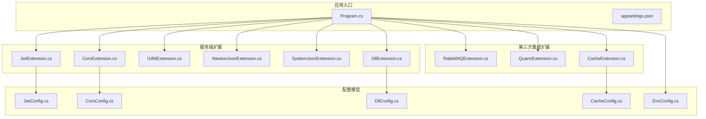
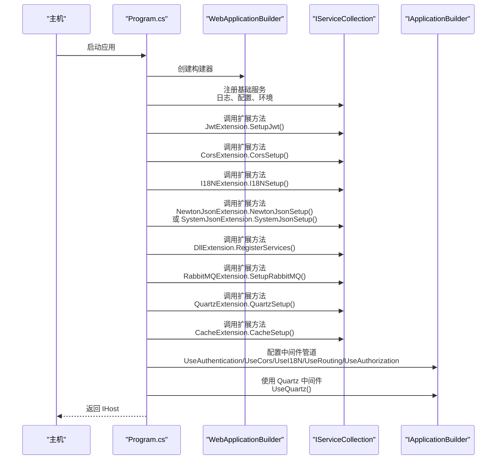
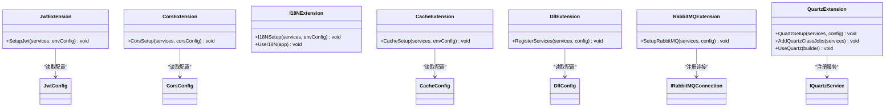
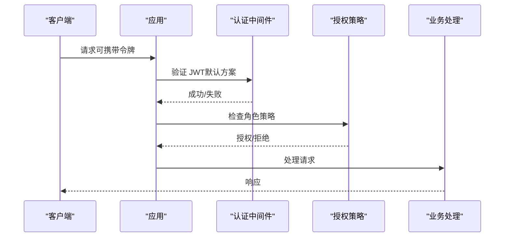
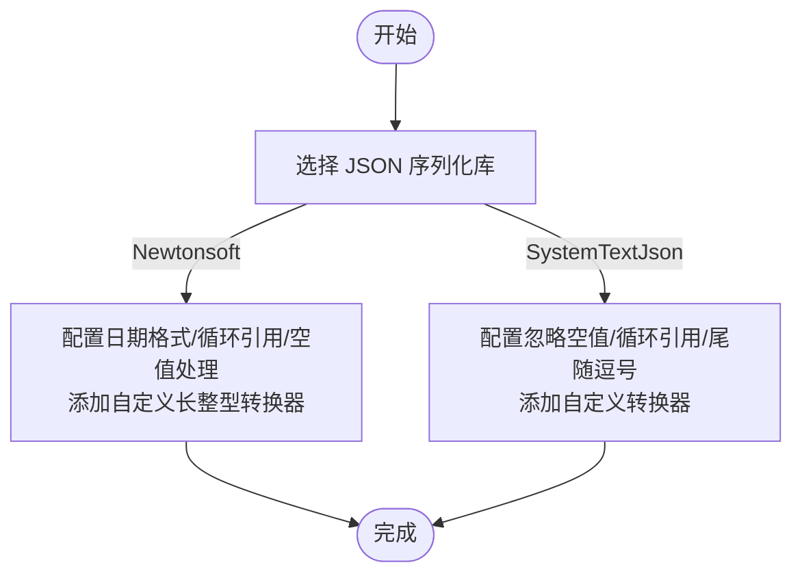
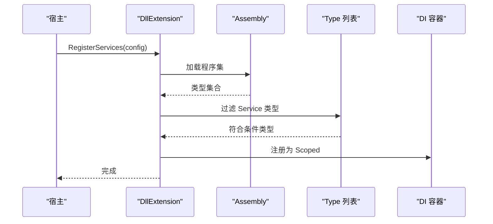
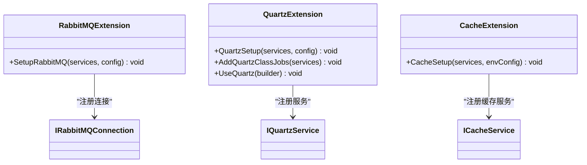
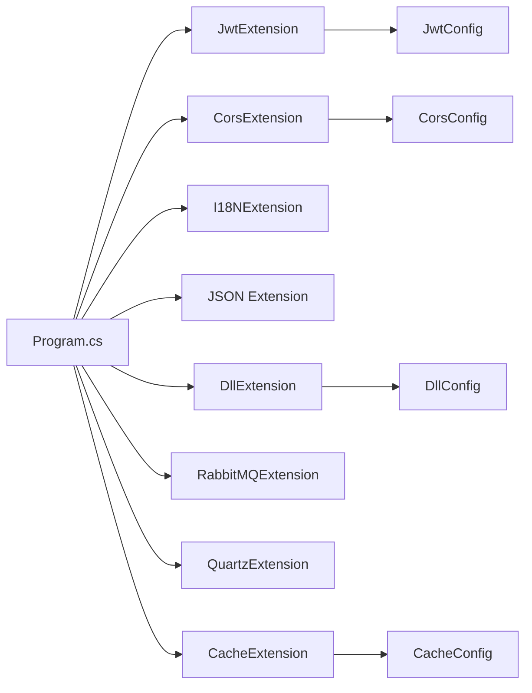

# 扩展方法

<cite>
**本文档引用的文件**
- [DllExtension.cs](file://Scm.Server/Extensions/DllExtension.cs)
- [NewtonJsonExtension.cs](file://Scm.Server/Extensions/NewtonJsonExtension.cs)
- [SystemJsonExtension.cs](file://Scm.Server/Extensions/SystemJsonExtension.cs)
- [JwtExtension.cs](file://Scm.Server/Extensions/JwtExtension.cs)
- [CorsExtension.cs](file://Scm.Server/Extensions/CorsExtension.cs)
- [I18NExtension.cs](file://Scm.Server/Extensions/I18NExtension.cs)
- [RabbitMQExtension.cs](file://Scm.Server.RabbitMQ/RabbitMQ/RabbitMQExtension.cs)
- [QuartzExtension.cs](file://Scm.Server.Quartz/QuartzExtension.cs)
- [CacheExtension.cs](file://Scm.Server.Cache/Server/CacheExtension.cs)
- [Program.cs](file://Scm.Net/Program.cs)
- [appsettings.json](file://Scm.Net/appsettings.json)
- [EnvConfig.cs](file://Scm.Server/Config/EnvConfig.cs)
- [JwtConfig.cs](file://Scm.Server/Config/JwtConfig.cs)
- [CorsConfig.cs](file://Scm.Server/Config/CorsConfig.cs)
- [CacheConfig.cs](file://Scm.Server/Config/CacheConfig.cs)
- [DllConfig.cs](file://Scm.Server/Config/DllConfig.cs)
- [ScmEnv.cs](file://Scm.Common/ScmEnv.cs)
- [LogUtils.cs](file://Scm.Common/Utils/LogUtils.cs)
- [AppUtils.cs](file://Scm.Server/Utils/AppUtils.cs)
- [ScmContextHolder.cs](file://Scm.Server/Token/ScmContextHolder.cs)
- [ScmToken.cs](file://Scm.Server/Token/ScmToken.cs)
- [ILogService.cs](file://Scm.Server/ILogService.cs)
- [IQuartzService.cs](file://Scm.Server.Quartz/IQuartzService.cs)
- [IRabbitMQConnection.cs](file://Scm.Server.RabbitMQ/RabbitMQ/Impl/IRabbitMQConnection.cs)
- [ICacheService.cs](file://Scm.Cache/Cache/ICacheService.cs)
</cite>

## 目录
1. [简介](#简介)
2. [项目结构](#项目结构)
3. [核心组件](#核心组件)
4. [架构总览](#架构总览)
5. [详细组件分析](#详细组件分析)
6. [依赖关系分析](#依赖关系分析)
7. [性能考量](#性能考量)
8. [故障排查指南](#故障排查指南)
9. [结论](#结论)
10. [附录](#附录)

## 简介
本文件系统性梳理 Scm.Net 中的扩展方法体系，覆盖以下主题：
- 服务注册扩展：依赖注入容器配置与扩展服务注册流程
- 中间件配置扩展：认证授权、跨域、国际化等扩展方法的设计与使用场景
- JSON 序列化扩展：Newtonsoft 与 System.Text.Json 的配置差异与选型建议
- DLL 扩展机制：动态程序集加载与插件集成策略
- 开发指南：命名约定、参数设计、异常处理与最佳实践
- 性能与稳定性：序列化、认证、缓存、消息队列与调度的优化要点

## 项目结构
围绕扩展方法的关键目录与文件如下：
- 服务端扩展：位于 Scm.Server/Extensions 下，提供 JWT、跨域、国际化、JSON、DLL 等扩展
- 第三方集成扩展：位于各子模块的 Extensions 目录，如 RabbitMQ、Quartz、Cache
- 入口与配置：Scm.Net/Program.cs 与 appsettings.json 提供扩展方法的装配入口
- 配置模型：Scm.Server/Config 下的各类配置类（JwtConfig、CorsConfig、CacheConfig、DllConfig）
- 工具与环境：Scm.Common/ScmEnv.cs、AppUtils.cs、LogUtils.cs 等

图表来源
- [Program.cs](file://Scm.Net/Program.cs)
- [JwtExtension.cs](file://Scm.Server/Extensions/JwtExtension.cs)
- [CorsExtension.cs](file://Scm.Server/Extensions/CorsExtension.cs)
- [I18NExtension.cs](file://Scm.Server/Extensions/I18NExtension.cs)
- [NewtonJsonExtension.cs](file://Scm.Server/Extensions/NewtonJsonExtension.cs)
- [SystemJsonExtension.cs](file://Scm.Server/Extensions/SystemJsonExtension.cs)
- [DllExtension.cs](file://Scm.Server/Extensions/DllExtension.cs)
- [RabbitMQExtension.cs](file://Scm.Server.RabbitMQ/RabbitMQ/RabbitMQExtension.cs)
- [QuartzExtension.cs](file://Scm.Server.Quartz/QuartzExtension.cs)
- [CacheExtension.cs](file://Scm.Server.Cache/Server/CacheExtension.cs)
- [EnvConfig.cs](file://Scm.Server/Config/EnvConfig.cs)
- [JwtConfig.cs](file://Scm.Server/Config/JwtConfig.cs)
- [CorsConfig.cs](file://Scm.Server/Config/CorsConfig.cs)
- [CacheConfig.cs](file://Scm.Server/Config/CacheConfig.cs)
- [DllConfig.cs](file://Scm.Server/Config/DllConfig.cs)

章节来源
- [Program.cs](file://Scm.Net/Program.cs)
- [appsettings.json](file://Scm.Net/appsettings.json)

## 核心组件
本节聚焦于扩展方法的核心职责与实现要点。

- 依赖注入容器配置
  - 通过扩展方法在 IServiceCollection 上注册服务，遵循“按需装配、最小暴露”的原则
  - 常见注册模式：AddSingleton、AddScoped、Configure<T>、AddAuthentication/AddAuthorization
- 中间件配置扩展
  - 在 IApplicationBuilder 上启用认证、跨域、本地化等中间件
  - 通过扩展方法统一入口，降低调用方心智负担
- JSON 序列化扩展
  - 提供 Newtonsoft 与 System.Text.Json 的配置封装，统一日期、长整型、循环引用等行为
- DLL 扩展机制
  - 动态加载指定程序集中的服务类型，自动注册到 DI 容器
- 第三方集成扩展
  - RabbitMQ：连接工厂与服务单例注册
  - Quartz：作业工厂、调度器、日志与作业服务的装配
  - Cache：基于字典的缓存服务注册

章节来源
- [JwtExtension.cs](file://Scm.Server/Extensions/JwtExtension.cs)
- [CorsExtension.cs](file://Scm.Server/Extensions/CorsExtension.cs)
- [I18NExtension.cs](file://Scm.Server/Extensions/I18NExtension.cs)
- [NewtonJsonExtension.cs](file://Scm.Server/Extensions/NewtonJsonExtension.cs)
- [SystemJsonExtension.cs](file://Scm.Server/Extensions/SystemJsonExtension.cs)
- [DllExtension.cs](file://Scm.Server/Extensions/DllExtension.cs)
- [RabbitMQExtension.cs](file://Scm.Server.RabbitMQ/RabbitMQ/RabbitMQExtension.cs)
- [QuartzExtension.cs](file://Scm.Server.Quartz/QuartzExtension.cs)
- [CacheExtension.cs](file://Scm.Server.Cache/Server/CacheExtension.cs)

## 架构总览
下图展示扩展方法在启动流程中的装配顺序与交互关系：

图表来源
- [Program.cs](file://Scm.Net/Program.cs)
- [JwtExtension.cs](file://Scm.Server/Extensions/JwtExtension.cs)
- [CorsExtension.cs](file://Scm.Server/Extensions/CorsExtension.cs)
- [I18NExtension.cs](file://Scm.Server/Extensions/I18NExtension.cs)
- [NewtonJsonExtension.cs](file://Scm.Server/Extensions/NewtonJsonExtension.cs)
- [SystemJsonExtension.cs](file://Scm.Server/Extensions/SystemJsonExtension.cs)
- [DllExtension.cs](file://Scm.Server/Extensions/DllExtension.cs)
- [RabbitMQExtension.cs](file://Scm.Server.RabbitMQ/RabbitMQ/RabbitMQExtension.cs)
- [QuartzExtension.cs](file://Scm.Server.Quartz/QuartzExtension.cs)
- [CacheExtension.cs](file://Scm.Server.Cache/Server/CacheExtension.cs)

## 详细组件分析

### 服务注册扩展：依赖注入容器配置
- 设计模式
  - 扩展方法以 IServiceCollection 为扩展目标，返回相同实例，便于链式调用
  - 对外暴露最小 API，内部封装复杂配置细节
- 关键点
  - 配置对象准备：通过 EnvConfig.Prepare() 统一环境变量与默认值
  - 认证授权：设置默认认证方案与策略，支持角色策略
  - 本地化：根据配置注册文化与资源路径
  - 缓存：按配置创建缓存服务实例并注册为 Singleton
  - JSON：二选一配置 Newtonsoft 或 System.Text.Json，统一序列化行为
  - DLL：按配置加载服务程序集，自动识别以 “Service” 结尾的类型进行注册

图表来源
- [JwtExtension.cs](file://Scm.Server/Extensions/JwtExtension.cs)
- [CorsExtension.cs](file://Scm.Server/Extensions/CorsExtension.cs)
- [I18NExtension.cs](file://Scm.Server/Extensions/I18NExtension.cs)
- [CacheExtension.cs](file://Scm.Server.Cache/Server/CacheExtension.cs)
- [DllExtension.cs](file://Scm.Server/Extensions/DllExtension.cs)
- [RabbitMQExtension.cs](file://Scm.Server.RabbitMQ/RabbitMQ/RabbitMQExtension.cs)
- [QuartzExtension.cs](file://Scm.Server.Quartz/QuartzExtension.cs)
- [JwtConfig.cs](file://Scm.Server/Config/JwtConfig.cs)
- [CorsConfig.cs](file://Scm.Server/Config/CorsConfig.cs)
- [CacheConfig.cs](file://Scm.Server/Config/CacheConfig.cs)
- [DllConfig.cs](file://Scm.Server/Config/DllConfig.cs)
- [IRabbitMQConnection.cs](file://Scm.Server.RabbitMQ/RabbitMQ/Impl/IRabbitMQConnection.cs)
- [IQuartzService.cs](file://Scm.Server.Quartz/IQuartzService.cs)

章节来源
- [JwtExtension.cs](file://Scm.Server/Extensions/JwtExtension.cs)
- [CorsExtension.cs](file://Scm.Server/Extensions/CorsExtension.cs)
- [I18NExtension.cs](file://Scm.Server/Extensions/I18NExtension.cs)
- [CacheExtension.cs](file://Scm.Server.Cache/Server/CacheExtension.cs)
- [DllExtension.cs](file://Scm.Server/Extensions/DllExtension.cs)
- [RabbitMQExtension.cs](file://Scm.Server.RabbitMQ/RabbitMQ/RabbitMQExtension.cs)
- [QuartzExtension.cs](file://Scm.Server.Quartz/QuartzExtension.cs)

### 中间件配置扩展：认证、跨域与国际化
- 认证授权（JWT）
  - 设置默认认证与挑战方案，配置签发者、受众、密钥与生命周期验证
  - 支持从请求头提取令牌，便于前端传递 ApiToken
- 跨域（CORS）
  - 支持 AllowAnyOrigin/Method/Header 或白名单模式
  - 支持允许凭据、预检缓存时间等细粒度控制
- 国际化（I18N）
  - 注册本地化服务与默认文化、支持的文化列表
  - 提供 UseI18N 中间件启用请求本地化

图表来源
- [JwtExtension.cs](file://Scm.Server/Extensions/JwtExtension.cs)
- [CorsExtension.cs](file://Scm.Server/Extensions/CorsExtension.cs)
- [I18NExtension.cs](file://Scm.Server/Extensions/I18NExtension.cs)
- [ScmContextHolder.cs](file://Scm.Server/Token/ScmContextHolder.cs)
- [ScmToken.cs](file://Scm.Server/Token/ScmToken.cs)

章节来源
- [JwtExtension.cs](file://Scm.Server/Extensions/JwtExtension.cs)
- [CorsExtension.cs](file://Scm.Server/Extensions/CorsExtension.cs)
- [I18NExtension.cs](file://Scm.Server/Extensions/I18NExtension.cs)

### JSON 序列化扩展：Newtonsoft 与 System.Text.Json
- Newtonsoft 配置要点
  - 默认日期格式：使用 ISO 格式转换器与全局环境常量
  - 循环引用：忽略引用循环
  - 空值处理：忽略空值
  - 自定义长整型转换器：字符串与数值兼容解析
- System.Text.Json 配置要点
  - 允许尾随逗号：关闭
  - 忽略空值：WhenWritingNull
  - 循环引用：IgnoreCycles
  - 自定义转换器：长整型、日期、类型转换器
- 选型建议
  - 性能优先：System.Text.Json
  - 兼容性优先：Newtonsoft（保留历史序列化行为）

图表来源
- [NewtonJsonExtension.cs](file://Scm.Server/Extensions/NewtonJsonExtension.cs)
- [SystemJsonExtension.cs](file://Scm.Server/Extensions/SystemJsonExtension.cs)
- [ScmEnv.cs](file://Scm.Common/ScmEnv.cs)

章节来源
- [NewtonJsonExtension.cs](file://Scm.Server/Extensions/NewtonJsonExtension.cs)
- [SystemJsonExtension.cs](file://Scm.Server/Extensions/SystemJsonExtension.cs)

### DLL 扩展机制：动态程序集加载与插件集成
- 目标
  - 将外部服务程序集按约定自动发现并注册到 DI 容器
- 实现
  - 读取配置中的服务程序集列表
  - 加载程序集并筛选以 “Service” 结尾的非接口、非抽象、非泛型类
  - 注册为 Scoped 作用域
  - 异常捕获并记录日志，避免影响主流程
- 注意事项
  - 确保程序集命名规范与可见性
  - 避免加载失败导致的性能与稳定性问题

图表来源
- [DllExtension.cs](file://Scm.Server/Extensions/DllExtension.cs)
- [DllConfig.cs](file://Scm.Server/Config/DllConfig.cs)
- [LogUtils.cs](file://Scm.Common/Utils/LogUtils.cs)

章节来源
- [DllExtension.cs](file://Scm.Server/Extensions/DllExtension.cs)
- [DllConfig.cs](file://Scm.Server/Config/DllConfig.cs)

### 第三方集成扩展
- RabbitMQ
  - 基于配置创建连接工厂，注册连接与服务为 Singleton
- Quartz
  - 根据配置选择文件或数据库日志与作业服务
  - 注册调度器工厂、作业工厂与服务
  - 支持自动扫描实现 ICustomJob 的类并注册
  - 提供 UseQuartz 中间件初始化作业
- Cache
  - 读取缓存配置并准备环境
  - 注册字典缓存服务为 Singleton

图表来源
- [RabbitMQExtension.cs](file://Scm.Server.RabbitMQ/RabbitMQ/RabbitMQExtension.cs)
- [QuartzExtension.cs](file://Scm.Server.Quartz/QuartzExtension.cs)
- [CacheExtension.cs](file://Scm.Server.Cache/Server/CacheExtension.cs)
- [IRabbitMQConnection.cs](file://Scm.Server.RabbitMQ/RabbitMQ/Impl/IRabbitMQConnection.cs)
- [IQuartzService.cs](file://Scm.Server.Quartz/IQuartzService.cs)
- [ICacheService.cs](file://Scm.Cache/Cache/ICacheService.cs)

章节来源
- [RabbitMQExtension.cs](file://Scm.Server.RabbitMQ/RabbitMQ/RabbitMQExtension.cs)
- [QuartzExtension.cs](file://Scm.Server.Quartz/QuartzExtension.cs)
- [CacheExtension.cs](file://Scm.Server.Cache/Server/CacheExtension.cs)

## 依赖关系分析
- 组件耦合
  - 扩展方法对配置类存在直接依赖，通过 AppUtils.GetConfig 与 Configure<T> 获取配置
  - 认证扩展依赖 JwtConfig 与 ScmToken，确保令牌提取与验证一致性
  - 缓存扩展依赖 CacheConfig 与 ScmEnv，保证缓存行为与环境一致
- 外部依赖
  - Microsoft.Extensions.*：依赖注入、配置、本地化、认证授权
  - RabbitMQ.Client：消息队列连接与服务
  - Quartz：调度器与作业工厂
- 潜在循环依赖
  - 扩展方法之间无直接循环调用；若自定义扩展，请避免在扩展中反向依赖宿主

图表来源
- [Program.cs](file://Scm.Net/Program.cs)
- [JwtExtension.cs](file://Scm.Server/Extensions/JwtExtension.cs)
- [CorsExtension.cs](file://Scm.Server/Extensions/CorsExtension.cs)
- [I18NExtension.cs](file://Scm.Server/Extensions/I18NExtension.cs)
- [NewtonJsonExtension.cs](file://Scm.Server/Extensions/NewtonJsonExtension.cs)
- [SystemJsonExtension.cs](file://Scm.Server/Extensions/SystemJsonExtension.cs)
- [DllExtension.cs](file://Scm.Server/Extensions/DllExtension.cs)
- [RabbitMQExtension.cs](file://Scm.Server.RabbitMQ/RabbitMQ/RabbitMQExtension.cs)
- [QuartzExtension.cs](file://Scm.Server.Quartz/QuartzExtension.cs)
- [CacheExtension.cs](file://Scm.Server.Cache/Server/CacheExtension.cs)
- [JwtConfig.cs](file://Scm.Server/Config/JwtConfig.cs)
- [CorsConfig.cs](file://Scm.Server/Config/CorsConfig.cs)
- [CacheConfig.cs](file://Scm.Server/Config/CacheConfig.cs)
- [DllConfig.cs](file://Scm.Server/Config/DllConfig.cs)

章节来源
- [Program.cs](file://Scm.Net/Program.cs)
- [JwtExtension.cs](file://Scm.Server/Extensions/JwtExtension.cs)
- [CorsExtension.cs](file://Scm.Server/Extensions/CorsExtension.cs)
- [I18NExtension.cs](file://Scm.Server/Extensions/I18NExtension.cs)
- [NewtonJsonExtension.cs](file://Scm.Server/Extensions/NewtonJsonExtension.cs)
- [SystemJsonExtension.cs](file://Scm.Server/Extensions/SystemJsonExtension.cs)
- [DllExtension.cs](file://Scm.Server/Extensions/DllExtension.cs)
- [RabbitMQExtension.cs](file://Scm.Server.RabbitMQ/RabbitMQ/RabbitMQExtension.cs)
- [QuartzExtension.cs](file://Scm.Server.Quartz/QuartzExtension.cs)
- [CacheExtension.cs](file://Scm.Server.Cache/Server/CacheExtension.cs)

## 性能考量
- 序列化
  - System.Text.Json 在吞吐与内存占用上通常优于 Newtonsoft，适合高并发场景
  - 自定义转换器应避免不必要的装箱/拆箱与字符串解析
- 认证
  - JWT 验证参数应尽量简化，避免过度验证导致延迟
  - 令牌提取逻辑应快速且健壮，减少异常分支
- 缓存
  - 缓存命中率是关键；合理设置过期与淘汰策略
  - 避免在缓存中存储大对象或频繁变更的数据
- 消息队列
  - 连接池与重连策略需结合业务峰值设计
  - 生产/消费速率匹配，避免堆积
- 调度
  - 作业数量与并发度需平衡；避免 CPU/IO 抖动
  - 日志与监控开销应最小化

## 故障排查指南
- 扩展方法未生效
  - 检查是否在 Program.cs 中正确调用扩展方法
  - 确认配置文件中的对应节点是否存在且格式正确
- JWT 认证失败
  - 核对签发者、受众、密钥与生命周期参数
  - 检查请求头中 ApiToken 是否正确传递
- 跨域问题
  - 确认 AllowAny 与白名单策略是否冲突
  - 检查预检缓存时间与凭据设置
- 序列化异常
  - Newtonsoft 与 System.Text.Json 的转换器不兼容，避免混用
  - 自定义转换器需处理空值与边界情况
- DLL 加载失败
  - 程序集名称与可见性需满足过滤规则
  - 查看日志输出定位具体异常

章节来源
- [Program.cs](file://Scm.Net/Program.cs)
- [JwtExtension.cs](file://Scm.Server/Extensions/JwtExtension.cs)
- [CorsExtension.cs](file://Scm.Server/Extensions/CorsExtension.cs)
- [NewtonJsonExtension.cs](file://Scm.Server/Extensions/NewtonJsonExtension.cs)
- [SystemJsonExtension.cs](file://Scm.Server/Extensions/SystemJsonExtension.cs)
- [DllExtension.cs](file://Scm.Server/Extensions/DllExtension.cs)
- [LogUtils.cs](file://Scm.Common/Utils/LogUtils.cs)

## 结论
扩展方法通过统一的 API 与清晰的职责划分，显著降低了框架集成与配置的复杂度。建议在团队内制定统一的命名与参数设计规范，配合完善的日志与监控，持续优化序列化、认证、缓存与调度等关键路径的性能与稳定性。

## 附录
- 开发指南摘要
  - 命名约定：扩展方法以“Extension”结尾，静态类名与功能一致
  - 参数设计：优先使用配置类，提供默认值与 Prepare 方法
  - 异常处理：对外抛出明确异常，内部捕获并记录日志
  - 最佳实践：保持扩展方法幂等、无副作用；避免在扩展中直接访问宿主上下文