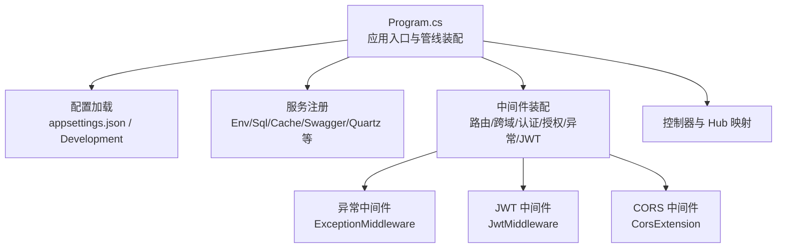
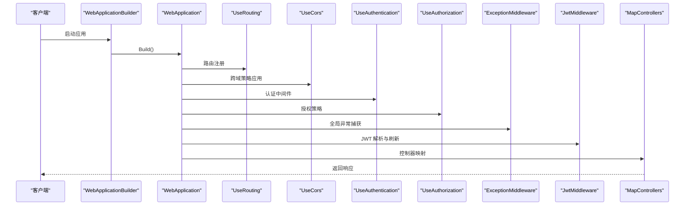
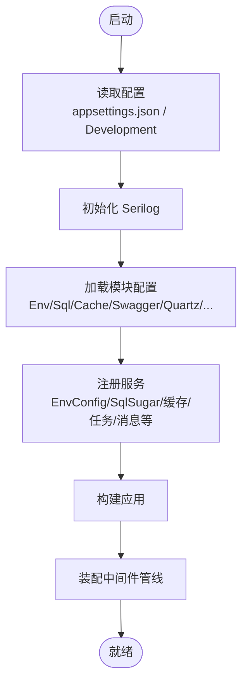
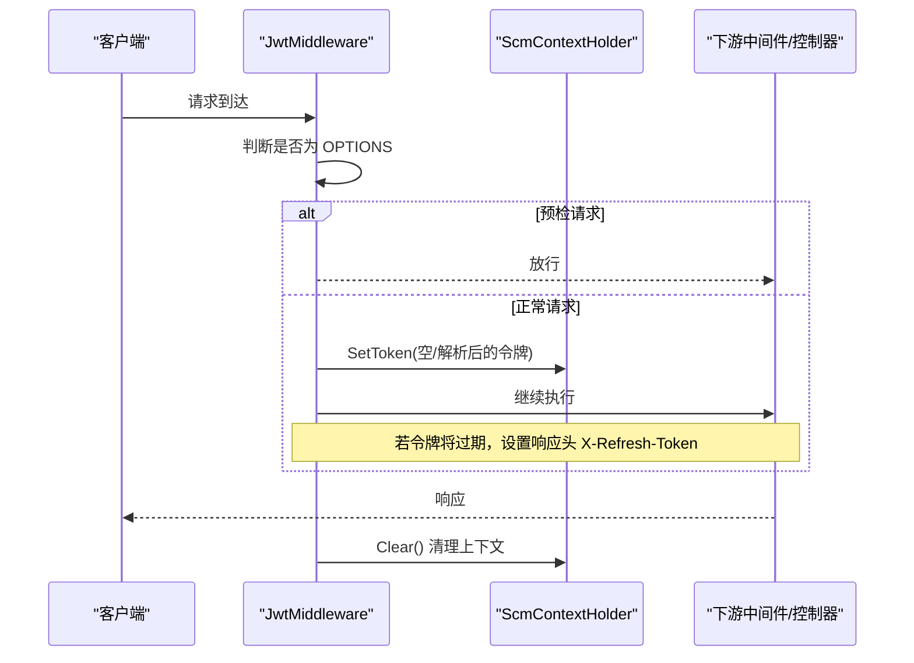
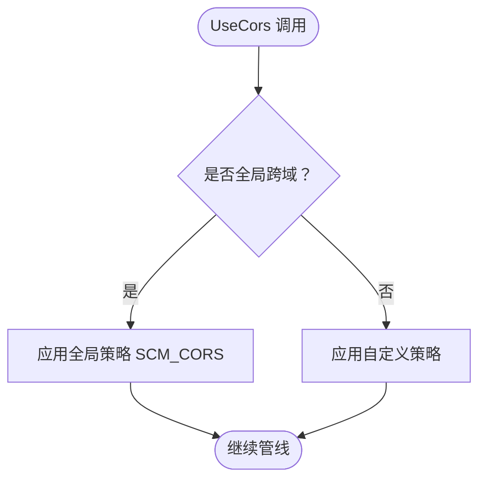
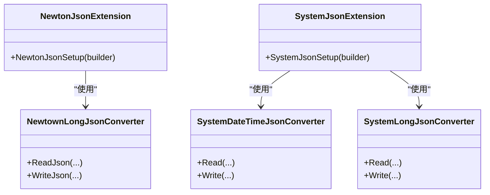
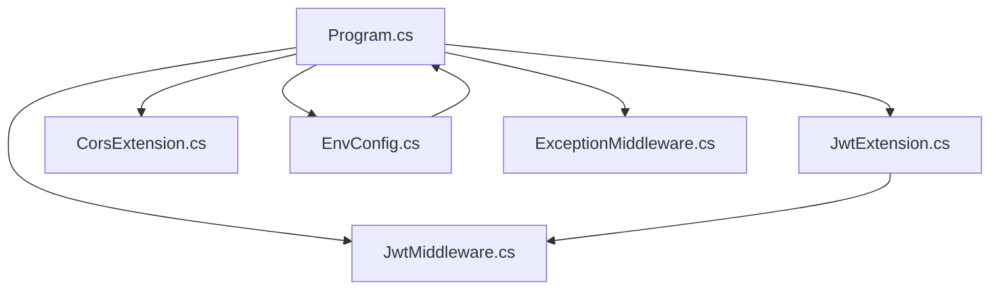

# 服务器基础设施

<cite>
**本文档引用的文件**
- [Program.cs](file://Scm.Net/Program.cs)
- [appsettings.json](file://Scm.Net/appsettings.json)
- [appsettings.Development.json](file://Scm.Net/appsettings.Development.json)
- [EnvConfig.cs](file://Scm.Server/Config/EnvConfig.cs)
- [JwtConfig.cs](file://Scm.Server/Config/JwtConfig.cs)
- [CorsConfig.cs](file://Scm.Server/Config/CorsConfig.cs)
- [SecurityConfig.cs](file://Scm.Server/Config/SecurityConfig.cs)
- [ExceptionMiddleware.cs](file://Scm.Core/Configure/Middleware/ExceptionMiddleware.cs)
- [JwtMiddleware.cs](file://Scm.Core/Configure/Middleware/JwtMiddleware.cs)
- [JwtExtension.cs](file://Scm.Server/Extensions/JwtExtension.cs)
- [CorsExtension.cs](file://Scm.Server/Extensions/CorsExtension.cs)
- [NewtonJsonExtension.cs](file://Scm.Server/Extensions/NewtonJsonExtension.cs)
- [SystemJsonExtension.cs](file://Scm.Server/Extensions/SystemJsonExtension.cs)
</cite>

## 目录
1. [简介](#简介)
2. [项目结构](#项目结构)
3. [核心组件](#核心组件)
4. [架构总览](#架构总览)
5. [详细组件分析](#详细组件分析)
6. [依赖关系分析](#依赖关系分析)
7. [性能考虑](#性能考虑)
8. [故障排除指南](#故障排除指南)
9. [结论](#结论)
10. [附录](#附录)

## 简介
本文件面向 Scm.Net 服务器基础设施，系统性阐述配置管理架构与中间件体系，覆盖环境配置、服务注册扩展、中间件配置扩展、缓存、日志、安全（含 JWT、CORS）等主题，并提供性能优化、监控与运维最佳实践及故障排除建议。文档以实际源码为依据，配合图示帮助读者快速理解并落地实施。

## 项目结构
Scm.Net 采用基于 ASP.NET Core 的现代 Web 应用结构，入口位于 Program.cs，通过 WebApplicationBuilder 构建应用，集中进行配置加载、服务注册与中间件装配。配置数据主要来源于 appsettings.json 及开发环境下的 appsettings.Development.json，按模块拆分在 Scm.Server.Config 与 Scm.Core.Configure.Middleware 下。

图表来源
- [Program.cs:33-258](file://Scm.Net/Program.cs#L33-L258)

章节来源
- [Program.cs:33-258](file://Scm.Net/Program.cs#L33-L258)
- [appsettings.json:1-127](file://Scm.Net/appsettings.json#L1-L127)
- [appsettings.Development.json:1-162](file://Scm.Net/appsettings.Development.json#L1-L162)

## 核心组件
- 环境配置与数据目录管理：EnvConfig 负责解析与标准化数据目录、上传、图片、日志、字体等路径，提供统一的路径拼接与文件读写能力。
- 安全配置：SecurityConfig 提供应用级安全参数占位，便于后续扩展签名校验、IP 限制等功能。
- JWT 配置与认证扩展：JwtConfig 定义签发者、受众、密钥与有效期；JwtExtension 将 JWT 配置注入到认证流程；JwtMiddleware 实现请求头令牌提取、会话刷新与上下文令牌注入。
- CORS 配置与扩展：CorsConfig 描述跨域策略；CorsExtension 将策略注册为服务，供中间件阶段启用。
- 异常处理中间件：ExceptionMiddleware 统一捕获未处理异常，返回结构化响应。
- JSON 序列化扩展：NewtonJsonExtension 与 SystemJsonExtension 分别提供 Newtonsoft 与 System.Text.Json 的序列化定制。

章节来源
- [EnvConfig.cs:1-280](file://Scm.Server/Config/EnvConfig.cs#L1-L280)
- [SecurityConfig.cs:1-44](file://Scm.Server/Config/SecurityConfig.cs#L1-L44)
- [JwtConfig.cs:1-48](file://Scm.Server/Config/JwtConfig.cs#L1-L48)
- [JwtExtension.cs:1-73](file://Scm.Server/Extensions/JwtExtension.cs#L1-L73)
- [JwtMiddleware.cs:1-180](file://Scm.Core/Configure/Middleware/JwtMiddleware.cs#L1-L180)
- [CorsConfig.cs:1-49](file://Scm.Server/Config/CorsConfig.cs#L1-L49)
- [CorsExtension.cs:1-59](file://Scm.Server/Extensions/CorsExtension.cs#L1-L59)
- [ExceptionMiddleware.cs:1-41](file://Scm.Core/Configure/Middleware/ExceptionMiddleware.cs#L1-L41)
- [NewtonJsonExtension.cs:1-53](file://Scm.Server/Extensions/NewtonJsonExtension.cs#L1-L53)
- [SystemJsonExtension.cs:1-75](file://Scm.Server/Extensions/SystemJsonExtension.cs#L1-L75)

## 架构总览
下图展示从请求进入至响应返回的关键路径，以及各中间件与扩展的作用位置。

图表来源
- [Program.cs:174-238](file://Scm.Net/Program.cs#L174-L238)

章节来源
- [Program.cs:174-238](file://Scm.Net/Program.cs#L174-L238)

## 详细组件分析

### 配置管理与环境设置
- 配置加载：Program.cs 在构建阶段读取 appsettings.json 并初始化 Serilog 日志；随后按模块读取 Env、Sql、Cache、Swagger、Quartz、Email、Phone、Aiml、Oidc、Otp、Jwt、Security、Cors 等配置。
- 环境配置：EnvConfig.Prepare 规范化数据目录与子目录（上传、图片、日志、字体等），提供路径拼接与文件读写工具方法，确保运行时目录存在且可访问。
- 开发环境差异：appsettings.Development.json 提供更高的日志级别、不同的数据目录与端口、更严格的 CORS 策略与 Swagger 文档配置。

图表来源
- [Program.cs:33-174](file://Scm.Net/Program.cs#L33-L174)
- [appsettings.json:39-127](file://Scm.Net/appsettings.json#L39-L127)
- [appsettings.Development.json:39-162](file://Scm.Net/appsettings.Development.json#L39-L162)

章节来源
- [Program.cs:33-174](file://Scm.Net/Program.cs#L33-L174)
- [appsettings.json:39-127](file://Scm.Net/appsettings.json#L39-L127)
- [appsettings.Development.json:39-162](file://Scm.Net/appsettings.Development.json#L39-L162)
- [EnvConfig.cs:72-120](file://Scm.Server/Config/EnvConfig.cs#L72-L120)

### JWT 中间件与认证扩展
- 配置项：JwtConfig 定义 Issuer、Audience、Security（密钥）、Expires（分钟）。JwtExtension 将配置注入 Authentication/JWT Bearer，并设置 TokenValidationParameters、消息接收事件与默认认证方案。
- 中间件行为：JwtMiddleware 在 OPTIONS 预检放行；对忽略列表中的路径（如 swagger、/scmhub、/api-config、/upload/）跳过验证；从请求头提取 AppToken、ApiToken 或通用 Token，分别走应用令牌与网页令牌流程；若令牌即将过期则在响应头附加 X-Refresh-Token 以触发前端刷新。
- 上下文注入：通过 ScmContextHolder 将解析后的 ScmToken 写入当前请求上下文，供后续处理器使用。

图表来源
- [JwtMiddleware.cs:42-97](file://Scm.Core/Configure/Middleware/JwtMiddleware.cs#L42-L97)
- [JwtMiddleware.cs:106-138](file://Scm.Core/Configure/Middleware/JwtMiddleware.cs#L106-L138)
- [JwtMiddleware.cs:147-178](file://Scm.Core/Configure/Middleware/JwtMiddleware.cs#L147-L178)
- [JwtExtension.cs:23-64](file://Scm.Server/Extensions/JwtExtension.cs#L23-L64)

章节来源
- [JwtConfig.cs:28-47](file://Scm.Server/Config/JwtConfig.cs#L28-L47)
- [JwtExtension.cs:14-71](file://Scm.Server/Extensions/JwtExtension.cs#L14-L71)
- [JwtMiddleware.cs:10-40](file://Scm.Core/Configure/Middleware/JwtMiddleware.cs#L10-L40)
- [JwtMiddleware.cs:42-97](file://Scm.Core/Configure/Middleware/JwtMiddleware.cs#L42-L97)
- [Program.cs:225-233](file://Scm.Net/Program.cs#L225-L233)

### 异常处理中间件
- 功能：ExceptionMiddleware 捕获管道内未处理异常，设置响应内容类型为 application/json，构造统一的响应对象（包含状态码与错误信息），并将结果序列化输出。
- 适用范围：作为全局异常兜底，建议置于管线靠前位置，避免被其他中间件吞没异常。

图表来源
- [ExceptionMiddleware.cs:17-39](file://Scm.Core/Configure/Middleware/ExceptionMiddleware.cs#L17-L39)

章节来源
- [ExceptionMiddleware.cs:17-39](file://Scm.Core/Configure/Middleware/ExceptionMiddleware.cs#L17-L39)
- [Program.cs:230-231](file://Scm.Net/Program.cs#L230-L231)

### CORS 配置与扩展
- 配置项：CorsConfig 支持全局开关、允许任意 Origin/Method/Header、凭据、暴露头与预检缓存时长等。
- 扩展注册：CorsExtension 将策略注册为服务，策略名固定；Program.cs 在运行时根据配置选择使用全局策略或默认策略。
- 使用时机：在 UseRouting 之后、UseAuthentication 之前启用，确保后续授权与控制器映射能正确识别跨域上下文。

图表来源
- [CorsConfig.cs:24-46](file://Scm.Server/Config/CorsConfig.cs#L24-L46)
- [CorsExtension.cs:8-56](file://Scm.Server/Extensions/CorsExtension.cs#L8-L56)
- [Program.cs:205-217](file://Scm.Net/Program.cs#L205-L217)

章节来源
- [CorsConfig.cs:1-49](file://Scm.Server/Config/CorsConfig.cs#L1-L49)
- [CorsExtension.cs:1-59](file://Scm.Server/Extensions/CorsExtension.cs#L1-L59)
- [Program.cs:205-217](file://Scm.Net/Program.cs#L205-L217)

### JSON 序列化扩展
- Newtonsoft.Json：NewtonJsonExtension 在 AddNewtonsoftJson 中添加日期与时长转换器、忽略循环引用与空值处理，统一序列化风格。
- System.Text.Json：SystemJsonExtension 在 AddJsonOptions 中配置忽略空值、循环引用处理与自定义日期/长整型转换器，提升性能与兼容性。

图表来源
- [NewtonJsonExtension.cs:10-33](file://Scm.Server/Extensions/NewtonJsonExtension.cs#L10-L33)
- [SystemJsonExtension.cs:11-22](file://Scm.Server/Extensions/SystemJsonExtension.cs#L11-L22)
- [SystemJsonExtension.cs:25-74](file://Scm.Server/Extensions/SystemJsonExtension.cs#L25-L74)

章节来源
- [NewtonJsonExtension.cs:1-53](file://Scm.Server/Extensions/NewtonJsonExtension.cs#L1-L53)
- [SystemJsonExtension.cs:1-75](file://Scm.Server/Extensions/SystemJsonExtension.cs#L1-L75)

### 缓存、日志与安全配置
- 缓存：appsettings.json 中 Cache.Type 与 Cache.Text 定义 Redis 连接参数，Program.cs 通过服务扩展进行缓存初始化与注册。
- 日志：Serilog 通过 appsettings.json 的 Serilog 节点配置控制台与文件输出、最小日志级别与属性，Program.cs 在启动时读取配置并创建 Logger。
- 安全：SecurityConfig 提供 AppKey/AesKey/DesKey/SignKey 与校验开关占位，便于后续接入签名与 IP 限制等策略。

章节来源
- [appsettings.json:57-60](file://Scm.Net/appsettings.json#L57-L60)
- [appsettings.json:3-25](file://Scm.Net/appsettings.json#L3-L25)
- [SecurityConfig.cs:9-37](file://Scm.Server/Config/SecurityConfig.cs#L9-L37)
- [Program.cs:72-88](file://Scm.Net/Program.cs#L72-L88)

## 依赖关系分析
- 配置到服务：Program.cs 读取配置并调用各扩展方法（如 SetupJwt、CorsSetup、SqlSetup 等）完成服务注册。
- 中间件依赖：UseAuthentication/UseAuthorization 依赖 JwtExtension 注入的认证配置；JwtMiddleware 依赖 ScmContextHolder 与 JwtUtils；ExceptionMiddleware 作为全局兜底。
- 环境与路径：EnvConfig 为上传、图片、日志、字体等提供统一路径解析，被多处服务与中间件使用。

图表来源
- [Program.cs:44-174](file://Scm.Net/Program.cs#L44-L174)
- [JwtExtension.cs:14-71](file://Scm.Server/Extensions/JwtExtension.cs#L14-L71)
- [CorsExtension.cs:8-56](file://Scm.Server/Extensions/CorsExtension.cs#L8-L56)
- [EnvConfig.cs:72-120](file://Scm.Server/Config/EnvConfig.cs#L72-L120)
- [JwtMiddleware.cs:42-97](file://Scm.Core/Configure/Middleware/JwtMiddleware.cs#L42-L97)
- [ExceptionMiddleware.cs:17-39](file://Scm.Core/Configure/Middleware/ExceptionMiddleware.cs#L17-L39)

章节来源
- [Program.cs:44-174](file://Scm.Net/Program.cs#L44-L174)

## 性能考虑
- 序列化性能：优先使用 System.Text.Json（SystemJsonExtension）以获得更高性能；仅在需要 Newtonsoft 特性时启用 NewtonJsonExtension。
- 数据库与连接：SqlSugarScope 作为单例注册，减少连接开销；合理设置最大并发连接数与请求体大小（Kestrel Limits）。
- 缓存：Redis 连接池大小需与并发场景匹配，避免阻塞与抖动。
- 日志：生产环境建议降低最小日志级别，避免高频写盘；结合滚动策略与异步写入提升稳定性。
- 中间件顺序：将 UseRouting 放在 UseCors 之前，UseAuthentication/UseAuthorization 紧随其后，减少不必要的重排。

## 故障排除指南
- JWT 无效或频繁过期
  - 检查 JwtConfig 的 Issuer、Audience、Security 与 Expires 是否与签发端一致。
  - 关注 JwtMiddleware 对 X-Refresh-Token 的响应头设置，确认前端正确处理刷新。
- 跨域失败
  - 确认 CorsConfig 的 AllowAnyOrigin/AllowedOrigins、AllowCredentials、AllowedMethods、AllowedHeaders 设置是否满足前端请求。
  - 确保 UseCors 在 UseAuthentication 之前调用。
- 异常未被捕获
  - 确认 ExceptionMiddleware 在管线中处于靠前位置，且未被后续中间件吞没异常。
- 静态资源无法访问
  - 检查 EnvConfig.DataUri 与 Program.cs 中的 UseFileServer 配置，确保请求路径与映射一致。
- 日志无输出或级别过高
  - 检查 appsettings.json 中 Serilog 的最小级别与输出配置，必要时切换到 Development 配置验证。

章节来源
- [JwtConfig.cs:28-47](file://Scm.Server/Config/JwtConfig.cs#L28-L47)
- [JwtMiddleware.cs:118-137](file://Scm.Core/Configure/Middleware/JwtMiddleware.cs#L118-L137)
- [CorsConfig.cs:24-46](file://Scm.Server/Config/CorsConfig.cs#L24-L46)
- [Program.cs:205-217](file://Scm.Net/Program.cs#L205-L217)
- [ExceptionMiddleware.cs:17-39](file://Scm.Core/Configure/Middleware/ExceptionMiddleware.cs#L17-L39)
- [appsettings.json:3-25](file://Scm.Net/appsettings.json#L3-L25)

## 结论
Scm.Net 的服务器基础设施以清晰的配置分层与中间件管线为核心，通过 EnvConfig 统一路径管理、JwtExtension 与 JwtMiddleware 实现灵活的令牌解析与刷新、ExceptionMiddleware 提供全局异常兜底、CorsExtension 与配置项支撑跨域策略。结合合理的序列化、缓存、日志与 Kestrel 配置，可在保证安全性的同时获得良好的性能与可观测性。建议在生产环境中严格管理密钥与策略，持续监控关键指标并定期评估中间件与扩展的性能影响。

## 附录
- 配置清单与默认值
  - Kestrel：监听地址与并发限制、请求体大小限制。
  - Env：数据目录、上传、图片、日志、字体与默认字体。
  - Sql：数据库类型与连接字符串。
  - Cache：缓存类型与连接参数。
  - Quartz：作业与日志目录、基础目录与作业文件。
  - Email/Oidc/Otp/Generator/Jwt/Security/Cors：对应功能模块的配置键与默认值。
- 最佳实践
  - 将敏感配置放入环境变量或密钥管理服务，避免硬编码。
  - 生产环境启用 HTTPS 与强密钥，定期轮换。
  - 使用健康检查与指标监控（如 Prometheus/Grafana）跟踪 QPS、延迟与错误率。
  - 对静态资源与大文件下载启用 CDN 与压缩，减少服务器压力。
  - 为不同环境维护独立的 appsettings.{Environment}.json，确保最小暴露面。

章节来源
- [appsettings.json:26-127](file://Scm.Net/appsettings.json#L26-L127)
- [appsettings.Development.json:26-162](file://Scm.Net/appsettings.Development.json#L26-L162)