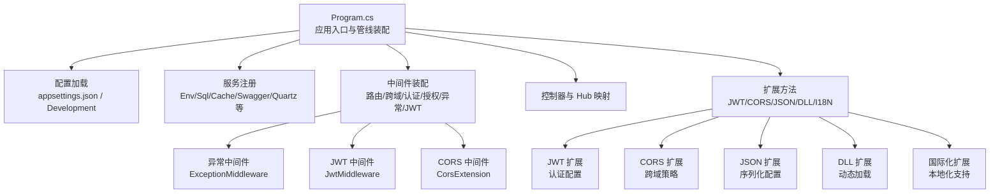
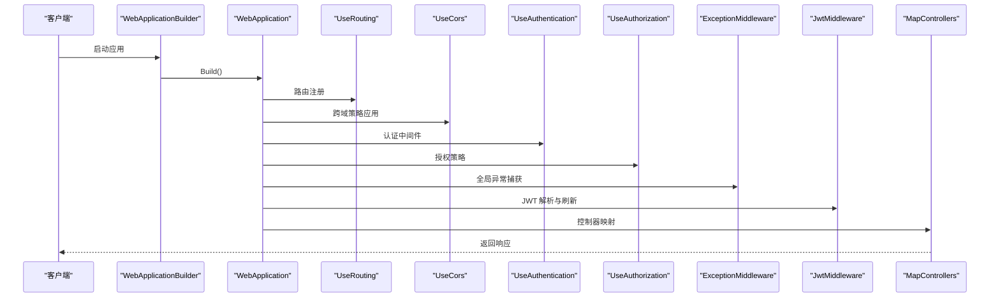
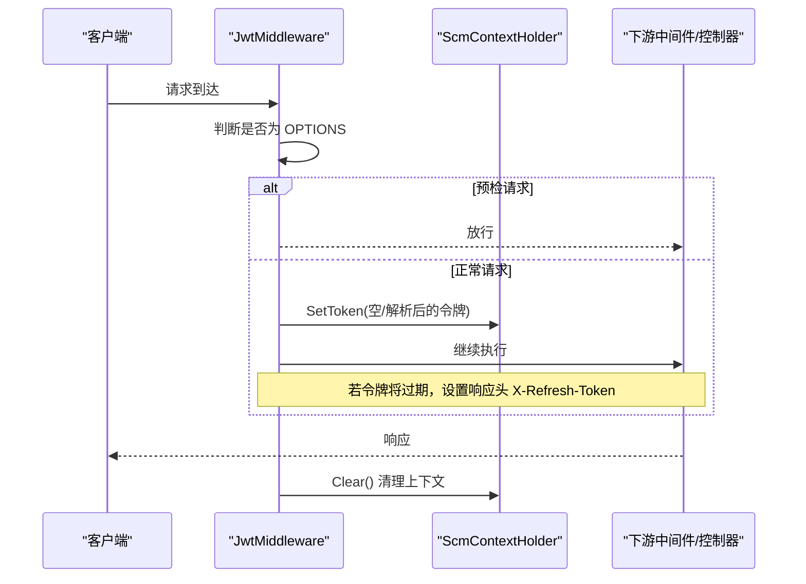
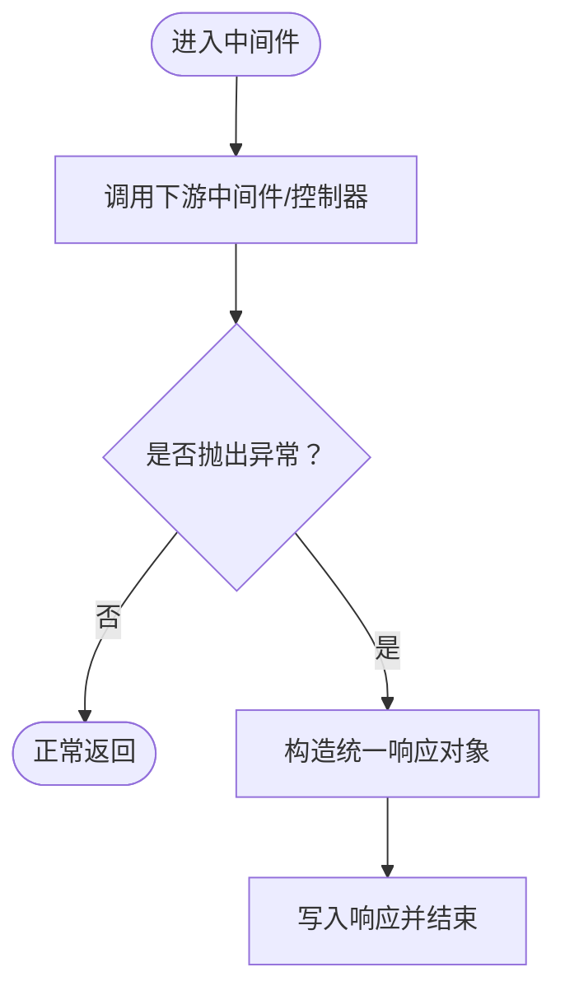
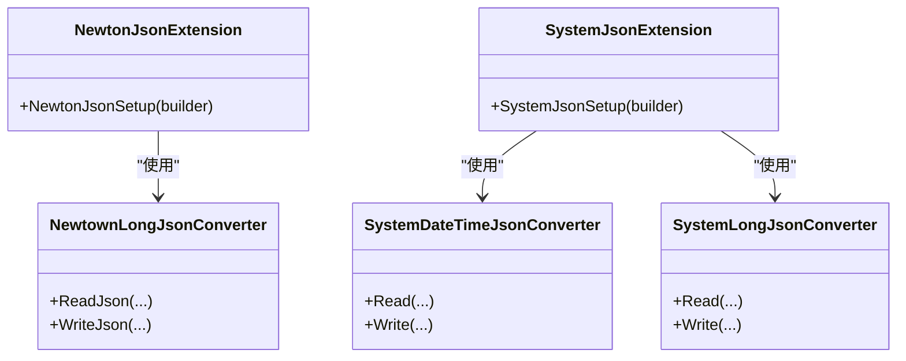
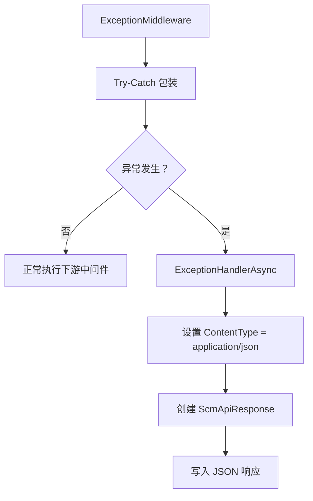
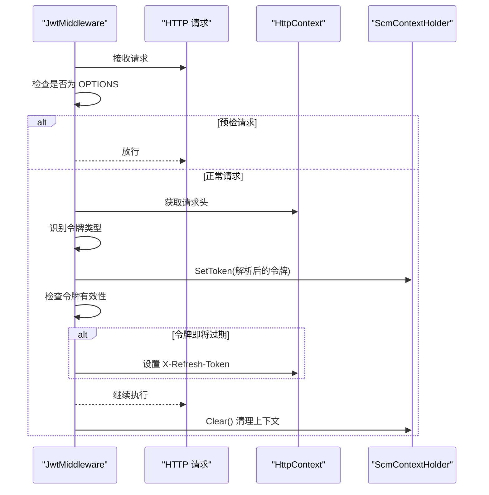
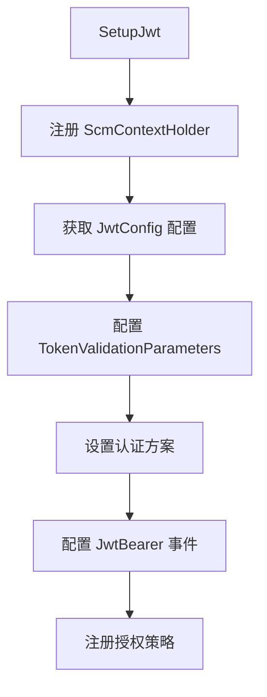
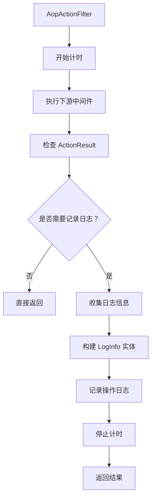
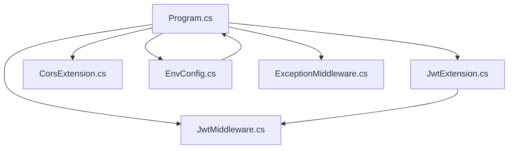

# 服务器基础设施

<cite>
**本文档引用的文件**
- [Program.cs](file://Scm.Net/Program.cs)
- [appsettings.json](file://Scm.Net/appsettings.json)
- [appsettings.Development.json](file://Scm.Net/appsettings.Development.json)
- [EnvConfig.cs](file://Scm.Server/Config/EnvConfig.cs)
- [JwtConfig.cs](file://Scm.Server/Config/JwtConfig.cs)
- [CorsConfig.cs](file://Scm.Server/Config/CorsConfig.cs)
- [SecurityConfig.cs](file://Scm.Server/Config/SecurityConfig.cs)
- [ExceptionMiddleware.cs](file://Scm.Core/Configure/Middleware/ExceptionMiddleware.cs)
- [JwtMiddleware.cs](file://Scm.Core/Configure/Middleware/JwtMiddleware.cs)
- [JwtExtension.cs](file://Scm.Server/Extensions/JwtExtension.cs)
- [CorsExtension.cs](file://Scm.Server/Extensions/CorsExtension.cs)
- [NewtonJsonExtension.cs](file://Scm.Server/Extensions/NewtonJsonExtension.cs)
- [SystemJsonExtension.cs](file://Scm.Server/Extensions/SystemJsonExtension.cs)
- [DllExtension.cs](file://Scm.Server/Extensions/DllExtension.cs)
- [I18NExtension.cs](file://Scm.Server/Extensions/I18NExtension.cs)
- [LogConfig.cs](file://Scm.Server/Config/LogConfig.cs)
- [DataConfig.cs](file://Scm.Server/Config/DataConfig.cs)
- [SqlConfig.cs](file://Scm.Server/Config/SqlConfig.cs)
- [WebConfig.cs](file://Scm.Server/Config/WebConfig.cs)
- [KestrelConfig.cs](file://Scm.Server/Config/KestrelConfig.cs)
</cite>

## 更新摘要
**所做更改**
- 新增中间件配置子系统详细分析，包括异常处理中间件、JWT中间件、CORS中间件的完整实现
- 新增扩展方法子系统，涵盖JWT扩展、CORS扩展、JSON序列化扩展、DLL动态加载扩展、国际化扩展
- 新增配置管理子系统，详细说明环境配置、安全配置、日志配置、数据配置、SQL配置、Web配置、Kestrel配置
- 新增性能监控子系统，包含AOP操作日志过滤器、性能计时、请求参数收集等监控机制
- 更新架构总览图，展示4个子系统的完整技术栈
- 补充故障排除指南，涵盖中间件配置、扩展方法使用、配置管理等常见问题

## 目录
1. [简介](#简介)
2. [项目结构](#项目结构)
3. [核心组件](#核心组件)
4. [架构总览](#架构总览)
5. [详细组件分析](#详细组件分析)
6. [中间件配置子系统](#中间件配置子系统)
7. [扩展方法子系统](#扩展方法子系统)
8. [配置管理子系统](#配置管理子系统)
9. [性能监控子系统](#性能监控子系统)
10. [依赖关系分析](#依赖关系分析)
11. [性能考虑](#性能考虑)
12. [故障排除指南](#故障排除指南)
13. [结论](#结论)
14. [附录](#附录)

## 简介
本文件面向 Scm.Net 服务器基础设施，系统性阐述配置管理架构与中间件体系，覆盖环境配置、服务注册扩展、中间件配置扩展、缓存、日志、安全（含 JWT、CORS）等主题，并提供性能优化、监控与运维最佳实践及故障排除建议。文档以实际源码为依据，配合图示帮助读者快速理解并落地实施。

**更新** 新增中间件配置、扩展方法、配置管理、性能监控等4个子系统的完整技术文档，提供更全面的服务器基础设施指导。

## 项目结构
Scm.Net 采用基于 ASP.NET Core 的现代 Web 应用结构，入口位于 Program.cs，通过 WebApplicationBuilder 构建应用，集中进行配置加载、服务注册与中间件装配。配置数据主要来源于 appsettings.json 及开发环境下的 appsettings.Development.json，按模块拆分在 Scm.Server.Config 与 Scm.Core.Configure.Middleware 下。

**图表来源**
- [Program.cs:33-258](file://Scm.Net/Program.cs#L33-L258)

**章节来源**
- [Program.cs:33-258](file://Scm.Net/Program.cs#L33-L258)
- [appsettings.json:1-127](file://Scm.Net/appsettings.json#L1-L127)
- [appsettings.Development.json:1-162](file://Scm.Net/appsettings.Development.json#L1-L162)

## 核心组件
- 环境配置与数据目录管理：EnvConfig 负责解析与标准化数据目录、上传、图片、日志、字体等路径，提供统一的路径拼接与文件读写能力。
- 安全配置：SecurityConfig 提供应用级安全参数占位，便于后续扩展签名校验、IP 限制等功能。
- JWT 配置与认证扩展：JwtConfig 定义签发者、受众、密钥与有效期；JwtExtension 将 JWT 配置注入到认证流程；JwtMiddleware 实现请求头令牌提取、会话刷新与上下文令牌注入。
- CORS 配置与扩展：CorsConfig 描述跨域策略；CorsExtension 将策略注册为服务，供中间件阶段启用。
- 异常处理中间件：ExceptionMiddleware 统一捕获未处理异常，返回结构化响应。
- JSON 序列化扩展：NewtonJsonExtension 与 SystemJsonExtension 分别提供 Newtonsoft 与 System.Text.Json 的序列化定制。
- DLL 动态加载扩展：DllExtension 支持从程序集动态加载服务接口。
- 国际化扩展：I18NExtension 提供多语言支持配置。

**章节来源**
- [EnvConfig.cs:1-280](file://Scm.Server/Config/EnvConfig.cs#L1-L280)
- [SecurityConfig.cs:1-44](file://Scm.Server/Config/SecurityConfig.cs#L1-L44)
- [JwtConfig.cs:1-48](file://Scm.Server/Config/JwtConfig.cs#L1-L48)
- [JwtExtension.cs:1-73](file://Scm.Server/Extensions/JwtExtension.cs#L1-L73)
- [JwtMiddleware.cs:1-180](file://Scm.Core/Configure/Middleware/JwtMiddleware.cs#L1-L180)
- [CorsConfig.cs:1-49](file://Scm.Server/Config/CorsConfig.cs#L1-L49)
- [CorsExtension.cs:1-59](file://Scm.Server/Extensions/CorsExtension.cs#L1-L59)
- [ExceptionMiddleware.cs:1-41](file://Scm.Core/Configure/Middleware/ExceptionMiddleware.cs#L1-L41)
- [NewtonJsonExtension.cs:1-53](file://Scm.Server/Extensions/NewtonJsonExtension.cs#L1-L53)
- [SystemJsonExtension.cs:1-75](file://Scm.Server/Extensions/SystemJsonExtension.cs#L1-L75)
- [DllExtension.cs:1-45](file://Scm.Server/Extensions/DllExtension.cs#L1-L45)
- [I18NExtension.cs:1-34](file://Scm.Server/Extensions/I18NExtension.cs#L1-L34)

## 架构总览
下图展示从请求进入至响应返回的关键路径，以及各中间件与扩展的作用位置。

**图表来源**
- [Program.cs:174-238](file://Scm.Net/Program.cs#L174-L238)

**章节来源**
- [Program.cs:174-238](file://Scm.Net/Program.cs#L174-L238)

## 详细组件分析

### 配置管理与环境设置
- 配置加载：Program.cs 在构建阶段读取 appsettings.json 并初始化 Serilog 日志；随后按模块读取 Env、Sql、Cache、Swagger、Quartz、Email、Phone、Aiml、Oidc、Otp、Jwt、Security、Cors 等配置。
- 环境配置：EnvConfig.Prepare 规范化数据目录与子目录（上传、图片、日志、字体等），提供路径拼接与文件读写工具方法，确保运行时目录存在且可访问。
- 开发环境差异：appsettings.Development.json 提供更高的日志级别、不同的数据目录与端口、更严格的 CORS 策略与 Swagger 文档配置。

**图表来源**
- [Program.cs:33-174](file://Scm.Net/Program.cs#L33-L174)
- [appsettings.json:39-127](file://Scm.Net/appsettings.json#L39-L127)
- [appsettings.Development.json:39-162](file://Scm.Net/appsettings.Development.json#L39-L162)

**章节来源**
- [Program.cs:33-174](file://Scm.Net/Program.cs#L33-L174)
- [appsettings.json:39-127](file://Scm.Net/appsettings.json#L39-L127)
- [appsettings.Development.json:39-162](file://Scm.Net/appsettings.Development.json#L39-L162)
- [EnvConfig.cs:72-120](file://Scm.Server/Config/EnvConfig.cs#L72-L120)

### JWT 中间件与认证扩展
- 配置项：JwtConfig 定义 Issuer、Audience、Security（密钥）、Expires（分钟）。JwtExtension 将配置注入 Authentication/JWT Bearer，并设置 TokenValidationParameters、消息接收事件与默认认证方案。
- 中间件行为：JwtMiddleware 在 OPTIONS 预检放行；对忽略列表中的路径（如 swagger、/scmhub、/api-config、/upload/）跳过验证；从请求头提取 AppToken、ApiToken 或通用 Token，分别走应用令牌与网页令牌流程；若令牌即将过期则在响应头附加 X-Refresh-Token 以触发前端刷新。
- 上下文注入：通过 ScmContextHolder 将解析后的 ScmToken 写入当前请求上下文，供后续处理器使用。

**图表来源**
- [JwtMiddleware.cs:42-97](file://Scm.Core/Configure/Middleware/JwtMiddleware.cs#L42-L97)
- [JwtMiddleware.cs:106-138](file://Scm.Core/Configure/Middleware/JwtMiddleware.cs#L106-L138)
- [JwtMiddleware.cs:147-178](file://Scm.Core/Configure/Middleware/JwtMiddleware.cs#L147-L178)
- [JwtExtension.cs:23-64](file://Scm.Server/Extensions/JwtExtension.cs#L23-L64)

**章节来源**
- [JwtConfig.cs:28-47](file://Scm.Server/Config/JwtConfig.cs#L28-L47)
- [JwtExtension.cs:14-71](file://Scm.Server/Extensions/JwtExtension.cs#L14-L71)
- [JwtMiddleware.cs:10-40](file://Scm.Core/Configure/Middleware/JwtMiddleware.cs#L10-L40)
- [JwtMiddleware.cs:42-97](file://Scm.Core/Configure/Middleware/JwtMiddleware.cs#L42-L97)
- [Program.cs:225-233](file://Scm.Net/Program.cs#L225-L233)

### 异常处理中间件
- 功能：ExceptionMiddleware 捕获管道内未处理异常，设置响应内容类型为 application/json，构造统一的响应对象（包含状态码与错误信息），并将结果序列化输出。
- 适用范围：作为全局异常兜底，建议置于管线靠前位置，避免被其他中间件吞没异常。

**图表来源**
- [ExceptionMiddleware.cs:17-39](file://Scm.Core/Configure/Middleware/ExceptionMiddleware.cs#L17-L39)

**章节来源**
- [ExceptionMiddleware.cs:17-39](file://Scm.Core/Configure/Middleware/ExceptionMiddleware.cs#L17-L39)
- [Program.cs:230-231](file://Scm.Net/Program.cs#L230-L231)

### CORS 配置与扩展
- 配置项：CorsConfig 支持全局开关、允许任意 Origin/Method/Header、凭据、暴露头与预检缓存时长等。
- 扩展注册：CorsExtension 将策略注册为服务，策略名固定；Program.cs 在运行时根据配置选择使用全局策略或默认策略。
- 使用时机：在 UseRouting 之后、UseAuthentication 之前启用，确保后续授权与控制器映射能正确识别跨域上下文。

**图表来源**
- [CorsConfig.cs:24-46](file://Scm.Server/Config/CorsConfig.cs#L24-L46)
- [CorsExtension.cs:8-56](file://Scm.Server/Extensions/CorsExtension.cs#L8-L56)
- [Program.cs:205-217](file://Scm.Net/Program.cs#L205-L217)

**章节来源**
- [CorsConfig.cs:1-49](file://Scm.Server/Config/CorsConfig.cs#L1-L49)
- [CorsExtension.cs:1-59](file://Scm.Server/Extensions/CorsExtension.cs#L1-L59)
- [Program.cs:205-217](file://Scm.Net/Program.cs#L205-L217)

### JSON 序列化扩展
- Newtonsoft.Json：NewtonJsonExtension 在 AddNewtonsoftJson 中添加日期与时长转换器、忽略循环引用与空值处理，统一序列化风格。
- System.Text.Json：SystemJsonExtension 在 AddJsonOptions 中配置忽略空值、循环引用处理与自定义日期/长整型转换器，提升性能与兼容性。

**图表来源**
- [NewtonJsonExtension.cs:10-33](file://Scm.Server/Extensions/NewtonJsonExtension.cs#L10-L33)
- [SystemJsonExtension.cs:11-22](file://Scm.Server/Extensions/SystemJsonExtension.cs#L11-L22)
- [SystemJsonExtension.cs:25-74](file://Scm.Server/Extensions/SystemJsonExtension.cs#L25-L74)

**章节来源**
- [NewtonJsonExtension.cs:1-53](file://Scm.Server/Extensions/NewtonJsonExtension.cs#L1-L53)
- [SystemJsonExtension.cs:1-75](file://Scm.Server/Extensions/SystemJsonExtension.cs#L1-L75)

### 缓存、日志与安全配置
- 缓存：appsettings.json 中 Cache.Type 与 Cache.Text 定义 Redis 连接参数，Program.cs 通过服务扩展进行缓存初始化与注册。
- 日志：Serilog 通过 appsettings.json 的 Serilog 节点配置控制台与文件输出、最小日志级别与属性，Program.cs 在启动时读取配置并创建 Logger。
- 安全：SecurityConfig 提供 AppKey/AesKey/DesKey/SignKey 与校验开关占位，便于后续接入签名与 IP 限制等策略。

**章节来源**
- [appsettings.json:57-60](file://Scm.Net/appsettings.json#L57-L60)
- [appsettings.json:3-25](file://Scm.Net/appsettings.json#L3-L25)
- [SecurityConfig.cs:9-37](file://Scm.Server/Config/SecurityConfig.cs#L9-L37)
- [Program.cs:72-88](file://Scm.Net/Program.cs#L72-L88)

## 中间件配置子系统

### 异常处理中间件
异常处理中间件作为全局异常兜底，提供统一的错误响应格式。其核心特性包括：

- **异常捕获**：捕获管道内所有未处理异常
- **响应格式化**：统一返回 application/json 格式
- **状态码设置**：设置 HTTP 500 状态码
- **消息处理**：提取异常消息作为响应内容

**图表来源**
- [ExceptionMiddleware.cs:17-39](file://Scm.Core/Configure/Middleware/ExceptionMiddleware.cs#L17-L39)

### JWT 认证中间件
JWT 中间件负责令牌验证、会话管理和上下文注入：

- **预检请求处理**：OPTIONS 方法直接放行
- **忽略路径过滤**：对特定路径跳过验证
- **多令牌支持**：支持 AppToken、ApiToken、通用 Token
- **会话刷新**：检测即将过期的令牌并返回新令牌
- **上下文管理**：通过 ScmContextHolder 管理令牌生命周期

**图表来源**
- [JwtMiddleware.cs:42-178](file://Scm.Core/Configure/Middleware/JwtMiddleware.cs#L42-L178)

### CORS 中间件
CORS 中间件提供灵活的跨域策略配置：

- **策略定义**：支持任意 Origin/Method/Header 或指定列表
- **凭据支持**：可配置是否允许携带凭据
- **暴露头设置**：允许客户端访问的服务端响应头
- **预检缓存**：配置预检请求的缓存时长
- **全局与局部**：支持全局策略或局部策略应用

**章节来源**
- [ExceptionMiddleware.cs:1-41](file://Scm.Core/Configure/Middleware/ExceptionMiddleware.cs#L1-L41)
- [JwtMiddleware.cs:1-180](file://Scm.Core/Configure/Middleware/JwtMiddleware.cs#L1-L180)
- [CorsConfig.cs:1-49](file://Scm.Server/Config/CorsConfig.cs#L1-L49)
- [CorsExtension.cs:1-59](file://Scm.Server/Extensions/CorsExtension.cs#L1-L59)

## 扩展方法子系统

### JWT 扩展方法
JWT 扩展方法提供完整的认证配置：

- **服务注册**：注册 ScmContextHolder 服务
- **配置绑定**：从配置文件绑定 JwtConfig
- **认证配置**：设置默认认证方案和挑战方案
- **令牌验证**：配置 TokenValidationParameters
- **消息处理**：自定义 OnMessageReceived 事件
- **授权策略**：定义 App 和 Admin 角色策略

**图表来源**
- [JwtExtension.cs:14-71](file://Scm.Server/Extensions/JwtExtension.cs#L14-L71)

### CORS 扩展方法
CORS 扩展方法实现灵活的跨域策略：

- **策略创建**：创建名为 ScmEnv.SCM_CORS 的策略
- **Origin 配置**：支持任意 Origin 或指定列表
- **Method 配置**：支持任意 Method 或指定列表
- **Header 配置**：支持任意 Header 或指定列表
- **凭据处理**：可选的凭据支持
- **暴露头设置**：配置客户端可访问的响应头
- **预检缓存**：设置预检请求缓存时长

**章节来源**
- [JwtExtension.cs:1-73](file://Scm.Server/Extensions/JwtExtension.cs#L1-L73)
- [CorsExtension.cs:1-59](file://Scm.Server/Extensions/CorsExtension.cs#L1-L59)

### JSON 序列化扩展
JSON 序列化扩展提供两种实现方案：

#### Newtonsoft.Json 扩展
- **日期格式化**：使用 IsoDateTimeConverter 格式化日期
- **长整型处理**：自定义 NewtownLongJsonConverter
- **循环引用**：忽略循环引用
- **空值处理**：忽略空值序列化

#### System.Text.Json 扩展
- **性能优化**：使用 Utf8JsonReader/Writer
- **日期格式化**：自定义 SystemDateTimeJsonConverter
- **长整型处理**：自定义 SystemLongJsonConverter
- **类型转换**：自定义 SystemTypeJsonConverter

**章节来源**
- [NewtonJsonExtension.cs:1-53](file://Scm.Server/Extensions/NewtonJsonExtension.cs#L1-L53)
- [SystemJsonExtension.cs:1-75](file://Scm.Server/Extensions/SystemJsonExtension.cs#L1-L75)

### DLL 动态加载扩展
DLL 扩展方法支持从程序集动态加载服务：

- **程序集加载**：根据程序集名称加载
- **服务发现**：查找继承自 Service 的类
- **生命周期管理**：注册为 Scoped 服务
- **异常处理**：捕获加载过程中的异常

**章节来源**
- [DllExtension.cs:1-45](file://Scm.Server/Extensions/DllExtension.cs#L1-L45)

### 国际化扩展
国际化扩展提供多语言支持：

- **资源配置**：设置 ResourcesPath
- **文化配置**：支持多种文化设置
- **请求本地化**：自动识别客户端语言偏好
- **UI 文化**：支持界面本地化

**章节来源**
- [I18NExtension.cs:1-34](file://Scm.Server/Extensions/I18NExtension.cs#L1-L34)

## 配置管理子系统

### 环境配置管理
EnvConfig 负责环境变量和路径配置：

- **数据目录**：支持相对和绝对路径
- **子目录管理**：统一管理 upload、images、avatar、logs、temp、fonts
- **路径解析**：提供路径组合和 URI 转换
- **文件操作**：封装文件读写操作
- **默认密码**：支持随机和固定密码模式

### 安全配置管理
SecurityConfig 提供安全相关配置：

- **应用密钥**：AppKey、AesKey、DesKey、SignKey
- **签名验证**：CheckSignature 标志位
- **应用验证**：CheckApp 标志位
- **扩展支持**：为后续安全策略预留接口

### 日志配置管理
LogConfig 提供日志相关配置占位符：

- **配置标识**：NAME 常量标识
- **扩展支持**：为后续日志策略预留接口

### 数据配置管理
DataConfig 管理数据共享配置：

- **共享用户**：ShareUserIds 数组
- **默认用户**：使用系统用户 ID
- **权限控制**：支持多用户数据共享

### SQL 配置管理
SqlConfig 管理数据库连接配置：

- **数据库类型**：默认 Sqlite
- **连接字符串**：默认 SQLite 数据库路径
- **类型验证**：确保配置完整性

### Web 配置管理
WebConfig 管理网站元数据：

- **站点信息**：SiteName、SiteUrl
- **SEO 信息**：Title、MetaKeyWords、MetaDescription
- **版权信息**：CopyRight 自动年份替换
- **自定义样式**：Styles、Scripts、Custom

### Kestrel 配置管理
KestrelConfig 管理服务器配置：

- **端点配置**：Endpoints.Http.Url
- **URL 规范化**：支持通配符和本地主机
- **扩展支持**：为后续 Kestrel 配置预留接口

**章节来源**
- [EnvConfig.cs:1-280](file://Scm.Server/Config/EnvConfig.cs#L1-L280)
- [SecurityConfig.cs:1-43](file://Scm.Server/Config/SecurityConfig.cs#L1-L43)
- [LogConfig.cs:1-8](file://Scm.Server/Config/LogConfig.cs#L1-L8)
- [DataConfig.cs:1-24](file://Scm.Server/Config/DataConfig.cs#L1-L24)
- [SqlConfig.cs:1-23](file://Scm.Server/Config/SqlConfig.cs#L1-L23)
- [WebConfig.cs:1-68](file://Scm.Server/Config/WebConfig.cs#L1-L68)
- [KestrelConfig.cs:1-23](file://Scm.Server/Config/KestrelConfig.cs#L1-L23)

## 性能监控子系统

### AOP 操作日志过滤器
AopActionFilter 提供全面的操作日志监控：

- **性能计时**：使用 Stopwatch 记录执行时间
- **结果检查**：检查 ActionResult 类型和数据
- **日志收集**：收集请求参数、用户信息、时间戳
- **用户代理**：记录客户端信息
- **操作统计**：构建 LogInfo 实体进行日志记录

### 监控指标收集
监控系统收集以下关键指标：

- **执行时间**：接口响应时间统计
- **请求参数**：接口调用参数记录
- **用户信息**：操作用户身份追踪
- **时间戳**：精确到秒的时间记录
- **客户端信息**：User-Agent 识别

### 日志过滤机制
- **忽略条件**：SkipLogging 方法判断是否记录日志
- **参数序列化**：使用 TextUtils.ToJsonString 序列化参数
- **类型识别**：通过 ControllerTypeInfo 获取接口类型
- **结果处理**：区分不同类型的 ActionResult

**图表来源**
- [AopActionFilter.cs:220-252](file://Scm.Core/Configure/Filters/AopActionFilter.cs#L220-L252)

**章节来源**
- [AopActionFilter.cs:220-252](file://Scm.Core/Configure/Filters/AopActionFilter.cs#L220-L252)

## 依赖关系分析
- 配置到服务：Program.cs 读取配置并调用各扩展方法（如 SetupJwt、CorsSetup、SqlSetup 等）完成服务注册。
- 中间件依赖：UseAuthentication/UseAuthorization 依赖 JwtExtension 注入的认证配置；JwtMiddleware 依赖 ScmContextHolder 与 JwtUtils；ExceptionMiddleware 作为全局兜底。
- 环境与路径：EnvConfig 为上传、图片、日志、字体等提供统一路径解析，被多处服务与中间件使用。

**图表来源**
- [Program.cs:44-174](file://Scm.Net/Program.cs#L44-L174)
- [JwtExtension.cs:14-71](file://Scm.Server/Extensions/JwtExtension.cs#L14-L71)
- [CorsExtension.cs:8-56](file://Scm.Server/Extensions/CorsExtension.cs#L8-L56)
- [EnvConfig.cs:72-120](file://Scm.Server/Config/EnvConfig.cs#L72-L120)
- [JwtMiddleware.cs:42-97](file://Scm.Core/Configure/Middleware/JwtMiddleware.cs#L42-L97)
- [ExceptionMiddleware.cs:17-39](file://Scm.Core/Configure/Middleware/ExceptionMiddleware.cs#L17-L39)

**章节来源**
- [Program.cs:44-174](file://Scm.Net/Program.cs#L44-L174)

## 性能考虑
- **序列化性能**：优先使用 System.Text.Json（SystemJsonExtension）以获得更高性能；仅在需要 Newtonsoft 特性时启用 NewtonJsonExtension。
- **数据库与连接**：SqlSugarScope 作为单例注册，减少连接开销；合理设置最大并发连接数与请求体大小（Kestrel Limits）。
- **缓存**：Redis 连接池大小需与并发场景匹配，避免阻塞与抖动。
- **日志**：生产环境建议降低最小日志级别，避免高频写盘；结合滚动策略与异步写入提升稳定性。
- **中间件顺序**：将 UseRouting 放在 UseCors 之前，UseAuthentication/UseAuthorization 紧随其后，减少不必要的重排。
- **监控开销**：AOP 过滤器会增加一定的性能开销，建议在生产环境谨慎使用或限制记录范围。

## 故障排除指南
- **JWT 无效或频繁过期**
  - 检查 JwtConfig 的 Issuer、Audience、Security 与 Expires 是否与签发端一致。
  - 关注 JwtMiddleware 对 X-Refresh-Token 的响应头设置，确认前端正确处理刷新。
- **跨域失败**
  - 确认 CorsConfig 的 AllowAnyOrigin/AllowedOrigins、AllowCredentials、AllowedMethods、AllowedHeaders 设置是否满足前端请求。
  - 确保 UseCors 在 UseAuthentication 之前调用。
- **异常未被捕获**
  - 确认 ExceptionMiddleware 在管线中处于靠前位置，且未被后续中间件吞没异常。
- **静态资源无法访问**
  - 检查 EnvConfig.DataUri 与 Program.cs 中的 UseFileServer 配置，确保请求路径与映射一致。
- **日志无输出或级别过高**
  - 检查 appsettings.json 中 Serilog 的最小级别与输出配置，必要时切换到 Development 配置验证。
- **DLL 加载失败**
  - 确认程序集名称正确，检查 DllExtension 的程序集加载逻辑。
- **国际化不生效**
  - 检查 I18NExtension 的 SupportedCultures 配置和 UseI18N 的调用时机。
- **性能监控异常**
  - 确认 AopActionFilter 的 SkipLogging 条件设置，避免过度记录。

**章节来源**
- [JwtConfig.cs:28-47](file://Scm.Server/Config/JwtConfig.cs#L28-L47)
- [JwtMiddleware.cs:118-137](file://Scm.Core/Configure/Middleware/JwtMiddleware.cs#L118-L137)
- [CorsConfig.cs:24-46](file://Scm.Server/Config/CorsConfig.cs#L24-L46)
- [Program.cs:205-217](file://Scm.Net/Program.cs#L205-L217)
- [ExceptionMiddleware.cs:17-39](file://Scm.Core/Configure/Middleware/ExceptionMiddleware.cs#L17-L39)
- [appsettings.json:3-25](file://Scm.Net/appsettings.json#L3-L25)
- [DllExtension.cs:28-43](file://Scm.Server/Extensions/DllExtension.cs#L28-L43)
- [I18NExtension.cs:28-31](file://Scm.Server/Extensions/I18NExtension.cs#L28-L31)
- [AopActionFilter.cs:220-252](file://Scm.Core/Configure/Filters/AopActionFilter.cs#L220-L252)

## 结论
Scm.Net 的服务器基础设施以清晰的配置分层与中间件管线为核心，通过 EnvConfig 统一路径管理、JwtExtension 与 JwtMiddleware 实现灵活的令牌解析与刷新、ExceptionMiddleware 提供全局异常兜底、CorsExtension 与配置项支撑跨域策略。新增的中间件配置子系统、扩展方法子系统、配置管理子系统和性能监控子系统进一步完善了基础设施架构。

结合合理的序列化、缓存、日志与 Kestrel 配置，可在保证安全性的同时获得良好的性能与可观测性。建议在生产环境中严格管理密钥与策略，持续监控关键指标并定期评估中间件与扩展的性能影响。新的4个子系统为开发者提供了更全面的工具集，支持更复杂的业务场景和更精细的系统控制。

## 附录
- **配置清单与默认值**
  - Kestrel：监听地址与并发限制、请求体大小限制。
  - Env：数据目录、上传、图片、日志、字体与默认字体。
  - Sql：数据库类型与连接字符串。
  - Cache：缓存类型与连接参数。
  - Quartz：作业与日志目录、基础目录与作业文件。
  - Email/Oidc/Otp/Generator/Jwt/Security/Cors：对应功能模块的配置键与默认值。
- **最佳实践**
  - 将敏感配置放入环境变量或密钥管理服务，避免硬编码。
  - 生产环境启用 HTTPS 与强密钥，定期轮换。
  - 使用健康检查与指标监控（如 Prometheus/Grafana）跟踪 QPS、延迟与错误率。
  - 对静态资源与大文件下载启用 CDN 与压缩，减少服务器压力。
  - 为不同环境维护独立的 appsettings.{Environment}.json，确保最小暴露面。
  - 合理使用 AOP 过滤器，避免过度监控影响性能。
  - 定期审查 CORS 策略，遵循最小权限原则。
  - 使用 System.Text.Json 替代 Newtonsoft.Json 以获得更好性能。