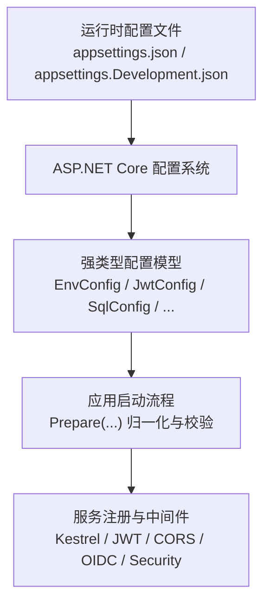
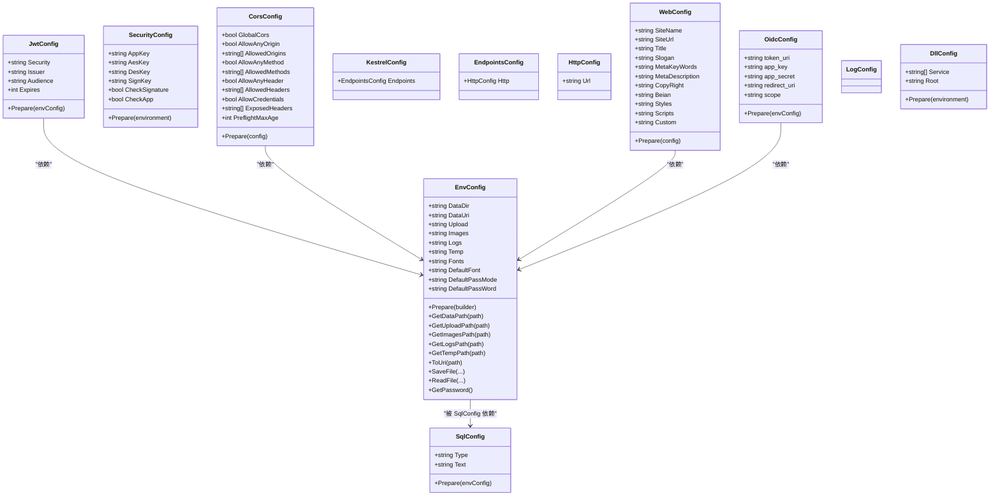
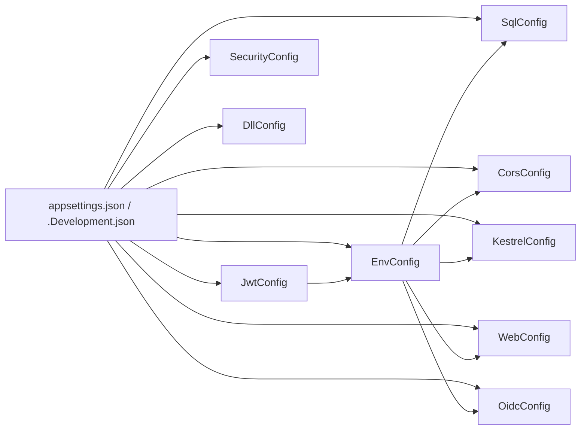
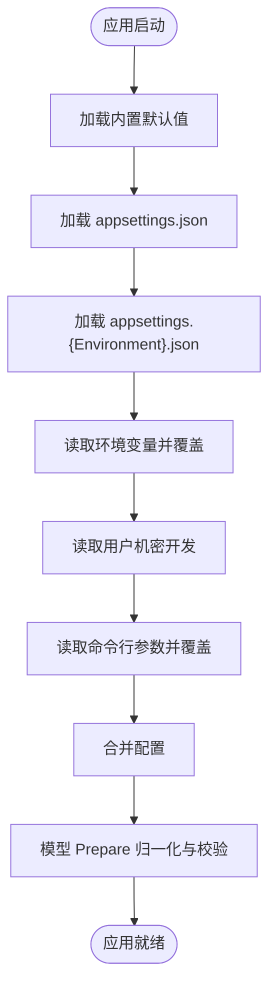

# 配置管理

<cite>
**本文引用的文件**
- [Scm.Net/appsettings.json](file://Scm.Net/appsettings.json)
- [Scm.Net/appsettings.Development.json](file://Scm.Net/appsettings.Development.json)
- [Scm.Server/Config/EnvConfig.cs](file://Scm.Server/Config/EnvConfig.cs)
- [Scm.Server/Config/JwtConfig.cs](file://Scm.Server/Config/JwtConfig.cs)
- [Scm.Server/Config/SecurityConfig.cs](file://Scm.Server/Config/SecurityConfig.cs)
- [Scm.Server/Config/DataConfig.cs](file://Scm.Server/Config/DataConfig.cs)
- [Scm.Server/Config/SqlConfig.cs](file://Scm.Server/Config/SqlConfig.cs)
- [Scm.Server/Config/CorsConfig.cs](file://Scm.Server/Config/CorsConfig.cs)
- [Scm.Server/Config/KestrelConfig.cs](file://Scm.Server/Config/KestrelConfig.cs)
- [Scm.Server/Config/WebConfig.cs](file://Scm.Server/Config/WebConfig.cs)
- [Scm.Server/Config/OidcConfig.cs](file://Scm.Server/Config/OidcConfig.cs)
- [Scm.Server/Config/LogConfig.cs](file://Scm.Server/Config/LogConfig.cs)
- [Scm.Server/Config/DllConfig.cs](file://Scm.Server/Config/DllConfig.cs)
</cite>

## 目录
1. [引言](#引言)
2. [项目结构](#项目结构)
3. [核心组件](#核心组件)
4. [架构总览](#架构总览)
5. [详细组件分析](#详细组件分析)
6. [依赖分析](#依赖分析)
7. [性能考量](#性能考量)
8. [故障排除指南](#故障排除指南)
9. [结论](#结论)
10. [附录](#附录)

## 引言
本文件面向 Scm.Net 的配置管理体系，系统性阐述配置层次结构、优先级与继承关系，以及各类配置（环境、JWT、数据库、安全、跨域、Web、OIDC、日志、项目）的实现方式与最佳实践。文档同时覆盖配置文件加载顺序、合并策略、验证机制、热更新方案与注意事项、安全性考虑（敏感信息保护与配置加密）、配置模板与环境变量使用建议、完整配置示例与故障排除。

## 项目结构
Scm.Net 的配置体系由两部分组成：
- 运行时配置文件：位于应用启动项目中，采用标准的 JSON 格式，按环境分层（如开发、生产），通过 ASP.NET Core 的配置系统进行加载与合并。
- 运行时配置模型：位于服务端配置模块中，定义了各配置段对应的强类型类，负责在应用启动阶段对配置进行校验、归一化与准备。

图表来源
- [Scm.Net/appsettings.json:1-127](file://Scm.Net/appsettings.json#L1-L127)
- [Scm.Net/appsettings.Development.json:1-162](file://Scm.Net/appsettings.Development.json#L1-L162)
- [Scm.Server/Config/EnvConfig.cs:72-102](file://Scm.Server/Config/EnvConfig.cs#L72-L102)
- [Scm.Server/Config/JwtConfig.cs:28-47](file://Scm.Server/Config/JwtConfig.cs#L28-L47)
- [Scm.Server/Config/SqlConfig.cs:10-21](file://Scm.Server/Config/SqlConfig.cs#L10-L21)

章节来源
- [Scm.Net/appsettings.json:1-127](file://Scm.Net/appsettings.json#L1-L127)
- [Scm.Net/appsettings.Development.json:1-162](file://Scm.Net/appsettings.Development.json#L1-L162)

## 核心组件
- 环境配置（EnvConfig）
  - 职责：解析与准备数据目录、上传、图片、日志、临时、字体等路径；提供路径拼接与 URI 映射能力；提供默认密码生成策略。
  - 关键点：路径规范化、目录自动创建、默认值处理、密码模式选择。
- JWT 配置（JwtConfig）
  - 职责：提供安全密钥、发行者、受众、过期时间等参数，并在启动时进行默认值填充与校验。
- 数据库配置（SqlConfig）
  - 职责：提供数据库类型与连接字符串，默认值填充。
- 安全配置（SecurityConfig）
  - 职责：应用密钥、签名与 IP 校验开关等（当前未启用具体逻辑，保留扩展位）。
- 跨域配置（CorsConfig）
  - 职责：全局跨域开关、允许来源、方法、头、凭据、预检缓存等，并进行数组与数值的默认值处理。
- Kestrel 配置（KestrelConfig）
  - 职责：HTTP 端点 URL 等 Kestrel 相关设置（用于后续中间件集成）。
- Web 配置（WebConfig）
  - 职责：站点元信息、版权、自定义样式与脚本等，并进行默认值与版权占位符替换。
- OIDC 配置（OidcConfig）
  - 职责：OIDC 接入参数（应用键、密钥、回调地址、作用域）与令牌端点默认值。
- 日志配置（LogConfig）
  - 职责：日志配置段标识（当前未启用具体逻辑，保留扩展位）。
- 项目配置（DllConfig）
  - 职责：项目服务 DLL 列表与根目录（ContentRootPath）。

章节来源
- [Scm.Server/Config/EnvConfig.cs:1-280](file://Scm.Server/Config/EnvConfig.cs#L1-L280)
- [Scm.Server/Config/JwtConfig.cs:1-48](file://Scm.Server/Config/JwtConfig.cs#L1-L48)
- [Scm.Server/Config/SqlConfig.cs:1-23](file://Scm.Server/Config/SqlConfig.cs#L1-L23)
- [Scm.Server/Config/SecurityConfig.cs:1-44](file://Scm.Server/Config/SecurityConfig.cs#L1-L44)
- [Scm.Server/Config/CorsConfig.cs:1-49](file://Scm.Server/Config/CorsConfig.cs#L1-L49)
- [Scm.Server/Config/KestrelConfig.cs:1-24](file://Scm.Server/Config/KestrelConfig.cs#L1-L24)
- [Scm.Server/Config/WebConfig.cs:1-68](file://Scm.Server/Config/WebConfig.cs#L1-L68)
- [Scm.Server/Config/OidcConfig.cs:1-24](file://Scm.Server/Config/OidcConfig.cs#L1-L24)
- [Scm.Server/Config/LogConfig.cs:1-8](file://Scm.Server/Config/LogConfig.cs#L1-L8)
- [Scm.Server/Config/DllConfig.cs:1-27](file://Scm.Server/Config/DllConfig.cs#L1-L27)

## 架构总览
配置系统遵循“配置文件 + 强类型模型”的双层设计：
- 配置文件层：以 JSON 结构承载各功能段配置，按环境分层，支持默认值与覆盖。
- 模型层：每个配置段对应一个强类型类，负责在应用启动时进行 Prepare 归一化与校验，确保运行时一致性与健壮性。

图表来源
- [Scm.Server/Config/EnvConfig.cs:1-280](file://Scm.Server/Config/EnvConfig.cs#L1-L280)
- [Scm.Server/Config/JwtConfig.cs:1-48](file://Scm.Server/Config/JwtConfig.cs#L1-L48)
- [Scm.Server/Config/SqlConfig.cs:1-23](file://Scm.Server/Config/SqlConfig.cs#L1-L23)
- [Scm.Server/Config/SecurityConfig.cs:1-44](file://Scm.Server/Config/SecurityConfig.cs#L1-L44)
- [Scm.Server/Config/CorsConfig.cs:1-49](file://Scm.Server/Config/CorsConfig.cs#L1-L49)
- [Scm.Server/Config/KestrelConfig.cs:1-24](file://Scm.Server/Config/KestrelConfig.cs#L1-L24)
- [Scm.Server/Config/WebConfig.cs:1-68](file://Scm.Server/Config/WebConfig.cs#L1-L68)
- [Scm.Server/Config/OidcConfig.cs:1-24](file://Scm.Server/Config/OidcConfig.cs#L1-L24)
- [Scm.Server/Config/LogConfig.cs:1-8](file://Scm.Server/Config/LogConfig.cs#L1-L8)
- [Scm.Server/Config/DllConfig.cs:1-27](file://Scm.Server/Config/DllConfig.cs#L1-L27)

## 详细组件分析

### 配置层次结构与优先级
- 层次结构
  - 根配置段：Serilog、Kestrel、Env、Sql、Uid、Cache、Quartz、Phone、Email、Oidc、Otp、Generator、Jwt、Security、Project、Cors 等。
  - 子配置段：Kestrel.Endpoints.Http、Otp.Hotp/Totp、Swagger（开发环境）等。
- 加载顺序与合并策略
  - ASP.NET Core 配置系统会按以下顺序加载并合并配置（从低优先级到高优先级）：
    1) 内置默认值（框架默认）
    2) appsettings.json
    3) appsettings.{Environment}.json
    4) 环境变量（覆盖键名，支持层级，如 Serilog__WriteTo__0__Args__path）
    5) 用户机密（开发场景）
    6) 命令行参数（最高优先级）
  - 合并规则：对象属性逐层合并，数组按配置项追加或替换；键名大小写不敏感（取决于平台）。
- 继承关系
  - 运行时配置模型在 Prepare 中对字段进行默认值填充与校验，形成“配置文件 + 模型默认值”的继承链。

章节来源
- [Scm.Net/appsettings.json:1-127](file://Scm.Net/appsettings.json#L1-L127)
- [Scm.Net/appsettings.Development.json:1-162](file://Scm.Net/appsettings.Development.json#L1-L162)

### 环境配置（EnvConfig）
- 路径处理
  - 自动规范化路径分隔符，支持相对路径与绝对路径，不存在则创建目录。
  - 提供统一的路径拼接与 URI 映射方法，便于资源访问。
- 默认密码策略
  - 支持固定与随机两种模式，随机模式下生成指定长度的随机字符串作为默认密码。
- 关键方法
  - Prepare(builder)：解析 DataDir、DataUri 并创建子目录。
  - GetDataPath/GetUploadPath/GetImagesPath/GetLogsPath/GetTempPath：路径拼接。
  - ToUri：将物理路径映射为对外访问的 URI。
  - SaveFile/ReadFile 及其异步版本：读写数据目录下的文件。

章节来源
- [Scm.Server/Config/EnvConfig.cs:72-102](file://Scm.Server/Config/EnvConfig.cs#L72-L102)
- [Scm.Server/Config/EnvConfig.cs:123-172](file://Scm.Server/Config/EnvConfig.cs#L123-L172)
- [Scm.Server/Config/EnvConfig.cs:174-177](file://Scm.Server/Config/EnvConfig.cs#L174-L177)
- [Scm.Server/Config/EnvConfig.cs:180-263](file://Scm.Server/Config/EnvConfig.cs#L180-L263)
- [Scm.Server/Config/EnvConfig.cs:266-277](file://Scm.Server/Config/EnvConfig.cs#L266-L277)

### JWT 配置（JwtConfig）
- 字段与默认值
  - Security、Issuer、Audience、Expires 在 Prepare 中进行默认值填充与边界检查。
- 使用场景
  - 与认证中间件配合，生成与验证令牌。

章节来源
- [Scm.Server/Config/JwtConfig.cs:28-47](file://Scm.Server/Config/JwtConfig.cs#L28-L47)

### 数据库配置（SqlConfig）
- 字段与默认值
  - Type 缺省为 Sqlite，Text 缺省为本地数据库连接串。
- 依赖关系
  - Prepare 依赖 EnvConfig，确保数据库文件路径基于 DataDir 规范化。

章节来源
- [Scm.Server/Config/SqlConfig.cs:10-21](file://Scm.Server/Config/SqlConfig.cs#L10-L21)

### 安全配置（SecurityConfig）
- 字段
  - AppKey、AesKey、DesKey、SignKey、CheckSignature、CheckApp。
- 扩展位
  - 当前 Prepare 为空，保留未来签名与 IP 校验逻辑。

章节来源
- [Scm.Server/Config/SecurityConfig.cs:39-41](file://Scm.Server/Config/SecurityConfig.cs#L39-L41)

### 跨域配置（CorsConfig）
- 字段与默认值
  - 允许来源、方法、头、凭据、暴露头、预检缓存等均进行数组初始化与最小值约束。
- 使用场景
  - 与 CORS 中间件集成，控制前端跨域访问策略。

章节来源
- [Scm.Server/Config/CorsConfig.cs:24-46](file://Scm.Server/Config/CorsConfig.cs#L24-L46)

### Kestrel 配置（KestrelConfig）
- 字段
  - Endpoints.Http.Url 用于监听地址与端口。
- 使用场景
  - 与 Kestrel 服务器集成，设置 HTTP 端点。

章节来源
- [Scm.Server/Config/KestrelConfig.cs:7-18](file://Scm.Server/Config/KestrelConfig.cs#L7-L18)

### Web 配置（WebConfig）
- 字段
  - 站点名称、标题、关键字、描述、版权、备案、外部样式与脚本、自定义信息。
- 默认值
  - Prepare 中为 SiteName 与版权信息设置默认值与占位符替换。

章节来源
- [Scm.Server/Config/WebConfig.cs:56-65](file://Scm.Server/Config/WebConfig.cs#L56-L65)

### OIDC 配置（OidcConfig）
- 字段
  - token_uri、app_key、app_secret、redirect_uri、scope。
- 默认值
  - Prepare 中为 token_uri 设置默认值。

章节来源
- [Scm.Server/Config/OidcConfig.cs:17-23](file://Scm.Server/Config/OidcConfig.cs#L17-L23)

### 日志配置（LogConfig）
- 字段
  - LogConfig 仅作为配置段标识，实际日志配置由 appsettings.json 中的 Serilog 段落承担。

章节来源
- [Scm.Server/Config/LogConfig.cs:5](file://Scm.Server/Config/LogConfig.cs#L5)

### 项目配置（DllConfig）
- 字段
  - Service（服务 DLL 列表）、Root（项目根目录）。
- 默认值
  - Prepare 将 Root 设为 ContentRootPath。

章节来源
- [Scm.Server/Config/DllConfig.cs:21-24](file://Scm.Server/Config/DllConfig.cs#L21-L24)

## 依赖分析
- 配置模型之间的依赖
  - JwtConfig、CorsConfig、WebConfig、OidcConfig 均依赖 EnvConfig，确保路径与资源可用。
  - SqlConfig 依赖 EnvConfig，保证数据库文件路径正确。
- 配置文件与模型的绑定
  - ASP.NET Core 的 Configure<T> 将 appsettings.json 的各段映射到对应配置类，随后调用 Prepare 完成归一化。

图表来源
- [Scm.Net/appsettings.json:1-127](file://Scm.Net/appsettings.json#L1-L127)
- [Scm.Net/appsettings.Development.json:1-162](file://Scm.Net/appsettings.Development.json#L1-L162)
- [Scm.Server/Config/EnvConfig.cs:1-280](file://Scm.Server/Config/EnvConfig.cs#L1-L280)
- [Scm.Server/Config/JwtConfig.cs:1-48](file://Scm.Server/Config/JwtConfig.cs#L1-L48)
- [Scm.Server/Config/SqlConfig.cs:1-23](file://Scm.Server/Config/SqlConfig.cs#L1-L23)
- [Scm.Server/Config/SecurityConfig.cs:1-44](file://Scm.Server/Config/SecurityConfig.cs#L1-L44)
- [Scm.Server/Config/CorsConfig.cs:1-49](file://Scm.Server/Config/CorsConfig.cs#L1-L49)
- [Scm.Server/Config/KestrelConfig.cs:1-24](file://Scm.Server/Config/KestrelConfig.cs#L1-L24)
- [Scm.Server/Config/WebConfig.cs:1-68](file://Scm.Server/Config/WebConfig.cs#L1-L68)
- [Scm.Server/Config/OidcConfig.cs:1-24](file://Scm.Server/Config/OidcConfig.cs#L1-L24)
- [Scm.Server/Config/DllConfig.cs:1-27](file://Scm.Server/Config/DllConfig.cs#L1-L27)

## 性能考量
- 配置读取与解析
  - 配置文件为静态 JSON，解析成本极低；建议避免频繁重载大体量配置。
- 路径计算与 I/O
  - EnvConfig 的路径拼接与目录创建在启动阶段完成，运行时仅做字符串拼接，开销很小。
- 中间件与配置
  - Kestrel、CORS、JWT 等中间件的配置应尽量简洁，避免在热路径上产生额外判断分支。

## 故障排除指南
- 路径无法访问或权限不足
  - 症状：日志、上传、图片等目录创建失败或读写异常。
  - 排查：确认 DataDir 与子目录路径存在且具备写权限；检查路径分隔符与盘符。
  - 参考：EnvConfig 的路径规范化与目录创建逻辑。
- 数据库连接失败
  - 症状：应用启动时报数据库连接错误。
  - 排查：核对 SqlConfig.Type 与 Text；确认数据库文件路径基于 DataDir 正确解析。
- JWT 参数缺失导致认证异常
  - 症状：令牌签发或验证失败。
  - 排查：确认 JwtConfig.Security、Issuer、Audience、Expires 已正确设置或被 Prepare 填充。
- CORS 策略过于严格导致跨域失败
  - 症状：前端请求被浏览器阻止。
  - 排查：核对 CorsConfig 的 AllowAnyOrigin/AllowedOrigins、AllowAnyMethod/AllowedMethods、AllowAnyHeader/AllowedHeaders、AllowCredentials 等。
- OIDC 回调地址不匹配
  - 症状：登录后跳转至错误地址或失败。
  - 排查：核对 OidcConfig.redirect_uri 与平台配置一致。
- 开发环境日志级别过高或过低
  - 症状：调试困难或日志过多。
  - 排查：调整 appsettings.Development.json 中 Serilog 的 MinimumLevel 与 WriteTo 配置。

章节来源
- [Scm.Server/Config/EnvConfig.cs:104-120](file://Scm.Server/Config/EnvConfig.cs#L104-L120)
- [Scm.Server/Config/SqlConfig.cs:12-20](file://Scm.Server/Config/SqlConfig.cs#L12-L20)
- [Scm.Server/Config/JwtConfig.cs:30-46](file://Scm.Server/Config/JwtConfig.cs#L30-L46)
- [Scm.Server/Config/CorsConfig.cs:26-45](file://Scm.Server/Config/CorsConfig.cs#L26-L45)
- [Scm.Server/Config/OidcConfig.cs:19-22](file://Scm.Server/Config/OidcConfig.cs#L19-L22)
- [Scm.Net/appsettings.Development.json:4-24](file://Scm.Net/appsettings.Development.json#L4-L24)

## 结论
Scm.Net 的配置体系通过“配置文件 + 强类型模型”的组合，实现了清晰的层次结构与可靠的默认值填充。EnvConfig 作为基础配置，为其他配置模型提供路径与资源保障；Jwt、Sql、Security、Cors、Web、Oidc、Dll 等配置模型在启动阶段完成归一化与校验，确保运行时一致性。结合合理的环境变量覆盖与最小化热更新策略，可在保证安全性的同时提升运维效率。

## 附录

### 配置文件加载顺序与合并策略（流程图）

图表来源
- [Scm.Net/appsettings.json:1-127](file://Scm.Net/appsettings.json#L1-L127)
- [Scm.Net/appsettings.Development.json:1-162](file://Scm.Net/appsettings.Development.json#L1-L162)

### 配置热更新实现方案与注意事项
- 方案
  - 使用 ASP.NET Core 的 IConfigurationWatcher 或手动监听配置文件变更并触发重新绑定。
  - 对于轻量配置（如日志、调试开关），可直接替换对应配置段并刷新中间件。
  - 对于数据库、JWT、安全等关键配置，建议通过滚动重启或蓝绿发布降低风险。
- 注意事项
  - 避免在热更新期间修改关键路径（如 DataDir、数据库连接串）。
  - 对于需要重启才能生效的配置（如 Kestrel 端口），需提前规划停机窗口。
  - 记录热更新事件与回滚预案，确保可追踪与可恢复。

### 配置安全性考虑
- 敏感信息保护
  - 将数据库密码、JWT 密钥、OIDC 密钥、邮件凭据等放入环境变量或机密存储，不在仓库中提交。
  - 使用配置加密工具对敏感字段进行加密存储，解密仅在运行时进行。
- 配置加密
  - 对关键配置（如 Security.AesKey/DesKey、Jwt.Security）采用对称加密，密钥单独管理。
- 最佳实践
  - 使用配置模板与环境变量占位符，避免硬编码。
  - 分环境分仓管理配置，最小权限原则。
  - 定期轮换密钥与令牌，建立审计日志。

### 配置模板与示例（路径参考）
- 基础配置模板（appsettings.json）
  - 参考路径：[Scm.Net/appsettings.json:1-127](file://Scm.Net/appsettings.json#L1-L127)
- 开发环境模板（appsettings.Development.json）
  - 参考路径：[Scm.Net/appsettings.Development.json:1-162](file://Scm.Net/appsettings.Development.json#L1-L162)
- 强类型配置模型
  - 参考路径：
    - [Scm.Server/Config/EnvConfig.cs:1-280](file://Scm.Server/Config/EnvConfig.cs#L1-L280)
    - [Scm.Server/Config/JwtConfig.cs:1-48](file://Scm.Server/Config/JwtConfig.cs#L1-L48)
    - [Scm.Server/Config/SqlConfig.cs:1-23](file://Scm.Server/Config/SqlConfig.cs#L1-L23)
    - [Scm.Server/Config/SecurityConfig.cs:1-44](file://Scm.Server/Config/SecurityConfig.cs#L1-L44)
    - [Scm.Server/Config/CorsConfig.cs:1-49](file://Scm.Server/Config/CorsConfig.cs#L1-L49)
    - [Scm.Server/Config/KestrelConfig.cs:1-24](file://Scm.Server/Config/KestrelConfig.cs#L1-L24)
    - [Scm.Server/Config/WebConfig.cs:1-68](file://Scm.Server/Config/WebConfig.cs#L1-L68)
    - [Scm.Server/Config/OidcConfig.cs:1-24](file://Scm.Server/Config/OidcConfig.cs#L1-L24)
    - [Scm.Server/Config/LogConfig.cs:1-8](file://Scm.Server/Config/LogConfig.cs#L1-L8)
    - [Scm.Server/Config/DllConfig.cs:1-27](file://Scm.Server/Config/DllConfig.cs#L1-L27)