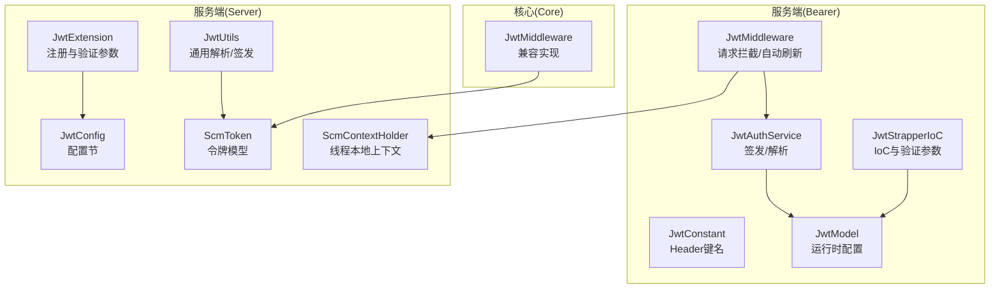
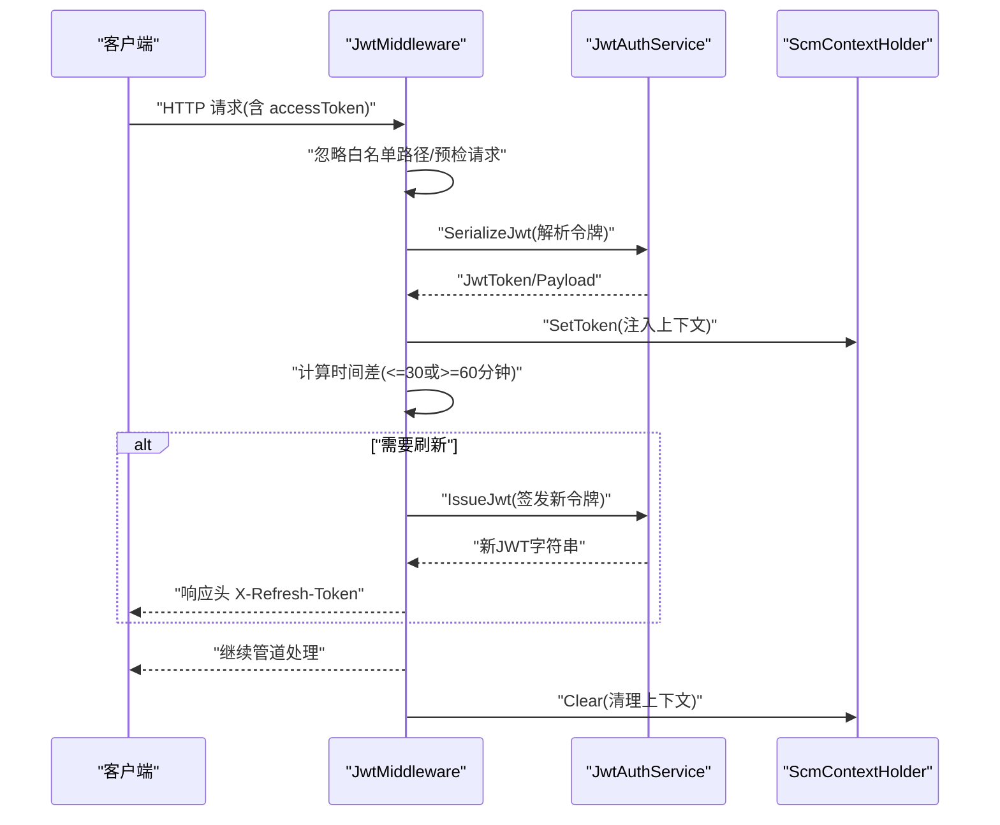
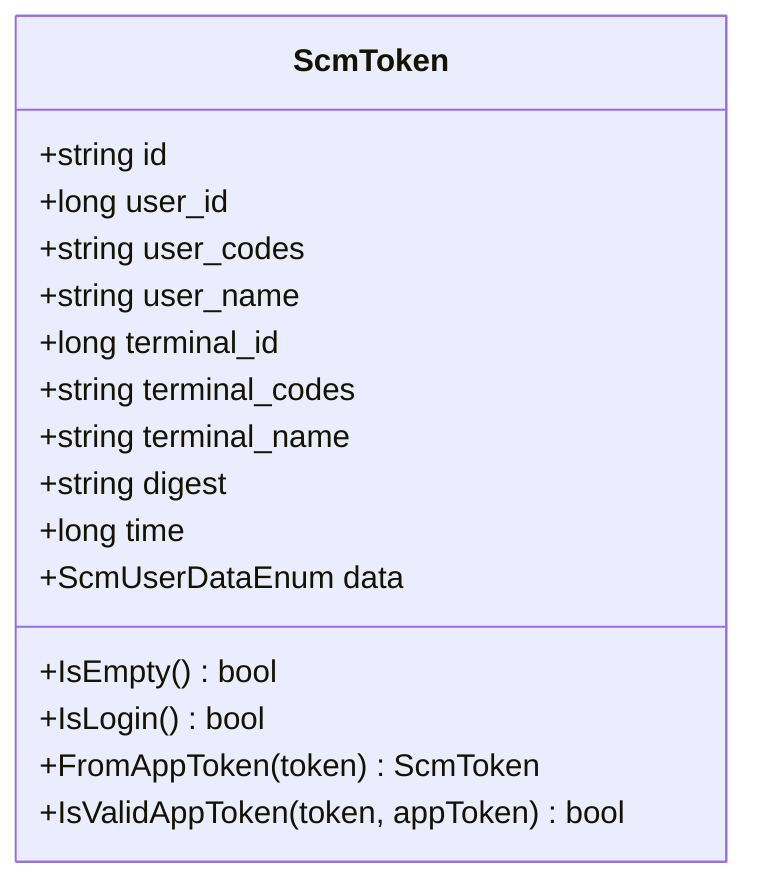
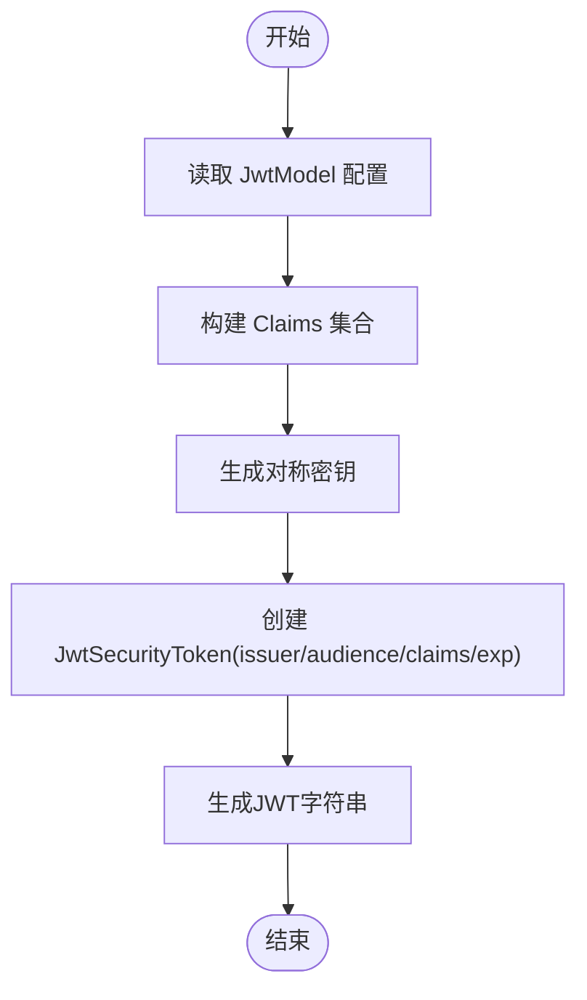
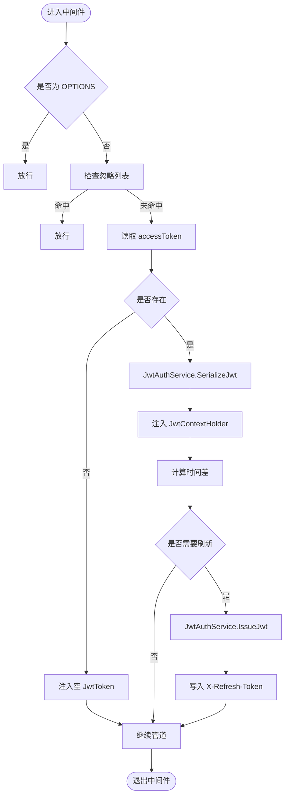
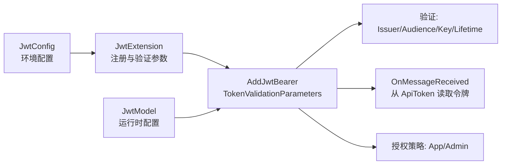
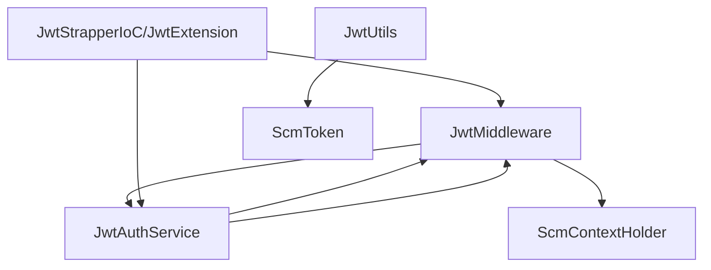

# JWT 令牌管理

<cite>
**本文引用的文件**
- [JwtAuthService.cs](file://Scm.Server.Bearer/JwtAuthService.cs)
- [JwtMiddleware.cs](file://Scm.Server.Bearer/JwtMiddleware.cs)
- [JwtStrapperIoC.cs](file://Scm.Server.Bearer/JwtStrapperIoC.cs)
- [JwtConstant.cs](file://Scm.Server.Bearer/Jwt/JwtConstant.cs)
- [JwtModel.cs](file://Scm.Server.Bearer/Jwt/Model/JwtModel.cs)
- [JwtConfig.cs](file://Scm.Server/Config/JwtConfig.cs)
- [JwtExtension.cs](file://Scm.Server/Extensions/JwtExtension.cs)
- [ScmToken.cs](file://Scm.Server/Token/ScmToken.cs)
- [ScmContextHolder.cs](file://Scm.Server/Token/ScmContextHolder.cs)
- [JwtMiddleware.cs](file://Scm.Core/Configure/Middleware/JwtMiddleware.cs)
- [JwtUtils.cs](file://Scm.Server/Utils/JwtUtils.cs)
</cite>

## 目录
1. [简介](#简介)
2. [项目结构](#项目结构)
3. [核心组件](#核心组件)
4. [架构总览](#架构总览)
5. [详细组件分析](#详细组件分析)
6. [依赖关系分析](#依赖关系分析)
7. [性能考量](#性能考量)
8. [故障排查指南](#故障排查指南)
9. [结论](#结论)
10. [附录](#附录)

## 简介
本文件面向 Scm.Net 中的 JWT 令牌管理能力，系统化阐述以下主题：
- 令牌生成、解析与验证机制
- ScmToken 类的设计与职责边界
- JwtAuthService 的签发与解析流程
- JwtMiddleware 中间件的请求拦截、令牌校验与用户上下文注入
- 配置项说明（签名算法、过期时间、密钥与安全策略）
- 令牌生命周期、自动刷新与撤销策略
- 客户端集成示例与最佳实践

## 项目结构
围绕 JWT 的核心代码分布在以下模块：
- 服务层（Bearer）：负责令牌签发、解析与中间件拦截
- 服务层（Server）：负责配置与扩展注册、通用工具与上下文
- 核心层（Core）：提供另一套兼容的中间件实现

图表来源
- [JwtAuthService.cs:12-86](file://Scm.Server.Bearer/JwtAuthService.cs#L12-L86)
- [JwtMiddleware.cs:9-79](file://Scm.Server.Bearer/JwtMiddleware.cs#L9-L79)
- [JwtStrapperIoC.cs:11-57](file://Scm.Server.Bearer/JwtStrapperIoC.cs#L11-L57)
- [JwtConstant.cs:6-12](file://Scm.Server.Bearer/Jwt/JwtConstant.cs#L6-L12)
- [JwtModel.cs:6-29](file://Scm.Server.Bearer/Jwt/Model/JwtModel.cs#L6-L29)
- [JwtConfig.cs:3-48](file://Scm.Server/Config/JwtConfig.cs#L3-L48)
- [JwtExtension.cs:12-73](file://Scm.Server/Extensions/JwtExtension.cs#L12-L73)
- [ScmToken.cs:8-99](file://Scm.Server/Token/ScmToken.cs#L8-L99)
- [ScmContextHolder.cs:6-45](file://Scm.Server/Token/ScmContextHolder.cs#L6-L45)
- [JwtMiddleware.cs:8-180](file://Scm.Core/Configure/Middleware/JwtMiddleware.cs#L8-L180)
- [JwtUtils.cs:31-87](file://Scm.Server/Utils/JwtUtils.cs#L31-L87)

章节来源
- [JwtAuthService.cs:12-86](file://Scm.Server.Bearer/JwtAuthService.cs#L12-L86)
- [JwtMiddleware.cs:9-79](file://Scm.Server.Bearer/JwtMiddleware.cs#L9-L79)
- [JwtStrapperIoC.cs:11-57](file://Scm.Server.Bearer/JwtStrapperIoC.cs#L11-L57)
- [JwtModel.cs:6-29](file://Scm.Server.Bearer/Jwt/Model/JwtModel.cs#L6-L29)
- [JwtConfig.cs:3-48](file://Scm.Server/Config/JwtConfig.cs#L3-L48)
- [JwtExtension.cs:12-73](file://Scm.Server/Extensions/JwtExtension.cs#L12-L73)
- [ScmToken.cs:8-99](file://Scm.Server/Token/ScmToken.cs#L8-L99)
- [ScmContextHolder.cs:6-45](file://Scm.Server/Token/ScmContextHolder.cs#L6-L45)
- [JwtMiddleware.cs:8-180](file://Scm.Core/Configure/Middleware/JwtMiddleware.cs#L8-L180)
- [JwtUtils.cs:31-87](file://Scm.Server/Utils/JwtUtils.cs#L31-L87)

## 核心组件
- ScmToken：统一的令牌承载对象，包含用户、终端、摘要、时间戳与数据权限等字段，支持从应用令牌反序列化与校验。
- JwtAuthService：提供基于对称密钥的 JWT 签发与解析，用于 Bearer 场景。
- JwtMiddleware：ASP.NET Core 中间件，拦截请求、提取令牌、注入上下文并按需自动刷新。
- JwtStrapperIoC / JwtExtension：注册 JWT 认证与授权策略，配置验证参数（发行者、受众、密钥、有效期）。
- JwtConstant / JwtModel / JwtConfig：定义 Header 键名、运行时配置与环境配置准备逻辑。
- ScmContextHolder：线程本地上下文，提供 SetToken/GetToken/Clear 生命周期管理。

章节来源
- [ScmToken.cs:8-99](file://Scm.Server/Token/ScmToken.cs#L8-L99)
- [JwtAuthService.cs:12-86](file://Scm.Server.Bearer/JwtAuthService.cs#L12-L86)
- [JwtMiddleware.cs:9-79](file://Scm.Server.Bearer/JwtMiddleware.cs#L9-L79)
- [JwtStrapperIoC.cs:11-57](file://Scm.Server.Bearer/JwtStrapperIoC.cs#L11-L57)
- [JwtExtension.cs:12-73](file://Scm.Server/Extensions/JwtExtension.cs#L12-L73)
- [JwtConstant.cs:6-12](file://Scm.Server.Bearer/Jwt/JwtConstant.cs#L6-L12)
- [JwtModel.cs:6-29](file://Scm.Server.Bearer/Jwt/Model/JwtModel.cs#L6-L29)
- [JwtConfig.cs:3-48](file://Scm.Server/Config/JwtConfig.cs#L3-L48)
- [ScmContextHolder.cs:6-45](file://Scm.Server/Token/ScmContextHolder.cs#L6-L45)

## 架构总览
下图展示从请求进入至响应返回的关键交互路径，涵盖令牌提取、解析、上下文注入与自动刷新。

图表来源
- [JwtMiddleware.cs:28-79](file://Scm.Server.Bearer/JwtMiddleware.cs#L28-L79)
- [JwtAuthService.cs:45-86](file://Scm.Server.Bearer/JwtAuthService.cs#L45-L86)
- [ScmContextHolder.cs:17-44](file://Scm.Server/Token/ScmContextHolder.cs#L17-L44)

## 详细组件分析

### ScmToken 设计与职责
- 字段设计覆盖会话标识、用户信息、终端信息、摘要、时间戳与数据权限，满足多场景（网页口令、应用绑定）需求。
- 提供 FromAppToken 与 IsValidAppToken，用于应用侧绑定登录的解码与校验。
- IsEmpty/IsLogin 辅助判断当前上下文是否已登录。

图表来源
- [ScmToken.cs:8-99](file://Scm.Server/Token/ScmToken.cs#L8-L99)

章节来源
- [ScmToken.cs:8-99](file://Scm.Server/Token/ScmToken.cs#L8-L99)

### JwtAuthService：签发与解析
- IssueJwt：基于 JwtModel（运行时配置）构造声明集合，使用对称密钥与 HS256 算法签发，过期时间由 WebExp 控制。
- SerializeJwt：解析 JWT 字符串，提取标准与自定义声明，映射到 JwtToken 对象。

图表来源
- [JwtAuthService.cs:14-38](file://Scm.Server.Bearer/JwtAuthService.cs#L14-L38)

章节来源
- [JwtAuthService.cs:12-86](file://Scm.Server.Bearer/JwtAuthService.cs#L12-L86)

### JwtMiddleware：中间件实现
- 忽略列表：对 swagger、特定上传路径等放行。
- 令牌提取：从 Header 中读取 accessToken；若为空则注入空令牌。
- 自动刷新：根据 JwtToken.time 与当前时间差进行判断，超过阈值则重新签发并在响应头 X-Refresh-Token 返回新令牌。
- 上下文注入：通过 JwtContextHolder 将当前 JwtToken 注入线程本地存储，并在 finally 中清理。

图表来源
- [JwtMiddleware.cs:28-79](file://Scm.Server.Bearer/JwtMiddleware.cs#L28-L79)
- [JwtAuthService.cs:45-86](file://Scm.Server.Bearer/JwtAuthService.cs#L45-L86)
- [ScmContextHolder.cs:17-44](file://Scm.Server/Token/ScmContextHolder.cs#L17-L44)

章节来源
- [JwtMiddleware.cs:9-79](file://Scm.Server.Bearer/JwtMiddleware.cs#L9-L79)

### 配置体系：JwtModel、JwtConfig 与注册扩展
- JwtModel（运行时）：Security、Issuer、Audience、WebExp（分钟），用于签发与验证。
- JwtConfig（环境配置）：Security、Issuer、Audience、Expires（分钟），Prepare 负责默认值与规范化。
- JwtStrapperIoC / JwtExtension：注册 Authentication(JwtBearer)、TokenValidationParameters（发行者、受众、密钥、有效期）、事件回调（从指定 Header 读取令牌）、授权策略（角色策略）。

图表来源
- [JwtConfig.cs:3-48](file://Scm.Server/Config/JwtConfig.cs#L3-L48)
- [JwtExtension.cs:14-73](file://Scm.Server/Extensions/JwtExtension.cs#L14-L73)
- [JwtStrapperIoC.cs:13-57](file://Scm.Server.Bearer/JwtStrapperIoC.cs#L13-L57)
- [JwtModel.cs:6-29](file://Scm.Server.Bearer/Jwt/Model/JwtModel.cs#L6-L29)

章节来源
- [JwtConfig.cs:3-48](file://Scm.Server/Config/JwtConfig.cs#L3-L48)
- [JwtExtension.cs:12-73](file://Scm.Server/Extensions/JwtExtension.cs#L12-L73)
- [JwtStrapperIoC.cs:11-57](file://Scm.Server.Bearer/JwtStrapperIoC.cs#L11-L57)
- [JwtModel.cs:6-29](file://Scm.Server.Bearer/Jwt/Model/JwtModel.cs#L6-L29)

### 兼容中间件（Core 层）
- 提供另一套中间件实现，支持多种令牌来源（ApiToken/AppToken/ScmToken），并区分“网页口令”与“应用绑定”的解析与刷新策略。
- 与服务层中间件互补，满足不同部署或迁移阶段的需求。

章节来源
- [JwtMiddleware.cs:8-180](file://Scm.Core/Configure/Middleware/JwtMiddleware.cs#L8-L180)

## 依赖关系分析
- JwtAuthService 依赖 JwtModel（运行时配置）与对称密钥，输出标准化 JWT 字符串。
- JwtMiddleware 依赖 JwtAuthService 进行解析与签发，依赖 ScmContextHolder 注入上下文。
- JwtStrapperIoC/JwtExtension 依赖 JwtModel/JwtConfig 提供验证参数，注册 JwtBearer 与授权策略。
- JwtUtils 与 ScmToken 在通用场景中复用，形成跨模块的令牌解析/签发能力。

图表来源
- [JwtMiddleware.cs:28-79](file://Scm.Server.Bearer/JwtMiddleware.cs#L28-L79)
- [JwtAuthService.cs:14-38](file://Scm.Server.Bearer/JwtAuthService.cs#L14-L38)
- [ScmContextHolder.cs:17-44](file://Scm.Server/Token/ScmContextHolder.cs#L17-L44)
- [JwtStrapperIoC.cs:13-57](file://Scm.Server.Bearer/JwtStrapperIoC.cs#L13-L57)
- [JwtExtension.cs:14-73](file://Scm.Server/Extensions/JwtExtension.cs#L14-L73)
- [JwtUtils.cs:31-87](file://Scm.Server/Utils/JwtUtils.cs#L31-L87)
- [ScmToken.cs:8-99](file://Scm.Server/Token/ScmToken.cs#L8-L99)

章节来源
- [JwtMiddleware.cs:9-79](file://Scm.Server.Bearer/JwtMiddleware.cs#L9-L79)
- [JwtAuthService.cs:12-86](file://Scm.Server.Bearer/JwtAuthService.cs#L12-L86)
- [ScmContextHolder.cs:6-45](file://Scm.Server/Token/ScmContextHolder.cs#L6-L45)
- [JwtStrapperIoC.cs:11-57](file://Scm.Server.Bearer/JwtStrapperIoC.cs#L11-L57)
- [JwtExtension.cs:12-73](file://Scm.Server/Extensions/JwtExtension.cs#L12-L73)
- [JwtUtils.cs:31-87](file://Scm.Server/Utils/JwtUtils.cs#L31-L87)
- [ScmToken.cs:8-99](file://Scm.Server/Token/ScmToken.cs#L8-L99)

## 性能考量
- 中间件仅在命中非忽略路径且存在令牌时执行解析与刷新逻辑，避免对静态资源与公开接口造成额外开销。
- 刷新阈值采用分钟级判断，减少频繁签发带来的 CPU 压力。
- 使用线程本地上下文降低并发访问共享状态的成本。
- 建议：
  - 合理设置 WebExp/WebExp（或 Expires），平衡安全性与用户体验。
  - 将敏感接口置于授权策略保护之下，避免不必要的解析与刷新。
  - 对高频接口可考虑缓存解析结果（注意过期与刷新策略）。

## 故障排查指南
- 令牌无效/过期
  - 检查 TokenValidationParameters 的 Issuer/Audience/Key/Lifetime 是否与签发一致。
  - 确认客户端是否正确携带 accessToken 或 ApiToken。
- 自动刷新未生效
  - 确认响应头 X-Refresh-Token 是否被客户端接收与后续请求携带。
  - 检查中间件的时间差阈值逻辑与当前时间同步。
- 上下文未注入
  - 确认中间件执行顺序与 IoC 注册顺序，确保在认证之前注入。
  - 检查 ScmContextHolder 的 Clear 是否在 finally 正确调用。
- 应用绑定令牌校验失败
  - 核对 FromAppToken 解析格式与 IsValidAppToken 的摘要计算一致性。

章节来源
- [JwtStrapperIoC.cs:27-56](file://Scm.Server.Bearer/JwtStrapperIoC.cs#L27-L56)
- [JwtExtension.cs:34-64](file://Scm.Server/Extensions/JwtExtension.cs#L34-L64)
- [JwtMiddleware.cs:28-79](file://Scm.Server.Bearer/JwtMiddleware.cs#L28-L79)
- [ScmContextHolder.cs:41-45](file://Scm.Server/Token/ScmContextHolder.cs#L41-L45)
- [ScmToken.cs:61-99](file://Scm.Server/Token/ScmToken.cs#L61-L99)

## 结论
Scm.Net 的 JWT 令牌管理以清晰的分层与可替换的实现为核心：服务端通过 JwtExtension/JwtStrapperIoC 完成认证与授权注册，服务端中间件负责请求拦截与上下文注入，服务端 Bearer 模块提供令牌签发与解析能力。配合 ScmToken 的统一建模与 ScmContextHolder 的线程本地上下文，形成高内聚、低耦合的令牌管理体系。建议在生产环境中严格管理密钥与配置，合理设置过期与刷新策略，并结合授权策略强化安全边界。

## 附录

### 配置选项说明
- JwtModel（运行时）
  - Security：对称密钥（用于签发与验证）
  - Issuer：发行者
  - Audience：受众
  - WebExp：过期时间（分钟）
- JwtConfig（环境配置）
  - Security/Igner/Audience：默认值与规范化逻辑
  - Expires：过期时间（分钟）

章节来源
- [JwtModel.cs:6-29](file://Scm.Server.Bearer/Jwt/Model/JwtModel.cs#L6-L29)
- [JwtConfig.cs:3-48](file://Scm.Server/Config/JwtConfig.cs#L3-L48)

### 令牌生命周期与刷新策略
- 生命周期：由 Issuer/Audience/Key/Lifetime 参数共同决定有效性。
- 刷新策略：中间件根据 JwtToken.time 与当前时间差判断是否需要刷新，若需要则签发新令牌并通过 X-Refresh-Token 返回给客户端。
- 撤销策略：当前实现未内置黑名单/撤销表，建议结合业务场景引入 Redis 黑名单或数据库撤销表，并在解析前校验。

章节来源
- [JwtAuthService.cs:14-38](file://Scm.Server.Bearer/JwtAuthService.cs#L14-L38)
- [JwtMiddleware.cs:59-71](file://Scm.Server.Bearer/JwtMiddleware.cs#L59-L71)

### 客户端集成示例与最佳实践
- 示例流程
  - 登录成功后，服务端返回 accessToken 与 X-Refresh-Token。
  - 客户端在后续请求的 Header 中携带 accessToken。
  - 当收到 X-Refresh-Token 时，替换本地存储的 accessToken 并继续请求。
- 最佳实践
  - 仅在 HTTPS 环境下传输令牌，避免明文泄露。
  - 令牌过期时间应适中，结合业务特性调整刷新阈值。
  - 对高频接口可考虑客户端侧的令牌预刷新策略。
  - 严格管理密钥，定期轮换并限制其可见范围。