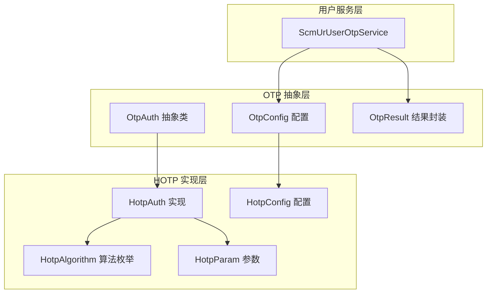
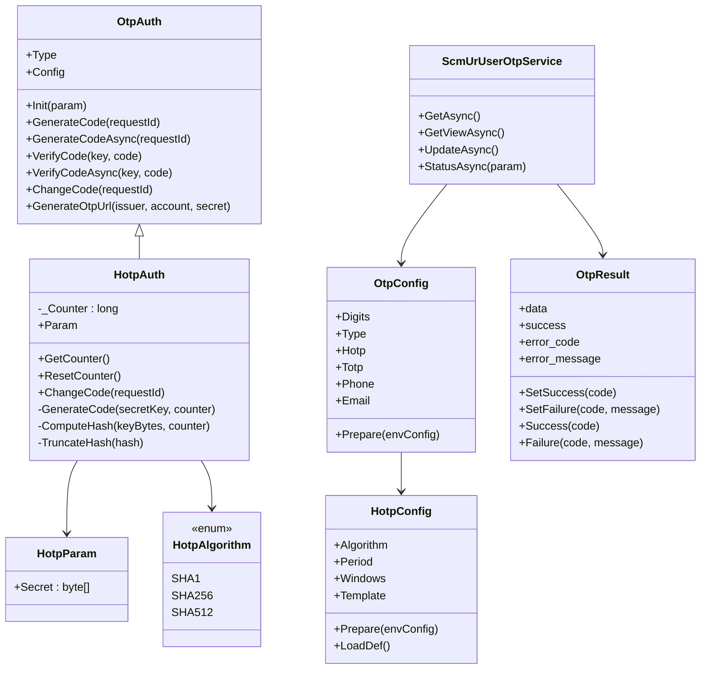
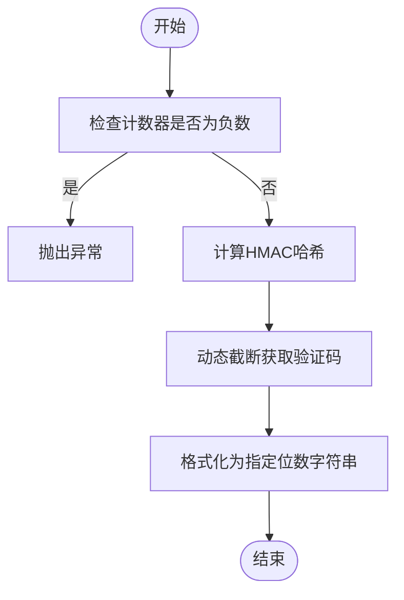
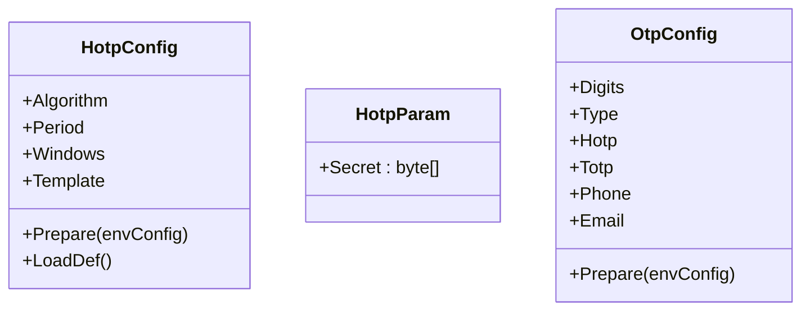
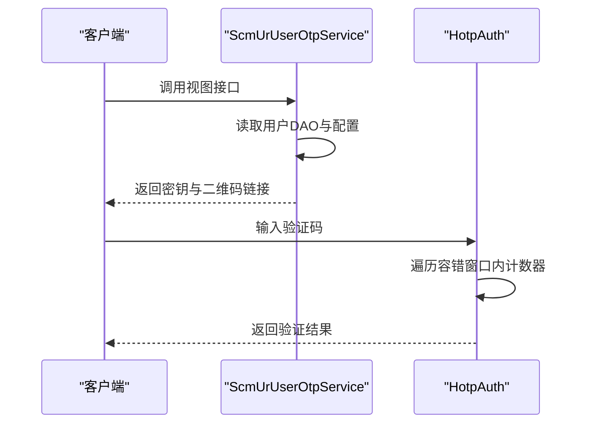
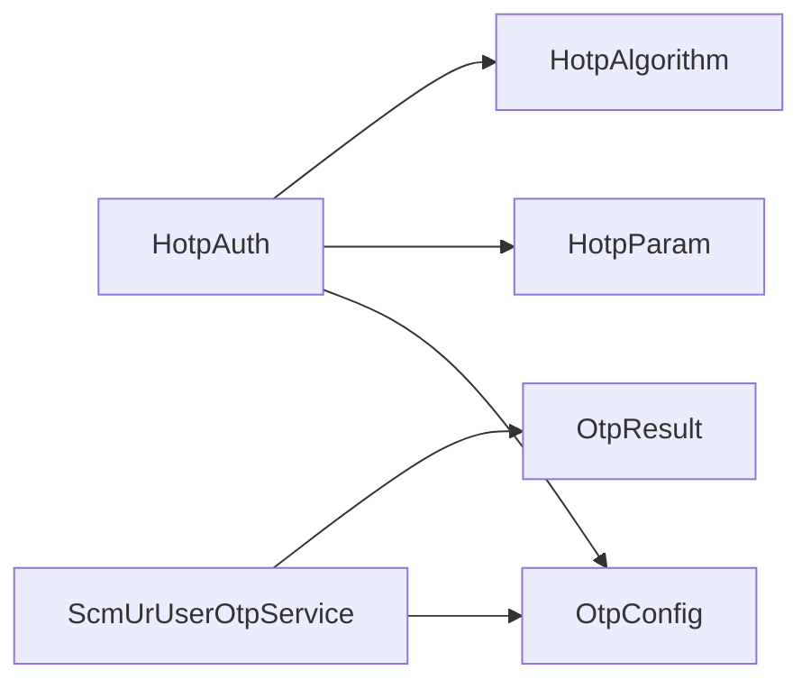

# HOTP 计数器验证码

<cite>
**本文引用的文件**
- [HotpAuth.cs](file://Scm.Core/Login/Otp/Hotp/HotpAuth.cs)
- [HotpAlgorithm.cs](file://Scm.Core/Login/Otp/Hotp/HotpAlgorithm.cs)
- [HotpConfig.cs](file://Scm.Core/Login/Otp/Hotp/HotpConfig.cs)
- [HotpParam.cs](file://Scm.Core/Login/Otp/Hotp/HotpParam.cs)
- [OtpAuth.cs](file://Scm.Core/Login/Otp/OtpAuth.cs)
- [OtpConfig.cs](file://Scm.Core/Login/Otp/OtpConfig.cs)
- [OtpResult.cs](file://Scm.Core/Login/Otp/OtpResult.cs)
- [ScmUrUserOtpService.cs](file://Scm.Core/Ur/UserOtp/ScmUrUserOtpService.cs)
- [ScmOtpEnum.cs](file://Scm.Common/Enums/ScmOtpEnum.cs)
</cite>

## 目录
1. [引言](#引言)
2. [项目结构](#项目结构)
3. [核心组件](#核心组件)
4. [架构总览](#架构总览)
5. [详细组件分析](#详细组件分析)
6. [依赖关系分析](#依赖关系分析)
7. [性能考量](#性能考量)
8. [故障排除指南](#故障排除指南)
9. [结论](#结论)
10. [附录](#附录)

## 引言
本技术文档围绕 Scm.Net 中的 HOTP（基于计数器的一次性密码）实现进行系统化说明，覆盖算法原理、计数器管理与同步策略、安全特性与防重放机制、完整 API 接口定义、密钥轮换与设备丢失处理方案，以及客户端集成与故障排除建议。读者可据此在 Scm.Net 生态中完成 HOTP 认证功能的设计与落地。

## 项目结构
HOTP 功能主要分布在以下模块：
- 算法与配置层：HotpAuth、HotpConfig、HotpAlgorithm、HotpParam
- 抽象与通用层：OtpAuth、OtpConfig、OtpResult
- 用户服务层：ScmUrUserOtpService（提供密钥生成、状态管理等接口）
- 枚举与常量：ScmOtpEnum（OTP 类型）

图表来源
- [OtpAuth.cs:1-90](file://Scm.Core/Login/Otp/OtpAuth.cs#L1-L90)
- [OtpConfig.cs:1-57](file://Scm.Core/Login/Otp/OtpConfig.cs#L1-L57)
- [OtpResult.cs:1-35](file://Scm.Core/Login/Otp/OtpResult.cs#L1-L35)
- [HotpAuth.cs:1-340](file://Scm.Core/Login/Otp/Hotp/HotpAuth.cs#L1-L340)
- [HotpConfig.cs:1-80](file://Scm.Core/Login/Otp/Hotp/HotpConfig.cs#L1-L80)
- [HotpAlgorithm.cs:1-24](file://Scm.Core/Login/Otp/Hotp/HotpAlgorithm.cs#L1-L24)
- [HotpParam.cs:1-11](file://Scm.Core/Login/Otp/Hotp/HotpParam.cs#L1-L11)
- [ScmUrUserOtpService.cs:1-186](file://Scm.Core/Ur/UserOtp/ScmUrUserOtpService.cs#L1-L186)

章节来源
- [OtpAuth.cs:1-90](file://Scm.Core/Login/Otp/OtpAuth.cs#L1-L90)
- [OtpConfig.cs:1-57](file://Scm.Core/Login/Otp/OtpConfig.cs#L1-L57)
- [HotpAuth.cs:1-340](file://Scm.Core/Login/Otp/Hotp/HotpAuth.cs#L1-L340)
- [HotpConfig.cs:1-80](file://Scm.Core/Login/Otp/Hotp/HotpConfig.cs#L1-L80)
- [HotpAlgorithm.cs:1-24](file://Scm.Core/Login/Otp/Hotp/HotpAlgorithm.cs#L1-L24)
- [HotpParam.cs:1-11](file://Scm.Core/Login/Otp/Hotp/HotpParam.cs#L1-L11)
- [ScmUrUserOtpService.cs:1-186](file://Scm.Core/Ur/UserOtp/ScmUrUserOtpService.cs#L1-L186)

## 核心组件
- 抽象基类 OtpAuth：定义统一的 OTP 生命周期与接口，包括初始化、生成、验证、异步接口占位、变更等。
- HotpAuth：HOTP 算法的具体实现，负责 HMAC 计算、动态截断、计数器管理与容错同步。
- HotpConfig：HOTP 配置项（算法、周期、容错窗口、模板等），并提供默认值与边界检查。
- HotpAlgorithm：支持的哈希算法枚举（SHA1/SHA256/SHA512）。
- HotpParam：HOTP 参数载体，包含共享密钥。
- OtpConfig：全局 OTP 配置入口，聚合 HOTP/TOTP/短信/邮件等子配置。
- OtpResult：统一的结果封装，包含成功/失败标记与数据。
- ScmUrUserOtpService：面向用户的 OTP 服务接口，提供密钥生成、状态更新、视图展示等。

章节来源
- [OtpAuth.cs:1-90](file://Scm.Core/Login/Otp/OtpAuth.cs#L1-L90)
- [HotpAuth.cs:1-340](file://Scm.Core/Login/Otp/Hotp/HotpAuth.cs#L1-L340)
- [HotpConfig.cs:1-80](file://Scm.Core/Login/Otp/Hotp/HotpConfig.cs#L1-L80)
- [HotpAlgorithm.cs:1-24](file://Scm.Core/Login/Otp/Hotp/HotpAlgorithm.cs#L1-L24)
- [HotpParam.cs:1-11](file://Scm.Core/Login/Otp/Hotp/HotpParam.cs#L1-L11)
- [OtpConfig.cs:1-57](file://Scm.Core/Login/Otp/OtpConfig.cs#L1-L57)
- [OtpResult.cs:1-35](file://Scm.Core/Login/Otp/OtpResult.cs#L1-L35)
- [ScmUrUserOtpService.cs:1-186](file://Scm.Core/Ur/UserOtp/ScmUrUserOtpService.cs#L1-L186)

## 架构总览
HOTP 在 Scm.Net 中采用“抽象接口 + 具体实现 + 配置 + 服务接口”的分层设计：
- 算法层：HotpAuth 基于 HMAC 与动态截断生成一次性密码，支持多算法。
- 配置层：HotpConfig 提供算法、周期、容错窗口等参数，OtpConfig 统一入口。
- 服务层：ScmUrUserOtpService 提供密钥生成、状态切换、二维码链接生成等能力。
- 结果封装：OtpResult 统一返回结构，便于上层处理。

图表来源
- [OtpAuth.cs:1-90](file://Scm.Core/Login/Otp/OtpAuth.cs#L1-L90)
- [HotpAuth.cs:1-340](file://Scm.Core/Login/Otp/Hotp/HotpAuth.cs#L1-L340)
- [OtpConfig.cs:1-57](file://Scm.Core/Login/Otp/OtpConfig.cs#L1-L57)
- [HotpConfig.cs:1-80](file://Scm.Core/Login/Otp/Hotp/HotpConfig.cs#L1-L80)
- [HotpAlgorithm.cs:1-24](file://Scm.Core/Login/Otp/Hotp/HotpAlgorithm.cs#L1-L24)
- [HotpParam.cs:1-11](file://Scm.Core/Login/Otp/Hotp/HotpParam.cs#L1-L11)
- [OtpResult.cs:1-35](file://Scm.Core/Login/Otp/OtpResult.cs#L1-L35)
- [ScmUrUserOtpService.cs:1-186](file://Scm.Core/Ur/UserOtp/ScmUrUserOtpService.cs#L1-L186)

## 详细组件分析

### HOTP 算法实现与计数器管理
- 算法原理：基于 HMAC 的动态验证码生成，遵循 RFC 4226。计数器以 8 字节大端序参与 HMAC 计算，随后对哈希执行动态截断，取固定位数作为验证码。
- 计数器字段：内部维护一个递增的 long 型计数器，每次成功验证或周期推进时更新。
- 容错同步：验证时向前探测若干个计数器（容错窗口），以容忍客户端/服务端微小不同步。
- 周期推进：ChangeCode 按 Period 步长推进计数器，实现密钥轮换与新口令生成。

图表来源
- [HotpAuth.cs:101-110](file://Scm.Core/Login/Otp/Hotp/HotpAuth.cs#L101-L110)
- [HotpAuth.cs:258-268](file://Scm.Core/Login/Otp/Hotp/HotpAuth.cs#L258-L268)
- [HotpAuth.cs:296-310](file://Scm.Core/Login/Otp/Hotp/HotpAuth.cs#L296-L310)
- [HotpAuth.cs:317-331](file://Scm.Core/Login/Otp/Hotp/HotpAuth.cs#L317-L331)

章节来源
- [HotpAuth.cs:1-340](file://Scm.Core/Login/Otp/Hotp/HotpAuth.cs#L1-L340)

### 配置与参数
- HotpConfig：包含算法、周期（Period）、容错窗口（Windows）、模板（Template）等；提供默认值与边界校验。
- HotpParam：包含 Base32 编码的共享密钥。
- OtpConfig：全局入口，聚合各子配置并统一准备。

图表来源
- [HotpConfig.cs:1-80](file://Scm.Core/Login/Otp/Hotp/HotpConfig.cs#L1-L80)
- [HotpParam.cs:1-11](file://Scm.Core/Login/Otp/Hotp/HotpParam.cs#L1-L11)
- [OtpConfig.cs:1-57](file://Scm.Core/Login/Otp/OtpConfig.cs#L1-L57)

章节来源
- [HotpConfig.cs:1-80](file://Scm.Core/Login/Otp/Hotp/HotpConfig.cs#L1-L80)
- [HotpParam.cs:1-11](file://Scm.Core/Login/Otp/Hotp/HotpParam.cs#L1-L11)
- [OtpConfig.cs:1-57](file://Scm.Core/Login/Otp/OtpConfig.cs#L1-L57)

### 安全特性与防重放机制
- 单次使用：HOTP 基于计数器，每个验证码仅能使用一次，计数器推进后旧验证码失效。
- 容错窗口：允许在一定范围内容忍不同步，避免因网络抖动导致的误判。
- 密钥保护：密钥以 Base32 存储与传输，算法可选 SHA1/SHA256/SHA512。
- 密钥轮换：通过周期推进计数器实现定期更换，降低泄露风险。

章节来源
- [HotpAuth.cs:167-179](file://Scm.Core/Login/Otp/Hotp/HotpAuth.cs#L167-L179)
- [HotpAuth.cs:208-212](file://Scm.Core/Login/Otp/Hotp/HotpAuth.cs#L208-L212)
- [HotpConfig.cs:63-77](file://Scm.Core/Login/Otp/Hotp/HotpConfig.cs#L63-L77)

### API 接口定义（基于现有服务）
以下接口由 ScmUrUserOtpService 提供，可用于 HOTP 密钥与状态管理：
- GET /Ur/UserOtp
  - 功能：获取当前用户 OTP 状态与时间戳
  - 返回：状态、时间戳
- GET /Ur/UserOtp/view
  - 功能：获取用户 OTP 视图信息（含 issuer、算法、位数、密钥、二维码链接等）
  - 返回：视图数据对象
- PUT /Ur/UserOtp/update
  - 功能：重新生成密钥并更新时间戳
  - 返回：状态、时间戳
- PUT /Ur/UserOtp/status
  - 功能：切换 OTP 状态（启用时若无密钥则生成）
  - 返回：状态、时间戳

章节来源
- [ScmUrUserOtpService.cs:42-186](file://Scm.Core/Ur/UserOtp/ScmUrUserOtpService.cs#L42-L186)

### 计数器同步机制
- 同步策略：验证时向前探测容错窗口内的多个计数器，匹配成功即认为有效。
- 计数器推进：ChangeCode 按 Period 步长推进，确保下一次生成新的验证码。
- 复位机制：ResetCounter 可将计数器复位为初始值（谨慎使用）。

图表来源
- [ScmUrUserOtpService.cs:56-117](file://Scm.Core/Ur/UserOtp/ScmUrUserOtpService.cs#L56-L117)
- [HotpAuth.cs:147-183](file://Scm.Core/Login/Otp/Hotp/HotpAuth.cs#L147-L183)

章节来源
- [HotpAuth.cs:167-179](file://Scm.Core/Login/Otp/Hotp/HotpAuth.cs#L167-L179)
- [HotpAuth.cs:208-212](file://Scm.Core/Login/Otp/Hotp/HotpAuth.cs#L208-L212)

### 密钥轮换策略与设备丢失处理
- 密钥轮换：通过 ChangeCode 按 Period 推进计数器，周期性生成新验证码，降低长期暴露风险。
- 设备丢失：调用更新接口重新生成密钥，同时更新时间戳；客户端需重新扫描二维码导入新密钥。
- 状态管理：启用时若无密钥则自动生成并记录时间戳，便于审计与追踪。

章节来源
- [ScmUrUserOtpService.cs:70-85](file://Scm.Core/Ur/UserOtp/ScmUrUserOtpService.cs#L70-L85)
- [ScmUrUserOtpService.cs:158-184](file://Scm.Core/Ur/UserOtp/ScmUrUserOtpService.cs#L158-L184)
- [HotpAuth.cs:208-212](file://Scm.Core/Login/Otp/Hotp/HotpAuth.cs#L208-L212)

### 客户端集成示例（流程指引）
- 初始化：读取服务端返回的 issuer、算法、位数、密钥与二维码链接。
- 扫描导入：使用 TOTP/HOTP 客户端扫描二维码，导入密钥与参数。
- 验证流程：客户端生成验证码，提交至服务端；服务端按容错窗口验证并返回结果。
- 同步与轮换：若出现不同步，客户端可提示用户手动同步；定期轮换密钥以增强安全性。

（本节为概念性说明，不直接对应具体源码文件）

## 依赖关系分析
- HotpAuth 依赖 OtpConfig、HotpParam、HotpAlgorithm 进行算法选择与参数解析。
- ScmUrUserOtpService 依赖 OtpConfig 与 DAO 层进行密钥生成、状态更新与视图渲染。
- OtpResult 作为统一返回封装，贯穿算法与服务层。

图表来源
- [HotpAuth.cs:1-340](file://Scm.Core/Login/Otp/Hotp/HotpAuth.cs#L1-L340)
- [OtpConfig.cs:1-57](file://Scm.Core/Login/Otp/OtpConfig.cs#L1-L57)
- [ScmUrUserOtpService.cs:1-186](file://Scm.Core/Ur/UserOtp/ScmUrUserOtpService.cs#L1-L186)
- [OtpResult.cs:1-35](file://Scm.Core/Login/Otp/OtpResult.cs#L1-L35)

章节来源
- [HotpAuth.cs:1-340](file://Scm.Core/Login/Otp/Hotp/HotpAuth.cs#L1-L340)
- [OtpConfig.cs:1-57](file://Scm.Core/Login/Otp/OtpConfig.cs#L1-L57)
- [ScmUrUserOtpService.cs:1-186](file://Scm.Core/Ur/UserOtp/ScmUrUserOtpService.cs#L1-L186)
- [OtpResult.cs:1-35](file://Scm.Core/Login/Otp/OtpResult.cs#L1-L35)

## 性能考量
- HMAC 计算：算法选择 SHA256/SHA512 会增加 CPU 开销，SHA1 最快但安全性略低；根据环境权衡。
- 容错窗口：窗口越大，验证耗时越长；建议保持较小窗口以提升性能。
- 计数器推进：周期推进应避免过于频繁，以免影响用户体验与服务器压力。

（本节为通用指导，不直接对应具体源码文件）

## 故障排除指南
- 验证失败
  - 检查验证码位数是否与配置一致。
  - 确认容错窗口设置是否足够大。
  - 核对密钥编码与算法一致性。
- 不同步
  - 建议客户端提示用户手动同步计数器。
  - 适当增大容错窗口。
- 密钥泄露或设备丢失
  - 调用更新接口重新生成密钥并导入新二维码。
  - 启用状态时若无密钥会自动补生成。
- 性能问题
  - 评估算法与容错窗口设置。
  - 关注计数器推进频率与批量操作场景。

章节来源
- [HotpAuth.cs:156-161](file://Scm.Core/Login/Otp/Hotp/HotpAuth.cs#L156-L161)
- [HotpAuth.cs:167-179](file://Scm.Core/Login/Otp/Hotp/HotpAuth.cs#L167-L179)
- [ScmUrUserOtpService.cs:70-85](file://Scm.Core/Ur/UserOtp/ScmUrUserOtpService.cs#L70-L85)
- [ScmUrUserOtpService.cs:158-184](file://Scm.Core/Ur/UserOtp/ScmUrUserOtpService.cs#L158-L184)

## 结论
Scm.Net 的 HOTP 实现遵循 RFC 4226，具备清晰的分层设计与可扩展的配置体系。通过计数器驱动与容错同步，既保证了安全性又兼顾了可用性。结合服务层提供的密钥生成与状态管理接口，可在实际业务中快速落地 HOTP 认证方案。

## 附录

### API 定义（基于现有服务）
- GET /Ur/UserOtp
  - 功能：获取当前用户 OTP 状态与时间戳
  - 返回：状态、时间戳
- GET /Ur/UserOtp/view
  - 功能：获取用户 OTP 视图信息（含 issuer、算法、位数、密钥、二维码链接等）
  - 返回：视图数据对象
- PUT /Ur/UserOtp/update
  - 功能：重新生成密钥并更新时间戳
  - 返回：状态、时间戳
- PUT /Ur/UserOtp/status
  - 功能：切换 OTP 状态（启用时若无密钥则生成）
  - 返回：状态、时间戳

章节来源
- [ScmUrUserOtpService.cs:42-186](file://Scm.Core/Ur/UserOtp/ScmUrUserOtpService.cs#L42-L186)