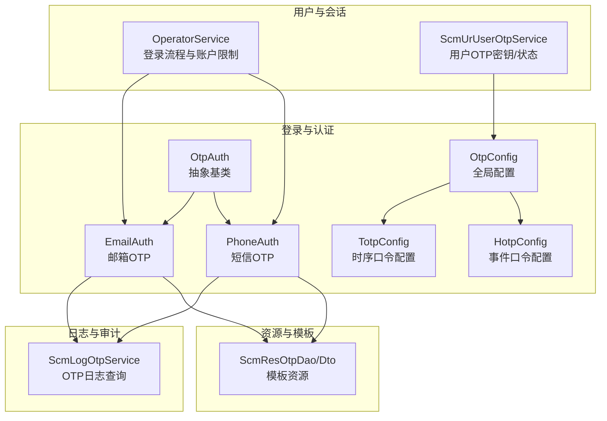
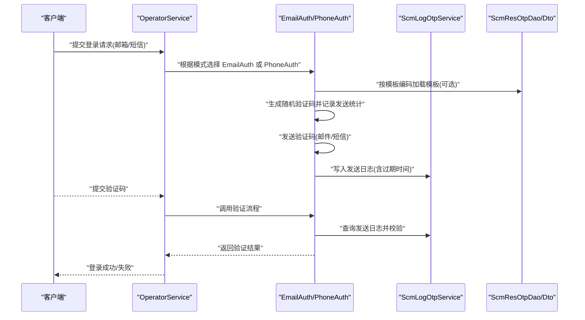
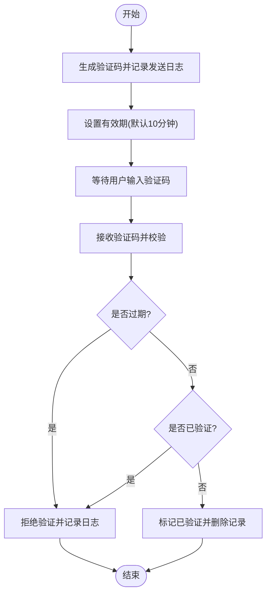
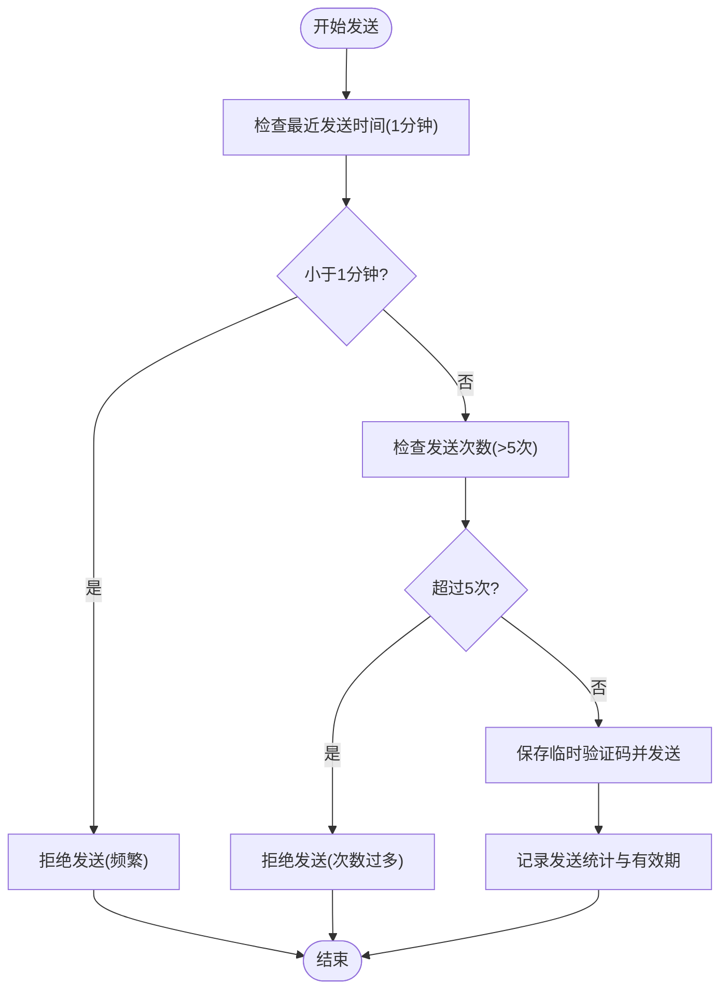
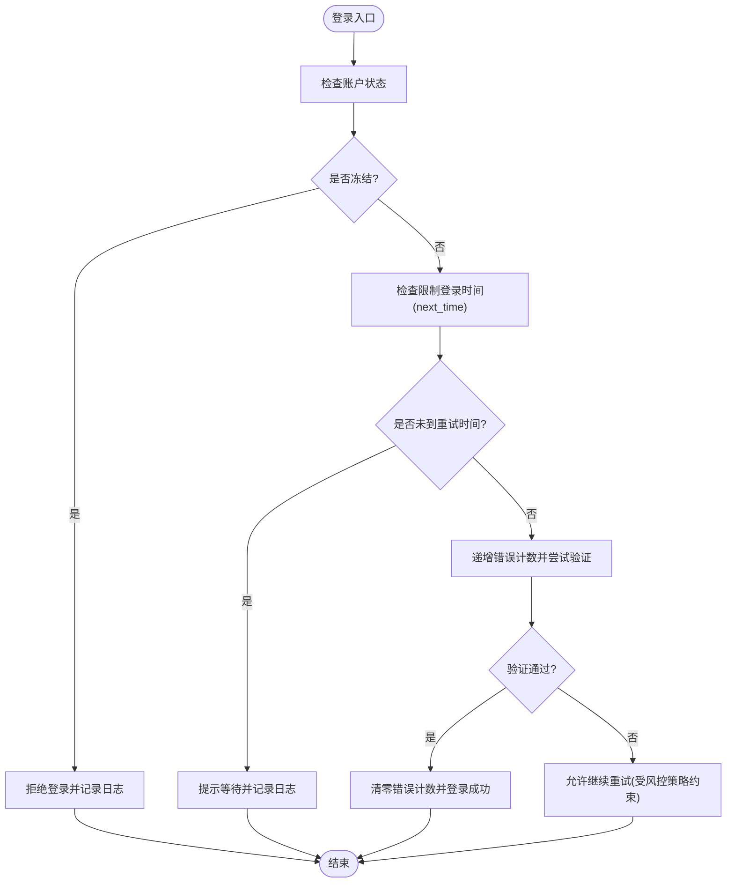
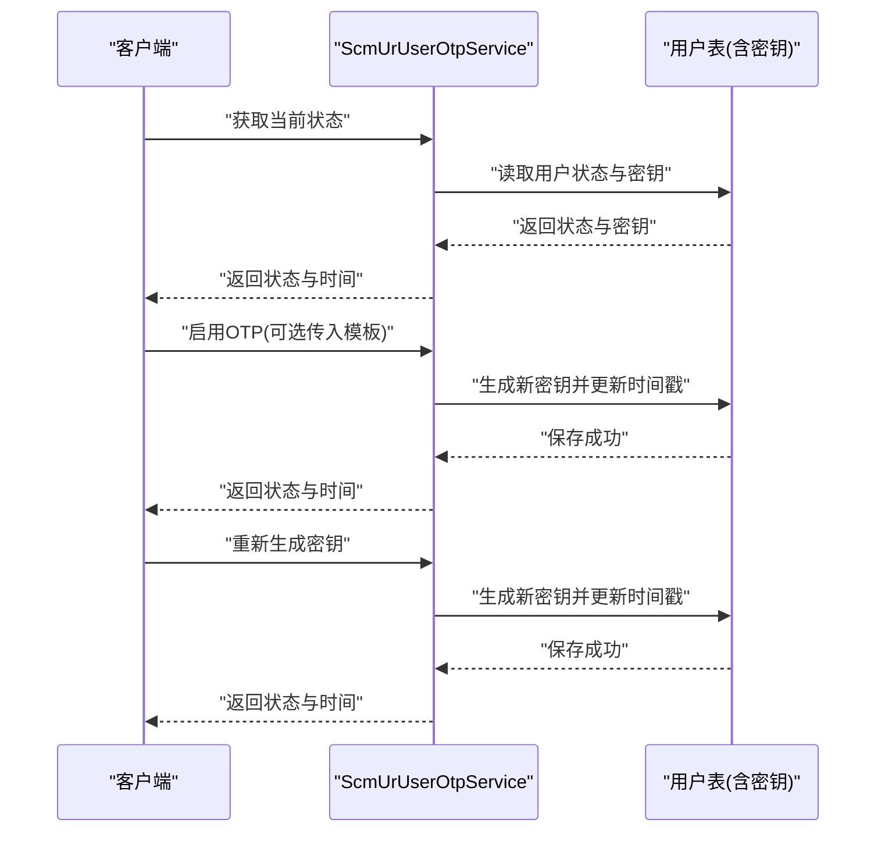
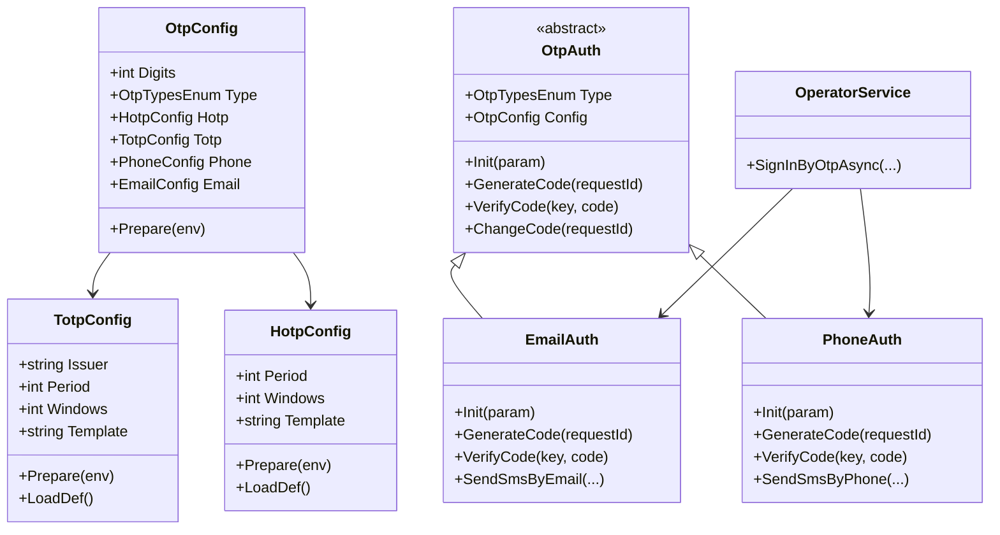

# OTP 安全策略和最佳实践

<cite>
**本文引用的文件**
- [Scm.Core/Login/Otp/OtpConfig.cs](file://Scm.Core/Login/Otp/OtpConfig.cs)
- [Scm.Core/Login/Otp/Totp/TotpConfig.cs](file://Scm.Core/Login/Otp/Totp/TotpConfig.cs)
- [Scm.Core/Login/Otp/Hotp/HotpConfig.cs](file://Scm.Core/Login/Otp/Hotp/HotpConfig.cs)
- [Scm.Core/Login/Otp/OtpAuth.cs](file://Scm.Core/Login/Otp/OtpAuth.cs)
- [Scm.Core/Login/Otp/Email/EmailAuth.cs](file://Scm.Core/Login/Otp/Email/EmailAuth.cs)
- [Scm.Core/Login/Otp/Phone/PhoneAuth.cs](file://Scm.Core/Login/Otp/Phone/PhoneAuth.cs)
- [Scm.Core/Operator/OperatorService.cs](file://Scm.Core/Operator/OperatorService.cs)
- [Scm.Core/Ur/UserOtp/ScmUrUserOtpService.cs](file://Scm.Core/Ur/UserOtp/ScmUrUserOtpService.cs)
- [Scm.Core/Log/Otp/ScmLogOtpService.cs](file://Scm.Core/Log/Otp/ScmLogOtpService.cs)
- [Scm.Dao/Res/Otp/ScmResOtpDao.cs](file://Scm.Dao/Res/Otp/ScmResOtpDao.cs)
- [Scm.Dto/Res/Otp/ScmResOtpDto.cs](file://Scm.Dto/Res/Otp/ScmResOtpDto.cs)
- [Scm.Common/Enums/ScmOtpEnum.cs](file://Scm.Common/Enums/ScmOtpEnum.cs)
</cite>

## 目录
1. [引言](#引言)
2. [项目结构](#项目结构)
3. [核心组件](#核心组件)
4. [架构总览](#架构总览)
5. [详细组件分析](#详细组件分析)
6. [依赖关系分析](#依赖关系分析)
7. [性能考量](#性能考量)
8. [故障排查指南](#故障排查指南)
9. [结论](#结论)
10. [附录](#附录)

## 引言
本文件面向 Scm.Net 的 OTP 验证码认证体系，系统化梳理其安全策略与最佳实践，覆盖验证码有效期管理、发送频率与次数限制、账户锁定与登录限制、配置参数安全建议、安全审计与监控、常见威胁防护与应对策略，并提供安全配置检查清单与合规性指南，同时强调用户隐私保护、数据加密与访问控制等关键要点。

## 项目结构
围绕 OTP 的核心代码主要分布在以下模块：
- 登录与认证层：OtpConfig、TotpConfig、HotpConfig、OtpAuth 及具体实现 EmailAuth、PhoneAuth
- 用户与会话层：OperatorService 中的登录流程与账户状态控制；UserOtp 服务用于用户 OTP 密钥与状态管理
- 日志与审计：ScmLogOtpService 提供 OTP 日志查询与管理
- 资源与模板：ScmResOtpDao/Dto 用于短信/邮件模板资源管理
- 枚举与常量：ScmOtpEnum 定义 OTP 类型枚举

**图表来源**
- [Scm.Core/Login/Otp/OtpConfig.cs:10-57](file://Scm.Core/Login/Otp/OtpConfig.cs#L10-L57)
- [Scm.Core/Login/Otp/Totp/TotpConfig.cs:6-78](file://Scm.Core/Login/Otp/Totp/TotpConfig.cs#L6-L78)
- [Scm.Core/Login/Otp/Hotp/HotpConfig.cs:6-80](file://Scm.Core/Login/Otp/Hotp/HotpConfig.cs#L6-L80)
- [Scm.Core/Login/Otp/OtpAuth.cs:9-91](file://Scm.Core/Login/Otp/OtpAuth.cs#L9-L91)
- [Scm.Core/Login/Otp/Email/EmailAuth.cs:13-499](file://Scm.Core/Login/Otp/Email/EmailAuth.cs#L13-L499)
- [Scm.Core/Login/Otp/Phone/PhoneAuth.cs:12-405](file://Scm.Core/Login/Otp/Phone/PhoneAuth.cs#L12-L405)
- [Scm.Core/Operator/OperatorService.cs:297-536](file://Scm.Core/Operator/OperatorService.cs#L297-L536)
- [Scm.Core/Ur/UserOtp/ScmUrUserOtpService.cs:42-186](file://Scm.Core/Ur/UserOtp/ScmUrUserOtpService.cs#L42-L186)
- [Scm.Core/Log/Otp/ScmLogOtpService.cs:15-187](file://Scm.Core/Log/Otp/ScmLogOtpService.cs#L15-L187)
- [Scm.Dao/Res/Otp/ScmResOtpDao.cs:11-55](file://Scm.Dao/Res/Otp/ScmResOtpDao.cs#L11-L55)
- [Scm.Dto/Res/Otp/ScmResOtpDto.cs:10-55](file://Scm.Dto/Res/Otp/ScmResOtpDto.cs#L10-L55)

**章节来源**
- [Scm.Core/Login/Otp/OtpConfig.cs:10-57](file://Scm.Core/Login/Otp/OtpConfig.cs#L10-L57)
- [Scm.Core/Login/Otp/OtpAuth.cs:9-91](file://Scm.Core/Login/Otp/OtpAuth.cs#L9-L91)

## 核心组件
- 全局配置 OtpConfig：统一管理 OTP 数字位数、类型以及子配置（TOTP/HOTP/Phone/Email）的加载与默认值校准
- TOTP/HOTP 子配置：定义发行者、算法、周期、容错窗口与二维码模板
- 抽象基类 OtpAuth：定义初始化、生成验证码、验证验证码、更新口令等契约
- EmailAuth/PhoneAuth：分别实现基于邮箱与短信的验证码生成与验证流程，内置发送频率与次数限制、过期校验与单次验证控制
- 登录流程与账户限制：OperatorService 在登录前进行账户状态与登录限制检测
- 用户 OTP 管理：ScmUrUserOtpService 支持用户 OTP 密钥生成、状态启用/禁用与二维码展示
- 日志与审计：ScmLogOtpService 提供 OTP 日志的查询与管理能力
- 模板资源：ScmResOtpDao/Dto 管理不同类型的 OTP 模板资源

**章节来源**
- [Scm.Core/Login/Otp/OtpConfig.cs:10-57](file://Scm.Core/Login/Otp/OtpConfig.cs#L10-L57)
- [Scm.Core/Login/Otp/Totp/TotpConfig.cs:6-78](file://Scm.Core/Login/Otp/Totp/TotpConfig.cs#L6-L78)
- [Scm.Core/Login/Otp/Hotp/HotpConfig.cs:6-80](file://Scm.Core/Login/Otp/Hotp/HotpConfig.cs#L6-L80)
- [Scm.Core/Login/Otp/OtpAuth.cs:9-91](file://Scm.Core/Login/Otp/OtpAuth.cs#L9-L91)
- [Scm.Core/Login/Otp/Email/EmailAuth.cs:13-499](file://Scm.Core/Login/Otp/Email/EmailAuth.cs#L13-L499)
- [Scm.Core/Login/Otp/Phone/PhoneAuth.cs:12-405](file://Scm.Core/Login/Otp/Phone/PhoneAuth.cs#L12-L405)
- [Scm.Core/Operator/OperatorService.cs:297-536](file://Scm.Core/Operator/OperatorService.cs#L297-L536)
- [Scm.Core/Ur/UserOtp/ScmUrUserOtpService.cs:42-186](file://Scm.Core/Ur/UserOtp/ScmUrUserOtpService.cs#L42-L186)
- [Scm.Core/Log/Otp/ScmLogOtpService.cs:15-187](file://Scm.Core/Log/Otp/ScmLogOtpService.cs#L15-L187)
- [Scm.Dao/Res/Otp/ScmResOtpDao.cs:11-55](file://Scm.Dao/Res/Otp/ScmResOtpDao.cs#L11-L55)
- [Scm.Dto/Res/Otp/ScmResOtpDto.cs:10-55](file://Scm.Dto/Res/Otp/ScmResOtpDto.cs#L10-L55)

## 架构总览
OTP 认证的整体流程包括：用户触发登录或绑定 OTP -> 选择邮箱/短信 -> 生成一次性验证码 -> 发送至目标渠道 -> 用户输入验证码 -> 服务端验证并完成登录/绑定。

**图表来源**
- [Scm.Core/Operator/OperatorService.cs:310-536](file://Scm.Core/Operator/OperatorService.cs#L310-L536)
- [Scm.Core/Login/Otp/Email/EmailAuth.cs:54-225](file://Scm.Core/Login/Otp/Email/EmailAuth.cs#L54-L225)
- [Scm.Core/Login/Otp/Phone/PhoneAuth.cs:53-135](file://Scm.Core/Login/Otp/Phone/PhoneAuth.cs#L53-L135)
- [Scm.Core/Log/Otp/ScmLogOtpService.cs:36-78](file://Scm.Core/Log/Otp/ScmLogOtpService.cs#L36-L78)
- [Scm.Dao/Res/Otp/ScmResOtpDao.cs:11-55](file://Scm.Dao/Res/Otp/ScmResOtpDao.cs#L11-L55)
- [Scm.Dto/Res/Otp/ScmResOtpDto.cs:10-55](file://Scm.Dto/Res/Otp/ScmResOtpDto.cs#L10-L55)

## 详细组件分析

### OTP 配置与参数安全建议
- 数字位数 Digits：限定范围为 4~8，默认 6；建议生产环境使用 6~8 以提升安全性
- 类型 Type：支持 Totp/Hotp/Phone/Email；建议结合业务场景选择合适类型
- TotpConfig：Period 默认 30 秒，Windows 容错窗口建议 1；Issuer 与 Template 必须符合规范
- HotpConfig：Period 与 Windows 建议合理设置，避免过大容错导致安全风险
- Email/Phone 子配置：需在 Prepare 阶段完成加载与校准

安全建议
- 固定 Digits 至 6~8，避免过短降低破解难度
- Totp 的 Period 不宜超过 300 秒，Windows 控制在 0~10 之间
- Issuer 与 Template 必须与客户端兼容，避免解析错误引发降级风险
- 模板资源必须通过 ScmResOtpDao/Dto 管理，确保内容可控与可审计

**章节来源**
- [Scm.Core/Login/Otp/OtpConfig.cs:10-57](file://Scm.Core/Login/Otp/OtpConfig.cs#L10-L57)
- [Scm.Core/Login/Otp/Totp/TotpConfig.cs:6-78](file://Scm.Core/Login/Otp/Totp/TotpConfig.cs#L6-L78)
- [Scm.Core/Login/Otp/Hotp/HotpConfig.cs:6-80](file://Scm.Core/Login/Otp/Hotp/HotpConfig.cs#L6-L80)

### 验证码有效期管理
- 发送后验证码有效期由服务端设置为 10 分钟（单位秒），到期自动失效
- 验证时会检查日志记录是否已过期，过期则拒绝验证
- 单次验证码仅允许验证一次，验证后将逻辑删除，防止复用

**图表来源**
- [Scm.Core/Login/Otp/Email/EmailAuth.cs:119-133](file://Scm.Core/Login/Otp/Email/EmailAuth.cs#L119-L133)
- [Scm.Core/Login/Otp/Phone/PhoneAuth.cs:118-132](file://Scm.Core/Login/Otp/Phone/PhoneAuth.cs#L118-L132)

**章节来源**
- [Scm.Core/Login/Otp/Email/EmailAuth.cs:119-133](file://Scm.Core/Login/Otp/Email/EmailAuth.cs#L119-L133)
- [Scm.Core/Login/Otp/Phone/PhoneAuth.cs:118-132](file://Scm.Core/Login/Otp/Phone/PhoneAuth.cs#L118-L132)

### 发送频率与次数限制
- 频繁发送限制：同一手机号/邮箱在 1 分钟内仅允许一次发送
- 多次发送限制：同一批次（按 requestId）最多发送 5 次
- 发送成功后记录 send_qty、send_time、expired 等字段，便于审计与风控

**图表来源**
- [Scm.Core/Login/Otp/Email/EmailAuth.cs:93-105](file://Scm.Core/Login/Otp/Email/EmailAuth.cs#L93-L105)
- [Scm.Core/Login/Otp/Phone/PhoneAuth.cs:92-104](file://Scm.Core/Login/Otp/Phone/PhoneAuth.cs#L92-L104)

**章节来源**
- [Scm.Core/Login/Otp/Email/EmailAuth.cs:93-105](file://Scm.Core/Login/Otp/Email/EmailAuth.cs#L93-L105)
- [Scm.Core/Login/Otp/Phone/PhoneAuth.cs:92-104](file://Scm.Core/Login/Otp/Phone/PhoneAuth.cs#L92-L104)

### 账户锁定与登录限制
- 登录前检查用户状态：若账户被冻结或处于限制登录时间范围内，则拒绝登录
- 登录成功后清零错误计数；失败则递增错误计数，配合后续策略实现账户保护

**图表来源**
- [Scm.Core/Operator/OperatorService.cs:512-536](file://Scm.Core/Operator/OperatorService.cs#L512-L536)

**章节来源**
- [Scm.Core/Operator/OperatorService.cs:512-536](file://Scm.Core/Operator/OperatorService.cs#L512-L536)

### 用户 OTP 密钥与状态管理
- 用户可启用/禁用 OTP 功能；启用时如无密钥则自动生成并记录时间戳
- 支持重新生成密钥，更新 otp_time
- 可输出包含 issuer、digits、algorithm、secret、uri 等信息的视图对象，便于客户端扫码绑定

**图表来源**
- [Scm.Core/Ur/UserOtp/ScmUrUserOtpService.cs:42-186](file://Scm.Core/Ur/UserOtp/ScmUrUserOtpService.cs#L42-L186)

**章节来源**
- [Scm.Core/Ur/UserOtp/ScmUrUserOtpService.cs:42-186](file://Scm.Core/Ur/UserOtp/ScmUrUserOtpService.cs#L42-L186)

### 模板资源与内容安全
- 模板资源通过 ScmResOtpDao/Dto 管理，支持按类型与编码检索
- 发送时可按模板编码加载标题、正文、声明与附件文件，正文可替换占位符
- 建议对模板内容进行白名单校验与敏感词过滤，避免注入与不当内容传播

**章节来源**
- [Scm.Dao/Res/Otp/ScmResOtpDao.cs:11-55](file://Scm.Dao/Res/Otp/ScmResOtpDao.cs#L11-L55)
- [Scm.Dto/Res/Otp/ScmResOtpDto.cs:10-55](file://Scm.Dto/Res/Otp/ScmResOtpDto.cs#L10-L55)
- [Scm.Core/Login/Otp/Email/EmailAuth.cs:397-496](file://Scm.Core/Login/Otp/Email/EmailAuth.cs#L397-L496)
- [Scm.Core/Login/Otp/Phone/PhoneAuth.cs:394-402](file://Scm.Core/Login/Otp/Phone/PhoneAuth.cs#L394-L402)

## 依赖关系分析
- OtpConfig 作为全局入口，依赖 TotpConfig、HotpConfig、EmailConfig、PhoneConfig 并在 Prepare 阶段完成默认值校准
- OtpAuth 抽象类定义通用接口，EmailAuth/PhoneAuth 实现具体逻辑并依赖日志与模板资源
- OperatorService 在登录流程中组合 OtpAuth 与账户状态检查
- ScmLogOtpService 提供日志查询与管理，支撑审计与风控

**图表来源**
- [Scm.Core/Login/Otp/OtpConfig.cs:10-57](file://Scm.Core/Login/Otp/OtpConfig.cs#L10-L57)
- [Scm.Core/Login/Otp/Totp/TotpConfig.cs:6-78](file://Scm.Core/Login/Otp/Totp/TotpConfig.cs#L6-L78)
- [Scm.Core/Login/Otp/Hotp/HotpConfig.cs:6-80](file://Scm.Core/Login/Otp/Hotp/HotpConfig.cs#L6-L80)
- [Scm.Core/Login/Otp/OtpAuth.cs:9-91](file://Scm.Core/Login/Otp/OtpAuth.cs#L9-L91)
- [Scm.Core/Login/Otp/Email/EmailAuth.cs:13-499](file://Scm.Core/Login/Otp/Email/EmailAuth.cs#L13-L499)
- [Scm.Core/Login/Otp/Phone/PhoneAuth.cs:12-405](file://Scm.Core/Login/Otp/Phone/PhoneAuth.cs#L12-L405)
- [Scm.Core/Operator/OperatorService.cs:310-536](file://Scm.Core/Operator/OperatorService.cs#L310-L536)

**章节来源**
- [Scm.Core/Login/Otp/OtpConfig.cs:10-57](file://Scm.Core/Login/Otp/OtpConfig.cs#L10-L57)
- [Scm.Core/Login/Otp/OtpAuth.cs:9-91](file://Scm.Core/Login/Otp/OtpAuth.cs#L9-L91)
- [Scm.Core/Operator/OperatorService.cs:310-536](file://Scm.Core/Operator/OperatorService.cs#L310-L536)

## 性能考量
- 验证码生成与发送采用异步接口（GenerateCodeAsync/VerifyCodeAsync），可提升高并发下的响应能力
- 发送频率与次数限制减少重复发送带来的系统压力
- 日志查询支持分页与排序，便于后台运维与审计

[本节为通用指导，无需列出具体文件来源]

## 故障排查指南
- 验证码未收到：检查发送频率与次数限制、模板编码是否正确、邮件/短信通道是否可用
- 验证失败：确认验证码是否过期、是否已被使用、是否允许多次验证
- 登录受限：检查账户状态与 next_time 限制，确认错误计数是否过高
- 日志审计：通过 ScmLogOtpService 查询发送与验证记录，定位异常

**章节来源**
- [Scm.Core/Log/Otp/ScmLogOtpService.cs:36-78](file://Scm.Core/Log/Otp/ScmLogOtpService.cs#L36-L78)
- [Scm.Core/Login/Otp/Email/EmailAuth.cs:232-301](file://Scm.Core/Login/Otp/Email/EmailAuth.cs#L232-L301)
- [Scm.Core/Login/Otp/Phone/PhoneAuth.cs:232-301](file://Scm.Core/Login/Otp/Phone/PhoneAuth.cs#L232-L301)
- [Scm.Core/Operator/OperatorService.cs:512-536](file://Scm.Core/Operator/OperatorService.cs#L512-L536)

## 结论
Scm.Net 的 OTP 认证体系在配置、发送、验证与审计方面具备完善的控制点：通过严格的验证码有效期、发送频率与次数限制、账户状态与登录限制，有效降低了暴力破解与滥用风险；通过模板资源管理与日志审计，实现了可追溯与可治理。建议在生产环境中遵循本文的安全配置与最佳实践，持续完善监控与告警，确保系统安全稳定运行。

[本节为总结性内容，无需列出具体文件来源]

## 附录

### 安全配置检查清单
- [ ] Digits 设置为 6~8，Period 合理（TOTP≤300，HOTP 合理区间）
- [ ] Windows 容错窗口控制在 0~10，避免过大
- [ ] Issuer 与 Template 规范且与客户端一致
- [ ] 发送频率限制（1 分钟内仅一次）、发送次数限制（每批次≤5次）
- [ ] 验证码有效期（默认 10 分钟），单次验证后立即失效
- [ ] 登录前检查账户状态与 next_time 限制
- [ ] 模板资源通过 ScmResOtpDao/Dto 管理，内容白名单与敏感词过滤
- [ ] 日志审计完整，支持分页查询与导出

**章节来源**
- [Scm.Core/Login/Otp/Totp/TotpConfig.cs:49-75](file://Scm.Core/Login/Otp/Totp/TotpConfig.cs#L49-L75)
- [Scm.Core/Login/Otp/Hotp/HotpConfig.cs:46-77](file://Scm.Core/Login/Otp/Hotp/HotpConfig.cs#L46-L77)
- [Scm.Core/Login/Otp/Email/EmailAuth.cs:93-105](file://Scm.Core/Login/Otp/Email/EmailAuth.cs#L93-L105)
- [Scm.Core/Login/Otp/Phone/PhoneAuth.cs:92-104](file://Scm.Core/Login/Otp/Phone/PhoneAuth.cs#L92-L104)
- [Scm.Core/Operator/OperatorService.cs:512-536](file://Scm.Core/Operator/OperatorService.cs#L512-L536)
- [Scm.Core/Log/Otp/ScmLogOtpService.cs:36-78](file://Scm.Core/Log/Otp/ScmLogOtpService.cs#L36-L78)

### 常见威胁与防护策略
- 验证码泄露与重放：严格有效期与单次验证控制，禁止复用
- 暴力破解：登录错误计数与 next_time 限制，结合账户冻结策略
- 频繁发送滥用：1 分钟一次与每批次 5 次限制，必要时引入 IP/设备维度限流
- 模板注入：模板内容白名单与敏感词过滤，最小权限原则
- 审计缺失：完善日志记录与查询接口，定期巡检与告警

**章节来源**
- [Scm.Core/Login/Otp/Email/EmailAuth.cs:119-133](file://Scm.Core/Login/Otp/Email/EmailAuth.cs#L119-L133)
- [Scm.Core/Login/Otp/Phone/PhoneAuth.cs:118-132](file://Scm.Core/Login/Otp/Phone/PhoneAuth.cs#L118-L132)
- [Scm.Core/Operator/OperatorService.cs:512-536](file://Scm.Core/Operator/OperatorService.cs#L512-L536)

### 合规性指南
- 数据最小化：仅收集与提供 OTP 功能必要的信息
- 加密传输：HTTPS 与通道加密，避免明文传输
- 访问控制：基于角色与会话的最小权限原则
- 隐私保护：明确数据处理目的与期限，支持用户删除与导出

[本节为通用合规指导，无需列出具体文件来源]