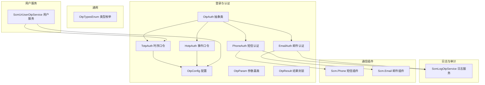
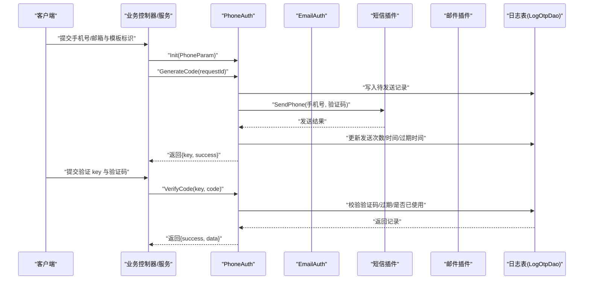
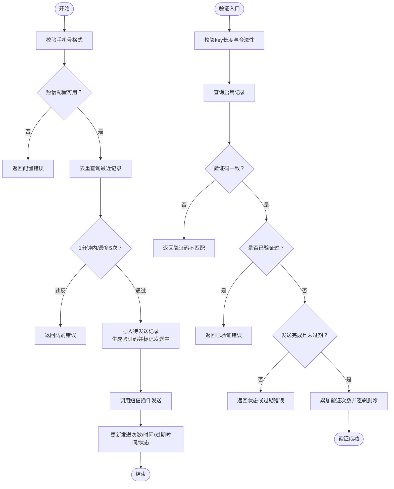
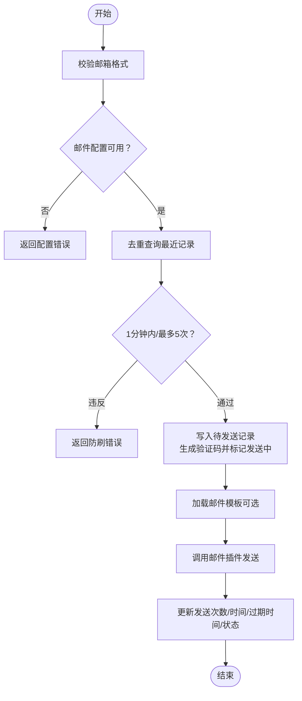
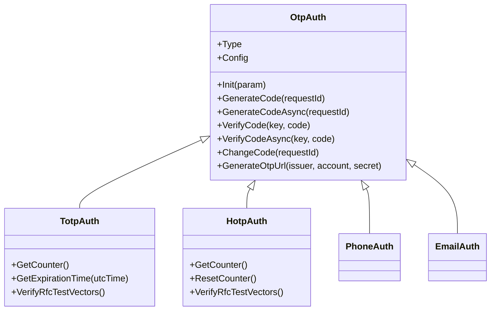
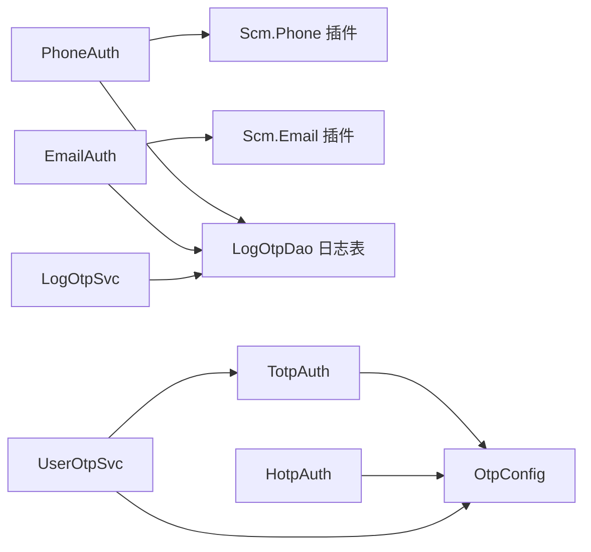

# OTP 验证码认证

<cite>
**本文引用的文件**
- [Scm.Core/登录/Otp/OtpAuth.cs](file://Scm.Core/Login/Otp/OtpAuth.cs)
- [Scm.Core/登录/Otp/OtpConfig.cs](file://Scm.Core/Login/Otp/OtpConfig.cs)
- [Scm.Core/登录/Otp/OtpParam.cs](file://Scm.Core/Login/Otp/OtpParam.cs)
- [Scm.Core/登录/Otp/OtpResult.cs](file://Scm.Core/Login/Otp/OtpResult.cs)
- [Scm.Core/登录/Otp/Phone/PhoneAuth.cs](file://Scm.Core/Login/Otp/Phone/PhoneAuth.cs)
- [Scm.Core/登录/Otp/Phone/PhoneParam.cs](file://Scm.Core/Login/Otp/Phone/PhoneParam.cs)
- [Scm.Core/登录/Otp/Email/EmailAuth.cs](file://Scm.Core/Login/Otp/Email/EmailAuth.cs)
- [Scm.Core/登录/Otp/Email/EmailParam.cs](file://Scm.Core/Login/Otp/Email/EmailParam.cs)
- [Scm.Core/登录/Otp/Totp/TotpAuth.cs](file://Scm.Core/Login/Otp/Totp/TotpAuth.cs)
- [Scm.Core/登录/Otp/Totp/TotpParam.cs](file://Scm.Core/Login/Otp/Totp/TotpParam.cs)
- [Scm.Core/登录/Otp/Hotp/HotpAuth.cs](file://Scm.Core/Login/Otp/Hotp/HotpAuth.cs)
- [Scm.Core/登录/Otp/Hotp/HotpParam.cs](file://Scm.Core/Login/Otp/Hotp/HotpParam.cs)
- [Scm.Common/枚举/ScmOtpEnum.cs](file://Scm.Common/Enums/ScmOtpEnum.cs)
- [Scm.Core/日志/Otp/ScmLogOtpService.cs](file://Scm.Core/Log/Otp/ScmLogOtpService.cs)
- [Scm.Core/用户/UserOtp/ScmUrUserOtpService.cs](file://Scm.Core/Ur/UserOtp/ScmUrUserOtpService.cs)
</cite>

## 目录
1. [简介](#简介)
2. [项目结构](#项目结构)
3. [核心组件](#核心组件)
4. [架构总览](#架构总览)
5. [详细组件分析](#详细组件分析)
6. [依赖关系分析](#依赖关系分析)
7. [性能考量](#性能考量)
8. [故障排查指南](#故障排查指南)
9. [结论](#结论)
10. [附录](#附录)

## 简介
本技术文档围绕 Scm.Net 中的 OTP 验证码认证能力展开，重点解析以下内容：
- SignInByOtpAsync 方法的调用链与控制流（结合短信与邮箱双通道）
- PhoneAuth 与 EmailAuth 的验证码生成、发送与验证机制
- TOTP 与 HOTP 算法的实现原理与应用场景
- 完整的 API 接口说明（请求参数、响应格式、错误处理）
- 验证码安全策略、防刷机制与用户体验优化
- 集成示例与常见问题解答

## 项目结构
OTP 认证相关代码主要分布在以下模块：
- 登录与认证：Scm.Core/Login/Otp
- 通用枚举：Scm.Common/Enums/ScmOtpEnum.cs
- 日志与审计：Scm.Core/Log/Otp
- 用户服务：Scm.Core/Ur/UserOtp
- 通信插件：Scm.Phone、Scm.Email

图表来源
- [Scm.Core/登录/Otp/OtpAuth.cs:1-91](file://Scm.Core/Login/Otp/OtpAuth.cs#L1-L91)
- [Scm.Core/登录/Otp/Phone/PhoneAuth.cs:1-405](file://Scm.Core/Login/Otp/Phone/PhoneAuth.cs#L1-L405)
- [Scm.Core/登录/Otp/Email/EmailAuth.cs:1-499](file://Scm.Core/Login/Otp/Email/EmailAuth.cs#L1-L499)
- [Scm.Core/登录/Otp/Totp/TotpAuth.cs:1-375](file://Scm.Core/Login/Otp/Totp/TotpAuth.cs#L1-L375)
- [Scm.Core/登录/Otp/Hotp/HotpAuth.cs:1-340](file://Scm.Core/Login/Otp/Hotp/HotpAuth.cs#L1-L340)
- [Scm.Core/登录/Otp/OtpConfig.cs:1-57](file://Scm.Core/Login/Otp/OtpConfig.cs#L1-L57)
- [Scm.Common/枚举/ScmOtpEnum.cs:1-24](file://Scm.Common/Enums/ScmOtpEnum.cs#L1-L24)
- [Scm.Core/日志/Otp/ScmLogOtpService.cs:1-187](file://Scm.Core/Log/Otp/ScmLogOtpService.cs#L1-L187)
- [Scm.Core/用户/UserOtp/ScmUrUserOtpService.cs:1-186](file://Scm.Core/Ur/UserOtp/ScmUrUserOtpService.cs#L1-L186)

章节来源
- [Scm.Core/登录/Otp/OtpAuth.cs:1-91](file://Scm.Core/Login/Otp/OtpAuth.cs#L1-L91)
- [Scm.Core/登录/Otp/OtpConfig.cs:1-57](file://Scm.Core/Login/Otp/OtpConfig.cs#L1-L57)
- [Scm.Common/枚举/ScmOtpEnum.cs:1-24](file://Scm.Common/Enums/ScmOtpEnum.cs#L1-L24)

## 核心组件
- OtpAuth 抽象类：定义统一的 OTP 认证接口（Init、GenerateCode、VerifyCode、ChangeCode），并提供生成 OTP URL 的虚方法。
- PhoneAuth/EmailAuth：分别实现短信与邮件通道的验证码生成、发送与验证；内置防刷与过期控制。
- TotpAuth/HotpAuth：实现基于时间与基于事件的一次性密码算法，符合 RFC 标准。
- OtpConfig：集中管理 OTP 配置（位数、类型、TOTP/HOTP/短信/邮件子配置）。
- OtpResult：统一的结果封装（data、success、error_code、error_message）。
- ScmLogOtpService：提供 OTP 日志的增删改查与分页查询接口。
- ScmUrUserOtpService：用户侧 OTP 密钥管理与状态维护。

章节来源
- [Scm.Core/登录/Otp/OtpAuth.cs:1-91](file://Scm.Core/Login/Otp/OtpAuth.cs#L1-L91)
- [Scm.Core/登录/Otp/OtpResult.cs:1-35](file://Scm.Core/Login/Otp/OtpResult.cs#L1-L35)
- [Scm.Core/登录/Otp/OtpConfig.cs:1-57](file://Scm.Core/Login/Otp/OtpConfig.cs#L1-L57)
- [Scm.Core/日志/Otp/ScmLogOtpService.cs:1-187](file://Scm.Core/Log/Otp/ScmLogOtpService.cs#L1-L187)
- [Scm.Core/用户/UserOtp/ScmUrUserOtpService.cs:1-186](file://Scm.Core/Ur/UserOtp/ScmUrUserOtpService.cs#L1-L186)

## 架构总览
下图展示 SignInByOtpAsync 的典型调用路径（以短信与邮箱为例）：

图表来源
- [Scm.Core/登录/Otp/Phone/PhoneAuth.cs:36-135](file://Scm.Core/Login/Otp/Phone/PhoneAuth.cs#L36-L135)
- [Scm.Core/登录/Otp/Phone/PhoneAuth.cs:232-301](file://Scm.Core/Login/Otp/Phone/PhoneAuth.cs#L232-L301)
- [Scm.Core/登录/Otp/Email/EmailAuth.cs:38-136](file://Scm.Core/Login/Otp/Email/EmailAuth.cs#L38-L136)
- [Scm.Core/登录/Otp/Email/EmailAuth.cs:233-302](file://Scm.Core/Login/Otp/Email/EmailAuth.cs#L233-L302)

## 详细组件分析

### PhoneAuth 组件分析
- 初始化：接收 PhoneParam（含 phone、template），进行基础校验。
- 生成验证码：
  - 校验手机号格式与短信配置可用性
  - 去重：按 types+code+seq 查询最近一条记录
  - 防刷：1 分钟内不可重复发送；单条记录最多发送 5 次
  - 写入待发送记录，生成随机验证码，标记发送中
  - 调用短信插件发送；根据结果更新发送次数、时间、过期时间与最终状态
- 验证验证码：
  - 校验 key 长度与合法性
  - 查询记录：必须存在且未禁用
  - 核对验证码一致、仅允许一次性使用、发送完成状态、未过期
  - 成功则累加验证次数并逻辑删除记录

图表来源
- [Scm.Core/登录/Otp/Phone/PhoneAuth.cs:53-135](file://Scm.Core/Login/Otp/Phone/PhoneAuth.cs#L53-L135)
- [Scm.Core/登录/Otp/Phone/PhoneAuth.cs:232-301](file://Scm.Core/Login/Otp/Phone/PhoneAuth.cs#L232-L301)

章节来源
- [Scm.Core/登录/Otp/Phone/PhoneAuth.cs:1-405](file://Scm.Core/Login/Otp/Phone/PhoneAuth.cs#L1-L405)

### EmailAuth 组件分析
- 初始化：接收 EmailParam（含 email、template），进行基础校验。
- 生成验证码：
  - 校验邮箱格式与邮件配置可用性
  - 去重与防刷逻辑同短信通道
  - 生成验证码后调用邮件插件发送，并更新日志记录
- 验证验证码：
  - 校验 key 合法性
  - 校验记录存在、验证码一致、仅一次使用、发送完成且未过期
  - 成功则累加验证次数并逻辑删除

图表来源
- [Scm.Core/登录/Otp/Email/EmailAuth.cs:54-136](file://Scm.Core/Login/Otp/Email/EmailAuth.cs#L54-L136)
- [Scm.Core/登录/Otp/Email/EmailAuth.cs:233-302](file://Scm.Core/Login/Otp/Email/EmailAuth.cs#L233-L302)

章节来源
- [Scm.Core/登录/Otp/Email/EmailAuth.cs:1-499](file://Scm.Core/Login/Otp/Email/EmailAuth.cs#L1-L499)

### TOTP 与 HOTP 算法实现
- TotpAuth（时序口令，RFC 6238）
  - 基于 UTC 时间计算时间窗口（Period），动态生成一次性密码
  - 支持多算法（SHA1/SHA256/SHA512），可配置周期与校验窗口
  - 提供生成 OTP URL（otpauth://totp）用于二维码导入
- HotpAuth（事件口令，RFC 4226）
  - 基于计数器生成一次性密码，支持计数器回绕与重同步窗口
  - 支持多算法（SHA1/SHA256/SHA512），可配置周期与重同步窗口
  - 提供 ChangeCode 递增计数器以生成新口令

图表来源
- [Scm.Core/登录/Otp/OtpAuth.cs:1-91](file://Scm.Core/Login/Otp/OtpAuth.cs#L1-L91)
- [Scm.Core/登录/Otp/Totp/TotpAuth.cs:1-375](file://Scm.Core/Login/Otp/Totp/TotpAuth.cs#L1-L375)
- [Scm.Core/登录/Otp/Hotp/HotpAuth.cs:1-340](file://Scm.Core/Login/Otp/Hotp/HotpAuth.cs#L1-L340)
- [Scm.Core/登录/Otp/Phone/PhoneAuth.cs:1-405](file://Scm.Core/Login/Otp/Phone/PhoneAuth.cs#L1-L405)
- [Scm.Core/登录/Otp/Email/EmailAuth.cs:1-499](file://Scm.Core/Login/Otp/Email/EmailAuth.cs#L1-L499)

章节来源
- [Scm.Core/登录/Otp/Totp/TotpAuth.cs:1-375](file://Scm.Core/Login/Otp/Totp/TotpAuth.cs#L1-L375)
- [Scm.Core/登录/Otp/Hotp/HotpAuth.cs:1-340](file://Scm.Core/Login/Otp/Hotp/HotpAuth.cs#L1-L340)

### 用户侧 OTP 管理（ScmUrUserOtpService）
- 提供用户 OTP 状态查询与更新
- 支持生成新的密钥并记录时间戳
- 将用户信息与 TOTP 配置映射为前端可读的 DVO（包含 issuer、算法、位数、二维码 URI 等）

章节来源
- [Scm.Core/用户/UserOtp/ScmUrUserOtpService.cs:1-186](file://Scm.Core/Ur/UserOtp/ScmUrUserOtpService.cs#L1-L186)

## 依赖关系分析
- PhoneAuth/EmailAuth 依赖短信/邮件插件与数据库日志表（LogOtpDao）
- TotpAuth/HotpAuth 依赖 OtpConfig 与通用工具（哈希算法、Base32 编解码等）
- ScmLogOtpService 提供日志的 CRUD 与分页查询
- ScmUrUserOtpService 依赖 Totp 配置与用户实体

图表来源
- [Scm.Core/登录/Otp/Phone/PhoneAuth.cs:1-405](file://Scm.Core/Login/Otp/Phone/PhoneAuth.cs#L1-L405)
- [Scm.Core/登录/Otp/Email/EmailAuth.cs:1-499](file://Scm.Core/Login/Otp/Email/EmailAuth.cs#L1-L499)
- [Scm.Core/登录/Otp/Totp/TotpAuth.cs:1-375](file://Scm.Core/Login/Otp/Totp/TotpAuth.cs#L1-L375)
- [Scm.Core/登录/Otp/Hotp/HotpAuth.cs:1-340](file://Scm.Core/Login/Otp/Hotp/HotpAuth.cs#L1-L340)
- [Scm.Core/日志/Otp/ScmLogOtpService.cs:1-187](file://Scm.Core/Log/Otp/ScmLogOtpService.cs#L1-L187)
- [Scm.Core/用户/UserOtp/ScmUrUserOtpService.cs:1-186](file://Scm.Core/Ur/UserOtp/ScmUrUserOtpService.cs#L1-L186)

## 性能考量
- 异步发送：短信与邮件均提供异步发送方法，避免阻塞主线程
- 防刷策略：1 分钟内限制与最多 5 次发送，降低系统压力与滥用风险
- 过期控制：验证码有效期 10 分钟，到期自动失效
- 算法选择：TOTP/HOTP 支持多种哈希算法，可根据安全需求选择 SHA256/SHA512
- 数据库访问：日志表按 types+code+seq 去重查询，建议在 types、code、seq 上建立索引以提升查询性能

## 故障排查指南
- 发送失败
  - 短信/邮件配置缺失：检查 OtpConfig 对应子配置是否正确加载
  - 频繁发送/超过上限：等待冷却时间或减少请求频率
- 验证失败
  - key 非法：确认传入 key 为有效长度
  - 验证码不匹配：核对输入是否正确
  - 已验证过：验证码仅允许使用一次
  - 未完成发送或已过期：检查发送状态与过期时间
- 日志查询
  - 使用 ScmLogOtpService 的分页查询接口定位异常记录

章节来源
- [Scm.Core/登录/Otp/Phone/PhoneAuth.cs:93-104](file://Scm.Core/Login/Otp/Phone/PhoneAuth.cs#L93-L104)
- [Scm.Core/登录/Otp/Phone/PhoneAuth.cs:236-239](file://Scm.Core/Login/Otp/Phone/PhoneAuth.cs#L236-L239)
- [Scm.Core/登录/Otp/Phone/PhoneAuth.cs:253-258](file://Scm.Core/Login/Otp/Phone/PhoneAuth.cs#L253-L258)
- [Scm.Core/日志/Otp/ScmLogOtpService.cs:36-66](file://Scm.Core/Log/Otp/ScmLogOtpService.cs#L36-L66)

## 结论
Scm.Net 的 OTP 认证体系以 OtpAuth 为核心抽象，分别实现了短信、邮件、TOTP、HOTP 四种认证方式。通过严格的防刷策略、过期控制与日志审计，保障了系统的安全性与稳定性。TOTP/HOTP 符合行业标准，便于与主流身份提供商对接。建议在生产环境中合理配置算法与窗口大小，并结合监控与告警完善运维体系。

## 附录

### API 接口文档（概要）
- 生成短信验证码
  - 方法：POST
  - 路径：/api/otp/send-phone
  - 请求体：包含 phone、template
  - 响应：包含 key（用于后续验证）与 success 标记
- 验证短信验证码
  - 方法：POST
  - 路径：/api/otp/verify-phone
  - 请求体：包含 key、code
  - 响应：包含 success 标记与 data（验证码）
- 生成邮件验证码
  - 方法：POST
  - 路径：/api/otp/send-email
  - 请求体：包含 email、template
  - 响应：包含 key 与 success 标记
- 验证邮件验证码
  - 方法：POST
  - 路径：/api/otp/verify-email
  - 请求体：包含 key、code
  - 响应：包含 success 标记与 data
- 用户 OTP 状态与密钥管理
  - GET /api/user-otp：获取状态与时间
  - PUT /api/user-otp：更新状态（启用/禁用）
  - POST /api/user-otp/update-secret：重新生成密钥

章节来源
- [Scm.Core/登录/Otp/Phone/PhoneAuth.cs:36-135](file://Scm.Core/Login/Otp/Phone/PhoneAuth.cs#L36-L135)
- [Scm.Core/登录/Otp/Phone/PhoneAuth.cs:232-301](file://Scm.Core/Login/Otp/Phone/PhoneAuth.cs#L232-L301)
- [Scm.Core/登录/Otp/Email/EmailAuth.cs:38-136](file://Scm.Core/Login/Otp/Email/EmailAuth.cs#L38-L136)
- [Scm.Core/登录/Otp/Email/EmailAuth.cs:233-302](file://Scm.Core/Login/Otp/Email/EmailAuth.cs#L233-L302)
- [Scm.Core/用户/UserOtp/ScmUrUserOtpService.cs:42-184](file://Scm.Core/Ur/UserOtp/ScmUrUserOtpService.cs#L42-L184)

### 错误码与错误信息
- 发送阶段
  - 手机号/邮箱格式错误
  - 短信/邮件配置缺失
  - 频繁发送/超过最大发送次数
  - 发送失败
- 验证阶段
  - key 非法
  - 验证码不匹配
  - 已验证过
  - 未完成发送或已过期

章节来源
- [Scm.Core/登录/Otp/Phone/PhoneAuth.cs:58-62](file://Scm.Core/Login/Otp/Phone/PhoneAuth.cs#L58-L62)
- [Scm.Core/登录/Otp/Phone/PhoneAuth.cs:93-104](file://Scm.Core/Login/Otp/Phone/PhoneAuth.cs#L93-L104)
- [Scm.Core/登录/Otp/Phone/PhoneAuth.cs:236-239](file://Scm.Core/Login/Otp/Phone/PhoneAuth.cs#L236-L239)
- [Scm.Core/登录/Otp/Phone/PhoneAuth.cs:253-258](file://Scm.Core/Login/Otp/Phone/PhoneAuth.cs#L253-L258)
- [Scm.Core/登录/Otp/Email/EmailAuth.cs:59-63](file://Scm.Core/Login/Otp/Email/EmailAuth.cs#L59-L63)
- [Scm.Core/登录/Otp/Email/EmailAuth.cs:93-104](file://Scm.Core/Login/Otp/Email/EmailAuth.cs#L93-L104)
- [Scm.Core/登录/Otp/Email/EmailAuth.cs:236-240](file://Scm.Core/Login/Otp/Email/EmailAuth.cs#L236-L240)
- [Scm.Core/登录/Otp/Email/EmailAuth.cs:253-259](file://Scm.Core/Login/Otp/Email/EmailAuth.cs#L253-L259)

### 安全策略与防刷机制
- 防刷
  - 1 分钟内最多发送 5 次
  - 验证码仅允许使用一次
- 过期控制
  - 验证码有效期 10 分钟
- 配置校验
  - 短信/邮件配置必须正确加载
- 算法强度
  - 建议使用 SHA256 或更高强度算法
- 最佳实践
  - 在网关层限制同一手机号/邮箱的并发请求
  - 对异常 IP/设备进行风控拦截
  - 定期轮换密钥与模板

### 用户体验优化
- 提前提示验证码有效期
- 提供“重新发送”按钮并显示倒计时
- 支持多模板（登录、注册、找回密码等）区分场景
- TOTP/HOTP 导入二维码简化用户设置