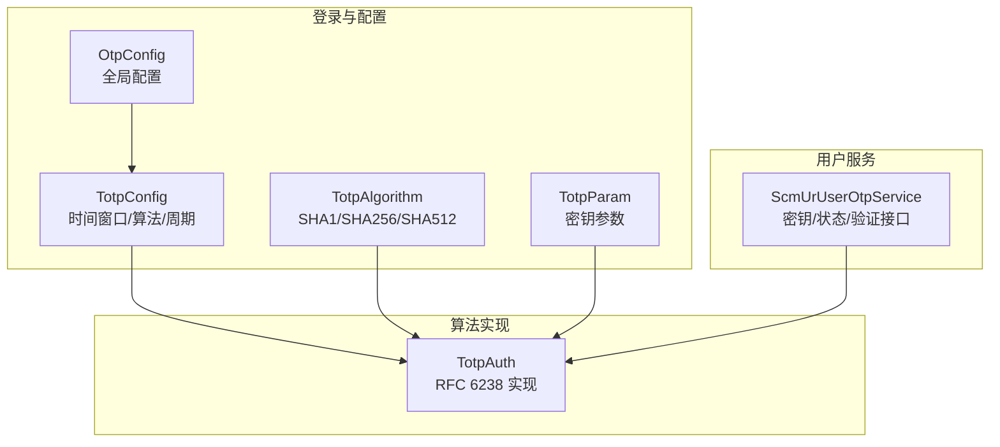
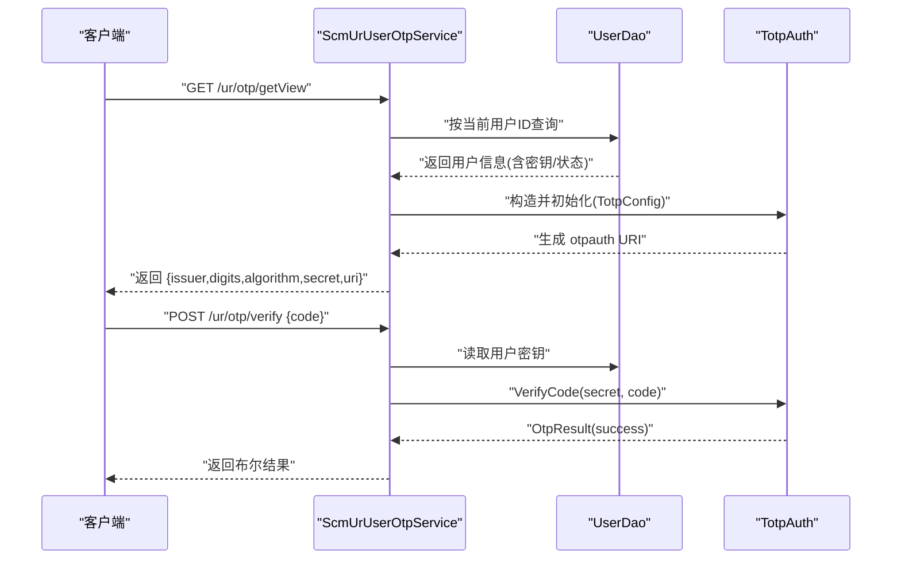
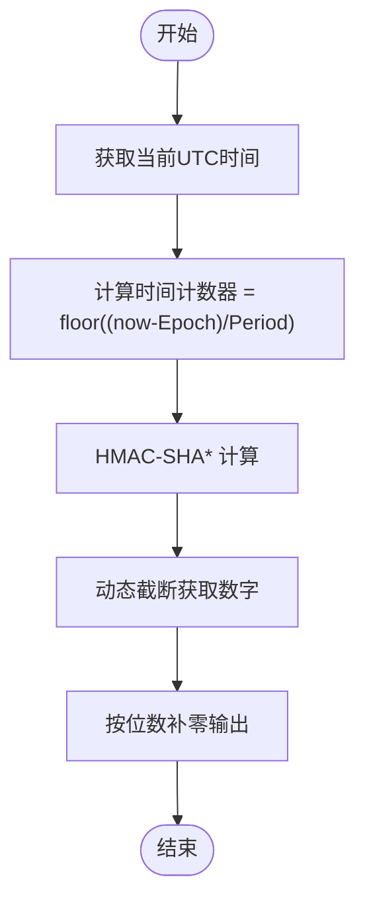
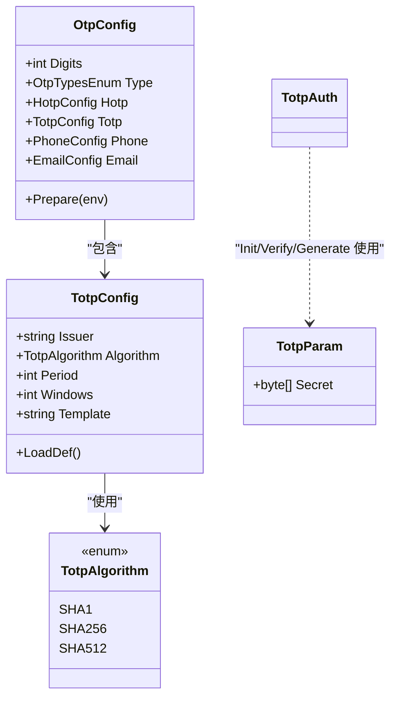
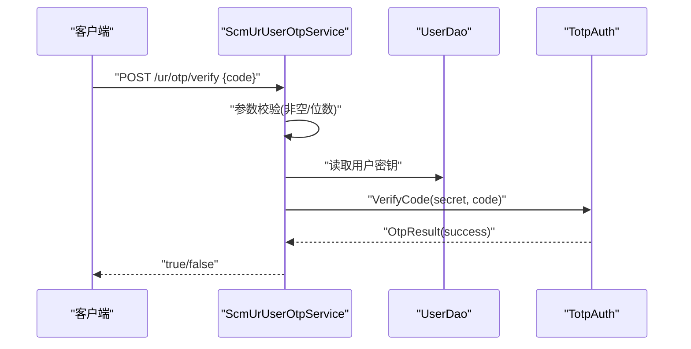
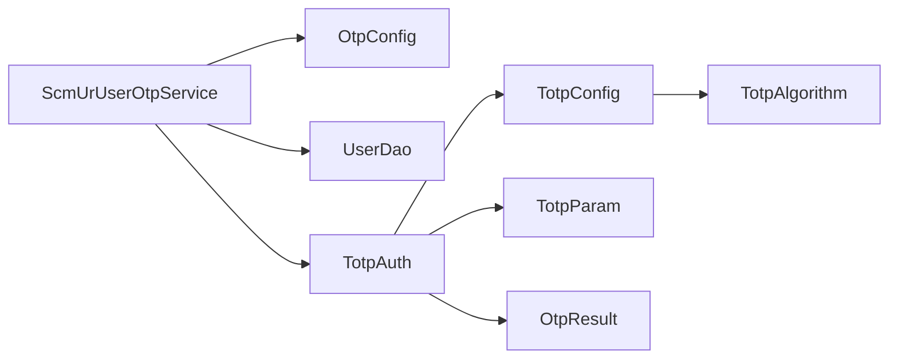

# TOTP 时间戳验证码

<cite>
**本文引用的文件**
- [Scm.Core/Ur/UserOtp/ScmUrUserOtpService.cs](file://Scm.Core/Ur/UserOtp/ScmUrUserOtpService.cs)
- [Scm.Core/Login/Otp/Totp/TotpAuth.cs](file://Scm.Core/Login/Otp/Totp/TotpAuth.cs)
- [Scm.Core/Login/Otp/Totp/TotpConfig.cs](file://Scm.Core/Login/Otp/Totp/TotpConfig.cs)
- [Scm.Core/Login/Otp/Totp/TotpAlgorithm.cs](file://Scm.Core/Login/Otp/Totp/TotpAlgorithm.cs)
- [Scm.Core/Login/Otp/Totp/TotpParam.cs](file://Scm.Core/Login/Otp/Totp/TotpParam.cs)
- [Scm.Common/Enums/ScmOtpEnum.cs](file://Scm.Common/Enums/ScmOtpEnum.cs)
- [Scm.Core/Login/Otp/OtpConfig.cs](file://Scm.Core/Login/Otp/OtpConfig.cs)
- [Scm.Core/Login/Otp/OtpResult.cs](file://Scm.Core/Login/Otp/OtpResult.cs)
</cite>

## 目录
1. [简介](#简介)
2. [项目结构](#项目结构)
3. [核心组件](#核心组件)
4. [架构总览](#架构总览)
5. [详细组件分析](#详细组件分析)
6. [依赖关系分析](#依赖关系分析)
7. [性能考量](#性能考量)
8. [故障排除指南](#故障排除指南)
9. [结论](#结论)
10. [附录](#附录)

## 简介
本文件面向 Scm.Net 的 TOTP 时间戳验证码认证能力，系统性阐述 TOTP 算法在项目中的实现与使用方式，覆盖以下主题：
- TOTP 算法原理与实现要点
- 基于时间窗口的验证码生成机制与容错策略
- 密钥管理与同步策略
- 安全特性与防重放机制
- 完整的 TOTP 认证 API 接口说明（含生成密钥、验证代码）
- 密钥轮换策略、设备绑定与多设备支持思路
- 客户端集成示例与常见问题排查

## 项目结构
围绕 TOTP 的核心代码分布在如下模块：
- 登录与 OTP 配置层：OtpConfig、TotpConfig、TotpAlgorithm、TotpParam
- TOTP 算法实现：TotpAuth（符合 RFC 6238）
- 用户侧 OTP 服务：ScmUrUserOtpService（提供密钥生成、状态更新、验证等接口）
- 枚举与返回体：OtpTypesEnum、OtpResult

**图表来源**
- [Scm.Core/Login/Otp/OtpConfig.cs:10-57](file://Scm.Core/Login/Otp/OtpConfig.cs#L10-L57)
- [Scm.Core/Login/Otp/Totp/TotpConfig.cs:6-78](file://Scm.Core/Login/Otp/Totp/TotpConfig.cs#L6-L78)
- [Scm.Core/Login/Otp/Totp/TotpAlgorithm.cs:6-23](file://Scm.Core/Login/Otp/Totp/TotpAlgorithm.cs#L6-L23)
- [Scm.Core/Login/Otp/Totp/TotpParam.cs:3-10](file://Scm.Core/Login/Otp/Totp/TotpParam.cs#L3-L10)
- [Scm.Core/Login/Otp/Totp/TotpAuth.cs:16-375](file://Scm.Core/Login/Otp/Totp/TotpAuth.cs#L16-L375)
- [Scm.Core/Ur/UserOtp/ScmUrUserOtpService.cs:17-186](file://Scm.Core/Ur/UserOtp/ScmUrUserOtpService.cs#L17-L186)

**章节来源**
- [Scm.Core/Login/Otp/OtpConfig.cs:10-57](file://Scm.Core/Login/Otp/OtpConfig.cs#L10-L57)
- [Scm.Core/Login/Otp/Totp/TotpConfig.cs:6-78](file://Scm.Core/Login/Otp/Totp/TotpConfig.cs#L6-L78)
- [Scm.Core/Login/Otp/Totp/TotpAlgorithm.cs:6-23](file://Scm.Core/Login/Otp/Totp/TotpAlgorithm.cs#L6-L23)
- [Scm.Core/Login/Otp/Totp/TotpParam.cs:3-10](file://Scm.Core/Login/Otp/Totp/TotpParam.cs#L3-L10)
- [Scm.Core/Login/Otp/Totp/TotpAuth.cs:16-375](file://Scm.Core/Login/Otp/Totp/TotpAuth.cs#L16-L375)
- [Scm.Core/Ur/UserOtp/ScmUrUserOtpService.cs:17-186](file://Scm.Core/Ur/UserOtp/ScmUrUserOtpService.cs#L17-L186)

## 核心组件
- OtpConfig：全局 OTP 配置入口，包含位数、类型以及各子模块配置（如 Totp、Hotp、Phone、Email）。
- TotpConfig：TOTP 特定配置，包括发行者、摘要算法、时间步长（Period）、容错窗口（Windows）、二维码模板等。
- TotpAlgorithm：支持的哈希算法枚举（SHA1/SHA256/SHA512）。
- TotpParam：TOTP 参数载体，包含共享密钥。
- TotpAuth：TOTP 算法实现类，负责生成与验证、时间计数器计算、HMAC 动态截断等。
- ScmUrUserOtpService：用户侧 OTP 服务，提供查询、更新密钥、启用/禁用、验证 OTP 码等接口。
- OtpResult：统一的结果封装（data、success、error_code、error_message）。

**章节来源**
- [Scm.Core/Login/Otp/OtpConfig.cs:10-57](file://Scm.Core/Login/Otp/OtpConfig.cs#L10-L57)
- [Scm.Core/Login/Otp/Totp/TotpConfig.cs:6-78](file://Scm.Core/Login/Otp/Totp/TotpConfig.cs#L6-L78)
- [Scm.Core/Login/Otp/Totp/TotpAlgorithm.cs:6-23](file://Scm.Core/Login/Otp/Totp/TotpAlgorithm.cs#L6-L23)
- [Scm.Core/Login/Otp/Totp/TotpParam.cs:3-10](file://Scm.Core/Login/Otp/Totp/TotpParam.cs#L3-L10)
- [Scm.Core/Login/Otp/Totp/TotpAuth.cs:16-375](file://Scm.Core/Login/Otp/Totp/TotpAuth.cs#L16-L375)
- [Scm.Core/Ur/UserOtp/ScmUrUserOtpService.cs:17-186](file://Scm.Core/Ur/UserOtp/ScmUrUserOtpService.cs#L17-L186)
- [Scm.Core/Login/Otp/OtpResult.cs:3-35](file://Scm.Core/Login/Otp/OtpResult.cs#L3-L35)

## 架构总览
TOTP 在 Scm.Net 中采用“配置驱动 + 算法实现 + 服务编排”的分层设计：
- 配置层：OtpConfig -> TotpConfig 提供算法、周期、容错等参数
- 算法层：TotpAuth 实现 RFC 6238，包含时间计数器、HMAC 动态截断、窗口验证
- 服务层：ScmUrUserOtpService 负责与用户实体交互，提供密钥生成、状态变更、验证等 API

**图表来源**
- [Scm.Core/Ur/UserOtp/ScmUrUserOtpService.cs:57-151](file://Scm.Core/Ur/UserOtp/ScmUrUserOtpService.cs#L57-L151)
- [Scm.Core/Login/Otp/Totp/TotpAuth.cs:69-168](file://Scm.Core/Login/Otp/Totp/TotpAuth.cs#L69-L168)

**章节来源**
- [Scm.Core/Ur/UserOtp/ScmUrUserOtpService.cs:57-151](file://Scm.Core/Ur/UserOtp/ScmUrUserOtpService.cs#L57-L151)
- [Scm.Core/Login/Otp/Totp/TotpAuth.cs:69-168](file://Scm.Core/Login/Otp/Totp/TotpAuth.cs#L69-L168)

## 详细组件分析

### TOTP 算法实现（TotpAuth）
- 时间计数器：以 Unix Epoch 为基准，按 Period（秒）切分时间窗口
- HMAC 动态截断：对 HMAC 结果进行动态截断，取固定位数作为验证码
- 容错窗口：验证时向前/后扩展若干窗口，提升客户端时间偏差容忍度
- 生成与验证：
  - GenerateCode：基于当前 UTC 时间生成一次性密码
  - VerifyCode：在容错窗口内匹配生成的密码
- 二维码 URL：根据模板生成 otpauth://totp 链接，供客户端扫码导入

**图表来源**
- [Scm.Core/Login/Otp/Totp/TotpAuth.cs:187-205](file://Scm.Core/Login/Otp/Totp/TotpAuth.cs#L187-L205)
- [Scm.Core/Login/Otp/Totp/TotpAuth.cs:284-357](file://Scm.Core/Login/Otp/Totp/TotpAuth.cs#L284-L357)

**章节来源**
- [Scm.Core/Login/Otp/Totp/TotpAuth.cs:16-375](file://Scm.Core/Login/Otp/Totp/TotpAuth.cs#L16-L375)

### 配置与参数（TotpConfig/TotpAlgorithm/TotpParam/OtpConfig）
- TotpConfig：默认周期 30 秒，容错窗口可配置；提供默认二维码模板
- TotpAlgorithm：支持 SHA1/SHA256/SHA512
- TotpParam：携带 Base32 解码后的密钥字节数组
- OtpConfig：全局位数（默认 6，范围 4~8），聚合各子模块配置

**图表来源**
- [Scm.Core/Login/Otp/OtpConfig.cs:10-57](file://Scm.Core/Login/Otp/OtpConfig.cs#L10-L57)
- [Scm.Core/Login/Otp/Totp/TotpConfig.cs:6-78](file://Scm.Core/Login/Otp/Totp/TotpConfig.cs#L6-L78)
- [Scm.Core/Login/Otp/Totp/TotpAlgorithm.cs:6-23](file://Scm.Core/Login/Otp/Totp/TotpAlgorithm.cs#L6-L23)
- [Scm.Core/Login/Otp/Totp/TotpParam.cs:3-10](file://Scm.Core/Login/Otp/Totp/TotpParam.cs#L3-L10)

**章节来源**
- [Scm.Core/Login/Otp/OtpConfig.cs:10-57](file://Scm.Core/Login/Otp/OtpConfig.cs#L10-L57)
- [Scm.Core/Login/Otp/Totp/TotpConfig.cs:6-78](file://Scm.Core/Login/Otp/Totp/TotpConfig.cs#L6-L78)
- [Scm.Core/Login/Otp/Totp/TotpAlgorithm.cs:6-23](file://Scm.Core/Login/Otp/Totp/TotpAlgorithm.cs#L6-L23)
- [Scm.Core/Login/Otp/Totp/TotpParam.cs:3-10](file://Scm.Core/Login/Otp/Totp/TotpParam.cs#L3-L10)

### 用户服务（ScmUrUserOtpService）
- 查询接口：GetAsync 返回用户 OTP 状态与更新时间；GetViewAsync 返回完整视图（含 issuer、digits、algorithm、secret、uri）
- 更新密钥：UpdateAsync 重新生成密钥并更新时间戳
- 启用/禁用：StatusAsync 切换状态并在启用时补齐密钥与时间戳
- 验证接口：VerifyAsync 校验用户提交的验证码是否有效

**图表来源**
- [Scm.Core/Ur/UserOtp/ScmUrUserOtpService.cs:127-151](file://Scm.Core/Ur/UserOtp/ScmUrUserOtpService.cs#L127-L151)
- [Scm.Core/Login/Otp/Totp/TotpAuth.cs:112-168](file://Scm.Core/Login/Otp/Totp/TotpAuth.cs#L112-L168)

**章节来源**
- [Scm.Core/Ur/UserOtp/ScmUrUserOtpService.cs:42-186](file://Scm.Core/Ur/UserOtp/ScmUrUserOtpService.cs#L42-L186)

### 数据模型与枚举
- OtpTypesEnum：定义 OTP 类型枚举（None/Phone/Email/Hotp/Totp）
- OtpResult：统一返回体，包含 data、success、error_code、error_message

**章节来源**
- [Scm.Common/Enums/ScmOtpEnum.cs:3-23](file://Scm.Common/Enums/ScmOtpEnum.cs#L3-L23)
- [Scm.Core/Login/Otp/OtpResult.cs:3-35](file://Scm.Core/Login/Otp/OtpResult.cs#L3-L35)

## 依赖关系分析
- TotpAuth 依赖 TotpConfig（算法、周期、容错）、TotpParam（密钥）、OtpResult（返回）
- ScmUrUserOtpService 依赖 OtpConfig（全局配置）、UserDao（持久化）、TotpAuth（算法）
- TotpConfig 依赖环境配置加载默认值（LoadDef）

**图表来源**
- [Scm.Core/Ur/UserOtp/ScmUrUserOtpService.cs:28-35](file://Scm.Core/Ur/UserOtp/ScmUrUserOtpService.cs#L28-L35)
- [Scm.Core/Login/Otp/OtpConfig.cs:10-57](file://Scm.Core/Login/Otp/OtpConfig.cs#L10-L57)
- [Scm.Core/Login/Otp/Totp/TotpAuth.cs:16-375](file://Scm.Core/Login/Otp/Totp/TotpAuth.cs#L16-L375)
- [Scm.Core/Login/Otp/Totp/TotpConfig.cs:6-78](file://Scm.Core/Login/Otp/Totp/TotpConfig.cs#L6-L78)
- [Scm.Core/Login/Otp/Totp/TotpAlgorithm.cs:6-23](file://Scm.Core/Login/Otp/Totp/TotpAlgorithm.cs#L6-L23)
- [Scm.Core/Login/Otp/Totp/TotpParam.cs:3-10](file://Scm.Core/Login/Otp/Totp/TotpParam.cs#L3-L10)
- [Scm.Core/Login/Otp/OtpResult.cs:3-35](file://Scm.Core/Login/Otp/OtpResult.cs#L3-L35)

**章节来源**
- [Scm.Core/Ur/UserOtp/ScmUrUserOtpService.cs:28-35](file://Scm.Core/Ur/UserOtp/ScmUrUserOtpService.cs#L28-L35)
- [Scm.Core/Login/Otp/OtpConfig.cs:10-57](file://Scm.Core/Login/Otp/OtpConfig.cs#L10-L57)
- [Scm.Core/Login/Otp/Totp/TotpAuth.cs:16-375](file://Scm.Core/Login/Otp/Totp/TotpAuth.cs#L16-L375)
- [Scm.Core/Login/Otp/Totp/TotpConfig.cs:6-78](file://Scm.Core/Login/Otp/Totp/TotpConfig.cs#L6-L78)
- [Scm.Core/Login/Otp/Totp/TotpAlgorithm.cs:6-23](file://Scm.Core/Login/Otp/Totp/TotpAlgorithm.cs#L6-L23)
- [Scm.Core/Login/Otp/Totp/TotpParam.cs:3-10](file://Scm.Core/Login/Otp/Totp/TotpParam.cs#L3-L10)
- [Scm.Core/Login/Otp/OtpResult.cs:3-35](file://Scm.Core/Login/Otp/OtpResult.cs#L3-L35)

## 性能考量
- HMAC 计算与动态截断均为常数时间复杂度，整体开销极低
- 容错窗口越大，验证耗时线性增长；建议默认窗口保持较小以兼顾安全与性能
- 周期（Period）越短，生成与验证更频繁但安全性更高；默认 30 秒平衡了可用性与安全
- 建议在高并发场景下缓存用户密钥解码结果，避免重复 Base32 解码

## 故障排除指南
- 验证失败
  - 检查客户端时间是否与服务器 UTC 对齐，或适当增大容错窗口
  - 确认验证码位数与配置一致（默认 6 位）
  - 确认使用的算法与服务端一致（默认 SHA1）
- 二维码无法导入
  - 检查 otpauth URI 是否完整（issuer、account、secret、algorithm、digits、period）
  - 确保 secret 已正确 Base32 编码
- 密钥未生效
  - 启用 OTP 时若无密钥会自动补齐；请确认状态切换流程已执行
  - 更新密钥后需重新扫码导入新密钥
- 接口错误
  - Verify 接口要求非空且为纯数字；请检查入参格式
  - 若出现异常，请查看 OtpResult.error_code/error_message 字段定位问题

**章节来源**
- [Scm.Core/Ur/UserOtp/ScmUrUserOtpService.cs:127-151](file://Scm.Core/Ur/UserOtp/ScmUrUserOtpService.cs#L127-L151)
- [Scm.Core/Login/Otp/Totp/TotpConfig.cs:49-75](file://Scm.Core/Login/Otp/Totp/TotpConfig.cs#L49-L75)
- [Scm.Core/Login/Otp/OtpResult.cs:3-35](file://Scm.Core/Login/Otp/OtpResult.cs#L3-L35)

## 结论
Scm.Net 的 TOTP 实现遵循 RFC 6238，具备清晰的配置体系、稳定的算法实现与简洁的服务接口。通过时间窗口与容错机制，既保证了安全性也提升了用户体验。结合密钥轮换、状态管理与二维码导入，可满足企业级双因子认证需求。

## 附录

### TOTP 认证 API 接口文档
- 获取 OTP 视图信息
  - 方法：GET
  - 路径：/ur/otp/getView
  - 返回：包含 issuer、digits、algorithm、secret、uri 等字段
  - 用途：用于生成二维码供客户端扫码导入
- 更新 OTP 密钥
  - 方法：POST
  - 路径：/ur/otp/update
  - 返回：状态与更新时间
  - 用途：重新生成密钥并同步到客户端
- 启用/禁用 OTP
  - 方法：POST
  - 路径：/ur/otp/status
  - 请求体：状态参数
  - 返回：状态与更新时间
  - 用途：开启/关闭用户的 OTP 认证
- 验证 OTP 代码
  - 方法：POST
  - 路径：/ur/otp/verify
  - 请求体：{ code }
  - 返回：布尔值（true/false）
  - 用途：校验用户提交的验证码

**章节来源**
- [Scm.Core/Ur/UserOtp/ScmUrUserOtpService.cs:42-186](file://Scm.Core/Ur/UserOtp/ScmUrUserOtpService.cs#L42-L186)

### 安全特性与防重放机制
- 时间窗口：基于 Period 的时间片控制，降低密码复用风险
- 容错窗口：允许一定时间偏差，减少因时钟漂移导致的误判
- 密钥轮换：支持重新生成密钥，降低长期暴露风险
- 传输安全：建议配合 HTTPS 使用，防止中间人攻击

**章节来源**
- [Scm.Core/Login/Otp/Totp/TotpAuth.cs:154-168](file://Scm.Core/Login/Otp/Totp/TotpAuth.cs#L154-L168)
- [Scm.Core/Ur/UserOtp/ScmUrUserOtpService.cs:70-85](file://Scm.Core/Ur/UserOtp/ScmUrUserOtpService.cs#L70-L85)

### 客户端集成示例（步骤说明）
- 生成二维码
  - 调用 GET /ur/otp/getView 获取 uri
  - 使用客户端扫描器解析 otpauth://totp 链接完成导入
- 输入验证码
  - 用户输入 6 位验证码
  - 调用 POST /ur/otp/verify 提交 code
  - 根据返回布尔值决定登录流程下一步

**章节来源**
- [Scm.Core/Ur/UserOtp/ScmUrUserOtpService.cs:57-151](file://Scm.Core/Ur/UserOtp/ScmUrUserOtpService.cs#L57-L151)