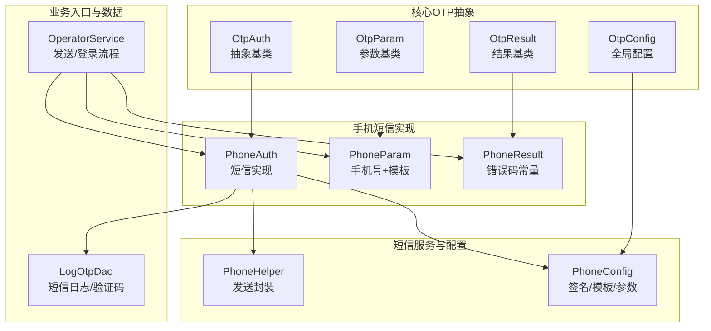
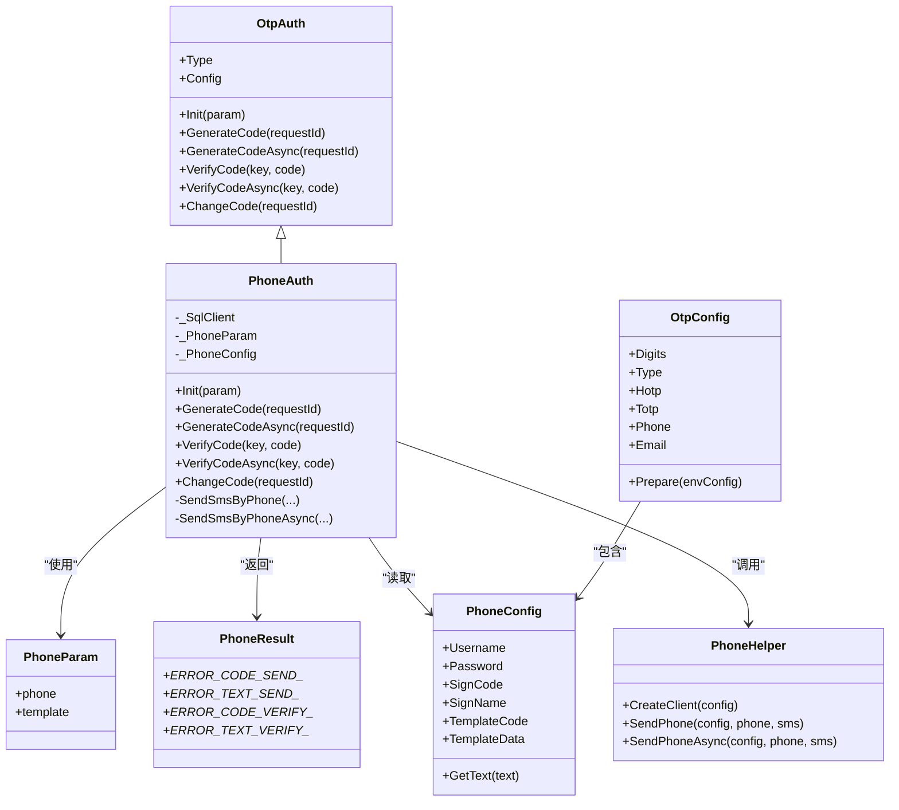
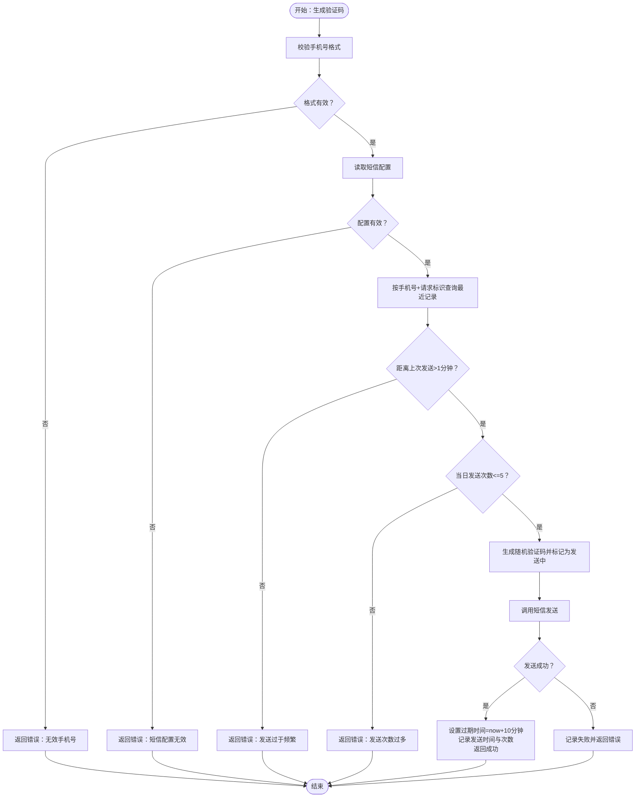
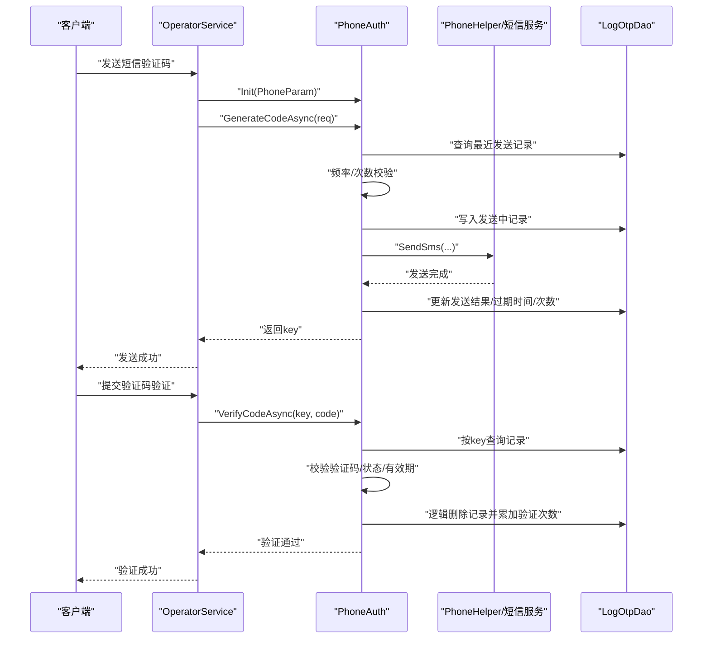
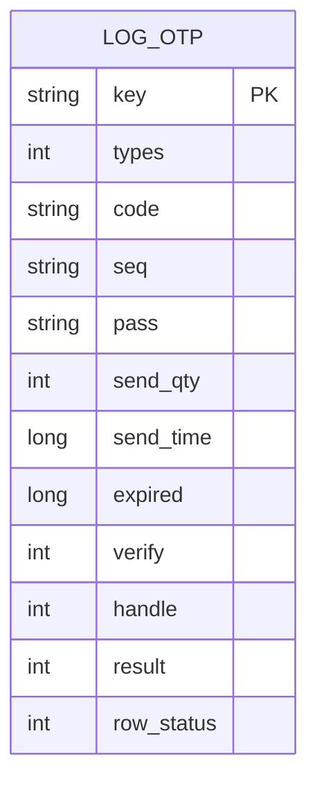
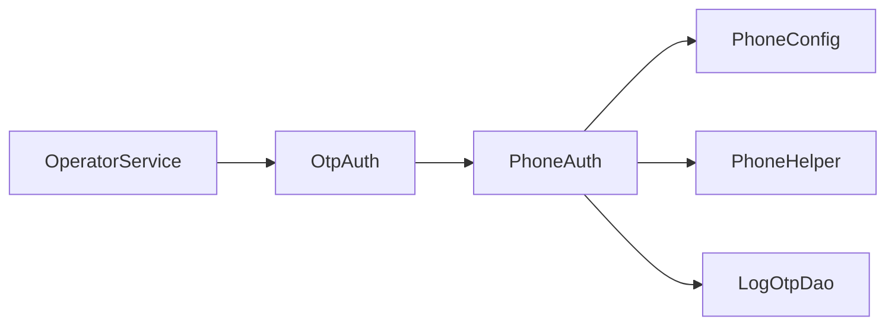
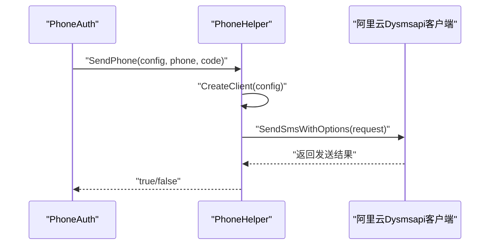

# 短信验证码认证

<cite>
**本文引用的文件**
- [Scm.Core/Operator/OperatorService.cs](file://Scm.Core/Operator/OperatorService.cs)
- [Scm.Core/Login/Otp/OtpAuth.cs](file://Scm.Core/Login/Otp/OtpAuth.cs)
- [Scm.Core/Login/Otp/OtpParam.cs](file://Scm.Core/Login/Otp/OtpParam.cs)
- [Scm.Core/Login/Otp/OtpResult.cs](file://Scm.Core/Login/Otp/OtpResult.cs)
- [Scm.Core/Login/Otp/OtpConfig.cs](file://Scm.Core/Login/Otp/OtpConfig.cs)
- [Scm.Core/Login/Otp/Phone/PhoneAuth.cs](file://Scm.Core/Login/Otp/Phone/PhoneAuth.cs)
- [Scm.Core/Login/Otp/Phone/PhoneParam.cs](file://Scm.Core/Login/Otp/Phone/PhoneParam.cs)
- [Scm.Core/Login/Otp/Phone/PhoneResult.cs](file://Scm.Core/Login/Otp/Phone/PhoneResult.cs)
- [Scm.Phone/Phone/Config/PhoneConfig.cs](file://Scm.Phone/Phone/Config/PhoneConfig.cs)
- [Scm.Phone/Utils/PhoneHelper.cs](file://Scm.Phone/Utils/PhoneHelper.cs)
- [Scm.Core/Operator/Dvo/SendSmsRequest.cs](file://Scm.Core/Operator/Dvo/SendSmsRequest.cs)
- [Scm.Core/Operator/Dvo/SendSmsResponse.cs](file://Scm.Core/Operator/Dvo/SendSmsResponse.cs)
- [Scm.Dao/Log/LogOtpDao.cs](file://Scm.Dao/Log/LogOtpDao.cs)
</cite>

## 目录
1. [简介](#简介)
2. [项目结构](#项目结构)
3. [核心组件](#核心组件)
4. [架构总览](#架构总览)
5. [详细组件分析](#详细组件分析)
6. [依赖关系分析](#依赖关系分析)
7. [性能与并发特性](#性能与并发特性)
8. [安全与风控](#安全与风控)
9. [短信服务商集成](#短信服务商集成)
10. [API 接口文档](#api-接口文档)
11. [配置与模板](#配置与模板)
12. [故障排除指南](#故障排除指南)
13. [结论](#结论)

## 简介
本文件面向 Scm.Net 的短信验证码认证能力，围绕 PhoneAuth 类的实现机制展开，系统阐述短信验证码的生成、发送与验证全流程；说明短信服务商集成方式、验证码模板配置与发送策略；解释 PhoneParam 与 PhoneResult 数据模型的设计与使用；给出完整的短信认证 API 接口说明；并覆盖发送频率限制、验证码有效期管理与安全防护要点，附带配置示例与故障排除建议。

## 项目结构
与短信验证码认证直接相关的模块分布如下：
- 核心 OTP 抽象层：OtpAuth、OtpParam、OtpResult、OtpConfig
- 手机短信实现：PhoneAuth、PhoneParam、PhoneResult
- 短信服务封装：PhoneHelper（基于阿里云 Dysmsapi）
- 短信配置：PhoneConfig
- 运营商服务入口：OperatorService 中的发送与登录流程
- 数据持久化：LogOtpDao（短信日志与验证码记录）

图表来源
- [Scm.Core/Login/Otp/OtpAuth.cs:1-91](file://Scm.Core/Login/Otp/OtpAuth.cs#L1-L91)
- [Scm.Core/Login/Otp/OtpParam.cs:1-7](file://Scm.Core/Login/Otp/OtpParam.cs#L1-L7)
- [Scm.Core/Login/Otp/OtpResult.cs:1-35](file://Scm.Core/Login/Otp/OtpResult.cs#L1-L35)
- [Scm.Core/Login/Otp/OtpConfig.cs:1-57](file://Scm.Core/Login/Otp/OtpConfig.cs#L1-L57)
- [Scm.Core/Login/Otp/Phone/PhoneAuth.cs:1-405](file://Scm.Core/Login/Otp/Phone/PhoneAuth.cs#L1-L405)
- [Scm.Core/Login/Otp/Phone/PhoneParam.cs:1-12](file://Scm.Core/Login/Otp/Phone/PhoneParam.cs#L1-L12)
- [Scm.Core/Login/Otp/Phone/PhoneResult.cs:1-49](file://Scm.Core/Login/Otp/Phone/PhoneResult.cs#L1-L49)
- [Scm.Phone/Phone/Config/PhoneConfig.cs:1-26](file://Scm.Phone/Phone/Config/PhoneConfig.cs#L1-L26)
- [Scm.Phone/Utils/PhoneHelper.cs:1-72](file://Scm.Phone/Utils/PhoneHelper.cs#L1-L72)
- [Scm.Core/Operator/OperatorService.cs:1280-1320](file://Scm.Core/Operator/OperatorService.cs#L1280-L1320)
- [Scm.Dao/Log/LogOtpDao.cs](file://Scm.Dao/Log/LogOtpDao.cs)

章节来源
- [Scm.Core/Login/Otp/OtpAuth.cs:1-91](file://Scm.Core/Login/Otp/OtpAuth.cs#L1-L91)
- [Scm.Core/Login/Otp/Phone/PhoneAuth.cs:1-405](file://Scm.Core/Login/Otp/Phone/PhoneAuth.cs#L1-L405)
- [Scm.Phone/Utils/PhoneHelper.cs:1-72](file://Scm.Phone/Utils/PhoneHelper.cs#L1-L72)

## 核心组件
- OtpAuth 抽象基类：定义初始化、生成验证码、验证验证码、更新口令等统一接口，供 PhoneAuth 等具体实现继承。
- PhoneAuth：短信验证码的具体实现，负责手机号校验、发送频率与次数控制、验证码生成、发送执行、有效期设置、验证流程与结果记录。
- PhoneParam：携带手机号与模板键的输入参数。
- PhoneResult：定义短信发送与验证阶段的错误码与提示文本。
- PhoneConfig：短信服务商配置项（用户名/密码、签名、模板、模板参数）。
- PhoneHelper：封装短信发送客户端创建与调用（当前实现对接阿里云 Dysmsapi）。
- OperatorService：对外暴露发送短信验证码与登录流程的业务入口，内部根据登录模式选择 PhoneAuth 或 EmailAuth 并驱动 OTP 流程。
- LogOtpDao：存储短信验证码的生成、发送、过期、验证等状态与计数信息。

章节来源
- [Scm.Core/Login/Otp/OtpAuth.cs:1-91](file://Scm.Core/Login/Otp/OtpAuth.cs#L1-L91)
- [Scm.Core/Login/Otp/Phone/PhoneAuth.cs:1-405](file://Scm.Core/Login/Otp/Phone/PhoneAuth.cs#L1-L405)
- [Scm.Core/Login/Otp/Phone/PhoneParam.cs:1-12](file://Scm.Core/Login/Otp/Phone/PhoneParam.cs#L1-L12)
- [Scm.Core/Login/Otp/Phone/PhoneResult.cs:1-49](file://Scm.Core/Login/Otp/Phone/PhoneResult.cs#L1-L49)
- [Scm.Phone/Phone/Config/PhoneConfig.cs:1-26](file://Scm.Phone/Phone/Config/PhoneConfig.cs#L1-L26)
- [Scm.Phone/Utils/PhoneHelper.cs:1-72](file://Scm.Phone/Utils/PhoneHelper.cs#L1-L72)
- [Scm.Core/Operator/OperatorService.cs:1280-1320](file://Scm.Core/Operator/OperatorService.cs#L1280-L1320)
- [Scm.Dao/Log/LogOtpDao.cs](file://Scm.Dao/Log/LogOtpDao.cs)

## 架构总览
短信验证码认证采用“抽象 + 具体实现 + 服务封装 + 配置 + 数据持久”的分层设计：
- 抽象层：OtpAuth 定义统一接口，OtpConfig 统一加载与准备各子配置。
- 实现层：PhoneAuth 实现短信验证码的生成、发送、验证与状态管理。
- 服务封装：PhoneHelper 将短信发送细节封装为可复用工具。
- 配置层：PhoneConfig 提供签名、模板与模板参数占位符替换。
- 数据层：LogOtpDao 记录验证码生成、发送、过期与验证状态，支撑风控与有效期管理。

图表来源
- [Scm.Core/Login/Otp/OtpAuth.cs:1-91](file://Scm.Core/Login/Otp/OtpAuth.cs#L1-L91)
- [Scm.Core/Login/Otp/Phone/PhoneAuth.cs:1-405](file://Scm.Core/Login/Otp/Phone/PhoneAuth.cs#L1-L405)
- [Scm.Core/Login/Otp/Phone/PhoneParam.cs:1-12](file://Scm.Core/Login/Otp/Phone/PhoneParam.cs#L1-L12)
- [Scm.Core/Login/Otp/Phone/PhoneResult.cs:1-49](file://Scm.Core/Login/Otp/Phone/PhoneResult.cs#L1-L49)
- [Scm.Core/Login/Otp/OtpConfig.cs:1-57](file://Scm.Core/Login/Otp/OtpConfig.cs#L1-L57)
- [Scm.Phone/Phone/Config/PhoneConfig.cs:1-26](file://Scm.Phone/Phone/Config/PhoneConfig.cs#L1-L26)
- [Scm.Phone/Utils/PhoneHelper.cs:1-72](file://Scm.Phone/Utils/PhoneHelper.cs#L1-L72)

## 详细组件分析

### PhoneAuth 实现机制
- 初始化与参数绑定：接收 PhoneParam（手机号、模板键），并绑定到实例字段。
- 生成验证码：
  - 校验手机号格式；
  - 读取短信配置；
  - 基于请求标识与手机号查询最近一次发送记录；
  - 频率限制（1 分钟内不可重复发送）、次数限制（当日最多 5 次）；
  - 生成随机验证码，标记为“发送中”，调用短信发送；
  - 成功则设置过期时间（默认 10 分钟）、记录发送时间与次数；失败则记录失败原因。
- 验证验证码：
  - 校验 key 的长度合法性；
  - 根据 key 查找对应记录；
  - 校验验证码一致、未被多次验证、状态已完成、未过期；
  - 成功则累加验证次数并逻辑删除该记录，返回通过。

图表来源
- [Scm.Core/Login/Otp/Phone/PhoneAuth.cs:53-135](file://Scm.Core/Login/Otp/Phone/PhoneAuth.cs#L53-L135)

章节来源
- [Scm.Core/Login/Otp/Phone/PhoneAuth.cs:53-224](file://Scm.Core/Login/Otp/Phone/PhoneAuth.cs#L53-L224)

### 验证流程时序

图表来源
- [Scm.Core/Operator/OperatorService.cs:1286-1320](file://Scm.Core/Operator/OperatorService.cs#L1286-L1320)
- [Scm.Core/Login/Otp/Phone/PhoneAuth.cs:142-224](file://Scm.Core/Login/Otp/Phone/PhoneAuth.cs#L142-L224)
- [Scm.Phone/Utils/PhoneHelper.cs:30-69](file://Scm.Phone/Utils/PhoneHelper.cs#L30-L69)
- [Scm.Dao/Log/LogOtpDao.cs](file://Scm.Dao/Log/LogOtpDao.cs)

章节来源
- [Scm.Core/Operator/OperatorService.cs:1286-1320](file://Scm.Core/Operator/OperatorService.cs#L1286-L1320)
- [Scm.Core/Login/Otp/Phone/PhoneAuth.cs:232-375](file://Scm.Core/Login/Otp/Phone/PhoneAuth.cs#L232-L375)

### 数据模型与状态
- PhoneParam：承载手机号与模板键，作为短信发送的输入参数。
- PhoneResult：集中定义短信发送与验证阶段的错误码与提示文本，便于统一处理与国际化扩展。
- LogOtpDao：存储验证码生成、发送、过期、验证次数与状态，是风控与有效期管理的数据基础。

图表来源
- [Scm.Dao/Log/LogOtpDao.cs](file://Scm.Dao/Log/LogOtpDao.cs)

章节来源
- [Scm.Core/Login/Otp/Phone/PhoneParam.cs:1-12](file://Scm.Core/Login/Otp/Phone/PhoneParam.cs#L1-L12)
- [Scm.Core/Login/Otp/Phone/PhoneResult.cs:1-49](file://Scm.Core/Login/Otp/Phone/PhoneResult.cs#L1-L49)
- [Scm.Dao/Log/LogOtpDao.cs](file://Scm.Dao/Log/LogOtpDao.cs)

## 依赖关系分析
- PhoneAuth 依赖 OtpAuth 抽象接口，确保不同认证方式（如邮箱、TOTP）共享一致的生命周期与错误处理。
- PhoneAuth 依赖 PhoneConfig 读取签名、模板与模板参数，依赖 PhoneHelper 执行短信发送。
- PhoneAuth 依赖 LogOtpDao 进行发送记录、验证码与有效期的持久化。
- OperatorService 作为业务入口，根据登录模式选择 PhoneAuth 或 EmailAuth，并在发送与登录流程中调用 OTP 服务。

图表来源
- [Scm.Core/Operator/OperatorService.cs:1286-1320](file://Scm.Core/Operator/OperatorService.cs#L1286-L1320)
- [Scm.Core/Login/Otp/OtpAuth.cs:1-91](file://Scm.Core/Login/Otp/OtpAuth.cs#L1-L91)
- [Scm.Core/Login/Otp/Phone/PhoneAuth.cs:1-405](file://Scm.Core/Login/Otp/Phone/PhoneAuth.cs#L1-L405)
- [Scm.Phone/Phone/Config/PhoneConfig.cs:1-26](file://Scm.Phone/Phone/Config/PhoneConfig.cs#L1-L26)
- [Scm.Phone/Utils/PhoneHelper.cs:1-72](file://Scm.Phone/Utils/PhoneHelper.cs#L1-L72)
- [Scm.Dao/Log/LogOtpDao.cs](file://Scm.Dao/Log/LogOtpDao.cs)

章节来源
- [Scm.Core/Operator/OperatorService.cs:1286-1320](file://Scm.Core/Operator/OperatorService.cs#L1286-L1320)
- [Scm.Core/Login/Otp/Phone/PhoneAuth.cs:1-405](file://Scm.Core/Login/Otp/Phone/PhoneAuth.cs#L1-L405)

## 性能与并发特性
- 异步发送：提供 GenerateCodeAsync 与 VerifyCodeAsync，避免阻塞主线程，提升高并发场景下的吞吐。
- 发送频率与次数限制：1 分钟内防刷、单日最多 5 次，降低短信成本与风控压力。
- 即时状态更新：发送中/发送完成状态切换与发送时间、次数、过期时间的原子更新，减少后续验证的查询开销。
- 仅在成功时设置过期时间：失败时不占用过期窗口，避免误判与资源浪费。

章节来源
- [Scm.Core/Login/Otp/Phone/PhoneAuth.cs:142-224](file://Scm.Core/Login/Otp/Phone/PhoneAuth.cs#L142-L224)
- [Scm.Core/Login/Otp/Phone/PhoneAuth.cs:92-104](file://Scm.Core/Login/Otp/Phone/PhoneAuth.cs#L92-L104)

## 安全与风控
- 验证码有效期：默认 10 分钟，过期即失效，防止二次利用。
- 防重复验证：同一记录仅允许验证一次，避免暴力破解。
- 防刷策略：1 分钟内不可重复发送、单日最多 5 次。
- 参数校验：手机号格式校验、key 长度校验、状态与过期检查。
- 逻辑删除：验证通过后对记录进行逻辑删除，避免历史数据污染。

章节来源
- [Scm.Core/Login/Otp/Phone/PhoneAuth.cs:232-375](file://Scm.Core/Login/Otp/Phone/PhoneAuth.cs#L232-L375)
- [Scm.Core/Login/Otp/Phone/PhoneAuth.cs:92-104](file://Scm.Core/Login/Otp/Phone/PhoneAuth.cs#L92-L104)

## 短信服务商集成
- 当前实现基于阿里云短信服务（Dysmsapi），通过 PhoneHelper 创建客户端并调用发送接口。
- 配置项包括：用户名（AccessKey ID）、密码（AccessKey Secret）、签名名称、模板编号、模板参数（含占位符替换）。
- 发送流程：构造发送请求（手机号、签名、模板、模板参数），调用客户端发送，返回布尔结果。

图表来源
- [Scm.Phone/Utils/PhoneHelper.cs:30-69](file://Scm.Phone/Utils/PhoneHelper.cs#L30-L69)
- [Scm.Phone/Phone/Config/PhoneConfig.cs:1-26](file://Scm.Phone/Phone/Config/PhoneConfig.cs#L1-L26)

章节来源
- [Scm.Phone/Utils/PhoneHelper.cs:1-72](file://Scm.Phone/Utils/PhoneHelper.cs#L1-L72)
- [Scm.Phone/Phone/Config/PhoneConfig.cs:1-26](file://Scm.Phone/Phone/Config/PhoneConfig.cs#L1-L26)

## API 接口文档
- 发送短信验证码
  - 方法：POST
  - 路径：由业务服务暴露（入口位于 OperatorService）
  - 请求体：SendSmsRequest
    - mode：登录模式（手机号登录）
    - code：手机号
    - req：请求标识（用于去重与风控）
  - 返回体：SendSmsResponse
    - key：用于后续验证码验证的凭证
  - 错误：当手机号格式不合法、短信配置缺失、发送过于频繁或次数过多时，抛出业务异常并返回相应错误码与消息

- 验证短信验证码
  - 方法：POST/GET（取决于具体路由）
  - 路径：由业务服务暴露（入口位于 OperatorService）
  - 请求体：包含 key 与 code
  - 返回体：通用响应对象（成功时包含验证码或空数据）
  - 错误：当 key 非法、验证码不匹配、状态异常或已过期时，返回相应错误码与消息

章节来源
- [Scm.Core/Operator/Dvo/SendSmsRequest.cs:1-27](file://Scm.Core/Operator/Dvo/SendSmsRequest.cs#L1-L27)
- [Scm.Core/Operator/Dvo/SendSmsResponse.cs:1-10](file://Scm.Core/Operator/Dvo/SendSmsResponse.cs#L1-L10)
- [Scm.Core/Operator/OperatorService.cs:1286-1320](file://Scm.Core/Operator/OperatorService.cs#L1286-L1320)

## 配置与模板
- 全局配置：OtpConfig
  - Digits：验证码位数（默认 6，范围 4-8）
  - Type：TOTP/HOTP 类型枚举
  - Phone：PhoneConfig
  - Email：EmailConfig
  - Prepare：加载与准备各子配置
- 短信配置：PhoneConfig
  - Username/Password：服务凭据
  - SignName：签名名称
  - TemplateCode：模板编号
  - TemplateData：模板参数（含占位符 $sms$）
  - GetText：将验证码注入模板参数
- 模板占位符：模板参数中的 $sms$ 将被实际验证码替换后发送

章节来源
- [Scm.Core/Login/Otp/OtpConfig.cs:1-57](file://Scm.Core/Login/Otp/OtpConfig.cs#L1-L57)
- [Scm.Phone/Phone/Config/PhoneConfig.cs:1-26](file://Scm.Phone/Phone/Config/PhoneConfig.cs#L1-L26)

## 故障排除指南
- “无效的手机号码”：检查传入手机号格式是否符合规范。
- “无效的短信服务器配置”：确认 Username/Password/SignName/TemplateCode/TemplateData 是否正确配置。
- “验证码发送过于频繁”：等待至少 1 分钟后再试；检查请求标识是否一致导致误判。
- “验证码发送次数过多”：超过单日最大次数（默认 5 次），请次日再试。
- “验证码发送失败”：检查短信服务可用性与网络连通性；查看底层发送返回。
- “无效的Key/验证码不匹配/状态异常/已过期”：确认 key 与验证码正确无误；检查验证码是否已被使用或已过期；确认发送流程是否已完成。

章节来源
- [Scm.Core/Login/Otp/Phone/PhoneResult.cs:1-49](file://Scm.Core/Login/Otp/Phone/PhoneResult.cs#L1-L49)
- [Scm.Core/Login/Otp/Phone/PhoneAuth.cs:92-135](file://Scm.Core/Login/Otp/Phone/PhoneAuth.cs#L92-L135)
- [Scm.Core/Login/Otp/Phone/PhoneAuth.cs:232-375](file://Scm.Core/Login/Otp/Phone/PhoneAuth.cs#L232-L375)

## 结论
PhoneAuth 以清晰的抽象与严格的风控策略实现了短信验证码的完整生命周期管理：从参数校验、频率与次数限制、验证码生成与发送、有效期管理到最终验证与清理。结合 PhoneHelper 对短信服务的封装与 PhoneConfig 的灵活配置，系统具备良好的可扩展性与安全性。建议在生产环境中配合缓存与限流中间件进一步优化性能，并持续监控短信发送成功率与风控命中率以动态调整阈值。