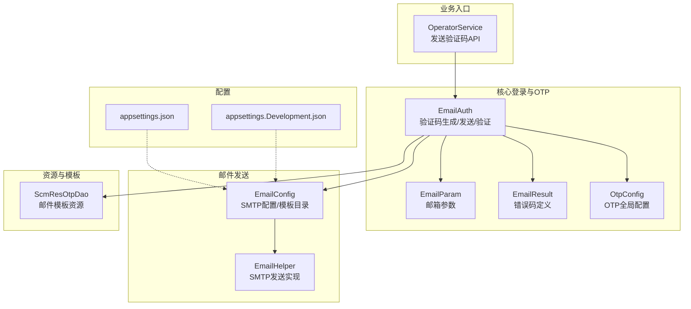
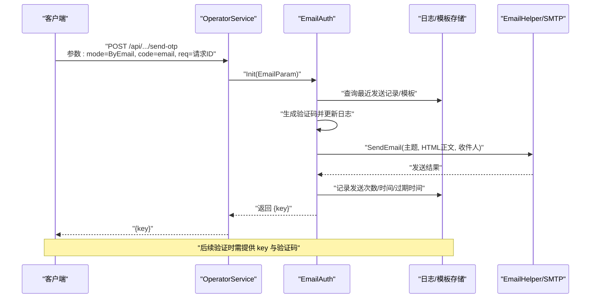
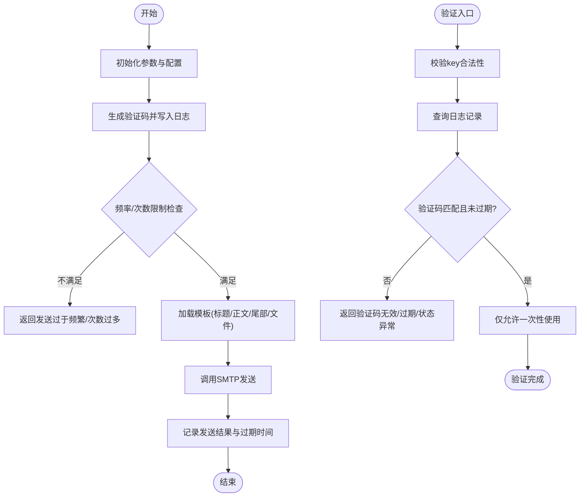
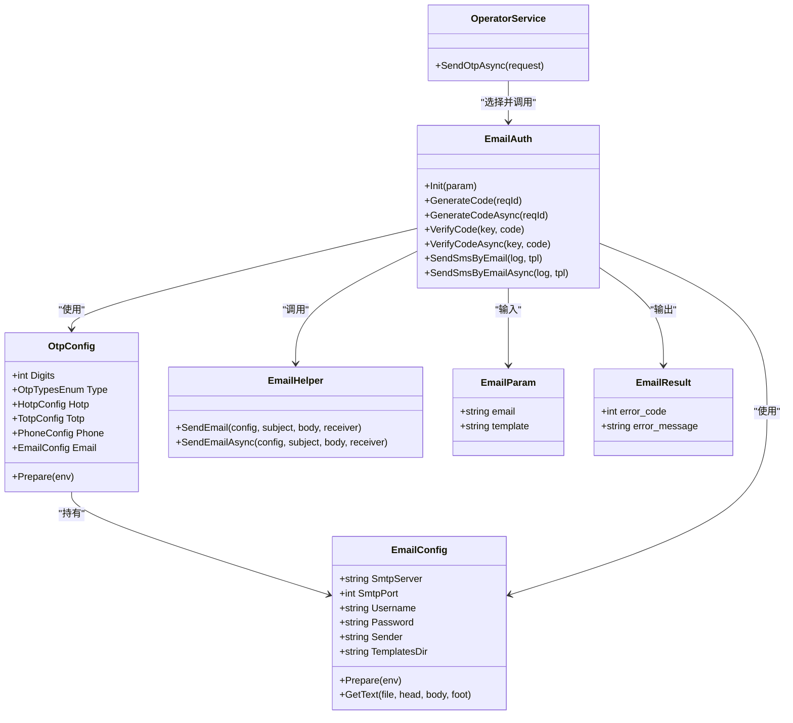

# 邮箱验证码认证

<cite>
**本文引用的文件**
- [EmailAuth.cs](file://Scm.Core/Login/Otp/Email/EmailAuth.cs)
- [EmailParam.cs](file://Scm.Core/Login/Otp/Email/EmailParam.cs)
- [EmailResult.cs](file://Scm.Core/Login/Otp/Email/EmailResult.cs)
- [EmailConfig.cs](file://Scm.Email/Email/Config/EmailConfig.cs)
- [EmailHelper.cs](file://Scm.Email/Utils/EmailHelper.cs)
- [OtpConfig.cs](file://Scm.Core/Login/Otp/OtpConfig.cs)
- [OperatorService.cs](file://Scm.Core/Operator/OperatorService.cs)
- [appsettings.json](file://Scm.Net/appsettings.json)
- [appsettings.Development.json](file://Scm.Net/appsettings.Development.json)
- [ScmResOtpDao.cs](file://Scm.Dao/Res/Otp/ScmResOtpDao.cs)
</cite>

## 目录
1. [简介](#简介)
2. [项目结构](#项目结构)
3. [核心组件](#核心组件)
4. [架构总览](#架构总览)
5. [组件详解](#组件详解)
6. [依赖关系分析](#依赖关系分析)
7. [性能与可靠性](#性能与可靠性)
8. [故障排查](#故障排查)
9. [结论](#结论)
10. [附录](#附录)

## 简介
本文件面向 Scm.Net 的邮箱验证码认证能力，系统性阐述 EmailAuth 类的实现机制，覆盖验证码生成、发送与验证全流程；说明 SMTP 配置、邮件模板与发送策略；解析 EmailParam 与 EmailResult 的数据模型设计；并给出完整的邮箱认证 API 接口说明（发送验证码、验证验证码），以及发送频率限制、验证码有效期管理与垃圾邮件防护建议。

## 项目结构
围绕邮箱验证码认证的关键代码分布在以下模块：
- 核心登录与 OTP：EmailAuth、EmailParam、EmailResult、OtpConfig
- 邮件发送：EmailConfig、EmailHelper
- 业务入口：OperatorService 提供发送验证码 API
- 资源与模板：ScmResOtpDao 支持模板化邮件内容
- 配置：appsettings.json 与 appsettings.Development.json 中的 Email/Otp 配置

图表来源
- [EmailAuth.cs:13-497](file://Scm.Core/Login/Otp/Email/EmailAuth.cs#L13-L497)
- [EmailParam.cs:5-10](file://Scm.Core/Login/Otp/Email/EmailParam.cs#L5-L10)
- [EmailResult.cs:3-47](file://Scm.Core/Login/Otp/Email/EmailResult.cs#L3-L47)
- [EmailConfig.cs:6-84](file://Scm.Email/Email/Config/EmailConfig.cs#L6-L84)
- [EmailHelper.cs:12-134](file://Scm.Email/Utils/EmailHelper.cs#L12-L134)
- [OtpConfig.cs:10-56](file://Scm.Core/Login/Otp/OtpConfig.cs#L10-L56)
- [OperatorService.cs:1287-1325](file://Scm.Core/Operator/OperatorService.cs#L1287-L1325)
- [ScmResOtpDao.cs:11-55](file://Scm.Dao/Res/Otp/ScmResOtpDao.cs#L11-L55)
- [appsettings.json:70-75](file://Scm.Net/appsettings.json#L70-L75)
- [appsettings.Development.json:95-101](file://Scm.Net/appsettings.Development.json#L95-L101)

章节来源
- [EmailAuth.cs:13-497](file://Scm.Core/Login/Otp/Email/EmailAuth.cs#L13-L497)
- [EmailParam.cs:5-10](file://Scm.Core/Login/Otp/Email/EmailParam.cs#L5-L10)
- [EmailResult.cs:3-47](file://Scm.Core/Login/Otp/Email/EmailResult.cs#L3-L47)
- [EmailConfig.cs:6-84](file://Scm.Email/Email/Config/EmailConfig.cs#L6-L84)
- [EmailHelper.cs:12-134](file://Scm.Email/Utils/EmailHelper.cs#L12-L134)
- [OtpConfig.cs:10-56](file://Scm.Core/Login/Otp/OtpConfig.cs#L10-L56)
- [OperatorService.cs:1287-1325](file://Scm.Core/Operator/OperatorService.cs#L1287-L1325)
- [ScmResOtpDao.cs:11-55](file://Scm.Dao/Res/Otp/ScmResOtpDao.cs#L11-L55)
- [appsettings.json:70-75](file://Scm.Net/appsettings.json#L70-L75)
- [appsettings.Development.json:95-101](file://Scm.Net/appsettings.Development.json#L95-L101)

## 核心组件
- EmailAuth：继承自通用 OTP 抽象，负责邮箱验证码的生成、发送与验证，内置发送频率与次数限制、有效期管理与状态校验。
- EmailParam：携带邮箱地址与模板编码的输入参数。
- EmailResult：定义发送与验证阶段的错误码与文案。
- EmailConfig：封装 SMTP 服务器、端口、用户名、密码、发件人及模板目录路径。
- EmailHelper：基于 MailKit 实现 SMTP 连接、认证与发送。
- OtpConfig：OTP 总配置，其中包含 Email 子配置。
- OperatorService：对外暴露发送验证码 API，内部选择 EmailAuth 并调用其方法。
- ScmResOtpDao：邮件模板资源表，支持按模板编码加载标题、正文、尾部与模板文件。
- appsettings：应用配置，包含 Email/Otp 默认值与开发环境示例。

章节来源
- [EmailAuth.cs:13-497](file://Scm.Core/Login/Otp/Email/EmailAuth.cs#L13-L497)
- [EmailParam.cs:5-10](file://Scm.Core/Login/Otp/Email/EmailParam.cs#L5-L10)
- [EmailResult.cs:3-47](file://Scm.Core/Login/Otp/Email/EmailResult.cs#L3-L47)
- [EmailConfig.cs:6-84](file://Scm.Email/Email/Config/EmailConfig.cs#L6-L84)
- [EmailHelper.cs:12-134](file://Scm.Email/Utils/EmailHelper.cs#L12-L134)
- [OtpConfig.cs:10-56](file://Scm.Core/Login/Otp/OtpConfig.cs#L10-L56)
- [OperatorService.cs:1287-1325](file://Scm.Core/Operator/OperatorService.cs#L1287-L1325)
- [ScmResOtpDao.cs:11-55](file://Scm.Dao/Res/Otp/ScmResOtpDao.cs#L11-L55)
- [appsettings.json:70-75](file://Scm.Net/appsettings.json#L70-L75)
- [appsettings.Development.json:95-101](file://Scm.Net/appsettings.Development.json#L95-L101)

## 架构总览
邮箱验证码认证的整体流程如下：
- 客户端调用发送验证码 API，传入邮箱与模板编码
- 服务端通过 OperatorService 选择 EmailAuth 并初始化 EmailParam
- EmailAuth 生成验证码，写入日志并执行发送
- 验证阶段由 EmailAuth 校验验证码、有效期与状态，完成一次性使用

图表来源
- [OperatorService.cs:1287-1325](file://Scm.Core/Operator/OperatorService.cs#L1287-L1325)
- [EmailAuth.cs:54-136](file://Scm.Core/Login/Otp/Email/EmailAuth.cs#L54-L136)
- [EmailHelper.cs:22-65](file://Scm.Email/Utils/EmailHelper.cs#L22-L65)

## 组件详解

### EmailAuth 类实现机制
- 初始化与参数绑定：接收 EmailParam，校验邮箱格式与 SMTP 配置可用性。
- 生成验证码：
  - 基于请求标识与邮箱查询最近一次发送记录
  - 频率限制：同一请求标识与邮箱在 1 分钟内不可重复发送
  - 次数限制：单个邮箱每分钟最多 5 次
  - 写入日志：设置验证码、发送中状态、计数与时间
  - 加载模板：按模板编码从资源表读取标题、正文、尾部与模板文件
  - 发送邮件：调用 EmailHelper 使用配置的 SMTP 发送
  - 记录结果：成功则设置过期时间（默认 10 分钟）、标记成功；失败则标记失败
- 验证验证码：
  - 校验 key 长度与合法性
  - 查询对应日志记录，核对验证码、状态、有效期
  - 仅允许一次性使用，成功后逻辑删除该条日志

图表来源
- [EmailAuth.cs:54-136](file://Scm.Core/Login/Otp/Email/EmailAuth.cs#L54-L136)
- [EmailAuth.cs:233-302](file://Scm.Core/Login/Otp/Email/EmailAuth.cs#L233-L302)

章节来源
- [EmailAuth.cs:13-497](file://Scm.Core/Login/Otp/Email/EmailAuth.cs#L13-L497)

### SMTP 服务器配置与发送策略
- 配置项：SMTP 地址、端口、用户名、密码、发件人、模板目录
- 模板目录准备：若未指定或非绝对路径，则基于环境数据目录拼装并自动创建
- 模板渲染：优先使用模板文件替换占位符，若文件缺失则回退到纯正文
- 发送策略：使用 MailKit 的 SMTP 客户端，启用 SSL/TLS 连接并进行认证

章节来源
- [EmailConfig.cs:35-84](file://Scm.Email/Email/Config/EmailConfig.cs#L35-L84)
- [EmailHelper.cs:22-118](file://Scm.Email/Utils/EmailHelper.cs#L22-L118)
- [appsettings.json:70-75](file://Scm.Net/appsettings.json#L70-L75)
- [appsettings.Development.json:95-101](file://Scm.Net/appsettings.Development.json#L95-L101)

### 邮件模板设计与资源管理
- 模板资源表：支持按模板编码检索标题、正文、尾部与模板文件
- 渲染规则：模板文件存在时按文件内容替换占位符；不存在时回退为正文
- 模板目录：可配置相对路径，系统自动解析到数据目录并确保存在

章节来源
- [ScmResOtpDao.cs:11-55](file://Scm.Dao/Res/Otp/ScmResOtpDao.cs#L11-L55)
- [EmailConfig.cs:58-83](file://Scm.Email/Email/Config/EmailConfig.cs#L58-L83)

### 数据模型：EmailParam 与 EmailResult
- EmailParam
  - 字段：email（邮箱地址）、template（模板编码）
  - 用途：作为 EmailAuth 的输入参数
- EmailResult
  - 继承自 OtpResult，扩展发送与验证阶段的错误码与文案
  - 错误码覆盖：参数校验、配置缺失、发送过于频繁、发送次数过多、发送失败、Key 无效、验证码不匹配、多次验证、状态异常、已过期等

章节来源
- [EmailParam.cs:5-10](file://Scm.Core/Login/Otp/Email/EmailParam.cs#L5-L10)
- [EmailResult.cs:3-47](file://Scm.Core/Login/Otp/Email/EmailResult.cs#L3-L47)

### 邮箱认证 API 接口文档
- 发送邮箱验证码
  - 方法：POST
  - 路径：由 OperatorService 暴露（具体路由以实际注册为准）
  - 请求体字段：
    - mode：登录模式枚举，ByEmail 表示邮箱验证码
    - code：邮箱地址
    - req：请求标识（用于同请求标识的防刷控制）
    - template：模板编码（可选）
  - 成功响应：返回 key（用于后续验证）
  - 失败响应：返回错误码与错误信息
- 验证邮箱验证码
  - 方法：POST/GET（视具体接口定义）
  - 路径：由 EmailAuth 驱动的登录流程调用（具体路由以实际注册为准）
  - 请求体字段：
    - key：发送接口返回的验证码凭证
    - code：验证码
  - 成功响应：返回验证通过
  - 失败响应：返回错误码与错误信息

章节来源
- [OperatorService.cs:1287-1325](file://Scm.Core/Operator/OperatorService.cs#L1287-L1325)
- [EmailAuth.cs:233-302](file://Scm.Core/Login/Otp/Email/EmailAuth.cs#L233-L302)

## 依赖关系分析
- EmailAuth 依赖：
  - OtpConfig：获取 OTP 全局配置与 Email 子配置
  - EmailConfig：SMTP 与模板目录
  - EmailHelper：SMTP 发送
  - ScmResOtpDao：模板资源
  - 日志表（通过 ORM 访问）：记录发送次数、时间、过期时间、状态
- OperatorService 作为入口，选择 EmailAuth 并组装 EmailParam

图表来源
- [OtpConfig.cs:10-56](file://Scm.Core/Login/Otp/OtpConfig.cs#L10-L56)
- [EmailConfig.cs:6-84](file://Scm.Email/Email/Config/EmailConfig.cs#L6-L84)
- [EmailHelper.cs:12-134](file://Scm.Email/Utils/EmailHelper.cs#L12-L134)
- [EmailParam.cs:5-10](file://Scm.Core/Login/Otp/Email/EmailParam.cs#L5-L10)
- [EmailResult.cs:3-47](file://Scm.Core/Login/Otp/Email/EmailResult.cs#L3-L47)
- [EmailAuth.cs:13-497](file://Scm.Core/Login/Otp/Email/EmailAuth.cs#L13-L497)
- [OperatorService.cs:1287-1325](file://Scm.Core/Operator/OperatorService.cs#L1287-L1325)

## 性能与可靠性
- 发送频率限制
  - 同一请求标识与邮箱在 1 分钟内仅允许一次发送
  - 单个邮箱每分钟最多 5 次
- 验证一次性使用
  - 验证通过后逻辑删除日志，避免重复使用
- 有效期管理
  - 成功发送后设置过期时间（默认 10 分钟），超时即视为无效
- 模板加载优化
  - 模板文件不存在时回退为正文，减少 IO 失败影响
- 异步发送
  - 提供异步版本的生成与发送方法，提升并发吞吐

章节来源
- [EmailAuth.cs:94-105](file://Scm.Core/Login/Otp/Email/EmailAuth.cs#L94-L105)
- [EmailAuth.cs:182-194](file://Scm.Core/Login/Otp/Email/EmailAuth.cs#L182-L194)
- [EmailAuth.cs:211-213](file://Scm.Core/Login/Otp/Email/EmailAuth.cs#L211-L213)
- [EmailAuth.cs:368-372](file://Scm.Core/Login/Otp/Email/EmailAuth.cs#L368-L372)

## 故障排查
- 常见错误码与处理建议
  - 参数无效：检查邮箱格式与模板编码
  - 配置缺失：确认 Email 配置项完整（SMTP、端口、用户名、密码、发件人）
  - 发送过于频繁：等待 1 分钟后再试
  - 发送次数过多：等待至下一小时或次日
  - 发送失败：检查 SMTP 连接、认证凭据与网络连通性
  - Key 无效：确认发送接口返回的 key 未被篡改
  - 验证码不匹配：确认用户输入正确
  - 已过期：重新发起发送验证码流程
  - 状态异常：确认日志记录处于“已完成”状态
- 排查步骤
  - 检查 appsettings 中的 Email/Otp 配置
  - 查看日志表记录（发送次数、时间、过期时间、状态）
  - 验证模板资源是否存在且可读
  - 测试 SMTP 连接与认证

章节来源
- [EmailResult.cs:5-47](file://Scm.Core/Login/Otp/Email/EmailResult.cs#L5-L47)
- [EmailAuth.cs:15-47](file://Scm.Core/Login/Otp/Email/EmailAuth.cs#L15-L47)
- [EmailAuth.cs:182-194](file://Scm.Core/Login/Otp/Email/EmailAuth.cs#L182-L194)
- [EmailAuth.cs:244-290](file://Scm.Core/Login/Otp/Email/EmailAuth.cs#L244-L290)
- [EmailConfig.cs:35-49](file://Scm.Email/Email/Config/EmailConfig.cs#L35-L49)

## 结论
Scm.Net 的邮箱验证码认证以 EmailAuth 为核心，结合 OtpConfig、EmailConfig、EmailHelper 与模板资源，实现了安全、可控、可扩展的邮箱验证码能力。通过严格的频率限制、次数限制、有效期与一次性验证策略，有效降低滥用风险；通过模板化邮件内容与异步发送，兼顾了灵活性与性能。

## 附录

### SMTP 服务器配置示例
- 生产环境（appsettings.json）
  - 示例键位：Email.SmtpServer、Email.Port、Email.Username、Email.Password
- 开发环境（appsettings.Development.json）
  - 示例键位：Email.SmtpServer、Email.SmtpPort、Email.Username、Email.Password、Email.Sender

章节来源
- [appsettings.json:70-75](file://Scm.Net/appsettings.json#L70-L75)
- [appsettings.Development.json:95-101](file://Scm.Net/appsettings.Development.json#L95-L101)

### 常见邮箱服务商集成要点
- 企业邮箱（如 QQ 企业版、阿里云企业邮箱等）
  - 使用 SSL 端口（如 465 或 994）
  - 开启 SMTP 授权码而非账户密码
  - 确认发件人显示名称与用户名一致
- 公共邮箱（如 163、QQ 邮箱）
  - 使用 SSL 端口（如 465）
  - 申请并启用 SMTP 授权码
  - 注意发送频率与配额限制

章节来源
- [EmailConfig.cs:10-29](file://Scm.Email/Email/Config/EmailConfig.cs#L10-L29)
- [EmailHelper.cs:51-58](file://Scm.Email/Utils/EmailHelper.cs#L51-L58)