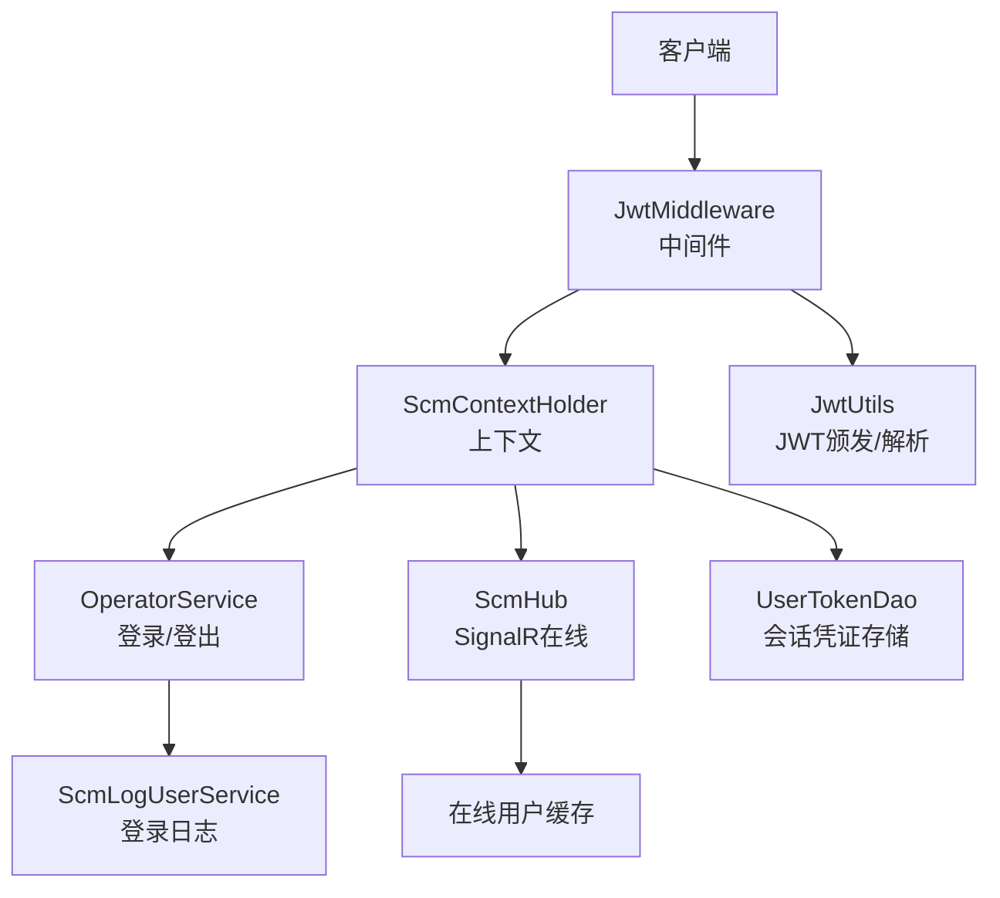
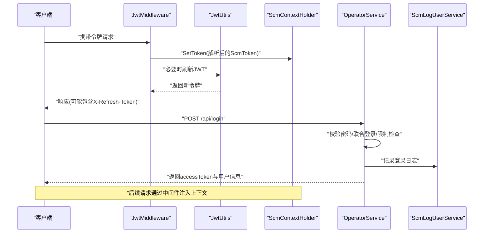
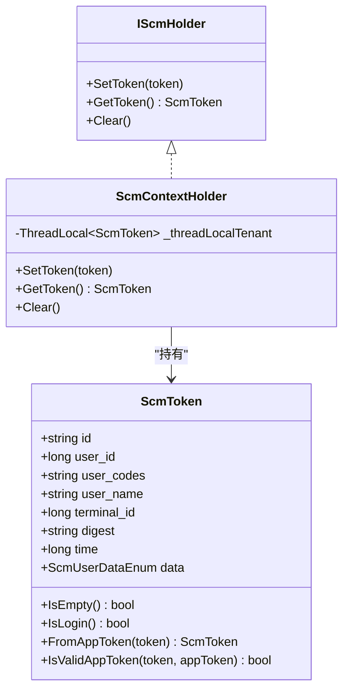
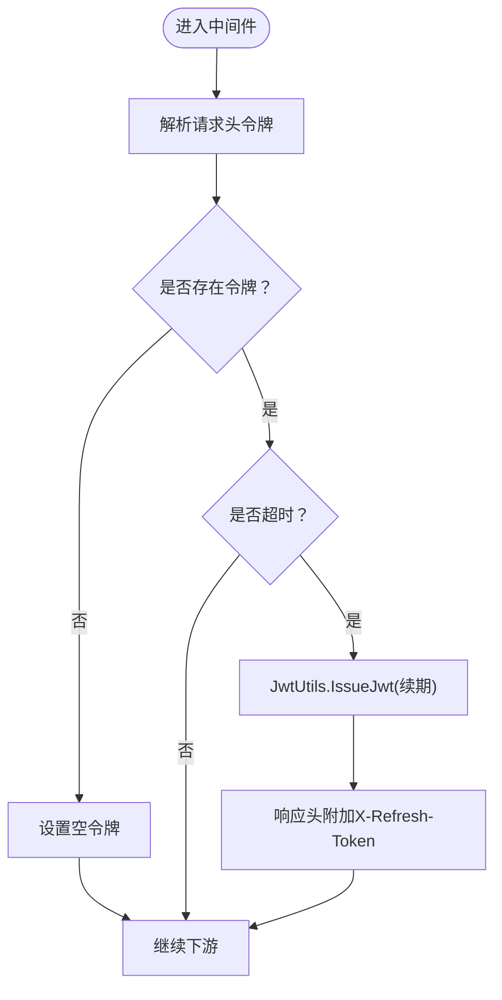
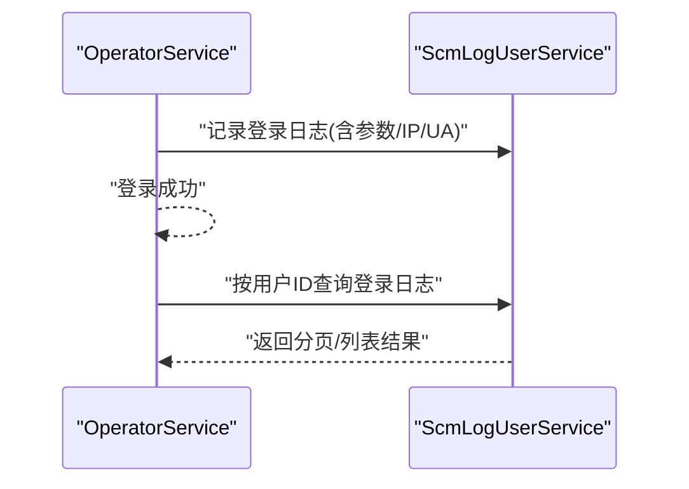
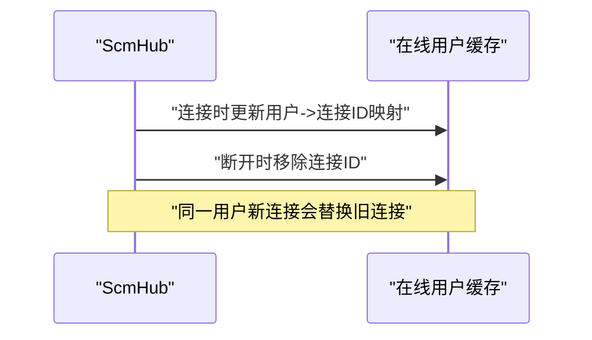
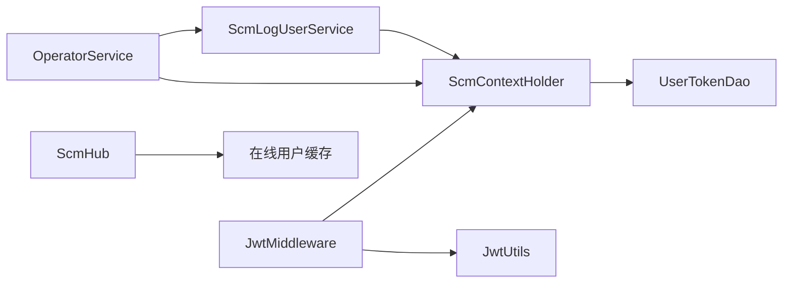
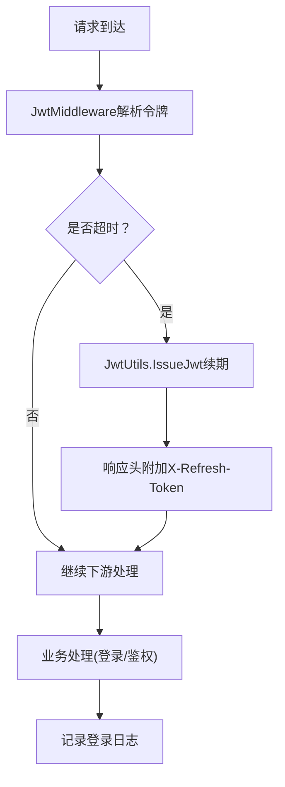

# 会话管理

<cite>
**本文引用的文件**
- [ScmContextHolder.cs](file://Scm.Server/Token/ScmContextHolder.cs)
- [IScmHolder.cs](file://Scm.Server/Token/IScmHolder.cs)
- [ScmToken.cs](file://Scm.Server/Token/ScmToken.cs)
- [JwtMiddleware.cs](file://Scm.Core/Configure/Middleware/JwtMiddleware.cs)
- [JwtUtils.cs](file://Scm.Server/Utils/JwtUtils.cs)
- [OperatorService.cs](file://Scm.Core/Operator/OperatorService.cs)
- [ScmLogUserService.cs](file://Scm.Core/Log/User/ScmLogUserService.cs)
- [UserTokenDao.cs](file://Scm.Dao/Ur/UserTokenDao.cs)
- [ScmHub.cs](file://Scm.Server.SignalR/Hubs/ScmHub.cs)
- [ClientUser.cs](file://Scm.Server.SignalR/Hubs/ClientUser.cs)
- [HbController.cs](file://Scm.Net/Controllers/HbController.cs)
</cite>

## 目录
1. [简介](#简介)
2. [项目结构](#项目结构)
3. [核心组件](#核心组件)
4. [架构总览](#架构总览)
5. [详细组件分析](#详细组件分析)
6. [依赖关系分析](#依赖关系分析)
7. [性能考量](#性能考量)
8. [故障排除指南](#故障排除指南)
9. [结论](#结论)
10. [附录](#附录)

## 简介
本文件围绕 Scm.Net 的会话管理能力，系统化阐述用户会话生命周期、上下文传递、登录日志与安全策略，并给出并发会话控制、会话清理与性能优化建议。重点覆盖以下方面：
- 会话生命周期：登录态建立、会话刷新与超时处理、并发会话控制
- 上下文管理：ScmContextHolder 的线程本地存储、跨请求数据传递
- 登录日志：登录行为追踪、异常登录检测、安全审计
- 安全策略：会话固定防护、并发登录限制、强制下线机制
- 会话状态查询、清理与性能优化
- 最佳实践与故障排除

## 项目结构
Scm.Net 的会话管理涉及多层协作：
- 中间件层：JwtMiddleware 负责在请求进入时解析与注入会话令牌到上下文
- 工具层：JwtUtils 提供 JWT 颁发与反序列化
- 业务层：OperatorService 处理登录、登出与登录日志
- 上下文层：ScmContextHolder 以线程本地存储承载当前用户会话
- 日志层：ScmLogUserService 提供登录日志查询
- 并发与在线：ScmHub 与 ClientUser 维护在线用户连接映射
- 会话持久化：UserTokenDao 存储终端授权与会话凭证

图表来源
- [JwtMiddleware.cs:42-97](file://Scm.Core/Configure/Middleware/JwtMiddleware.cs#L42-L97)
- [ScmContextHolder.cs:6-45](file://Scm.Server/Token/ScmContextHolder.cs#L6-L45)
- [OperatorService.cs:142-200](file://Scm.Core/Operator/OperatorService.cs#L142-L200)
- [ScmLogUserService.cs:39-72](file://Scm.Core/Log/User/ScmLogUserService.cs#L39-L72)
- [ScmHub.cs:39-76](file://Scm.Server.SignalR/Hubs/ScmHub.cs#L39-L76)
- [UserTokenDao.cs:11-52](file://Scm.Dao/Ur/UserTokenDao.cs#L11-L52)
- [JwtUtils.cs:13-39](file://Scm.Server/Utils/JwtUtils.cs#L13-L39)

章节来源
- [JwtMiddleware.cs:1-180](file://Scm.Core/Configure/Middleware/JwtMiddleware.cs#L1-L180)
- [ScmContextHolder.cs:1-45](file://Scm.Server/Token/ScmContextHolder.cs#L1-L45)
- [ScmToken.cs:1-99](file://Scm.Server/Token/ScmToken.cs#L1-L99)
- [JwtUtils.cs:1-88](file://Scm.Server/Utils/JwtUtils.cs#L1-L88)
- [OperatorService.cs:142-200](file://Scm.Core/Operator/OperatorService.cs#L142-L200)
- [ScmLogUserService.cs:1-137](file://Scm.Core/Log/User/ScmLogUserService.cs#L1-L137)
- [UserTokenDao.cs:1-52](file://Scm.Dao/Ur/UserTokenDao.cs#L1-L52)
- [ScmHub.cs:39-76](file://Scm.Server.SignalR/Hubs/ScmHub.cs#L39-L76)
- [ClientUser.cs:1-38](file://Scm.Server.SignalR/Hubs/ClientUser.cs#L1-L38)

## 核心组件
- ScmToken：会话载体，包含用户标识、终端信息、摘要、时间戳与数据权限等字段，提供令牌解析与校验方法
- ScmContextHolder：线程本地上下文，负责设置、获取与清理当前请求的会话令牌
- JwtMiddleware：请求拦截器，解析请求头中的令牌，注入上下文，并处理会话刷新
- JwtUtils：JWT 颁发与反序列化工具，用于生成与解析会话令牌
- OperatorService：登录入口，完成认证、计数与登录日志记录
- ScmLogUserService：登录日志查询服务，基于上下文用户ID过滤
- UserTokenDao：会话凭证持久化模型，支持授权类型、凭证、刷新凭证与过期时间
- ScmHub/ClientUser：SignalR 在线用户映射，支持同一用户多连接替换与强制下线

章节来源
- [ScmToken.cs:8-99](file://Scm.Server/Token/ScmToken.cs#L8-L99)
- [ScmContextHolder.cs:6-45](file://Scm.Server/Token/ScmContextHolder.cs#L6-L45)
- [IScmHolder.cs:1-11](file://Scm.Server/Token/IScmHolder.cs#L1-L11)
- [JwtMiddleware.cs:106-178](file://Scm.Core/Configure/Middleware/JwtMiddleware.cs#L106-L178)
- [JwtUtils.cs:13-88](file://Scm.Server/Utils/JwtUtils.cs#L13-L88)
- [OperatorService.cs:142-200](file://Scm.Core/Operator/OperatorService.cs#L142-L200)
- [ScmLogUserService.cs:39-72](file://Scm.Core/Log/User/ScmLogUserService.cs#L39-L72)
- [UserTokenDao.cs:11-52](file://Scm.Dao/Ur/UserTokenDao.cs#L11-L52)
- [ScmHub.cs:39-76](file://Scm.Server.SignalR/Hubs/ScmHub.cs#L39-L76)
- [ClientUser.cs:6-38](file://Scm.Server.SignalR/Hubs/ClientUser.cs#L6-L38)

## 架构总览
下图展示一次典型登录流程与会话生命周期的关键交互。

图表来源
- [JwtMiddleware.cs:106-138](file://Scm.Core/Configure/Middleware/JwtMiddleware.cs#L106-L138)
- [JwtUtils.cs:13-39](file://Scm.Server/Utils/JwtUtils.cs#L13-L39)
- [ScmContextHolder.cs:17-36](file://Scm.Server/Token/ScmContextHolder.cs#L17-L36)
- [OperatorService.cs:176-196](file://Scm.Core/Operator/OperatorService.cs#L176-L196)
- [ScmLogUserService.cs:39-72](file://Scm.Core/Log/User/ScmLogUserService.cs#L39-L72)

## 详细组件分析

### ScmContextHolder 上下文管理
- 设计要点
  - 使用线程本地存储 ThreadLocal<ScmToken> 实现父子线程数据隔离与传递
  - 提供 SetToken、GetToken、Clear 三类操作，确保请求结束时清理资源
- 生命周期
  - 请求开始：中间件解析令牌并写入上下文
  - 请求中：服务层通过上下文读取用户信息与会话状态
  - 请求结束：finally 中调用 Clear，释放线程本地资源
- 跨请求数据传递
  - 通过线程本地存储在同一线程内保持一致的会话上下文

图表来源
- [IScmHolder.cs:3-10](file://Scm.Server/Token/IScmHolder.cs#L3-L10)
- [ScmContextHolder.cs:6-45](file://Scm.Server/Token/ScmContextHolder.cs#L6-L45)
- [ScmToken.cs:8-99](file://Scm.Server/Token/ScmToken.cs#L8-L99)

章节来源
- [ScmContextHolder.cs:6-45](file://Scm.Server/Token/ScmContextHolder.cs#L6-L45)
- [IScmHolder.cs:1-11](file://Scm.Server/Token/IScmHolder.cs#L1-L11)
- [ScmToken.cs:51-59](file://Scm.Server/Token/ScmToken.cs#L51-L59)

### 会话超时与刷新机制
- 会话刷新
  - 中间件在解析到旧令牌且超过阈值时，调用 JwtUtils.IssueJwt 颁发新令牌，并通过响应头 X-Refresh-Token 返回
- 会话超时
  - 通过 ScmToken.time 与当前时间差判断是否需要刷新
- 安全性
  - 刷新过程不改变用户主体，仅延长有效时间

图表来源
- [JwtMiddleware.cs:106-138](file://Scm.Core/Configure/Middleware/JwtMiddleware.cs#L106-L138)
- [JwtUtils.cs:13-39](file://Scm.Server/Utils/JwtUtils.cs#L13-L39)

章节来源
- [JwtMiddleware.cs:106-138](file://Scm.Core/Configure/Middleware/JwtMiddleware.cs#L106-L138)
- [JwtUtils.cs:13-39](file://Scm.Server/Utils/JwtUtils.cs#L13-L39)

### 登录日志与安全审计
- 登录日志采集
  - 登录成功后，服务层记录登录日志，包含用户、IP、UA、浏览器、URL、参数等
- 用户级登录日志查询
  - 基于上下文中的 user_id 进行过滤，支持分页与列表查询
- 异常登录检测
  - 登录失败时记录错误码与消息，便于后续审计与风控

图表来源
- [OperatorService.cs:176-196](file://Scm.Core/Operator/OperatorService.cs#L176-L196)
- [ScmLogUserService.cs:39-72](file://Scm.Core/Log/User/ScmLogUserService.cs#L39-L72)

章节来源
- [OperatorService.cs:176-196](file://Scm.Core/Operator/OperatorService.cs#L176-L196)
- [ScmLogUserService.cs:39-72](file://Scm.Core/Log/User/ScmLogUserService.cs#L39-L72)

### 并发会话控制与强制下线
- 在线连接管理
  - SignalR Hub 维护在线用户列表，同一用户新连接会替换旧连接
- 强制下线
  - 通过查找目标用户的连接ID并断开其 SignalR 连接实现
- 会话凭证持久化
  - UserTokenDao 支持存储授权类型、凭证、刷新凭证与过期时间，可用于服务端侧会话校验与撤销

图表来源
- [ScmHub.cs:39-76](file://Scm.Server.SignalR/Hubs/ScmHub.cs#L39-L76)
- [ClientUser.cs:6-38](file://Scm.Server.SignalR/Hubs/ClientUser.cs#L6-L38)

章节来源
- [ScmHub.cs:39-76](file://Scm.Server.SignalR/Hubs/ScmHub.cs#L39-L76)
- [ClientUser.cs:6-38](file://Scm.Server.SignalR/Hubs/ClientUser.cs#L6-L38)
- [UserTokenDao.cs:11-52](file://Scm.Dao/Ur/UserTokenDao.cs#L11-L52)

### 会话状态查询与清理
- 会话状态查询
  - 通过 ScmContextHolder.GetToken() 获取当前用户会话
  - 通过 ScmLogUserService 按用户维度查询登录历史
- 会话清理
  - 中间件 finally 分支统一调用 Clear，避免线程泄漏
- 心跳与在线状态
  - HbController 记录心跳日志，辅助在线状态与异常检测

章节来源
- [ScmContextHolder.cs:26-44](file://Scm.Server/Token/ScmContextHolder.cs#L26-L44)
- [ScmLogUserService.cs:39-72](file://Scm.Core/Log/User/ScmLogUserService.cs#L39-L72)
- [JwtMiddleware.cs:93-96](file://Scm.Core/Configure/Middleware/JwtMiddleware.cs#L93-L96)
- [HbController.cs:44-82](file://Scm.Net/Controllers/HbController.cs#L44-L82)

## 依赖关系分析
- 组件耦合
  - JwtMiddleware 依赖 ScmContextHolder、JwtUtils
  - OperatorService 依赖 ScmContextHolder、日志服务
  - ScmLogUserService 依赖 ScmContextHolder、字典服务
  - ScmHub 依赖缓存与 SignalR 上下文
- 外部依赖
  - JWT 颁发与解析依赖对称密钥与配置
  - 会话持久化依赖数据库表 scm_ur_user_token

图表来源
- [JwtMiddleware.cs:60-96](file://Scm.Core/Configure/Middleware/JwtMiddleware.cs#L60-L96)
- [OperatorService.cs:68-84](file://Scm.Core/Operator/OperatorService.cs#L68-L84)
- [ScmLogUserService.cs:27-32](file://Scm.Core/Log/User/ScmLogUserService.cs#L27-L32)
- [ScmHub.cs:46-63](file://Scm.Server.SignalR/Hubs/ScmHub.cs#L46-L63)
- [UserTokenDao.cs:11-52](file://Scm.Dao/Ur/UserTokenDao.cs#L11-L52)

章节来源
- [JwtMiddleware.cs:60-96](file://Scm.Core/Configure/Middleware/JwtMiddleware.cs#L60-L96)
- [OperatorService.cs:68-84](file://Scm.Core/Operator/OperatorService.cs#L68-L84)
- [ScmLogUserService.cs:27-32](file://Scm.Core/Log/User/ScmLogUserService.cs#L27-L32)
- [ScmHub.cs:46-63](file://Scm.Server.SignalR/Hubs/ScmHub.cs#L46-L63)
- [UserTokenDao.cs:11-52](file://Scm.Dao/Ur/UserTokenDao.cs#L11-L52)

## 性能考量
- 线程本地存储
  - 使用 ThreadLocal 降低跨线程共享带来的锁竞争，但需注意 Clear 避免内存泄漏
- JWT 刷新策略
  - 适度的刷新阈值可减少频繁刷新带来的 CPU 开销；建议结合业务场景调整阈值
- 缓存在线用户
  - 在线用户列表缓存可显著降低数据库压力；建议设置合理过期策略
- 登录日志写入
  - 登录日志为高频写入，建议采用异步写入或批量入库策略

## 故障排除指南
- 无法获取用户信息
  - 检查中间件是否正确注入令牌；确认请求头是否包含令牌
- 会话频繁刷新
  - 检查 ScmToken.time 与当前时间差是否接近阈值；适当调整刷新阈值
- 并发登录未生效
  - 确认 SignalR Hub 是否正确替换旧连接；检查在线用户缓存是否更新
- 登录日志缺失
  - 确认登录成功路径是否执行日志记录；检查日志服务可用性
- 会话清理导致异常
  - 确保中间件 finally 分支调用 Clear；避免跨请求复用已清理上下文

章节来源
- [JwtMiddleware.cs:93-96](file://Scm.Core/Configure/Middleware/JwtMiddleware.cs#L93-L96)
- [ScmHub.cs:55-63](file://Scm.Server.SignalR/Hubs/ScmHub.cs#L55-L63)
- [OperatorService.cs:176-196](file://Scm.Core/Operator/OperatorService.cs#L176-L196)

## 结论
Scm.Net 的会话管理通过中间件、上下文、JWT 工具与业务服务协同，实现了从登录到会话刷新、并发控制与安全审计的完整闭环。建议在生产环境中结合业务特性进一步完善并发策略、会话持久化与日志写入性能，以获得更稳健与高效的会话体验。

## 附录
- 关键流程图（登录与刷新）

图表来源
- [JwtMiddleware.cs:106-138](file://Scm.Core/Configure/Middleware/JwtMiddleware.cs#L106-L138)
- [JwtUtils.cs:13-39](file://Scm.Server/Utils/JwtUtils.cs#L13-L39)
- [OperatorService.cs:176-196](file://Scm.Core/Operator/OperatorService.cs#L176-L196)