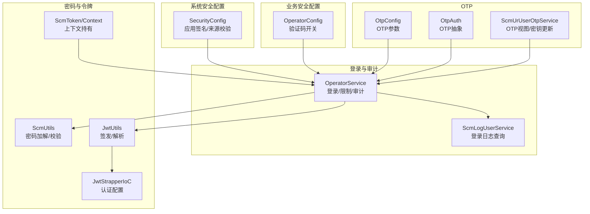
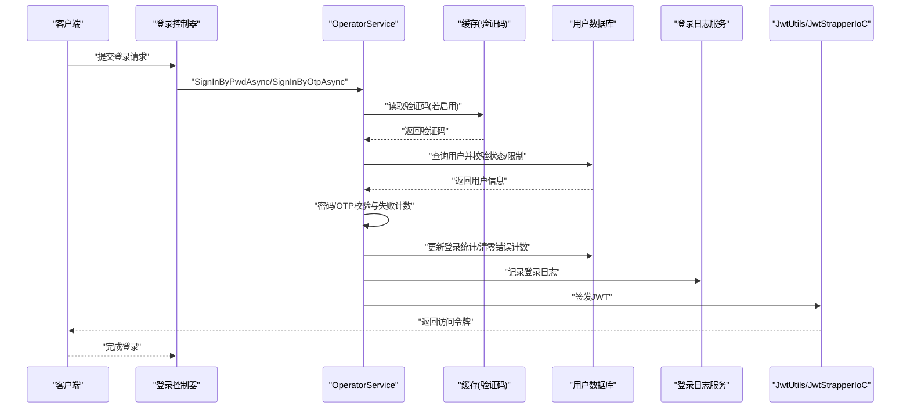
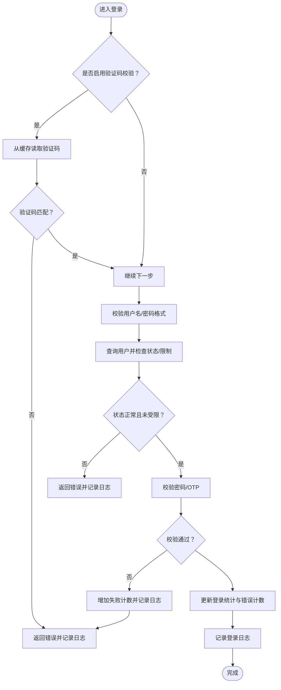
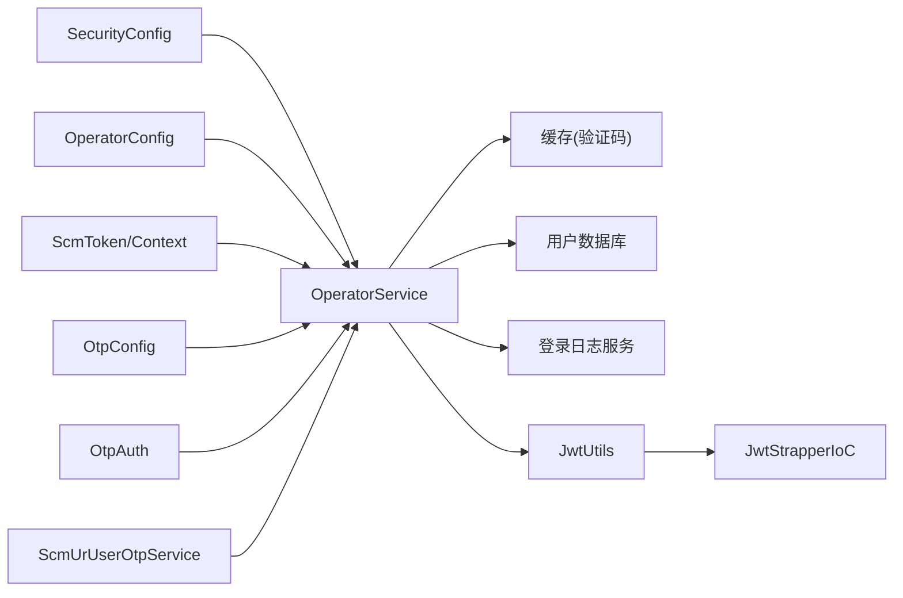

# 安全配置

<cite>
**本文引用的文件**
- [SecurityConfig.cs](file://Scm.Server/Config/SecurityConfig.cs)
- [OperatorConfig.cs](file://Scm.Core/Operator/OperatorConfig.cs)
- [OperatorService.cs](file://Scm.Core/Operator/OperatorService.cs)
- [OtpConfig.cs](file://Scm.Core/Login/Otp/OtpConfig.cs)
- [OtpAuth.cs](file://Scm.Core/Login/Otp/OtpAuth.cs)
- [ScmLogUserService.cs](file://Scm.Core/Log/User/ScmLogUserService.cs)
- [ScmUtils.cs](file://Scm.Common/Utils/ScmUtils.cs)
- [JwtUtils.cs](file://Scm.Server/Utils/JwtUtils.cs)
- [JwtStrapperIoC.cs](file://Scm.Server.Bearer/JwtStrapperIoC.cs)
- [ScmToken.cs](file://Scm.Server/Token/ScmToken.cs)
- [ScmContextHolder.cs](file://Scm.Server/Token/ScmContextHolder.cs)
- [ScmUrUserOtpService.cs](file://Scm.Core/Ur/UserOtp/ScmUrUserOtpService.cs)
</cite>

## 目录
1. [简介](#简介)
2. [项目结构](#项目结构)
3. [核心组件](#核心组件)
4. [架构总览](#架构总览)
5. [详细组件分析](#详细组件分析)
6. [依赖关系分析](#依赖关系分析)
7. [性能考量](#性能考量)
8. [故障排查指南](#故障排查指南)
9. [结论](#结论)
10. [附录](#附录)

## 简介
本技术文档聚焦 Scm.Net 的安全配置能力，围绕密码策略、验证码与一次性口令（OTP）、登录限制与账户锁定策略、以及安全审计与访问控制展开。重点解释以下两类配置对象：
- SecurityConfig：系统级安全配置（应用签名、应用来源校验等）。
- OperatorConfig：业务侧安全配置（验证码开关等）。

同时，结合登录流程、日志审计、JWT 令牌机制与 OTP 配置，给出最佳实践、防护建议、合规与监控方案，并提供可操作的配置参考与评估要点。

## 项目结构
与安全配置直接相关的关键模块分布如下：
- 系统安全配置：Scm.Server/Config/SecurityConfig.cs
- 业务安全配置：Scm.Core/Operator/OperatorConfig.cs
- 登录与安全审计：Scm.Core/Operator/OperatorService.cs、Scm.Core/Log/User/ScmLogUserService.cs
- 密码处理与验证：Scm.Common/Utils/ScmUtils.cs
- JWT 令牌签发与校验：Scm.Server/Utils/JwtUtils.cs、Scm.Server.Bearer/JwtStrapperIoC.cs、Scm.Server/Token/ScmToken.cs、Scm.Server/Token/ScmContextHolder.cs
- OTP 配置与认证：Scm.Core/Login/Otp/OtpConfig.cs、Scm.Core/Login/Otp/OtpAuth.cs、Scm.Core/Ur/UserOtp/ScmUrUserOtpService.cs

**图表来源**
- [SecurityConfig.cs:1-44](file://Scm.Server/Config/SecurityConfig.cs#L1-L44)
- [OperatorConfig.cs:1-14](file://Scm.Core/Operator/OperatorConfig.cs#L1-L14)
- [OperatorService.cs:225-302](file://Scm.Core/Operator/OperatorService.cs#L225-L302)
- [ScmLogUserService.cs:1-137](file://Scm.Core/Log/User/ScmLogUserService.cs#L1-L137)
- [ScmUtils.cs:336-376](file://Scm.Common/Utils/ScmUtils.cs#L336-L376)
- [JwtUtils.cs:11-66](file://Scm.Server/Utils/JwtUtils.cs#L11-L66)
- [JwtStrapperIoC.cs:11-35](file://Scm.Server.Bearer/JwtStrapperIoC.cs#L11-L35)
- [ScmToken.cs:52-99](file://Scm.Server/Token/ScmToken.cs#L52-L99)
- [OtpConfig.cs:10-57](file://Scm.Core/Login/Otp/OtpConfig.cs#L10-L57)
- [OtpAuth.cs:9-90](file://Scm.Core/Login/Otp/OtpAuth.cs#L9-L90)
- [ScmUrUserOtpService.cs:42-117](file://Scm.Core/Ur/UserOtp/ScmUrUserOtpService.cs#L42-L117)

**章节来源**
- [SecurityConfig.cs:1-44](file://Scm.Server/Config/SecurityConfig.cs#L1-L44)
- [OperatorConfig.cs:1-14](file://Scm.Core/Operator/OperatorConfig.cs#L1-L14)
- [OperatorService.cs:225-302](file://Scm.Core/Operator/OperatorService.cs#L225-L302)
- [ScmLogUserService.cs:1-137](file://Scm.Core/Log/User/ScmLogUserService.cs#L1-L137)
- [ScmUtils.cs:336-376](file://Scm.Common/Utils/ScmUtils.cs#L336-L376)
- [JwtUtils.cs:11-66](file://Scm.Server/Utils/JwtUtils.cs#L11-L66)
- [JwtStrapperIoC.cs:11-35](file://Scm.Server.Bearer/JwtStrapperIoC.cs#L11-L35)
- [ScmToken.cs:52-99](file://Scm.Server/Token/ScmToken.cs#L52-L99)
- [OtpConfig.cs:10-57](file://Scm.Core/Login/Otp/OtpConfig.cs#L10-L57)
- [OtpAuth.cs:9-90](file://Scm.Core/Login/Otp/OtpAuth.cs#L9-L90)
- [ScmUrUserOtpService.cs:42-117](file://Scm.Core/Ur/UserOtp/ScmUrUserOtpService.cs#L42-L117)

## 核心组件
- SecurityConfig：系统级安全参数（应用签名、来源校验等），用于约束调用方与请求合法性。
- OperatorConfig：业务侧安全参数（如验证码开关），影响登录流程的用户体验与安全强度。
- OperatorService：登录入口，负责验证码校验、密码校验、账户状态与登录限制检查、失败计数与锁定逻辑、登录成功后的统计与审计记录。
- ScmLogUserService：登录日志查询与展示，支撑安全审计。
- ScmUtils：密码加解与格式化，保障密码存储与传输安全。
- JwtUtils/JwtStrapperIoC/ScmToken/ScmContextHolder：JWT 签发、验证与上下文传递，确保会话安全与跨线程数据隔离。
- OtpConfig/OtpAuth/ScmUrUserOtpService：一次性口令配置与认证流程，支持 TOTP/HOTP 与多通道推送。

**章节来源**
- [SecurityConfig.cs:5-42](file://Scm.Server/Config/SecurityConfig.cs#L5-L42)
- [OperatorConfig.cs:6-12](file://Scm.Core/Operator/OperatorConfig.cs#L6-L12)
- [OperatorService.cs:225-302](file://Scm.Core/Operator/OperatorService.cs#L225-L302)
- [ScmLogUserService.cs:39-123](file://Scm.Core/Log/User/ScmLogUserService.cs#L39-L123)
- [ScmUtils.cs:336-376](file://Scm.Common/Utils/ScmUtils.cs#L336-L376)
- [JwtUtils.cs:13-39](file://Scm.Server/Utils/JwtUtils.cs#L13-L39)
- [JwtStrapperIoC.cs:13-35](file://Scm.Server.Bearer/JwtStrapperIoC.cs#L13-L35)
- [ScmToken.cs:52-99](file://Scm.Server/Token/ScmToken.cs#L52-L99)
- [OtpConfig.cs:10-57](file://Scm.Core/Login/Otp/OtpConfig.cs#L10-L57)
- [OtpAuth.cs:9-90](file://Scm.Core/Login/Otp/OtpAuth.cs#L9-L90)
- [ScmUrUserOtpService.cs:42-117](file://Scm.Core/Ur/UserOtp/ScmUrUserOtpService.cs#L42-L117)

## 架构总览
下图展示了登录与安全配置在系统中的交互关系：

**图表来源**
- [OperatorService.cs:225-302](file://Scm.Core/Operator/OperatorService.cs#L225-L302)
- [OperatorService.cs:310-385](file://Scm.Core/Operator/OperatorService.cs#L310-L385)
- [ScmLogUserService.cs:39-123](file://Scm.Core/Log/User/ScmLogUserService.cs#L39-L123)
- [JwtUtils.cs:13-39](file://Scm.Server/Utils/JwtUtils.cs#L13-L39)
- [JwtStrapperIoC.cs:13-35](file://Scm.Server.Bearer/JwtStrapperIoC.cs#L13-L35)

## 详细组件分析

### SecurityConfig 安全配置
- 角色定位：系统级安全参数，用于约束调用方与请求合法性（如签名、来源校验等）。
- 关键字段与职责：
  - AppKey：应用编号，用于标识调用方。
  - AesKey/DesKey/SignKey：预留的加密与签名参数，当前未启用。
  - CheckSignature：是否强制校验签名。
  - CheckApp：是否限制来源应用。
- 使用场景：在网关或中间层对请求进行来源与签名校验，防止伪造调用。

最佳实践
- 在生产环境开启 CheckSignature 与 CheckApp，确保请求来源可信。
- 对 AesKey/DesKey/SignKey 进行严格的密钥管理与轮换。

**章节来源**
- [SecurityConfig.cs:5-42](file://Scm.Server/Config/SecurityConfig.cs#L5-L42)

### OperatorConfig 业务安全配置
- 角色定位：业务侧安全参数，影响登录流程的安全强度与体验。
- 关键字段与职责：
  - IgnoreCaptcha：是否忽略验证码校验。默认关闭时，登录需校验验证码；开启后跳过验证码。
- 使用场景：在测试环境或特殊业务场景下临时放宽验证码要求，但不建议长期开启。

最佳实践
- 默认保持 IgnoreCaptcha 为 false，确保登录入口具备基础防暴力破解能力。
- 通过配置中心动态调整该参数，避免频繁修改代码。

**章节来源**
- [OperatorConfig.cs:6-12](file://Scm.Core/Operator/OperatorConfig.cs#L6-L12)
- [OperatorService.cs:225-237](file://Scm.Core/Operator/OperatorService.cs#L225-L237)

### 登录流程与安全控制（OperatorService）
- 验证码校验：当未开启忽略验证码时，从缓存中读取并比对验证码。
- 用户与密码校验：校验用户名与密码格式，查询用户并检查账户状态与登录限制。
- 登录限制与锁定：next_time 限制登录时间窗口；失败计数与错误处理触发临时锁定。
- 成功登录：更新登录次数、时间戳与错误计数，记录登录日志。
- 失败处理：记录失败原因与日志，便于审计与风控。

**图表来源**
- [OperatorService.cs:225-302](file://Scm.Core/Operator/OperatorService.cs#L225-L302)
- [OperatorService.cs:310-385](file://Scm.Core/Operator/OperatorService.cs#L310-L385)
- [OperatorService.cs:205-217](file://Scm.Core/Operator/OperatorService.cs#L205-L217)

**章节来源**
- [OperatorService.cs:225-302](file://Scm.Core/Operator/OperatorService.cs#L225-L302)
- [OperatorService.cs:310-385](file://Scm.Core/Operator/OperatorService.cs#L310-L385)
- [OperatorService.cs:205-217](file://Scm.Core/Operator/OperatorService.cs#L205-L217)

### 密码策略与存储（ScmUtils）
- 密码加扰与解扰：对存储的密码进行加扰编码与解码，隐藏真实长度与内容特征，降低字典攻击与统计分析风险。
- 建议：结合服务端 SHA-256 与时间戳拼接的校验方式，确保传输与校验过程不可逆且带有时序性。

最佳实践
- 存储密码采用不可逆哈希与加扰混合策略，传输层必须启用 TLS。
- 定期轮换哈希算法与盐值策略，配合服务端版本升级。

**章节来源**
- [ScmUtils.cs:336-376](file://Scm.Common/Utils/ScmUtils.cs#L336-L376)

### JWT 令牌与会话安全（JwtUtils/JwtStrapperIoC/ScmToken/ScmContextHolder）
- 签发：基于对称密钥签发，设置签发者、受众、过期时间等声明。
- 校验：在认证中间件中配置签名校验、受众与发行者校验、生命周期校验。
- 上下文：通过线程本地存储在请求生命周期内传递令牌上下文，避免跨线程污染。

最佳实践
- 使用强随机密钥并定期轮换；严格设置过期时间与刷新策略。
- 在网关层统一拦截与校验，避免重复实现。

**章节来源**
- [JwtUtils.cs:13-39](file://Scm.Server/Utils/JwtUtils.cs#L13-L39)
- [JwtUtils.cs:46-66](file://Scm.Server/Utils/JwtUtils.cs#L46-L66)
- [JwtStrapperIoC.cs:13-35](file://Scm.Server.Bearer/JwtStrapperIoC.cs#L13-L35)
- [ScmToken.cs:52-99](file://Scm.Server/Token/ScmToken.cs#L52-L99)
- [ScmContextHolder.cs:6-45](file://Scm.Server/Token/ScmContextHolder.cs#L6-L45)

### OTP 配置与认证（OtpConfig/OtpAuth/ScmUrUserOtpService）
- OtpConfig：定义 OTP 数字位数、类型（TOTP/HOTP）、以及各渠道配置（手机/邮箱）。
- OtpAuth：抽象 OTP 生成、验证与更新接口，具体实现由不同渠道驱动。
- ScmUrUserOtpService：生成 OTP URI、显示密钥与状态，支持用户主动更新密钥。

最佳实践
- 默认数字位数建议为 6~8 位，结合 TOTP 时间步长与算法选择。
- 为用户提供密钥导出与迁移能力，降低绑定风险。

**章节来源**
- [OtpConfig.cs:10-57](file://Scm.Core/Login/Otp/OtpConfig.cs#L10-L57)
- [OtpAuth.cs:9-90](file://Scm.Core/Login/Otp/OtpAuth.cs#L9-L90)
- [ScmUrUserOtpService.cs:42-117](file://Scm.Core/Ur/UserOtp/ScmUrUserOtpService.cs#L42-L117)

### 安全日志与审计（ScmLogUserService）
- 功能：按用户维度查询登录日志，支持日期范围筛选与分页。
- 数据：包含客户端类型、登录模式、结果、备注等，便于审计与追踪。

最佳实践
- 日志保留周期与归档策略应满足合规要求。
- 结合告警规则对异常登录（如短时间内多次失败）进行实时告警。

**章节来源**
- [ScmLogUserService.cs:39-123](file://Scm.Core/Log/User/ScmLogUserService.cs#L39-L123)

## 依赖关系分析
- SecurityConfig 与 OperatorConfig 分别位于系统与业务层，前者约束外部调用，后者控制内部登录行为。
- OperatorService 依赖缓存（验证码）、用户数据库、日志服务与 JWT 工具链，形成闭环的安全控制。
- OTP 配置与认证独立于登录流程，可作为增强手段提升安全性。
- JWT 中间件负责全局认证拦截，ScmContextHolder 提供线程安全的上下文访问。

**图表来源**
- [SecurityConfig.cs:5-42](file://Scm.Server/Config/SecurityConfig.cs#L5-L42)
- [OperatorConfig.cs:6-12](file://Scm.Core/Operator/OperatorConfig.cs#L6-L12)
- [OperatorService.cs:225-302](file://Scm.Core/Operator/OperatorService.cs#L225-L302)
- [JwtUtils.cs:13-39](file://Scm.Server/Utils/JwtUtils.cs#L13-L39)
- [JwtStrapperIoC.cs:13-35](file://Scm.Server.Bearer/JwtStrapperIoC.cs#L13-L35)
- [ScmToken.cs:52-99](file://Scm.Server/Token/ScmToken.cs#L52-L99)
- [OtpConfig.cs:10-57](file://Scm.Core/Login/Otp/OtpConfig.cs#L10-L57)
- [OtpAuth.cs:9-90](file://Scm.Core/Login/Otp/OtpAuth.cs#L9-L90)
- [ScmUrUserOtpService.cs:42-117](file://Scm.Core/Ur/UserOtp/ScmUrUserOtpService.cs#L42-L117)

**章节来源**
- [OperatorService.cs:225-302](file://Scm.Core/Operator/OperatorService.cs#L225-L302)
- [JwtStrapperIoC.cs:13-35](file://Scm.Server.Bearer/JwtStrapperIoC.cs#L13-L35)
- [ScmUrUserOtpService.cs:42-117](file://Scm.Core/Ur/UserOtp/ScmUrUserOtpService.cs#L42-L117)

## 性能考量
- 缓存命中率：验证码与会话缓存的命中直接影响登录延迟，建议合理设置过期与淘汰策略。
- 数据库查询：登录校验涉及单点查询与更新，建议对 codec 与状态字段建立索引，减少锁竞争。
- JWT 签发与校验：对称密钥计算开销较小，但需注意并发下的密钥轮换与缓存一致性。
- OTP 生成：TOTP/HOTP 依赖时间步长，建议统一时间源与步长，避免漂移导致的失败。

## 故障排查指南
常见问题与定位步骤
- 验证码错误
  - 确认验证码缓存键前缀与读取逻辑一致。
  - 检查验证码有效期与清理策略。
  - 参考：[OperatorService.cs:225-237](file://Scm.Core/Operator/OperatorService.cs#L225-L237)
- 密码错误/格式非法
  - 校验密码格式与加扰解扰流程。
  - 参考：[ScmUtils.cs:336-376](file://Scm.Common/Utils/ScmUtils.cs#L336-L376)
- 账户被冻结/登录受限
  - 检查用户状态与 next_time 限制。
  - 参考：[OperatorService.cs:262-280](file://Scm.Core/Operator/OperatorService.cs#L262-L280)
- JWT 校验失败
  - 检查签发者、受众、密钥与过期时间配置。
  - 参考：[JwtStrapperIoC.cs:13-35](file://Scm.Server.Bearer/JwtStrapperIoC.cs#L13-L35)，[JwtUtils.cs:46-66](file://Scm.Server/Utils/JwtUtils.cs#L46-L66)
- OTP 生成/验证失败
  - 检查 OTP 数字位数、算法与模板参数。
  - 参考：[OtpConfig.cs:10-57](file://Scm.Core/Login/Otp/OtpConfig.cs#L10-L57)，[ScmUrUserOtpService.cs:87-117](file://Scm.Core/Ur/UserOtp/ScmUrUserOtpService.cs#L87-L117)

**章节来源**
- [OperatorService.cs:225-237](file://Scm.Core/Operator/OperatorService.cs#L225-L237)
- [OperatorService.cs:262-280](file://Scm.Core/Operator/OperatorService.cs#L262-L280)
- [ScmUtils.cs:336-376](file://Scm.Common/Utils/ScmUtils.cs#L336-L376)
- [JwtStrapperIoC.cs:13-35](file://Scm.Server.Bearer/JwtStrapperIoC.cs#L13-L35)
- [JwtUtils.cs:46-66](file://Scm.Server/Utils/JwtUtils.cs#L46-L66)
- [OtpConfig.cs:10-57](file://Scm.Core/Login/Otp/OtpConfig.cs#L10-L57)
- [ScmUrUserOtpService.cs:87-117](file://Scm.Core/Ur/UserOtp/ScmUrUserOtpService.cs#L87-L117)

## 结论
Scm.Net 的安全配置以“系统级约束 + 业务级开关 + 流程内控 + 审计留痕”为核心设计，既保证了登录入口的可控性，又提供了灵活的扩展空间（如 OTP）。建议在生产环境中：
- 开启验证码与来源校验；
- 强化密码存储与传输安全；
- 合理设置 JWT 过期与刷新策略；
- 建立完善的日志审计与告警体系；
- 将 OTP 作为多因子增强手段推广使用。

## 附录

### 配置项速览与建议
- SecurityConfig
  - AppKey：必填，用于标识调用方。
  - CheckSignature/CheckApp：建议开启，强化来源与签名校验。
- OperatorConfig
  - IgnoreCaptcha：默认 false，不建议长期开启。
- OtpConfig
  - Digits：建议 6~8 位；Type：TOTP/HOTP；Phone/Email：按需启用。
- JwtConfig（间接相关）
  - Issuer/Audience/Security/Expires：严格配置，定期轮换密钥。

**章节来源**
- [SecurityConfig.cs:5-42](file://Scm.Server/Config/SecurityConfig.cs#L5-L42)
- [OperatorConfig.cs:6-12](file://Scm.Core/Operator/OperatorConfig.cs#L6-L12)
- [OtpConfig.cs:10-57](file://Scm.Core/Login/Otp/OtpConfig.cs#L10-L57)
- [JwtStrapperIoC.cs:13-35](file://Scm.Server.Bearer/JwtStrapperIoC.cs#L13-L35)