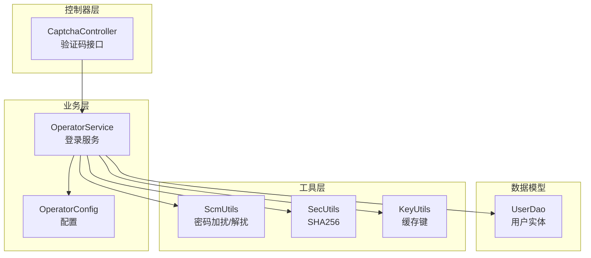
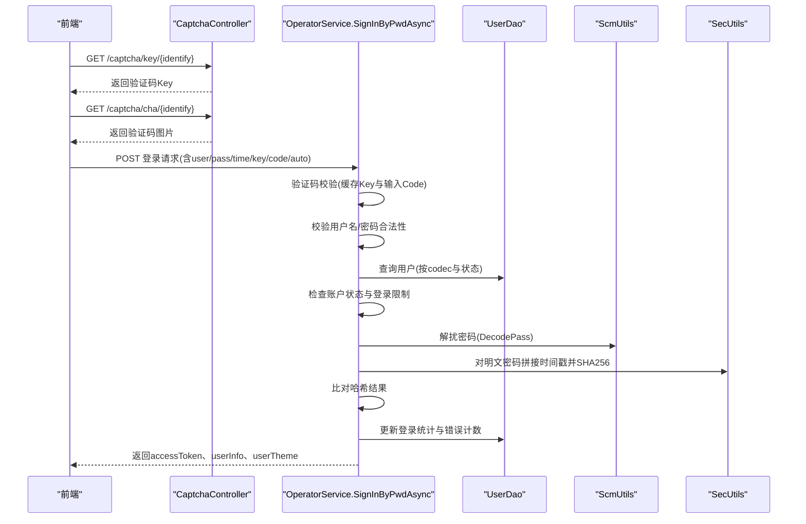
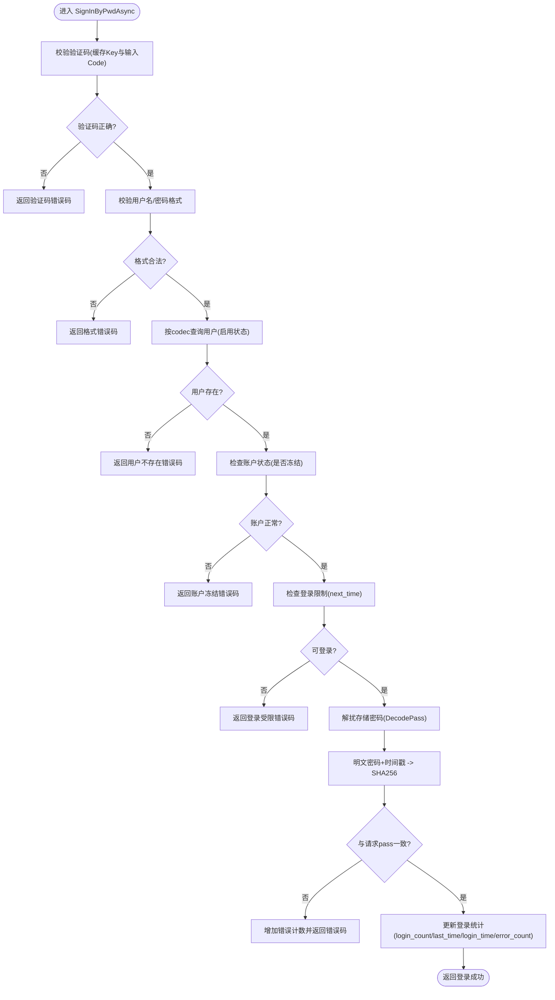
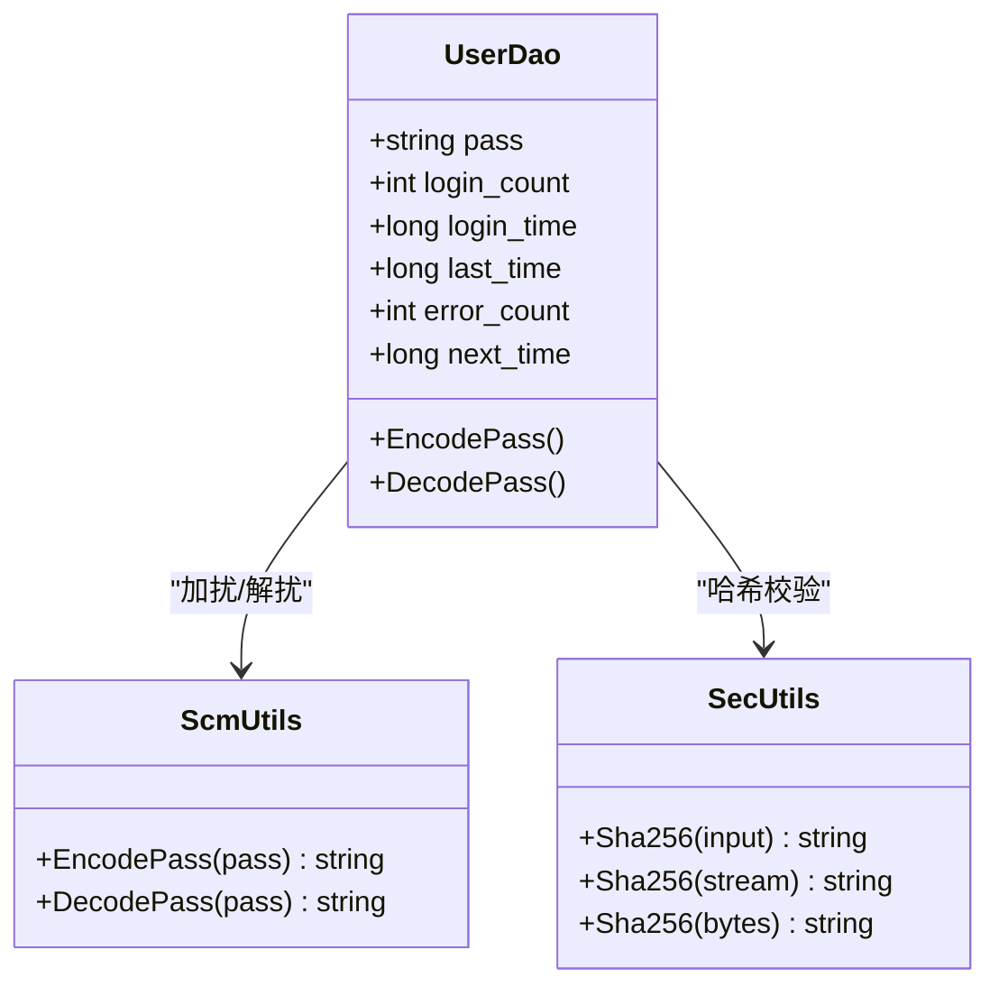
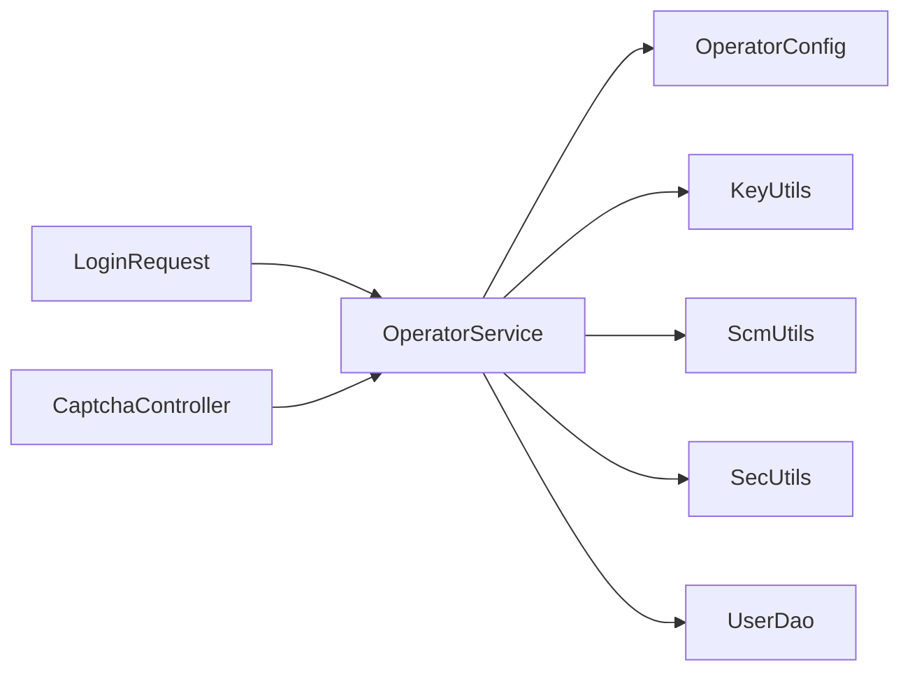

# 密码认证

<cite>
**本文引用的文件**
- [Scm.Net\Controllers\CaptchaController.cs](file://Scm.Net\Controllers\CaptchaController.cs)
- [Scm.Core\Operator\OperatorService.cs](file://Scm.Core\Operator\OperatorService.cs)
- [Scm.Core\Operator\OperatorConfig.cs](file://Scm.Core\Operator\OperatorConfig.cs)
- [Scm.Core\Operator\Dvo\LoginRequest.cs](file://Scm.Core\Operator\Dvo\LoginRequest.cs)
- [Scm.Core\Operator\Dvo\LoginResponse.cs](file://Scm.Core\Operator\Dvo\LoginResponse.cs)
- [Scm.Dao\Ur\UserDao.cs](file://Scm.Dao\Ur\UserDao.cs)
- [Scm.Common\Utils\ScmUtils.cs](file://Scm.Common\Utils\ScmUtils.cs)
- [Scm.Common\Utils\SecUtils.cs](file://Scm.Common\Utils\SecUtils.cs)
- [Scm.Common\Utils\KeyUtils.cs](file://Scm.Common\Utils\KeyUtils.cs)
</cite>

## 目录
1. [简介](#简介)
2. [项目结构](#项目结构)
3. [核心组件](#核心组件)
4. [架构总览](#架构总览)
5. [详细组件分析](#详细组件分析)
6. [依赖关系分析](#依赖关系分析)
7. [性能考量](#性能考量)
8. [故障排除指南](#故障排除指南)
9. [结论](#结论)
10. [附录](#附录)

## 简介
本技术文档聚焦 Scm.Net 的“密码认证”能力，围绕 SignInByPwdAsync 方法的实现机制进行深入解析，涵盖用户验证流程、密码加密与校验、验证码与登录限制等安全控制点，并给出完整的 API 接口定义、错误码说明、最佳实践与集成示例。

## 项目结构
与密码认证直接相关的关键模块如下：
- 控制器层：验证码生成与获取接口，用于前端展示与校验。
- 业务层：OperatorService 提供统一登录入口，内部根据登录模式分派到不同登录策略，其中 SignInByPwdAsync 即为“口令登录”的核心实现。
- 数据模型：UserDao 描述用户实体及登录相关字段（如密码、登录计数、错误计数、下次可登录时间等）。
- 工具层：ScmUtils 提供密码加扰/解扰逻辑；SecUtils 提供 SHA256 哈希工具；KeyUtils 提供缓存键常量（验证码键前缀）；OperatorConfig 提供配置项（是否忽略验证码）。

**图表来源**
- [Scm.Net\Controllers\CaptchaController.cs:14-58](file://Scm.Net\Controllers\CaptchaController.cs#L14-L58)
- [Scm.Core\Operator\OperatorService.cs:226-302](file://Scm.Core\Operator\OperatorService.cs#L226-L302)
- [Scm.Core\Operator\OperatorConfig.cs:6-12](file://Scm.Core\Operator\OperatorConfig.cs#L6-L12)
- [Scm.Dao\Ur\UserDao.cs:14-144](file://Scm.Dao\Ur\UserDao.cs#L14-L144)
- [Scm.Common\Utils\ScmUtils.cs:330-377](file://Scm.Common\Utils\ScmUtils.cs#L330-L377)
- [Scm.Common\Utils\SecUtils.cs:124-143](file://Scm.Common\Utils\SecUtils.cs#L124-L143)
- [Scm.Common\Utils\KeyUtils.cs:46-46](file://Scm.Common\Utils\KeyUtils.cs#L46-L46)

**章节来源**
- [Scm.Net\Controllers\CaptchaController.cs:14-58](file://Scm.Net\Controllers\CaptchaController.cs#L14-L58)
- [Scm.Core\Operator\OperatorService.cs:226-302](file://Scm.Core\Operator\OperatorService.cs#L226-L302)
- [Scm.Core\Operator\OperatorConfig.cs:6-12](file://Scm.Core\Operator\OperatorConfig.cs#L6-L12)
- [Scm.Dao\Ur\UserDao.cs:14-144](file://Scm.Dao\Ur\UserDao.cs#L14-L144)
- [Scm.Common\Utils\ScmUtils.cs:330-377](file://Scm.Common\Utils\ScmUtils.cs#L330-L377)
- [Scm.Common\Utils\SecUtils.cs:124-143](file://Scm.Common\Utils\SecUtils.cs#L124-L143)
- [Scm.Common\Utils\KeyUtils.cs:46-46](file://Scm.Common\Utils\KeyUtils.cs#L46-L46)

## 核心组件
- SignInByPwdAsync：口令登录的核心实现，负责验证码校验、用户名/密码合法性校验、用户状态与登录限制检查、密码哈希比对、登录统计更新与日志记录。
- CaptchaController：提供验证码图片生成与验证码 Key 获取接口，配合验证码缓存完成图形验证码校验。
- UserDao：承载用户实体与登录相关字段，包含密码加扰/解扰方法、登录计数与错误计数、下次可登录时间等。
- ScmUtils：提供密码加扰/解扰逻辑，用于在存储与传输之间对密码进行加扰处理。
- SecUtils：提供 SHA256 哈希计算工具，用于密码哈希与校验。
- KeyUtils：提供验证码缓存键前缀常量。
- OperatorConfig：提供是否忽略验证码的配置开关。

**章节来源**
- [Scm.Core\Operator\OperatorService.cs:226-302](file://Scm.Core\Operator\OperatorService.cs#L226-L302)
- [Scm.Net\Controllers\CaptchaController.cs:28-56](file://Scm.Net\Controllers\CaptchaController.cs#L28-L56)
- [Scm.Dao\Ur\UserDao.cs:224-240](file://Scm.Dao\Ur\UserDao.cs#L224-L240)
- [Scm.Common\Utils\ScmUtils.cs:330-377](file://Scm.Common\Utils\ScmUtils.cs#L330-L377)
- [Scm.Common\Utils\SecUtils.cs:124-143](file://Scm.Common\Utils\SecUtils.cs#L124-L143)
- [Scm.Common\Utils\KeyUtils.cs:46-46](file://Scm.Common\Utils\KeyUtils.cs#L46-L46)
- [Scm.Core\Operator\OperatorConfig.cs:6-12](file://Scm.Core\Operator\OperatorConfig.cs#L6-L12)

## 架构总览
下图展示了“密码认证”的端到端调用链路：前端通过 CaptchaController 获取验证码 Key 与验证码图片，随后携带 user、pass、time、key、code、auto 等参数调用登录接口，业务层在 SignInByPwdAsync 中执行安全检查与密码校验，最终返回登录结果与用户信息。

**图表来源**
- [Scm.Net\Controllers\CaptchaController.cs:28-56](file://Scm.Net\Controllers\CaptchaController.cs#L28-L56)
- [Scm.Core\Operator\OperatorService.cs:226-302](file://Scm.Core\Operator\OperatorService.cs#L226-L302)
- [Scm.Dao\Ur\UserDao.cs:224-240](file://Scm.Dao\Ur\UserDao.cs#L224-L240)
- [Scm.Common\Utils\ScmUtils.cs:354-373](file://Scm.Common\Utils\ScmUtils.cs#L354-L373)
- [Scm.Common\Utils\SecUtils.cs:124-143](file://Scm.Common\Utils\SecUtils.cs#L124-L143)

## 详细组件分析

### SignInByPwdAsync 实现机制
- 验证码校验
  - 若未配置忽略验证码，则从缓存中取出验证码值并与请求中的 code 进行不区分大小写的比较，失败则返回错误码。
  - 验证码缓存键由 KeyUtils.CAPTCHACODE 前缀与请求 key 组成，有效期通常为 300 秒。
- 用户名/密码合法性校验
  - 校验 user 与 pass 的格式合法性，不符合则返回相应错误码。
- 用户查询与状态检查
  - 按 codec 与启用状态查询用户；若不存在，返回错误码。
  - 检查用户是否被冻结；若冻结，返回错误码并记录日志。
- 登录限制检查
  - 比较用户 next_time 与当前时间；若尚未到达下次可登录时间，返回错误码并记录日志。
- 密码哈希与校验
  - 使用 ScmUtils.DecodePass 将存储的加扰密码解扰为明文。
  - 将明文密码与请求中的 time 拼接后经 SecUtils.Sha256 计算哈希，与请求中的 pass 比对；不一致则增加错误计数并返回错误码。
- 登录统计更新
  - 成功登录后更新 login_count、last_time、login_time、error_count，并持久化。
- 日志记录
  - 记录登录日志与用户登录日志，便于审计与追踪。

**图表来源**
- [Scm.Core\Operator\OperatorService.cs:226-302](file://Scm.Core\Operator\OperatorService.cs#L226-L302)
- [Scm.Common\Utils\ScmUtils.cs:354-373](file://Scm.Common\Utils\ScmUtils.cs#L354-L373)
- [Scm.Common\Utils\SecUtils.cs:124-143](file://Scm.Common\Utils\SecUtils.cs#L124-L143)
- [Scm.Common\Utils\KeyUtils.cs:46-46](file://Scm.Common\Utils\KeyUtils.cs#L46-L46)

**章节来源**
- [Scm.Core\Operator\OperatorService.cs:226-302](file://Scm.Core\Operator\OperatorService.cs#L226-L302)
- [Scm.Common\Utils\ScmUtils.cs:354-373](file://Scm.Common\Utils\ScmUtils.cs#L354-L373)
- [Scm.Common\Utils\SecUtils.cs:124-143](file://Scm.Common\Utils\SecUtils.cs#L124-L143)
- [Scm.Common\Utils\KeyUtils.cs:46-46](file://Scm.Common\Utils\KeyUtils.cs#L46-L46)

### 密码哈希与加扰机制
- 存储侧加扰
  - UserDao 在需要时调用 ScmUtils.EncodePass 对密码进行加扰存储，以增强安全性。
- 校验侧解扰
  - SignInByPwdAsync 在比对前调用 ScmUtils.DecodePass 将存储的加扰密码还原为明文。
- 哈希校验
  - 明文密码与请求中的 time 拼接后，使用 SecUtils.Sha256 计算哈希，与请求中的 pass 进行严格比对。
- 注意
  - 该流程中 pass 字段本身即为 SHA256 结果，而非原始明文；因此校验采用“明文+时间戳”的二次哈希策略，提升抗重放与防篡改能力。

**图表来源**
- [Scm.Dao\Ur\UserDao.cs:224-240](file://Scm.Dao\Ur\UserDao.cs#L224-L240)
- [Scm.Common\Utils\ScmUtils.cs:330-377](file://Scm.Common\Utils\ScmUtils.cs#L330-L377)
- [Scm.Common\Utils\SecUtils.cs:124-143](file://Scm.Common\Utils\SecUtils.cs#L124-L143)

**章节来源**
- [Scm.Dao\Ur\UserDao.cs:224-240](file://Scm.Dao\Ur\UserDao.cs#L224-L240)
- [Scm.Common\Utils\ScmUtils.cs:330-377](file://Scm.Common\Utils\ScmUtils.cs#L330-L377)
- [Scm.Common\Utils\SecUtils.cs:124-143](file://Scm.Common\Utils\SecUtils.cs#L124-L143)

### 验证码与登录限制
- 验证码
  - CaptchaController 提供两个接口：生成验证码图片与生成验证码 Key。
  - 验证码值写入缓存，键为 KeyUtils.CAPTCHACODE + identify，有效期 300 秒。
  - OperatorConfig 支持忽略验证码（IgnoreCaptcha），用于开发或特殊场景。
- 登录限制
  - UserDao 包含 error_count 与 next_time 字段；SignInByPwdAsync 在失败时会增加 error_count，并根据策略设置 next_time，从而实现登录冷却。
  - 成功登录后会清零 error_count 并更新登录时间。

**章节来源**
- [Scm.Net\Controllers\CaptchaController.cs:28-56](file://Scm.Net\Controllers\CaptchaController.cs#L28-L56)
- [Scm.Core\Operator\OperatorConfig.cs:6-12](file://Scm.Core\Operator\OperatorConfig.cs#L6-L12)
- [Scm.Core\Operator\OperatorService.cs:271-290](file://Scm.Core\Operator\OperatorService.cs#L271-L290)
- [Scm.Dao\Ur\UserDao.cs:134-144](file://Scm.Dao\Ur\UserDao.cs#L134-L144)

### API 接口文档

- 接口地址
  - POST /api/login
- 请求参数（LoginRequest）
  - mode: 登录模式（ByPass）
  - user: 登录账号（必填）
  - pass: 登录密码（SHA256 结果，必填）
  - time: 操作时间戳（与密码拼接参与哈希，必填）
  - key: 验证码Key（必填）
  - code: 验证码值（必填）
  - auto: 是否自动创建（可选）
  - phone/email/state: 其他登录模式相关字段（非 ByPass 时不使用）
- 响应体（LoginResponse）
  - accessToken: 登录成功后的访问令牌
  - userInfo: 当前用户信息
  - userTheme: 用户主题配置
  - code/status/message: 通用响应状态与消息
- 错误码
  - 通用与账户状态：ERROR_01、ERROR_03、ERROR_04、ERROR_05、ERROR_06
  - 密码登录专用：ERROR_11（验证码错误）、ERROR_12（无效用户）、ERROR_13（无效密码）、ERROR_14（账号密码错误）
  - 手机/邮箱登录：ERROR_21（无效手机号）、ERROR_22（无效验证码）
  - 邮件登录：ERROR_31（无效邮箱）
  - 联合登录：ERROR_41～ERROR_46（OIDC服务异常、无效登录信息、授权过期、不存在关联账户、多关联账户）

**章节来源**
- [Scm.Core\Operator\Dvo\LoginRequest.cs:9-72](file://Scm.Core\Operator\Dvo\LoginRequest.cs#L9-L72)
- [Scm.Core\Operator\Dvo\LoginResponse.cs:9-122](file://Scm.Core\Operator\Dvo\LoginResponse.cs#L9-L122)

## 依赖关系分析
- 组件耦合
  - OperatorService 依赖 UserDao、ScmUtils、SecUtils、KeyUtils、OperatorConfig 与缓存服务。
  - CaptchaController 仅依赖缓存服务与图片引擎，与登录流程解耦。
- 关键依赖链
  - 登录请求 → 验证码缓存 → 用户查询 → 密码解扰与哈希比对 → 登录统计更新 → 日志记录。
- 外部依赖
  - 缓存服务用于验证码存储；数据库 ORM 用于用户数据读写。

**图表来源**
- [Scm.Core\Operator\OperatorService.cs:226-302](file://Scm.Core\Operator\OperatorService.cs#L226-L302)
- [Scm.Core\Operator\OperatorConfig.cs:6-12](file://Scm.Core\Operator\OperatorConfig.cs#L6-L12)
- [Scm.Common\Utils\KeyUtils.cs:46-46](file://Scm.Common\Utils\KeyUtils.cs#L46-L46)
- [Scm.Common\Utils\ScmUtils.cs:330-377](file://Scm.Common\Utils\ScmUtils.cs#L330-L377)
- [Scm.Common\Utils\SecUtils.cs:124-143](file://Scm.Common\Utils\SecUtils.cs#L124-L143)
- [Scm.Dao\Ur\UserDao.cs:14-144](file://Scm.Dao\Ur\UserDao.cs#L14-L144)
- [Scm.Net\Controllers\CaptchaController.cs:28-56](file://Scm.Net\Controllers\CaptchaController.cs#L28-L56)

**章节来源**
- [Scm.Core\Operator\OperatorService.cs:226-302](file://Scm.Core\Operator\OperatorService.cs#L226-L302)
- [Scm.Net\Controllers\CaptchaController.cs:28-56](file://Scm.Net\Controllers\CaptchaController.cs#L28-L56)

## 性能考量
- 缓存命中率
  - 验证码缓存有效期短（300秒），建议前端在有效期内复用同一验证码，避免频繁请求图片与 Key。
- 数据库查询
  - 用户查询按 codec 与启用状态过滤，建议在 codec 字段建立索引以降低查询成本。
- 哈希计算
  - SHA256 为轻量级计算，对性能影响可忽略；注意避免重复计算与不必要的字符串拼接。
- 登录限制
  - next_time 与 error_count 的更新为小事务，对性能影响较小；建议结合业务策略合理设置冷却时间。

## 故障排除指南
- 验证码错误（ERROR_11）
  - 检查验证码 Key 与验证码图片是否匹配；确认缓存键前缀与有效期；确保前端传入的 key 与 code 正确。
- 无效用户/密码（ERROR_12/ERROR_13/ERROR_14）
  - 确认 user 与 pass 的格式符合要求；确认 pass 为“明文密码+时间戳”经 SHA256 的结果；检查 UserDao 中存储的加扰密码是否正确。
- 账户冻结（ERROR_04）
  - 检查用户状态是否启用；联系管理员恢复。
- 登录受限（ERROR_05）
  - 检查 UserDao.next_time 是否大于当前时间；等待冷却时间结束后重试。
- 忽略验证码配置（IgnoreCaptcha）
  - 开发环境可临时开启，但生产环境建议保持默认，确保验证码生效。

**章节来源**
- [Scm.Core\Operator\OperatorService.cs:230-290](file://Scm.Core\Operator\OperatorService.cs#L230-L290)
- [Scm.Core\Operator\OperatorConfig.cs:6-12](file://Scm.Core\Operator\OperatorConfig.cs#L6-L12)
- [Scm.Net\Controllers\CaptchaController.cs:28-56](file://Scm.Net\Controllers\CaptchaController.cs#L28-L56)

## 结论
SignInByPwdAsync 通过“验证码校验 + 用户状态与登录限制检查 + 密码加扰/解扰 + SHA256 哈希比对 + 登录统计更新”的完整流程，构建了安全可控的密码认证体系。结合验证码与登录限制策略，可有效抵御暴力破解与自动化攻击。建议在生产环境中保持验证码启用，并合理配置登录冷却策略与日志审计。

## 附录

### 集成示例（步骤说明）
- 获取验证码 Key 与图片
  - GET /captcha/key/{identify} 获取验证码 Key
  - GET /captcha/cha/{identify} 获取验证码图片
- 发送登录请求
  - POST /api/login，携带 user、pass（SHA256 结果）、time、key、code、auto 等参数。
- 处理响应
  - 成功：使用 accessToken 进行后续接口访问；拉取 userInfo 与 userTheme 完善界面。
  - 失败：根据错误码提示用户重试或联系管理员。

**章节来源**
- [Scm.Net\Controllers\CaptchaController.cs:28-56](file://Scm.Net\Controllers\CaptchaController.cs#L28-L56)
- [Scm.Core\Operator\Dvo\LoginRequest.cs:9-72](file://Scm.Core\Operator\Dvo\LoginRequest.cs#L9-L72)
- [Scm.Core\Operator\Dvo\LoginResponse.cs:9-122](file://Scm.Core\Operator\Dvo\LoginResponse.cs#L9-L122)