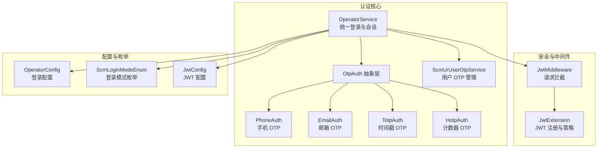
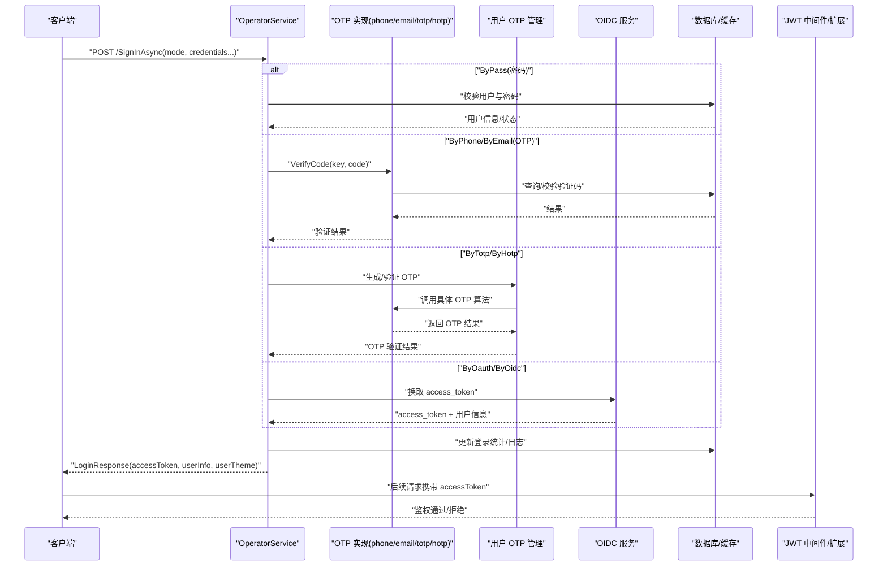
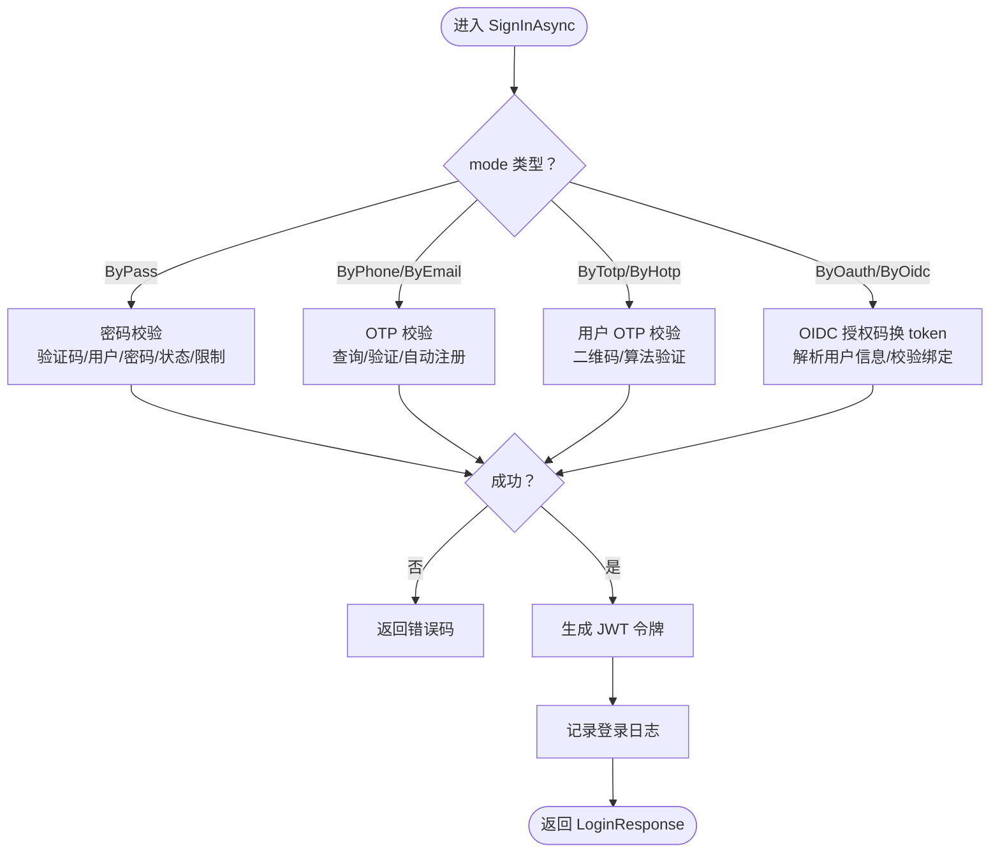
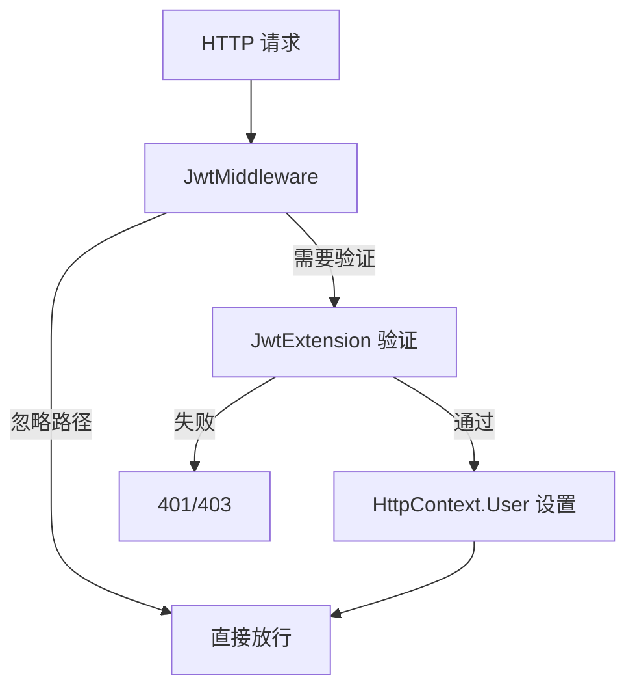
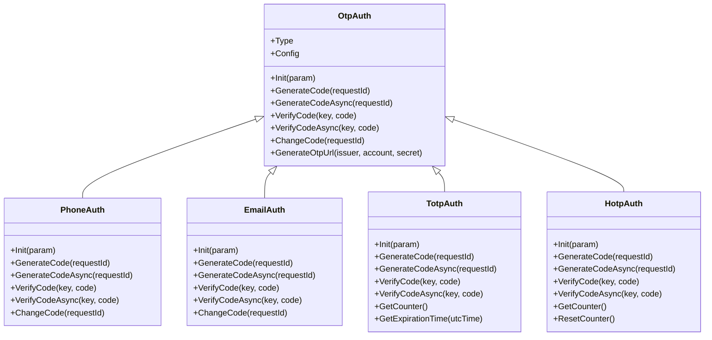
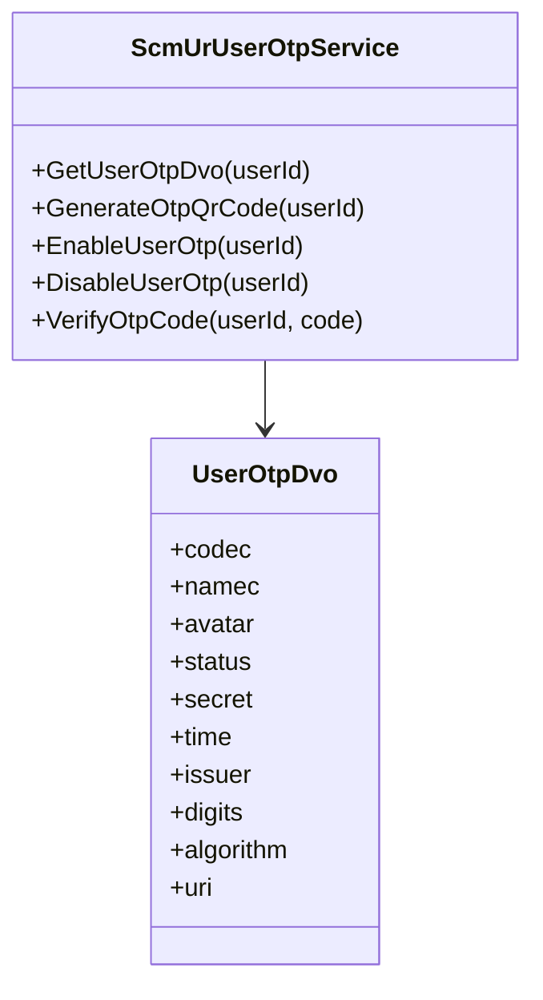
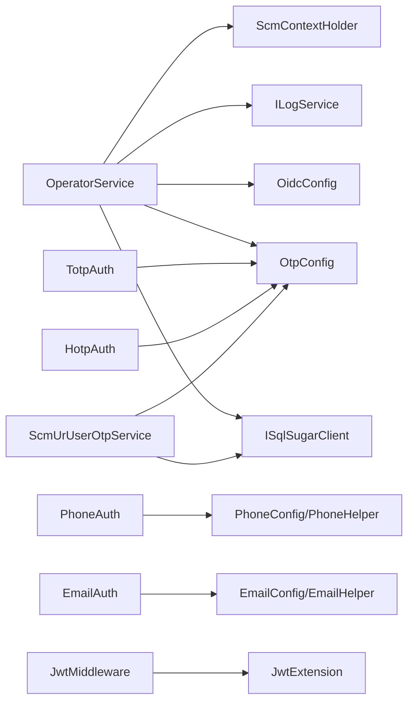

# 用户认证系统

<cite>
**本文引用的文件**
- [OperatorService.cs](file://Scm.Core/Operator/OperatorService.cs)
- [OperatorConfig.cs](file://Scm.Core/Operator/OperatorConfig.cs)
- [LoginRequest.cs](file://Scm.Core/Operator/Dvo/LoginRequest.cs)
- [LoginResponse.cs](file://Scm.Core/Operator/Dvo/LoginResponse.cs)
- [OtpAuth.cs](file://Scm.Core/Login/Otp/OtpAuth.cs)
- [OtpConfig.cs](file://Scm.Core/Login/Otp/OtpConfig.cs)
- [PhoneAuth.cs](file://Scm.Core/Login/Otp/Phone/PhoneAuth.cs)
- [EmailAuth.cs](file://Scm.Core/Login/Otp/Email/EmailAuth.cs)
- [TotpAuth.cs](file://Scm.Core/Login/Otp/Totp/TotpAuth.cs)
- [HotpAuth.cs](file://Scm.Core/Login/Otp/Hotp/HotpAuth.cs)
- [TotpConfig.cs](file://Scm.Core/Login/Otp/Totp/TotpConfig.cs)
- [OidcAccessTokenResponse.cs](file://Scm.Core/Operator/Oidc/OidcAccessTokenResponse.cs)
- [OidcUserInfoResponse.cs](file://Scm.Core/Operator/Oidc/OidcUserInfoResponse.cs)
- [JwtMiddleware.cs](file://Scm.Core/Configure/Middleware/JwtMiddleware.cs)
- [JwtExtension.cs](file://Scm.Server/Extensions/JwtExtension.cs)
- [JwtConfig.cs](file://Scm.Server/Config/JwtConfig.cs)
- [ScmLoginModeEnum.cs](file://Scm.Common/Enums/ScmLoginEnum.cs)
- [ScmUrUserOtpService.cs](file://Scm.Core/Ur/UserOtp/ScmUrUserOtpService.cs)
- [UserOtpDvo.cs](file://Scm.Core/Ur/UserOtp/Dvo/UserOtpDvo.cs)
</cite>

## 更新摘要
**所做更改**
- 新增了完整的 OTP 验证码认证子系统文档，包含 TOTP 时间戳验证码和 HOTP 计数器验证码
- 补充了用户 OTP 管理服务和相关数据传输对象
- 更新了认证服务架构图，增加了 OTP 和用户 OTP 管理模块
- 完善了安全配置和最佳实践章节
- 增强了故障排除指南，涵盖 OTP 相关问题

## 目录
1. [简介](#简介)
2. [项目结构](#项目结构)
3. [核心组件](#核心组件)
4. [架构总览](#架构总览)
5. [详细组件分析](#详细组件分析)
6. [OTP 验证码认证系统](#otp-验证码认证系统)
7. [用户 OTP 管理](#用户-otp-管理)
8. [依赖关系分析](#依赖关系分析)
9. [性能与安全考量](#性能与安全考量)
10. [故障排除指南](#故障排除指南)
11. [结论](#结论)
12. [附录：API 接口定义](#附录api-接口定义)

## 简介
本技术文档面向 Scm.Net 的用户认证体系，聚焦多认证方式的实现机制与 OperatorService 核心服务的设计与实现。内容涵盖：
- 多认证方式：密码认证、OTP 验证码（手机/邮箱/TOTP/HOTP）、社交登录（OAuth/OIDC/SAML）、令牌认证、人脸识别等
- OperatorService 的认证流程、JWT 令牌生成与验证、会话管理
- OTP 验证码认证系统的完整实现，包括时间戳和计数器两种算法
- 用户 OTP 管理服务，支持 OTP 二维码生成和验证
- 各认证方式的 API 接口定义（请求参数、响应格式、错误码）
- 安全配置最佳实践与常见防护措施
- 完整集成示例与故障排除指南

## 项目结构
围绕认证的关键模块分布如下：
- OperatorService：统一登录入口与用户信息查询，负责多认证方式分发与 JWT 令牌发放
- OTP 子系统：抽象 OTP 接口与具体实现（手机/邮箱/TOTP/HOTP），并集成短信/邮件发送
- 用户 OTP 管理：提供 OTP 二维码生成、用户 OTP 配置管理
- OIDC 子系统：封装 OIDC 访问令牌获取与用户信息解析
- JWT 中间件与扩展：负责请求拦截、令牌提取与验证策略
- 登录枚举与 DTO：统一登录模式、请求/响应结构体

**图表来源**
- [OperatorService.cs:39-84](file://Scm.Core/Operator/OperatorService.cs#L39-L84)
- [OtpAuth.cs:9-89](file://Scm.Core/Login/Otp/OtpAuth.cs#L9-L89)
- [PhoneAuth.cs:12-28](file://Scm.Core/Login/Otp/Phone/PhoneAuth.cs#L12-L28)
- [EmailAuth.cs:13-29](file://Scm.Core/Login/Otp/Email/EmailAuth.cs#L13-L29)
- [TotpAuth.cs:16-49](file://Scm.Core/Login/Otp/Totp/TotpAuth.cs#L16-L49)
- [HotpAuth.cs:15-42](file://Scm.Core/Login/Otp/Hotp/HotpAuth.cs#L15-L42)
- [ScmUrUserOtpService.cs:83-117](file://Scm.Core/Ur/UserOtp/ScmUrUserOtpService.cs#L83-L117)
- [JwtMiddleware.cs:8-56](file://Scm.Core/Configure/Middleware/JwtMiddleware.cs#L8-L56)
- [JwtExtension.cs:12-73](file://Scm.Server/Extensions/JwtExtension.cs#L12-L73)
- [OperatorConfig.cs:6-12](file://Scm.Core/Operator/OperatorConfig.cs#L6-L12)
- [ScmLoginModeEnum.cs:6-62](file://Scm.Common/Enums/ScmLoginEnum.cs#L6-L62)
- [JwtConfig.cs:3-48](file://Scm.Server/Config/JwtConfig.cs#L3-L48)

**章节来源**
- [OperatorService.cs:39-84](file://Scm.Core/Operator/OperatorService.cs#L39-L84)
- [OtpAuth.cs:9-89](file://Scm.Core/Login/Otp/OtpAuth.cs#L9-L89)
- [PhoneAuth.cs:12-28](file://Scm.Core/Login/Otp/Phone/PhoneAuth.cs#L12-L28)
- [EmailAuth.cs:13-29](file://Scm.Core/Login/Otp/Email/EmailAuth.cs#L13-L29)
- [TotpAuth.cs:16-49](file://Scm.Core/Login/Otp/Totp/TotpAuth.cs#L16-L49)
- [HotpAuth.cs:15-42](file://Scm.Core/Login/Otp/Hotp/HotpAuth.cs#L15-L42)
- [ScmUrUserOtpService.cs:83-117](file://Scm.Core/Ur/UserOtp/ScmUrUserOtpService.cs#L83-L117)
- [JwtMiddleware.cs:8-56](file://Scm.Core/Configure/Middleware/JwtMiddleware.cs#L8-L56)
- [JwtExtension.cs:12-73](file://Scm.Server/Extensions/JwtExtension.cs#L12-L73)
- [OperatorConfig.cs:6-12](file://Scm.Core/Operator/OperatorConfig.cs#L6-L12)
- [ScmLoginModeEnum.cs:6-62](file://Scm.Common/Enums/ScmLoginEnum.cs#L6-L62)
- [JwtConfig.cs:3-48](file://Scm.Server/Config/JwtConfig.cs#L3-L48)

## 核心组件
- OperatorService：统一登录入口，根据 LoginRequest.mode 分发到不同认证分支；完成用户信息组装、主题加载、登录日志记录，并生成 JWT 令牌返回给客户端
- OTP 抽象与实现：OtpAuth 定义通用接口，PhoneAuth/EmailAuth 实现短信/邮件 OTP 的生成、验证与发送；TotpAuth/HotpAuth 实现基于时间戳和计数器的 OTP 算法
- 用户 OTP 管理：ScmUrUserOtpService 提供用户 OTP 配置、二维码生成和状态管理
- OIDC 支持：通过访问 OIDC 令牌端点获取 access_token 并解析用户信息
- JWT 安全：JwtMiddleware 进行请求拦截与忽略规则控制；JwtExtension 注册 JWT 验证策略与事件
- 登录配置与模式：OperatorConfig 控制验证码校验开关；ScmLoginModeEnum 统一登录模式枚举

**章节来源**
- [OperatorService.cs:142-200](file://Scm.Core/Operator/OperatorService.cs#L142-L200)
- [OtpAuth.cs:34-77](file://Scm.Core/Login/Otp/OtpAuth.cs#L34-L77)
- [PhoneAuth.cs:53-135](file://Scm.Core/Login/Otp/Phone/PhoneAuth.cs#L53-L135)
- [EmailAuth.cs:54-136](file://Scm.Core/Login/Otp/Email/EmailAuth.cs#L54-L136)
- [TotpAuth.cs:69-125](file://Scm.Core/Login/Otp/Totp/TotpAuth.cs#L69-L125)
- [HotpAuth.cs:68-137](file://Scm.Core/Login/Otp/Hotp/HotpAuth.cs#L68-L137)
- [ScmUrUserOtpService.cs:87-117](file://Scm.Core/Ur/UserOtp/ScmUrUserOtpService.cs#L87-L117)
- [OidcAccessTokenResponse.cs:3-12](file://Scm.Core/Operator/Oidc/OidcAccessTokenResponse.cs#L3-L12)
- [JwtMiddleware.cs:42-56](file://Scm.Core/Configure/Middleware/JwtMiddleware.cs#L42-L56)
- [JwtExtension.cs:14-73](file://Scm.Server/Extensions/JwtExtension.cs#L14-L73)
- [OperatorConfig.cs:6-12](file://Scm.Core/Operator/OperatorConfig.cs#L6-L12)
- [ScmLoginModeEnum.cs:6-62](file://Scm.Common/Enums/ScmLoginEnum.cs#L6-L62)

## 架构总览
下图展示从客户端发起登录请求到返回 JWT 的整体流程，以及各子系统的交互关系。

**图表来源**
- [OperatorService.cs:142-200](file://Scm.Core/Operator/OperatorService.cs#L142-L200)
- [PhoneAuth.cs:232-301](file://Scm.Core/Login/Otp/Phone/PhoneAuth.cs#L232-L301)
- [EmailAuth.cs:233-302](file://Scm.Core/Login/Otp/Email/EmailAuth.cs#L233-L302)
- [TotpAuth.cs:112-125](file://Scm.Core/Login/Otp/Totp/TotpAuth.cs#L112-L125)
- [HotpAuth.cs:118-137](file://Scm.Core/Login/Otp/Hotp/HotpAuth.cs#L118-L137)
- [ScmUrUserOtpService.cs:87-117](file://Scm.Core/Ur/UserOtp/ScmUrUserOtpService.cs#L87-L117)
- [OidcAccessTokenResponse.cs:3-12](file://Scm.Core/Operator/Oidc/OidcAccessTokenResponse.cs#L3-L12)
- [JwtMiddleware.cs:42-56](file://Scm.Core/Configure/Middleware/JwtMiddleware.cs#L42-L56)
- [JwtExtension.cs:23-73](file://Scm.Server/Extensions/JwtExtension.cs#L23-L73)

## 详细组件分析

### OperatorService：统一登录与会话
- 登录入口：SignInAsync 根据 LoginRequest.mode 分派到 ByPass/ByPhone/ByEmail/ByTotp/ByHotp/ByOauth 分支
- 密码登录：校验验证码（可配置关闭）、用户名/密码合法性、账户状态与登录限制，成功后更新登录统计并生成 JWT
- OTP 登录：按手机号、邮箱、TOTP 或 HOTP 调用对应 OTP 实现进行验证码校验；若 auto=true 且用户不存在则自动注册
- OIDC 登录：向 OIDC 服务换取 access_token 并解析用户信息，校验绑定关系后放行
- 登录日志：统一写入日志表与用户登录日志
- 会话管理：Logout 清空上下文中的 JWT

**图表来源**
- [OperatorService.cs:142-200](file://Scm.Core/Operator/OperatorService.cs#L142-L200)
- [OperatorService.cs:226-302](file://Scm.Core/Operator/OperatorService.cs#L226-L302)
- [OperatorService.cs:310-419](file://Scm.Core/Operator/OperatorService.cs#L310-L419)
- [OperatorService.cs:427-554](file://Scm.Core/Operator/OperatorService.cs#L427-L554)

**章节来源**
- [OperatorService.cs:142-200](file://Scm.Core/Operator/OperatorService.cs#L142-L200)
- [OperatorService.cs:226-302](file://Scm.Core/Operator/OperatorService.cs#L226-L302)
- [OperatorService.cs:310-419](file://Scm.Core/Operator/OperatorService.cs#L310-L419)
- [OperatorService.cs:427-554](file://Scm.Core/Operator/OperatorService.cs#L427-L554)
- [LoginRequest.cs:9-72](file://Scm.Core/Operator/Dvo/LoginRequest.cs#L9-L72)
- [LoginResponse.cs:9-122](file://Scm.Core/Operator/Dvo/LoginResponse.cs#L9-L122)

### JWT 安全：中间件与扩展
- 请求拦截：JwtMiddleware 忽略特定路径（如 swagger、静态资源），对其他请求提取 accessToken 并交由验证管道
- 验证策略：JwtExtension 注册 JwtBearer，设置签名校验、发行方/受众校验、生命周期校验、自定义 Token 提取事件
- 配置管理：JwtConfig 提供安全密钥、发行者、受众、失效时间等配置项
- 作用范围：确保后续受保护接口的安全访问

**图表来源**
- [JwtMiddleware.cs:42-56](file://Scm.Core/Configure/Middleware/JwtMiddleware.cs#L42-L56)
- [JwtExtension.cs:23-73](file://Scm.Server/Extensions/JwtExtension.cs#L23-L73)
- [JwtConfig.cs:14-48](file://Scm.Server/Config/JwtConfig.cs#L14-L48)

**章节来源**
- [JwtMiddleware.cs:8-56](file://Scm.Core/Configure/Middleware/JwtMiddleware.cs#L8-L56)
- [JwtExtension.cs:12-73](file://Scm.Server/Extensions/JwtExtension.cs#L12-L73)
- [JwtConfig.cs:3-48](file://Scm.Server/Config/JwtConfig.cs#L3-L48)

### 登录配置与模式
- OperatorConfig：控制是否跳过验证码校验（IgnoreCaptcha）
- ScmLoginModeEnum：统一登录模式枚举，覆盖 ByPass、ByPhone、ByEmail、ByTotp、ByHotp、ByOauth、ByOidc、BySaml、ByMut、ByBrv 等
- JwtConfig：JWT 安全配置，包括安全密钥、发行者、受众、失效时间等

**章节来源**
- [OperatorConfig.cs:6-12](file://Scm.Core/Operator/OperatorConfig.cs#L6-L12)
- [ScmLoginModeEnum.cs:6-62](file://Scm.Common/Enums/ScmLoginEnum.cs#L6-L62)
- [JwtConfig.cs:3-48](file://Scm.Server/Config/JwtConfig.cs#L3-L48)

## OTP 验证码认证系统

### OTP 抽象层设计
- OtpAuth 抽象类定义了 OTP 认证的核心接口，包括初始化、生成验证码、验证验证码、更新验证码等方法
- 支持同步和异步操作，提供统一的错误处理机制
- GenerateOtpUrl 方法用于生成 OTP 二维码所需的 URL

**图表来源**
- [OtpAuth.cs:9-89](file://Scm.Core/Login/Otp/OtpAuth.cs#L9-L89)
- [PhoneAuth.cs:12-28](file://Scm.Core/Login/Otp/Phone/PhoneAuth.cs#L12-L28)
- [EmailAuth.cs:13-29](file://Scm.Core/Login/Otp/Email/EmailAuth.cs#L13-L29)
- [TotpAuth.cs:16-49](file://Scm.Core/Login/Otp/Totp/TotpAuth.cs#L16-L49)
- [HotpAuth.cs:15-42](file://Scm.Core/Login/Otp/Hotp/HotpAuth.cs#L15-L42)

**章节来源**
- [OtpAuth.cs:34-77](file://Scm.Core/Login/Otp/OtpAuth.cs#L34-L77)
- [OtpConfig.cs:10-57](file://Scm.Core/Login/Otp/OtpConfig.cs#L10-L57)

### 手机 OTP 认证
- 验证码生成：支持 4-8 位数字验证码，包含发送频率限制（每分钟）、发送次数限制（每小时 5 次）
- 验证码验证：支持一次性验证，过期时间 10 分钟，防重放攻击
- 短信发送：集成短信通道，支持模板化短信内容
- 数据持久化：记录验证码发送、验证日志，便于审计和问题追踪

**章节来源**
- [PhoneAuth.cs:53-135](file://Scm.Core/Login/Otp/Phone/PhoneAuth.cs#L53-L135)
- [PhoneAuth.cs:232-301](file://Scm.Core/Login/Otp/Phone/PhoneAuth.cs#L232-L301)

### 邮件 OTP 认证
- 验证码生成：支持 4-8 位数字验证码，包含发送频率限制和次数限制
- 验证码验证：支持一次性验证，过期时间 10 分钟
- 邮件发送：集成邮件通道，支持模板化邮件内容，可加载自定义模板
- 模板管理：支持从资源库加载邮件模板，支持占位符替换

**章节来源**
- [EmailAuth.cs:54-136](file://Scm.Core/Login/Otp/Email/EmailAuth.cs#L54-L136)
- [EmailAuth.cs:233-302](file://Scm.Core/Login/Otp/Email/EmailAuth.cs#L233-L302)

### TOTP 时间戳 OTP
- 算法实现：符合 RFC 6238 标准，基于时间的一次性密码
- 配置参数：支持 SHA1、SHA256、SHA512 哈希算法，时间步长 30-300 秒，默认 30 秒
- 容错机制：支持容错窗口，允许前后若干个时间步长的偏差
- 二维码生成：支持生成 otpauth:// 协议的二维码 URL
- 过期管理：提供密码过期时间计算功能

**章节来源**
- [TotpAuth.cs:69-125](file://Scm.Core/Login/Otp/Totp/TotpAuth.cs#L69-L125)
- [TotpAuth.cs:134-168](file://Scm.Core/Login/Otp/Totp/TotpAuth.cs#L134-L168)
- [TotpAuth.cs:225-236](file://Scm.Core/Login/Otp/Totp/TotpAuth.cs#L225-L236)
- [TotpConfig.cs:20-78](file://Scm.Core/Login/Otp/Totp/TotpConfig.cs#L20-L78)

### HOTP 计数器 OTP
- 算法实现：符合 RFC 4226 标准，基于 HMAC 的一次性密码
- 计数器管理：维护递增计数器，支持重置和同步
- 容错机制：支持容错窗口，允许验证后续若干个计数器值
- 算法支持：支持 SHA1、SHA256、SHA512 哈希算法
- 测试向量：内置 RFC 标准测试向量验证

**章节来源**
- [HotpAuth.cs:68-137](file://Scm.Core/Login/Otp/Hotp/HotpAuth.cs#L68-L137)
- [HotpAuth.cs:147-183](file://Scm.Core/Login/Otp/Hotp/HotpAuth.cs#L147-L183)
- [HotpAuth.cs:199-212](file://Scm.Core/Login/Otp/Hotp/HotpAuth.cs#L199-L212)

## 用户 OTP 管理

### 用户 OTP 服务
- 用户配置：提供用户 OTP 状态查询、启用/禁用、密钥管理等功能
- 二维码生成：根据用户配置生成 OTP 二维码 URL，支持自定义模板
- 密钥管理：支持 Base32 编码的密钥存储和解码
- 状态同步：维护用户 OTP 启用时间和状态

**图表来源**
- [ScmUrUserOtpService.cs:83-117](file://Scm.Core/Ur/UserOtp/ScmUrUserOtpService.cs#L83-L117)
- [UserOtpDvo.cs:9-61](file://Scm.Core/Ur/UserOtp/Dvo/UserOtpDvo.cs#L9-L61)

**章节来源**
- [ScmUrUserOtpService.cs:83-117](file://Scm.Core/Ur/UserOtp/ScmUrUserOtpService.cs#L83-L117)
- [UserOtpDvo.cs:9-61](file://Scm.Core/Ur/UserOtp/Dvo/UserOtpDvo.cs#L9-L61)

### OTP 安全策略
- 验证码强度：支持 4-8 位数字验证码，建议使用 6-8 位增加安全性
- 发送限制：防止验证码轰炸，限制发送频率和次数
- 过期管理：验证码 10 分钟有效期，过期自动失效
- 一次性使用：验证码验证后立即失效，防止重放攻击
- 容错机制：TOTP 支持容错窗口，HOTP 支持计数器同步
- 密钥管理：支持多种哈希算法，建议使用 SHA256 或更高强度算法

## 依赖关系分析
- OperatorService 依赖：
  - ScmContextHolder（令牌上下文）
  - ILogService（日志服务）
  - OidcConfig/OtpConfig（外部配置）
  - SQLSugar 客户端（数据访问）
- OTP 子系统：
  - PhoneAuth/EmailAuth 依赖短信/邮件配置与通道
  - TotpAuth/HotpAuth 依赖 OtpConfig 配置
  - 日志表用于发送/验证记录与防刷
- 用户 OTP 管理：
  - 依赖用户 DAO 和 OTP 配置
  - 支持用户 OTP 状态管理和二维码生成
- JWT：
  - JwtMiddleware 与 JwtExtension 共同保证令牌提取与验证

**图表来源**
- [OperatorService.cs:68-83](file://Scm.Core/Operator/OperatorService.cs#L68-L83)
- [PhoneAuth.cs:14-28](file://Scm.Core/Login/Otp/Phone/PhoneAuth.cs#L14-L28)
- [EmailAuth.cs:15-29](file://Scm.Core/Login/Otp/Email/EmailAuth.cs#L15-L29)
- [TotpAuth.cs:45-49](file://Scm.Core/Login/Otp/Totp/TotpAuth.cs#L45-L49)
- [HotpAuth.cs:38-42](file://Scm.Core/Login/Otp/Hotp/HotpAuth.cs#L38-L42)
- [ScmUrUserOtpService.cs:83-84](file://Scm.Core/Ur/UserOtp/ScmUrUserOtpService.cs#L83-L84)
- [JwtMiddleware.cs:42-56](file://Scm.Core/Configure/Middleware/JwtMiddleware.cs#L42-L56)
- [JwtExtension.cs:23-73](file://Scm.Server/Extensions/JwtExtension.cs#L23-L73)

**章节来源**
- [OperatorService.cs:68-83](file://Scm.Core/Operator/OperatorService.cs#L68-L83)
- [PhoneAuth.cs:14-28](file://Scm.Core/Login/Otp/Phone/PhoneAuth.cs#L14-L28)
- [EmailAuth.cs:15-29](file://Scm.Core/Login/Otp/Email/EmailAuth.cs#L15-L29)
- [TotpAuth.cs:45-49](file://Scm.Core/Login/Otp/Totp/TotpAuth.cs#L45-L49)
- [HotpAuth.cs:38-42](file://Scm.Core/Login/Otp/Hotp/HotpAuth.cs#L38-L42)
- [ScmUrUserOtpService.cs:83-84](file://Scm.Core/Ur/UserOtp/ScmUrUserOtpService.cs#L83-L84)
- [JwtMiddleware.cs:42-56](file://Scm.Core/Configure/Middleware/JwtMiddleware.cs#L42-L56)
- [JwtExtension.cs:23-73](file://Scm.Server/Extensions/JwtExtension.cs#L23-L73)

## 性能与安全考量
- 性能
  - OTP 发送频率与次数限制：避免短信/邮件风暴
  - 登录限制与错误计数：防止暴力破解
  - 缓存验证码：减少数据库压力
  - TOTP 容错窗口：平衡用户体验与安全性
  - HOTP 计数器同步：支持批量验证提高效率
- 安全
  - 必须启用 HTTPS，严格配置 JWT 签名密钥与发行方/受众
  - 对敏感接口启用 JwtBearer 验证
  - 登录失败与异常需记录日志并上报
  - 验证码有效期与一次性使用，防止复用
  - OIDC 回调地址与状态参数校验，防范 CSRF
  - OTP 密钥使用强随机数生成，定期轮换
  - 支持多种哈希算法，建议使用 SHA256 或更高强度算法
  - 用户 OTP 状态实时同步，防止状态不一致

## 故障排除指南
- 登录失败错误码定位
  - 密码登录：验证码错误、无效用户、无效密码、账号密码错误
  - OTP 登录：无效手机号/邮箱、验证码错误、注册失败
  - TOTP/HOTP 登录：算法错误、计数器不匹配、过期时间错误
  - OIDC 登录：服务访问异常、无效授权信息、用户未绑定、存在多个绑定
- 常见问题
  - 验证码不生效：检查 OperatorConfig.IgnoreCaptcha 配置与缓存键
  - 手机/邮件发送失败：核对短信/邮件通道配置与模板
  - TOTP 时间不同步：检查服务器时间同步，调整容错窗口
  - HOTP 计数器不同步：执行计数器重置或同步操作
  - OIDC 授权失败：确认回调地址、client_id/secret、token 地址可用性
  - JWT 无法验证：确认中间件是否拦截、签名密钥与发行方/受众一致
  - OTP 二维码无法扫描：检查二维码 URL 格式和模板配置

**章节来源**
- [LoginResponse.cs:29-122](file://Scm.Core/Operator/Dvo/LoginResponse.cs#L29-L122)
- [OperatorService.cs:226-302](file://Scm.Core/Operator/OperatorService.cs#L226-L302)
- [OperatorService.cs:310-419](file://Scm.Core/Operator/OperatorService.cs#L310-L419)
- [OperatorService.cs:427-554](file://Scm.Core/Operator/OperatorService.cs#L427-L554)
- [PhoneAuth.cs:93-104](file://Scm.Core/Login/Otp/Phone/PhoneAuth.cs#L93-L104)
- [EmailAuth.cs:99-104](file://Scm.Core/Login/Otp/Email/EmailAuth.cs#L99-L104)
- [TotpAuth.cs:153-167](file://Scm.Core/Login/Otp/Totp/TotpAuth.cs#L153-L167)
- [HotpAuth.cs:166-179](file://Scm.Core/Login/Otp/Hotp/HotpAuth.cs#L166-L179)

## 结论
Scm.Net 的认证体系以 OperatorService 为核心，结合 OTP 与 OIDC 等多种认证方式，配合 JWT 中间件与注册策略，形成统一、可扩展、可审计的认证框架。通过合理的配置与安全加固，可在保障用户体验的同时满足企业级安全要求。新增的 OTP 验证码认证系统进一步增强了系统的安全性和灵活性，支持多种认证算法和用户管理功能。

## 附录：API 接口定义

### 登录接口
- 路径
  - POST /SignInAsync
- 请求体
  - mode：登录模式（ByPass/ByPhone/ByEmail/ByTotp/ByHotp/ByOauth/ByOidc 等）
  - user/pass：当 mode=ByPass 时必填
  - phone/email：当 mode=ByPhone/ByEmail 时必填
  - state：当 mode=ByOauth/ByOidc 时必填
  - time：操作时间戳
  - key/code：验证码相关
  - auto：是否自动注册（仅 OTP/OIDC 模式下可能生效）
- 响应体
  - accessToken：JWT 令牌
  - userInfo：当前用户基础信息
  - userTheme：用户主题配置
  - code/message：业务状态与提示
- 错误码
  - 1/2/3/6：通用/机构/限制/不支持
  - 11/12/13/14：密码登录相关
  - 21/22/23：手机登录相关
  - 31/32：邮件登录相关
  - 41/42/43/44/45/46：OIDC 登录相关

**章节来源**
- [OperatorService.cs:142-200](file://Scm.Core/Operator/OperatorService.cs#L142-L200)
- [LoginRequest.cs:9-72](file://Scm.Core/Operator/Dvo/LoginRequest.cs#L9-L72)
- [LoginResponse.cs:9-122](file://Scm.Core/Operator/Dvo/LoginResponse.cs#L9-L122)

### OTP 验证接口
- 路径
  - POST /GenerateOtpCode（生成验证码）
  - POST /VerifyOtpCode（验证验证码）
- 请求体
  - phone/email：手机号或邮箱地址
  - template：模板代码（邮件 OTP 时使用）
  - key：验证码键值（验证时使用）
  - code：验证码值
- 响应体
  - key：验证码键值
  - success：验证结果
  - error_code/error_message：错误信息

**章节来源**
- [PhoneAuth.cs:53-135](file://Scm.Core/Login/Otp/Phone/PhoneAuth.cs#L53-L135)
- [EmailAuth.cs:54-136](file://Scm.Core/Login/Otp/Email/EmailAuth.cs#L54-L136)
- [OtpResult.cs:3-35](file://Scm.Core/Login/Otp/OtpResult.cs#L3-L35)

### 用户 OTP 管理接口
- 路径
  - GET /GetUserOtpDvo（获取用户 OTP 配置）
  - GET /GenerateOtpQrCode（生成 OTP 二维码）
  - POST /EnableUserOtp（启用用户 OTP）
  - POST /DisableUserOtp（禁用用户 OTP）
- 请求体
  - userId：用户标识
  - code：验证码值
- 响应体
  - UserOtpDvo：用户 OTP 配置信息
  - qrCodeUrl：OTP 二维码 URL
  - status：OTP 状态

**章节来源**
- [ScmUrUserOtpService.cs:83-117](file://Scm.Core/Ur/UserOtp/ScmUrUserOtpService.cs#L83-L117)
- [UserOtpDvo.cs:9-61](file://Scm.Core/Ur/UserOtp/Dvo/UserOtpDvo.cs#L9-L61)

### OIDC 令牌与用户信息
- 访问令牌响应
  - 字段：access_token、refresh_token、expires_in、User
- 用户信息响应
  - 字段：User（包含 Osp、Code、Name、Avatar）

**章节来源**
- [OidcAccessTokenResponse.cs:3-12](file://Scm.Core/Operator/Oidc/OidcAccessTokenResponse.cs#L3-L12)
- [OidcUserInfoResponse.cs:11-39](file://Scm.Core/Operator/Oidc/OidcUserInfoResponse.cs#L11-L39)

### JWT 配置与策略
- 中间件
  - 忽略路径：swagger、/scmhub、/api-config、/upload/
  - 对 OPTIONS 预检放行
- 验证策略
  - 对比发行方/受众、签名校验、生命周期校验
  - 自定义从请求头提取 accessToken 的事件
- 配置参数
  - Security：安全密钥
  - Issuer：发行者
  - Audience：受众
  - Expires：失效时间（分钟）

**章节来源**
- [JwtMiddleware.cs:10-56](file://Scm.Core/Configure/Middleware/JwtMiddleware.cs#L10-L56)
- [JwtExtension.cs:23-73](file://Scm.Server/Extensions/JwtExtension.cs#L23-L73)
- [JwtConfig.cs:14-48](file://Scm.Server/Config/JwtConfig.cs#L14-L48)