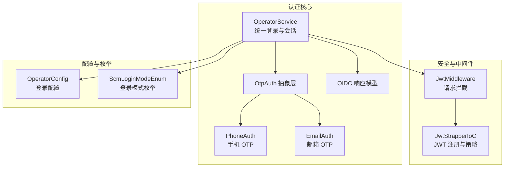
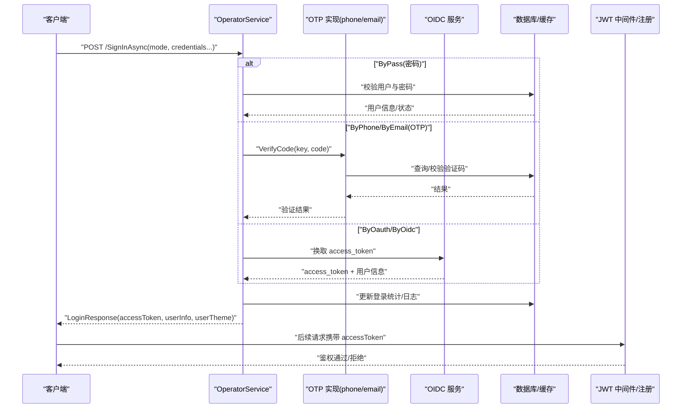
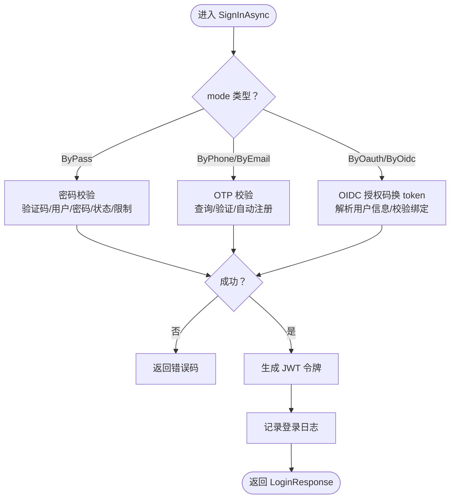
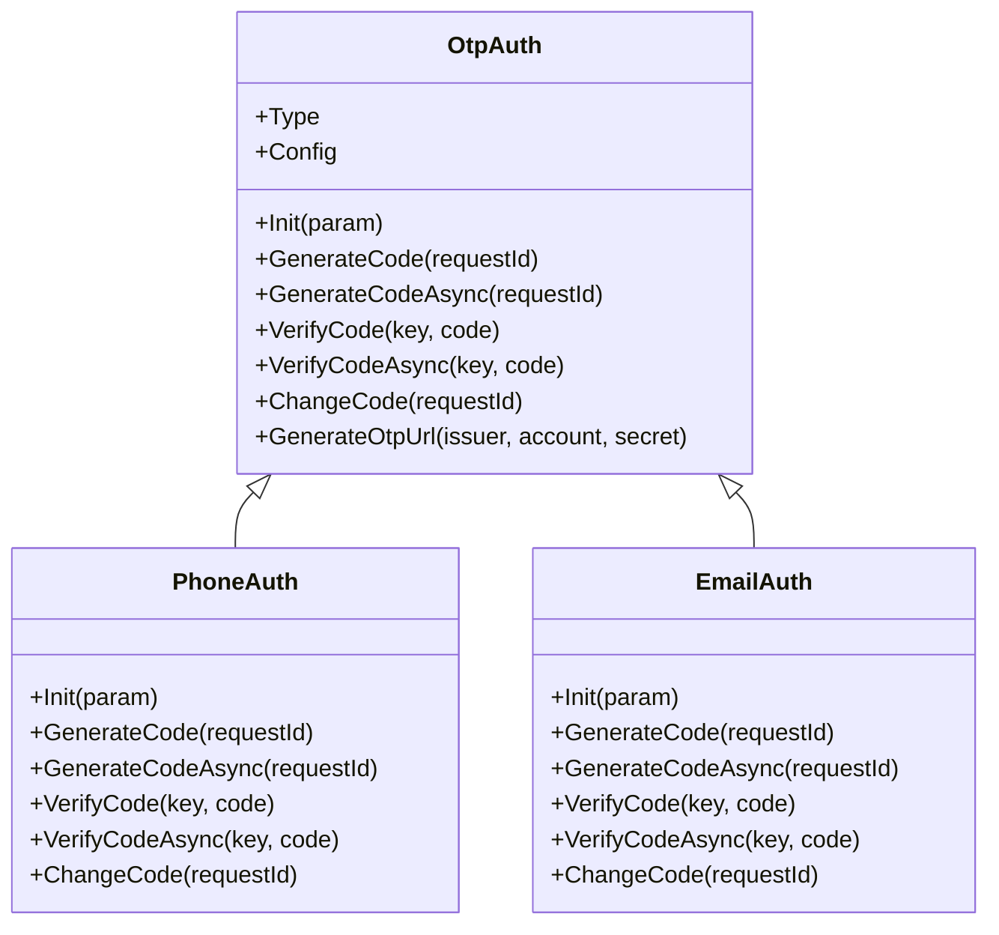
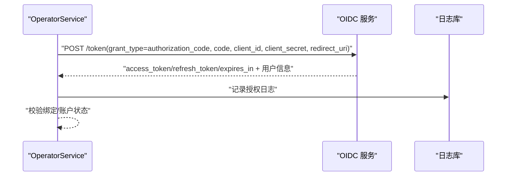
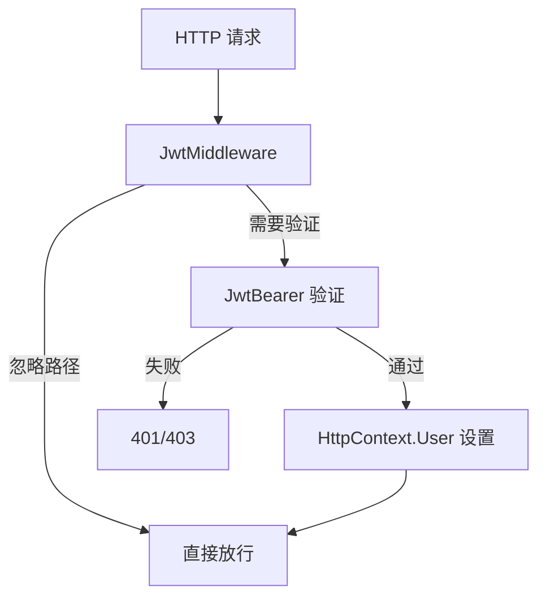
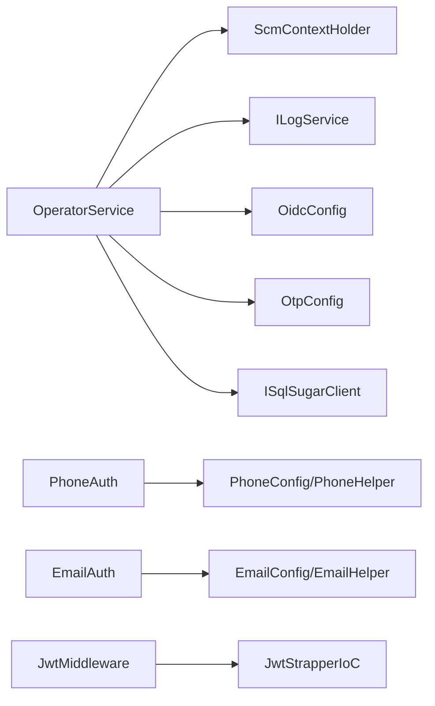

# 用户认证系统

<cite>
**本文引用的文件**
- [OperatorService.cs](file://Scm.Core/Operator/OperatorService.cs)
- [OperatorConfig.cs](file://Scm.Core/Operator/OperatorConfig.cs)
- [LoginRequest.cs](file://Scm.Core/Operator/Dvo/LoginRequest.cs)
- [LoginResponse.cs](file://Scm.Core/Operator/Dvo/LoginResponse.cs)
- [OtpAuth.cs](file://Scm.Core/Login/Otp/OtpAuth.cs)
- [OtpConfig.cs](file://Scm.Core/Login/Otp/OtpConfig.cs)
- [PhoneAuth.cs](file://Scm.Core/Login/Otp/Phone/PhoneAuth.cs)
- [EmailAuth.cs](file://Scm.Core/Login/Otp/Email/EmailAuth.cs)
- [OidcAccessTokenResponse.cs](file://Scm.Core/Operator/Oidc/OidcAccessTokenResponse.cs)
- [OidcUserInfoResponse.cs](file://Scm.Core/Operator/Oidc/OidcUserInfoResponse.cs)
- [JwtMiddleware.cs](file://Scm.Core/Configure/Middleware/JwtMiddleware.cs)
- [JwtStrapperIoC.cs](file://Scm.Server.Bearer/JwtStrapperIoC.cs)
- [ScmLoginModeEnum.cs](file://Scm.Common/Enums/ScmLoginEnum.cs)
</cite>

## 目录
1. [简介](#简介)
2. [项目结构](#项目结构)
3. [核心组件](#核心组件)
4. [架构总览](#架构总览)
5. [详细组件分析](#详细组件分析)
6. [依赖关系分析](#依赖关系分析)
7. [性能与安全考量](#性能与安全考量)
8. [故障排除指南](#故障排除指南)
9. [结论](#结论)
10. [附录：API 接口定义](#附录api-接口定义)

## 简介
本技术文档面向 Scm.Net 的用户认证体系，聚焦多认证方式的实现机制与 OperatorService 核心服务的设计与实现。内容涵盖：
- 多认证方式：密码认证、OTP 验证码（手机/邮箱）、社交登录（OAuth/OIDC/SAML）、令牌认证、人脸识别等
- OperatorService 的认证流程、JWT 令牌生成与验证、会话管理
- 各认证方式的 API 接口定义（请求参数、响应格式、错误码）
- 安全配置最佳实践与常见防护措施
- 完整集成示例与故障排除指南

## 项目结构
围绕认证的关键模块分布如下：
- OperatorService：统一登录入口与用户信息查询，负责多认证方式分发与 JWT 令牌发放
- OTP 子系统：抽象 OTP 接口与具体实现（手机/邮箱），并集成短信/邮件发送
- OIDC 子系统：封装 OIDC 访问令牌获取与用户信息解析
- JWT 中间件与 IoC 注册：负责请求拦截、令牌提取与验证策略
- 登录枚举与 DTO：统一登录模式、请求/响应结构体

**图表来源**
- [OperatorService.cs:39-84](file://Scm.Core/Operator/OperatorService.cs#L39-L84)
- [OtpAuth.cs:9-89](file://Scm.Core/Login/Otp/OtpAuth.cs#L9-L89)
- [PhoneAuth.cs:12-28](file://Scm.Core/Login/Otp/Phone/PhoneAuth.cs#L12-L28)
- [EmailAuth.cs:13-29](file://Scm.Core/Login/Otp/Email/EmailAuth.cs#L13-L29)
- [OidcAccessTokenResponse.cs:3-12](file://Scm.Core/Operator/Oidc/OidcAccessTokenResponse.cs#L3-L12)
- [JwtMiddleware.cs:8-56](file://Scm.Core/Configure/Middleware/JwtMiddleware.cs#L8-L56)
- [JwtStrapperIoC.cs:11-56](file://Scm.Server.Bearer/JwtStrapperIoC.cs#L11-L56)
- [OperatorConfig.cs:6-12](file://Scm.Core/Operator/OperatorConfig.cs#L6-L12)
- [ScmLoginModeEnum.cs:6-62](file://Scm.Common/Enums/ScmLoginEnum.cs#L6-L62)

**章节来源**
- [OperatorService.cs:39-84](file://Scm.Core/Operator/OperatorService.cs#L39-L84)
- [OtpAuth.cs:9-89](file://Scm.Core/Login/Otp/OtpAuth.cs#L9-L89)
- [PhoneAuth.cs:12-28](file://Scm.Core/Login/Otp/Phone/PhoneAuth.cs#L12-L28)
- [EmailAuth.cs:13-29](file://Scm.Core/Login/Otp/Email/EmailAuth.cs#L13-L29)
- [OidcAccessTokenResponse.cs:3-12](file://Scm.Core/Operator/Oidc/OidcAccessTokenResponse.cs#L3-L12)
- [JwtMiddleware.cs:8-56](file://Scm.Core/Configure/Middleware/JwtMiddleware.cs#L8-L56)
- [JwtStrapperIoC.cs:11-56](file://Scm.Server.Bearer/JwtStrapperIoC.cs#L11-L56)
- [OperatorConfig.cs:6-12](file://Scm.Core/Operator/OperatorConfig.cs#L6-L12)
- [ScmLoginModeEnum.cs:6-62](file://Scm.Common/Enums/ScmLoginEnum.cs#L6-L62)

## 核心组件
- OperatorService：统一登录入口，根据 LoginRequest.mode 分发到不同认证分支；完成用户信息组装、主题加载、登录日志记录，并生成 JWT 令牌返回给客户端
- OTP 抽象与实现：OtpAuth 定义通用接口，PhoneAuth/EmailAuth 实现短信/邮件 OTP 的生成、验证与发送
- OIDC 支持：通过访问 OIDC 令牌端点获取 access_token 并解析用户信息
- JWT 安全：JwtMiddleware 进行请求拦截与忽略规则控制；JwtStrapperIoC 注册 JWT 验证策略与事件
- 登录配置与模式：OperatorConfig 控制验证码校验开关；ScmLoginModeEnum 统一登录模式枚举

**章节来源**
- [OperatorService.cs:142-200](file://Scm.Core/Operator/OperatorService.cs#L142-L200)
- [OtpAuth.cs:34-77](file://Scm.Core/Login/Otp/OtpAuth.cs#L34-L77)
- [PhoneAuth.cs:53-135](file://Scm.Core/Login/Otp/Phone/PhoneAuth.cs#L53-L135)
- [EmailAuth.cs:54-136](file://Scm.Core/Login/Otp/Email/EmailAuth.cs#L54-L136)
- [OidcAccessTokenResponse.cs:3-12](file://Scm.Core/Operator/Oidc/OidcAccessTokenResponse.cs#L3-L12)
- [JwtMiddleware.cs:42-56](file://Scm.Core/Configure/Middleware/JwtMiddleware.cs#L42-L56)
- [JwtStrapperIoC.cs:13-56](file://Scm.Server.Bearer/JwtStrapperIoC.cs#L13-L56)
- [OperatorConfig.cs:6-12](file://Scm.Core/Operator/OperatorConfig.cs#L6-L12)
- [ScmLoginModeEnum.cs:6-62](file://Scm.Common/Enums/ScmLoginEnum.cs#L6-L62)

## 架构总览
下图展示从客户端发起登录请求到返回 JWT 的整体流程，以及各子系统的交互关系。

**图表来源**
- [OperatorService.cs:142-200](file://Scm.Core/Operator/OperatorService.cs#L142-L200)
- [PhoneAuth.cs:232-301](file://Scm.Core/Login/Otp/Phone/PhoneAuth.cs#L232-L301)
- [EmailAuth.cs:233-302](file://Scm.Core/Login/Otp/Email/EmailAuth.cs#L233-L302)
- [OidcAccessTokenResponse.cs:3-12](file://Scm.Core/Operator/Oidc/OidcAccessTokenResponse.cs#L3-L12)
- [JwtMiddleware.cs:42-56](file://Scm.Core/Configure/Middleware/JwtMiddleware.cs#L42-L56)
- [JwtStrapperIoC.cs:19-49](file://Scm.Server.Bearer/JwtStrapperIoC.cs#L19-L49)

## 详细组件分析

### OperatorService：统一登录与会话
- 登录入口：SignInAsync 根据 LoginRequest.mode 分派到 ByPass/ByPhone/ByEmail/ByOauth 分支
- 密码登录：校验验证码（可配置关闭）、用户名/密码合法性、账户状态与登录限制，成功后更新登录统计并生成 JWT
- OTP 登录：按手机号或邮箱调用对应 OTP 实现进行验证码校验；若 auto=true 且用户不存在则自动注册
- OIDC 登录：向 OIDC 服务换取 access_token 并解析用户信息，校验绑定关系后放行
- 登录日志：统一写入日志表与用户登录日志
- 会话管理：Logout 清空上下文中的 JWT

**图表来源**
- [OperatorService.cs:142-200](file://Scm.Core/Operator/OperatorService.cs#L142-L200)
- [OperatorService.cs:226-302](file://Scm.Core/Operator/OperatorService.cs#L226-L302)
- [OperatorService.cs:310-419](file://Scm.Core/Operator/OperatorService.cs#L310-L419)
- [OperatorService.cs:427-554](file://Scm.Core/Operator/OperatorService.cs#L427-L554)

**章节来源**
- [OperatorService.cs:142-200](file://Scm.Core/Operator/OperatorService.cs#L142-L200)
- [OperatorService.cs:226-302](file://Scm.Core/Operator/OperatorService.cs#L226-L302)
- [OperatorService.cs:310-419](file://Scm.Core/Operator/OperatorService.cs#L310-L419)
- [OperatorService.cs:427-554](file://Scm.Core/Operator/OperatorService.cs#L427-L554)
- [LoginRequest.cs:9-72](file://Scm.Core/Operator/Dvo/LoginRequest.cs#L9-L72)
- [LoginResponse.cs:9-122](file://Scm.Core/Operator/Dvo/LoginResponse.cs#L9-L122)

### OTP 子系统：验证码认证
- 抽象接口：OtpAuth 定义 Init/GenerateCode/VerifyCode/ChangeCode 等通用能力
- 手机 OTP：PhoneAuth 实现短信发送与验证码校验，含发送频率与次数限制、过期控制、一次性验证
- 邮件 OTP：EmailAuth 实现邮件发送与验证码校验，支持模板加载与占位符替换
- 配置：OtpConfig 提供位数、类型、热备/时间戳 OTP、短信/邮件通道配置

**图表来源**
- [OtpAuth.cs:9-89](file://Scm.Core/Login/Otp/OtpAuth.cs#L9-L89)
- [PhoneAuth.cs:12-28](file://Scm.Core/Login/Otp/Phone/PhoneAuth.cs#L12-L28)
- [EmailAuth.cs:13-29](file://Scm.Core/Login/Otp/Email/EmailAuth.cs#L13-L29)

**章节来源**
- [OtpAuth.cs:34-77](file://Scm.Core/Login/Otp/OtpAuth.cs#L34-L77)
- [PhoneAuth.cs:53-135](file://Scm.Core/Login/Otp/Phone/PhoneAuth.cs#L53-L135)
- [PhoneAuth.cs:232-301](file://Scm.Core/Login/Otp/Phone/PhoneAuth.cs#L232-L301)
- [EmailAuth.cs:54-136](file://Scm.Core/Login/Otp/Email/EmailAuth.cs#L54-L136)
- [EmailAuth.cs:233-302](file://Scm.Core/Login/Otp/Email/EmailAuth.cs#L233-L302)
- [OtpConfig.cs:10-57](file://Scm.Core/Login/Otp/OtpConfig.cs#L10-L57)

### OIDC 支持：联合登录
- 令牌交换：通过 code、client_id、client_secret、redirect_uri 向 OIDC 服务换取 access_token
- 用户信息：解析返回的用户信息对象，记录日志并校验绑定关系
- 错误处理：对网络异常、令牌无效、用户信息缺失等情况进行错误码映射

**图表来源**
- [OperatorService.cs:427-554](file://Scm.Core/Operator/OperatorService.cs#L427-L554)
- [OidcAccessTokenResponse.cs:3-12](file://Scm.Core/Operator/Oidc/OidcAccessTokenResponse.cs#L3-L12)
- [OidcUserInfoResponse.cs:11-39](file://Scm.Core/Operator/Oidc/OidcUserInfoResponse.cs#L11-L39)

**章节来源**
- [OperatorService.cs:427-554](file://Scm.Core/Operator/OperatorService.cs#L427-L554)
- [OidcAccessTokenResponse.cs:3-12](file://Scm.Core/Operator/Oidc/OidcAccessTokenResponse.cs#L3-L12)
- [OidcUserInfoResponse.cs:11-39](file://Scm.Core/Operator/Oidc/OidcUserInfoResponse.cs#L11-L39)

### JWT 安全：中间件与注册
- 请求拦截：JwtMiddleware 忽略特定路径（如 swagger、静态资源），对其他请求提取 accessToken 并交由验证管道
- 验证策略：JwtStrapperIoC 注册 JwtBearer，设置签名校验、发行方/受众校验、生命周期校验、自定义 Token 提取事件
- 作用范围：确保后续受保护接口的安全访问

**图表来源**
- [JwtMiddleware.cs:42-56](file://Scm.Core/Configure/Middleware/JwtMiddleware.cs#L42-L56)
- [JwtStrapperIoC.cs:19-49](file://Scm.Server.Bearer/JwtStrapperIoC.cs#L19-L49)

**章节来源**
- [JwtMiddleware.cs:8-56](file://Scm.Core/Configure/Middleware/JwtMiddleware.cs#L8-L56)
- [JwtStrapperIoC.cs:13-56](file://Scm.Server.Bearer/JwtStrapperIoC.cs#L13-L56)

### 登录配置与模式
- OperatorConfig：控制是否跳过验证码校验（IgnoreCaptcha）
- ScmLoginModeEnum：统一登录模式枚举，覆盖 ByPass、ByPhone、ByEmail、ByOauth、ByOidc、BySaml、ByMut、ByBrv 等

**章节来源**
- [OperatorConfig.cs:6-12](file://Scm.Core/Operator/OperatorConfig.cs#L6-L12)
- [ScmLoginModeEnum.cs:6-62](file://Scm.Common/Enums/ScmLoginEnum.cs#L6-L62)

## 依赖关系分析
- OperatorService 依赖：
  - ScmContextHolder（令牌上下文）
  - ILogService（日志服务）
  - OidcConfig/OtpConfig（外部配置）
  - SQLSugar 客户端（数据访问）
- OTP 子系统：
  - PhoneAuth/EmailAuth 依赖短信/邮件配置与通道
  - 日志表用于发送/验证记录与防刷
- JWT：
  - JwtMiddleware 与 JwtStrapperIoC 共同保证令牌提取与验证

**图表来源**
- [OperatorService.cs:68-83](file://Scm.Core/Operator/OperatorService.cs#L68-L83)
- [PhoneAuth.cs:14-28](file://Scm.Core/Login/Otp/Phone/PhoneAuth.cs#L14-L28)
- [EmailAuth.cs:15-29](file://Scm.Core/Login/Otp/Email/EmailAuth.cs#L15-L29)
- [JwtMiddleware.cs:42-56](file://Scm.Core/Configure/Middleware/JwtMiddleware.cs#L42-L56)
- [JwtStrapperIoC.cs:19-49](file://Scm.Server.Bearer/JwtStrapperIoC.cs#L19-L49)

**章节来源**
- [OperatorService.cs:68-83](file://Scm.Core/Operator/OperatorService.cs#L68-L83)
- [PhoneAuth.cs:14-28](file://Scm.Core/Login/Otp/Phone/PhoneAuth.cs#L14-L28)
- [EmailAuth.cs:15-29](file://Scm.Core/Login/Otp/Email/EmailAuth.cs#L15-L29)
- [JwtMiddleware.cs:42-56](file://Scm.Core/Configure/Middleware/JwtMiddleware.cs#L42-L56)
- [JwtStrapperIoC.cs:19-49](file://Scm.Server.Bearer/JwtStrapperIoC.cs#L19-L49)

## 性能与安全考量
- 性能
  - OTP 发送频率与次数限制：避免短信/邮件风暴
  - 登录限制与错误计数：防止暴力破解
  - 缓存验证码：减少数据库压力
- 安全
  - 必须启用 HTTPS，严格配置 JWT 签名密钥与发行方/受众
  - 对敏感接口启用 JwtBearer 验证
  - 登录失败与异常需记录日志并上报
  - 验证码有效期与一次性使用，防止复用
  - OIDC 回调地址与状态参数校验，防范 CSRF

[本节为通用指导，无需列出具体文件来源]

## 故障排除指南
- 登录失败错误码定位
  - 密码登录：验证码错误、无效用户、无效密码、账号密码错误
  - OTP 登录：无效手机号/邮箱、验证码错误、注册失败
  - OIDC 登录：服务访问异常、无效授权信息、用户未绑定、存在多个绑定
- 常见问题
  - 验证码不生效：检查 OperatorConfig.IgnoreCaptcha 配置与缓存键
  - 手机/邮件发送失败：核对短信/邮件通道配置与模板
  - OIDC 授权失败：确认回调地址、client_id/secret、token 地址可用性
  - JWT 无法验证：确认中间件是否拦截、签名密钥与发行方/受众一致

**章节来源**
- [LoginResponse.cs:29-122](file://Scm.Core/Operator/Dvo/LoginResponse.cs#L29-L122)
- [OperatorService.cs:226-302](file://Scm.Core/Operator/OperatorService.cs#L226-L302)
- [OperatorService.cs:310-419](file://Scm.Core/Operator/OperatorService.cs#L310-L419)
- [OperatorService.cs:427-554](file://Scm.Core/Operator/OperatorService.cs#L427-L554)

## 结论
Scm.Net 的认证体系以 OperatorService 为核心，结合 OTP 与 OIDC 等多种认证方式，配合 JWT 中间件与注册策略，形成统一、可扩展、可审计的认证框架。通过合理的配置与安全加固，可在保障用户体验的同时满足企业级安全要求。

[本节为总结性内容，无需列出具体文件来源]

## 附录：API 接口定义

### 登录接口
- 路径
  - POST /SignInAsync
- 请求体
  - mode：登录模式（ByPass/ByPhone/ByEmail/ByOauth/ByOidc 等）
  - user/pass：当 mode=ByPass 时必填
  - phone/email：当 mode=ByPhone/ByEmail 时必填
  - state：当 mode=ByOauth/ByOidc 时必填
  - time：操作时间戳
  - key/code：验证码相关
  - auto：是否自动注册（仅 OTP/OIDC 模式下可能生效）
- 响应体
  - accessToken：JWT 令牌
  - userInfo：当前用户基础信息
  - userTheme：用户主题配置
  - code/message：业务状态与提示
- 错误码
  - 1/2/3/6：通用/机构/限制/不支持
  - 11/12/13/14：密码登录相关
  - 21/22/23：手机登录相关
  - 31/32：邮件登录相关
  - 41/42/43/44/45/46：OIDC 登录相关

**章节来源**
- [OperatorService.cs:142-200](file://Scm.Core/Operator/OperatorService.cs#L142-L200)
- [LoginRequest.cs:9-72](file://Scm.Core/Operator/Dvo/LoginRequest.cs#L9-L72)
- [LoginResponse.cs:9-122](file://Scm.Core/Operator/Dvo/LoginResponse.cs#L9-L122)

### OIDC 令牌与用户信息
- 访问令牌响应
  - 字段：access_token、refresh_token、expires_in、User
- 用户信息响应
  - 字段：User（包含 Osp、Code、Name、Avatar）

**章节来源**
- [OidcAccessTokenResponse.cs:3-12](file://Scm.Core/Operator/Oidc/OidcAccessTokenResponse.cs#L3-L12)
- [OidcUserInfoResponse.cs:11-39](file://Scm.Core/Operator/Oidc/OidcUserInfoResponse.cs#L11-L39)

### JWT 配置与策略
- 中间件
  - 忽略路径：swagger、/scmhub、/api-config、/upload/
  - 对 OPTIONS 预检放行
- 验证策略
  - 对比发行方/受众、签名校验、生命周期校验
  - 自定义从请求头提取 accessToken 的事件

**章节来源**
- [JwtMiddleware.cs:10-56](file://Scm.Core/Configure/Middleware/JwtMiddleware.cs#L10-L56)
- [JwtStrapperIoC.cs:19-49](file://Scm.Server.Bearer/JwtStrapperIoC.cs#L19-L49)