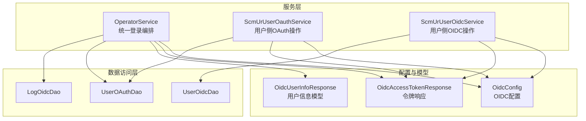
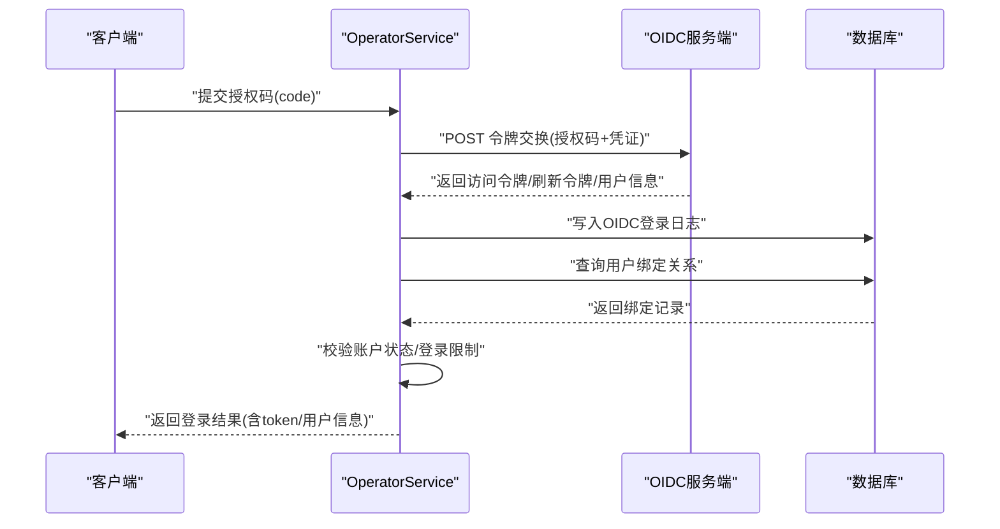
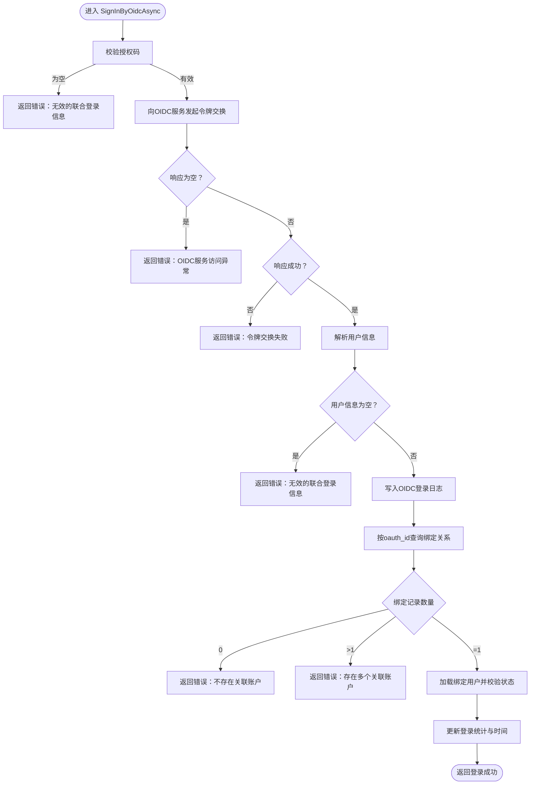
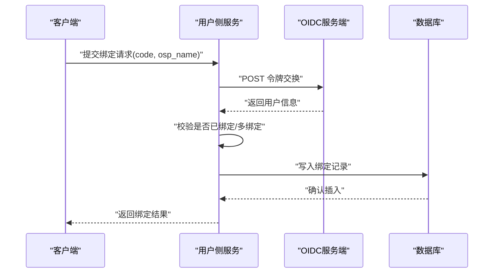
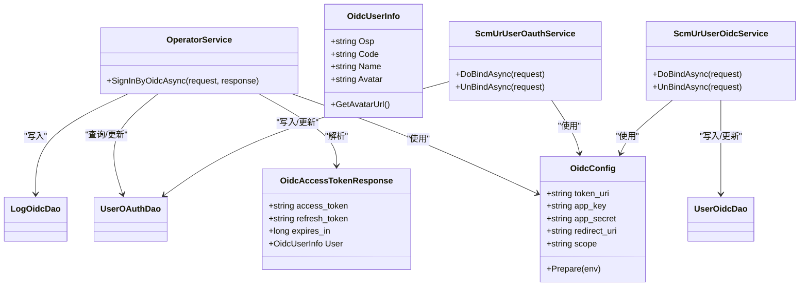

# 社交登录

<cite>
**本文引用的文件**
- [Scm.Core/Operator/OperatorService.cs](file://Scm.Core/Operator/OperatorService.cs)
- [Scm.Core/Operator/Oidc/OidcAccessTokenResponse.cs](file://Scm.Core/Operator/Oidc/OidcAccessTokenResponse.cs)
- [Scm.Core/Operator/Oidc/OidcUserInfoResponse.cs](file://Scm.Core/Operator/Oidc/OidcUserInfoResponse.cs)
- [Scm.Server/Config/OidcConfig.cs](file://Scm.Server/Config/OidcConfig.cs)
- [Scm.Core/Ur/UserOidc/ScmUrUserOidcService.cs](file://Scm.Core/Ur/UserOidc/ScmUrUserOidcService.cs)
- [Scm.Core/Ur/UserOAuth/ScmUrUserOauthService.cs](file://Scm.Core/Ur/UserOAuth/ScmUrUserOauthService.cs)
- [Scm.Dao/Ur/UserOidcDao.cs](file://Scm.Dao/Ur/UserOidcDao.cs)
- [Scm.Dao/Ur/UserOAuthDao.cs](file://Scm.Dao/Ur/UserOAuthDao.cs)
- [Scm.Dao/Log/LogOidcDao.cs](file://Scm.Dao/Log/LogOidcDao.cs)
</cite>

## 目录
1. [简介](#简介)
2. [项目结构](#项目结构)
3. [核心组件](#核心组件)
4. [架构总览](#架构总览)
5. [详细组件分析](#详细组件分析)
6. [依赖关系分析](#依赖关系分析)
7. [性能考量](#性能考量)
8. [故障排查指南](#故障排查指南)
9. [结论](#结论)
10. [附录](#附录)

## 简介
本文件面向 Scm.Net 的社交登录能力，聚焦 SignInByOidcAsync 方法的实现机制与 OIDC 协议集成细节，系统阐述第三方认证流程（授权码获取、访问令牌交换、用户信息解析）、OIDC 配置管理、认证状态处理、API 接口定义、用户绑定与自动注册策略，并提供 OAuth、OIDC、SAML 的集成要点与最佳实践。

## 项目结构
社交登录相关代码主要分布在以下模块：
- 核心业务层：OperatorService 提供统一登录入口与 OIDC 流程编排
- OIDC 数据模型：访问令牌响应、用户信息模型
- 配置中心：OidcConfig 提供 OIDC 服务端点与应用凭证
- 用户侧服务：ScmUrUserOauthService 与 ScmUrUserOidcService 提供绑定/解绑等用户侧操作
- 数据访问层：UserOAuthDao、UserOidcDao、LogOidcDao 等持久化实体

**图表来源**
- [Scm.Core/Operator/OperatorService.cs:430-554](file://Scm.Core/Operator/OperatorService.cs#L430-L554)
- [Scm.Core/Operator/Oidc/OidcAccessTokenResponse.cs:1-14](file://Scm.Core/Operator/Oidc/OidcAccessTokenResponse.cs#L1-L14)
- [Scm.Core/Operator/Oidc/OidcUserInfoResponse.cs:1-40](file://Scm.Core/Operator/Oidc/OidcUserInfoResponse.cs#L1-L40)
- [Scm.Server/Config/OidcConfig.cs:1-24](file://Scm.Server/Config/OidcConfig.cs#L1-L24)
- [Scm.Core/Ur/UserOidc/ScmUrUserOidcService.cs:1-301](file://Scm.Core/Ur/UserOidc/ScmUrUserOidcService.cs#L1-L301)
- [Scm.Core/Ur/UserOAuth/ScmUrUserOauthService.cs:1-301](file://Scm.Core/Ur/UserOAuth/ScmUrUserOauthService.cs#L1-L301)
- [Scm.Dao/Ur/UserOidcDao.cs](file://Scm.Dao/Ur/UserOidcDao.cs)
- [Scm.Dao/Ur/UserOAuthDao.cs](file://Scm.Dao/Ur/UserOAuthDao.cs)
- [Scm.Dao/Log/LogOidcDao.cs](file://Scm.Dao/Log/LogOidcDao.cs)

**章节来源**
- [Scm.Core/Operator/OperatorService.cs:430-554](file://Scm.Core/Operator/OperatorService.cs#L430-L554)
- [Scm.Server/Config/OidcConfig.cs:1-24](file://Scm.Server/Config/OidcConfig.cs#L1-L24)

## 核心组件
- SignInByOidcAsync：统一登录入口中对 OIDC 的处理逻辑，负责授权码换取访问令牌、用户信息解析、关联账户校验与登录态更新
- OidcConfig：OIDC 服务端点、应用凭证与默认值准备
- OidcAccessTokenResponse / OidcUserInfoResponse：令牌交换与用户信息的数据契约
- ScmUrUserOauthService / ScmUrUserOidcService：用户侧绑定/解绑操作，支持将第三方用户与本地账户建立映射
- DAO 层：UserOAuthDao、UserOidcDao、LogOidcDao 负责持久化用户绑定关系与 OIDC 登录日志

**章节来源**
- [Scm.Core/Operator/OperatorService.cs:430-554](file://Scm.Core/Operator/OperatorService.cs#L430-L554)
- [Scm.Core/Operator/Oidc/OidcAccessTokenResponse.cs:1-14](file://Scm.Core/Operator/Oidc/OidcAccessTokenResponse.cs#L1-L14)
- [Scm.Core/Operator/Oidc/OidcUserInfoResponse.cs:1-40](file://Scm.Core/Operator/Oidc/OidcUserInfoResponse.cs#L1-L40)
- [Scm.Server/Config/OidcConfig.cs:1-24](file://Scm.Server/Config/OidcConfig.cs#L1-L24)
- [Scm.Core/Ur/UserOidc/ScmUrUserOidcService.cs:178-301](file://Scm.Core/Ur/UserOidc/ScmUrUserOidcService.cs#L178-L301)
- [Scm.Core/Ur/UserOAuth/ScmUrUserOauthService.cs:178-301](file://Scm.Core/Ur/UserOAuth/ScmUrUserOauthService.cs#L178-L301)
- [Scm.Dao/Ur/UserOidcDao.cs](file://Scm.Dao/Ur/UserOidcDao.cs)
- [Scm.Dao/Ur/UserOAuthDao.cs](file://Scm.Dao/Ur/UserOAuthDao.cs)
- [Scm.Dao/Log/LogOidcDao.cs](file://Scm.Dao/Log/LogOidcDao.cs)

## 架构总览
社交登录整体流程由“授权码回调 → 令牌交换 → 用户信息解析 → 关联账户匹配 → 登录态更新”构成，OperatorService 作为编排者协调配置、HTTP 请求与数据库操作；用户侧服务负责绑定/解绑与用户维度的扩展操作。

**图表来源**
- [Scm.Core/Operator/OperatorService.cs:430-554](file://Scm.Core/Operator/OperatorService.cs#L430-L554)
- [Scm.Core/Operator/Oidc/OidcAccessTokenResponse.cs:1-14](file://Scm.Core/Operator/Oidc/OidcAccessTokenResponse.cs#L1-L14)
- [Scm.Core/Operator/Oidc/OidcUserInfoResponse.cs:1-40](file://Scm.Core/Operator/Oidc/OidcUserInfoResponse.cs#L1-L40)
- [Scm.Dao/Log/LogOidcDao.cs](file://Scm.Dao/Log/LogOidcDao.cs)

## 详细组件分析

### SignInByOidcAsync 实现机制
- 输入参数校验：要求授权码非空，避免无效请求
- 令牌交换：构造标准 OAuth2.0 授权码模式参数（grant_type、code、client_id、client_secret、redirect_uri），调用 HttpUtils.PostFormObjectAsync 发送表单请求至 token_uri
- 响应处理：若响应为空或失败，返回对应错误码；成功时提取用户信息对象
- 日志记录：将 provider、code、state、scope、用户标识、头像、access_token、refresh_token、expires_in 写入 LogOidcDao
- 关联账户匹配：按 oauth_id 查询 UserOAuthDao，要求仅有一条且启用状态；否则返回“未绑定/多绑定”错误
- 登录态更新：读取绑定用户，校验账户启用状态与登录限制，更新登录次数、时间与错误计数

**图表来源**
- [Scm.Core/Operator/OperatorService.cs:430-554](file://Scm.Core/Operator/OperatorService.cs#L430-L554)
- [Scm.Dao/Log/LogOidcDao.cs](file://Scm.Dao/Log/LogOidcDao.cs)

**章节来源**
- [Scm.Core/Operator/OperatorService.cs:430-554](file://Scm.Core/Operator/OperatorService.cs#L430-L554)

### OIDC 配置管理
- 配置项：token_uri、app_key、app_secret、redirect_uri、scope
- 默认值：当 token_uri 为空时，默认指向 http://oidc.org.cn/oauth/token
- 准备阶段：Prepare(EnvConfig) 用于在运行期补齐默认值，确保后续令牌交换可用

**章节来源**
- [Scm.Server/Config/OidcConfig.cs:1-24](file://Scm.Server/Config/OidcConfig.cs#L1-L24)

### 数据模型与契约
- OidcAccessTokenResponse：承载 access_token、refresh_token、expires_in 以及用户信息 User
- OidcUserInfoResponse：承载 OidcUserInfo，包含服务代码(Osp)、用户代码(Code)、展示姓名(Name)、头像(Avatar)，并提供头像绝对路径计算方法

**章节来源**
- [Scm.Core/Operator/Oidc/OidcAccessTokenResponse.cs:1-14](file://Scm.Core/Operator/Oidc/OidcAccessTokenResponse.cs#L1-L14)
- [Scm.Core/Operator/Oidc/OidcUserInfoResponse.cs:1-40](file://Scm.Core/Operator/Oidc/OidcUserInfoResponse.cs#L1-L40)

### 用户绑定与解绑机制
- 绑定流程：通过 ScmUrUserOauthService/ScmUrUserOidcService 的 DoBindAsync，先完成 OIDC 令牌交换与用户信息解析，再检查是否已绑定同账户或多账户，最后写入 UserOAuthDao/UserOidcDao
- 解绑流程：将绑定记录标记为禁用状态，实现软删除式解绑
- 绑定约束：同一第三方用户仅能绑定一次；同一本地用户可绑定多个第三方来源（按 od 排序）

**图表来源**
- [Scm.Core/Ur/UserOidc/ScmUrUserOidcService.cs:178-301](file://Scm.Core/Ur/UserOidc/ScmUrUserOidcService.cs#L178-L301)
- [Scm.Core/Ur/UserOAuth/ScmUrUserOauthService.cs:178-301](file://Scm.Core/Ur/UserOAuth/ScmUrUserOauthService.cs#L178-L301)

**章节来源**
- [Scm.Core/Ur/UserOidc/ScmUrUserOidcService.cs:178-301](file://Scm.Core/Ur/UserOidc/ScmUrUserOidcService.cs#L178-L301)
- [Scm.Core/Ur/UserOAuth/ScmUrUserOauthService.cs:178-301](file://Scm.Core/Ur/UserOAuth/ScmUrUserOauthService.cs#L178-L301)

### 登录 API 接口定义
- 登录入口：统一由 OperatorService 处理多种登录模式，其中 OIDC 模式调用 SignInByOidcAsync
- 返回内容：包含 accessToken、userInfo、userTheme 等；失败时返回相应错误码
- 登录日志：记录登录行为、IP、UA、URL、参数等信息

**章节来源**
- [Scm.Core/Operator/OperatorService.cs:157-198](file://Scm.Core/Operator/OperatorService.cs#L157-L198)

## 依赖关系分析
- 组件耦合
  - OperatorService 依赖 OidcConfig、HttpUtils、LogOidcDao、UserOAuthDao
  - 用户侧服务依赖 OidcConfig、HttpUtils、UserOAuthDao/UserOidcDao
- 外部依赖
  - OIDC 服务端点 token_uri 与标准 OAuth2.0 授权码交换协议
- 数据一致性
  - 绑定关系与登录日志需与用户主数据保持一致，防止脏数据

**图表来源**
- [Scm.Core/Operator/OperatorService.cs:430-554](file://Scm.Core/Operator/OperatorService.cs#L430-L554)
- [Scm.Server/Config/OidcConfig.cs:1-24](file://Scm.Server/Config/OidcConfig.cs#L1-L24)
- [Scm.Core/Operator/Oidc/OidcAccessTokenResponse.cs:1-14](file://Scm.Core/Operator/Oidc/OidcAccessTokenResponse.cs#L1-L14)
- [Scm.Core/Operator/Oidc/OidcUserInfoResponse.cs:1-40](file://Scm.Core/Operator/Oidc/OidcUserInfoResponse.cs#L1-L40)
- [Scm.Core/Ur/UserOidc/ScmUrUserOidcService.cs:1-301](file://Scm.Core/Ur/UserOidc/ScmUrUserOidcService.cs#L1-L301)
- [Scm.Core/Ur/UserOAuth/ScmUrUserOauthService.cs:1-301](file://Scm.Core/Ur/UserOAuth/ScmUrUserOauthService.cs#L1-L301)
- [Scm.Dao/Ur/UserOidcDao.cs](file://Scm.Dao/Ur/UserOidcDao.cs)
- [Scm.Dao/Ur/UserOAuthDao.cs](file://Scm.Dao/Ur/UserOAuthDao.cs)
- [Scm.Dao/Log/LogOidcDao.cs](file://Scm.Dao/Log/LogOidcDao.cs)

**章节来源**
- [Scm.Core/Operator/OperatorService.cs:430-554](file://Scm.Core/Operator/OperatorService.cs#L430-L554)
- [Scm.Core/Ur/UserOidc/ScmUrUserOidcService.cs:178-301](file://Scm.Core/Ur/UserOidc/ScmUrUserOidcService.cs#L178-L301)
- [Scm.Core/Ur/UserOAuth/ScmUrUserOauthService.cs:178-301](file://Scm.Core/Ur/UserOAuth/ScmUrUserOauthService.cs#L178-L301)

## 性能考量
- 异步 I/O：令牌交换与数据库写入均采用异步调用，降低阻塞
- 缓存建议：对常用配置（如 token_uri）可在进程内缓存，减少重复初始化成本
- 并发控制：绑定/解绑场景下注意幂等性与并发冲突，必要时引入乐观锁或唯一索引
- 日志落库：登录日志写入应考虑批量写入或异步队列，避免阻塞主流程

## 故障排查指南
- 授权码为空：检查前端回调是否正确传递 code 与 state
- 令牌交换失败：核对 app_key/app_secret/redirect_uri 是否与 OIDC 服务端一致
- 用户信息为空：确认 OIDC 服务端返回的用户信息字段是否完整
- 未绑定/多绑定：检查 UserOAuthDao 中是否存在重复 oauth_id 或状态异常
- 账户被冻结/登录受限：检查用户状态与 next_time 限制

**章节来源**
- [Scm.Core/Operator/OperatorService.cs:430-554](file://Scm.Core/Operator/OperatorService.cs#L430-L554)

## 结论
Scm.Net 的社交登录以 SignInByOidcAsync 为核心，结合 OidcConfig、数据模型与 DAO 层，实现了从授权码到访问令牌再到用户绑定与登录态更新的完整闭环。通过用户侧服务，系统支持灵活的绑定/解绑策略，并具备完善的错误处理与日志记录能力。建议在生产环境强化配置校验、并发控制与日志监控，确保登录链路稳定可靠。

## 附录

### OAuth、OIDC、SAML 集成要点
- OAuth2.0
  - 授权码模式：适用于 Web 应用；回调地址需与注册一致
  - 简化模式/隐式模式：适用于浏览器端应用；安全性较低，谨慎使用
- OpenID Connect
  - 在 OAuth2.0 基础上增加身份层，使用 ID Token 与用户信息端点
  - 本项目通过 OidcAccessTokenResponse/OidcUserInfoResponse 映射 OIDC 响应
- SAML
  - 适用于企业级单点登录；需在服务端配置断言消费者端点与证书
  - 与 OIDC 的差异在于断言与签名验证流程

### 第三方平台接入步骤（通用）
- 注册应用并获取 app_key/app_secret
- 配置回调地址 redirect_uri
- 在服务端配置 OidcConfig 的 token_uri、redirect_uri、scope
- 前端引导用户跳转至 OIDC 授权页，接收回调中的 code
- 服务端调用 SignInByOidcAsync 完成登录