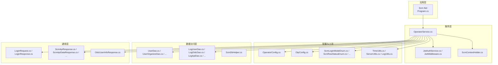
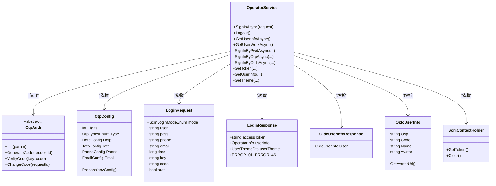
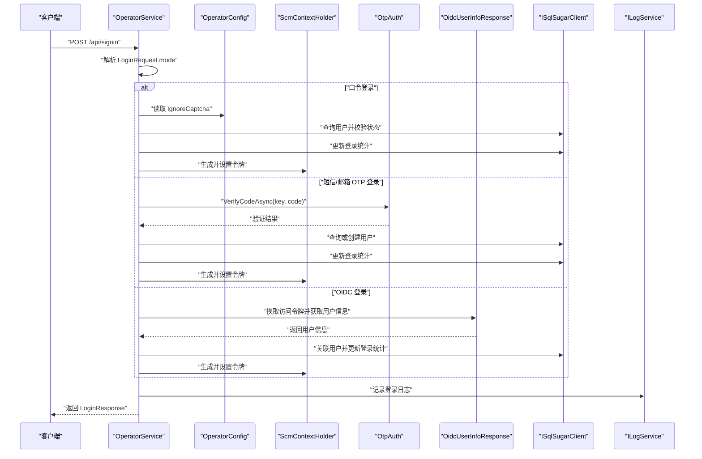
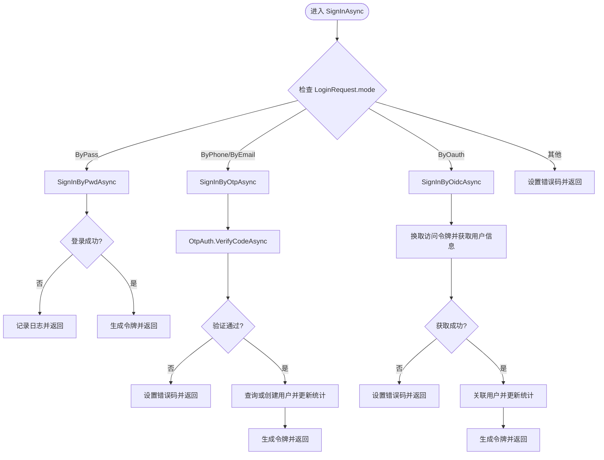
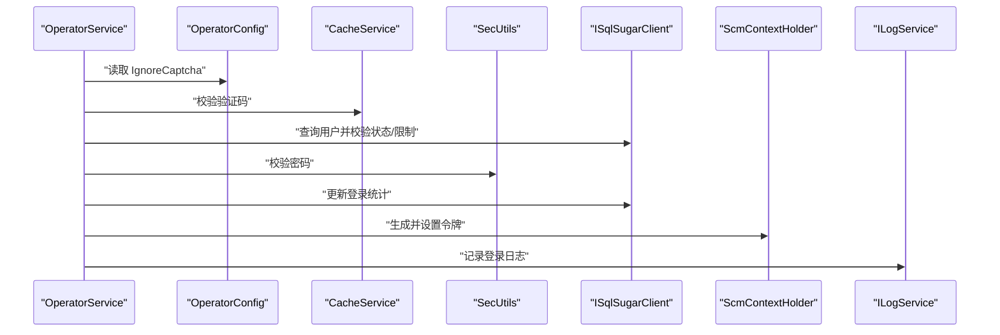
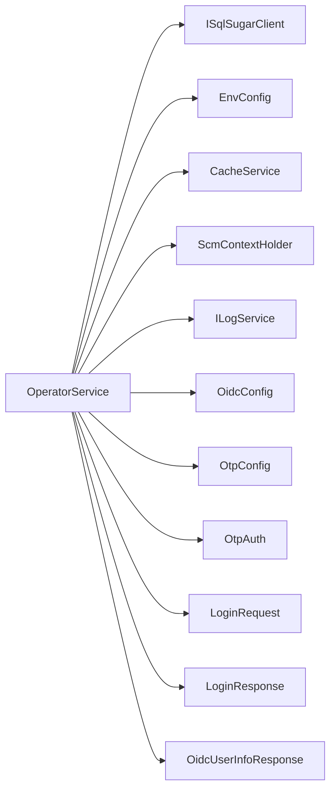

# 认证服务架构

<cite>
**本文引用的文件**
- [OperatorService.cs](file://Scm.Core/Operator/OperatorService.cs)
- [OperatorConfig.cs](file://Scm.Core/Operator/OperatorConfig.cs)
- [OtpConfig.cs](file://Scm.Core/Login/Otp/OtpConfig.cs)
- [OtpAuth.cs](file://Scm.Core/Login/Otp/OtpAuth.cs)
- [LoginRequest.cs](file://Scm.Core/Operator/Dvo/LoginRequest.cs)
- [LoginResponse.cs](file://Scm.Core/Operator/Dvo/LoginResponse.cs)
- [OidcUserInfoResponse.cs](file://Scm.Core/Operator/Oidc/OidcUserInfoResponse.cs)
- [Program.cs](file://Scm.Net/Program.cs)
- [JwtAuthService.cs](file://Scm.Server.Bearer/JwtAuthService.cs)
- [JwtMiddleware.cs](file://Scm.Server/Bearer/Jwt/JwtMiddleware.cs)
- [ScmContextHolder.cs](file://Scm.Server/Token/ScmContextHolder.cs)
- [ILogService.cs](file://Scm.Server/ILogService.cs)
- [ScmEnv.cs](file://Scm.Common/ScmEnv.cs)
- [ScmRowStatusEnum.cs](file://Scm.Common/Enums/ScmRowStatusEnum.cs)
- [ScmLoginModeEnum.cs](file://Scm.Common/Enums/ScmLoginEnum.cs)
- [ScmClientTypeEnum.cs](file://Scm.Common/Enums/ScmClientTypeEnum.cs)
- [ScmBoolEnum.cs](file://Scm.Common/Enums/ScmBoolEnum.cs)
- [TimeUtils.cs](file://Scm.Common/Utils/TimeUtils.cs)
- [ServerUtils.cs](file://Scm.Server/Utils/ServerUtils.cs)
- [LogUtils.cs](file://Scm.Common/Utils/LogUtils.cs)
- [ScmDbHelper.cs](file://Scm.Dao/ScmDbHelper.cs)
- [UserDao.cs](file://Scm.Dao/Ur/UserDao.cs)
- [UserOrganizeDao.cs](file://Scm.Dao/Ur/UserOrganizeDao.cs)
- [UserPositionDao.cs](file://Scm.Dao/Ur/UserPositionDao.cs)
- [UserRoleDao.cs](file://Scm.Dao/Ur/UserRoleDao.cs)
- [GroupDao.cs](file://Scm.Dao/Ur/GroupDao.cs)
- [OrganizeDao.cs](file://Scm.Dao/Ur/OrganizeDao.cs)
- [PositionDao.cs](file://Scm.Dao/Ur/PositionDao.cs)
- [MessageDao.cs](file://Scm.Dao/Msg/MessageDao.cs)
- [LogUserDao.cs](file://Scm.Dao/Log/LogUserDao.cs)
- [LogOidcDao.cs](file://Scm.Dao/Log/LogOidcDao.cs)
- [LogApiDao.cs](file://Scm.Dao/Log/LogApiDao.cs)
- [LogHbDao.cs](file://Scm.Dao/Log/LogHbDao.cs)
- [LogOauthDao.cs](file://Scm.Dao/Log/LogOauthDao.cs)
- [LogOtpDao.cs](file://Scm.Dao/Log/LogOtpDao.cs)
- [ScmContextHolder.cs](file://Scm.Server/Token/ScmContextHolder.cs)
- [ScmToken.cs](file://Scm.Server/Token/ScmToken.cs)
- [ScmResponse.cs](file://Scm.Common.Dto/Response/ScmResponse.cs)
- [ScmApiResponse.cs](file://Scm.Common.Dto/Response/ScmApiResponse.cs)
- [ScmApiDataResponse.cs](file://Scm.Common.Dto/Response/ScmApiDataResponse.cs)
- [ScmApiListResponse.cs](file://Scm.Common.Dto/Response/ScmApiListResponse.cs)
- [ScmSearchResponse.cs](file://Scm.Common.Dto/Response/ScmSearchResponse.cs)
- [ScmUpdateResponse.cs](file://Scm.Common.Dto/Response/ScmUpdateResponse.cs)
- [ScmUploadResponse.cs](file://Scm.Common.Dto/Response/ScmUploadResponse.cs)
- [ScmDownloadResponse.cs](file://Scm.Common.Dto/Response/ScmDownloadResponse.cs)
- [ScmImportResponse.cs](file://Scm.Common.Dto/Response/ScmImportResponse.cs)
- [ScmExportResponse.cs](file://Scm.Common.Dto/Response/ScmExportResponse.cs)
- [ScmPageResultDto.cs](file://Scm.Common.Dto/Dto/ScmPageResultDto.cs)
- [ScmDataDto.cs](file://Scm.Common.Dto/Dto/ScmDataDto.cs)
- [ScmDto.cs](file://Scm.Common.Dto/Dto/ScmDto.cs)
- [ScmFileDto.cs](file://Scm.Common.Dto/Dto/ScmFileDto.cs)
- [ScmRequest.cs](file://Scm.Common.Dto/Request/ScmRequest.cs)
- [ScmApiResponse.cs](file://Scm.Common.Dto/Response/ScmApiResponse.cs)
- [ScmResponse.cs](file://Scm.Common.Dto/Response/ScmResponse.cs)
</cite>

## 目录
1. [简介](#简介)
2. [项目结构](#项目结构)
3. [核心组件](#核心组件)
4. [架构总览](#架构总览)
5. [详细组件分析](#详细组件分析)
6. [依赖分析](#依赖分析)
7. [性能考虑](#性能考虑)
8. [故障排查指南](#故障排查指南)
9. [结论](#结论)
10. [附录](#附录)

## 简介
本文件面向 Scm.Net 的认证服务架构，聚焦 OperatorService 核心服务的设计理念与实现模式，系统阐述其在服务层、数据访问层与配置层的职责划分，以及多认证方式（口令、短信/邮箱 OTP、OIDC）的统一接口设计与动态切换机制。文档同时给出服务初始化流程、依赖关系图与组件交互图，并总结架构决策的技术考量与性能优化策略。

## 项目结构
认证相关能力主要分布在以下模块：
- Scm.Core：核心业务逻辑，包含 OperatorService、登录 DTO、OIDC 响应模型等
- Scm.Server：服务端基础设施，包含 JWT 中间件、上下文持有者、日志服务接口等
- Scm.Dao：数据访问层，包含用户与日志等 DAO
- Scm.Common / Scm.Common.Dto：通用工具、枚举与响应模型
- Scm.Net：应用入口，包含 Program.cs 与控制器

**图表来源**
- [OperatorService.cs](file://Scm.Core/Operator/OperatorService.cs)
- [JwtAuthService.cs](file://Scm.Server.Bearer/JwtAuthService.cs)
- [JwtMiddleware.cs](file://Scm.Server/Bearer/Jwt/JwtMiddleware.cs)
- [ScmContextHolder.cs](file://Scm.Server/Token/ScmContextHolder.cs)
- [OperatorConfig.cs](file://Scm.Core/Operator/OperatorConfig.cs)
- [OtpConfig.cs](file://Scm.Core/Login/Otp/OtpConfig.cs)
- [LoginRequest.cs](file://Scm.Core/Operator/Dvo/LoginRequest.cs)
- [LoginResponse.cs](file://Scm.Core/Operator/Dvo/LoginResponse.cs)
- [OidcUserInfoResponse.cs](file://Scm.Core/Operator/Oidc/OidcUserInfoResponse.cs)
- [ScmDbHelper.cs](file://Scm.Dao/ScmDbHelper.cs)
- [UserDao.cs](file://Scm.Dao/Ur/UserDao.cs)
- [LogUserDao.cs](file://Scm.Dao/Log/LogUserDao.cs)

**章节来源**
- [OperatorService.cs](file://Scm.Core/Operator/OperatorService.cs)
- [Program.cs](file://Scm.Net/Program.cs)

## 核心组件
- OperatorService：统一的认证入口，负责登录、登出、用户信息查询与工作台信息管理，内部按登录模式分派到不同认证策略
- OperatorConfig：操作人服务配置，如是否忽略验证码
- OtpConfig：一次性口令配置，含 TOTP/HOTP 与通道配置
- OtpAuth：OTP 抽象基类，定义生成/验证口令的统一接口
- LoginRequest/LoginResponse：登录请求与响应 DTO，包含错误码常量
- OidcUserInfoResponse：OIDC 用户信息模型
- ScmContextHolder：JWT 上下文持有者，提供令牌读取与清理
- ILogService：日志服务接口，用于记录登录与操作日志
- 各类 DAO：用户、组织、角色、消息、日志等数据访问对象

**章节来源**
- [OperatorService.cs](file://Scm.Core/Operator/OperatorService.cs)
- [OperatorConfig.cs](file://Scm.Core/Operator/OperatorConfig.cs)
- [OtpConfig.cs](file://Scm.Core/Login/Otp/OtpConfig.cs)
- [OtpAuth.cs](file://Scm.Core/Login/Otp/OtpAuth.cs)
- [LoginRequest.cs](file://Scm.Core/Operator/Dvo/LoginRequest.cs)
- [LoginResponse.cs](file://Scm.Core/Operator/Dvo/LoginResponse.cs)
- [OidcUserInfoResponse.cs](file://Scm.Core/Operator/Oidc/OidcUserInfoResponse.cs)
- [ScmContextHolder.cs](file://Scm.Server/Token/ScmContextHolder.cs)

## 架构总览
认证服务采用“策略+工厂”思想，通过统一入口 OperatorService 将不同认证方式（口令、短信/邮箱 OTP、OIDC）封装为可插拔策略，结合依赖注入与中间件完成鉴权与会话管理。

**图表来源**
- [OperatorService.cs](file://Scm.Core/Operator/OperatorService.cs)
- [OtpAuth.cs](file://Scm.Core/Login/Otp/OtpAuth.cs)
- [OtpConfig.cs](file://Scm.Core/Login/Otp/OtpConfig.cs)
- [LoginRequest.cs](file://Scm.Core/Operator/Dvo/LoginRequest.cs)
- [LoginResponse.cs](file://Scm.Core/Operator/Dvo/LoginResponse.cs)
- [OidcUserInfoResponse.cs](file://Scm.Core/Operator/Oidc/OidcUserInfoResponse.cs)
- [ScmContextHolder.cs](file://Scm.Server/Token/ScmContextHolder.cs)

## 详细组件分析

### OperatorService 设计与职责
- 统一入口：提供 SignInAsync、Logout、GetUserInfoAsync、GetUserWorkAsync 等 API
- 多认证策略分派：根据 LoginRequest.mode 分派到口令、OTP 或 OIDC 登录分支
- 会话与令牌：通过 ScmContextHolder 获取当前令牌，生成访问令牌
- 日志与审计：记录登录日志与用户登录行为日志
- 主题与工作台：提供日期主题、用户主题、工作台聚合信息

**图表来源**
- [OperatorService.cs](file://Scm.Core/Operator/OperatorService.cs)
- [OperatorConfig.cs](file://Scm.Core/Operator/OperatorConfig.cs)
- [OtpAuth.cs](file://Scm.Core/Login/Otp/OtpAuth.cs)
- [OidcUserInfoResponse.cs](file://Scm.Core/Operator/Oidc/OidcUserInfoResponse.cs)
- [ScmContextHolder.cs](file://Scm.Server/Token/ScmContextHolder.cs)
- [ILogService.cs](file://Scm.Server/ILogService.cs)

**章节来源**
- [OperatorService.cs](file://Scm.Core/Operator/OperatorService.cs)
- [LoginRequest.cs](file://Scm.Core/Operator/Dvo/LoginRequest.cs)
- [LoginResponse.cs](file://Scm.Core/Operator/Dvo/LoginResponse.cs)

### 依赖注入与服务组合
- 依赖注入：OperatorService 在构造函数中注入 ISqlSugarClient、EnvConfig、CacheService、ScmContextHolder、ILogService、OidcConfig、OtpConfig
- 服务组合：通过组合不同策略（口令、OTP、OIDC）实现统一登录入口，降低耦合度
- 接口设计：ILogService、ScmContextHolder 等抽象接口便于替换与扩展

**章节来源**
- [OperatorService.cs](file://Scm.Core/Operator/OperatorService.cs)

### 多认证方式统一接口与动态切换
- 统一接口：LoginRequest.mode 决定认证策略，LoginResponse 提供统一响应结构与错误码
- 动态切换：SignInAsync 内部通过条件判断分派到 SignInByPwdAsync、SignInByOtpAsync、SignInByOidcAsync
- 策略模式：OTP 使用 OtpAuth 抽象，具体实现（TOTP/HOTP）由 OtpConfig.Type 驱动
- 工厂模式：根据 mode 与通道（手机/邮箱）实例化对应策略对象

**图表来源**
- [OperatorService.cs](file://Scm.Core/Operator/OperatorService.cs)
- [OtpAuth.cs](file://Scm.Core/Login/Otp/OtpAuth.cs)
- [OtpConfig.cs](file://Scm.Core/Login/Otp/OtpConfig.cs)
- [LoginRequest.cs](file://Scm.Core/Operator/Dvo/LoginRequest.cs)
- [LoginResponse.cs](file://Scm.Core/Operator/Dvo/LoginResponse.cs)

**章节来源**
- [OperatorService.cs](file://Scm.Core/Operator/OperatorService.cs)
- [OtpAuth.cs](file://Scm.Core/Login/Otp/OtpAuth.cs)
- [OtpConfig.cs](file://Scm.Core/Login/Otp/OtpConfig.cs)

### 登录流程与数据流
- 口令登录：校验验证码（可配置忽略）、校验用户有效性、状态与登录限制、密码校验、更新登录统计
- OTP 登录：校验手机号/邮箱格式、调用 OtpAuth 验证、查询或自动创建用户、更新登录统计
- OIDC 登录：换取访问令牌、获取用户信息、关联用户并更新登录统计
- 登录成功后生成访问令牌，记录登录日志与用户登录日志

**图表来源**
- [OperatorService.cs](file://Scm.Core/Operator/OperatorService.cs)
- [OperatorConfig.cs](file://Scm.Core/Operator/OperatorConfig.cs)
- [ScmContextHolder.cs](file://Scm.Server/Token/ScmContextHolder.cs)
- [ILogService.cs](file://Scm.Server/ILogService.cs)

**章节来源**
- [OperatorService.cs](file://Scm.Core/Operator/OperatorService.cs)

### 会话与令牌管理
- 令牌生成：通过 ScmContextHolder 生成并设置访问令牌
- 令牌清理：Logout 清空上下文中的令牌
- 中间件集成：JwtMiddleware 在请求管线中处理令牌校验（与 OperatorService 协同）

**章节来源**
- [OperatorService.cs](file://Scm.Core/Operator/OperatorService.cs)
- [ScmContextHolder.cs](file://Scm.Server/Token/ScmContextHolder.cs)
- [JwtMiddleware.cs](file://Scm.Server/Bearer/Jwt/JwtMiddleware.cs)

### 数据访问层与实体关系
- 用户与组织/岗位/角色/群组：通过 UserOrganizeDao、UserPositionDao、UserRoleDao、GroupDao、OrganizeDao、PositionDao 关联
- 日志：LogUserDao、LogOidcDao、LogApiDao、LogHbDao、LogOauthDao、LogOtpDao 记录各类操作与登录事件
- DAO 辅助：ScmDbHelper 提供数据库访问辅助

```mermaid
erDiagram
USER {
uuid id PK
string codec
string namec
string avatar
int login_count
long login_time
long last_time
long next_time
int error_count
}
USER_ORGANIZE {
uuid id PK
uuid user_id FK
uuid organize_id FK
}
USER_POSITION {
uuid id PK
uuid user_id FK
uuid position_id FK
}
USER_ROLE {
uuid id PK
uuid user_id FK
uuid role_id FK
}
ORGANIZE {
uuid id PK
string namec
}
POSITION {
uuid id PK
string namec
}
GROUP {
uuid id PK
string names
}
MESSAGE {
uuid id PK
string title
bool isread
}
LOG_USER {
uuid id PK
uuid user_id FK
string client
int mode
long time
string ip
int result
int code
string remark
}
USER ||--o{ USER_ORGANIZE : "拥有"
USER ||--o{ USER_POSITION : "拥有"
USER ||--o{ USER_ROLE : "拥有"
ORGANIZE ||--o{ USER_ORGANIZE : "包含"
POSITION ||--o{ USER_POSITION : "包含"
GROUP ||--o{ USER_GROUP : "包含"
USER ||--o{ LOG_USER : "产生"
MESSAGE ||--o{ LOG_USER : "影响"
```

**图表来源**
- [UserDao.cs](file://Scm.Dao/Ur/UserDao.cs)
- [UserOrganizeDao.cs](file://Scm.Dao/Ur/UserOrganizeDao.cs)
- [UserPositionDao.cs](file://Scm.Dao/Ur/UserPositionDao.cs)
- [UserRoleDao.cs](file://Scm.Dao/Ur/UserRoleDao.cs)
- [GroupDao.cs](file://Scm.Dao/Ur/GroupDao.cs)
- [OrganizeDao.cs](file://Scm.Dao/Ur/OrganizeDao.cs)
- [PositionDao.cs](file://Scm.Dao/Ur/PositionDao.cs)
- [MessageDao.cs](file://Scm.Dao/Msg/MessageDao.cs)
- [LogUserDao.cs](file://Scm.Dao/Log/LogUserDao.cs)

**章节来源**
- [OperatorService.cs](file://Scm.Core/Operator/OperatorService.cs)

## 依赖分析
- 组件内聚：OperatorService 将认证策略封装在私有方法中，保持对外接口简洁
- 组件耦合：通过抽象接口（ILogService、ScmContextHolder、OtpAuth）降低对具体实现的耦合
- 外部依赖：SQLSugar 数据库访问、缓存服务、日志服务、环境配置、JWT 中间件

**图表来源**
- [OperatorService.cs](file://Scm.Core/Operator/OperatorService.cs)
- [OtpConfig.cs](file://Scm.Core/Login/Otp/OtpConfig.cs)
- [OtpAuth.cs](file://Scm.Core/Login/Otp/OtpAuth.cs)
- [LoginRequest.cs](file://Scm.Core/Operator/Dvo/LoginRequest.cs)
- [LoginResponse.cs](file://Scm.Core/Operator/Dvo/LoginResponse.cs)
- [OidcUserInfoResponse.cs](file://Scm.Core/Operator/Oidc/OidcUserInfoResponse.cs)

**章节来源**
- [OperatorService.cs](file://Scm.Core/Operator/OperatorService.cs)

## 性能考虑
- 缓存与验证码：通过 CacheService 校验验证码，减少数据库压力（可配置忽略）
- 异步 I/O：登录与日志写入均采用异步方法，提升并发吞吐
- 条件查询与索引：DAO 层使用 Where/WhereIF 进行条件过滤，建议在高频字段建立索引
- 令牌生成与中间件：JWT 中间件与上下文持有者配合，避免重复解析与计算
- 日志落库：仅在登录成功/失败时记录日志，减少不必要的写入

[本节为通用性能建议，无需特定文件引用]

## 故障排查指南
- 登录失败错误码定位：参考 LoginResponse 错误码常量，快速定位问题类型（验证码、用户、状态、限制、OIDC 异常等）
- 日志审计：通过 LogUserDao、LogOidcDao 等日志表回溯登录与操作轨迹
- 状态检查：用户状态与登录限制（next_time）导致失败时，需检查用户表字段与时间戳
- OIDC 授权：检查 OidcConfig 的 app_key、app_secret、token_uri、redirect_uri 配置

**章节来源**
- [LoginResponse.cs](file://Scm.Core/Operator/Dvo/LoginResponse.cs)
- [LogUserDao.cs](file://Scm.Dao/Log/LogUserDao.cs)
- [LogOidcDao.cs](file://Scm.Dao/Log/LogOidcDao.cs)
- [OtpConfig.cs](file://Scm.Core/Login/Otp/OtpConfig.cs)

## 结论
OperatorService 以统一入口与策略分派为核心，结合抽象接口与配置驱动，实现了多认证方式的统一管理与动态切换。通过依赖注入与中间件集成，认证服务具备良好的可扩展性与可维护性。建议在生产环境中完善缓存策略、数据库索引与日志归档，持续优化登录链路的性能与稳定性。

## 附录
- 枚举与响应模型：ScmLoginModeEnum、ScmRowStatusEnum、ScmClientTypeEnum、ScmBoolEnum、ScmApiResponse 系列
- 工具类：TimeUtils、ServerUtils、LogUtils 提供时间、网络与日志辅助
- 应用入口：Program.cs 完成服务注册与中间件装配

**章节来源**
- [ScmLoginModeEnum.cs](file://Scm.Common/Enums/ScmLoginEnum.cs)
- [ScmRowStatusEnum.cs](file://Scm.Common/Enums/ScmRowStatusEnum.cs)
- [ScmClientTypeEnum.cs](file://Scm.Common/Enums/ScmClientTypeEnum.cs)
- [ScmBoolEnum.cs](file://Scm.Common/Enums/ScmBoolEnum.cs)
- [ScmApiResponse.cs](file://Scm.Common.Dto/Response/ScmApiResponse.cs)
- [TimeUtils.cs](file://Scm.Common/Utils/TimeUtils.cs)
- [ServerUtils.cs](file://Scm.Server/Utils/ServerUtils.cs)
- [LogUtils.cs](file://Scm.Common/Utils/LogUtils.cs)
- [Program.cs](file://Scm.Net/Program.cs)