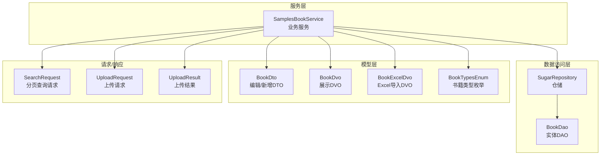
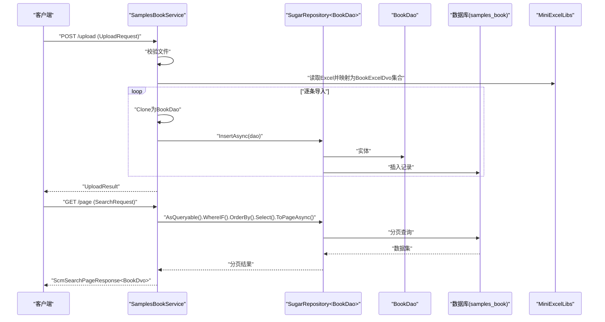
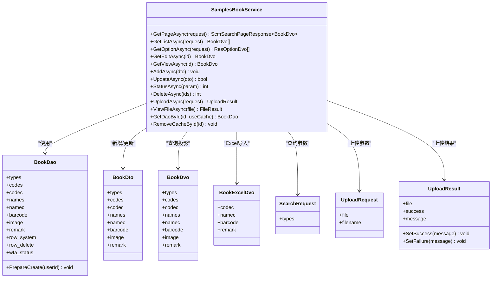
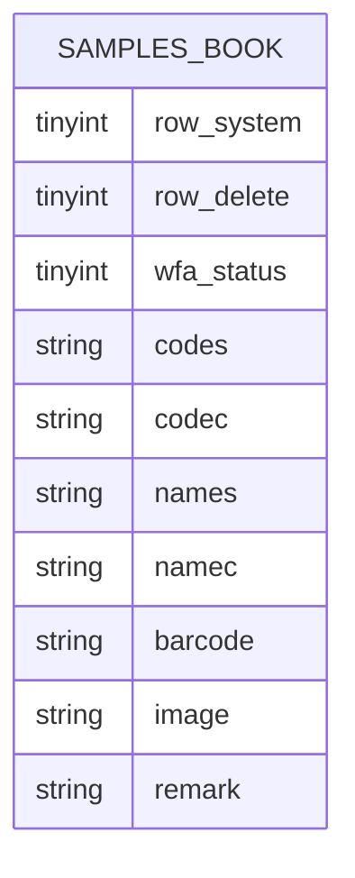
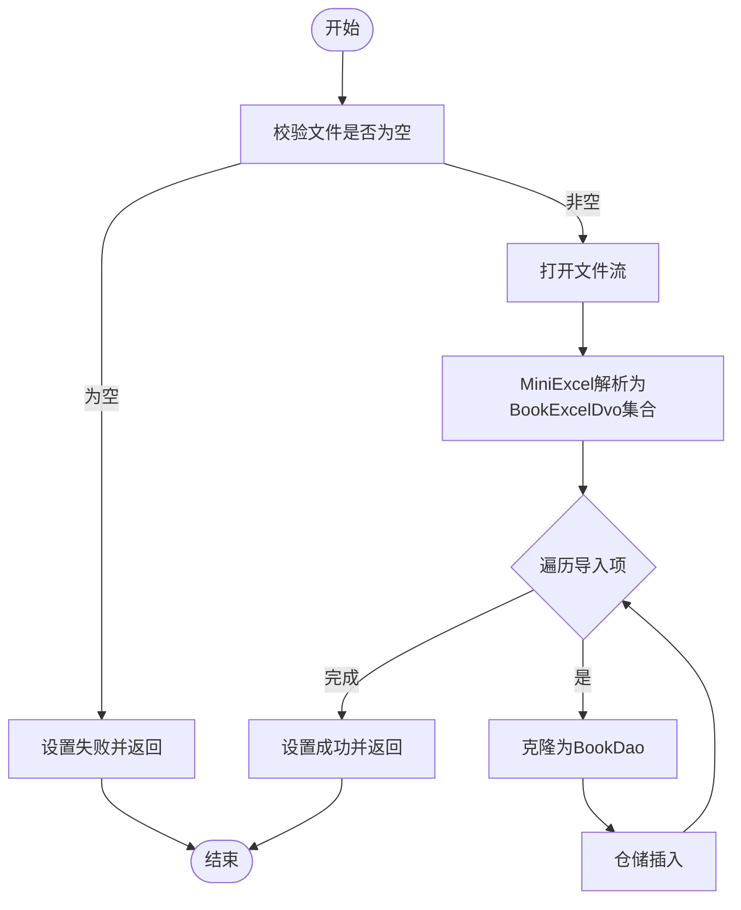
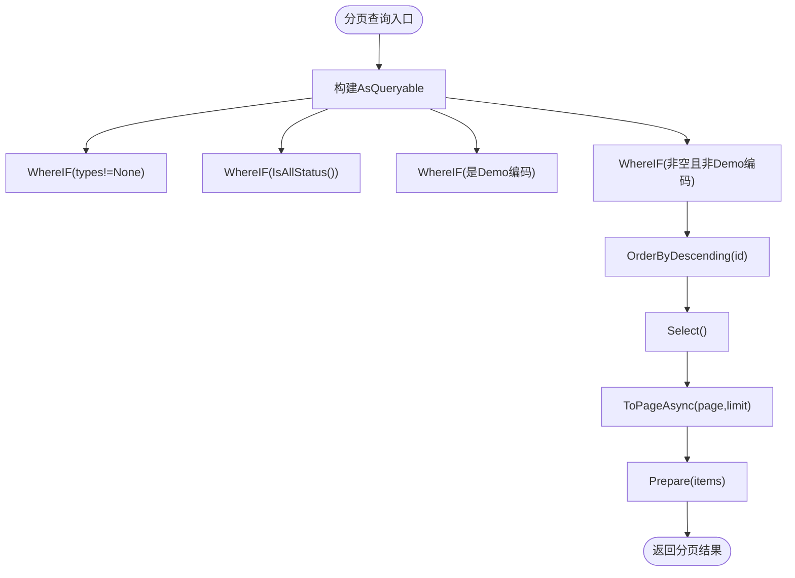
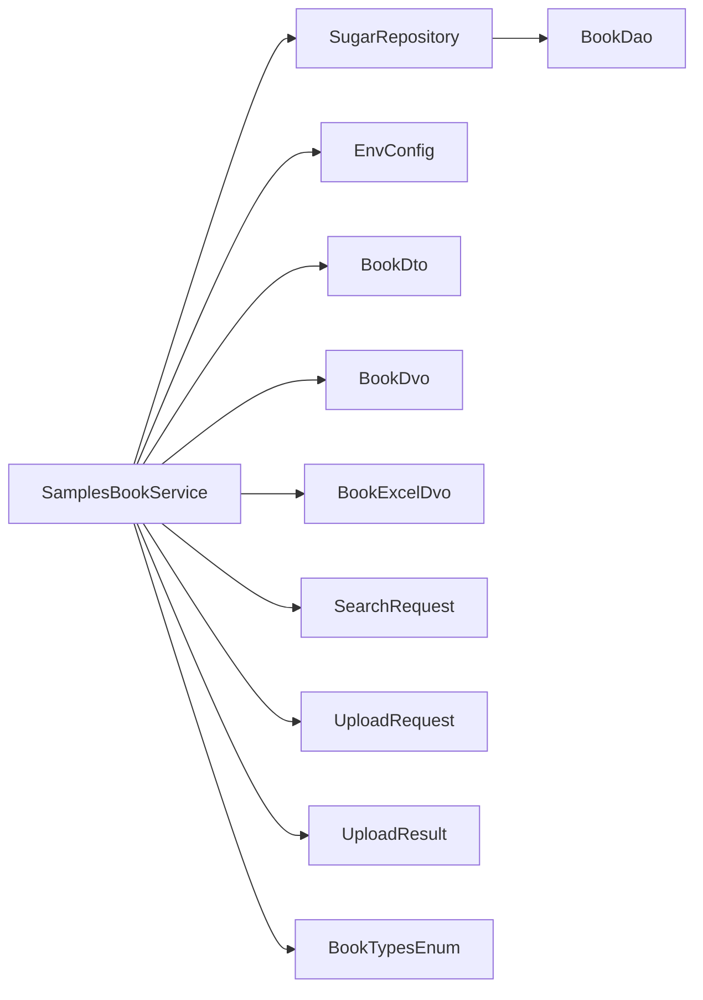

# 书籍管理样例

<cite>
**本文引用的文件**
- [SamplesBookService.cs](file://Samples.Server/Book/SamplesBookService.cs)
- [BookDao.cs](file://Samples.Server.Dao/Book/Dao/BookDao.cs)
- [BookDto.cs](file://Samples.Common.Dto/Book/Dto/BookDto.cs)
- [BookDvo.cs](file://Samples.Server/Book/Dvo/BookDvo.cs)
- [BookExcelDvo.cs](file://Samples.Server/Book/Dvo/BookExcelDvo.cs)
- [BookEnums.cs](file://Samples.Common/Book/Enums/BookEnums.cs)
- [SearchRequest.cs](file://Samples.Server/Book/Rnr/SearchRequest.cs)
- [UploadRequest.cs](file://Samples.Server/Book/Rnr/UploadRequest.cs)
- [UploadResult.cs](file://Samples.Server/Book/Rnr/UploadResult.cs)
- [IBookService.cs](file://Samples.Server/Book/IBookService.cs)
</cite>

## 目录
1. [简介](#简介)
2. [项目结构](#项目结构)
3. [核心组件](#核心组件)
4. [架构总览](#架构总览)
5. [详细组件分析](#详细组件分析)
6. [依赖关系分析](#依赖关系分析)
7. [性能考虑](#性能考虑)
8. [故障排查指南](#故障排查指南)
9. [结论](#结论)
10. [附录](#附录)

## 简介
本技术文档围绕“书籍管理样例”展开，系统性解析从数据模型、服务实现到 API 接口与 Excel 导入的完整链路。重点剖析 SamplesBookService 的实现方式，涵盖：
- 书籍信息的增删改查与分页查询
- 状态变更与批量操作
- 基于枚举的类型筛选
- Excel 导入与文件上传机制
- 缓存与数据一致性策略
- 可扩展的二次开发建议与最佳实践

## 项目结构
书籍管理样例采用分层清晰的组织方式：
- 数据访问层（DAO）：映射数据库表结构与约束
- 领域视图对象（DVO）：面向前端的展示模型
- 数据传输对象（DTO）：跨层传递的数据载体
- 服务层（Service）：业务逻辑与 API 实现
- 请求/响应模型（Rnr）：请求参数与返回结果封装
- 枚举类型（Enums）：领域状态与类型定义

图表来源
- [SamplesBookService.cs:1-283](file://Samples.Server/Book/SamplesBookService.cs#L1-L283)
- [BookDao.cs:1-102](file://Samples.Server.Dao/Book/Dao/BookDao.cs#L1-L102)
- [BookDto.cs:1-52](file://Samples.Common.Dto/Book/Dto/BookDto.cs#L1-L52)
- [BookDvo.cs:1-42](file://Samples.Server/Book/Dvo/BookDvo.cs#L1-L42)
- [BookExcelDvo.cs:1-29](file://Samples.Server/Book/Dvo/BookExcelDvo.cs#L1-L29)
- [BookEnums.cs:1-10](file://Samples.Common/Book/Enums/BookEnums.cs#L1-L10)
- [SearchRequest.cs:1-13](file://Samples.Server/Book/Rnr/SearchRequest.cs#L1-L13)
- [UploadRequest.cs:1-21](file://Samples.Server/Book/Rnr/UploadRequest.cs#L1-L21)
- [UploadResult.cs:1-23](file://Samples.Server/Book/Rnr/UploadResult.cs#L1-L23)

章节来源
- [SamplesBookService.cs:1-283](file://Samples.Server/Book/SamplesBookService.cs#L1-L283)
- [BookDao.cs:1-102](file://Samples.Server.Dao/Book/Dao/BookDao.cs#L1-L102)
- [BookDto.cs:1-52](file://Samples.Common.Dto/Book/Dto/BookDto.cs#L1-L52)
- [BookDvo.cs:1-42](file://Samples.Server/Book/Dvo/BookDvo.cs#L1-L42)
- [BookExcelDvo.cs:1-29](file://Samples.Server/Book/Dvo/BookExcelDvo.cs#L1-L29)
- [BookEnums.cs:1-10](file://Samples.Common/Book/Enums/BookEnums.cs#L1-L10)
- [SearchRequest.cs:1-13](file://Samples.Server/Book/Rnr/SearchRequest.cs#L1-L13)
- [UploadRequest.cs:1-21](file://Samples.Server/Book/Rnr/UploadRequest.cs#L1-L21)
- [UploadResult.cs:1-23](file://Samples.Server/Book/Rnr/UploadResult.cs#L1-L23)

## 核心组件
- 服务类：SamplesBookService 提供分页查询、列表查询、选项查询、编辑/查看读取、新增、更新、状态变更、删除、文件上传、文件查看等能力，并内置轻量内存缓存以提升读取性能。
- DAO 实体：BookDao 映射 samples_book 表，包含系统编码、业务编码、名称、条码、图片、备注及行级系统/删除/审批状态字段。
- DTO：BookDto 作为编辑/新增时的输入载体，包含长度校验与业务字段。
- DVO：BookDvo 作为对外展示的视图对象，包含常用展示字段。
- Excel 导入：BookExcelDvo 使用列名映射，配合 MiniExcelLibs 进行批量导入。
- 枚举：BookTypesEnum 定义书籍类型，SearchRequest 扩展分页查询请求以支持类型筛选。

章节来源
- [SamplesBookService.cs:1-283](file://Samples.Server/Book/SamplesBookService.cs#L1-L283)
- [BookDao.cs:1-102](file://Samples.Server.Dao/Book/Dao/BookDao.cs#L1-L102)
- [BookDto.cs:1-52](file://Samples.Common.Dto/Book/Dto/BookDto.cs#L1-L52)
- [BookDvo.cs:1-42](file://Samples.Server/Book/Dvo/BookDvo.cs#L1-L42)
- [BookExcelDvo.cs:1-29](file://Samples.Server/Book/Dvo/BookExcelDvo.cs#L1-L29)
- [BookEnums.cs:1-10](file://Samples.Common/Book/Enums/BookEnums.cs#L1-L10)
- [SearchRequest.cs:1-13](file://Samples.Server/Book/Rnr/SearchRequest.cs#L1-L13)

## 架构总览
下图展示了从控制器到服务、DAO、仓储与数据库的整体调用路径，以及 Excel 导入与文件上传的关键节点。

图表来源
- [SamplesBookService.cs:45-62](file://Samples.Server/Book/SamplesBookService.cs#L45-L62)
- [SamplesBookService.cs:200-241](file://Samples.Server/Book/SamplesBookService.cs#L200-L241)
- [BookDao.cs:13-102](file://Samples.Server.Dao/Book/Dao/BookDao.cs#L13-L102)

## 详细组件分析

### SamplesBookService 服务类
- 职责边界
  - 统一处理书籍的 CRUD、分页、状态变更、批量删除、Excel 导入与文件查看。
  - 封装查询条件（类型、状态、关键字），并支持 Demo 特定编码识别。
  - 提供轻量内存缓存（字典）以减少重复查询，同时提供按 ID 清理缓存的方法。
- 关键方法与流程
  - 分页查询：根据类型、状态、关键字动态拼接过滤条件，按主键倒序，投影为 DVO 并分页返回。
  - 列表查询：与分页类似，但不进行分页。
  - 选项查询：仅返回 id/label/value 三元组，便于前端下拉选择。
  - 编辑/查看读取：通过 AsQueryable 投影为 DVO 返回。
  - 新增：DTO 克隆为 DAO 后插入。
  - 更新：先检查业务唯一性（同编码不同主键），再克隆适配并更新，同时清理缓存。
  - 状态变更：委托通用更新方法批量变更状态。
  - 删除：委托通用删除方法批量删除。
  - Excel 导入：读取表单文件流，使用 MiniExcelLibs 解析为 BookExcelDvo 集合，逐条转换为 DAO 插入。
  - 文件查看：基于配置的上传目录读取文件并返回字节流。
- 错误处理
  - 对重复编码、无效记录等场景抛出业务异常，由上层统一拦截。
- 性能与缓存
  - 内置字典缓存 GetDaoById/RemoveCacheById，适合高频读取场景；注意在更新/删除后及时清理。

图表来源
- [SamplesBookService.cs:1-283](file://Samples.Server/Book/SamplesBookService.cs#L1-L283)
- [BookDao.cs:1-102](file://Samples.Server.Dao/Book/Dao/BookDao.cs#L1-L102)
- [BookDto.cs:1-52](file://Samples.Common.Dto/Book/Dto/BookDto.cs#L1-L52)
- [BookDvo.cs:1-42](file://Samples.Server/Book/Dvo/BookDvo.cs#L1-L42)
- [BookExcelDvo.cs:1-29](file://Samples.Server/Book/Dvo/BookExcelDvo.cs#L1-L29)
- [SearchRequest.cs:1-13](file://Samples.Server/Book/Rnr/SearchRequest.cs#L1-L13)
- [UploadRequest.cs:1-21](file://Samples.Server/Book/Rnr/UploadRequest.cs#L1-L21)
- [UploadResult.cs:1-23](file://Samples.Server/Book/Rnr/UploadResult.cs#L1-L23)

章节来源
- [SamplesBookService.cs:1-283](file://Samples.Server/Book/SamplesBookService.cs#L1-L283)

### 数据模型与枚举
- BookDao（数据库实体）
  - 字段覆盖业务编码、系统编码、名称、条码、图片、备注等，同时包含行级系统/删除/审批状态。
  - PrepareCreate 自动生成系统编码与默认系统名称。
- BookDto（输入 DTO）
  - 包含长度约束与业务字段，用于新增/更新。
- BookDvo（输出 DVO）
  - 面向前端展示的字段集合。
- BookExcelDvo（Excel 导入 DVO）
  - 使用列名映射，简化 Excel 到实体的转换。
- BookTypesEnum（书籍类型枚举）
  - 支持类型筛选与状态管理。

图表来源
- [BookDao.cs:13-102](file://Samples.Server.Dao/Book/Dao/BookDao.cs#L13-L102)

章节来源
- [BookDao.cs:1-102](file://Samples.Server.Dao/Book/Dao/BookDao.cs#L1-L102)
- [BookDto.cs:1-52](file://Samples.Common.Dto/Book/Dto/BookDto.cs#L1-L52)
- [BookDvo.cs:1-42](file://Samples.Server/Book/Dvo/BookDvo.cs#L1-L42)
- [BookExcelDvo.cs:1-29](file://Samples.Server/Book/Dvo/BookExcelDvo.cs#L1-L29)
- [BookEnums.cs:1-10](file://Samples.Common/Book/Enums/BookEnums.cs#L1-L10)

### Excel 导入与文件上传
- Excel 导入
  - 通过表单文件流读取 Excel，使用 MiniExcelLibs 的 Query<T>() 将指定列映射为 BookExcelDvo 集合，逐条克隆为 BookDao 并插入。
- 文件上传
  - UploadAsync 接收 IFormFile，进行空值校验；当前示例未持久化文件，但保留了保存逻辑注释，便于扩展。
- 文件查看
  - ViewFileAsync 依据配置的上传路径读取文件并返回字节流。

图表来源
- [SamplesBookService.cs:200-241](file://Samples.Server/Book/SamplesBookService.cs#L200-L241)
- [BookExcelDvo.cs:1-29](file://Samples.Server/Book/Dvo/BookExcelDvo.cs#L1-L29)

章节来源
- [SamplesBookService.cs:200-241](file://Samples.Server/Book/SamplesBookService.cs#L200-L241)
- [UploadRequest.cs:1-21](file://Samples.Server/Book/Rnr/UploadRequest.cs#L1-L21)
- [UploadResult.cs:1-23](file://Samples.Server/Book/Rnr/UploadResult.cs#L1-L23)

### 分页查询与状态管理
- 分页查询
  - 动态拼接 WhereIF 条件：类型、状态、关键字（支持 Demo 特定编码识别）、模糊匹配 codec/names。
  - 按 id 倒序排序，投影为 BookDvo，使用 ToPageAsync 实现分页。
- 状态管理
  - 通过 ScmChangeStatusRequest 接收 ids 与目标状态，委托通用方法批量更新。
- 选项查询
  - 返回 id/label/value 三元组，便于前端下拉选择。

图表来源
- [SamplesBookService.cs:45-62](file://Samples.Server/Book/SamplesBookService.cs#L45-L62)
- [SearchRequest.cs:1-13](file://Samples.Server/Book/Rnr/SearchRequest.cs#L1-L13)

章节来源
- [SamplesBookService.cs:45-62](file://Samples.Server/Book/SamplesBookService.cs#L45-L62)
- [SamplesBookService.cs:99-110](file://Samples.Server/Book/SamplesBookService.cs#L99-L110)
- [SearchRequest.cs:1-13](file://Samples.Server/Book/Rnr/SearchRequest.cs#L1-L13)

## 依赖关系分析
- 服务层依赖
  - SamplesBookService 依赖 SugarRepository<BookDao> 进行数据访问，依赖 EnvConfig 获取上传路径，依赖 IResHolder（构造注入但未在代码中使用）。
- 模型依赖
  - 服务层与 DTO/DAO/DVO/ExcelDvo 之间通过 Clone/Adapt 投影与转换。
- 外部库
  - MiniExcelLibs：Excel 解析与导入。
  - SqlSugar：仓储与 ORM 能力。
- 枚举与请求
  - BookTypesEnum 与 SearchRequest 扩展用于查询条件。

图表来源
- [SamplesBookService.cs:1-283](file://Samples.Server/Book/SamplesBookService.cs#L1-L283)
- [BookDao.cs:1-102](file://Samples.Server.Dao/Book/Dao/BookDao.cs#L1-L102)
- [BookDto.cs:1-52](file://Samples.Common.Dto/Book/Dto/BookDto.cs#L1-L52)
- [BookDvo.cs:1-42](file://Samples.Server/Book/Dvo/BookDvo.cs#L1-L42)
- [BookExcelDvo.cs:1-29](file://Samples.Server/Book/Dvo/BookExcelDvo.cs#L1-L29)
- [BookEnums.cs:1-10](file://Samples.Common/Book/Enums/BookEnums.cs#L1-L10)
- [SearchRequest.cs:1-13](file://Samples.Server/Book/Rnr/SearchRequest.cs#L1-L13)
- [UploadRequest.cs:1-21](file://Samples.Server/Book/Rnr/UploadRequest.cs#L1-L21)
- [UploadResult.cs:1-23](file://Samples.Server/Book/Rnr/UploadResult.cs#L1-L23)

章节来源
- [SamplesBookService.cs:1-283](file://Samples.Server/Book/SamplesBookService.cs#L1-L283)

## 性能考虑
- 查询性能
  - 使用 WhereIF 动态拼接条件，避免不必要的过滤。
  - 按主键倒序排序，有利于分页稳定性。
  - 投影为 DVO 减少序列化字段数量。
- 缓存策略
  - 内置字典缓存 GetDaoById/RemoveCacheById，适合高频读取场景；注意在更新/删除后及时清理，避免脏读。
- 导入性能
  - Excel 导入逐条插入，建议在大批量场景下结合事务或批量写入策略（可扩展）。
- IO 与上传
  - 当前示例未持久化上传文件，若启用文件存储，建议使用异步 IO 与流式处理，避免大文件占用过多内存。

## 故障排查指南
- 重复编码
  - 更新时若发现同编码已存在，会抛出业务异常；请检查输入编码是否唯一。
- 无效记录
  - 更新或删除不存在的记录会触发业务异常；请确认主键或查询条件。
- Excel 导入失败
  - 若列名不匹配或数据格式错误，MiniExcel 解析可能失败；请核对模板列名与数据类型。
- 文件上传
  - 未上传文件或文件为空时返回失败；请检查前端表单字段与文件选择。
- 缓存不一致
  - 更新/删除后需调用 RemoveCacheById 或等待下次重建；否则可能出现读取旧数据。

章节来源
- [SamplesBookService.cs:156-172](file://Samples.Server/Book/SamplesBookService.cs#L156-L172)
- [SamplesBookService.cs:200-241](file://Samples.Server/Book/SamplesBookService.cs#L200-L241)

## 结论
该样例以清晰的分层与简洁的实现展示了书籍管理的完整闭环：从数据模型、服务逻辑到 API 与导入机制。SamplesBookService 在保证可维护性的同时，提供了良好的扩展点（如文件存储、批量导入优化、缓存策略细化）。开发者可在此基础上快速二次开发，满足更复杂的业务需求。

## 附录
- 二次开发建议
  - 文件存储：启用文件上传持久化，结合 EnvConfig 的上传路径与安全策略。
  - 批量导入：引入事务与批量写入，提升导入吞吐量。
  - 缓存：结合分布式缓存（如 Redis）替代本地字典，提升多实例一致性。
  - 审计与日志：在 PrepareCreate/Update 中补充审计字段与日志记录。
  - 分页索引：为高频查询字段建立合适索引，优化分页性能。
- 最佳实践
  - 输入校验：在 DTO 层完善验证规则，减少无效请求进入服务层。
  - 异常处理：统一异常拦截与错误码规范，便于前端提示与定位问题。
  - 接口命名：保持 API 命名一致性，明确资源与动作语义。
  - 文档与契约：结合 Swagger 输出接口文档，确保前后端协作顺畅。