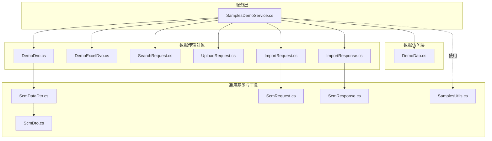
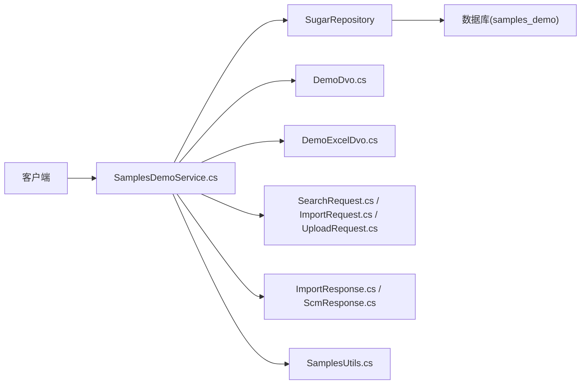
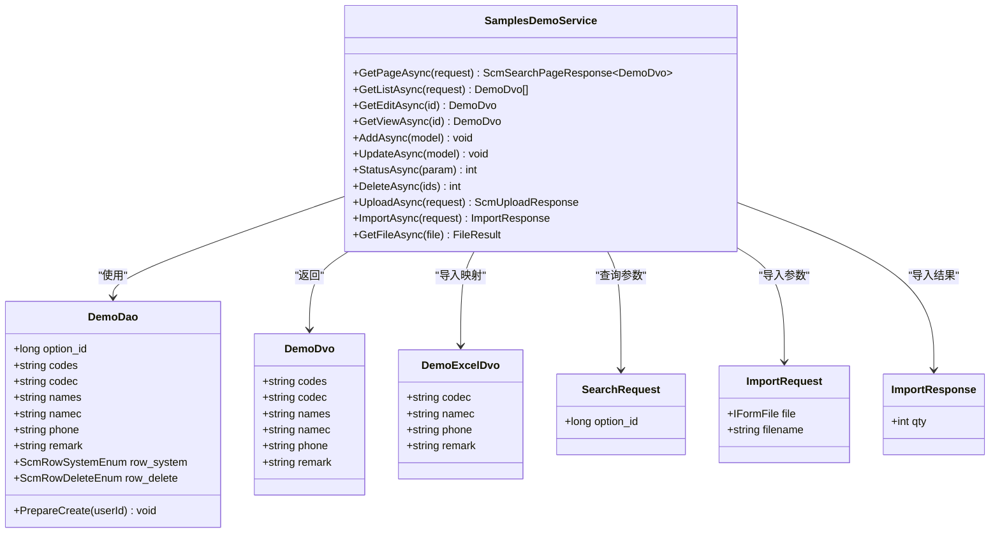
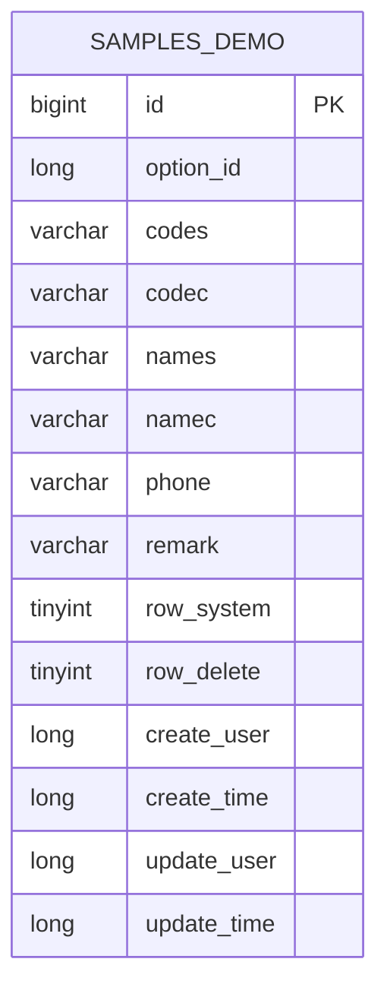
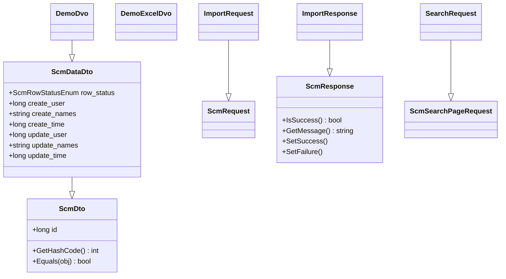
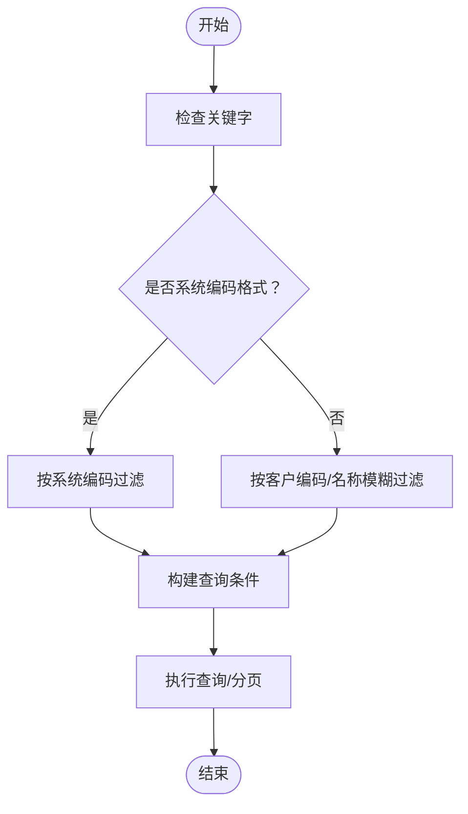
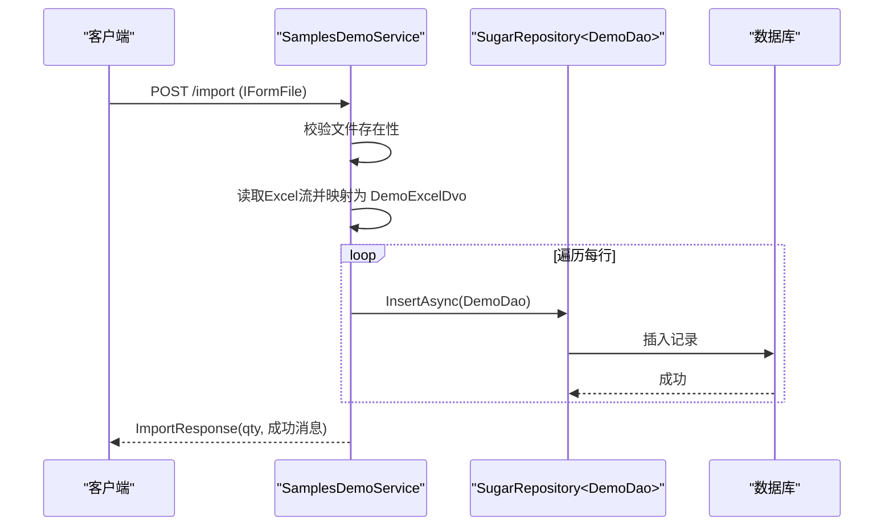
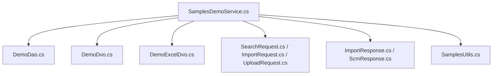

# 演示样例

<cite>
**本文引用的文件**
- [SamplesDemoService.cs](file://Samples.Server/Demo/SamplesDemoService.cs)
- [DemoDvo.cs](file://Samples.Server/Demo/Dvo/DemoDvo.cs)
- [DemoExcelDvo.cs](file://Samples.Server/Demo/Dvo/DemoExcelDvo.cs)
- [SearchRequest.cs](file://Samples.Server/Demo/Dvo/SearchRequest.cs)
- [UploadRequest.cs](file://Samples.Server/Demo/Dvo/UploadRequest.cs)
- [ImportRequest.cs](file://Samples.Server/Demo/Dvo/ImportRequest.cs)
- [ImportResponse.cs](file://Samples.Server/Demo/Dvo/ImportResponse.cs)
- [DemoDao.cs](file://Samples.Server.Dao/Demo/DemoDao.cs)
- [SamplesUtils.cs](file://Samples.Common/SamplesUtils.cs)
- [ScmDataDto.cs](file://Scm.Common.Dto/Dto/ScmDataDto.cs)
- [ScmDto.cs](file://Scm.Common.Dto/Dto/ScmDto.cs)
- [ScmRequest.cs](file://Scm.Common.Dto/Request/ScmRequest.cs)
- [ScmResponse.cs](file://Scm.Common.Dto/Response/ScmResponse.cs)
</cite>

## 目录
1. [简介](#简介)
2. [项目结构](#项目结构)
3. [核心组件](#核心组件)
4. [架构总览](#架构总览)
5. [详细组件分析](#详细组件分析)
6. [依赖关系分析](#依赖关系分析)
7. [性能考虑](#性能考虑)
8. [故障排查指南](#故障排查指南)
9. [结论](#结论)
10. [附录](#附录)

## 简介
本文件面向“演示样例”的开发与复用，目标是为其他业务样例提供可直接套用的模板与最佳实践。文档围绕 SamplesDemoService 的通用能力展开，包括：
- 基础 CRUD 操作（新增、编辑、查看、更新、批量状态变更、批量删除）
- 分页查询与列表查询
- Excel 导入与文件上传/下载
- 数据传输对象（DTO）与 Dvo 的设计原则
- 请求/响应模型与业务验证机制
- 快速构建同类业务样例的方法与扩展建议

## 项目结构
演示样例采用“服务层 + DAO 层 + DTO/Dvo + 工具类”的分层组织方式，遵循“以服务为中心”的控制器/服务模式，便于扩展与维护。

图表来源
- [SamplesDemoService.cs:1-247](file://Samples.Server/Demo/SamplesDemoService.cs#L1-L247)
- [DemoDao.cs:1-89](file://Samples.Server.Dao/Demo/DemoDao.cs#L1-L89)
- [DemoDvo.cs:1-33](file://Samples.Server/Demo/Dvo/DemoDvo.cs#L1-L33)
- [DemoExcelDvo.cs:1-29](file://Samples.Server/Demo/Dvo/DemoExcelDvo.cs#L1-L29)
- [SearchRequest.cs:1-13](file://Samples.Server/Demo/Dvo/SearchRequest.cs#L1-L13)
- [UploadRequest.cs:1-26](file://Samples.Server/Demo/Dvo/UploadRequest.cs#L1-L26)
- [ImportRequest.cs:1-19](file://Samples.Server/Demo/Dvo/ImportRequest.cs#L1-L19)
- [ImportResponse.cs:1-11](file://Samples.Server/Demo/Dvo/ImportResponse.cs#L1-L11)
- [ScmDto.cs:1-30](file://Scm.Common.Dto/Dto/ScmDto.cs#L1-L30)
- [ScmDataDto.cs:1-19](file://Scm.Common.Dto/Dto/ScmDataDto.cs#L1-L19)
- [ScmRequest.cs:1-7](file://Scm.Common.Dto/Request/ScmRequest.cs#L1-L7)
- [ScmResponse.cs:1-109](file://Scm.Common.Dto/Response/ScmResponse.cs#L1-L109)
- [SamplesUtils.cs:1-13](file://Samples.Common/SamplesUtils.cs#L1-L13)

章节来源
- [SamplesDemoService.cs:1-247](file://Samples.Server/Demo/SamplesDemoService.cs#L1-L247)
- [DemoDao.cs:1-89](file://Samples.Server.Dao/Demo/DemoDao.cs#L1-L89)
- [DemoDvo.cs:1-33](file://Samples.Server/Demo/Dvo/DemoDvo.cs#L1-L33)
- [DemoExcelDvo.cs:1-29](file://Samples.Server/Demo/Dvo/DemoExcelDvo.cs#L1-L29)
- [SearchRequest.cs:1-13](file://Samples.Server/Demo/Dvo/SearchRequest.cs#L1-L13)
- [UploadRequest.cs:1-26](file://Samples.Server/Demo/Dvo/UploadRequest.cs#L1-L26)
- [ImportRequest.cs:1-19](file://Samples.Server/Demo/Dvo/ImportRequest.cs#L1-L19)
- [ImportResponse.cs:1-11](file://Samples.Server/Demo/Dvo/ImportResponse.cs#L1-L11)
- [ScmDto.cs:1-30](file://Scm.Common.Dto/Dto/ScmDto.cs#L1-L30)
- [ScmDataDto.cs:1-19](file://Scm.Common.Dto/Dto/ScmDataDto.cs#L1-L19)
- [ScmRequest.cs:1-7](file://Scm.Common.Dto/Request/ScmRequest.cs#L1-L7)
- [ScmResponse.cs:1-109](file://Scm.Common.Dto/Response/ScmResponse.cs#L1-L109)
- [SamplesUtils.cs:1-13](file://Samples.Common/SamplesUtils.cs#L1-L13)

## 核心组件
- 服务层：SamplesDemoService 提供分页查询、列表查询、编辑/查看读取、新增、更新、批量状态变更、批量删除、文件上传、Excel 导入、文件下载等能力。
- 数据访问层：DemoDao 定义实体字段、约束与创建时的默认值生成逻辑。
- 数据传输对象：DemoDvo 用于对外返回；DemoExcelDvo 用于 Excel 列名映射；SearchRequest/UploadRequest/ImportRequest/ImportResponse 用于请求与响应建模。
- 通用基类：ScmDto/ScmDataDto/ScmRequest/ScmResponse 提供统一的数据契约与响应模型。
- 工具类：SamplesUtils 提供业务规则校验（如编码格式）。

章节来源
- [SamplesDemoService.cs:1-247](file://Samples.Server/Demo/SamplesDemoService.cs#L1-L247)
- [DemoDao.cs:1-89](file://Samples.Server.Dao/Demo/DemoDao.cs#L1-L89)
- [DemoDvo.cs:1-33](file://Samples.Server/Demo/Dvo/DemoDvo.cs#L1-L33)
- [DemoExcelDvo.cs:1-29](file://Samples.Server/Demo/Dvo/DemoExcelDvo.cs#L1-L29)
- [SearchRequest.cs:1-13](file://Samples.Server/Demo/Dvo/SearchRequest.cs#L1-L13)
- [UploadRequest.cs:1-26](file://Samples.Server/Demo/Dvo/UploadRequest.cs#L1-L26)
- [ImportRequest.cs:1-19](file://Samples.Server/Demo/Dvo/ImportRequest.cs#L1-L19)
- [ImportResponse.cs:1-11](file://Samples.Server/Demo/Dvo/ImportResponse.cs#L1-L11)
- [ScmDto.cs:1-30](file://Scm.Common.Dto/Dto/ScmDto.cs#L1-L30)
- [ScmDataDto.cs:1-19](file://Scm.Common.Dto/Dto/ScmDataDto.cs#L1-L19)
- [ScmRequest.cs:1-7](file://Scm.Common.Dto/Request/ScmRequest.cs#L1-L7)
- [ScmResponse.cs:1-109](file://Scm.Common.Dto/Response/ScmResponse.cs#L1-L109)
- [SamplesUtils.cs:1-13](file://Samples.Common/SamplesUtils.cs#L1-L13)

## 架构总览
演示样例遵循“服务层聚合业务流程、DAO 负责数据持久化、DTO/Dvo 负责数据传输”的分层架构。服务层通过 SugarRepository 访问 DAO，使用 ScmResponse/ScmSearchPageResponse 统一响应模型，结合 ScmUploadRequest/ScmUploadResponse 实现文件上传与下载。

图表来源
- [SamplesDemoService.cs:1-247](file://Samples.Server/Demo/SamplesDemoService.cs#L1-L247)
- [DemoDao.cs:1-89](file://Samples.Server.Dao/Demo/DemoDao.cs#L1-L89)
- [DemoDvo.cs:1-33](file://Samples.Server/Demo/Dvo/DemoDvo.cs#L1-L33)
- [DemoExcelDvo.cs:1-29](file://Samples.Server/Demo/Dvo/DemoExcelDvo.cs#L1-L29)
- [SearchRequest.cs:1-13](file://Samples.Server/Demo/Dvo/SearchRequest.cs#L1-L13)
- [ImportRequest.cs:1-19](file://Samples.Server/Demo/Dvo/ImportRequest.cs#L1-L19)
- [UploadRequest.cs:1-26](file://Samples.Server/Demo/Dvo/UploadRequest.cs#L1-L26)
- [ImportResponse.cs:1-11](file://Samples.Server/Demo/Dvo/ImportResponse.cs#L1-L11)
- [ScmResponse.cs:1-109](file://Scm.Common.Dto/Response/ScmResponse.cs#L1-L109)
- [SamplesUtils.cs:1-13](file://Samples.Common/SamplesUtils.cs#L1-L13)

## 详细组件分析

### 服务层：SamplesDemoService
- 分页查询与列表查询：支持按关键字、状态、option_id 过滤，支持排序与分页。
- 编辑/查看读取：分别提供编辑态与只读态的数据读取。
- 新增/更新：基于 DemoDto 克隆为 DemoDao 并执行插入/更新。
- 批量状态变更/批量删除：封装通用更新状态与删除逻辑。
- 文件上传：接收 IFormFile，写入配置路径，返回 ScmUploadResponse。
- Excel 导入：读取 Excel 流，映射为 DemoExcelDvo，逐条插入 DemoDao。
- 文件下载：根据文件名读取本地文件并返回字节流。

图表来源
- [SamplesDemoService.cs:1-247](file://Samples.Server/Demo/SamplesDemoService.cs#L1-L247)
- [DemoDao.cs:1-89](file://Samples.Server.Dao/Demo/DemoDao.cs#L1-L89)
- [DemoDvo.cs:1-33](file://Samples.Server/Demo/Dvo/DemoDvo.cs#L1-L33)
- [DemoExcelDvo.cs:1-29](file://Samples.Server/Demo/Dvo/DemoExcelDvo.cs#L1-L29)
- [SearchRequest.cs:1-13](file://Samples.Server/Demo/Dvo/SearchRequest.cs#L1-L13)
- [ImportRequest.cs:1-19](file://Samples.Server/Demo/Dvo/ImportRequest.cs#L1-L19)
- [ImportResponse.cs:1-11](file://Samples.Server/Demo/Dvo/ImportResponse.cs#L1-L11)

章节来源
- [SamplesDemoService.cs:38-55](file://Samples.Server/Demo/SamplesDemoService.cs#L38-L55)
- [SamplesDemoService.cs:62-75](file://Samples.Server/Demo/SamplesDemoService.cs#L62-L75)
- [SamplesDemoService.cs:93-114](file://Samples.Server/Demo/SamplesDemoService.cs#L93-L114)
- [SamplesDemoService.cs:121-134](file://Samples.Server/Demo/SamplesDemoService.cs#L121-L134)
- [SamplesDemoService.cs:141-155](file://Samples.Server/Demo/SamplesDemoService.cs#L141-L155)
- [SamplesDemoService.cs:163-191](file://Samples.Server/Demo/SamplesDemoService.cs#L163-L191)
- [SamplesDemoService.cs:199-227](file://Samples.Server/Demo/SamplesDemoService.cs#L199-L227)
- [SamplesDemoService.cs:235-244](file://Samples.Server/Demo/SamplesDemoService.cs#L235-L244)

### 数据访问层：DemoDao
- 表映射：samples_demo
- 字段与约束：包含系统编码、客户编码、名称、电话、备注等字段，并设置长度与必填约束。
- 默认值与生成策略：新增时自动设置 row_delete 与 codes；若 names 为空则回退为 namec。

图表来源
- [DemoDao.cs:12-89](file://Samples.Server.Dao/Demo/DemoDao.cs#L12-L89)

章节来源
- [DemoDao.cs:12-89](file://Samples.Server.Dao/Demo/DemoDao.cs#L12-L89)

### 数据传输对象与请求/响应模型
- DemoDvo：对外返回的领域视图对象，继承自 ScmDataDto，包含基础审计信息。
- DemoExcelDvo：Excel 导入映射对象，使用列名特性进行字段映射。
- SearchRequest：分页查询请求，扩展 option_id 条件。
- ImportRequest/ImportResponse：导入请求与响应，包含文件与导入数量。
- UploadRequest：上传请求，包含路径、文件与文件名。
- 基类模型：ScmDto/ScmDataDto/ScmRequest/ScmResponse 提供统一的数据契约与响应语义。

图表来源
- [ScmDto.cs:1-30](file://Scm.Common.Dto/Dto/ScmDto.cs#L1-L30)
- [ScmDataDto.cs:1-19](file://Scm.Common.Dto/Dto/ScmDataDto.cs#L1-L19)
- [ScmRequest.cs:1-7](file://Scm.Common.Dto/Request/ScmRequest.cs#L1-L7)
- [ScmResponse.cs:1-109](file://Scm.Common.Dto/Response/ScmResponse.cs#L1-L109)
- [DemoDvo.cs:1-33](file://Samples.Server/Demo/Dvo/DemoDvo.cs#L1-L33)
- [DemoExcelDvo.cs:1-29](file://Samples.Server/Demo/Dvo/DemoExcelDvo.cs#L1-L29)
- [SearchRequest.cs:1-13](file://Samples.Server/Demo/Dvo/SearchRequest.cs#L1-L13)
- [ImportRequest.cs:1-19](file://Samples.Server/Demo/Dvo/ImportRequest.cs#L1-L19)
- [ImportResponse.cs:1-11](file://Samples.Server/Demo/Dvo/ImportResponse.cs#L1-L11)

章节来源
- [DemoDvo.cs:5-31](file://Samples.Server/Demo/Dvo/DemoDvo.cs#L5-L31)
- [DemoExcelDvo.cs:5-27](file://Samples.Server/Demo/Dvo/DemoExcelDvo.cs#L5-L27)
- [SearchRequest.cs:8-11](file://Samples.Server/Demo/Dvo/SearchRequest.cs#L8-L11)
- [ImportRequest.cs:7-17](file://Samples.Server/Demo/Dvo/ImportRequest.cs#L7-L17)
- [ImportResponse.cs:6-9](file://Samples.Server/Demo/Dvo/ImportResponse.cs#L6-L9)
- [ScmDto.cs:6-27](file://Scm.Common.Dto/Dto/ScmDto.cs#L6-L27)
- [ScmDataDto.cs:5-18](file://Scm.Common.Dto/Dto/ScmDataDto.cs#L5-L18)
- [ScmRequest.cs:3-5](file://Scm.Common.Dto/Request/ScmRequest.cs#L3-L5)
- [ScmResponse.cs:3-107](file://Scm.Common.Dto/Response/ScmResponse.cs#L3-L107)

### 业务验证与规则
- 编码格式校验：通过 SamplesUtils.IsDemoCodes 判断是否为系统编码格式。
- 字段长度与必填：DemoDao 对关键字段设置长度与必填约束。
- 状态与删除标记：统一使用 ScmRowStatusEnum/ScmRowDeleteEnum 控制状态与软删除。

图表来源
- [SamplesDemoService.cs:40-51](file://Samples.Server/Demo/SamplesDemoService.cs#L40-L51)
- [SamplesUtils.cs:7-10](file://Samples.Common/SamplesUtils.cs#L7-L10)

章节来源
- [SamplesDemoService.cs:40-51](file://Samples.Server/Demo/SamplesDemoService.cs#L40-L51)
- [SamplesUtils.cs:7-10](file://Samples.Common/SamplesUtils.cs#L7-L10)
- [DemoDao.cs:23-59](file://Samples.Server.Dao/Demo/DemoDao.cs#L23-L59)

### API 调用序列（示例：Excel 导入）

图表来源
- [SamplesDemoService.cs:199-227](file://Samples.Server/Demo/SamplesDemoService.cs#L199-L227)
- [DemoDao.cs:12-89](file://Samples.Server.Dao/Demo/DemoDao.cs#L12-L89)

章节来源
- [SamplesDemoService.cs:199-227](file://Samples.Server/Demo/SamplesDemoService.cs#L199-L227)

## 依赖关系分析
- 服务层依赖 DAO 层与通用响应模型，避免直接操作数据库。
- DTO/Dvo 与基类解耦，便于扩展与复用。
- 工具类 SamplesUtils 仅承担规则校验，保持无副作用。

图表来源
- [SamplesDemoService.cs:1-247](file://Samples.Server/Demo/SamplesDemoService.cs#L1-L247)
- [DemoDao.cs:1-89](file://Samples.Server.Dao/Demo/DemoDao.cs#L1-L89)
- [DemoDvo.cs:1-33](file://Samples.Server/Demo/Dvo/DemoDvo.cs#L1-L33)
- [DemoExcelDvo.cs:1-29](file://Samples.Server/Demo/Dvo/DemoExcelDvo.cs#L1-L29)
- [SearchRequest.cs:1-13](file://Samples.Server/Demo/Dvo/SearchRequest.cs#L1-L13)
- [ImportRequest.cs:1-19](file://Samples.Server/Demo/Dvo/ImportRequest.cs#L1-L19)
- [ImportResponse.cs:1-11](file://Samples.Server/Demo/Dvo/ImportResponse.cs#L1-L11)
- [ScmResponse.cs:1-109](file://Scm.Common.Dto/Response/ScmResponse.cs#L1-L109)
- [SamplesUtils.cs:1-13](file://Samples.Common/SamplesUtils.cs#L1-L13)

章节来源
- [SamplesDemoService.cs:1-247](file://Samples.Server/Demo/SamplesDemoService.cs#L1-L247)

## 性能考虑
- 查询优化：使用 WhereIF 动态拼接条件，避免不必要的数据库往返；对高频字段建立索引（如 codes、codec、names）。
- 分页与排序：优先在数据库侧完成排序与分页，减少内存压力。
- Excel 导入：批量插入建议使用事务或批量写入以提升吞吐。
- 文件上传：限制文件大小与类型，使用流式处理避免内存峰值。

## 故障排查指南
- 上传/导入失败：检查文件是否存在、文件类型与大小限制、存储路径权限。
- 查询无结果：确认关键字匹配规则（系统编码优先于模糊匹配）、状态与 option_id 条件。
- 导入数量异常：核对 Excel 列名映射与 DemoExcelDvo 的属性一致性。
- 删除/状态变更未生效：确认 ids 格式与权限校验。

章节来源
- [SamplesDemoService.cs:168-172](file://Samples.Server/Demo/SamplesDemoService.cs#L168-L172)
- [SamplesDemoService.cs:204-208](file://Samples.Server/Demo/SamplesDemoService.cs#L204-L208)
- [DemoExcelDvo.cs:10-26](file://Samples.Server/Demo/Dvo/DemoExcelDvo.cs#L10-L26)

## 结论
演示样例通过清晰的分层与统一的 DTO/Dvo/响应模型，提供了可复用的 CRUD、Excel 导入与文件上传下载能力。其设计遵循“以服务为中心”的架构思想，便于扩展与维护。开发者可据此模板快速搭建类似业务场景，并按需扩展验证规则、权限控制与日志审计。

## 附录
- 快速构建步骤
  1) 定义实体与表映射（DemoDao），设置字段约束与默认值。
  2) 定义 Dvo（DemoDvo）与 Excel 映射（DemoExcelDvo）。
  3) 定义请求/响应模型（SearchRequest、ImportRequest、ImportResponse、UploadRequest）。
  4) 在服务层实现查询、CRUD、导入、上传、下载等方法。
  5) 使用 ScmResponse 统一返回，确保前后端一致的交互体验。
- 扩展建议
  - 引入审计日志与操作追踪。
  - 增加幂等性与并发控制（如导入去重）。
  - 将文件存储抽象为可插拔的存储后端（本地/云存储）。
  - 引入单元测试与集成测试覆盖关键流程。