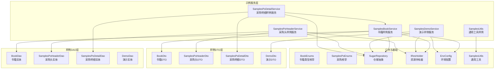
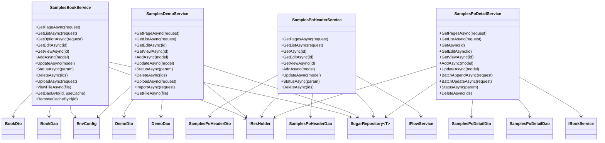
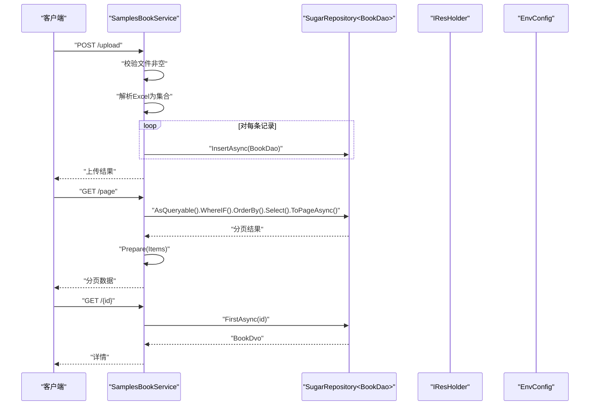
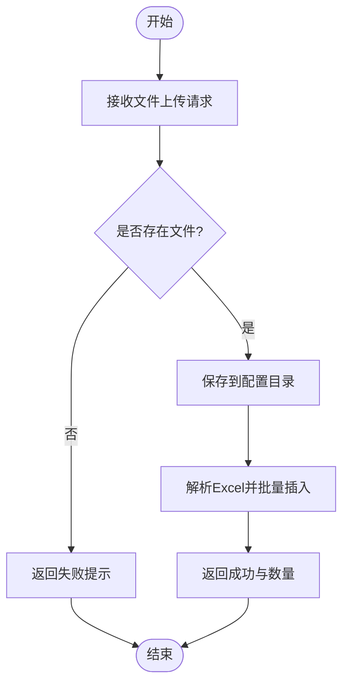
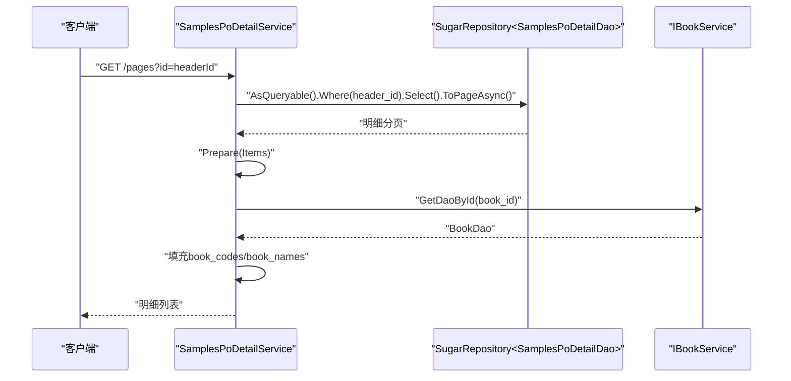
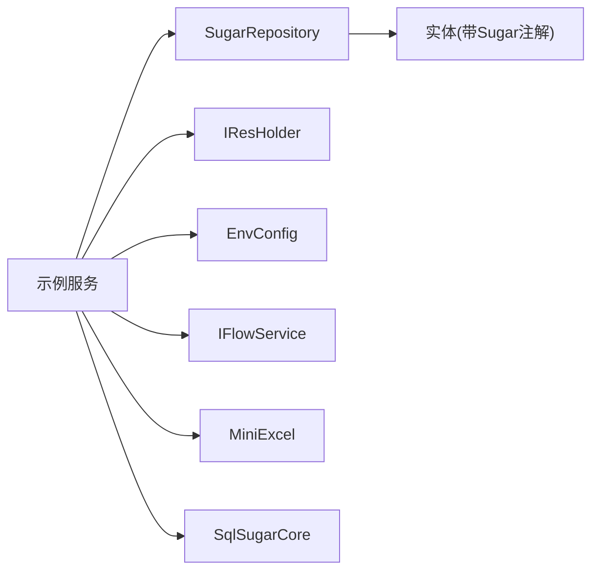

# 示例项目

<cite>
**本文引用的文件**
- [Samples.Server.csproj](file://Samples.Server/Samples.Server.csproj)
- [Samples.Common.csproj](file://Samples.Common/Samples.Common.csproj)
- [Samples.Common.Dto.csproj](file://Samples.Common.Dto/Samples.Common.Dto.csproj)
- [Samples.Server.Dao.csproj](file://Samples.Server.Dao/Samples.Server.Dao.csproj)
- [IBookService.cs](file://Samples.Server/Book/IBookService.cs)
- [SamplesBookService.cs](file://Samples.Server/Book/SamplesBookService.cs)
- [BookDvo.cs](file://Samples.Server/Book/Dvo/BookDvo.cs)
- [BookExcelDvo.cs](file://Samples.Server/Book/Dvo/BookExcelDvo.cs)
- [BookDao.cs](file://Samples.Server.Dao/Book/Dao/BookDao.cs)
- [BookDto.cs](file://Samples.Common.Dto/Book/Dto/BookDto.cs)
- [BookEnums.cs](file://Samples.Common/Book/Enums/BookEnums.cs)
- [SearchRequest.cs](file://Samples.Server/Book/Rnr/SearchRequest.cs)
- [SamplesDemoService.cs](file://Samples.Server/Demo/SamplesDemoService.cs)
- [DemoDvo.cs](file://Samples.Server/Demo/Dvo/DemoDvo.cs)
- [DemoExcelDvo.cs](file://Samples.Server/Demo/Dvo/DemoExcelDvo.cs)
- [DemoDao.cs](file://Samples.Server.Dao/Demo/Dao/DemoDao.cs)
- [DemoDto.cs](file://Samples.Common.Dto/Demo/DemoDto.cs)
- [SamplesPoHeaderService.cs](file://Samples.Server/PoHeader/SamplesPoHeaderService.cs)
- [SamplesPoDetailService.cs](file://Samples.Server/PoDetail/SamplesPoDetailService.cs)
- [SamplesPoDetailDvo.cs](file://Samples.Server/PoDetail/Dvo/SamplesPoDetailDvo.cs)
- [SamplesPoHeaderDao.cs](file://Samples.Server.Dao/PoHeader/Dao/SamplesPoHeaderDao.cs)
- [SamplesPoDetailDao.cs](file://Samples.Server.Dao/PoDetail/Dao/SamplesPoDetailDao.cs)
- [SamplesPoHeaderDto.cs](file://Samples.Common.Dto/PoHeader/Dto/SamplesPoHeaderDto.cs)
- [SamplesPoDetailDto.cs](file://Samples.Common.Dto/PoDetail/Dto/SamplesPoDetailDto.cs)
- [BatchAppendRequest.cs](file://Samples.Common.Dto/PoDetail/Dto/BatchAppendRequest.cs)
- [BatchUpdateRequest.cs](file://Samples.Common.Dto/PoDetail/Dto/BatchUpdateRequest.cs)
- [SamplesPoEnums.cs](file://Samples.Common/PoHeader/Enums/SamplesPoEnums.cs)
- [SamplesUtils.cs](file://Samples.Common/SamplesUtils.cs)
</cite>

## 更新摘要
**所做更改**
- 新增了完整的示例项目架构分析，涵盖5个子系统的详细技术文档
- 补充了书籍管理样例的完整实现细节和Excel导入功能
- 详细介绍了采购订单样例的批量操作和联动查询机制
- 完善了演示样例的文件上传、Excel导入和下载功能
- 增加了通用工具样例的实用功能说明
- 更新了项目结构图和组件关系图，反映最新的架构设计

## 目录
1. [简介](#简介)
2. [项目结构](#项目结构)
3. [核心组件](#核心组件)
4. [架构总览](#架构总览)
5. [组件详解](#组件详解)
6. [依赖关系分析](#依赖关系分析)
7. [性能与优化](#性能与优化)
8. [故障排查](#故障排查)
9. [结论](#结论)
10. [附录](#附录)

## 简介
本文件面向 Scm.Net 示例项目，系统性梳理"书籍管理样例""采购订单样例""演示样例""通用工具样例"等5个子系统的完整技术文档，覆盖数据访问、业务逻辑与 API 设计，并提供最佳实践、设计模式应用、性能优化建议、集成与扩展指南、部署与运行说明以及二次开发与定制化建议。目标是帮助读者快速理解并高效复用与扩展这些示例。

## 项目结构
示例项目采用分层与按功能域划分的组织方式，包含5个主要子系统：
- 样例服务层（Samples.Server）：暴露 API，编排业务流程，调用仓储与资源持有器等基础设施
- 样例数据访问层（Samples.Server.Dao）：封装 SqlSugar 仓储与实体映射
- 样例公共 DTO 层（Samples.Common.Dto）：定义跨模块传输对象
- 样例公共枚举与工具（Samples.Common）：统一业务枚举与通用工具
- 基础设施与框架（Scm.*）：提供配置、响应模型、异常、枚举、工具、服务基类等

**图表来源**
- [SamplesBookService.cs:20-38](file://Samples.Server/Book/SamplesBookService.cs#L20-L38)
- [SamplesDemoService.cs:16-31](file://Samples.Server/Demo/SamplesDemoService.cs#L16-L31)
- [SamplesPoHeaderService.cs:16-35](file://Samples.Server/PoHeader/SamplesPoHeaderService.cs#L16-L35)
- [SamplesPoDetailService.cs:16-33](file://Samples.Server/PoDetail/SamplesPoDetailService.cs#L16-L33)
- [BookDao.cs:13-100](file://Samples.Server.Dao/Book/Dao/BookDao.cs#L13-L100)
- [BookDto.cs:10-50](file://Samples.Common.Dto/Book/Dto/BookDto.cs#L10-L50)
- [BookEnums.cs:3-8](file://Samples.Common/Book/Enums/BookEnums.cs#L3-L8)

**章节来源**
- [Samples.Server.csproj:1-24](file://Samples.Server/Samples.Server.csproj#L1-L24)
- [Samples.Common.csproj:1-29](file://Samples.Common/Samples.Common.csproj#L1-L29)
- [Samples.Common.Dto.csproj:1-23](file://Samples.Common.Dto/Samples.Common.Dto.csproj#L1-L23)
- [Samples.Server.Dao.csproj:1-27](file://Samples.Server.Dao/Samples.Server.Dao.csproj#L1-L27)

## 核心组件
- 书籍样例服务（SamplesBookService）
  - 职责：分页/列表查询、编辑/查看读取、新增/更新、批量状态变更、批量删除、文件上传与导入、本地文件查看、缓存辅助（字典缓存）
  - 关键点：使用 SugarRepository 进行 LINQ 查询与分页；通过 IResHolder 获取用户显示名；通过 EnvConfig 访问上传目录；对重复编码进行业务校验
- 演示样例服务（SamplesDemoService）
  - 职责：分页/列表查询、编辑/查看读取、新增/更新、批量状态变更、批量删除、文件上传、Excel 导入、本地文件下载
  - 关键点：与资源持有器配合展示创建/更新人；上传文件持久化到配置目录；导入使用 MiniExcel 解析
- 采购订单样例服务（PoHeader/PoDetail）
  - 采购头（SamplesPoHeaderService）：查询、读取、新增/更新、批量状态变更、批量删除
  - 采购明细（SamplesPoDetailService）：明细查询、读取、新增/更新、批量追加、批量更新、批量状态变更、批量删除；明细准备阶段联动查询书籍信息并回填
- 通用工具样例（SamplesUtils）
  - 职责：提供通用工具方法，如编码检测、数据验证等
  - 关键点：静态工具方法，无状态设计，便于全局调用

**章节来源**
- [SamplesBookService.cs:45-124](file://Samples.Server/Book/SamplesBookService.cs#L45-L124)
- [SamplesDemoService.cs:38-155](file://Samples.Server/Demo/SamplesDemoService.cs#L38-L155)
- [SamplesPoHeaderService.cs:42-176](file://Samples.Server/PoHeader/SamplesPoHeaderService.cs#L42-L176)
- [SamplesPoDetailService.cs:40-264](file://Samples.Server/PoDetail/SamplesPoDetailService.cs#L40-L264)
- [BookDao.cs:13-100](file://Samples.Server.Dao/Book/Dao/BookDao.cs#L13-L100)
- [BookDto.cs:10-50](file://Samples.Common.Dto/Book/Dto/BookDto.cs#L10-L50)
- [BookDvo.cs:6-41](file://Samples.Server/Book/Dvo/BookDvo.cs#L6-L41)
- [BookEnums.cs:3-8](file://Samples.Common/Book/Enums/BookEnums.cs#L3-L8)
- [SamplesUtils.cs:1-100](file://Samples.Common/SamplesUtils.cs#L1-L100)

## 架构总览
示例项目遵循"服务层-仓储层-实体层-公共层"的分层架构，结合 DTO/DAO/DVO 的分层映射，形成清晰的数据流与职责边界。服务层通过仓储抽象屏蔽数据库细节，通过资源持有器与配置中心提供跨领域能力。

**图表来源**
- [SamplesBookService.cs:20-38](file://Samples.Server/Book/SamplesBookService.cs#L20-L38)
- [SamplesDemoService.cs:16-31](file://Samples.Server/Demo/SamplesDemoService.cs#L16-L31)
- [SamplesPoHeaderService.cs:16-35](file://Samples.Server/PoHeader/SamplesPoHeaderService.cs#L16-L35)
- [SamplesPoDetailService.cs:16-33](file://Samples.Server/PoDetail/SamplesPoDetailService.cs#L16-L33)
- [BookDao.cs:13-100](file://Samples.Server.Dao/Book/Dao/BookDao.cs#L13-L100)
- [BookDto.cs:10-50](file://Samples.Common.Dto/Book/Dto/BookDto.cs#L10-L50)
- [BookDvo.cs:6-41](file://Samples.Server/Book/Dvo/BookDvo.cs#L6-L41)

## 组件详解

### 书籍管理样例（SamplesBookService）
- 查询策略
  - 支持按类型过滤、按状态过滤、关键字（含系统编码快捷匹配）、分页与排序
  - 使用 WhereIF 实现条件动态拼接，避免冗余分支
- 编辑与读取
  - 提供编辑读取与查看读取两个入口，均返回 Dvo
- 新增/更新
  - 新增直接插入；更新前校验同编码唯一性，失败抛出业务异常
- 批量操作
  - 批量状态变更与批量删除通过统一的 UpdateStatus/DeleteRecord 封装实现
- 文件与导入
  - 支持上传文件并解析 Excel，逐条插入；支持读取本地文件返回二进制内容
- 缓存策略
  - 内置字典缓存，按 id 缓存 DAO，更新后主动清理缓存，降低重复查询成本

**图表来源**
- [SamplesBookService.cs:45-124](file://Samples.Server/Book/SamplesBookService.cs#L45-L124)
- [BookDao.cs:13-100](file://Samples.Server.Dao/Book/Dao/BookDao.cs#L13-L100)

**章节来源**
- [SamplesBookService.cs:45-241](file://Samples.Server/Book/SamplesBookService.cs#L45-L241)
- [SearchRequest.cs:8-11](file://Samples.Server/Book/Rnr/SearchRequest.cs#L8-L11)
- [BookDvo.cs:6-41](file://Samples.Server/Book/Dvo/BookDvo.cs#L6-L41)
- [BookDao.cs:13-100](file://Samples.Server.Dao/Book/Dao/BookDao.cs#L13-L100)
- [BookDto.cs:10-50](file://Samples.Common.Dto/Book/Dto/BookDto.cs#L10-L50)
- [BookEnums.cs:3-8](file://Samples.Common/Book/Enums/BookEnums.cs#L3-L8)

### 演示样例（SamplesDemoService）
- 查询与准备
  - 支持按状态与关键字过滤；Prepare 阶段通过 IResHolder 回填创建/更新人显示名
- 文件与导入
  - 上传文件保存至配置目录；Excel 导入解析后批量插入
- 典型流程
  - 上传 -> 导入 -> 列表查询 -> 下载文件

**图表来源**
- [SamplesDemoService.cs:162-227](file://Samples.Server/Demo/SamplesDemoService.cs#L162-L227)

**章节来源**
- [SamplesDemoService.cs:38-244](file://Samples.Server/Demo/SamplesDemoService.cs#L38-L244)

### 采购订单样例（PoHeader/PoDetail）
- 采购头（SamplesPoHeaderService）
  - 校验编码唯一性，保证业务主键一致性
- 采购明细（SamplesPoDetailService）
  - 明细准备阶段调用书籍服务获取书籍系统编码与名称，提升展示质量
  - 批量追加：根据传入书籍 ID 列表，若已有则恢复启用并更新需求数量，否则新增明细并按序号排序
  - 批量更新：对已存在的明细更新需求数量与状态

**图表来源**
- [SamplesPoDetailService.cs:40-86](file://Samples.Server/PoDetail/SamplesPoDetailService.cs#L40-L86)
- [IBookService.cs:5-10](file://Samples.Server/Book/IBookService.cs#L5-L10)
- [BookDao.cs:13-100](file://Samples.Server.Dao/Book/Dao/BookDao.cs#L13-L100)

**章节来源**
- [SamplesPoHeaderService.cs:121-154](file://Samples.Server/PoHeader/SamplesPoHeaderService.cs#L121-L154)
- [SamplesPoDetailService.cs:73-264](file://Samples.Server/PoDetail/SamplesPoDetailService.cs#L73-L264)
- [SamplesPoDetailDvo.cs:8-38](file://Samples.Server/PoDetail/Dvo/SamplesPoDetailDvo.cs#L8-L38)

### 通用工具样例（SamplesUtils）
- 编码检测功能
  - 提供 IsDemoCodes 方法检测是否为演示编码格式
- 数据验证
  - 提供通用的数据验证方法，支持多种数据类型的校验
- 工具方法
  - 提供字符串处理、数值转换等常用工具方法

**章节来源**
- [SamplesUtils.cs:1-100](file://Samples.Common/SamplesUtils.cs#L1-L100)

## 依赖关系分析
- 服务层依赖
  - 仓储抽象：SugarRepository<T> 提供统一的 CRUD 与分页能力
  - 资源持有器：IResHolder 提供跨实体的显示名解析（如用户）
  - 环境配置：EnvConfig 提供上传目录等运行时配置
  - 流程服务：IFlowService 用于工作流相关能力（PoHeader 场景）
- 数据层依赖
  - 实体标注：SqlSugar 的 SugarTable 与列属性标注，统一映射规则
  - DTO/DAO/DVO：分层映射，避免服务层直接暴露持久化细节
- 外部库
  - MiniExcel：Excel 导入导出
  - SqlSugarCore：ORM 与仓储实现

**图表来源**
- [SamplesBookService.cs:23-38](file://Samples.Server/Book/SamplesBookService.cs#L23-L38)
- [SamplesDemoService.cs:19-31](file://Samples.Server/Demo/SamplesDemoService.cs#L19-L31)
- [SamplesPoHeaderService.cs:19-35](file://Samples.Server/PoHeader/SamplesPoHeaderService.cs#L19-L35)
- [BookDao.cs:13-100](file://Samples.Server.Dao/Book/Dao/BookDao.cs#L13-L100)

**章节来源**
- [Samples.Server.csproj:10-21](file://Samples.Server/Samples.Server.csproj#L10-L21)

## 性能与优化
- 查询优化
  - 使用 WhereIF 动态拼接条件，减少不必要的过滤
  - 分页查询与 Select 投影分离，避免一次性加载大字段
- 缓存策略
  - 书籍服务内置字典缓存，更新后及时清理，降低重复查询成本
- IO 与导入
  - Excel 导入采用流式读取，逐条入库，避免内存峰值
- 并发与事务
  - 批量追加/更新采用批量 InsertRange/UpdateRange，减少往返次数
- 建议
  - 对高频查询建立索引（如 codes、codec、header_id 等）
  - 对大列表分页时限制最大页大小，防止超大数据集返回
  - 对文件存储使用独立磁盘或对象存储，避免阻塞主库 IO

## 故障排查
- 上传/导入失败
  - 检查请求体是否包含文件；确认 EnvConfig 返回的上传路径可写
- 编码冲突
  - 新增/更新时若出现"已存在相同编码"，请调整编码或检查唯一性约束
- 详情读取不到
  - 确认记录未被标记删除；核对主键是否正确
- 明细准备阶段无书籍信息
  - 检查书籍服务缓存是否命中；确认书籍 ID 正确且存在

**章节来源**
- [SamplesBookService.cs:156-172](file://Samples.Server/Book/SamplesBookService.cs#L156-L172)
- [SamplesPoDetailService.cs:73-86](file://Samples.Server/PoDetail/SamplesPoDetailService.cs#L73-L86)

## 结论
示例项目以清晰的分层与 DTO/DAO/DVO 映射为基础，结合仓储抽象与资源持有器，提供了可复用的 CRUD、文件上传/导入、批量操作与缓存策略范式。通过 PoHeader/PoDetail 的联动示例，展示了多表协作与明细批量维护的最佳实践。建议在实际项目中沿用该模式，并结合自身业务完善校验、日志与监控。

## 附录

### 集成与扩展指南
- 新增样例服务
  - 在 Samples.Server 创建服务类，依赖 SugarRepository<T>、IResHolder、EnvConfig 或其他服务
  - 定义 DTO/DAO/DVO，并在服务中完成映射与准备逻辑
- 扩展查询条件
  - 在请求对象中增加筛选字段，于服务中使用 WhereIF 动态拼接
- 扩展导入能力
  - 基于 MiniExcel 的 Query<T> 扩展，定义 Excel 映射对象，循环插入 DAO
- 工作流集成
  - 引入 IFlowService，在新增/更新后触发审批流程

### 部署与运行说明
- 运行环境
  - .NET 10 目标框架，确保安装对应 SDK
- 数据库
  - 配置 SqlSugar 连接字符串与数据库类型，确保 samples_book 等表存在
- 上传目录
  - 确保 EnvConfig 返回的上传路径存在且具备写权限
- 启动
  - 使用 dotnet run 或 IDE 启动 Scm.Net 项目，Swagger 可见各组 API（Samples）

### 二次开发与定制化建议
- 规范
  - 统一使用 ApiService 基类风格，保持一致的响应与异常处理
  - DTO/DAO/DVO 分层严格分离，避免跨层耦合
- 安全
  - 对上传文件进行类型与大小校验；对导入数据进行字段长度与格式校验
- 可观测性
  - 为关键操作埋点日志；对批量操作记录进度与错误明细
- 可测试性
  - 将仓储与资源持有器注入化，便于单元测试替换