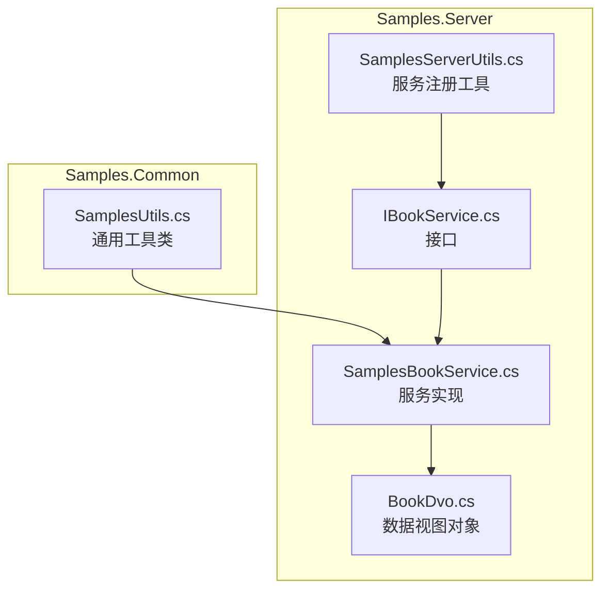
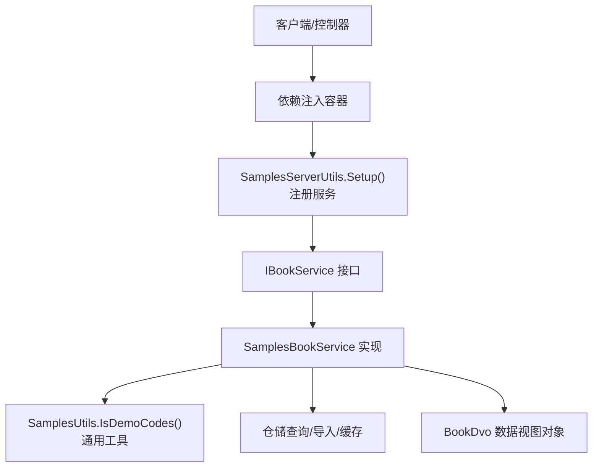
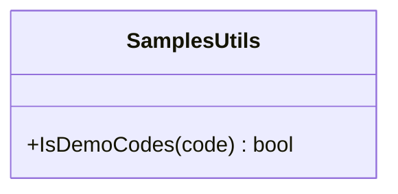
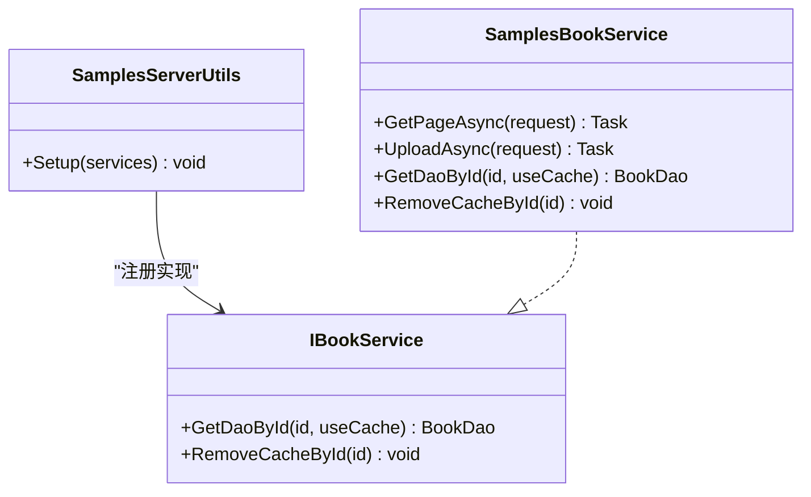
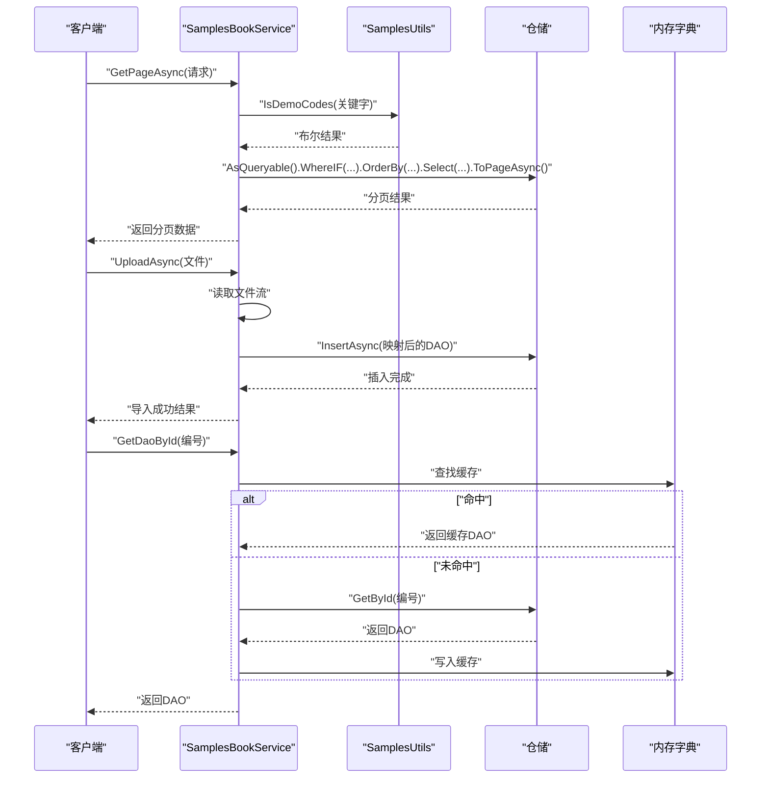
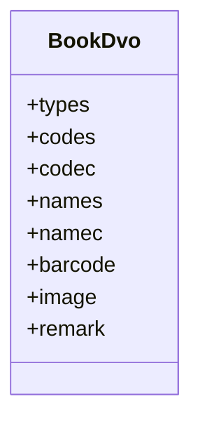
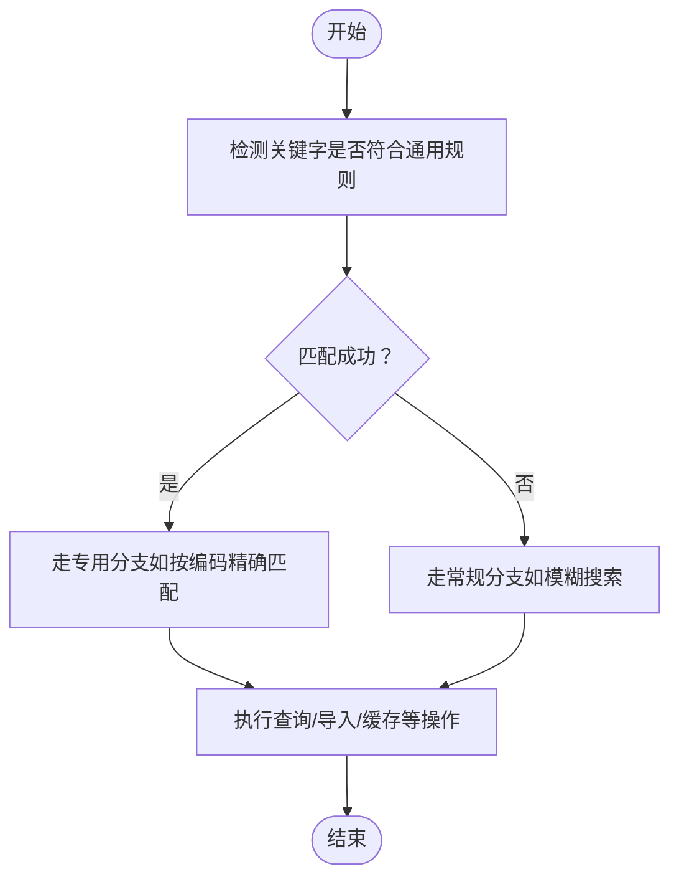
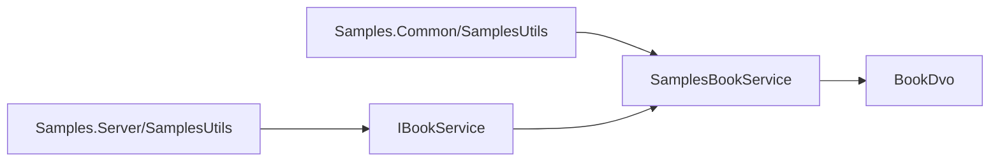

# 通用工具样例

<cite>
**本文引用的文件**
- [Samples.Common/SamplesUtils.cs](file://Samples.Common/SamplesUtils.cs)
- [Samples.Server/SamplesUtils.cs](file://Samples.Server/SamplesUtils.cs)
- [Samples.Server/Book/IBookService.cs](file://Samples.Server/Book/IBookService.cs)
- [Samples.Server/Book/SamplesBookService.cs](file://Samples.Server/Book/SamplesBookService.cs)
- [Samples.Server/Book/Dvo/BookDvo.cs](file://Samples.Server/Book/Dvo/BookDvo.cs)
</cite>

## 目录
1. [简介](#简介)
2. [项目结构](#项目结构)
3. [核心组件](#核心组件)
4. [架构总览](#架构总览)
5. [详细组件分析](#详细组件分析)
6. [依赖分析](#依赖分析)
7. [性能考虑](#性能考虑)
8. [故障排查指南](#故障排查指南)
9. [结论](#结论)
10. [附录](#附录)

## 简介
本文件围绕“通用工具样例”展开，聚焦于 Samples.Common 与 Samples.Server 中的工具类设计与实现，重点说明以下内容：
- 通用业务工具方法：如字符串匹配（示例：正则校验）。
- 数据处理函数：如基于仓储的分页查询、列表查询、导入处理等。
- 辅助功能：如缓存字典、服务注册等。
- 工具类如何为其他业务样例提供支撑：通过统一的工具方法提升可复用性与一致性。
- 设计原则、扩展方法与最佳实践。

## 项目结构
本仓库包含多个子项目，其中与“通用工具样例”直接相关的模块如下：
- Samples.Common：提供通用工具类 SamplesUtils，包含字符串匹配等基础能力。
- Samples.Server：提供服务层工具 SamplesServerUtils，负责服务注册；同时包含具体业务示例（如 Book 业务），演示如何调用通用工具与进行数据处理。

图表来源
- [Samples.Common/SamplesUtils.cs:1-13](file://Samples.Common/SamplesUtils.cs#L1-L13)
- [Samples.Server/SamplesUtils.cs:1-14](file://Samples.Server/SamplesUtils.cs#L1-L14)
- [Samples.Server/Book/IBookService.cs:1-12](file://Samples.Server/Book/IBookService.cs#L1-L12)
- [Samples.Server/Book/SamplesBookService.cs:1-283](file://Samples.Server/Book/SamplesBookService.cs#L1-L283)
- [Samples.Server/Book/Dvo/BookDvo.cs:1-42](file://Samples.Server/Book/Dvo/BookDvo.cs#L1-L42)

章节来源
- [Samples.Common/SamplesUtils.cs:1-13](file://Samples.Common/SamplesUtils.cs#L1-L13)
- [Samples.Server/SamplesUtils.cs:1-14](file://Samples.Server/SamplesUtils.cs#L1-L14)
- [Samples.Server/Book/IBookService.cs:1-12](file://Samples.Server/Book/IBookService.cs#L1-L12)
- [Samples.Server/Book/SamplesBookService.cs:1-283](file://Samples.Server/Book/SamplesBookService.cs#L1-L283)
- [Samples.Server/Book/Dvo/BookDvo.cs:1-42](file://Samples.Server/Book/Dvo/BookDvo.cs#L1-L42)

## 核心组件
- Samples.Common/SamplesUtils.cs
  - 提供静态方法用于字符串匹配（示例：识别特定前缀与格式的编码）。
- Samples.Server/SamplesUtils.cs
  - 提供静态方法用于服务注册（将接口与实现绑定到依赖注入容器）。
- Samples.Server/Book/SamplesBookService.cs
  - 典型的服务实现，演示如何使用通用工具、仓储查询、导入处理、缓存管理等。
- Samples.Server/Book/IBookService.cs
  - 定义服务契约，约束数据访问与缓存操作。
- Samples.Server/Book/Dvo/BookDvo.cs
  - 数据视图对象，承载业务字段与展示属性。

章节来源
- [Samples.Common/SamplesUtils.cs:1-13](file://Samples.Common/SamplesUtils.cs#L1-L13)
- [Samples.Server/SamplesUtils.cs:1-14](file://Samples.Server/SamplesUtils.cs#L1-L14)
- [Samples.Server/Book/IBookService.cs:1-12](file://Samples.Server/Book/IBookService.cs#L1-L12)
- [Samples.Server/Book/SamplesBookService.cs:1-283](file://Samples.Server/Book/SamplesBookService.cs#L1-L283)
- [Samples.Server/Book/Dvo/BookDvo.cs:1-42](file://Samples.Server/Book/Dvo/BookDvo.cs#L1-L42)

## 架构总览
通用工具样例在系统中的角色与交互如下：
- 通用工具（Samples.Common/SamplesUtils）为各业务服务提供基础能力（如字符串匹配）。
- 服务注册工具（Samples.Server/SamplesUtils）负责将业务接口与实现注册到 DI 容器。
- 业务服务（SamplesBookService）组合通用工具与仓储能力，完成数据查询、导入、缓存等处理。
- Dvo 对象作为数据载体，贯穿服务与前端/DTO 层。

图表来源
- [Samples.Server/SamplesUtils.cs:1-14](file://Samples.Server/SamplesUtils.cs#L1-L14)
- [Samples.Server/Book/IBookService.cs:1-12](file://Samples.Server/Book/IBookService.cs#L1-L12)
- [Samples.Server/Book/SamplesBookService.cs:1-283](file://Samples.Server/Book/SamplesBookService.cs#L1-L283)
- [Samples.Common/SamplesUtils.cs:1-13](file://Samples.Common/SamplesUtils.cs#L1-L13)
- [Samples.Server/Book/Dvo/BookDvo.cs:1-42](file://Samples.Server/Book/Dvo/BookDvo.cs#L1-L42)

## 详细组件分析

### 组件一：通用工具类（Samples.Common/SamplesUtils）
- 职责
  - 提供通用的字符串匹配能力，例如识别特定格式的编码（示例：以固定前缀与数字组成的字符串）。
- 设计要点
  - 使用正则表达式进行模式匹配，返回布尔结果。
  - 方法为静态，便于跨模块直接调用。
- 使用场景
  - 在业务查询或导入流程中，先对关键字进行预判，再决定查询策略或分支逻辑。

图表来源
- [Samples.Common/SamplesUtils.cs:1-13](file://Samples.Common/SamplesUtils.cs#L1-L13)

章节来源
- [Samples.Common/SamplesUtils.cs:1-13](file://Samples.Common/SamplesUtils.cs#L1-L13)

### 组件二：服务注册工具（Samples.Server/SamplesUtils）
- 职责
  - 将业务接口与其具体实现注册到依赖注入容器，简化服务装配。
- 设计要点
  - 静态方法集中配置，遵循“约定优于配置”的思想。
  - 可扩展为批量注册，提升维护效率。
- 使用场景
  - 在应用启动时调用，确保服务可用。

图表来源
- [Samples.Server/SamplesUtils.cs:1-14](file://Samples.Server/SamplesUtils.cs#L1-L14)
- [Samples.Server/Book/IBookService.cs:1-12](file://Samples.Server/Book/IBookService.cs#L1-L12)
- [Samples.Server/Book/SamplesBookService.cs:1-283](file://Samples.Server/Book/SamplesBookService.cs#L1-L283)

章节来源
- [Samples.Server/SamplesUtils.cs:1-14](file://Samples.Server/SamplesUtils.cs#L1-L14)
- [Samples.Server/Book/IBookService.cs:1-12](file://Samples.Server/Book/IBookService.cs#L1-L12)
- [Samples.Server/Book/SamplesBookService.cs:1-283](file://Samples.Server/Book/SamplesBookService.cs#L1-L283)

### 组件三：业务服务（SamplesBookService）
- 职责
  - 提供书籍相关业务能力：分页查询、列表查询、选项查询、编辑/查看、新增、更新、批量状态变更、批量删除、文件上传与导入、文件查看、缓存管理等。
- 设计要点
  - 使用仓储进行数据访问与查询，结合条件过滤与排序。
  - 在导入流程中读取上传文件流并批量插入。
  - 内置简单内存字典作为缓存，提升热点数据访问性能。
- 关键流程
  - 分页查询：根据关键字与类型、状态等条件动态拼接查询条件，并进行分页。
  - 导入流程：读取 Excel 流，逐条映射并插入数据库。
  - 缓存管理：按 ID 缓存 DAO，更新后移除对应缓存项。

图表来源
- [Samples.Server/Book/SamplesBookService.cs:1-283](file://Samples.Server/Book/SamplesBookService.cs#L1-L283)
- [Samples.Common/SamplesUtils.cs:1-13](file://Samples.Common/SamplesUtils.cs#L1-L13)

章节来源
- [Samples.Server/Book/SamplesBookService.cs:1-283](file://Samples.Server/Book/SamplesBookService.cs#L1-L283)
- [Samples.Common/SamplesUtils.cs:1-13](file://Samples.Common/SamplesUtils.cs#L1-L13)

### 组件四：数据视图对象（BookDvo）
- 职责
  - 承载书籍业务字段，便于在服务层与前端之间传递数据。
- 字段说明
  - 包含类型、系统编码、书籍编码、系统名称、书籍名称、条码、图片、备注等字段。

图表来源
- [Samples.Server/Book/Dvo/BookDvo.cs:1-42](file://Samples.Server/Book/Dvo/BookDvo.cs#L1-L42)

章节来源
- [Samples.Server/Book/Dvo/BookDvo.cs:1-42](file://Samples.Server/Book/Dvo/BookDvo.cs#L1-L42)

### 概念性总览
下图展示通用工具在业务流程中的概念性位置与作用：

（该图为概念性示意，不直接映射具体源码文件）

## 依赖分析
- 组件耦合关系
  - SamplesBookService 依赖 SamplesUtils 的字符串匹配能力。
  - SamplesServerUtils 依赖 IBookService 与 SamplesBookService 进行注册。
  - BookDvo 作为数据载体被服务层广泛使用。
- 外部依赖
  - 仓储框架（SugarRepository）、环境配置（EnvConfig）、异常类型（BusinessException）等。

图表来源
- [Samples.Common/SamplesUtils.cs:1-13](file://Samples.Common/SamplesUtils.cs#L1-L13)
- [Samples.Server/SamplesUtils.cs:1-14](file://Samples.Server/SamplesUtils.cs#L1-L14)
- [Samples.Server/Book/IBookService.cs:1-12](file://Samples.Server/Book/IBookService.cs#L1-L12)
- [Samples.Server/Book/SamplesBookService.cs:1-283](file://Samples.Server/Book/SamplesBookService.cs#L1-L283)
- [Samples.Server/Book/Dvo/BookDvo.cs:1-42](file://Samples.Server/Book/Dvo/BookDvo.cs#L1-L42)

章节来源
- [Samples.Common/SamplesUtils.cs:1-13](file://Samples.Common/SamplesUtils.cs#L1-L13)
- [Samples.Server/SamplesUtils.cs:1-14](file://Samples.Server/SamplesUtils.cs#L1-L14)
- [Samples.Server/Book/IBookService.cs:1-12](file://Samples.Server/Book/IBookService.cs#L1-L12)
- [Samples.Server/Book/SamplesBookService.cs:1-283](file://Samples.Server/Book/SamplesBookService.cs#L1-L283)
- [Samples.Server/Book/Dvo/BookDvo.cs:1-42](file://Samples.Server/Book/Dvo/BookDvo.cs#L1-L42)

## 性能考虑
- 缓存策略
  - 在服务内部使用内存字典缓存热点数据，减少重复查询，提高响应速度。
  - 更新或删除后及时清理缓存，保证一致性。
- 查询优化
  - 使用仓储的条件过滤与分页查询，避免一次性加载全量数据。
  - 在导入场景中逐条插入，降低单次事务压力。
- I/O 优化
  - 导入时使用流式读取，避免大文件占用过多内存。
- 建议
  - 对高频查询建立索引，合理设计字段选择与排序。
  - 在高并发场景下考虑引入分布式缓存与限流策略。

## 故障排查指南
- 常见问题
  - 关键字匹配失败：确认输入格式是否符合通用规则（如前缀与位数要求）。
  - 导入失败：检查上传文件格式与流读取逻辑，确保每条记录映射正确。
  - 缓存不一致：更新后未清理缓存，导致读取到旧值。
- 排查步骤
  - 在服务层增加日志输出，定位查询条件与导入流程的关键节点。
  - 对比缓存命中与未命中的路径，确认缓存写入与清理时机。
  - 验证异常抛出点（如重复编码、无效记录），确保错误信息清晰明确。

## 结论
通用工具样例通过简洁的工具方法与规范的服务注册机制，为业务样例提供了可复用的基础能力。在实际开发中，建议：
- 将通用逻辑沉淀为工具类，保持方法单一职责与幂等性。
- 使用依赖注入集中管理服务注册，提升可测试性与可维护性。
- 在服务层结合仓储与缓存策略，兼顾性能与一致性。
- 以数据视图对象为桥梁，统一前后端数据结构，降低耦合度。

## 附录
- 最佳实践清单
  - 工具方法命名语义化，参数与返回值明确。
  - 服务注册集中化，避免分散配置带来的遗漏。
  - 导入流程健壮化：校验、回滚、重试策略。
  - 缓存策略显式化：写入、失效、刷新策略清晰。
  - 错误处理标准化：异常类型统一、错误码与消息规范化。