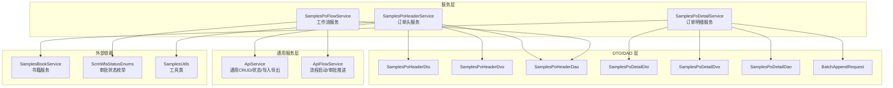
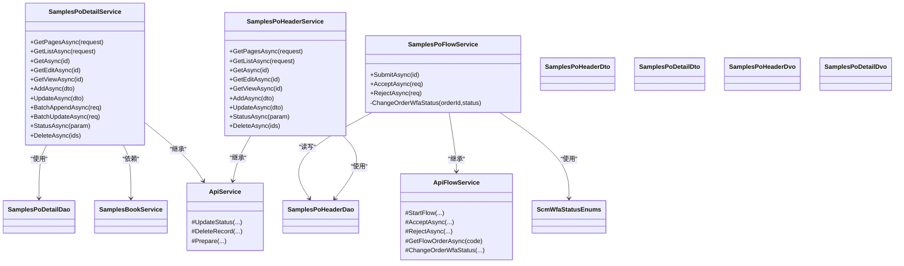
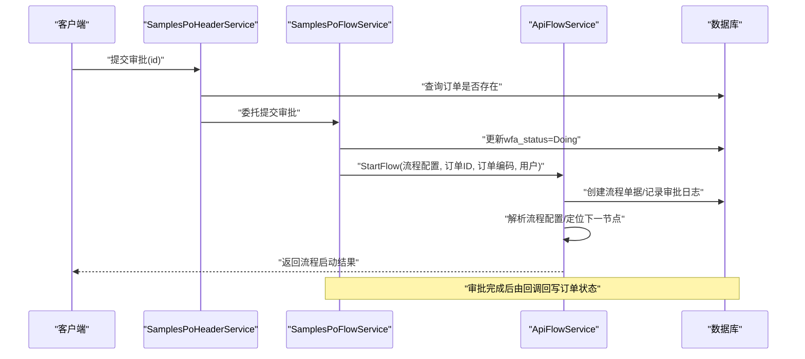
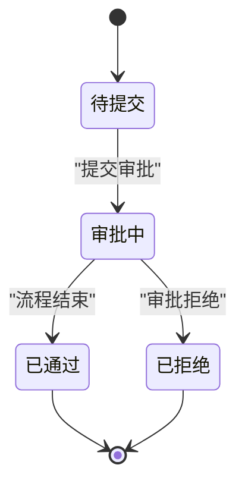
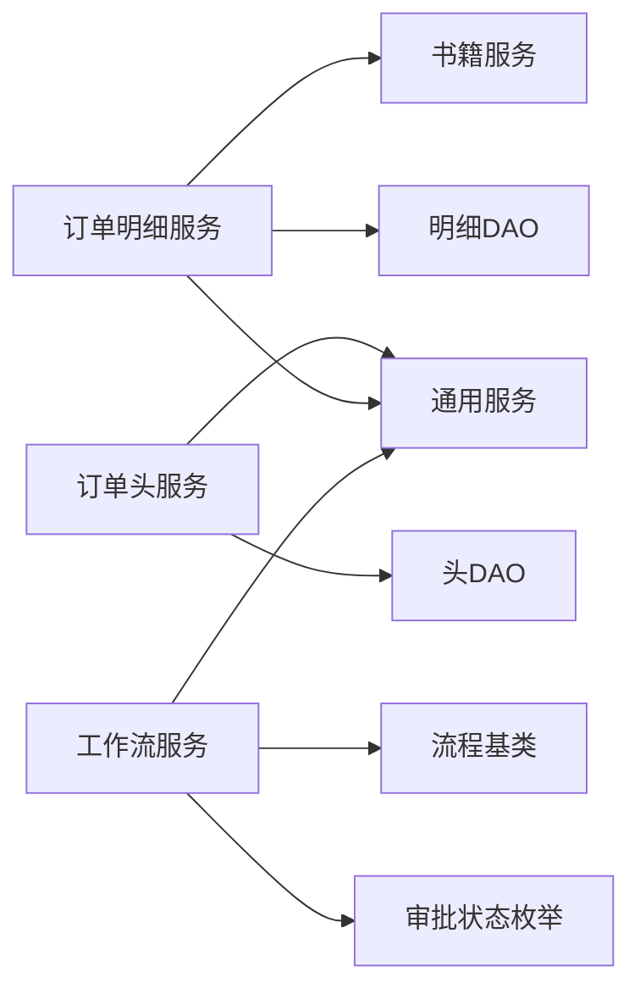

# 采购订单样例

<cite>
**本文引用的文件**
- [SamplesPoHeaderService.cs](file://Samples.Server/PoHeader/SamplesPoHeaderService.cs)
- [SamplesPoFlowService.cs](file://Samples.Server/PoHeader/SamplesPoFlowService.cs)
- [SamplesPoHeaderDvo.cs](file://Samples.Server/PoHeader/Dvo/SamplesPoHeaderDvo.cs)
- [SamplesPoHeaderDto.cs](file://Samples.Common.Dto/PoHeader/Dto/SamplesPoHeaderDto.cs)
- [SamplesPoEnums.cs](file://Samples.Common/PoHeader/Enums/SamplesPoEnums.cs)
- [SamplesPoHeaderDao.cs](file://Samples.Server.Dao/PoHeader/Dao/SamplesPoHeaderDao.cs)
- [SamplesPoDetailService.cs](file://Samples.Server/PoDetail/SamplesPoDetailService.cs)
- [SamplesPoDetailDvo.cs](file://Samples.Server/PoDetail/Dvo/SamplesPoDetailDvo.cs)
- [SamplesPoDetailDao.cs](file://Samples.Server.Dao/PoDetail/Dao/SamplesPoDetailDao.cs)
- [BatchAppendRequest.cs](file://Samples.Common.Dto/PoDetail/Dto/BatchAppendRequest.cs)
- [ApiService.cs](file://Scm.Server/Service/ApiService.cs)
- [ApiFlowService.cs](file://Scm.Server/Service/ApiFlowService.cs)
- [ScmWfaStatusEnums.cs](file://Scm.Common/Enums/ScmWfaStatusEnums.cs)
- [SamplesBookService.cs](file://Samples.Server/Book/SamplesBookService.cs)
- [IBookService.cs](file://Samples.Server/Book/IBookService.cs)
- [SamplesUtils.cs](file://Samples.Common/SamplesUtils.cs)
</cite>

## 目录
1. [简介](#简介)
2. [项目结构](#项目结构)
3. [核心组件](#核心组件)
4. [架构总览](#架构总览)
5. [详细组件分析](#详细组件分析)
6. [依赖关系分析](#依赖关系分析)
7. [性能考虑](#性能考虑)
8. [故障排查指南](#故障排查指南)
9. [结论](#结论)
10. [附录](#附录)

## 简介
本技术文档围绕“采购订单样例”展开，系统性介绍订单头表与订单明细的管理流程、工作流集成、数据模型设计、业务规则与 API 规范，并提供从创建、审批、执行到完成的完整示例路径与扩展指南。重点解析 SamplesPoHeaderService 与 SamplesPoFlowService 的实现，阐明订单状态流转、批量操作与数据同步机制。

## 项目结构
采购订单样例位于 Samples.Server 与 Samples.Common 及其对应的 DTO/DAO 层，配合通用服务层（ApiService、ApiFlowService）与工作流框架，形成清晰的分层架构：
- 服务层：订单头服务、订单明细服务、工作流服务
- DTO/DAO 层：数据传输对象与持久化映射
- 通用服务层：统一的 CRUD、状态变更、导入导出与流程基类
- 工作流：基于流程配置的审批推进与状态回写

图表来源
- [SamplesPoHeaderService.cs:1-177](file://Samples.Server/PoHeader/SamplesPoHeaderService.cs#L1-L177)
- [SamplesPoDetailService.cs:1-266](file://Samples.Server/PoDetail/SamplesPoDetailService.cs#L1-L266)
- [SamplesPoFlowService.cs:1-73](file://Samples.Server/PoHeader/SamplesPoFlowService.cs#L1-L73)
- [ApiService.cs:1-309](file://Scm.Server/Service/ApiService.cs#L1-L309)
- [ApiFlowService.cs:1-462](file://Scm.Server/Service/ApiFlowService.cs#L1-L462)
- [SamplesPoHeaderDao.cs:1-77](file://Samples.Server.Dao/PoHeader/Dao/SamplesPoHeaderDao.cs#L1-L77)
- [SamplesPoDetailDao.cs:1-45](file://Samples.Server.Dao/PoDetail/Dao/SamplesPoDetailDao.cs#L1-L45)
- [SamplesBookService.cs:1-283](file://Samples.Server/Book/SamplesBookService.cs#L1-L283)
- [ScmWfaStatusEnums.cs:1-30](file://Scm.Common/Enums/ScmWfaStatusEnums.cs#L1-L30)
- [SamplesUtils.cs:1-13](file://Samples.Common/SamplesUtils.cs#L1-L13)

章节来源
- [SamplesPoHeaderService.cs:1-177](file://Samples.Server/PoHeader/SamplesPoHeaderService.cs#L1-L177)
- [SamplesPoDetailService.cs:1-266](file://Samples.Server/PoDetail/SamplesPoDetailService.cs#L1-L266)
- [SamplesPoFlowService.cs:1-73](file://Samples.Server/PoHeader/SamplesPoFlowService.cs#L1-L73)
- [ApiService.cs:1-309](file://Scm.Server/Service/ApiService.cs#L1-L309)
- [ApiFlowService.cs:1-462](file://Scm.Server/Service/ApiFlowService.cs#L1-L462)

## 核心组件
- 订单头服务（SamplesPoHeaderService）
  - 负责订单头的分页查询、列表查询、按主键读取、新增、更新、批量状态变更与删除
  - 关键点：唯一性校验（codec）、状态变更封装（UpdateStatus）、资源名解析（Prepare）

- 订单明细服务（SamplesPoDetailService）
  - 负责明细的分页/列表查询、按主键读取、新增、更新、批量追加、批量更新、批量状态变更与删除
  - 关键点：与书籍服务联动（获取 book_codes/names）、批量操作的增改合并策略

- 工作流服务（SamplesPoFlowService）
  - 负责提交审批、启动流程、推进审批、结束并回写订单状态
  - 关键点：根据单据代码获取流程配置、更新 wfa_status、调用流程引擎推进

- 通用服务（ApiService、ApiFlowService）
  - 统一封装状态变更、物理删除、导入导出任务、流程启动与审批推进等通用能力

章节来源
- [SamplesPoHeaderService.cs:116-177](file://Samples.Server/PoHeader/SamplesPoHeaderService.cs#L116-L177)
- [SamplesPoDetailService.cs:130-266](file://Samples.Server/PoDetail/SamplesPoDetailService.cs#L130-L266)
- [SamplesPoFlowService.cs:23-73](file://Samples.Server/PoHeader/SamplesPoFlowService.cs#L23-L73)
- [ApiService.cs:98-173](file://Scm.Server/Service/ApiService.cs#L98-L173)
- [ApiFlowService.cs:29-78](file://Scm.Server/Service/ApiFlowService.cs#L29-L78)

## 架构总览
采购订单样例采用“服务层 + DTO/DAO + 通用服务层 + 工作流”的分层架构，数据模型以 SqlSugar ORM 映射至 samples_po_header 与 samples_po_detail 表，工作流通过流程配置驱动审批推进。

图表来源
- [SamplesPoHeaderService.cs:17-35](file://Samples.Server/PoHeader/SamplesPoHeaderService.cs#L17-L35)
- [SamplesPoDetailService.cs:17-33](file://Samples.Server/PoDetail/SamplesPoDetailService.cs#L17-L33)
- [SamplesPoFlowService.cs:14-21](file://Samples.Server/PoHeader/SamplesPoFlowService.cs#L14-L21)
- [ApiService.cs:17-309](file://Scm.Server/Service/ApiService.cs#L17-L309)
- [ApiFlowService.cs:15-462](file://Scm.Server/Service/ApiFlowService.cs#L15-L462)
- [SamplesPoHeaderDao.cs:14-77](file://Samples.Server.Dao/PoHeader/Dao/SamplesPoHeaderDao.cs#L14-L77)
- [SamplesPoDetailDao.cs:11-45](file://Samples.Server.Dao/PoDetail/Dao/SamplesPoDetailDao.cs#L11-L45)

## 详细组件分析

### 订单头服务（SamplesPoHeaderService）
- 功能要点
  - 分页与列表查询：支持按状态过滤、排序与 DVO 转换
  - 读取接口：编辑读取、查看读取、按主键读取
  - 新增/更新：唯一性校验（codec），失败抛业务异常
  - 批量状态变更与删除：复用通用 UpdateStatus/DeleteRecord

- 数据准备
  - Prepare 方法统一解析创建人/更新人姓名，便于前端展示

- API 示例路径
  - 新增：[SamplesPoHeaderService.cs:121-131](file://Samples.Server/PoHeader/SamplesPoHeaderService.cs#L121-L131)
  - 更新：[SamplesPoHeaderService.cs:138-154](file://Samples.Server/PoHeader/SamplesPoHeaderService.cs#L138-L154)
  - 批量状态变更：[SamplesPoHeaderService.cs:161-164](file://Samples.Server/PoHeader/SamplesPoHeaderService.cs#L161-L164)
  - 删除：[SamplesPoHeaderService.cs:172-175](file://Samples.Server/PoHeader/SamplesPoHeaderService.cs#L172-L175)

章节来源
- [SamplesPoHeaderService.cs:42-177](file://Samples.Server/PoHeader/SamplesPoHeaderService.cs#L42-L177)
- [ApiService.cs:288-305](file://Scm.Server/Service/ApiService.cs#L288-L305)

### 订单明细服务（SamplesPoDetailService）
- 功能要点
  - 查询：按 header_id 过滤，支持分页与列表
  - 读取：编辑/查看/按主键
  - 新增/更新：基础 CRUD
  - 批量操作
    - 批量追加（BatchAppend）：对已有项恢复启用并更新数量，否则新增
    - 批量更新（BatchUpdate）：按明细 id 更新数量与状态
  - 与书籍服务联动：在 Prepare 中读取书籍 codes/names

- API 示例路径
  - 批量追加：[SamplesPoDetailService.cs:185-217](file://Samples.Server/PoDetail/SamplesPoDetailService.cs#L185-L217)
  - 批量更新：[SamplesPoDetailService.cs:224-243](file://Samples.Server/PoDetail/SamplesPoDetailService.cs#L224-L243)
  - 准备数据（关联书籍）：[SamplesPoDetailService.cs:73-86](file://Samples.Server/PoDetail/SamplesPoDetailService.cs#L73-L86)

章节来源
- [SamplesPoDetailService.cs:40-266](file://Samples.Server/PoDetail/SamplesPoDetailService.cs#L40-L266)
- [IBookService.cs:5-11](file://Samples.Server/Book/IBookService.cs#L5-L11)
- [SamplesBookService.cs:259-280](file://Samples.Server/Book/SamplesBookService.cs#L259-L280)

### 工作流服务（SamplesPoFlowService）
- 功能要点
  - 提交审批：校验订单存在性，设置 wfa_status=Doing，启动流程
  - 流程推进：继承 ApiFlowService，复用 StartFlow、AcceptAsync、RejectAsync
  - 状态回写：结束节点后回写订单审批状态为 Accept

- 流程关键路径
  - 提交审批：[SamplesPoFlowService.cs:29-52](file://Samples.Server/PoHeader/SamplesPoFlowService.cs#L29-L52)
  - 回写状态：[SamplesPoFlowService.cs:60-70](file://Samples.Server/PoHeader/SamplesPoFlowService.cs#L60-L70)
  - 通用流程启动：[ApiFlowService.cs:29-78](file://Scm.Server/Service/ApiFlowService.cs#L29-L78)

图表来源
- [SamplesPoFlowService.cs:29-70](file://Samples.Server/PoHeader/SamplesPoFlowService.cs#L29-L70)
- [ApiFlowService.cs:29-78](file://Scm.Server/Service/ApiFlowService.cs#L29-L78)

章节来源
- [SamplesPoFlowService.cs:23-73](file://Samples.Server/PoHeader/SamplesPoFlowService.cs#L23-L73)
- [ApiFlowService.cs:116-217](file://Scm.Server/Service/ApiFlowService.cs#L116-L217)

### 数据模型与业务规则
- 订单头（SamplesPoHeaderDao/SamplesPoHeaderDto/SamplesPoHeaderDvo）
  - 主键自增，系统代码由 UidUtils.NextCodes 生成，确保唯一性
  - 审批状态字段 wfa_status 使用 ScmWfaStatusEnums
  - 唯一性约束：codec 在新增/更新时校验重复

- 订单明细（SamplesPoDetailDao/SamplesPoDetailDto/SamplesPoDetailDvo）
  - header_id 外键关联订单头
  - 批量追加时按 book_id 去重，存在则恢复启用并更新数量，不存在则新增
  - 明细 DVO 在 Prepare 中补充书籍编码与名称

- 业务规则
  - 新增/更新前的重复性校验
  - 批量操作的增改合并策略
  - 工作流提交前的状态更新与流程启动

章节来源
- [SamplesPoHeaderDao.cs:70-77](file://Samples.Server.Dao/PoHeader/Dao/SamplesPoHeaderDao.cs#L70-L77)
- [SamplesPoHeaderDto.cs:16](file://Samples.Common.Dto/PoHeader/Dto/SamplesPoHeaderDto.cs#L16)
- [SamplesPoHeaderService.cs:123-150](file://Samples.Server/PoHeader/SamplesPoHeaderService.cs#L123-L150)
- [SamplesPoDetailService.cs:187-217](file://Samples.Server/PoDetail/SamplesPoDetailService.cs#L187-L217)
- [SamplesPoDetailDvo.cs:20-22](file://Samples.Server/PoDetail/Dvo/SamplesPoDetailDvo.cs#L20-L22)

### API 接口规范（示例路径）
- 订单头
  - 分页查询：[SamplesPoHeaderService.cs:42-54](file://Samples.Server/PoHeader/SamplesPoHeaderService.cs#L42-L54)
  - 列表查询：[SamplesPoHeaderService.cs:61-72](file://Samples.Server/PoHeader/SamplesPoHeaderService.cs#L61-L72)
  - 新增：[SamplesPoHeaderService.cs:121-131](file://Samples.Server/PoHeader/SamplesPoHeaderService.cs#L121-L131)
  - 更新：[SamplesPoHeaderService.cs:138-154](file://Samples.Server/PoHeader/SamplesPoHeaderService.cs#L138-L154)
  - 批量状态变更：[SamplesPoHeaderService.cs:161-164](file://Samples.Server/PoHeader/SamplesPoHeaderService.cs#L161-L164)
  - 删除：[SamplesPoHeaderService.cs:172-175](file://Samples.Server/PoHeader/SamplesPoHeaderService.cs#L172-L175)

- 订单明细
  - 分页查询：[SamplesPoDetailService.cs:40-53](file://Samples.Server/PoDetail/SamplesPoDetailService.cs#L40-L53)
  - 列表查询：[SamplesPoDetailService.cs:60-71](file://Samples.Server/PoDetail/SamplesPoDetailService.cs#L60-L71)
  - 批量追加：[SamplesPoDetailService.cs:185-217](file://Samples.Server/PoDetail/SamplesPoDetailService.cs#L185-L217)
  - 批量更新：[SamplesPoDetailService.cs:224-243](file://Samples.Server/PoDetail/SamplesPoDetailService.cs#L224-L243)

- 工作流
  - 提交审批：[SamplesPoFlowService.cs:29-52](file://Samples.Server/PoHeader/SamplesPoFlowService.cs#L29-L52)
  - 通过审批：[ApiFlowService.cs:116-217](file://Scm.Server/Service/ApiFlowService.cs#L116-L217)

章节来源
- [SamplesPoHeaderService.cs:42-177](file://Samples.Server/PoHeader/SamplesPoHeaderService.cs#L42-L177)
- [SamplesPoDetailService.cs:40-266](file://Samples.Server/PoDetail/SamplesPoDetailService.cs#L40-L266)
- [SamplesPoFlowService.cs:29-73](file://Samples.Server/PoHeader/SamplesPoFlowService.cs#L29-L73)
- [ApiFlowService.cs:116-217](file://Scm.Server/Service/ApiFlowService.cs#L116-L217)

### 订单状态流转与工作流集成
- 状态枚举
  - ScmWfaStatusEnums：None、Todo、Doing、Suspend、Reject、Accept
- 流转过程
  - 提交审批：订单头 wfa_status=Doing，启动流程
  - 审批通过：流程结束节点触发回写，订单头 wfa_status=Accept
  - 异常处理：无效订单、流程配置缺失、节点类型不合法等情况均有相应保护

图表来源
- [ScmWfaStatusEnums.cs:6-29](file://Scm.Common/Enums/ScmWfaStatusEnums.cs#L6-L29)
- [SamplesPoFlowService.cs:45-51](file://Samples.Server/PoHeader/SamplesPoFlowService.cs#L45-L51)
- [ApiFlowService.cs:373-375](file://Scm.Server/Service/ApiFlowService.cs#L373-L375)

章节来源
- [ScmWfaStatusEnums.cs:1-30](file://Scm.Common/Enums/ScmWfaStatusEnums.cs#L1-L30)
- [SamplesPoFlowService.cs:60-70](file://Samples.Server/PoHeader/SamplesPoFlowService.cs#L60-L70)
- [ApiFlowService.cs:414-417](file://Scm.Server/Service/ApiFlowService.cs#L414-L417)

### 批量操作与数据同步机制
- 批量追加（BatchAppend）
  - 依据目标集合 items 与现有明细比对，存在则恢复启用并更新数量，不存在则新增
  - 通过 InsertRangeAsync 与 UpdateRangeAsync 合并写入，减少往返
- 批量更新（BatchUpdate）
  - 仅对存在的明细进行数量与状态更新
- 数据同步
  - 明细 Prepare 阶段读取书籍服务，补充 book_codes/book_names，保证视图数据一致

章节来源
- [SamplesPoDetailService.cs:185-243](file://Samples.Server/PoDetail/SamplesPoDetailService.cs#L185-L243)
- [SamplesBookService.cs:259-280](file://Samples.Server/Book/SamplesBookService.cs#L259-L280)

### 业务规则与数据校验
- 订单头
  - codec 唯一性校验（新增/更新）
  - 无效订单抛出业务异常
- 订单明细
  - 批量追加时对 book_id 去重
  - 无效明细抛出业务异常
- 工具类
  - 样例编码校验（IsDemoCodes）

章节来源
- [SamplesPoHeaderService.cs:123-150](file://Samples.Server/PoHeader/SamplesPoHeaderService.cs#L123-L150)
- [SamplesPoDetailService.cs:170-178](file://Samples.Server/PoDetail/SamplesPoDetailService.cs#L170-L178)
- [SamplesUtils.cs:7-11](file://Samples.Common/SamplesUtils.cs#L7-L11)

### 完整订单管理示例（步骤路径）
以下为端到端示例的步骤路径，便于快速定位实现位置：
- 创建订单头
  - POST 新增：[SamplesPoHeaderService.cs:121-131](file://Samples.Server/PoHeader/SamplesPoHeaderService.cs#L121-L131)
- 编辑订单明细
  - 批量追加：[SamplesPoDetailService.cs:185-217](file://Samples.Server/PoDetail/SamplesPoDetailService.cs#L185-L217)
  - 批量更新：[SamplesPoDetailService.cs:224-243](file://Samples.Server/PoDetail/SamplesPoDetailService.cs#L224-L243)
- 提交审批
  - 提交审批：[SamplesPoFlowService.cs:29-52](file://Samples.Server/PoHeader/SamplesPoFlowService.cs#L29-L52)
- 审批通过
  - 通过审批：[ApiFlowService.cs:116-217](file://Scm.Server/Service/ApiFlowService.cs#L116-L217)
- 完成与归档
  - 订单头状态回写为 Accept：[ApiFlowService.cs:373-375](file://Scm.Server/Service/ApiFlowService.cs#L373-L375)

章节来源
- [SamplesPoHeaderService.cs:121-131](file://Samples.Server/PoHeader/SamplesPoHeaderService.cs#L121-L131)
- [SamplesPoDetailService.cs:185-243](file://Samples.Server/PoDetail/SamplesPoDetailService.cs#L185-L243)
- [SamplesPoFlowService.cs:29-52](file://Samples.Server/PoHeader/SamplesPoFlowService.cs#L29-L52)
- [ApiFlowService.cs:116-217](file://Scm.Server/Service/ApiFlowService.cs#L116-L217)

## 依赖关系分析
- 组件耦合
  - 订单明细服务依赖书籍服务以补充书籍信息
  - 工作流服务依赖流程基类与审批状态枚举
  - 通用服务提供 CRUD 与状态变更的统一入口
- 外部依赖
  - SqlSugar ORM 用于 DAO 映射与查询
  - 工作流配置文件（flow/{flow_id}.json）驱动流程推进

图表来源
- [SamplesPoDetailService.cs:19-33](file://Samples.Server/PoDetail/SamplesPoDetailService.cs#L19-L33)
- [SamplesPoFlowService.cs:16-21](file://Samples.Server/PoHeader/SamplesPoFlowService.cs#L16-L21)
- [ApiService.cs:17-309](file://Scm.Server/Service/ApiService.cs#L17-L309)
- [ApiFlowService.cs:15-462](file://Scm.Server/Service/ApiFlowService.cs#L15-L462)

章节来源
- [SamplesPoDetailService.cs:19-33](file://Samples.Server/PoDetail/SamplesPoDetailService.cs#L19-L33)
- [SamplesPoFlowService.cs:16-21](file://Samples.Server/PoHeader/SamplesPoFlowService.cs#L16-L21)
- [ApiService.cs:17-309](file://Scm.Server/Service/ApiService.cs#L17-L309)
- [ApiFlowService.cs:15-462](file://Scm.Server/Service/ApiFlowService.cs#L15-L462)

## 性能考虑
- 批量操作
  - 批量追加/更新使用 InsertRangeAsync 与 UpdateRangeAsync，降低数据库往返
- 查询优化
  - 分页查询与条件过滤结合，避免全表扫描
- 缓存与准备
  - 通用 Prepare 解析用户姓名，避免重复查询
- 工作流
  - 流程启动与节点推进通过配置文件驱动，减少硬编码分支

## 故障排查指南
- 常见异常
  - 重复编码：新增/更新时 codec 冲突抛出业务异常
  - 无效订单/明细：未找到对应记录时抛出业务异常
  - 流程配置缺失：流程配置文件为空或节点配置异常时记录日志并返回失败
- 排查路径
  - 新增/更新异常：[SamplesPoHeaderService.cs:123-150](file://Samples.Server/PoHeader/SamplesPoHeaderService.cs#L123-L150)
  - 批量追加异常：[SamplesPoDetailService.cs:193-201](file://Samples.Server/PoDetail/SamplesPoDetailService.cs#L193-L201)
  - 流程启动失败：[ApiFlowService.cs:56-60](file://Scm.Server/Service/ApiFlowService.cs#L56-L60)

章节来源
- [SamplesPoHeaderService.cs:123-150](file://Samples.Server/PoHeader/SamplesPoHeaderService.cs#L123-L150)
- [SamplesPoDetailService.cs:193-201](file://Samples.Server/PoDetail/SamplesPoDetailService.cs#L193-L201)
- [ApiFlowService.cs:56-60](file://Scm.Server/Service/ApiFlowService.cs#L56-L60)

## 结论
采购订单样例通过清晰的服务层与 DTO/DAO 设计，结合通用服务与工作流框架，实现了从创建、审批、执行到完成的完整闭环。其批量操作与数据同步机制提升了效率，而统一的异常与状态管理保障了稳定性。开发者可在此基础上扩展更多业务场景与定制化需求。

## 附录
- 扩展建议
  - 自定义审批节点：在流程配置文件中新增节点类型与用户选择策略
  - 订单头扩展：增加更多业务字段与校验规则
  - 明细扩展：引入单价、金额计算与汇总统计
- 定制化开发
  - 通过继承 ApiService/ApiFlowService 扩展通用能力
  - 通过实现 IBookService 接口替换书籍数据源
  - 使用 SamplesUtils 工具类进行编码校验与格式化