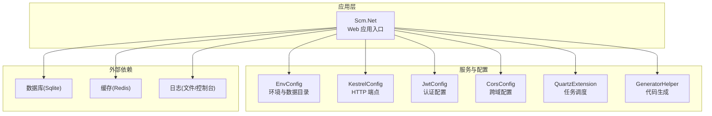
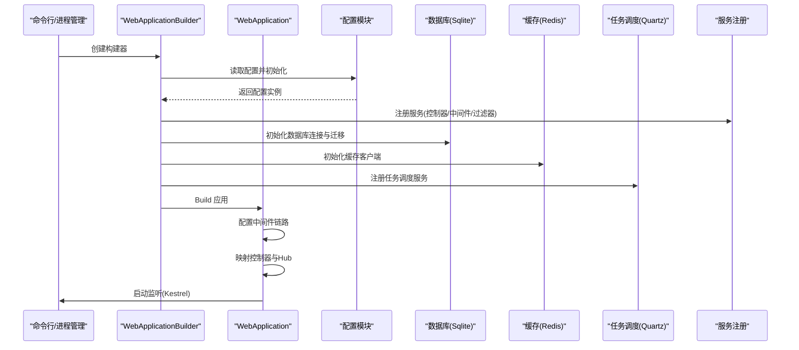
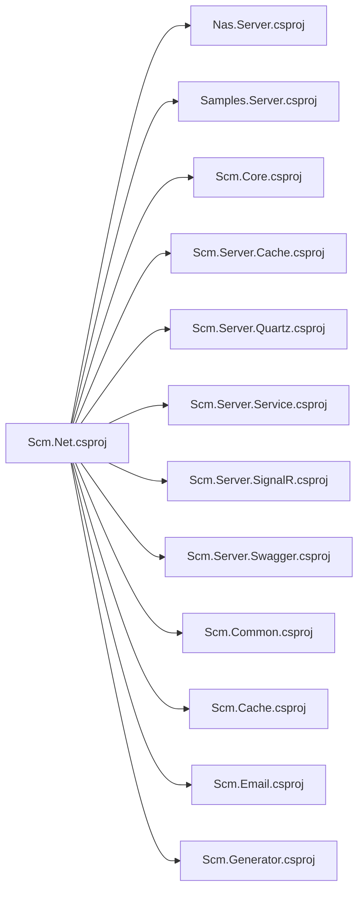

# 应用部署

<cite>
**本文引用的文件**
- [Scm.Net.csproj](file://Scm.Net/Scm.Net.csproj)
- [Program.cs](file://Scm.Net/Program.cs)
- [appsettings.json](file://Scm.Net/appsettings.json)
- [appsettings.Development.json](file://Scm.Net/appsettings.Development.json)
- [launchSettings.json](file://Scm.Net/Properties/launchSettings.json)
- [EnvConfig.cs](file://Scm.Server/Config/EnvConfig.cs)
- [KestrelConfig.cs](file://Scm.Server/Config/KestrelConfig.cs)
- [JwtConfig.cs](file://Scm.Server/Config/JwtConfig.cs)
- [CorsConfig.cs](file://Scm.Server/Config/CorsConfig.cs)
- [QuartzExtension.cs](file://Scm.Server.Quartz/QuartzExtension.cs)
- [GeneratorHelper.cs](file://Scm.Generator/GeneratorHelper.cs)
- [.gitignore](file://.gitignore)
- [readme.txt](file://Scm.Net/readme.txt)
- [DiskInfo.cs](file://Scm.Common.Os/OS/Windows/Disk/DiskInfo.cs)
</cite>

## 目录
1. [简介](#简介)
2. [项目结构](#项目结构)
3. [核心组件](#核心组件)
4. [架构总览](#架构总览)
5. [详细组件分析](#详细组件分析)
6. [依赖关系分析](#依赖关系分析)
7. [性能与容量规划](#性能与容量规划)
8. [部署方式与步骤](#部署方式与步骤)
9. [配置管理与环境变量](#配置管理与环境变量)
10. [部署前验证清单](#部署前验证清单)
11. [部署后功能测试](#部署后功能测试)
12. [故障排查](#故障排查)
13. [结论](#结论)

## 简介
本指南面向 Scm.Net 的应用部署与发布，覆盖传统服务器部署、Docker 容器化部署以及 Kubernetes 集群部署三种方式。文档从构建与发布配置入手，结合项目实际配置文件与启动逻辑，给出可操作的部署步骤、配置最佳实践、自动化建议与验证测试方法，帮助团队在不同环境中稳定交付系统。

## 项目结构
Scm.Net 是一个基于 .NET 10 的 Web 应用，采用多项目解决方案组织，核心入口位于 Scm.Net 工程，通过依赖注入与配置模块化加载各类能力（数据库、缓存、任务调度、文件系统、安全等）。应用通过 Kestrel 提供 HTTP 服务，默认监听端口可在配置中调整。

图表来源
- [Program.cs:33-258](file://Scm.Net/Program.cs#L33-L258)
- [EnvConfig.cs:6-102](file://Scm.Server/Config/EnvConfig.cs#L6-L102)
- [KestrelConfig.cs:3-18](file://Scm.Server/Config/KestrelConfig.cs#L3-L18)
- [JwtConfig.cs:3-47](file://Scm.Server/Config/JwtConfig.cs#L3-L47)
- [CorsConfig.cs:3-46](file://Scm.Server/Config/CorsConfig.cs#L3-L46)
- [QuartzExtension.cs:15-39](file://Scm.Server.Quartz/QuartzExtension.cs#L15-L39)
- [GeneratorHelper.cs:7-15](file://Scm.Generator/GeneratorHelper.cs#L7-L15)

章节来源
- [Scm.Net.csproj:1-86](file://Scm.Net/Scm.Net.csproj#L1-L86)
- [Program.cs:33-258](file://Scm.Net/Program.cs#L33-L258)
- [appsettings.json:1-127](file://Scm.Net/appsettings.json#L1-L127)
- [appsettings.Development.json:1-162](file://Scm.Net/appsettings.Development.json#L1-L162)

## 核心组件
- 启动与服务装配：应用在 Program.cs 中完成配置读取、日志初始化、环境准备、数据库与缓存初始化、任务调度、Swagger、跨域、JWT、SignalR、控制器与 Hub 映射等。
- 配置体系：EnvConfig 负责数据目录与静态资源映射；KestrelConfig 控制监听地址；JwtConfig 管理令牌签发参数；CorsConfig 控制跨域策略；QuartzExtension 与 GeneratorHelper 分别负责任务调度与代码生成能力的注册。
- 数据与文件：EnvConfig 提供统一的数据目录解析与路径拼接，支持相对/绝对路径与 URI 映射；应用默认使用 Sqlite 作为主数据库，Redis 作为缓存。

章节来源
- [Program.cs:33-258](file://Scm.Net/Program.cs#L33-L258)
- [EnvConfig.cs:6-102](file://Scm.Server/Config/EnvConfig.cs#L6-L102)
- [KestrelConfig.cs:3-18](file://Scm.Server/Config/KestrelConfig.cs#L3-L18)
- [JwtConfig.cs:3-47](file://Scm.Server/Config/JwtConfig.cs#L3-L47)
- [CorsConfig.cs:3-46](file://Scm.Server/Config/CorsConfig.cs#L3-L46)
- [QuartzExtension.cs:15-39](file://Scm.Server.Quartz/QuartzExtension.cs#L15-L39)
- [GeneratorHelper.cs:7-15](file://Scm.Generator/GeneratorHelper.cs#L7-L15)

## 架构总览
应用启动流程概览如下：

图表来源
- [Program.cs:33-258](file://Scm.Net/Program.cs#L33-L258)
- [QuartzExtension.cs:15-39](file://Scm.Server.Quartz/QuartzExtension.cs#L15-L39)

## 详细组件分析

### 启动与服务装配（Program.cs）
- 配置读取与日志：通过 Serilog 读取配置并初始化日志记录器。
- 环境准备：EnvConfig 依据 ContentRootPath 与配置计算 DataDir、Upload、Images、Logs、Fonts 等路径，并确保目录存在。
- 数据库初始化：根据 SqlConfig 类型与连接串创建 SqlSugarScope，初始化 Scm/Samples/Nas 数据库脚本。
- 缓存、Swagger、Quartz、邮件、电话、Aiml、OIDC、OTP、CORS、JWT、SignalR、Mapper 等均按配置注册。
- 中间件链路：静态文件、路由、跨域、认证授权、异常与 JWT 中间件、任务调度映射、控制器与 Hub 映射。
- Kestrel 监听：优先使用配置中的 Url，否则回退到默认值。

章节来源
- [Program.cs:33-258](file://Scm.Net/Program.cs#L33-L258)

### 配置模型（EnvConfig、KestrelConfig、JwtConfig、CorsConfig）
- EnvConfig：统一管理数据目录、上传/图片/日志/临时/字体等子目录，提供路径拼接与 URI 映射。
- KestrelConfig：定义 HTTP 端点 URL，用于 Kestrel 监听地址配置。
- JwtConfig：定义安全密钥、发行者、受众与过期时间，具备默认值与预处理逻辑。
- CorsConfig：定义跨域策略，支持全局开关与细粒度允许列表。

章节来源
- [EnvConfig.cs:6-102](file://Scm.Server/Config/EnvConfig.cs#L6-L102)
- [KestrelConfig.cs:3-18](file://Scm.Server/Config/KestrelConfig.cs#L3-L18)
- [JwtConfig.cs:3-47](file://Scm.Server/Config/JwtConfig.cs#L3-L47)
- [CorsConfig.cs:3-46](file://Scm.Server/Config/CorsConfig.cs#L3-L46)

### 任务调度（QuartzExtension）
- 根据配置选择文件型或数据库型日志与作业服务实现，注册调度工厂与作业工厂，提供 DLL 方法与 API 客户端作业。

章节来源
- [QuartzExtension.cs:15-39](file://Scm.Server.Quartz/QuartzExtension.cs#L15-L39)

### 代码生成（GeneratorHelper）
- 将生成器配置与服务注册到 DI 容器，便于后续生成流程使用。

章节来源
- [GeneratorHelper.cs:7-15](file://Scm.Generator/GeneratorHelper.cs#L7-L15)

## 依赖关系分析
- 项目依赖：Scm.Net 引用多个子项目（Nas.Server、Samples.Server、Scm.Core、Scm.Server.* 等），并通过 NuGet 包引入日志与图像处理等第三方库。
- 运行时依赖：应用依赖 Kestrel、Serilog、SqlSugar、Redis、SignalR、Swagger 等组件。
- 外部资源：应用通过 EnvConfig 解析数据目录，读写数据库文件与静态资源，支持文件上传与模板生成。

图表来源
- [Scm.Net.csproj:37-49](file://Scm.Net/Scm.Net.csproj#L37-L49)

章节来源
- [Scm.Net.csproj:1-86](file://Scm.Net/Scm.Net.csproj#L1-L86)

## 性能与容量规划
- Kestrel 并发与请求大小：可通过 Kestrel.Limits 配置最大并发连接数与请求体大小，建议在生产环境根据硬件与业务峰值合理设置。
- 日志滚动：Serilog 使用按日滚动的文件日志，建议结合集中式日志收集方案。
- 数据库：默认 Sqlite，适合中小规模场景；高并发或复杂查询建议评估迁移到关系型数据库。
- 缓存：Redis 作为默认缓存，建议独立部署并监控连接池与命中率。
- 文件系统：上传/图片/日志/临时目录需预留充足磁盘空间，建议挂载独立卷并在容器/集群中持久化。

章节来源
- [appsettings.json:26-38](file://Scm.Net/appsettings.json#L26-L38)
- [appsettings.json:9-25](file://Scm.Net/appsettings.json#L9-L25)

## 部署方式与步骤

### 传统服务器部署（Windows/Linux）
- 准备环境
  - 安装 .NET 10 运行时。
  - 准备数据目录与权限：根据 EnvConfig 的 DataDir 设置，确保应用对数据目录有读写权限。
- 构建与发布
  - 使用 dotnet publish 命令生成发布产物，目标框架为 net10.0。
  - 发布输出包含运行所需的依赖与静态资源。
- 配置文件放置
  - 将 appsettings.json 与 appsettings.Production.json（如需）置于发布目录或指定配置目录。
  - 如需覆盖默认配置，可使用环境变量或命令行参数。
- 启动应用
  - 在发布目录执行 dotnet Scm.Net.dll 或通过 systemd/IIS 等托管方式启动。
  - 默认监听端口可在 Kestrel 配置中调整。
- 验证
  - 访问健康检查端点与 Swagger 文档，确认服务正常。
  - 上传文件、查看日志与数据库状态，确保各模块可用。

章节来源
- [Scm.Net.csproj:1-10](file://Scm.Net/Scm.Net.csproj#L1-L10)
- [appsettings.json:26-38](file://Scm.Net/appsettings.json#L26-L38)
- [Program.cs:174-258](file://Scm.Net/Program.cs#L174-L258)

### Docker 容器部署
- 构建镜像
  - 使用多阶段构建，先在构建阶段安装 SDK，再在运行阶段仅包含运行时与发布产物。
  - 将发布产物复制至镜像内，设置 WORKDIR 与 ENTRYPOINT。
- 容器运行
  - 暴露 Kestrel 监听端口（如 9999），通过环境变量或挂载卷覆盖配置。
  - 将数据目录映射到宿主机或持久化卷，避免容器删除导致数据丢失。
- 健康检查
  - 在容器中暴露健康检查端点，配合 Docker Healthcheck。
- 示例要点
  - 使用 .dockerignore 忽略不必要的构建上下文文件。
  - 将日志输出到标准输出以便容器日志采集。

章节来源
- [appsettings.json:26-38](file://Scm.Net/appsettings.json#L26-L38)
- [DiskInfo.cs:80-111](file://Scm.Common.Os/OS/Windows/Disk/DiskInfo.cs#L80-L111)

### Kubernetes 集群部署
- 镜像与仓库
  - 将 Docker 镜像推送到私有或公共镜像仓库。
- 清单文件
  - Deployment：定义副本数、探针、资源限制与环境变量。
  - Service：暴露 ClusterIP/NodePort/LoadBalancer。
  - ConfigMap：存放 appsettings.json 或分拆的关键配置。
  - Secret：存放敏感配置（如数据库密码、JWT 密钥、邮件凭据）。
  - PersistentVolumeClaim：为数据目录提供持久化存储。
- 发布流程
  - 使用 kubectl apply 或 CI/CD 流水线部署。
  - 通过滚动更新策略降低停机风险。
- 观测性
  - 配置 Pod 指标与日志采集，启用 Liveness/Readiness 探针。

章节来源
- [appsettings.json:48-126](file://Scm.Net/appsettings.json#L48-L126)
- [DiskInfo.cs:80-111](file://Scm.Common.Os/OS/Windows/Disk/DiskInfo.cs#L80-L111)

## 配置管理与环境变量
- 配置文件
  - appsettings.json：通用配置，包含 Kestrel、Env、Sql、Uid、Cache、Quartz、Email、Jwt、Security、Cors 等。
  - appsettings.Development.json：开发环境覆盖，如端口、数据目录、Oidc、Otp、Swagger 等。
- 环境变量
  - 可通过 ASPNETCORE_ENVIRONMENT 指定环境（如 Development/Production）。
  - 可通过环境变量覆盖部分配置键值，用于容器/集群部署。
- 最佳实践
  - 生产环境务必使用 Secret 存储敏感信息，避免硬编码在配置文件中。
  - 将日志、数据目录、缓存地址等通过环境变量或挂载卷配置，便于横向扩展。
  - 对外暴露的端口与 CORS 策略应最小化授权范围，仅放行必要来源。

章节来源
- [appsettings.json:1-127](file://Scm.Net/appsettings.json#L1-L127)
- [appsettings.Development.json:1-162](file://Scm.Net/appsettings.Development.json#L1-L162)
- [launchSettings.json:7-11](file://Scm.Net/Properties/launchSettings.json#L7-L11)

## 部署前验证清单
- 构建产物
  - dotnet publish 输出完整，包含运行时与依赖。
- 配置校验
  - appsettings.json 与环境特定配置正确无误。
  - Kestrel 监听端口未被占用。
  - 数据目录存在且具备读写权限。
- 依赖服务
  - Redis 可达且连接字符串正确。
  - 数据库文件可读写（如 Sqlite）。
- 安全
  - JWT 密钥、邮件凭据、数据库凭据已加密存储。
  - CORS 与鉴权中间件按预期生效。

章节来源
- [Program.cs:174-258](file://Scm.Net/Program.cs#L174-L258)
- [EnvConfig.cs:122-171](file://Scm.Server/Config/EnvConfig.cs#L122-L171)

## 部署后功能测试
- 健康检查
  - 访问 /swagger 查看接口文档，确认服务可用。
- 文件上传与下载
  - 上传多种格式文件，验证扩展名白名单与存储路径。
- 数据库与缓存
  - 执行简单查询与写入，验证数据库连通性与缓存读写。
- 任务调度
  - 触发一次定时任务，检查日志与结果。
- 跨域与认证
  - 从前端发起跨域请求，验证 CORS 与 JWT 中间件链路。

章节来源
- [readme.txt:4-9](file://Scm.Net/readme.txt#L4-L9)
- [Program.cs:183-238](file://Scm.Net/Program.cs#L183-L238)

## 故障排查
- 启动失败
  - 检查日志输出与 Kestrel 监听地址是否冲突。
  - 确认 DataDir 是否存在且可写。
- 数据库问题
  - 核对 SqlConfig 的 Type 与连接串，确认数据库文件存在且可读写。
- 缓存不可用
  - 校验 Redis 地址与连接参数，确认网络可达。
- 文件访问异常
  - 检查 EnvConfig 的 DataUri 与 DataDir 组合是否正确，确认静态文件映射路径。
- 容器/集群问题
  - 查看容器日志与节点事件，确认卷挂载与资源配额。
  - 使用 Overlay 文件系统识别容器内存储位置。

章节来源
- [Program.cs:174-258](file://Scm.Net/Program.cs#L174-L258)
- [EnvConfig.cs:174-177](file://Scm.Server/Config/EnvConfig.cs#L174-L177)
- [DiskInfo.cs:80-111](file://Scm.Common.Os/OS/Windows/Disk/DiskInfo.cs#L80-L111)

## 结论
通过明确的构建发布配置、完善的配置体系与多样的部署方式，Scm.Net 可在传统服务器、Docker 容器与 Kubernetes 集群中稳定运行。建议在生产环境遵循最小权限、最小暴露面与集中化观测的原则，结合自动化流水线实现持续、可靠的交付。