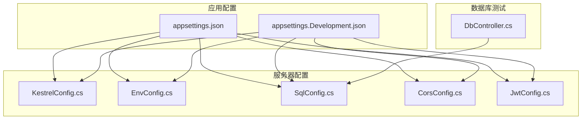
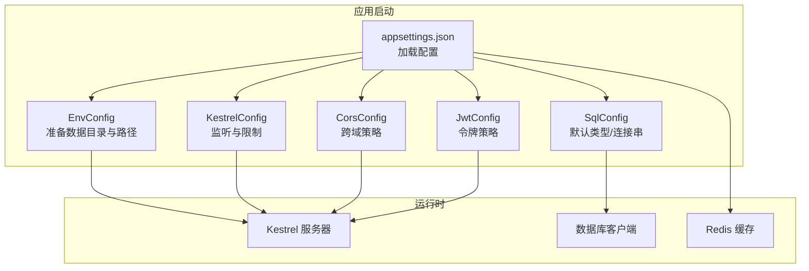
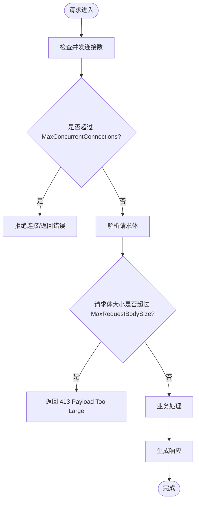
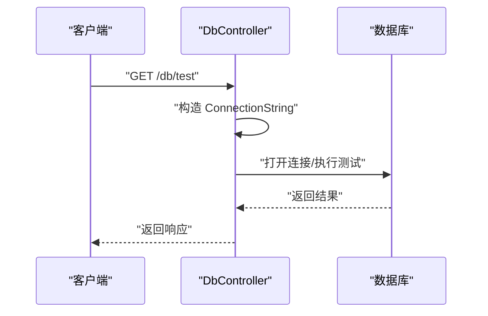
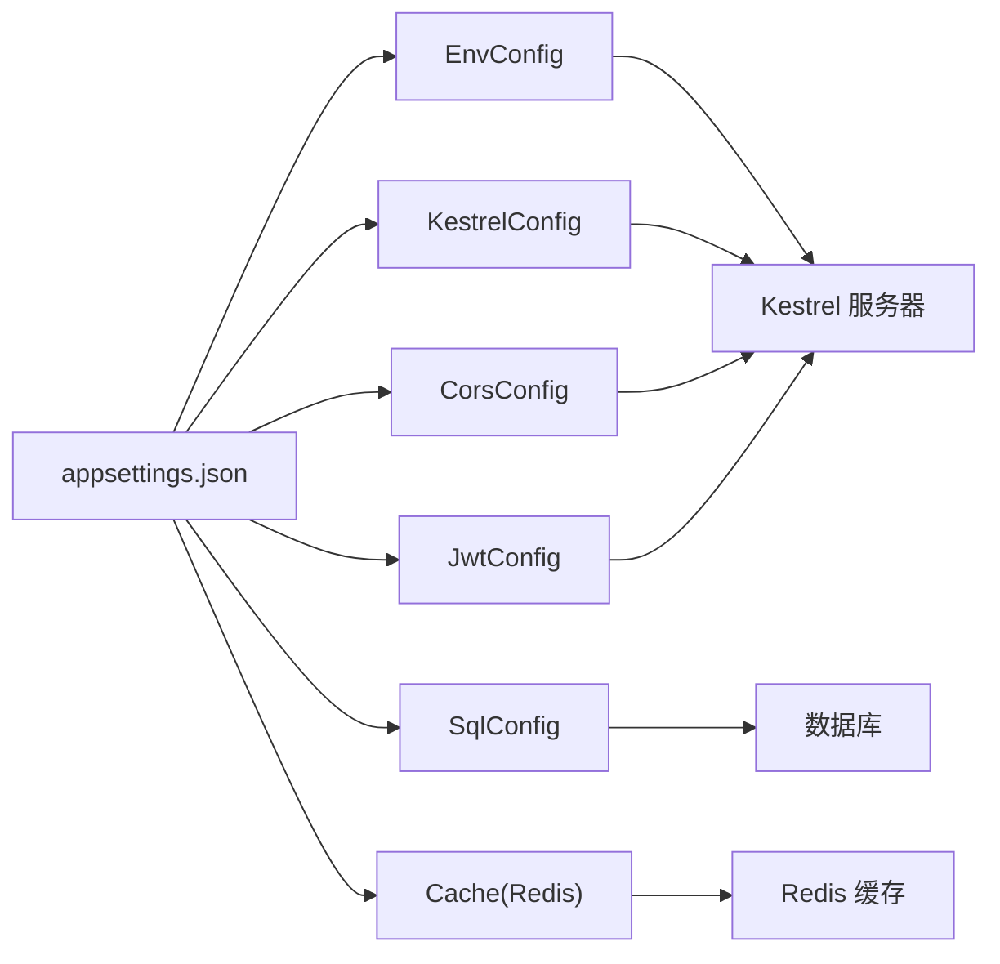

# 性能调优

<cite>
**本文引用的文件**
- [appsettings.json](file://Scm.Net/appsettings.json)
- [appsettings.Development.json](file://Scm.Net/appsettings.Development.json)
- [KestrelConfig.cs](file://Scm.Server/Config/KestrelConfig.cs)
- [EnvConfig.cs](file://Scm.Server/Config/EnvConfig.cs)
- [SqlConfig.cs](file://Scm.Server/Config/SqlConfig.cs)
- [DbController.cs](file://Scm.Net/Controllers/DbController.cs)
- [CorsConfig.cs](file://Scm.Server/Config/CorsConfig.cs)
- [JwtConfig.cs](file://Scm.Server/Config/JwtConfig.cs)
</cite>

## 目录
1. [简介](#简介)
2. [项目结构](#项目结构)
3. [核心组件](#核心组件)
4. [架构总览](#架构总览)
5. [详细组件分析](#详细组件分析)
6. [依赖关系分析](#依赖关系分析)
7. [性能考虑](#性能考虑)
8. [故障排查指南](#故障排查指南)
9. [结论](#结论)
10. [附录](#附录)

## 简介
本指南面向 Scm.Net 的性能调优与优化，聚焦以下方面：
- Kestrel 服务器的并发连接数限制、请求体大小限制与响应缓冲策略
- Redis 缓存的连接池大小、超时与内存使用优化
- 数据库连接池配置与查询性能优化
- 静态资源优化、CDN 配置与负载均衡策略
- 性能测试与基准测试方法，以及常见性能瓶颈的识别与解决

## 项目结构
Scm.Net 采用多项目分层组织，核心运行时配置集中在应用根目录的配置文件中；服务器侧的环境、SQL、JWT、跨域等配置在 Scm.Server 的 Config 目录下以强类型类进行管理；数据库连接与测试能力由 Scm.Net 的控制器提供。

**图表来源**
- [appsettings.json:1-127](file://Scm.Net/appsettings.json#L1-L127)
- [appsettings.Development.json:1-162](file://Scm.Net/appsettings.Development.json#L1-L162)
- [KestrelConfig.cs:1-24](file://Scm.Server/Config/KestrelConfig.cs#L1-L24)
- [EnvConfig.cs:1-280](file://Scm.Server/Config/EnvConfig.cs#L1-L280)
- [SqlConfig.cs:1-23](file://Scm.Server/Config/SqlConfig.cs#L1-L23)
- [CorsConfig.cs:1-49](file://Scm.Server/Config/CorsConfig.cs#L1-L49)
- [JwtConfig.cs:1-48](file://Scm.Server/Config/JwtConfig.cs#L1-L48)
- [DbController.cs:1-287](file://Scm.Net/Controllers/DbController.cs#L1-L287)

**章节来源**
- [appsettings.json:1-127](file://Scm.Net/appsettings.json#L1-L127)
- [appsettings.Development.json:1-162](file://Scm.Net/appsettings.Development.json#L1-L162)
- [KestrelConfig.cs:1-24](file://Scm.Server/Config/KestrelConfig.cs#L1-L24)
- [EnvConfig.cs:1-280](file://Scm.Server/Config/EnvConfig.cs#L1-L280)
- [SqlConfig.cs:1-23](file://Scm.Server/Config/SqlConfig.cs#L1-L23)
- [CorsConfig.cs:1-49](file://Scm.Server/Config/CorsConfig.cs#L1-L49)
- [JwtConfig.cs:1-48](file://Scm.Server/Config/JwtConfig.cs#L1-L48)
- [DbController.cs:1-287](file://Scm.Net/Controllers/DbController.cs#L1-L287)

## 核心组件
- Kestrel 服务器配置：通过 appsettings 中的 Kestrel 节点控制监听地址、并发连接上限与请求体大小限制。
- 环境与数据目录：EnvConfig 统一解析数据目录、上传/图片/日志/字体等路径，影响静态资源与缓存 IO。
- SQL 连接配置：SqlConfig 提供默认类型与连接字符串准备逻辑；DbController 提供数据库连通性测试与初始化入口。
- CORS 与 JWT：CorsConfig 与 JwtConfig 分别定义跨域与认证令牌策略，间接影响请求处理链路开销。
- 缓存配置：appsettings 中 Cache 节点指定 Redis 类型与连接串（含 poolsize），用于缓存性能调优。

**章节来源**
- [appsettings.json:26-38](file://Scm.Net/appsettings.json#L26-L38)
- [appsettings.json:57-60](file://Scm.Net/appsettings.json#L57-L60)
- [EnvConfig.cs:10-102](file://Scm.Server/Config/EnvConfig.cs#L10-L102)
- [SqlConfig.cs:5-21](file://Scm.Server/Config/SqlConfig.cs#L5-L21)
- [DbController.cs:29-213](file://Scm.Net/Controllers/DbController.cs#L29-L213)
- [CorsConfig.cs:5-46](file://Scm.Server/Config/CorsConfig.cs#L5-L46)
- [JwtConfig.cs:5-47](file://Scm.Server/Config/JwtConfig.cs#L5-L47)

## 架构总览
下图展示应用启动后，配置如何驱动服务器与数据层的行为，以及性能关键参数的位置。

**图表来源**
- [appsettings.json:1-127](file://Scm.Net/appsettings.json#L1-L127)
- [EnvConfig.cs:72-102](file://Scm.Server/Config/EnvConfig.cs#L72-L102)
- [KestrelConfig.cs:5-22](file://Scm.Server/Config/KestrelConfig.cs#L5-L22)
- [SqlConfig.cs:10-21](file://Scm.Server/Config/SqlConfig.cs#L10-L21)
- [CorsConfig.cs:24-46](file://Scm.Server/Config/CorsConfig.cs#L24-L46)
- [JwtConfig.cs:28-47](file://Scm.Server/Config/JwtConfig.cs#L28-L47)

## 详细组件分析

### Kestrel 并发与请求体限制
- 并发连接上限：通过 appsettings 的 Kestrel.Limits.MaxConcurrentConnections 控制，避免单实例过度并发导致线程争用与上下文切换开销上升。
- 请求体大小限制：通过 Kestrel.Limits.MaxRequestBodySize 控制，防止大体积上传占用过多内存与带宽。
- 响应缓冲：建议结合中间件与输出缓存策略减少小包发送次数；生产环境建议启用压缩与静态文件缓存。

**图表来源**
- [appsettings.json:34-37](file://Scm.Net/appsettings.json#L34-L37)

**章节来源**
- [appsettings.json:26-38](file://Scm.Net/appsettings.json#L26-L38)
- [KestrelConfig.cs:5-22](file://Scm.Server/Config/KestrelConfig.cs#L5-L22)

### Redis 缓存性能优化
- 连接池大小：通过 appsettings 中 Cache.Text 的 poolsize 指定，建议根据并发请求数与 CPU 核心数按比例配置，避免过多连接导致网络拥塞。
- 超时设置：建议在连接串中显式配置超时参数，确保在网络抖动时快速失败并降级。
- 内存使用优化：合理设置键空间过期策略与淘汰策略；对热点数据使用短 TTL；避免存储超大对象，必要时拆分为多个键。
- 命令批处理：批量读写可显著降低 RTT；使用流水线命令减少往返次数。

提示：当前配置中已包含 poolsize 参数，建议结合实际 QPS 与延迟目标进行压测校准。

**章节来源**
- [appsettings.json:57-60](file://Scm.Net/appsettings.json#L57-L60)

### 数据库连接池与查询优化
- 连接池配置：当前 DbController 中未显式设置连接池参数，但可通过连接串参数启用（如注释中所示的 max pool size、min pool size、connection timeout 等）。建议在生产环境明确设置这些参数，并与 Kestrel 并发上限协同。
- 查询性能：优先使用参数化查询与索引覆盖；避免 N+1 查询；对大批量写入使用事务与批量插入；对只读场景开启只读副本或读写分离。
- 连接生命周期：确保连接及时释放，避免连接泄漏；使用连接池复用连接。

**图表来源**
- [DbController.cs:29-213](file://Scm.Net/Controllers/DbController.cs#L29-L213)

**章节来源**
- [DbController.cs:45-160](file://Scm.Net/Controllers/DbController.cs#L45-L160)
- [SqlConfig.cs:10-21](file://Scm.Server/Config/SqlConfig.cs#L10-L21)

### 静态资源优化、CDN 与负载均衡
- 静态资源：利用 EnvConfig 解析的数据目录与映射路径，将静态资源放置在独立目录并启用浏览器缓存与 ETag/Last-Modified。
- CDN：将静态资源托管至 CDN，缩短边缘节点到用户的距离；对版本化文件名启用长期缓存。
- 负载均衡：在多实例部署时，使用反向代理做健康检查与会话亲和（如需）；结合 Kestrel 并发上限与数据库连接池上限，确保整体吞吐匹配。

**章节来源**
- [EnvConfig.cs:10-102](file://Scm.Server/Config/EnvConfig.cs#L10-L102)

### CORS 与 JWT 对性能的影响
- CORS：允许任意源/头/方法会增加预检请求与复杂头处理成本，建议在生产环境精确配置 AllowedOrigins/AllowedHeaders/AllowedMethods，并设置合理的 PreflightMaxAge。
- JWT：令牌签发与验证会带来 CPU 开销，建议缩短有效期、使用高效算法、缓存公钥（如适用）、避免不必要的声明。

**章节来源**
- [CorsConfig.cs:24-46](file://Scm.Server/Config/CorsConfig.cs#L24-L46)
- [JwtConfig.cs:28-47](file://Scm.Server/Config/JwtConfig.cs#L28-L47)

## 依赖关系分析
- 配置依赖：应用启动时从 appsettings 加载 Kestrel、Env、Sql、Cache、Cors、Jwt 等配置；各配置类负责参数准备与默认值设定。
- 运行时依赖：Kestrel 作为 HTTP 服务器承载请求；EnvConfig 影响静态资源与日志路径；DbController 使用 SqlConfig 与连接串访问数据库；Cache 通过 Redis 实现高性能缓存。

**图表来源**
- [appsettings.json:1-127](file://Scm.Net/appsettings.json#L1-L127)
- [KestrelConfig.cs:5-22](file://Scm.Server/Config/KestrelConfig.cs#L5-L22)
- [EnvConfig.cs:72-102](file://Scm.Server/Config/EnvConfig.cs#L72-L102)
- [SqlConfig.cs:10-21](file://Scm.Server/Config/SqlConfig.cs#L10-L21)
- [CorsConfig.cs:24-46](file://Scm.Server/Config/CorsConfig.cs#L24-L46)
- [JwtConfig.cs:28-47](file://Scm.Server/Config/JwtConfig.cs#L28-L47)

**章节来源**
- [appsettings.json:1-127](file://Scm.Net/appsettings.json#L1-L127)
- [KestrelConfig.cs:5-22](file://Scm.Server/Config/KestrelConfig.cs#L5-L22)
- [EnvConfig.cs:72-102](file://Scm.Server/Config/EnvConfig.cs#L72-L102)
- [SqlConfig.cs:10-21](file://Scm.Server/Config/SqlConfig.cs#L10-L21)
- [CorsConfig.cs:24-46](file://Scm.Server/Config/CorsConfig.cs#L24-L46)
- [JwtConfig.cs:28-47](file://Scm.Server/Config/JwtConfig.cs#L28-L47)

## 性能考虑
- Kestrel
  - 合理设置 MaxConcurrentConnections，避免与数据库连接池上限冲突
  - 将 MaxRequestBodySize 与前端上传策略一致，减少无效传输
  - 启用响应压缩与静态文件缓存
- Redis
  - poolsize 与 CPU 核心数成正比，结合压测确定最优值
  - 显式设置超时，避免阻塞等待
  - 热点键短 TTL，避免内存膨胀
- 数据库
  - 在连接串中显式设置连接池参数
  - 使用参数化查询与索引，避免全表扫描
  - 批量写入与事务合并
- 静态资源与 CDN
  - 版本化文件名与长期缓存
  - CDN 边缘缓存命中率优化
- 负载均衡
  - 反向代理健康检查与会话策略
  - 多实例间状态共享与一致性

[本节为通用指导，无需特定文件引用]

## 故障排查指南
- Kestrel 并发过高
  - 现象：CPU 占用高、延迟上升
  - 排查：检查 MaxConcurrentConnections 与数据库连接池上限是否匹配
  - 处置：降低并发上限或扩容数据库连接池
- 请求体过大
  - 现象：内存飙升、GC 压力大
  - 排查：确认 MaxRequestBodySize 与前端上传大小
  - 处置：调整限制或改用分片上传
- Redis 连接不足
  - 现象：缓存操作超时、降级频繁
  - 排查：poolsize 是否过小
  - 处置：增大 poolsize 并监控连接数
- 数据库连接池耗尽
  - 现象：大量请求排队、超时
  - 排查：连接串参数与池大小
  - 处置：增加池大小或优化查询
- CORS 预检过多
  - 现象：额外 RTT 与 403
  - 排查：AllowedOrigins/Headers/Methods 配置
  - 处置：精简允许范围并设置 PreflightMaxAge

**章节来源**
- [appsettings.json:34-37](file://Scm.Net/appsettings.json#L34-L37)
- [DbController.cs:45-160](file://Scm.Net/Controllers/DbController.cs#L45-L160)
- [CorsConfig.cs:24-46](file://Scm.Server/Config/CorsConfig.cs#L24-L46)

## 结论
通过在配置层面对 Kestrel 并发、请求体大小、Redis 连接池、数据库连接池与 CORS/JWT 策略进行系统性优化，并配合静态资源与 CDN、负载均衡策略，可显著提升 Scm.Net 的整体吞吐与稳定性。建议以压测为依据持续迭代参数，确保各组件协同工作。

[本节为总结，无需特定文件引用]

## 附录
- 性能测试与基准测试建议
  - 工具：dotnet benchmark、Artillery、JMeter、wrk
  - 场景：并发用户数、RPS、P95/P99 延迟、内存与 GC 行为
  - 关键指标：吞吐、延迟分布、错误率、资源利用率
- 常见瓶颈定位
  - I/O 密集：数据库与磁盘 IO，优化连接池与查询
  - 网络瓶颈：Redis 与外部服务，优化连接数与超时
  - CPU 瓶颈：序列化/反序列化与复杂计算，优化算法与缓存

[本节为通用指导，无需特定文件引用]