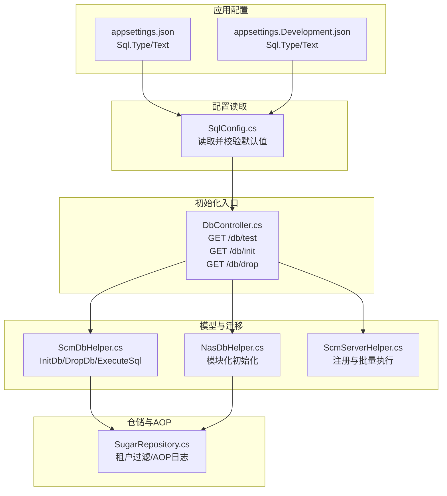
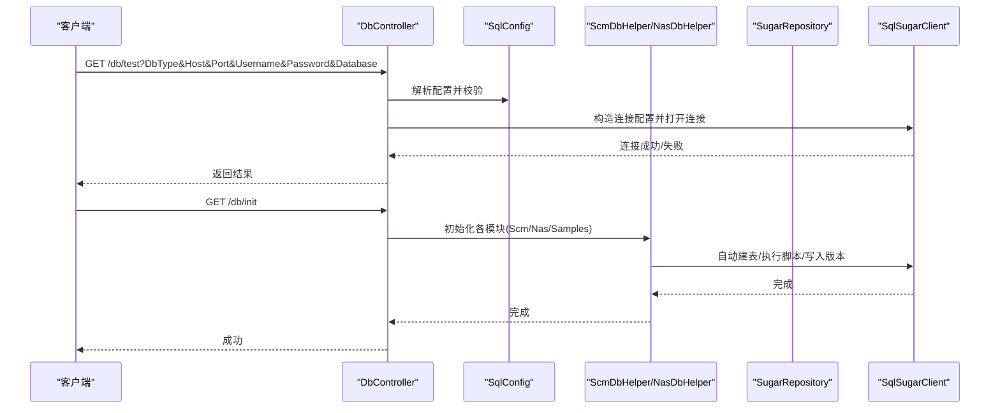
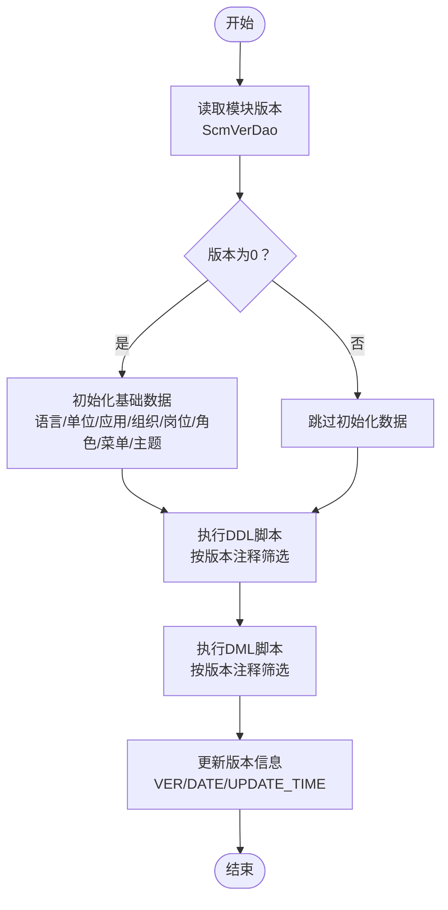
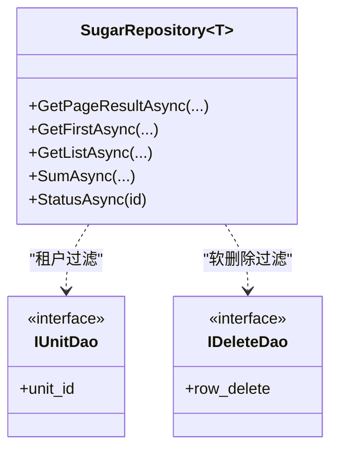
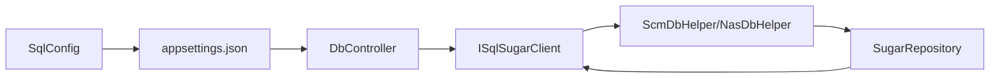

# 数据库初始化

<cite>
**本文引用的文件**
- [appsettings.json](file://Scm.Net/appsettings.json)
- [appsettings.Development.json](file://Scm.Net/appsettings.Development.json)
- [DbController.cs](file://Scm.Net/Controllers/DbController.cs)
- [SqlConfig.cs](file://Scm.Server/Config/SqlConfig.cs)
- [ScmDbHelper.cs](file://Scm.Dao/ScmDbHelper.cs)
- [NasDbHelper.cs](file://Nas.Dao/NasDbHelper.cs)
- [SugarRepository.cs](file://Scm.Dsa.Dba.Sugar/SugarRepository.cs)
- [Scm.Server.Dao/ScmServerHelper.cs](file://Scm.Server.Dao/ScmServerHelper.cs)
</cite>

## 目录
1. [简介](#简介)
2. [项目结构](#项目结构)
3. [核心组件](#核心组件)
4. [架构总览](#架构总览)
5. [详细组件分析](#详细组件分析)
6. [依赖关系分析](#依赖关系分析)
7. [性能考虑](#性能考虑)
8. [故障排查指南](#故障排查指南)
9. [结论](#结论)
10. [附录](#附录)

## 简介
本文件面向 Scm.Net 的数据库初始化与配置，覆盖以下内容：
- 数据库选择与配置：SQLite 嵌入式与主流企业数据库（MySQL、SQL Server、Oracle、PostgreSQL、DB2、达梦）的连接字符串设置
- 表结构初始化与数据迁移：基于 SqlSugar 的自动建表、版本控制与脚本执行机制
- 用户与权限：系统内置管理员账户、角色与菜单权限的初始化流程
- 性能优化：连接池、索引策略与查询优化建议
- 备份与恢复：实施方案与数据一致性保障

## 项目结构
Scm.Net 将数据库配置集中在应用配置文件中，并通过控制器与帮助器完成初始化与迁移。

图示来源
- [appsettings.json:48-56](file://Scm.Net/appsettings.json#L48-L56)
- [appsettings.Development.json:48-56](file://Scm.Net/appsettings.Development.json#L48-L56)
- [SqlConfig.cs:10-20](file://Scm.Server/Config/SqlConfig.cs#L10-L20)
- [DbController.cs:29-274](file://Scm.Net/Controllers/DbController.cs#L29-L274)
- [ScmDbHelper.cs:30-83](file://Scm.Dao/ScmDbHelper.cs#L30-L83)
- [NasDbHelper.cs:24-57](file://Nas.Dao/NasDbHelper.cs#L24-L57)
- [Scm.Server.Dao/ScmServerHelper.cs:9-50](file://Scm.Server.Dao/ScmServerHelper.cs#L9-L50)
- [SugarRepository.cs:29-82](file://Scm.Dsa.Dba.Sugar/SugarRepository.cs#L29-L82)

章节来源
- [appsettings.json:48-56](file://Scm.Net/appsettings.json#L48-L56)
- [appsettings.Development.json:48-56](file://Scm.Net/appsettings.Development.json#L48-L56)
- [SqlConfig.cs:10-20](file://Scm.Server/Config/SqlConfig.cs#L10-L20)
- [DbController.cs:29-274](file://Scm.Net/Controllers/DbController.cs#L29-L274)
- [ScmDbHelper.cs:30-83](file://Scm.Dao/ScmDbHelper.cs#L30-L83)
- [NasDbHelper.cs:24-57](file://Nas.Dao/NasDbHelper.cs#L24-L57)
- [Scm.Server.Dao/ScmServerHelper.cs:9-50](file://Scm.Server.Dao/ScmServerHelper.cs#L9-L50)
- [SugarRepository.cs:29-82](file://Scm.Dsa.Dba.Sugar/SugarRepository.cs#L29-L82)

## 核心组件
- 应用配置层：集中定义数据库类型与连接字符串，支持开发与生产环境差异化
- 控制器层：提供数据库连通性测试、初始化与清空接口
- 迁移与建模层：基于 SqlSugar 的自动建表、版本记录与脚本执行
- 仓储层：统一的分页查询、AOP 日志与租户过滤

章节来源
- [DbController.cs:29-274](file://Scm.Net/Controllers/DbController.cs#L29-L274)
- [ScmDbHelper.cs:30-83](file://Scm.Dao/ScmDbHelper.cs#L30-L83)
- [SugarRepository.cs:29-82](file://Scm.Dsa.Dba.Sugar/SugarRepository.cs#L29-L82)

## 架构总览
数据库初始化与配置的关键流程如下：

图示来源
- [DbController.cs:29-213](file://Scm.Net/Controllers/DbController.cs#L29-L213)
- [DbController.cs:247-274](file://Scm.Net/Controllers/DbController.cs#L247-L274)
- [ScmDbHelper.cs:51-83](file://Scm.Dao/ScmDbHelper.cs#L51-L83)
- [NasDbHelper.cs:24-57](file://Nas.Dao/NasDbHelper.cs#L24-L57)
- [SqlConfig.cs:10-20](file://Scm.Server/Config/SqlConfig.cs#L10-L20)

## 详细组件分析

### 数据库配置与连接字符串
- 默认配置
  - SQLite：在应用配置中以 Type=Sqlite、Text 指向本地数据库文件
  - 开发环境可指定绝对路径，便于本地调试
- 支持的企业数据库类型
  - MySQL/MariaDB、SQL Server、Oracle、PostgreSQL、DB2、达梦等
  - 控制器根据 DbType 动态拼接连接字符串
- 连接字符串示例（来自控制器逻辑）
  - MySQL/MariaDB：server={host};port={port};database={db};uid={user};pwd={pass};charset=utf8mb4;sslmode=None
  - SQL Server：Data Source={host},{port};Initial Catalog={db};User ID={user};Password={pass};TrustServerCertificate=True
  - Oracle：User Id={user};Password={pass};Data Source={host}:{port}/{db};Pooling=true
  - PostgreSQL：Host={host};Port={port};Database={db};Username={user};Password={pass}
  - DB2：Server={host}:{port};Database={db};UID={user};PWD={pass};CharSet=UTF-8
  - 达梦：Server={host};Port={port};Database={db};Uid={user};Pwd={pass};Pooling=true
- 连接测试
  - 控制器提供 /db/test 接口，用于验证数据库连通性与权限

章节来源
- [appsettings.json:48-56](file://Scm.Net/appsettings.json#L48-L56)
- [appsettings.Development.json:48-56](file://Scm.Net/appsettings.Development.json#L48-L56)
- [DbController.cs:41-189](file://Scm.Net/Controllers/DbController.cs#L41-L189)
- [SqlConfig.cs:10-20](file://Scm.Server/Config/SqlConfig.cs#L10-L20)

### 表结构初始化与数据迁移
- 初始化流程
  - 自动建表：扫描 DAO 类型并调用 CodeFirst.InitTables
  - 版本控制：使用 ScmVerDao 记录模块版本与更新时间
  - 脚本执行：按注释中的版本标记执行 DDL/DML 脚本
- ScmDbHelper
  - 初始化主系统：创建基础数据（语言、计量单位、应用、组织、岗位、角色、菜单、主题等），并写入版本
  - 支持清空数据库与重建
- NasDbHelper
  - 初始化 NAS 子系统：注册菜单与权限，插入应用与配置
- 批量执行
  - DbController 统一调用 ScmDbHelper、SamplesDbHelper、NasDbHelper 的 InitDb/DropDb
  - ScmServerHelper 可注册多个模型帮助器进行批量初始化

图示来源
- [ScmDbHelper.cs:51-83](file://Scm.Dao/ScmDbHelper.cs#L51-L83)
- [ScmDbHelper.cs:213-287](file://Scm.Dao/ScmDbHelper.cs#L213-L287)
- [NasDbHelper.cs:24-57](file://Nas.Dao/NasDbHelper.cs#L24-L57)
- [DbController.cs:247-274](file://Scm.Net/Controllers/DbController.cs#L247-L274)

章节来源
- [ScmDbHelper.cs:51-83](file://Scm.Dao/ScmDbHelper.cs#L51-L83)
- [ScmDbHelper.cs:213-287](file://Scm.Dao/ScmDbHelper.cs#L213-L287)
- [NasDbHelper.cs:24-57](file://Nas.Dao/NasDbHelper.cs#L24-L57)
- [DbController.cs:247-274](file://Scm.Net/Controllers/DbController.cs#L247-L274)

### 数据库用户与权限
- 系统内置管理员
  - 用户：系统管理员（编码 admin/X0001030），初始密码已在初始化脚本中设定
  - 角色：系统管理员（admin），拥有根菜单与全部功能权限
  - 组织/岗位/群组/角色/用户等基础数据在初始化时创建
- 权限分配
  - 通过角色与菜单授权（RoleAuthDao）建立菜单访问权限
  - 系统管理员被授予根菜单与所有子菜单权限
- 建议
  - 部署后立即修改管理员密码
  - 为不同业务线划分角色与菜单权限，避免越权访问

章节来源
- [ScmDbHelper.cs:375-663](file://Scm.Dao/ScmDbHelper.cs#L375-L663)
- [ScmDbHelper.cs:482-591](file://Scm.Dao/ScmDbHelper.cs#L482-L591)

### 仓储与查询优化
- 租户过滤与软删除
  - 通过 QueryFilter 对实现 IUnitDao 的实体按单位过滤，对实现 IDeleteDao 的实体按 row_delete=false 过滤
- AOP 日志
  - OnLogExecuting 输出最终 SQL，便于定位慢查询与异常
- 分页查询
  - 提供通用分页接口，支持表达式条件与排序

图示来源
- [SugarRepository.cs:13-190](file://Scm.Dsa.Dba.Sugar/SugarRepository.cs#L13-L190)

章节来源
- [SugarRepository.cs:29-82](file://Scm.Dsa.Dba.Sugar/SugarRepository.cs#L29-L82)
- [SugarRepository.cs:93-124](file://Scm.Dsa.Dba.Sugar/SugarRepository.cs#L93-L124)

## 依赖关系分析
- 配置依赖
  - SqlConfig 从 appsettings 中读取 Sql.Type 与 Sql.Text，并提供默认值
- 控制器依赖
  - DbController 依赖 EnvConfig 获取数据目录，依赖 ISqlSugarClient 执行初始化
- 迁移依赖
  - ScmDbHelper/NasDbHelper 依赖 SqlSugarClient 的 CodeFirst 与 ADO 执行脚本
- 仓储依赖
  - SugarRepository 依赖 AppUtils 注入的 ISqlSugarClient 与 JwtContextHolder

图示来源
- [SqlConfig.cs:10-20](file://Scm.Server/Config/SqlConfig.cs#L10-L20)
- [appsettings.json:48-56](file://Scm.Net/appsettings.json#L48-L56)
- [DbController.cs:23-27](file://Scm.Net/Controllers/DbController.cs#L23-L27)
- [ScmDbHelper.cs:27-34](file://Scm.Dao/ScmDbHelper.cs#L27-L34)
- [SugarRepository.cs:18-28](file://Scm.Dsa.Dba.Sugar/SugarRepository.cs#L18-L28)

章节来源
- [SqlConfig.cs:10-20](file://Scm.Server/Config/SqlConfig.cs#L10-L20)
- [DbController.cs:23-27](file://Scm.Net/Controllers/DbController.cs#L23-L27)
- [ScmDbHelper.cs:27-34](file://Scm.Dao/ScmDbHelper.cs#L27-L34)
- [SugarRepository.cs:18-28](file://Scm.Dsa.Dba.Sugar/SugarRepository.cs#L18-L28)

## 性能考虑
- 连接池
  - 企业数据库建议在连接字符串中启用连接池参数（如 Max Pool Size、Min Pool Size、Pooling=true），以提升并发性能
  - SQLite 在嵌入式场景下无需复杂连接池配置，但需注意 WAL 模式与并发写入策略
- 查询优化
  - 使用 SugarRepository 的分页接口，避免一次性加载大量数据
  - 合理使用 Where 条件与排序字段，确保索引命中
- 日志与监控
  - 利用 AOP 日志输出 SQL，识别慢查询并针对性优化
- 缓存
  - 结合缓存组件（Redis）减少热点查询压力（配置位于 appsettings 的 Cache 节点）

章节来源
- [DbController.cs:66-67](file://Scm.Net/Controllers/DbController.cs#L66-L67)
- [DbController.cs:92-93](file://Scm.Net/Controllers/DbController.cs#L92-L93)
- [DbController.cs:128-129](file://Scm.Net/Controllers/DbController.cs#L128-L129)
- [DbController.cs:153-154](file://Scm.Net/Controllers/DbController.cs#L153-L154)
- [DbController.cs:102-103](file://Scm.Net/Controllers/DbController.cs#L102-L103)
- [appsettings.json:57-60](file://Scm.Net/appsettings.json#L57-L60)

## 故障排查指南
- 连接失败
  - 检查 DbType 与连接字符串是否匹配目标数据库
  - 使用 /db/test 接口验证连通性与权限
- 初始化失败
  - 查看控制器返回的具体异常信息
  - 确认数据目录存在且具备写权限
- 权限问题
  - 确保数据库用户具备创建表与执行脚本的权限
  - 如使用 SQL Server，请确认信任连接或凭据正确
- 日志定位
  - 启用 AOP 日志输出，查看最终执行的 SQL
  - 检查应用日志目录与滚动策略

章节来源
- [DbController.cs:29-213](file://Scm.Net/Controllers/DbController.cs#L29-L213)
- [DbController.cs:215-242](file://Scm.Net/Controllers/DbController.cs#L215-L242)
- [SugarRepository.cs:71-81](file://Scm.Dsa.Dba.Sugar/SugarRepository.cs#L71-L81)

## 结论
Scm.Net 提供了完整的数据库初始化与配置能力，支持 SQLite 嵌入式与主流企业数据库。通过控制器统一入口、帮助器的版本化迁移与脚本执行、以及仓储层的租户过滤与 AOP 日志，能够满足从开发到生产的数据库管理需求。建议在生产环境中结合连接池、索引与缓存策略进一步优化性能，并完善备份与恢复方案以保障数据安全。

## 附录

### 数据库初始化步骤
- 准备环境
  - 确认目标数据库可用，准备好连接字符串
  - 准备数据目录（用于存放脚本与数据库文件）
- 连接测试
  - 调用 /db/test 接口验证连通性
- 初始化
  - 调用 /db/init 接口完成建表、脚本执行与版本写入
- 验证
  - 登录系统，检查管理员账户与菜单权限是否正常

章节来源
- [DbController.cs:29-213](file://Scm.Net/Controllers/DbController.cs#L29-L213)
- [DbController.cs:247-274](file://Scm.Net/Controllers/DbController.cs#L247-L274)