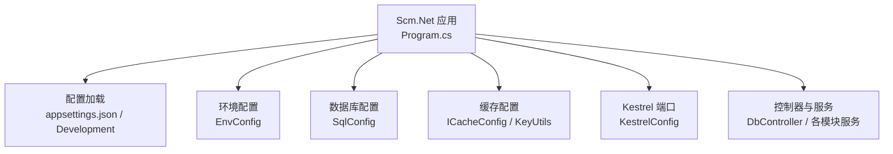
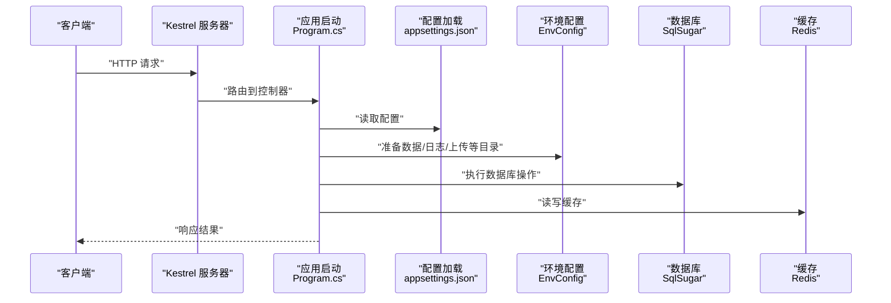
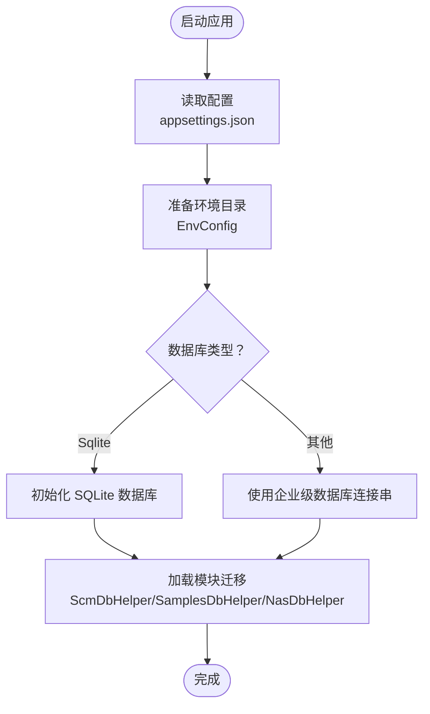
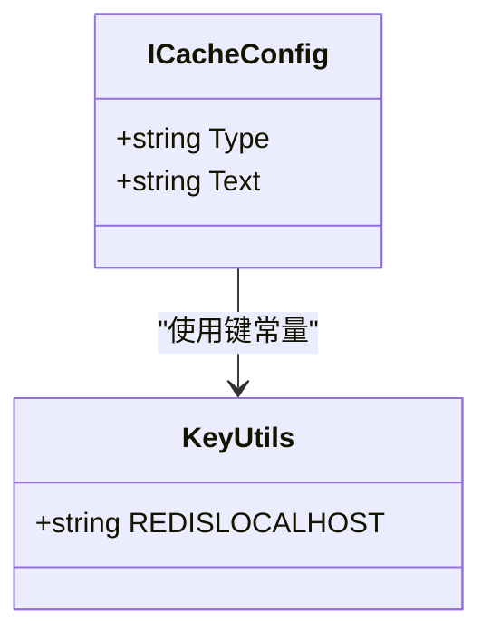
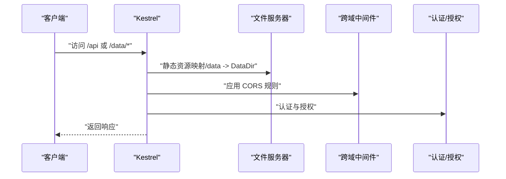
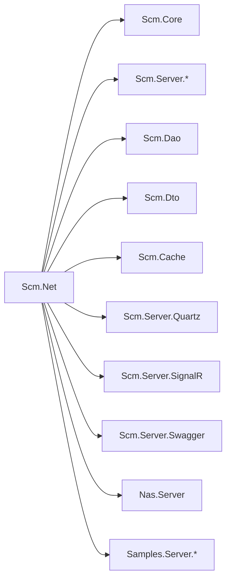

# 环境准备

<cite>
**本文引用的文件**
- [Scm.Net.csproj](file://Scm.Net/Scm.Net.csproj)
- [Program.cs](file://Scm.Net/Program.cs)
- [appsettings.json](file://Scm.Net/appsettings.json)
- [appsettings.Development.json](file://Scm.Net/appsettings.Development.json)
- [EnvConfig.cs](file://Scm.Server/Config/EnvConfig.cs)
- [SqlConfig.cs](file://Scm.Server/Config/SqlConfig.cs)
- [KestrelConfig.cs](file://Scm.Server/Config/KestrelConfig.cs)
- [DbController.cs](file://Scm.Net/Controllers/DbController.cs)
- [ScmDbHelper.cs](file://Scm.Dao/ScmDbHelper.cs)
- [SamplesDbHelper.cs](file://Samples.Server.Dao/SamplesDbHelper.cs)
- [NasDbHelper.cs](file://Nas.Dao/NasDbHelper.cs)
- [ICacheConfig.cs](file://Scm.Cache/Cache/ICacheConfig.cs)
- [KeyUtils.cs](file://Scm.Common/Utils/KeyUtils.cs)
</cite>

## 目录
1. [简介](#简介)
2. [项目结构](#项目结构)
3. [核心组件](#核心组件)
4. [架构总览](#架构总览)
5. [详细组件分析](#详细组件分析)
6. [依赖分析](#依赖分析)
7. [性能考虑](#性能考虑)
8. [故障排查指南](#故障排查指南)
9. [结论](#结论)
10. [附录](#附录)

## 简介
本指南面向 Scm.Net 的环境准备与部署，覆盖硬件与操作系统要求、.NET 10 运行时与 SDK 安装、数据库（SQLite 嵌入式与企业级数据库）配置、Redis 缓存服务安装与配置、以及 Docker 环境准备与容器化部署前检查清单。文档基于仓库中的配置与实现进行梳理，确保读者能够按步骤完成本地开发与生产部署。

## 项目结构
Scm.Net 采用 ASP.NET Core 10（net10.0）作为运行时，核心应用位于 Scm.Net 工程，通过配置文件 appsettings.json 控制日志、Kestrel 端口、数据目录、数据库类型与连接字符串、缓存类型与连接串、任务调度（Quartz）、邮件、OIDC、OTP、代码生成器、JWT、安全参数与跨域策略等。程序入口在 Program.cs 中完成服务注册、中间件装配与路由映射。

图表来源
- [Program.cs:31-258](file://Scm.Net/Program.cs#L31-L258)
- [appsettings.json:1-127](file://Scm.Net/appsettings.json#L1-L127)
- [EnvConfig.cs:10-102](file://Scm.Server/Config/EnvConfig.cs#L10-L102)
- [SqlConfig.cs:1-23](file://Scm.Server/Config/SqlConfig.cs#L1-L23)
- [ICacheConfig.cs:1-8](file://Scm.Cache/Cache/ICacheConfig.cs#L1-L8)
- [KeyUtils.cs:1-53](file://Scm.Common/Utils/KeyUtils.cs#L1-L53)
- [KestrelConfig.cs:1-24](file://Scm.Server/Config/KestrelConfig.cs#L1-L24)

章节来源
- [Scm.Net.csproj:1-86](file://Scm.Net/Scm.Net.csproj#L1-L86)
- [Program.cs:31-258](file://Scm.Net/Program.cs#L31-L258)
- [appsettings.json:1-127](file://Scm.Net/appsettings.json#L1-L127)
- [appsettings.Development.json:1-162](file://Scm.Net/appsettings.Development.json#L1-L162)

## 核心组件
- 运行时与 SDK
  - 目标框架：net10.0
  - 使用 Newtonsoft.Json 适配器
  - 引入 Serilog 日志生态
- 配置体系
  - appsettings.json：生产默认配置（含 Kestrel、Env、Sql、Uid、Cache、Quartz、Email、Oidc、Otp、Generator、Jwt、Security、Cors）
  - appsettings.Development.json：开发默认配置（端口、数据目录、缓存、OIDC、OTP、Swagger 等）
- 数据与存储
  - 默认使用 SQLite（Sqlite），连接字符串指向 data 目录下的数据库文件
  - 支持将数据库类型切换为企业级数据库（通过配置）
  - 数据目录由 EnvConfig 统一管理，支持相对/绝对路径与子目录映射
- 缓存
  - 默认使用 Redis，连接串可通过配置项指定
  - 提供统一的缓存接口 ICacheConfig
- 任务调度
  - Quartz 配置包含基础目录、日志目录、数据目录与作业文件名
- 安全与认证
  - JWT 参数（密钥、发行者、受众、过期时间）
  - OIDC/Otp/Email 等扩展配置

章节来源
- [Scm.Net.csproj:1-86](file://Scm.Net/Scm.Net.csproj#L1-L86)
- [appsettings.json:26-127](file://Scm.Net/appsettings.json#L26-L127)
- [appsettings.Development.json:26-162](file://Scm.Net/appsettings.Development.json#L26-L162)
- [EnvConfig.cs:10-102](file://Scm.Server/Config/EnvConfig.cs#L10-L102)
- [SqlConfig.cs:1-23](file://Scm.Server/Config/SqlConfig.cs#L1-L23)
- [ICacheConfig.cs:1-8](file://Scm.Cache/Cache/ICacheConfig.cs#L1-L8)
- [KeyUtils.cs:1-53](file://Scm.Common/Utils/KeyUtils.cs#L1-L53)

## 架构总览
下图展示从请求进入至数据库与缓存交互的关键流程，体现配置驱动的服务装配与数据流。

图表来源
- [Program.cs:31-258](file://Scm.Net/Program.cs#L31-L258)
- [appsettings.json:1-127](file://Scm.Net/appsettings.json#L1-L127)
- [EnvConfig.cs:72-102](file://Scm.Server/Config/EnvConfig.cs#L72-L102)

## 详细组件分析

### 硬件与操作系统要求
- 硬件建议
  - CPU：至少 2 核心，推荐 4 核以上以满足并发与任务调度需求
  - 内存：最低 2 GB，推荐 4–8 GB；高并发与图像处理场景建议 16 GB+
  - 存储：本地磁盘需预留数据库文件、日志、上传与临时目录空间；建议 SSD 提升 I/O 性能
  - 网络：千兆以太网优先；根据并发与带宽需求选择更高规格
- 操作系统兼容性
  - Windows：支持桌面版与服务器版（Windows Server）
  - Linux：通用发行版（如 Ubuntu、CentOS/RHEL、AlmaLinux）
  - macOS：支持 Intel 与 Apple Silicon（M 系列）芯片
- .NET 10 运行时与 SDK
  - 目标框架 net10.0，需安装 .NET 10 SDK 与运行时
  - 安装方式参考官方包管理器或下载页面（仓库未包含安装脚本）

章节来源
- [Scm.Net.csproj:3-10](file://Scm.Net/Scm.Net.csproj#L3-L10)

### 数据库系统安装与配置
- SQLite 嵌入式配置
  - 默认类型为 Sqlite，连接字符串指向 data 目录下的数据库文件
  - 开发环境与生产环境均提供默认连接串
  - 初始化与重建数据库可通过控制器接口触发
- 企业级数据库部署
  - 可通过配置将 Type 切换为其他数据库类型，并在 Text 中提供相应连接串
  - 数据库初始化与迁移由各模块的 DbHelper 执行（ScmDbHelper、SamplesDbHelper、NasDbHelper）
- 目录与文件准备
  - 数据目录由 EnvConfig 统一管理，支持相对/绝对路径与子目录映射
  - 首次启动会自动创建缺失目录（日志、上传、图片、头像、临时、字体等）

图表来源
- [appsettings.json:48-56](file://Scm.Net/appsettings.json#L48-L56)
- [appsettings.Development.json:48-56](file://Scm.Net/appsettings.Development.json#L48-L56)
- [EnvConfig.cs:72-102](file://Scm.Server/Config/EnvConfig.cs#L72-L102)
- [SqlConfig.cs:10-20](file://Scm.Server/Config/SqlConfig.cs#L10-L20)
- [ScmDbHelper.cs:51-97](file://Scm.Dao/ScmDbHelper.cs#L51-L97)
- [SamplesDbHelper.cs:21-58](file://Samples.Server.Dao/SamplesDbHelper.cs#L21-L58)
- [NasDbHelper.cs:24-51](file://Nas.Dao/NasDbHelper.cs#L24-L51)

章节来源
- [appsettings.json:48-56](file://Scm.Net/appsettings.json#L48-L56)
- [appsettings.Development.json:48-56](file://Scm.Net/appsettings.Development.json#L48-L56)
- [EnvConfig.cs:72-102](file://Scm.Server/Config/EnvConfig.cs#L72-L102)
- [SqlConfig.cs:10-20](file://Scm.Server/Config/SqlConfig.cs#L10-L20)
- [DbController.cs:215-274](file://Scm.Net/Controllers/DbController.cs#L215-L274)
- [ScmDbHelper.cs:51-97](file://Scm.Dao/ScmDbHelper.cs#L51-L97)
- [SamplesDbHelper.cs:21-58](file://Samples.Server.Dao/SamplesDbHelper.cs#L21-L58)
- [NasDbHelper.cs:24-51](file://Nas.Dao/NasDbHelper.cs#L24-L51)

### Redis 缓存服务安装与配置
- 安装
  - 在目标主机安装 Redis 服务（单机或集群视业务规模而定）
  - 确保防火墙放行 Redis 端口（默认 6379）
- 配置
  - 默认类型为 Redis，连接串可在配置中指定（主机、默认数据库、连接池大小等）
  - 连接串键常量定义于 KeyUtils，便于集中管理
- 使用
  - 通过 ICacheConfig 抽象进行读写与过期控制

图表来源
- [ICacheConfig.cs:1-8](file://Scm.Cache/Cache/ICacheConfig.cs#L1-L8)
- [KeyUtils.cs:28-31](file://Scm.Common/Utils/KeyUtils.cs#L28-L31)

章节来源
- [appsettings.json:57-60](file://Scm.Net/appsettings.json#L57-L60)
- [appsettings.Development.json:57-60](file://Scm.Net/appsettings.Development.json#L57-L60)
- [ICacheConfig.cs:1-8](file://Scm.Cache/Cache/ICacheConfig.cs#L1-L8)
- [KeyUtils.cs:28-31](file://Scm.Common/Utils/KeyUtils.cs#L28-L31)

### Kestrel 与端口、静态资源与 CORS
- Kestrel 端口
  - 生产默认监听 http://*:9999，开发默认监听 http://*:5000
  - 可通过 KestrelConfig 或 appsettings 中的 Url 调整
- 静态资源
  - 映射数据目录（由 EnvConfig.DataUri/DataDir 决定）
- CORS
  - 可启用全局 CORS 或自定义规则，允许来源、方法、头部与凭据

图表来源
- [appsettings.json:26-47](file://Scm.Net/appsettings.json#L26-L47)
- [appsettings.Development.json:26-47](file://Scm.Net/appsettings.Development.json#L26-L47)
- [Program.cs:194-238](file://Scm.Net/Program.cs#L194-L238)
- [EnvConfig.cs:174-177](file://Scm.Server/Config/EnvConfig.cs#L174-L177)

章节来源
- [appsettings.json:26-47](file://Scm.Net/appsettings.json#L26-L47)
- [appsettings.Development.json:26-47](file://Scm.Net/appsettings.Development.json#L26-L47)
- [KestrelConfig.cs:1-24](file://Scm.Server/Config/KestrelConfig.cs#L1-L24)
- [Program.cs:194-238](file://Scm.Net/Program.cs#L194-L238)
- [EnvConfig.cs:174-177](file://Scm.Server/Config/EnvConfig.cs#L174-L177)

### 任务调度（Quartz）与日志
- Quartz
  - 配置包含基础目录、日志目录、数据目录与作业文件名
- 日志
  - 使用 Serilog 输出到控制台与文件，滚动周期按日

章节来源
- [appsettings.json:61-66](file://Scm.Net/appsettings.json#L61-L66)
- [appsettings.Development.json:61-67](file://Scm.Net/appsettings.Development.json#L61-L67)
- [appsettings.json:3-25](file://Scm.Net/appsettings.json#L3-L25)
- [appsettings.Development.json:3-25](file://Scm.Net/appsettings.Development.json#L3-L25)

### 安全与认证（JWT、OIDC、OTP、邮件）
- JWT
  - 密钥、发行者、受众、过期时间等参数在配置中设定
- OIDC
  - 提供 app_key、app_secret、redirect_uri、scope 等
- OTP
  - 支持 TOTP/HOTP 等算法与模板
- 邮件
  - SMTP 服务器、端口、用户名、密码等

章节来源
- [appsettings.json:100-111](file://Scm.Net/appsettings.json#L100-L111)
- [appsettings.Development.json:112-123](file://Scm.Net/appsettings.Development.json#L112-L123)
- [appsettings.json:76-90](file://Scm.Net/appsettings.json#L76-L90)
- [appsettings.Development.json:68-101](file://Scm.Net/appsettings.Development.json#L68-L101)
- [appsettings.json:70-75](file://Scm.Net/appsettings.json#L70-L75)
- [appsettings.Development.json:92-101](file://Scm.Net/appsettings.Development.json#L92-L101)

## 依赖分析
- 运行时与包
  - 目标框架 net10.0
  - Newtonsoft.Json 适配器、Serilog 日志生态、ImageSharp 图像处理
- 项目引用
  - 核心模块：Scm.Core、Scm.Server.*、Scm.Dao、Scm.Dto、Nas.Server、Samples.Server.*
  - 缓存与任务调度：Scm.Cache、Scm.Server.Cache、Scm.Server.Quartz
  - 信号与 Swagger：Scm.Server.SignalR、Scm.Server.Swagger
- 外部库
  - 通过 HintPath 引用若干 netstandard2.0 与 net10.0 的本地 DLL

图表来源
- [Scm.Net.csproj:37-48](file://Scm.Net/Scm.Net.csproj#L37-L48)

章节来源
- [Scm.Net.csproj:1-86](file://Scm.Net/Scm.Net.csproj#L1-L86)

## 性能考虑
- 数据库
  - SQLite 适合开发与小规模生产；高并发场景建议迁移到企业级数据库并优化索引与连接池
  - 合理设置 MaxRequestBodySize 与并发连接上限
- 缓存
  - Redis 连接池大小应与并发线程数匹配；合理设置键过期策略
- 日志
  - 生产环境最小日志级别建议为 Information；避免频繁 I/O
- 图像处理
  - ImageSharp 依赖字体与图像资源，确保字体目录与默认字体配置正确

## 故障排查指南
- 数据库初始化失败
  - 检查数据目录权限与连接串；确认数据库文件存在或可创建
  - 通过控制器接口触发初始化或重建数据库
- 缓存不可用
  - 核对 Redis 连接串与可达性；确认键常量与配置一致
- 静态资源无法访问
  - 检查 EnvConfig 的 DataUri 与 DataDir 映射关系
- CORS 报错
  - 校验 AllowedOrigins、AllowedMethods、AllowedHeaders 与 AllowCredentials
- JWT/认证问题
  - 校验密钥、发行者、受众与过期时间；确认中间件顺序与授权策略

章节来源
- [DbController.cs:215-274](file://Scm.Net/Controllers/DbController.cs#L215-L274)
- [KeyUtils.cs:28-31](file://Scm.Common/Utils/KeyUtils.cs#L28-L31)
- [Program.cs:194-238](file://Scm.Net/Program.cs#L194-L238)
- [appsettings.json:115-127](file://Scm.Net/appsettings.json#L115-L127)
- [appsettings.Development.json:127-138](file://Scm.Net/appsettings.Development.json#L127-L138)
- [appsettings.json:100-111](file://Scm.Net/appsettings.json#L100-L111)
- [appsettings.Development.json:112-123](file://Scm.Net/appsettings.Development.json#L112-L123)

## 结论
本指南基于 Scm.Net 仓库中的配置与实现，给出了从硬件、操作系统、.NET 10 运行时与 SDK、数据库（SQLite 与企业级数据库）、Redis 缓存、Kestrel 端口与静态资源、CORS、JWT/OIDC/OTP/邮件到任务调度与日志的完整环境准备要点。建议在开发阶段使用默认配置快速启动，在生产阶段结合业务规模调整数据库与缓存策略，并完善监控与备份机制。

## 附录
- Docker 环境准备与容器化部署前检查清单
  - 准备 .NET 10 SDK 与运行时镜像
  - 构建应用并生成容器镜像
  - 暴露 Kestrel 端口（默认 9999/5000）
  - 挂载数据卷（data、logs、upload、images、fonts 等）
  - 配置 Redis 服务并与应用连接
  - 设置环境变量覆盖 appsettings（如连接串、JWT 密钥、CORS 来源）
  - 预热数据库与缓存，验证健康检查端点
  - 部署后进行功能与性能回归测试