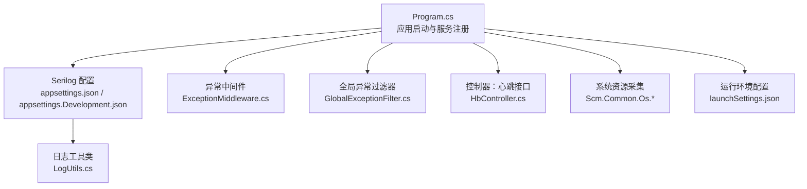
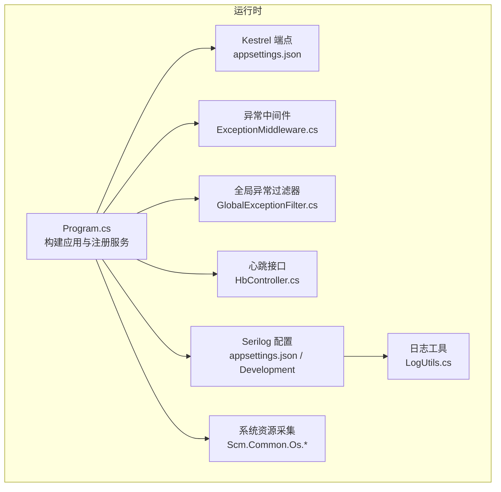
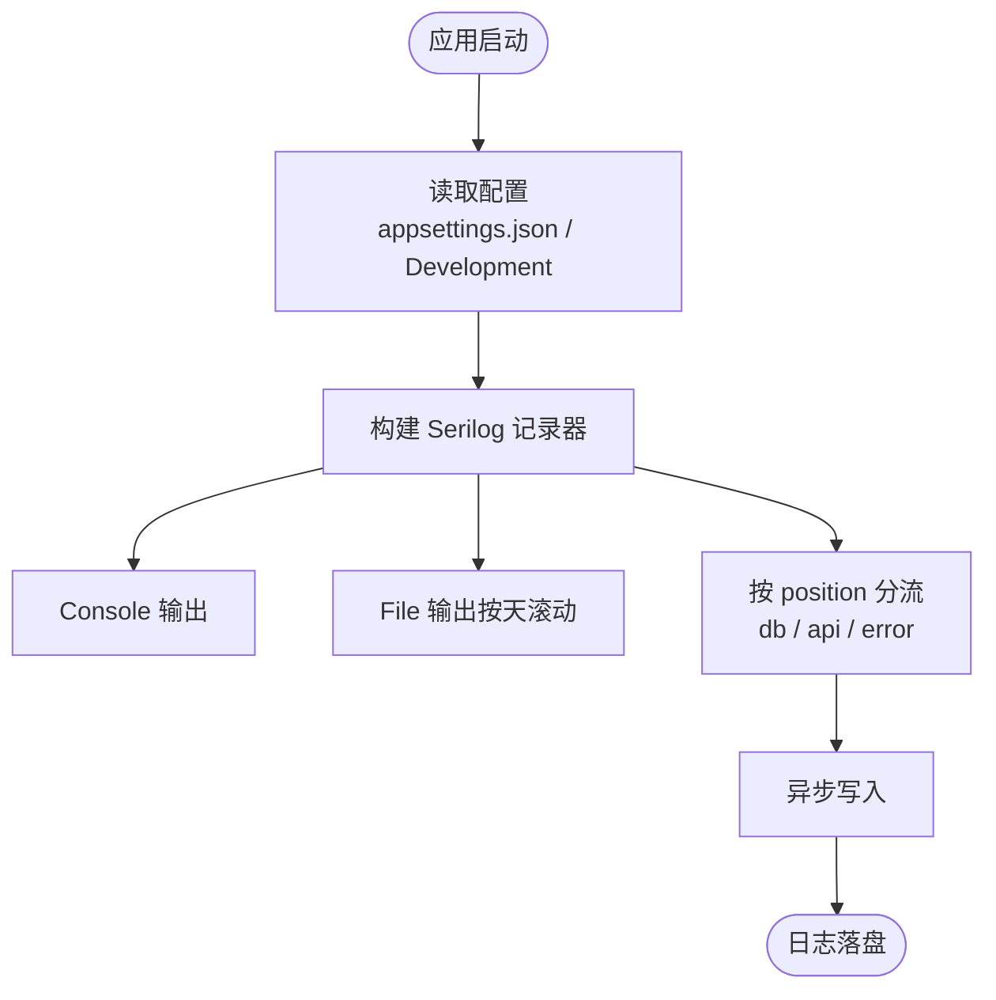
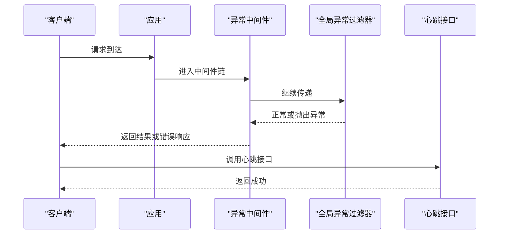
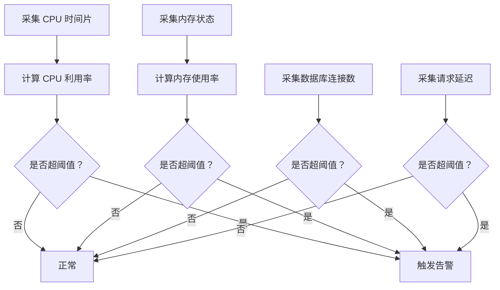
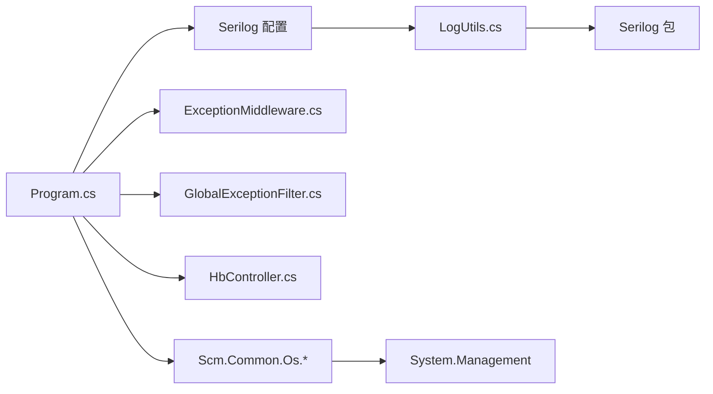

# 监控配置

<cite>
**本文引用的文件**   
- [Program.cs](file://Scm.Net/Program.cs)
- [appsettings.json](file://Scm.Net/appsettings.json)
- [appsettings.Development.json](file://Scm.Net/appsettings.Development.json)
- [LogUtils.cs](file://Scm.Common.Log/Utils/LogUtils.cs)
- [ExceptionMiddleware.cs](file://Scm.Core/Configure/Middleware/ExceptionMiddleware.cs)
- [GlobalExceptionFilter.cs](file://Scm.Core/Configure/Filters/GlobalExceptionFilter.cs)
- [HbController.cs](file://Scm.Net/Controllers/HbController.cs)
- [WindowsCPU.cs](file://Scm.Common.Os/OS/Windows/Cpu/WindowsCPU.cs)
- [CPUTime.cs](file://Scm.Common.Os/OS/Windows/Cpu/CPUTime.cs)
- [LinuxCPU.cs](file://Scm.Common.Os/OS/Windows/Cpu/LinuxCPU.cs)
- [MEMORYSTATUS.cs](file://Scm.Common.Os/OS/Windows/Memory/MEMORYSTATUS.cs)
- [MemoryStatusExE.cs](file://Scm.Common.Os/OS/Windows/Memory/MemoryStatusExE.cs)
- [Scm.Common.Log.csproj](file://Scm.Common.Log/Scm.Common.Log.csproj)
- [Scm.Common.Os.csproj](file://Scm.Common.Os/Scm.Common.Os.csproj)
- [launchSettings.json](file://Scm.Net/Properties/launchSettings.json)
</cite>

## 目录
1. [简介](#简介)
2. [项目结构](#项目结构)
3. [核心组件](#核心组件)
4. [架构总览](#架构总览)
5. [详细组件分析](#详细组件分析)
6. [依赖关系分析](#依赖关系分析)
7. [性能考量](#性能考量)
8. [故障排查指南](#故障排查指南)
9. [结论](#结论)
10. [附录](#附录)

## 简介
本文件面向 Scm.Net 的监控与运维管理，聚焦于应用监控配置，包括性能指标采集、结构化日志记录、健康检查与异常处理。文档同时给出基于现有配置的 Serilog 结构化日志配置与日志轮转策略说明，并提供 APM 集成建议（Application Insights 与 Prometheus + Grafana）。最后，给出系统监控指标定义、阈值建议、告警与通知机制设置思路，以及故障自动恢复的实施方案。

## 项目结构
围绕监控与运维的关键位置如下：
- 启动与配置入口：Program.cs
- 日志与 Serilog 配置：appsettings.json、appsettings.Development.json、LogUtils.cs
- 异常处理与全局过滤：ExceptionMiddleware.cs、GlobalExceptionFilter.cs
- 健康与心跳：HbController.cs
- 系统资源采集：Scm.Common.Os 下的 CPU/内存平台实现
- 运行时环境：launchSettings.json

**图表来源**
- [Program.cs:33-258](file://Scm.Net/Program.cs#L33-L258)
- [appsettings.json:3-25](file://Scm.Net/appsettings.json#L3-L25)
- [appsettings.Development.json:3-25](file://Scm.Net/appsettings.Development.json#L3-L25)
- [ExceptionMiddleware.cs:8-41](file://Scm.Core/Configure/Middleware/ExceptionMiddleware.cs#L8-L41)
- [GlobalExceptionFilter.cs:17-80](file://Scm.Core/Configure/Filters/GlobalExceptionFilter.cs#L17-L80)
- [HbController.cs:44-82](file://Scm.Net/Controllers/HbController.cs#L44-L82)
- [LogUtils.cs:8-122](file://Scm.Common.Log/Utils/LogUtils.cs#L8-L122)
- [launchSettings.json:1-31](file://Scm.Net/Properties/launchSettings.json#L1-L31)

**章节来源**
- [Program.cs:33-258](file://Scm.Net/Program.cs#L33-L258)
- [appsettings.json:3-25](file://Scm.Net/appsettings.json#L3-L25)
- [appsettings.Development.json:3-25](file://Scm.Net/appsettings.Development.json#L3-L25)
- [LogUtils.cs:8-122](file://Scm.Common.Log/Utils/LogUtils.cs#L8-L122)
- [ExceptionMiddleware.cs:8-41](file://Scm.Core/Configure/Middleware/ExceptionMiddleware.cs#L8-L41)
- [GlobalExceptionFilter.cs:17-80](file://Scm.Core/Configure/Filters/GlobalExceptionFilter.cs#L17-L80)
- [HbController.cs:44-82](file://Scm.Net/Controllers/HbController.cs#L44-L82)
- [launchSettings.json:1-31](file://Scm.Net/Properties/launchSettings.json#L1-L31)

## 核心组件
- 启动与配置
  - 应用通过 Program.cs 构建并读取配置，初始化 Serilog 日志记录器，随后注册各类服务与中间件。
  - Kestrel 端点与并发限制在 appsettings.json 中配置，便于控制请求体量与连接数。
- 结构化日志与轮转
  - Serilog 通过 appsettings.json 与 appsettings.Development.json 配置 Console 与 File 输出，并按天滚动。
  - LogUtils.cs 提供按位置分类的日志写入与异步落盘能力，支持 db、api、error 三类日志分目录存储。
- 异常处理
  - ExceptionMiddleware.cs 捕获未处理异常并统一返回 JSON。
  - GlobalExceptionFilter.cs 记录业务异常到日志服务，区分业务异常与系统异常，统一响应格式。
- 健康检查与心跳
  - HbController.cs 提供心跳接口，记录客户端 IP、MAC、主机名、操作系统、CLR 版本、用户名与时间戳等信息，便于在线状态追踪。
- 系统资源采集
  - Scm.Common.Os 提供跨平台 CPU/内存数据结构与平台实现，可用于自定义指标采集与监控面板展示。

**章节来源**
- [Program.cs:33-258](file://Scm.Net/Program.cs#L33-L258)
- [appsettings.json:3-25](file://Scm.Net/appsettings.json#L3-L25)
- [appsettings.Development.json:3-25](file://Scm.Net/appsettings.Development.json#L3-L25)
- [LogUtils.cs:8-122](file://Scm.Common.Log/Utils/LogUtils.cs#L8-L122)
- [ExceptionMiddleware.cs:8-41](file://Scm.Core/Configure/Middleware/ExceptionMiddleware.cs#L8-L41)
- [GlobalExceptionFilter.cs:17-80](file://Scm.Core/Configure/Filters/GlobalExceptionFilter.cs#L17-L80)
- [HbController.cs:44-82](file://Scm.Net/Controllers/HbController.cs#L44-L82)
- [WindowsCPU.cs:1-27](file://Scm.Common.Os/OS/Windows/Cpu/WindowsCPU.cs#L1-L27)
- [CPUTime.cs:1-29](file://Scm.Common.Os/OS/Windows/Cpu/CPUTime.cs#L1-L29)
- [LinuxCPU.cs:40-53](file://Scm.Common.Os/OS/Windows/Cpu/LinuxCPU.cs#L40-L53)
- [MEMORYSTATUS.cs:1-17](file://Scm.Common.Os/OS/Windows/Memory/MEMORYSTATUS.cs#L1-L17)
- [MemoryStatusExE.cs:29-57](file://Scm.Common.Os/OS/Windows/Memory/MemoryStatusExE.cs#L29-L57)

## 架构总览
下图展示了监控相关组件在运行时的交互关系：启动阶段加载配置与日志；请求进入后经中间件与过滤器处理异常；心跳接口用于存活检测；系统资源数据可由外部采集器或自定义指标服务提供。

**图表来源**
- [Program.cs:33-258](file://Scm.Net/Program.cs#L33-L258)
- [appsettings.json:26-38](file://Scm.Net/appsettings.json#L26-L38)
- [ExceptionMiddleware.cs:8-41](file://Scm.Core/Configure/Middleware/ExceptionMiddleware.cs#L8-L41)
- [GlobalExceptionFilter.cs:17-80](file://Scm.Core/Configure/Filters/GlobalExceptionFilter.cs#L17-L80)
- [HbController.cs:44-82](file://Scm.Net/Controllers/HbController.cs#L44-L82)
- [LogUtils.cs:8-122](file://Scm.Common.Log/Utils/LogUtils.cs#L8-L122)
- [Scm.Common.Os.csproj:1-18](file://Scm.Common.Os/Scm.Common.Os.csproj#L1-L18)

## 详细组件分析

### 结构化日志与轮转策略
- 配置来源
  - 生产环境：appsettings.json 中通过 Serilog 节点配置 Console 与 File 输出，最小日志级别为 Information，按天滚动。
  - 开发环境：appsettings.Development.json 将最小日志级别提升至 Debug，并同样配置 Console 与 File 输出。
- 日志输出
  - Console：输出模板包含时间戳与级别，便于本地调试。
  - File：按天滚动，路径为 Logs/log.txt（生产）或 Logs/log.txt（开发），便于归档与检索。
- 分类落盘
  - LogUtils.cs 支持按 position 属性将日志分流至 db、api、error 三个子目录，使用异步写入避免阻塞主线程。
- 依赖包
  - Scm.Common.Log.csproj 引入 Serilog.Sinks.Async、Serilog.Sinks.Console、Serilog.Sinks.File，确保高性能与可靠性。

**图表来源**
- [appsettings.json:3-25](file://Scm.Net/appsettings.json#L3-L25)
- [appsettings.Development.json:3-25](file://Scm.Net/appsettings.Development.json#L3-L25)
- [LogUtils.cs:36-46](file://Scm.Common.Log/Utils/LogUtils.cs#L36-L46)
- [Scm.Common.Log.csproj:8-14](file://Scm.Common.Log/Scm.Common.Log.csproj#L8-L14)

**章节来源**
- [appsettings.json:3-25](file://Scm.Net/appsettings.json#L3-L25)
- [appsettings.Development.json:3-25](file://Scm.Net/appsettings.Development.json#L3-L25)
- [LogUtils.cs:8-122](file://Scm.Common.Log/Utils/LogUtils.cs#L8-L122)
- [Scm.Common.Log.csproj:8-14](file://Scm.Common.Log/Scm.Common.Log.csproj#L8-L14)

### 异常处理与健康检查
- 异常处理链路
  - ExceptionMiddleware.cs：捕获管道内未处理异常，统一返回 JSON。
  - GlobalExceptionFilter.cs：记录异常到日志服务，区分业务异常与系统异常，设置响应码与消息。
- 健康检查
  - HbController.cs：提供心跳接口，记录客户端 IP、MAC、主机名、操作系统、CLR 版本、用户名与时间戳，便于存活检测与在线设备统计。

**图表来源**
- [ExceptionMiddleware.cs:17-41](file://Scm.Core/Configure/Middleware/ExceptionMiddleware.cs#L17-L41)
- [GlobalExceptionFilter.cs:32-78](file://Scm.Core/Configure/Filters/GlobalExceptionFilter.cs#L32-L78)
- [HbController.cs:44-82](file://Scm.Net/Controllers/HbController.cs#L44-L82)

**章节来源**
- [ExceptionMiddleware.cs:8-41](file://Scm.Core/Configure/Middleware/ExceptionMiddleware.cs#L8-L41)
- [GlobalExceptionFilter.cs:17-80](file://Scm.Core/Configure/Filters/GlobalExceptionFilter.cs#L17-L80)
- [HbController.cs:44-82](file://Scm.Net/Controllers/HbController.cs#L44-L82)

### 系统监控指标与阈值建议
- CPU 使用率
  - 可通过 Scm.Common.Os 的 WindowsCPU/LinuxCPU 实现获取系统时间与空闲时间，结合 CPUTime 结构计算 CPU 利用率。
  - 建议阈值：平均 5 分钟 CPU 利用率 > 80% 持续 5 分钟触发预警；> 95% 触发紧急告警。
- 内存占用
  - MEMORYSTATUS 与 MemoryStatusExE 提供物理内存与虚拟内存相关信息，可用于计算内存使用率与可用内存。
  - 建议阈值：内存使用率 > 85% 触发预警；可用内存 < 512MB 触发紧急告警。
- 数据库连接数
  - 当前配置支持多种数据库类型，可通过数据库驱动或连接池监控指标观察连接数。
  - 建议阈值：连接数 > 最大连接池的 80% 触发预警；> 95% 触发紧急告警。
- 请求延迟
  - 可通过中间件或 APM 工具采集请求耗时，建议关注 P50/P95/P99 延迟。
  - 建议阈值：P95 延迟 > 2 秒触发预警；> 5 秒触发紧急告警。

**图表来源**
- [WindowsCPU.cs:1-27](file://Scm.Common.Os/OS/Windows/Cpu/WindowsCPU.cs#L1-L27)
- [CPUTime.cs:1-29](file://Scm.Common.Os/OS/Windows/Cpu/CPUTime.cs#L1-L29)
- [LinuxCPU.cs:40-53](file://Scm.Common.Os/OS/Windows/Cpu/LinuxCPU.cs#L40-L53)
- [MEMORYSTATUS.cs:1-17](file://Scm.Common.Os/OS/Windows/Memory/MEMORYSTATUS.cs#L1-L17)
- [MemoryStatusExE.cs:29-57](file://Scm.Common.Os/OS/Windows/Memory/MemoryStatusExE.cs#L29-L57)

**章节来源**
- [WindowsCPU.cs:1-27](file://Scm.Common.Os/OS/Windows/Cpu/WindowsCPU.cs#L1-L27)
- [CPUTime.cs:1-29](file://Scm.Common.Os/OS/Windows/Cpu/CPUTime.cs#L1-L29)
- [LinuxCPU.cs:40-53](file://Scm.Common.Os/OS/Windows/Cpu/LinuxCPU.cs#L40-L53)
- [MEMORYSTATUS.cs:1-17](file://Scm.Common.Os/OS/Windows/Memory/MEMORYSTATUS.cs#L1-L17)
- [MemoryStatusExE.cs:29-57](file://Scm.Common.Os/OS/Windows/Memory/MemoryStatusExE.cs#L29-L57)

### APM 集成方案
- Application Insights（Azure）
  - 在 Program.cs 中注册 Application Insights 服务，启用指标、日志与依赖跟踪。
  - 通过 appsettings.json 配置 Instrumentation Key，结合 Serilog 输出到 AI。
- Prometheus + Grafana
  - 使用 Prometheus 客户端库暴露自定义指标（如 CPU、内存、数据库连接数、请求延迟）。
  - Grafana 导入 Prometheus 数据源，创建仪表板展示关键指标与阈值告警。
- 建议
  - 优先使用 Prometheus + Grafana 以获得更灵活的可视化与告警能力。
  - 对于 Azure 场景，可采用 Application Insights 作为补充观测面。

[本节为概念性指导，不直接分析具体文件，故无“章节来源”]

## 依赖关系分析
- 组件耦合
  - Program.cs 依赖配置与日志组件，异常处理通过中间件与过滤器解耦。
  - LogUtils.cs 依赖 Serilog 包，实现日志分类与异步写入。
  - Scm.Common.Os 提供跨平台系统资源数据结构，便于扩展指标采集。
- 外部依赖
  - Serilog.Sinks.Async/Console/File 用于高性能日志输出。
  - System.Management 用于系统信息采集（在 Scm.Common.Os.csproj 中声明）。

**图表来源**
- [Program.cs:33-258](file://Scm.Net/Program.cs#L33-L258)
- [LogUtils.cs:8-122](file://Scm.Common.Log/Utils/LogUtils.cs#L8-L122)
- [Scm.Common.Log.csproj:8-14](file://Scm.Common.Log/Scm.Common.Log.csproj#L8-L14)
- [Scm.Common.Os.csproj:9-11](file://Scm.Common.Os/Scm.Common.Os.csproj#L9-L11)

**章节来源**
- [Program.cs:33-258](file://Scm.Net/Program.cs#L33-L258)
- [LogUtils.cs:8-122](file://Scm.Common.Log/Utils/LogUtils.cs#L8-L122)
- [Scm.Common.Log.csproj:8-14](file://Scm.Common.Log/Scm.Common.Log.csproj#L8-L14)
- [Scm.Common.Os.csproj:9-11](file://Scm.Common.Os/Scm.Common.Os.csproj#L9-L11)

## 性能考量
- 日志性能
  - 使用异步写入（Async）降低 I/O 阻塞，按天滚动减少单文件过大带来的锁竞争。
  - 控制最小日志级别：生产环境使用 Information，避免过多 Debug/Trace 日志影响性能。
- 异常处理
  - 全局异常过滤器与中间件链路应尽量轻量化，避免在异常路径中进行重 IO 操作。
- Kestrel 并发
  - 通过 appsettings.json 中 Limits 配置 MaxConcurrentConnections 与请求体大小，防止突发流量导致资源耗尽。

[本节为通用性能建议，不直接分析具体文件，故无“章节来源”]

## 故障排查指南
- 日志定位
  - 查看 Logs 目录下的 api、db、error 子目录，按位置筛选问题类型。
  - 开发环境最小级别为 Debug，便于定位复杂问题。
- 异常排查
  - 若出现 500 错误，检查 ExceptionMiddleware 与 GlobalExceptionFilter 的输出与日志记录情况。
  - 关注日志中的异常堆栈与上下文信息，结合请求头（如 User-Agent、IP）定位问题。
- 心跳与存活
  - 通过 HbController 的心跳接口确认服务存活与客户端信息，辅助排查网络与代理问题。

**章节来源**
- [LogUtils.cs:8-122](file://Scm.Common.Log/Utils/LogUtils.cs#L8-L122)
- [ExceptionMiddleware.cs:8-41](file://Scm.Core/Configure/Middleware/ExceptionMiddleware.cs#L8-L41)
- [GlobalExceptionFilter.cs:17-80](file://Scm.Core/Configure/Filters/GlobalExceptionFilter.cs#L17-L80)
- [HbController.cs:44-82](file://Scm.Net/Controllers/HbController.cs#L44-L82)

## 结论
Scm.Net 已具备完善的日志与异常处理基础，结合 Kestrel 配置与心跳接口，可满足基本的监控与运维需求。建议在此基础上引入 Prometheus + Grafana 或 Application Insights，完善指标采集、可视化与告警体系，并根据业务场景设定合理的阈值与恢复策略，持续优化系统稳定性与可观测性。

[本节为总结性内容，不直接分析具体文件，故无“章节来源”]

## 附录
- 运行环境
  - launchSettings.json 提供开发环境的 HTTPS 端口与浏览器启动参数，便于本地调试与 Swagger 访问。

**章节来源**
- [launchSettings.json:1-31](file://Scm.Net/Properties/launchSettings.json#L1-L31)