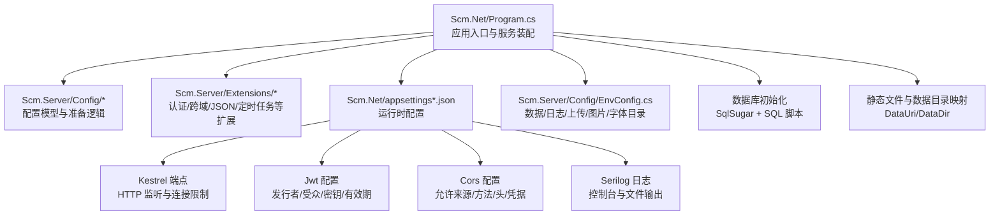
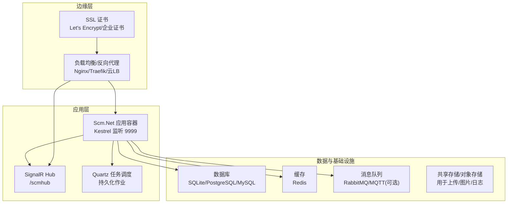
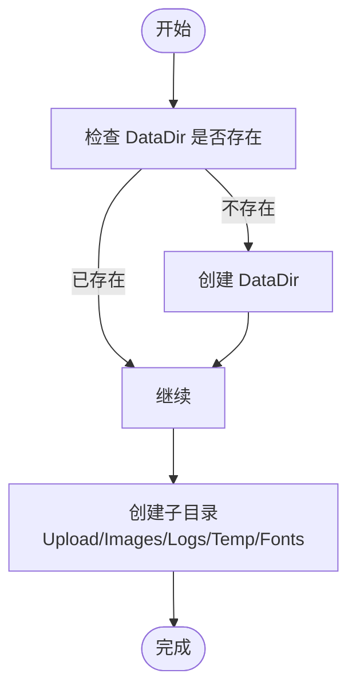
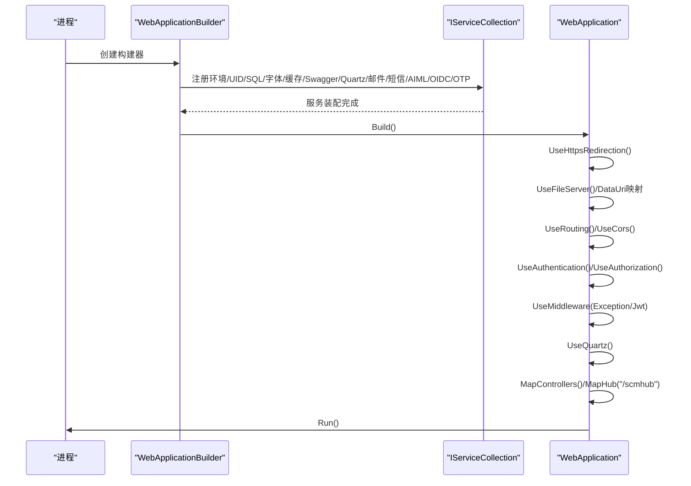
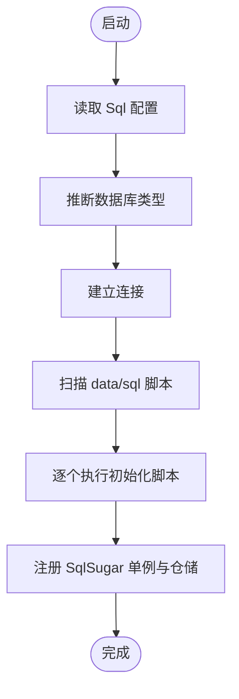
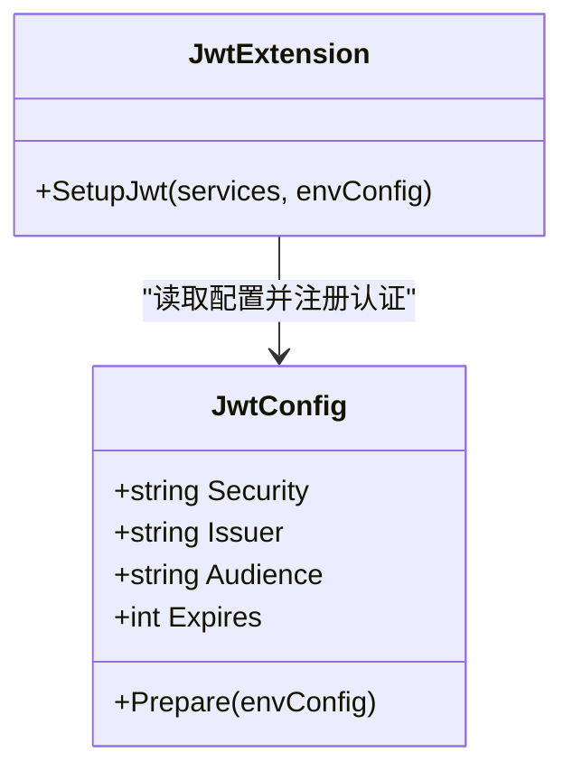
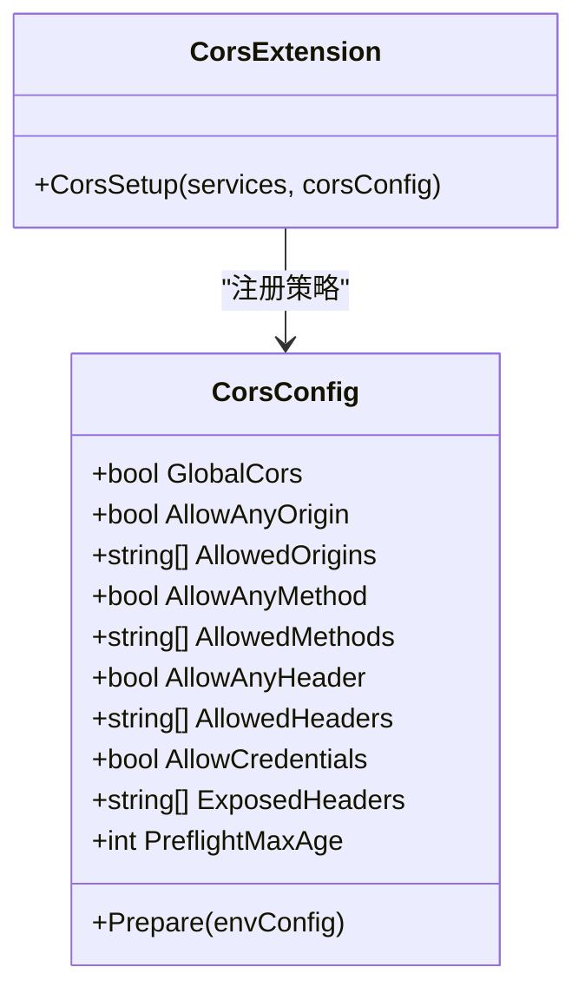
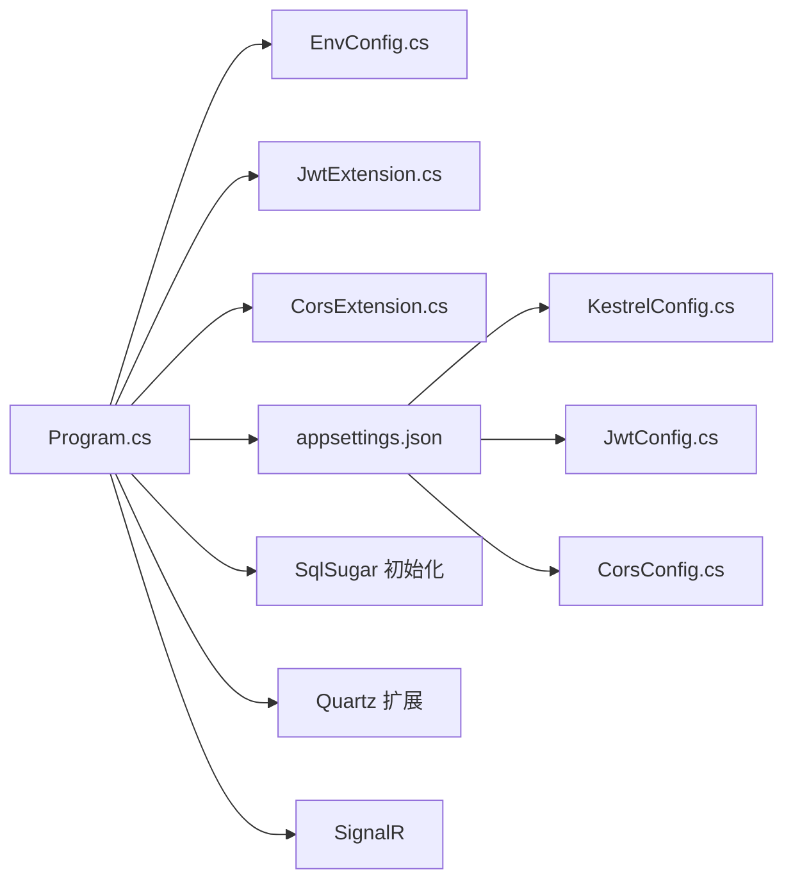

# 部署指南

<cite>
**本文引用的文件**
- [Scm.Net/appsettings.json](file://Scm.Net/appsettings.json)
- [Scm.Net/appsettings.Development.json](file://Scm.Net/appsettings.Development.json)
- [Scm.Net/Program.cs](file://Scm.Net/Program.cs)
- [Scm.Net/readme.txt](file://Scm.Net/readme.txt)
- [Scm.Server/Config/EnvConfig.cs](file://Scm.Server/Config/EnvConfig.cs)
- [Scm.Server/Config/KestrelConfig.cs](file://Scm.Server/Config/KestrelConfig.cs)
- [Scm.Server/Config/JwtConfig.cs](file://Scm.Server/Config/JwtConfig.cs)
- [Scm.Server/Config/CorsConfig.cs](file://Scm.Server/Config/CorsConfig.cs)
- [Scm.Server/Extensions/JwtExtension.cs](file://Scm.Server/Extensions/JwtExtension.cs)
- [Scm.Server/Extensions/CorsExtension.cs](file://Scm.Server/Extensions/CorsExtension.cs)
- [Scm.Server/Extensions/SystemJsonExtension.cs](file://Scm.Server/Extensions/SystemJsonExtension.cs)
- [Scm.Server/Extensions/NewtonJsonExtension.cs](file://Scm.Server/Extensions/NewtonJsonExtension.cs)
</cite>

## 目录
1. [简介](#简介)
2. [项目结构](#项目结构)
3. [核心组件](#核心组件)
4. [架构总览](#架构总览)
5. [详细组件分析](#详细组件分析)
6. [依赖关系分析](#依赖关系分析)
7. [性能考虑](#性能考虑)
8. [故障排除指南](#故障排除指南)
9. [结论](#结论)
10. [附录](#附录)

## 简介
本指南面向生产环境部署 Scm.Net 的工程团队与运维人员，覆盖从服务器硬件与操作系统准备、网络与安全配置，到应用部署、数据库初始化、配置文件设置、容器化与 Kubernetes 集群部署策略，以及负载均衡、SSL 证书、监控告警、性能调优、备份恢复与灾难恢复、部署后验证与故障排除等完整流程。文档基于仓库中的配置与启动逻辑进行梳理，确保部署步骤与代码实现保持一致。

## 项目结构
Scm.Net 作为 ASP.NET Core 应用，采用多项目分层组织，核心运行时位于 Scm.Net 项目，配置与扩展集中在 Scm.Server 及其子模块中。生产部署关注以下关键点：
- 配置文件：appsettings.json 与环境特定配置
- 启动入口：Program.cs 中的构建、注册与中间件装配
- 环境与数据目录：EnvConfig 对数据、日志、上传、图片、字体等目录的解析与创建
- 服务与中间件：Kestrel 端点、JWT 认证授权、跨域、Serilog 日志、SignalR、Quartz 定时任务等

图表来源
- [Scm.Net/Program.cs:31-258](file://Scm.Net/Program.cs#L31-L258)
- [Scm.Server/Config/EnvConfig.cs:72-120](file://Scm.Server/Config/EnvConfig.cs#L72-L120)
- [Scm.Net/appsettings.json:26-38](file://Scm.Net/appsettings.json#L26-L38)
- [Scm.Net/appsettings.json:100-105](file://Scm.Net/appsettings.json#L100-L105)
- [Scm.Net/appsettings.json:115-126](file://Scm.Net/appsettings.json#L115-L126)

章节来源
- [Scm.Net/Program.cs:31-258](file://Scm.Net/Program.cs#L31-L258)
- [Scm.Server/Config/EnvConfig.cs:72-120](file://Scm.Server/Config/EnvConfig.cs#L72-L120)
- [Scm.Net/appsettings.json:1-127](file://Scm.Net/appsettings.json#L1-L127)

## 核心组件
- 配置体系
  - Kestrel 端点与连接限制：用于监听 HTTP 端口与并发连接上限、请求体大小限制
  - JWT：发行者、受众、密钥与有效期
  - CORS：全局策略、允许来源、方法、头、凭据与预检缓存
  - Serilog：最小日志级别、控制台与文件输出、滚动策略
  - 环境与数据目录：数据根目录、上传、图片、日志、临时、字体等
- 启动装配
  - 环境准备、UID/SQL 初始化、字体加载、缓存、Swagger、Quartz、邮件、短信、Aiml、OIDC、OTP、跨域、JWT、SignalR、Mapper、中间件链路
- 数据库初始化
  - 基于 SqlSugar 的数据库连接与脚本初始化，支持 SQLite/其他数据库类型

章节来源
- [Scm.Net/appsettings.json:26-38](file://Scm.Net/appsettings.json#L26-L38)
- [Scm.Net/appsettings.json:100-105](file://Scm.Net/appsettings.json#L100-L105)
- [Scm.Net/appsettings.json:115-126](file://Scm.Net/appsettings.json#L115-L126)
- [Scm.Net/Program.cs:47-100](file://Scm.Net/Program.cs#L47-L100)
- [Scm.Net/Program.cs:282-356](file://Scm.Net/Program.cs#L282-L356)

## 架构总览
生产部署建议采用“反向代理 + 应用容器 + 数据库/缓存/消息队列”三层架构。反向代理负责 SSL 终止、健康检查、限流与灰度；应用容器承载 Web API 与 SignalR；数据库与缓存独立部署并由应用通过连接字符串访问。

图表来源
- [Scm.Net/appsettings.json:26-38](file://Scm.Net/appsettings.json#L26-L38)
- [Scm.Net/Program.cs:237-238](file://Scm.Net/Program.cs#L237-L238)
- [Scm.Net/appsettings.json:48-60](file://Scm.Net/appsettings.json#L48-L60)

## 详细组件分析

### 1) 环境与数据目录准备（生产）
- 数据目录与映射
  - 生产环境建议将数据目录置于独立挂载盘，避免与应用镜像耦合
  - DataDir 为数据根目录，DataUri 为对外访问的虚拟路径
  - 上传、图片、日志、临时、字体等子目录在 DataDir 下自动创建
- 目录权限
  - 应用进程对 DataDir 及子目录具备读写权限
  - 日志目录需具备滚动写入能力
- 静态资源映射
  - 通过 DataUri/DataDir 将物理目录暴露为 Web 资源

图表来源
- [Scm.Server/Config/EnvConfig.cs:72-120](file://Scm.Server/Config/EnvConfig.cs#L72-L120)
- [Scm.Server/Config/EnvConfig.cs:122-172](file://Scm.Server/Config/EnvConfig.cs#L122-L172)

章节来源
- [Scm.Server/Config/EnvConfig.cs:72-120](file://Scm.Server/Config/EnvConfig.cs#L72-L120)
- [Scm.Server/Config/EnvConfig.cs:122-172](file://Scm.Server/Config/EnvConfig.cs#L122-L172)

### 2) 应用启动与服务装配（生产）
- 关键装配顺序
  - 环境配置 → UID/SQL 初始化 → 字体 → 缓存 → Swagger → Quartz → 邮件/短信/AIML/OIDC/OTP → 跨域 → JWT → SignalR → Mapper → 中间件链路 → 控制器/Hubs 映射
- 中间件链路
  - HTTPS 重定向 → 静态文件/数据目录映射 → 路由 → 跨域 → 请求缓冲 → 认证/授权 → 异常中间件 → Quartz → 控制器 → SignalR Hub
- Kestrel 端点
  - 生产建议显式配置监听地址与端口，避免使用通配符绑定
  - 连接限制与请求体大小按业务峰值评估配置

图表来源
- [Scm.Net/Program.cs:47-100](file://Scm.Net/Program.cs#L47-L100)
- [Scm.Net/Program.cs:174-258](file://Scm.Net/Program.cs#L174-L258)

章节来源
- [Scm.Net/Program.cs:47-100](file://Scm.Net/Program.cs#L47-L100)
- [Scm.Net/Program.cs:174-258](file://Scm.Net/Program.cs#L174-L258)

### 3) 数据库初始化（生产）
- 连接与类型
  - 通过配置项指定数据库类型与连接字符串
  - 支持 SQLite/其他数据库类型，SqlSugar 会根据类型调整枚举与长整型映射
- 脚本初始化
  - 从 data/sql 目录加载脚本，初始化核心模块、示例模块与 NAS 模块
- 建议
  - 生产使用独立数据库实例，连接字符串通过环境变量注入
  - 使用只读账户用于查询，写入账户用于写操作

图表来源
- [Scm.Net/Program.cs:282-356](file://Scm.Net/Program.cs#L282-L356)
- [Scm.Net/appsettings.json:48-51](file://Scm.Net/appsettings.json#L48-L51)

章节来源
- [Scm.Net/Program.cs:282-356](file://Scm.Net/Program.cs#L282-L356)
- [Scm.Net/appsettings.json:48-51](file://Scm.Net/appsettings.json#L48-L51)

### 4) 认证与授权（JWT）（生产）
- 配置要点
  - 密钥、发行者、受众、有效期均需在生产中严格管理
  - JWT 中间件从请求头提取令牌并与认证方案联动
- 安全建议
  - 密钥长度与熵足够高，定期轮换
  - 传输通道启用 HTTPS，避免明文泄露
  - 令牌有效期按业务场景权衡，结合刷新令牌策略

图表来源
- [Scm.Server/Config/JwtConfig.cs:28-47](file://Scm.Server/Config/JwtConfig.cs#L28-L47)
- [Scm.Server/Extensions/JwtExtension.cs:14-71](file://Scm.Server/Extensions/JwtExtension.cs#L14-L71)

章节来源
- [Scm.Server/Config/JwtConfig.cs:28-47](file://Scm.Server/Config/JwtConfig.cs#L28-L47)
- [Scm.Server/Extensions/JwtExtension.cs:14-71](file://Scm.Server/Extensions/JwtExtension.cs#L14-L71)

### 5) 跨域配置（CORS）（生产）
- 策略选择
  - 全局策略或按需策略；允许来源、方法、头、凭据与预检缓存
- 生产建议
  - 明确白名单来源，避免 AllowAnyOrigin
  - 凭据开启时需指定具体来源而非通配

图表来源
- [Scm.Server/Config/CorsConfig.cs:24-46](file://Scm.Server/Config/CorsConfig.cs#L24-L46)
- [Scm.Server/Extensions/CorsExtension.cs:8-56](file://Scm.Server/Extensions/CorsExtension.cs#L8-L56)

章节来源
- [Scm.Server/Config/CorsConfig.cs:24-46](file://Scm.Server/Config/CorsConfig.cs#L24-L46)
- [Scm.Server/Extensions/CorsExtension.cs:8-56](file://Scm.Server/Extensions/CorsExtension.cs#L8-L56)

### 6) 日志与 JSON 序列化（生产）
- 日志
  - 使用 Serilog 输出到控制台与文件，按天滚动
- JSON
  - 提供 System.Text.Json 与 Newtonsoft.Json 扩展，统一日期与数值序列化行为

章节来源
- [Scm.Net/appsettings.json:3-25](file://Scm.Net/appsettings.json#L3-L25)
- [Scm.Server/Extensions/SystemJsonExtension.cs:11-22](file://Scm.Server/Extensions/SystemJsonExtension.cs#L11-L22)
- [Scm.Server/Extensions/NewtonJsonExtension.cs:10-33](file://Scm.Server/Extensions/NewtonJsonExtension.cs#L10-L33)

### 7) 静态文件与数据目录映射（生产）
- 通过 DataUri/DataDir 将物理目录暴露为 Web 资源，便于前端或外部系统访问上传/图片/模板等静态资产
- 建议将敏感目录置于不可直接访问的路径，仅通过受控接口访问

章节来源
- [Scm.Net/Program.cs:194-201](file://Scm.Net/Program.cs#L194-L201)
- [Scm.Server/Config/EnvConfig.cs:174-177](file://Scm.Server/Config/EnvConfig.cs#L174-L177)

### 8) SignalR 与 Quartz（生产）
- SignalR
  - 暴露 /scmhub Hub，生产需配合反向代理 WebSocket 支持
- Quartz
  - 通过扩展注册与中间件启用，生产建议使用持久化存储与集群化配置

章节来源
- [Scm.Net/Program.cs:166-169](file://Scm.Net/Program.cs#L166-L169)
- [Scm.Net/Program.cs:235-238](file://Scm.Net/Program.cs#L235-L238)

## 依赖关系分析
- 组件耦合
  - Program.cs 依赖配置模型与扩展方法，形成清晰的装配链
  - EnvConfig 为数据目录提供统一解析与路径拼装
  - JWT/CORS 扩展分别注册认证与跨域策略
- 外部依赖
  - 数据库：SqlSugar + 连接字符串
  - 缓存：Redis 连接字符串
  - 定时任务：Quartz 配置与持久化
  - 日志：Serilog 控制台与文件

图表来源
- [Scm.Net/Program.cs:47-100](file://Scm.Net/Program.cs#L47-L100)
- [Scm.Server/Config/EnvConfig.cs:72-120](file://Scm.Server/Config/EnvConfig.cs#L72-L120)
- [Scm.Server/Extensions/JwtExtension.cs:14-71](file://Scm.Server/Extensions/JwtExtension.cs#L14-L71)
- [Scm.Server/Extensions/CorsExtension.cs:8-56](file://Scm.Server/Extensions/CorsExtension.cs#L8-L56)
- [Scm.Net/appsettings.json:26-38](file://Scm.Net/appsettings.json#L26-L38)
- [Scm.Net/appsettings.json:100-105](file://Scm.Net/appsettings.json#L100-L105)
- [Scm.Net/appsettings.json:115-126](file://Scm.Net/appsettings.json#L115-L126)

章节来源
- [Scm.Net/Program.cs:47-100](file://Scm.Net/Program.cs#L47-L100)
- [Scm.Server/Config/EnvConfig.cs:72-120](file://Scm.Server/Config/EnvConfig.cs#L72-L120)
- [Scm.Server/Extensions/JwtExtension.cs:14-71](file://Scm.Server/Extensions/JwtExtension.cs#L14-L71)
- [Scm.Server/Extensions/CorsExtension.cs:8-56](file://Scm.Server/Extensions/CorsExtension.cs#L8-L56)
- [Scm.Net/appsettings.json:26-38](file://Scm.Net/appsettings.json#L26-L38)
- [Scm.Net/appsettings.json:100-105](file://Scm.Net/appsettings.json#L100-L105)
- [Scm.Net/appsettings.json:115-126](file://Scm.Net/appsettings.json#L115-L126)

## 性能考虑
- Kestrel 连接与请求体限制
  - 根据并发与文件上传峰值调整 MaxConcurrentConnections 与 MaxRequestBodySize
- 数据库
  - 使用连接池与只读/写分离策略；索引与查询优化
- 缓存
  - Redis 连接池大小与超时合理配置
- 日志
  - 生产环境最小日志级别为 Information，避免高频 Debug
- JSON
  - 统一序列化策略，减少字段冗余与循环引用

章节来源
- [Scm.Net/appsettings.json:34-37](file://Scm.Net/appsettings.json#L34-L37)
- [Scm.Server/Extensions/SystemJsonExtension.cs:11-22](file://Scm.Server/Extensions/SystemJsonExtension.cs#L11-L22)
- [Scm.Server/Extensions/NewtonJsonExtension.cs:10-33](file://Scm.Server/Extensions/NewtonJsonExtension.cs#L10-L33)

## 故障排除指南
- 启动失败
  - 检查 DataDir 权限与可用空间
  - 确认数据库连接字符串与可达性
- 认证失败
  - 核对 JWT 密钥、发行者、受众与有效期
  - 确保传输通道为 HTTPS
- 跨域问题
  - 检查 AllowedOrigins 与 AllowCredentials 配置
- 日志无输出
  - 确认 Serilog 配置与文件路径可写
- 静态资源无法访问
  - 检查 DataUri 与 DataDir 映射是否正确

章节来源
- [Scm.Net/Program.cs:194-201](file://Scm.Net/Program.cs#L194-L201)
- [Scm.Net/appsettings.json:3-25](file://Scm.Net/appsettings.json#L3-L25)
- [Scm.Server/Config/JwtConfig.cs:28-47](file://Scm.Server/Config/JwtConfig.cs#L28-L47)
- [Scm.Server/Config/CorsConfig.cs:24-46](file://Scm.Server/Config/CorsConfig.cs#L24-L46)

## 结论
本指南基于仓库中的配置与启动逻辑，给出了生产环境部署的完整路线图。通过明确的目录规划、严格的认证与跨域策略、合理的数据库与缓存配置、完善的日志与监控，以及容器化与集群化部署策略，可确保 Scm.Net 在生产环境中稳定、安全、可扩展地运行。

## 附录

### A. 生产环境部署步骤清单
- 服务器与操作系统
  - CPU/内存/磁盘容量满足业务峰值与增长预期
  - 操作系统版本与 .NET 运行时版本兼容
- 网络与安全
  - 开放端口：反向代理端口、应用端口（如 9999）、数据库端口
  - 启用防火墙规则与 WAF
  - 证书管理：生产使用企业证书或 Let’s Encrypt
- 应用部署
  - 准备 DataDir 与子目录，赋予应用进程读写权限
  - 设置环境变量注入数据库/缓存/邮件等敏感配置
  - 构建并发布应用，配置 Kestrel 监听地址与连接限制
- 数据库初始化
  - 确认数据库可达与权限正确
  - 首次启动触发脚本初始化
- 配置文件设置
  - appsettings.json 中的 Kestrel/JWT/CORS/Serilog/Sql/Cache 等项按生产要求调整
- 负载均衡与 SSL
  - 反向代理配置健康检查、超时与重试
  - SSL 终止与证书续期自动化
- 监控告警
  - 指标：CPU/内存/磁盘/连接数/错误率/响应时间
  - 日志：集中采集与检索
  - 告警：阈值与分级通知
- 性能调优
  - 数据库连接池、缓存命中率、日志级别、JSON 序列化策略
- 备份与灾难恢复
  - 数据库快照/增量备份、数据目录快照、配置与证书备份
  - 灾备演练与回切流程
- 部署后验证
  - 健康检查、登录认证、静态资源访问、上传下载、定时任务执行
- 故障排除
  - 快速定位日志、配置与网络问题

章节来源
- [Scm.Net/appsettings.json:1-127](file://Scm.Net/appsettings.json#L1-L127)
- [Scm.Net/appsettings.Development.json:1-162](file://Scm.Net/appsettings.Development.json#L1-L162)
- [Scm.Net/readme.txt:1-14](file://Scm.Net/readme.txt#L1-L14)

### B. Docker 容器化部署要点
- 镜像构建
  - 基于官方 .NET 运行时镜像，COPY 发布产物
  - 挂载 DataDir 到宿主机或卷，避免镜像内写入
- 容器编排
  - 使用 docker-compose 或 Kubernetes Deployment
  - 暴露应用端口，映射到反向代理
- 环境变量
  - 通过环境变量注入数据库/缓存/邮件等敏感配置
- 健康检查
  - HTTP GET /health 或 /swagger
- 日志
  - stdout/stderr 由容器平台收集，或挂载日志目录

### C. Kubernetes 集群部署策略
- 资源对象
  - Deployment：副本数、滚动更新策略
  - Service：ClusterIP/NodePort/LoadBalancer
  - ConfigMap：非敏感配置
  - Secret：数据库/缓存/邮件等敏感信息
  - PersistentVolume/PersistentVolumeClaim：DataDir 数据持久化
- Ingress
  - Nginx/Traefik Ingress 控制器，配置 TLS 与路由规则
- HPA/VPA
  - 根据 CPU/内存指标自动扩缩容
- 网络策略
  - 限制入站/出站流量，隔离命名空间

### D. 配置项对照表（生产建议）
- Kestrel
  - Endpoints.Http.Url：生产使用具体 IP 与端口
  - Limits.MaxConcurrentConnections/MaxRequestBodySize：按业务峰值调整
- JWT
  - Security/IUssuer/Audience/Expires：生产严格保密与轮换
- CORS
  - GlobalCors/AllowedOrigins/AllowCredentials：最小化白名单
- Serilog
  - 最小日志级别：Information
  - 文件路径：挂载卷或专用磁盘
- Sql/Cache
  - 连接字符串：通过 Secret 注入
  - 连接池大小：按并发与 RT 调整
- Env
  - DataDir/DataUri：独立挂载盘
  - Upload/Images/Logs/Temp/Fonts：自动创建并赋权

章节来源
- [Scm.Net/appsettings.json:26-38](file://Scm.Net/appsettings.json#L26-L38)
- [Scm.Net/appsettings.json:100-105](file://Scm.Net/appsettings.json#L100-L105)
- [Scm.Net/appsettings.json:115-126](file://Scm.Net/appsettings.json#L115-L126)
- [Scm.Net/appsettings.json:3-25](file://Scm.Net/appsettings.json#L3-L25)
- [Scm.Net/appsettings.json:48-60](file://Scm.Net/appsettings.json#L48-L60)
- [Scm.Server/Config/EnvConfig.cs:72-120](file://Scm.Server/Config/EnvConfig.cs#L72-L120)